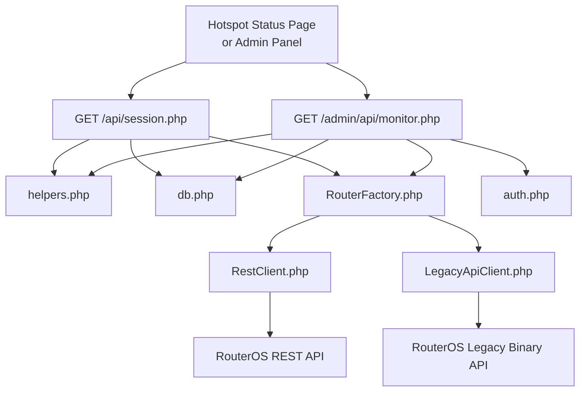
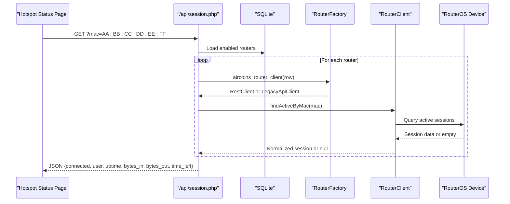
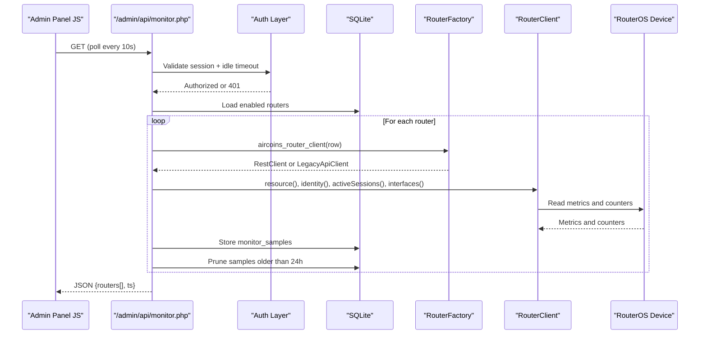
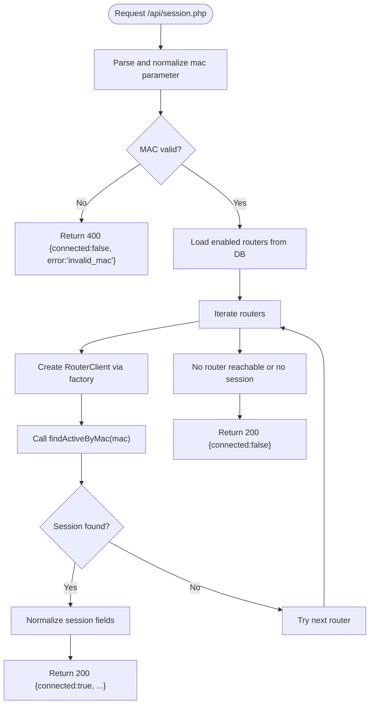
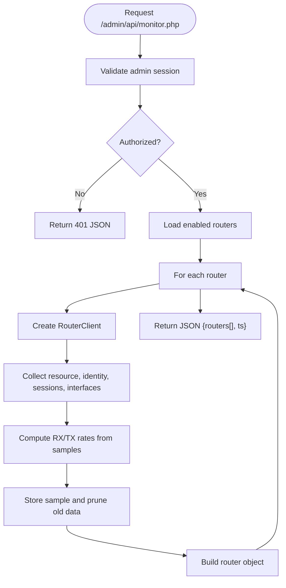
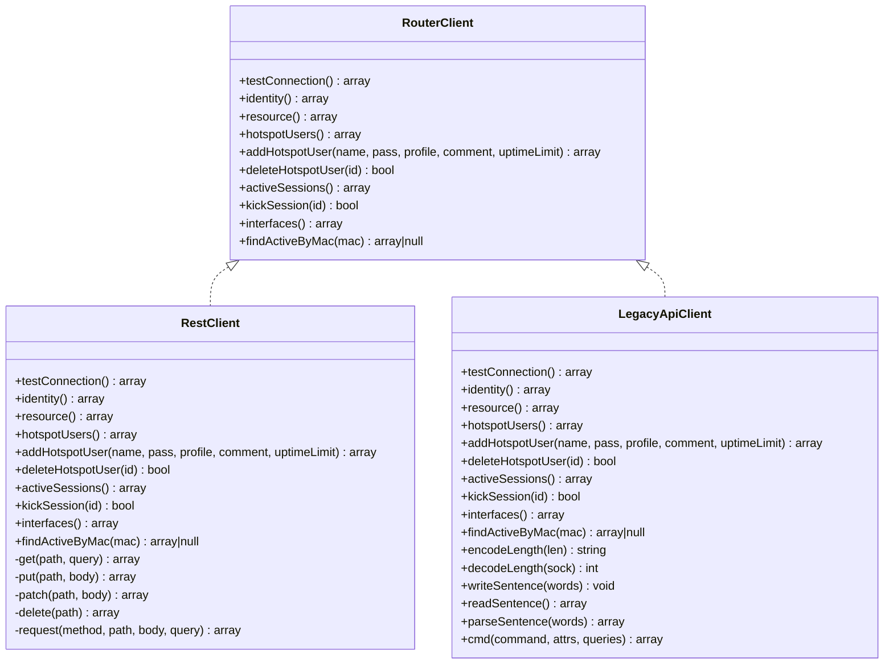
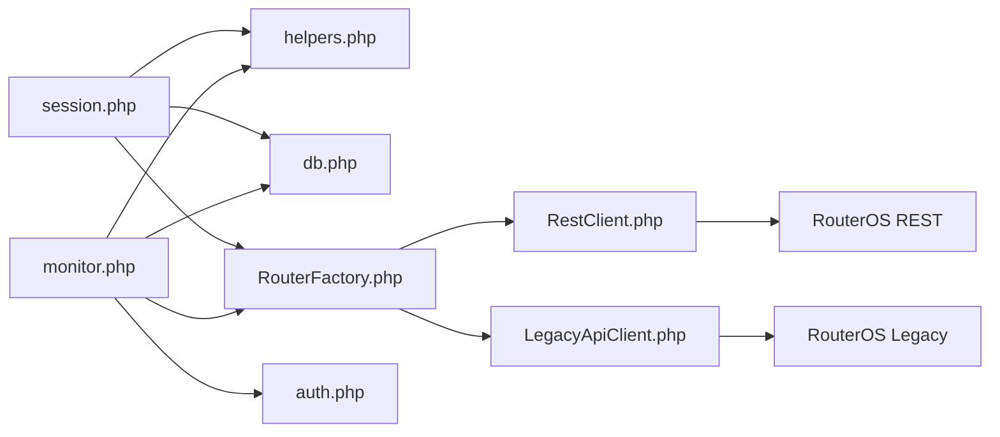

# API Reference

<cite>
**Referenced Files in This Document**
- [session.php](file://api/session.php)
- [monitor.php](file://admin/api/monitor.php)
- [RouterClientInterface.php](file://includes/RouterOS/RouterClientInterface.php)
- [RestClient.php](file://includes/RouterOS/RestClient.php)
- [LegacyApiClient.php](file://includes/RouterOS/LegacyApiClient.php)
- [RouterFactory.php](file://includes/RouterOS/RouterFactory.php)
- [helpers.php](file://includes/helpers.php)
- [auth.php](file://includes/auth.php)
- [db.php](file://includes/db.php)
- [crypto.php](file://includes/crypto.php)
</cite>

## Table of Contents
1. [Introduction](#introduction)
2. [Project Structure](#project-structure)
3. [Core Components](#core-components)
4. [Architecture Overview](#architecture-overview)
5. [Detailed Component Analysis](#detailed-component-analysis)
6. [Dependency Analysis](#dependency-analysis)
7. [Performance Considerations](#performance-considerations)
8. [Troubleshooting Guide](#troubleshooting-guide)
9. [Conclusion](#conclusion)

## Introduction
This document describes the public and internal APIs of the MT-CONTROLLER-PISOWIFI system, focusing on:
- The portal-facing Session API used by the hotspot status page.
- The internal monitoring API consumed by the admin panel.
- The RouterOS integration layer supporting both REST and Legacy binary protocols.
- Error handling patterns, response formats, authentication requirements, security considerations, rate limiting, and performance guidance for API consumers.

The system is a PHP application that reads router configuration from SQLite, connects to MikroTik RouterOS devices through either the v7 REST API or the legacy binary API, and exposes JSON endpoints for session lookup and live monitoring.

## Project Structure
The relevant parts for this API reference are:
- `api/session.php`: Portal-facing session lookup endpoint.
- `admin/api/monitor.php`: Internal admin monitoring feed.
- `includes/RouterOS/*`: RouterOS client abstraction and implementations.
- `includes/helpers.php`, `includes/auth.php`, `includes/db.php`, `includes/crypto.php`: Shared helpers, authentication, database schema, and credential encryption.

**Diagram sources**
- [session.php:23-25](file://api/session.php#L23-L25)
- [monitor.php:21-24](file://admin/api/monitor.php#L21-L24)
- [RouterFactory.php:12-15](file://includes/RouterOS/RouterFactory.php#L12-L15)
- [RestClient.php:22](file://includes/RouterOS/RestClient.php#L22)
- [LegacyApiClient.php:20](file://includes/RouterOS/LegacyApiClient.php#L20)

**Section sources**
- [session.php:1-107](file://api/session.php#L1-L107)
- [monitor.php:1-188](file://admin/api/monitor.php#L1-L188)
- [RouterFactory.php:1-56](file://includes/RouterOS/RouterFactory.php#L1-L56)

## Core Components
This section summarizes the main API surfaces and their responsibilities.

### Session API
- Endpoint: `GET /api/session.php`
- Purpose: Return whether a given MAC address currently has an active hotspot session on any enabled router.
- Authentication: None. Intended for the SBC-served status page polling with the caller’s own MAC.
- CORS: Opened (`Access-Control-Allow-Origin: *`) for this endpoint only.
- Response format: JSON via shared helper.

Key behaviors:
- Accepts a `mac` query parameter; normalizes it to uppercase colon-separated form.
- Iterates enabled routers and queries each RouterOS client until one returns an active session.
- Returns a normalized session shape including connection state, user, uptime, bytes in/out, and optional time left.

**Section sources**
- [session.php:1-107](file://api/session.php#L1-L107)
- [helpers.php:22-38](file://includes/helpers.php#L22-L38)

### Monitoring API
- Endpoint: `GET /admin/api/monitor.php`
- Purpose: Provide real-time metrics for all enabled routers, including identity, resource usage, active session count, and per-interface traffic rates.
- Authentication: Requires an authenticated admin session; unauthenticated requests receive a JSON 401 response.
- Rate limiting: Uses session idle timeout; expired sessions are destroyed and return a JSON error.
- Data persistence: Stores interface byte counters in `monitor_samples` and prunes samples older than 24 hours.

Key behaviors:
- Validates admin session and existence of the admin record.
- For each enabled router, calls RouterOS client methods to collect resource, identity, active sessions, and interfaces.
- Computes per-interface RX/TX rates using previous samples and current counters.
- Returns a JSON object containing router list and timestamp.

**Section sources**
- [monitor.php:1-188](file://admin/api/monitor.php#L1-L188)
- [auth.php:65-83](file://includes/auth.php#L65-L83)
- [db.php:103-116](file://includes/db.php#L103-L116)

### RouterOS Client Abstraction Layer
The system abstracts RouterOS communication behind a single interface so callers do not need to know whether a device uses REST or Legacy protocol.

- Interface: `RouterClient` defines unified methods such as `testConnection`, `identity`, `resource`, `hotspotUsers`, `addHotspotUser`, `deleteHotspotUser`, `activeSessions`, `kickSession`, `interfaces`, and `findActiveByMac`.
- Implementations:
  - `RestClient`: Implements RouterOS v7 REST API over HTTPS with HTTP Basic auth and JSON payloads.
  - `LegacyApiClient`: Implements RouterOS legacy binary API over TCP/TLS port 8728/8729 with dual-mode login (plaintext or challenge-response).
- Factory: `aircoins_router_client` selects implementation based on router configuration and decrypts credentials in memory.

Return-value conventions are consistent across implementations, ensuring stable contracts for admin and portal layers.

**Section sources**
- [RouterClientInterface.php:1-100](file://includes/RouterOS/RouterClientInterface.php#L1-L100)
- [RestClient.php:1-416](file://includes/RouterOS/RestClient.php#L1-L416)
- [LegacyApiClient.php:1-623](file://includes/RouterOS/LegacyApiClient.php#L1-L623)
- [RouterFactory.php:1-56](file://includes/RouterOS/RouterFactory.php#L1-L56)

## Architecture Overview
The API architecture separates concerns between HTTP endpoints, shared helpers, database access, and RouterOS clients.

**Diagram sources**
- [session.php:58-83](file://api/session.php#L58-L83)
- [RouterFactory.php:29-55](file://includes/RouterOS/RouterFactory.php#L29-L55)
- [RestClient.php:171-179](file://includes/RouterOS/RestClient.php#L171-L179)
- [LegacyApiClient.php:547-555](file://includes/RouterOS/LegacyApiClient.php#L547-L555)

**Diagram sources**
- [monitor.php:29-50](file://admin/api/monitor.php#L29-L50)
- [monitor.php:106-187](file://admin/api/monitor.php#L106-L187)
- [RouterFactory.php:29-55](file://includes/RouterOS/RouterFactory.php#L29-L55)

## Detailed Component Analysis

### Session API Specification
- URL: `/api/session.php`
- Method: `GET`
- Query Parameters:
  - `mac`: Client MAC address. Accepts separators `:` `-` `.` or none; normalized to uppercase colon-separated form.
- Authentication: None.
- CORS: Enabled with wildcard origin.
- Success Response (200):
  - When connected: `{connected: true, user: string, uptime: string, bytes_in: int, bytes_out: int, time_left: string|null}`
  - When not connected: `{connected: false}`
- Error Response (400):
  - Invalid or missing MAC: `{connected: false, error: "invalid_mac"}`
- Behavior Notes:
  - If database or setup fails, returns `{connected: false}` without leaking details.
  - Skips unreachable routers silently and continues scanning others.
  - `time_left` may be null; the portal can fall back to its own snapshot.

**Diagram sources**
- [session.php:40-56](file://api/session.php#L40-L56)
- [session.php:58-87](file://api/session.php#L58-L87)
- [session.php:89-106](file://api/session.php#L89-L106)

**Section sources**
- [session.php:1-107](file://api/session.php#L1-L107)
- [helpers.php:22-38](file://includes/helpers.php#L22-L38)

### Monitoring API Specification
- URL: `/admin/api/monitor.php`
- Method: `GET`
- Authentication: Required. Uses hardened admin session with idle timeout.
- Response Format: JSON with array of router objects and a timestamp.
- Router Object Fields:
  - `id`: integer
  - `name`: string
  - `api_type`: string (`rest` or `legacy`)
  - `online`: boolean
  - `identity`: string or null
  - `resource`: object with CPU load, memory, uptime, version, board name
  - `active_count`: integer
  - `interfaces`: array of interface objects with name, running, rx_rate, tx_rate
  - `error`: string or null
- Timestamp: `ts` field indicates server time when the response was generated.

Authentication Flow:
- Starts session and checks for `user_id`.
- Verifies admin exists in database.
- Enforces idle timeout; destroys session and returns JSON 401 if expired.

Metrics Collection:
- Reads resource and identity from RouterOS.
- Counts active sessions.
- Reads interface counters and computes RX/TX rates by diffing against previous samples.
- Persists samples and prunes old entries.

**Diagram sources**
- [monitor.php:29-50](file://admin/api/monitor.php#L29-L50)
- [monitor.php:106-187](file://admin/api/monitor.php#L106-L187)

**Section sources**
- [monitor.php:1-188](file://admin/api/monitor.php#L1-L188)
- [auth.php:65-83](file://includes/auth.php#L65-L83)
- [db.php:103-116](file://includes/db.php#L103-L116)

### RouterOS Client Abstraction Layer

#### Interface Contract
The `RouterClient` interface defines a consistent contract for both REST and Legacy implementations. Key methods include:
- `testConnection()`: Probes reachability and credentials.
- `identity()`: Returns router identity.
- `resource()`: Returns CPU, memory, uptime, version, board name.
- `hotspotUsers()`: Lists hotspot users.
- `addHotspotUser()`: Creates a hotspot user.
- `deleteHotspotUser()`: Removes a hotspot user.
- `activeSessions()`: Lists active sessions.
- `kickSession()`: Disconnects a session.
- `interfaces()`: Lists interfaces with traffic counters.
- `findActiveByMac()`: Finds active session by MAC.

**Diagram sources**
- [RouterClientInterface.php:28-99](file://includes/RouterOS/RouterClientInterface.php#L28-L99)
- [RestClient.php:24-179](file://includes/RouterOS/RestClient.php#L24-L179)
- [LegacyApiClient.php:22-555](file://includes/RouterOS/LegacyApiClient.php#L22-L555)

#### REST Client Implementation
- Protocol: RouterOS v7 REST API over HTTPS.
- Authentication: HTTP Basic with username/password.
- Request Mapping:
  - GET -> print
  - PUT -> add
  - PATCH -> set
  - DELETE -> remove
  - POST -> command
- Response Handling:
  - All values returned as strings; cast to appropriate types.
  - `.id` values appended raw to paths.
- Error Handling:
  - Throws `RuntimeException` on transport failures or HTTP >= 400.
  - Builds descriptive error messages from response fields.

**Section sources**
- [RestClient.php:1-416](file://includes/RouterOS/RestClient.php#L1-L416)

#### Legacy Client Implementation
- Protocol: RouterOS legacy binary API over TCP (8728) or TLS (8729).
- Authentication: Dual-mode login supports plaintext and challenge-response for older firmware.
- Sentence Protocol:
  - Length-prefixed words terminated by zero-length word.
  - Replies tagged `!re`, `!done`, `!trap`, `!fatal`.
- Command Execution:
  - Sends commands and collects records.
  - Parses replies into associative attribute maps.
- Error Handling:
  - Throws `RuntimeException` on trap/fatal responses or I/O errors.

**Section sources**
- [LegacyApiClient.php:1-623](file://includes/RouterOS/LegacyApiClient.php#L1-L623)

#### Factory
- Selects implementation based on `api_type` in router configuration.
- Decrypts password in memory using shared crypto module.
- Returns connected client instance.

**Section sources**
- [RouterFactory.php:1-56](file://includes/RouterOS/RouterFactory.php#L1-L56)
- [crypto.php:1-138](file://includes/crypto.php#L1-L138)

## Dependency Analysis
The system has clear separation between HTTP endpoints, shared utilities, database layer, and RouterOS clients.

**Diagram sources**
- [session.php:23-25](file://api/session.php#L23-L25)
- [monitor.php:21-24](file://admin/api/monitor.php#L21-L24)
- [RouterFactory.php:12-15](file://includes/RouterOS/RouterFactory.php#L12-L15)

**Section sources**
- [session.php:23-25](file://api/session.php#L23-L25)
- [monitor.php:21-24](file://admin/api/monitor.php#L21-L24)
- [RouterFactory.php:12-15](file://includes/RouterOS/RouterFactory.php#L12-L15)

## Performance Considerations
- Session API:
  - Iterates enabled routers sequentially; consider caching router connectivity status if latency becomes an issue.
  - Avoid excessive polling frequency from the status page to reduce load on routers and database.
- Monitoring API:
  - Polling interval is typically 10 seconds; adjust based on network size and desired responsiveness.
  - Sample pruning keeps `monitor_samples` bounded; ensure sufficient disk space for retention.
- RouterOS Clients:
  - REST client uses cURL with timeouts; tune connection and request timeouts if needed.
  - Legacy client maintains persistent sockets per client instance; reuse clients where possible to avoid repeated handshakes.
- Database:
  - SQLite WAL mode improves concurrency; ensure proper file permissions and disk I/O performance.
  - Indexes exist for login attempts and monitor samples; monitor query performance under load.

[No sources needed since this section provides general guidance]

## Troubleshooting Guide
Common issues and resolution strategies:

- Session API returns invalid MAC:
  - Ensure MAC is provided in correct format; the endpoint normalizes various separator styles.
  - Check browser console for CORS errors; the endpoint allows wildcard origins but verify your frontend policy.

- Monitoring API returns unauthorized:
  - Verify admin session is active and not expired.
  - Check session cookie settings and TLS configuration.

- Router connectivity failures:
  - REST client throws exceptions on HTTP errors; check router REST API availability and credentials.
  - Legacy client throws exceptions on socket or login failures; verify port, TLS settings, and firmware compatibility.

- Database errors:
  - Schema initialization is idempotent; ensure SQLite file is writable and accessible.
  - Monitor sample pruning runs automatically; check disk space and permissions.

**Section sources**
- [session.php:54-56](file://api/session.php#L54-L56)
- [monitor.php:32-50](file://admin/api/monitor.php#L32-L50)
- [RestClient.php:227-273](file://includes/RouterOS/RestClient.php#L227-L273)
- [LegacyApiClient.php:70-167](file://includes/RouterOS/LegacyApiClient.php#L70-L167)
- [db.php:23-48](file://includes/db.php#L23-L48)

## Conclusion
The MT-CONTROLLER-PISOWIFI system provides a robust API surface for hotspot session management and router monitoring. The Session API offers lightweight, unauthenticated status lookups for the portal, while the Monitoring API delivers comprehensive metrics for administrators. The RouterOS client abstraction ensures consistent behavior across REST and Legacy protocols, simplifying integration and maintenance. By following the documented response formats, authentication requirements, and security best practices, consumers can reliably integrate with the system while maintaining performance and safety.

[No sources needed since this section summarizes without analyzing specific files]