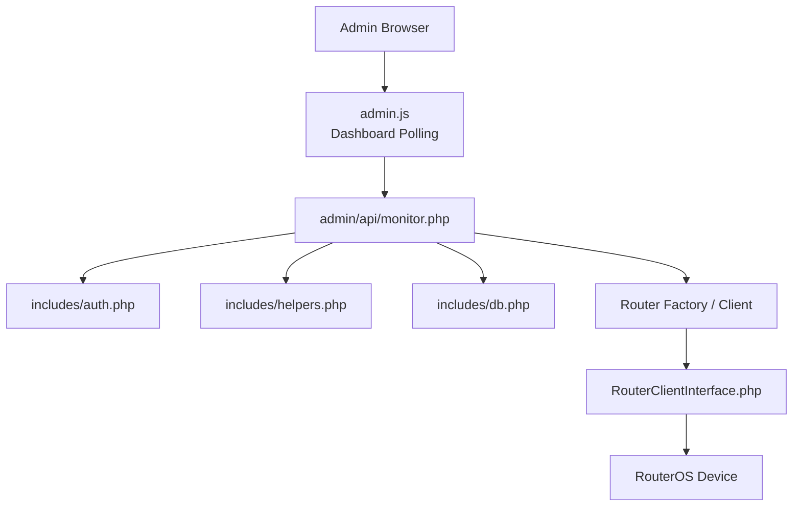
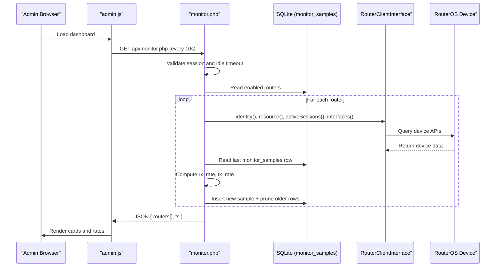
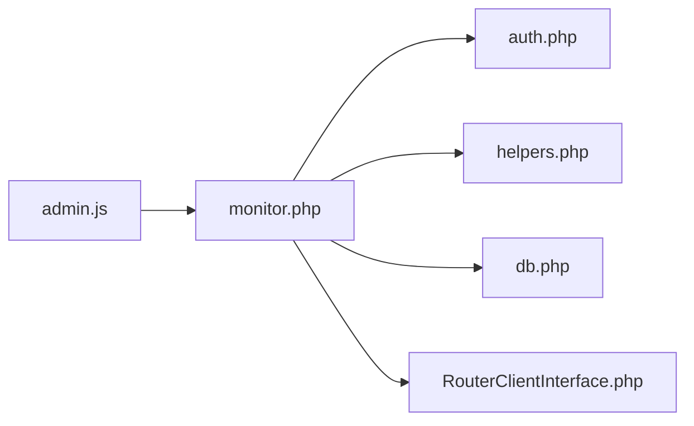

# Monitoring API

<cite>
**Referenced Files in This Document**
- [monitor.php](file://admin/api/monitor.php)
- [auth.php](file://includes/auth.php)
- [config.php](file://includes/config.php)
- [helpers.php](file://includes/helpers.php)
- [db.php](file://includes/db.php)
- [RouterClientInterface.php](file://includes/RouterOS/RouterClientInterface.php)
- [admin.js](file://admin/assets/admin.js)
</cite>

## Table of Contents
1. [Introduction](#introduction)
2. [Project Structure](#project-structure)
3. [Core Components](#core-components)
4. [Architecture Overview](#architecture-overview)
5. [Detailed Component Analysis](#detailed-component-analysis)
6. [Dependency Analysis](#dependency-analysis)
7. [Performance Considerations](#performance-considerations)
8. [Troubleshooting Guide](#troubleshooting-guide)
9. [Conclusion](#conclusion)

## Introduction
This document describes the internal monitoring API used by the admin panel to display real-time router metrics, health status, and system information. The endpoint returns a JSON payload containing per-router identity, resource usage, active session counts, and per-interface traffic rates derived from historical samples. It is intended for authenticated administrative clients only and should not be exposed publicly.

The monitoring flow is:
- The browser-side dashboard polls the API at a fixed interval.
- The server authenticates the request using an HTTP-only admin session.
- For each enabled router, it queries the RouterOS device through a unified client interface.
- It computes per-interface bytes-per-second rates by comparing current counters with the most recent stored sample.
- It stores new samples and prunes old ones to bound database growth.
- It returns a consolidated JSON response even if some routers are unreachable.

## Project Structure
The monitoring feature spans several layers:
- Admin API endpoint: `admin/api/monitor.php`
- Authentication and session helpers: `includes/auth.php`, `includes/config.php`
- Shared helpers and JSON emitter: `includes/helpers.php`
- Database schema and connection helper: `includes/db.php`
- Router client contract: `includes/RouterOS/RouterClientInterface.php`
- Dashboard JavaScript polling logic: `admin/assets/admin.js`



**Diagram sources**
- [monitor.php:21-24](file://admin/api/monitor.php#L21-L24)
- [admin.js:358-394](file://admin/assets/admin.js#L358-L394)
- [RouterClientInterface.php:31-127](file://includes/RouterOS/RouterClientInterface.php#L31-L127)

**Section sources**
- [monitor.php:1-24](file://admin/api/monitor.php#L1-L24)
- [admin.js:1-11](file://admin/assets/admin.js#L1-L11)

## Core Components
- Monitoring endpoint: collects router state, computes traffic rates, and returns structured JSON.
- Authentication layer: enforces admin session presence, idle timeout, and JSON-based unauthorized responses.
- Router client abstraction: provides consistent methods for identity, resources, sessions, and interfaces.
- Database layer: creates and indexes the `monitor_samples` table and supports pruning.
- Dashboard integration: polls the endpoint every 10 seconds and renders cards with CPU, memory, uptime, active sessions, and interface rates.

Key responsibilities:
- Endpoint: authentication, data collection, rate computation, persistence, error isolation, JSON serialization.
- Auth: session hardening, idle timeout enforcement, audit logging support.
- Router client: uniform access to MikroTik devices via REST or legacy API.
- Database: schema creation, indexing, and bounded retention of samples.
- Frontend: polling, rendering, error handling, and user feedback.

**Section sources**
- [monitor.php:29-50](file://admin/api/monitor.php#L29-L50)
- [monitor.php:101-187](file://admin/api/monitor.php#L101-L187)
- [auth.php:65-83](file://includes/auth.php#L65-L83)
- [auth.php:151-190](file://includes/auth.php#L151-L190)
- [RouterClientInterface.php:31-127](file://includes/RouterOS/RouterClientInterface.php#L31-L127)
- [db.php:103-116](file://includes/db.php#L103-L116)
- [admin.js:358-394](file://admin/assets/admin.js#L358-L394)

## Architecture Overview
The monitoring API is a read-heavy, frequently polled endpoint that aggregates router telemetry into a single JSON response.



**Diagram sources**
- [monitor.php:101-187](file://admin/api/monitor.php#L101-L187)
- [admin.js:358-394](file://admin/assets/admin.js#L358-L394)
- [RouterClientInterface.php:31-127](file://includes/RouterOS/RouterClientInterface.php#L31-L127)

## Detailed Component Analysis

### Monitoring Endpoint: GET /admin/api/monitor.php
Purpose:
- Provide a JSON feed of all enabled routers with live metrics.
- Compute per-interface traffic rates by diffing byte counters against previous samples.
- Isolate per-router errors so one unreachable device does not fail the entire response.

Authentication:
- Requires an active admin session cookie.
- Enforces idle timeout; expired sessions receive a JSON 401.
- Re-validates the admin record in the database on each request.

Request:
- Method: GET
- Path: `/admin/api/monitor.php`
- Headers:
  - Cookie: admin session cookie set by the application.
  - Optional: `X-Requested-With: fetch` (used by frontend).
- Body: None.

Response:
- Status codes:
  - 200: Success with aggregated router data.
  - 401: Unauthorized or session expired.
- Content-Type: `application/json; charset=utf-8`
- Cache-Control: `no-store`

Top-level response structure:
- `routers`: Array of router objects.
- `ts`: Server timestamp when the response was generated.

Per-router object fields:
- `id`: Integer router identifier.
- `name`: Router name.
- `api_type`: API type string configured for the router.
- `online`: Boolean indicating whether the router responded successfully.
- `identity`: Human-readable identity string.
- `resource`: Object with device resource metrics.
- `active_count`: Number of active hotspot sessions.
- `interfaces`: Array of interface metric objects.
- `error`: Error message when the router is unreachable or throws an exception.

Resource object fields:
- `cpu-load`: Float percentage.
- `free-memory`: Integer bytes.
- `total-memory`: Integer bytes.
- `uptime`: Integer seconds.
- `version`: String version.
- `board-name`: String board identifier.

Interface object fields:
- `name`: Interface name.
- `running`: Boolean indicating interface state.
- `rx_rate`: Integer bytes per second received.
- `tx_rate`: Integer bytes per second transmitted.

Error behavior:
- If the database cannot be queried, the endpoint returns a 200 with an empty `routers` array and an `error` field indicating database unavailability.
- If a specific router fails, its item has `online: false` and includes an `error` message.

Rate calculation:
- Uses the most recent `monitor_samples` row for the same router and interface.
- Computes non-negative bytes-per-second based on counter differences and elapsed time.
- Stores the new sample and prunes samples older than 24 hours per router.

Example response shape:
```json
{
  "routers": [
    {
      "id": 1,
      "name": "router-alpha",
      "api_type": "rest",
      "online": true,
      "identity": "Alpha-Edge",
      "resource": {
        "cpu-load": 12.5,
        "free-memory": 214748364,
        "total-memory": 524288000,
        "uptime": 86400,
        "version": "7.x",
        "board-name": "BoardName"
      },
      "active_count": 3,
      "interfaces": [
        {
          "name": "ether1",
          "running": true,
          "rx_rate": 102400,
          "tx_rate": 51200
        }
      ],
      "error": null
    }
  ],
  "ts": 1710000000
}
```

**Section sources**
- [monitor.php:26-50](file://admin/api/monitor.php#L26-L50)
- [monitor.php:54-99](file://admin/api/monitor.php#L54-L99)
- [monitor.php:101-187](file://admin/api/monitor.php#L101-L187)

### Authentication Requirements
Session handling:
- Starts a hardened session with secure cookie parameters.
- Marks cookies Secure over TLS, HttpOnly, SameSite=Strict.
- Validates the admin exists in the database before allowing access.

Idle timeout:
- Checks `last_activity` against the configured idle timeout.
- Destroys the session and returns a JSON 401 when expired.

Login security:
- Password hashing prefers Argon2id with bcrypt fallback.
- Rate limiting for failed login attempts.
- Session regeneration on successful login.

Configuration constants:
- Session name, idle timeout, rate limit maximum, and window duration are configurable.

Security considerations:
- Do not expose this endpoint outside the admin network.
- Use TLS to protect session cookies.
- Restrict access via web server configuration or reverse proxy rules.

**Section sources**
- [auth.php:65-83](file://includes/auth.php#L65-L83)
- [auth.php:151-190](file://includes/auth.php#L151-L190)
- [config.php:25-43](file://includes/config.php#L25-L43)
- [monitor.php:29-50](file://admin/api/monitor.php#L29-L50)

### Data Formats and Response Structures
JSON content type:
- All responses use `application/json; charset=utf-8`.
- Responses include `X-Content-Type-Options: nosniff` via the shared JSON helper.

Status codes:
- 200: Normal success with aggregated data.
- 401: Unauthorized or session expired.

Field types:
- Numeric fields are cast to integers or floats where appropriate.
- Missing values are normalized to safe defaults (e.g., zero rates, empty strings).

Frontend expectations:
- The dashboard expects `data.routers` to be present and iterates over router cards keyed by `id`.
- It maps `resource` fields to UI elements for CPU, memory, uptime, and board info.
- It renders interface rows with names and computed rates.

**Section sources**
- [helpers.php:28-38](file://includes/helpers.php#L28-L38)
- [monitor.php:116-187](file://admin/api/monitor.php#L116-L187)
- [admin.js:312-356](file://admin/assets/admin.js#L312-L356)

### Router Health Checks and System Status
Health indicators:
- `online`: Indicates whether the router responded without exceptions.
- `error`: Contains the exception message when a router is unreachable or rejects credentials.
- `active_count`: Reflects the number of active hotspot sessions.

System status fields:
- CPU load percentage.
- Memory usage derived from free and total memory.
- Uptime in seconds.
- Version and board name.

Interface status:
- Running state per interface.
- Computed RX/TX rates in bytes per second.

Integration guidance:
- Treat `online: false` as a degraded state and surface the error message to operators.
- Use `active_count` to gauge current load.
- Use interface rates to detect congestion or anomalies.

**Section sources**
- [monitor.php:116-187](file://admin/api/monitor.php#L116-L187)
- [RouterClientInterface.php:41-49](file://includes/RouterOS/RouterClientInterface.php#L41-L49)
- [RouterClientInterface.php:102-118](file://includes/RouterOS/RouterClientInterface.php#L102-L118)

### Monitoring Dashboard Integration
Polling:
- The dashboard polls `api/monitor.php` every 10 seconds.
- On 401, it redirects to the login page.
- On network or parsing errors, it marks cards as errored and displays a generic message.

Rendering:
- Each router card is matched by `data-router-id`.
- Metrics are updated in place without full page reloads.
- Interface lists are rendered dynamically.

Manual refresh:
- A refresh button triggers an immediate poll and shows a toast notification.

Best practices:
- Keep the polling interval at or above 10 seconds to avoid excessive load.
- Handle 401 by redirecting users to login.
- Display per-router errors gracefully rather than failing the entire dashboard.

**Section sources**
- [admin.js:15-16](file://admin/assets/admin.js#L15-L16)
- [admin.js:358-394](file://admin/assets/admin.js#L358-L394)

### Security Considerations for Internal APIs
- Require authenticated admin sessions for all monitoring requests.
- Enforce idle timeouts to prevent stale sessions.
- Use secure cookie settings (Secure, HttpOnly, SameSite=Strict).
- Restrict endpoint exposure to internal networks.
- Avoid returning sensitive details in error messages; sanitize or generalize when necessary.
- Audit privileged actions where applicable.

**Section sources**
- [auth.php:65-83](file://includes/auth.php#L65-L83)
- [auth.php:269-281](file://includes/auth.php#L269-L281)
- [monitor.php:29-50](file://admin/api/monitor.php#L29-L50)

### Performance Optimization for Frequent Metric Collection
- Polling interval: 10 seconds balances freshness and load.
- Per-router error isolation prevents cascading failures.
- Sample pruning limits database growth to 24 hours per router.
- Indexed queries on `monitor_samples` improve lookup performance.
- Minimal writes: only insert new samples and prune old ones.

Recommendations:
- Ensure SQLite is on fast storage.
- Monitor database size and adjust retention if needed.
- Avoid increasing polling frequency beyond 10 seconds unless necessary.
- Consider caching router metadata if changes are infrequent.

**Section sources**
- [monitor.php:164-166](file://admin/api/monitor.php#L164-L166)
- [db.php:103-116](file://includes/db.php#L103-L116)
- [admin.js:15-16](file://admin/assets/admin.js#L15-L16)

## Dependency Analysis
The monitoring endpoint depends on:
- Authentication helpers for session validation.
- Database helpers for schema initialization and queries.
- Router client interface for device communication.
- Shared helpers for JSON output and formatting.
- Frontend JavaScript for polling and rendering.



**Diagram sources**
- [monitor.php:21-24](file://admin/api/monitor.php#L21-L24)
- [admin.js:358-394](file://admin/assets/admin.js#L358-L394)

**Section sources**
- [monitor.php:21-24](file://admin/api/monitor.php#L21-L24)
- [helpers.php:28-38](file://includes/helpers.php#L28-L38)
- [db.php:103-116](file://includes/db.php#L103-L116)
- [RouterClientInterface.php:31-127](file://includes/RouterOS/RouterClientInterface.php#L31-L127)

## Performance Considerations
- Network latency to routers can dominate response time; per-router try/catch isolates slow devices.
- Database writes are minimal but frequent; ensure proper indexing and retention policies.
- Frontend polling adds client-side overhead; keep intervals conservative.
- Avoid exposing the endpoint publicly to reduce unnecessary load.

[No sources needed since this section provides general guidance]

## Troubleshooting Guide
Common issues:
- 401 Unauthorized:
  - Cause: Missing or expired admin session.
  - Resolution: Log in again; ensure cookies are allowed and TLS is configured.
- Database unavailable:
  - Cause: SQLite file inaccessible or permissions issue.
  - Resolution: Check file paths and permissions; verify schema initialization.
- Router unreachable:
  - Cause: Network failure, wrong credentials, or disabled router.
  - Resolution: Verify router connectivity, credentials, and enabled status.
- No interface traffic:
  - Cause: First poll before any sample exists or no active interfaces.
  - Resolution: Wait for initial samples; check interface states.

Operational tips:
- Inspect the `error` field in router items for diagnostics.
- Monitor `monitor_samples` table growth and pruning behavior.
- Use manual refresh to validate real-time updates.

**Section sources**
- [monitor.php:107-112](file://admin/api/monitor.php#L107-L112)
- [monitor.php:179-182](file://admin/api/monitor.php#L179-L182)
- [admin.js:375-382](file://admin/assets/admin.js#L375-L382)

## Conclusion
The monitoring API provides a robust, authenticated JSON feed for the admin dashboard to visualize router health, resource usage, active sessions, and interface traffic rates. It emphasizes security through hardened sessions, isolates per-router errors, and manages database growth with sample pruning. For reliable operation, maintain TLS, restrict endpoint access, and adhere to recommended polling intervals.

[No sources needed since this section summarizes without analyzing specific files]