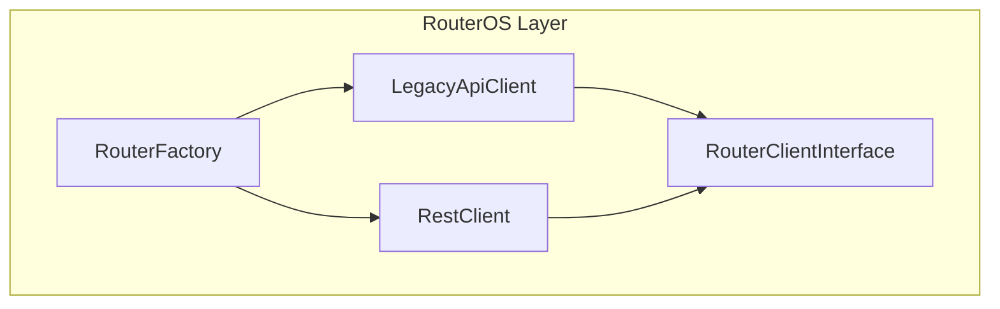
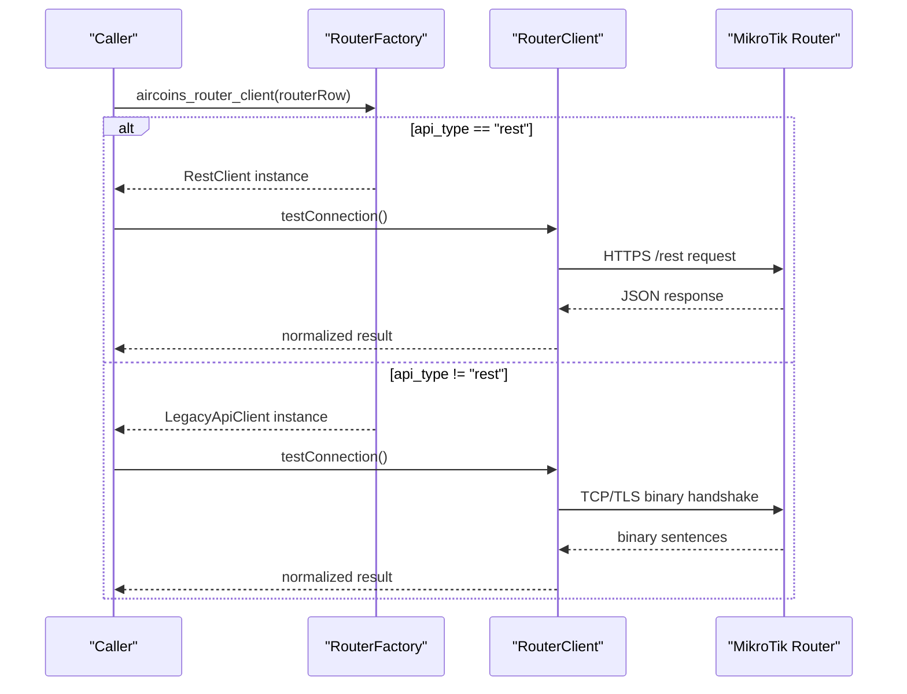
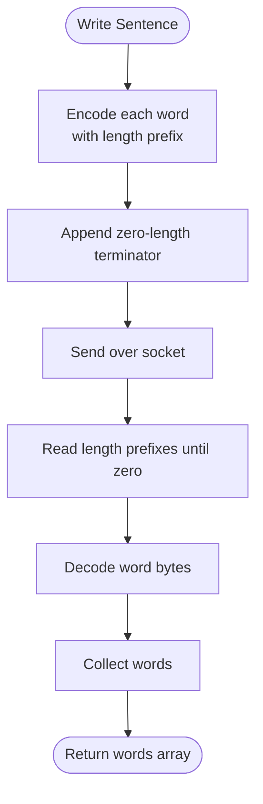
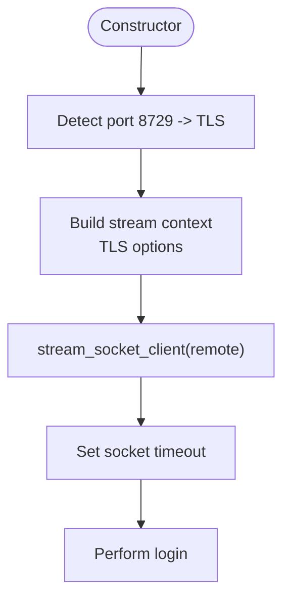
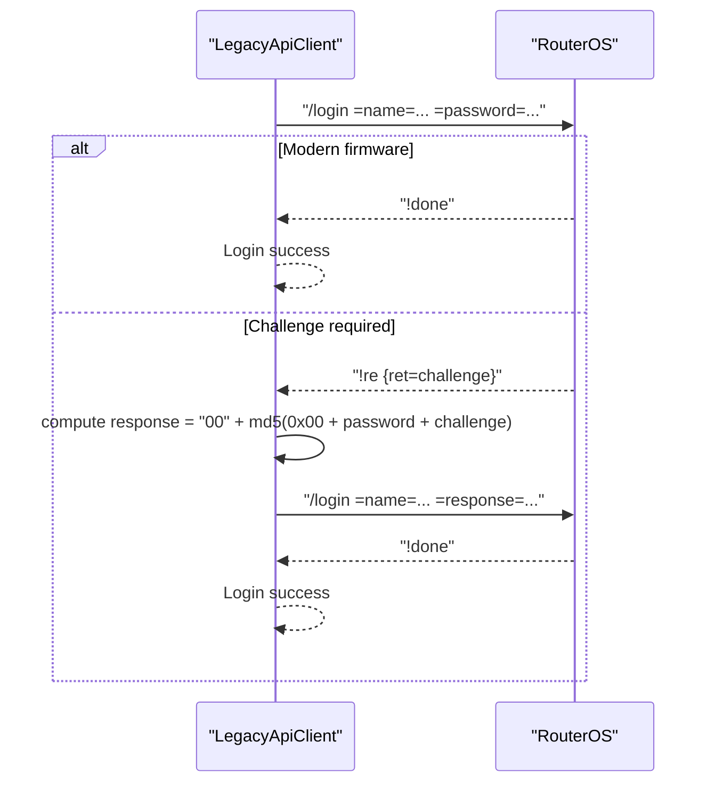
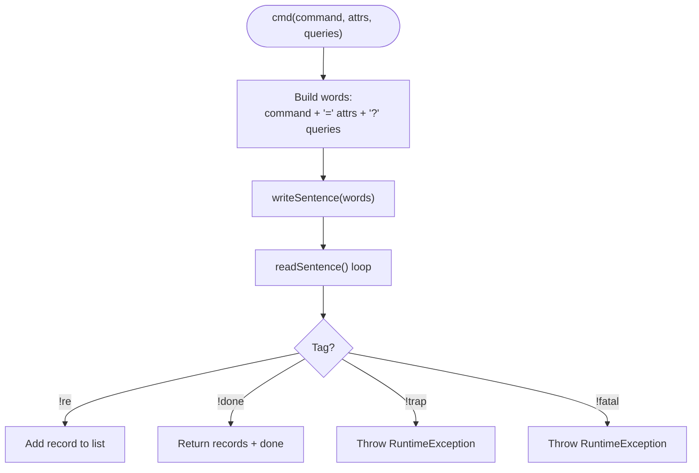
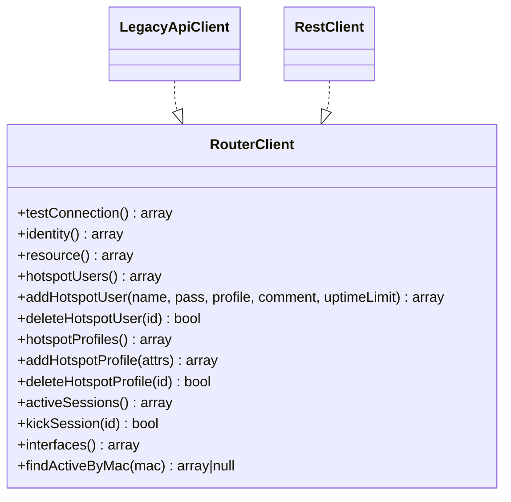
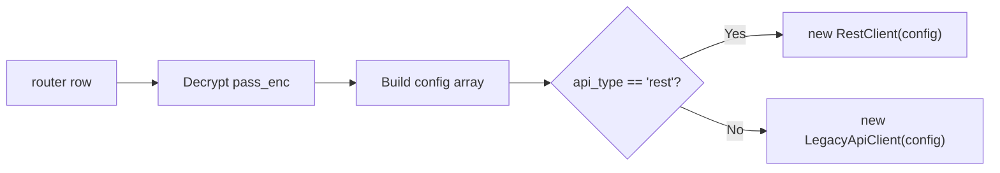

# Legacy API Client

<cite>
**Referenced Files in This Document**
- [LegacyApiClient.php](file://includes/RouterOS/LegacyApiClient.php)
- [RestClient.php](file://includes/RouterOS/RestClient.php)
- [RouterClientInterface.php](file://includes/RouterOS/RouterClientInterface.php)
- [RouterFactory.php](file://includes/RouterOS/RouterFactory.php)
</cite>

## Table of Contents
1. [Introduction](#introduction)
2. [Project Structure](#project-structure)
3. [Core Components](#core-components)
4. [Architecture Overview](#architecture-overview)
5. [Detailed Component Analysis](#detailed-component-analysis)
6. [Dependency Analysis](#dependency-analysis)
7. [Performance Considerations](#performance-considerations)
8. [Troubleshooting Guide](#troubleshooting-guide)
9. [Conclusion](#conclusion)
10. [Appendices](#appendices)

## Introduction
This document explains the Legacy API client used to communicate with older MikroTik RouterOS devices through the binary protocol. It covers:
- The binary frame format and length encoding.
- Connection establishment over TCP or TLS.
- Dual-mode authentication, including plaintext login and challenge-response.
- How the legacy client maps RouterOS commands into a unified interface.
- Differences from the REST API in performance, capabilities, and limitations.
- Examples of legacy-specific operations and migration strategies between REST and Legacy clients.
- Compatibility considerations and troubleshooting for binary protocol issues.

The implementation is designed so that both the REST client (RouterOS v7) and the Legacy binary client (RouterOS v6 and v7) expose the same `RouterClient` contract. This allows higher layers to switch implementations without changing business logic.

## Project Structure
The relevant code lives under `includes/RouterOS`:
- `RouterClientInterface.php` defines the shared contract.
- `RestClient.php` implements the contract using HTTP/JSON.
- `LegacyApiClient.php` implements the contract using the RouterOS binary protocol.
- `RouterFactory.php` selects the correct client based on router configuration.

**Diagram sources**
- [RouterClientInterface.php:31-127](file://includes/RouterOS/RouterClientInterface.php#L31-L127)
- [LegacyApiClient.php:22-50](file://includes/RouterOS/LegacyApiClient.php#L22-L50)
- [RestClient.php:24-48](file://includes/RouterOS/RestClient.php#L24-L48)
- [RouterFactory.php:29-55](file://includes/RouterOS/RouterFactory.php#L29-L55)

**Section sources**
- [RouterClientInterface.php:1-128](file://includes/RouterOS/RouterClientInterface.php#L1-L128)
- [LegacyApiClient.php:1-667](file://includes/RouterOS/LegacyApiClient.php#L1-L667)
- [RestClient.php:1-459](file://includes/RouterOS/RestClient.php#L1-L459)
- [RouterFactory.php:1-56](file://includes/RouterOS/RouterFactory.php#L1-L56)

## Core Components
- `RouterClientInterface`: Defines the unified API shape for identity, resource info, hotspot users/profiles, active sessions, interfaces, and connection testing.
- `LegacyApiClient`: Implements the binary protocol, including connection, authentication, sentence framing, command execution, and data normalization.
- `RestClient`: Implements the same interface over HTTPS JSON.
- `RouterFactory`: Builds the appropriate client based on router configuration and decrypts credentials.

Key responsibilities:
- Binary framing and decoding are encapsulated in `LegacyApiClient`.
- Authentication supports both modern plaintext login and legacy challenge-response.
- Both clients normalize responses to the same shape defined by the interface.

**Section sources**
- [RouterClientInterface.php:31-127](file://includes/RouterOS/RouterClientInterface.php#L31-L127)
- [LegacyApiClient.php:22-667](file://includes/RouterOS/LegacyApiClient.php#L22-L667)
- [RestClient.php:24-459](file://includes/RouterOS/RestClient.php#L24-L459)
- [RouterFactory.php:29-55](file://includes/RouterOS/RouterFactory.php#L29-L55)

## Architecture Overview
The system uses a factory pattern to select the correct client implementation. Higher-level code depends only on the interface, not on whether the backend is REST or binary.

**Diagram sources**
- [RouterFactory.php:29-55](file://includes/RouterOS/RouterFactory.php#L29-L55)
- [RestClient.php:54-86](file://includes/RouterOS/RestClient.php#L54-L86)
- [LegacyApiClient.php:40-50](file://includes/RouterOS/LegacyApiClient.php#L40-L50)

## Detailed Component Analysis

### Legacy Binary Protocol Frame Format
The legacy client sends and receives “sentences” composed of length-prefixed words terminated by a zero-length word. Each word is encoded with a variable-length prefix:
- 1 byte if length < 0x80.
- 2 bytes if length < 0x4000 (first byte high bit set).
- 3 bytes if length < 0x200000 (first byte high two bits set).
- 4 bytes if length < 0x10000000 (first byte high three bits set).
- 5 bytes otherwise (first byte 0xF0 followed by raw 32-bit length).

Reply tags indicate the type of message:
- `!re`: record containing attributes.
- `!done`: end of command with optional attributes.
- `!trap`: error condition.
- `!fatal`: fatal error.

**Diagram sources**
- [LegacyApiClient.php:186-241](file://includes/RouterOS/LegacyApiClient.php#L186-L241)
- [LegacyApiClient.php:286-331](file://includes/RouterOS/LegacyApiClient.php#L286-L331)

**Section sources**
- [LegacyApiClient.php:186-241](file://includes/RouterOS/LegacyApiClient.php#L186-L241)
- [LegacyApiClient.php:286-331](file://includes/RouterOS/LegacyApiClient.php#L286-L331)

### Connection Establishment
The legacy client connects via:
- Plain TCP on port 8728.
- TLS on port 8729.

It configures stream context options for TLS verification and self-signed certificate handling when disabled. A timeout is applied to the socket after connection.

**Diagram sources**
- [LegacyApiClient.php:40-50](file://includes/RouterOS/LegacyApiClient.php#L40-L50)
- [LegacyApiClient.php:70-94](file://includes/RouterOS/LegacyApiClient.php#L70-L94)

**Section sources**
- [LegacyApiClient.php:70-94](file://includes/RouterOS/LegacyApiClient.php#L70-L94)

### Authentication Mechanisms
Authentication is dual-mode:
- Modern firmware (>= 6.43): accepts plaintext `/login =name=... =password=...`.
- Older firmware: responds with a challenge (`=ret=<hex>`), requiring a challenge-response:
  - Compute MD5 of null byte + password + challenge bytes.
  - Prepend hex-encoded null byte.
  - Send `/login =name=... =response=...`.

The client handles `!re`, `!done`, `!trap`, and `!fatal` tags during login and throws exceptions on errors.

**Diagram sources**
- [LegacyApiClient.php:101-167](file://includes/RouterOS/LegacyApiClient.php#L101-L167)

**Section sources**
- [LegacyApiClient.php:101-167](file://includes/RouterOS/LegacyApiClient.php#L101-L167)

### Command Execution and Data Normalization
Commands are sent as sentences with:
- Command path (e.g., `/ip/hotspot/user/print`).
- Attributes prefixed with `=`.
- Query filters prefixed with `?`.

Responses are parsed into records (`!re`) and final attributes (`!done`). The client normalizes fields such as booleans and uptime strings to consistent types.

**Diagram sources**
- [LegacyApiClient.php:372-423](file://includes/RouterOS/LegacyApiClient.php#L372-L423)

**Section sources**
- [LegacyApiClient.php:372-423](file://includes/RouterOS/LegacyApiClient.php#L372-L423)

### Unified Interface Mapping
Both clients implement the same methods:
- `testConnection()`
- `identity()`
- `resource()`
- `hotspotUsers()`
- `addHotspotUser(...)`
- `deleteHotspotUser(id)`
- `hotspotProfiles()`
- `addHotspotProfile(attrs)`
- `deleteHotspotProfile(id)`
- `activeSessions()`
- `kickSession(id)`
- `interfaces()`
- `findActiveByMac(mac)`

This ensures that calling code does not need to know whether it is talking to REST or Legacy.

**Diagram sources**
- [RouterClientInterface.php:31-127](file://includes/RouterOS/RouterClientInterface.php#L31-L127)
- [LegacyApiClient.php:429-667](file://includes/RouterOS/LegacyApiClient.php#L429-L667)
- [RestClient.php:54-459](file://includes/RouterOS/RestClient.php#L54-L459)

**Section sources**
- [RouterClientInterface.php:31-127](file://includes/RouterOS/RouterClientInterface.php#L31-L127)
- [LegacyApiClient.php:429-667](file://includes/RouterOS/LegacyApiClient.php#L429-L667)
- [RestClient.php:54-459](file://includes/RouterOS/RestClient.php#L54-L459)

## Dependency Analysis
The factory resolves the client type and constructs the appropriate implementation. It also decrypts stored passwords before passing them to the client constructors.

**Diagram sources**
- [RouterFactory.php:29-55](file://includes/RouterOS/RouterFactory.php#L29-L55)

**Section sources**
- [RouterFactory.php:29-55](file://includes/RouterOS/RouterFactory.php#L29-L55)

## Performance Considerations
- Binary protocol overhead:
  - Variable-length length prefixes reduce payload size compared to text-based protocols.
  - Fewer parsing steps than JSON; direct attribute mapping reduces serialization cost.
- Network transport:
  - TCP (8728) has lower overhead than HTTPS (8729) due to no TLS handshake and encryption costs.
  - TLS adds CPU overhead but provides confidentiality and integrity.
- Response handling:
  - Legacy client reads sentences until termination, which can be efficient for large datasets.
  - REST client decodes JSON per request; large lists may incur more memory usage.

Recommendations:
- Prefer binary protocol for high-frequency polling or bulk operations on older routers.
- Use TLS for security-sensitive environments where performance impact is acceptable.
- Batch operations where possible to minimize round trips.

[No sources needed since this section provides general guidance]

## Troubleshooting Guide
Common binary protocol issues and resolutions:
- Connection failures:
  - Verify host, port, and firewall rules.
  - For TLS, ensure proper certificates or configure self-signed acceptance when necessary.
- Authentication failures:
  - Ensure username/password correctness.
  - Confirm firmware version compatibility with challenge-response flow.
  - Check for malformed challenges or incorrect MD5 computation.
- Socket timeouts or short reads:
  - Increase socket timeouts if network latency is high.
  - Validate that the router is reachable and responsive.
- Error tags:
  - `!trap` indicates an operational error; inspect the message field.
  - `!fatal` indicates a severe error; review router logs and credentials.

Operational tips:
- Use `testConnection()` to validate connectivity and credentials early.
- Log command paths and tags for debugging failed operations.
- Normalize boolean and uptime fields consistently to avoid downstream parsing errors.

**Section sources**
- [LegacyApiClient.php:70-94](file://includes/RouterOS/LegacyApiClient.php#L70-L94)
- [LegacyApiClient.php:101-167](file://includes/RouterOS/LegacyApiClient.php#L101-L167)
- [LegacyApiClient.php:255-278](file://includes/RouterOS/LegacyApiClient.php#L255-L278)
- [LegacyApiClient.php:372-423](file://includes/RouterOS/LegacyApiClient.php#L372-L423)

## Conclusion
The Legacy API client provides robust support for older MikroTik RouterOS versions using the binary protocol. It abstracts away low-level framing, authentication, and error handling while exposing a unified interface compatible with the REST client. This design enables seamless switching between REST and Legacy backends, improving compatibility across diverse router deployments.

For new deployments on RouterOS v7, prefer the REST API for its simplicity and standard HTTP semantics. For legacy systems or performance-critical scenarios, the binary protocol remains a strong choice. Migration strategies should focus on mapping REST endpoints to equivalent RouterOS commands and ensuring consistent data normalization.

[No sources needed since this section summarizes without analyzing specific files]

## Appendices

### Legacy-Specific Operations and Examples
Examples of operations implemented by the legacy client include:
- Listing hotspot users and profiles.
- Adding and removing hotspot users and profiles.
- Listing active sessions and kicking sessions.
- Retrieving interface statistics.
- Finding active sessions by MAC address.

These operations map directly to RouterOS command paths and attributes.

**Section sources**
- [LegacyApiClient.php:466-622](file://includes/RouterOS/LegacyApiClient.php#L466-L622)

### Migration Strategies: REST to Legacy and Vice Versa
- From REST to Legacy:
  - Map REST endpoints to RouterOS command paths.
  - Convert JSON bodies to attribute lists with `=` and query filters with `?`.
  - Handle `.id` values carefully; legacy uses `.id` similarly but via command attributes.
- From Legacy to REST:
  - Translate command paths to REST endpoints.
  - Convert attribute lists to JSON payloads.
  - Account for REST’s string-typed values and cast numerics appropriately.

**Section sources**
- [RestClient.php:1-18](file://includes/RouterOS/RestClient.php#L1-L18)
- [RestClient.php:228-316](file://includes/RouterOS/RestClient.php#L228-L316)
- [LegacyApiClient.php:372-423](file://includes/RouterOS/LegacyApiClient.php#L372-L423)