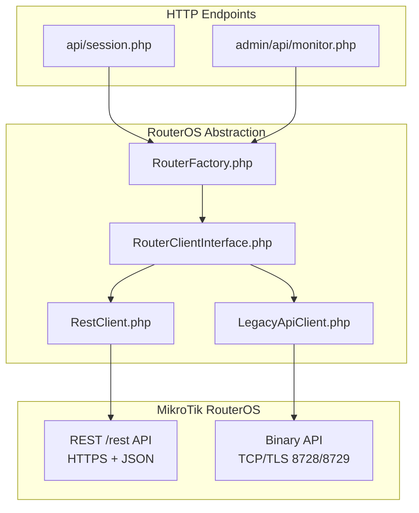
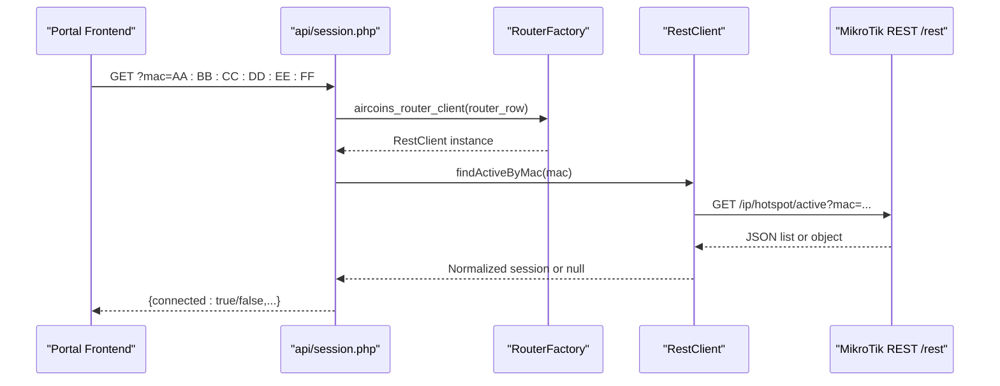
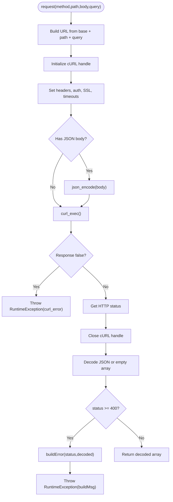
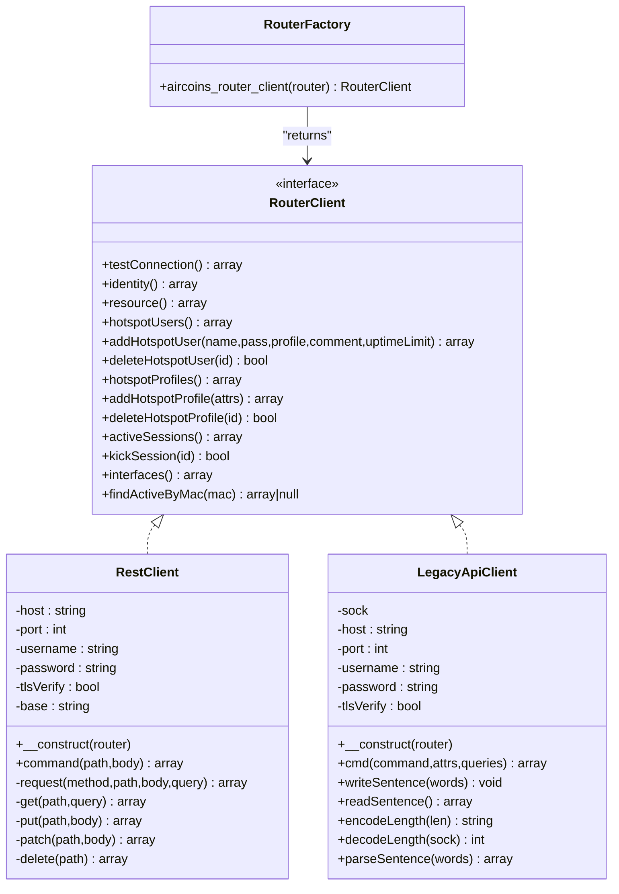
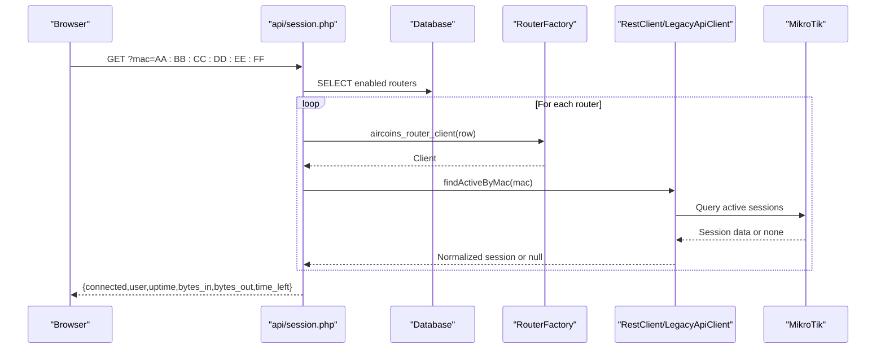
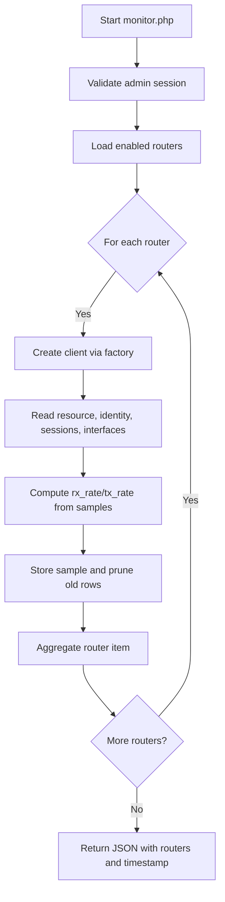
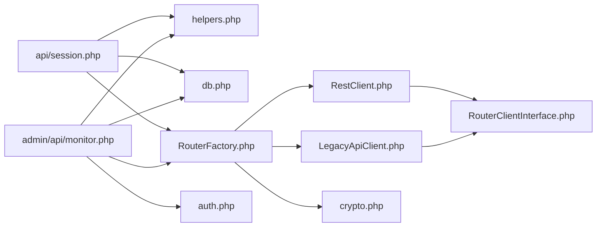

# REST API Client

<cite>
**Referenced Files in This Document**
- [RestClient.php](file://includes/RouterOS/RestClient.php)
- [LegacyApiClient.php](file://includes/RouterOS/LegacyApiClient.php)
- [RouterClientInterface.php](file://includes/RouterOS/RouterClientInterface.php)
- [RouterFactory.php](file://includes/RouterOS/RouterFactory.php)
- [session.php](file://api/session.php)
- [monitor.php](file://admin/api/monitor.php)
</cite>

## Table of Contents
1. [Introduction](#introduction)
2. [Project Structure](#project-structure)
3. [Core Components](#core-components)
4. [Architecture Overview](#architecture-overview)
5. [Detailed Component Analysis](#detailed-component-analysis)
6. [Dependency Analysis](#dependency-analysis)
7. [Performance Considerations](#performance-considerations)
8. [Troubleshooting Guide](#troubleshooting-guide)
9. [Conclusion](#conclusion)

## Introduction
This document explains the REST API client implementation used to communicate with MikroTik RouterOS v7+. The system provides a unified interface for both modern REST-based routers and legacy binary-API routers, while exposing HTTP endpoints for portal session status and admin monitoring.

Key topics covered:
- HTTP-based communication protocol over HTTPS using JSON payloads.
- Authentication via HTTP Basic authentication (not OAuth2).
- Connection handling, timeouts, TLS verification, and error response parsing.
- Common operations such as identity/resource queries, hotspot user/profile management, active session listing, and traffic monitoring through REST endpoints.
- Performance considerations, rate limiting guidance, and best practices for safe and efficient REST API usage.

## Project Structure
The RouterOS integration is implemented under `includes/RouterOS/`, with two concrete clients sharing one interface:
- `RestClient.php` implements RouterOS v7+ REST access.
- `LegacyApiClient.php` implements the older binary API for backward compatibility.
- `RouterClientInterface.php` defines the shared contract.
- `RouterFactory.php` selects and constructs the correct client based on router configuration.

Higher-level HTTP endpoints use these clients:
- `api/session.php` exposes an unauthenticated, read-only session lookup endpoint for the portal frontend.
- `admin/api/monitor.php` exposes an authenticated live monitoring feed for the admin UI.

**Diagram sources**
- [session.php:1-107](file://api/session.php#L1-L107)
- [monitor.php:1-188](file://admin/api/monitor.php#L1-L188)
- [RouterClientInterface.php:1-128](file://includes/RouterOS/RouterClientInterface.php#L1-L128)
- [RestClient.php:1-459](file://includes/RouterOS/RestClient.php#L1-L459)
- [LegacyApiClient.php:1-667](file://includes/RouterOS/LegacyApiClient.php#L1-L667)
- [RouterFactory.php:1-56](file://includes/RouterOS/RouterFactory.php#L1-L56)

**Section sources**
- [RestClient.php:1-459](file://includes/RouterOS/RestClient.php#L1-L459)
- [LegacyApiClient.php:1-667](file://includes/RouterOS/LegacyApiClient.php#L1-L667)
- [RouterClientInterface.php:1-128](file://includes/RouterOS/RouterClientInterface.php#L1-L128)
- [RouterFactory.php:1-56](file://includes/RouterOS/RouterFactory.php#L1-L56)
- [session.php:1-107](file://api/session.php#L1-L107)
- [monitor.php:1-188](file://admin/api/monitor.php#L1-L188)

## Core Components
- RouterClientInterface: Defines the unified contract for all RouterOS clients. It standardizes return shapes for identity, resource metrics, hotspot users/profiles, active sessions, interfaces, and connection testing.
- RestClient: Implements the REST API for RouterOS v7+. It uses cURL over HTTPS, HTTP Basic authentication, and JSON request/response bodies. It maps REST verbs to RouterOS operations and normalizes string-typed values returned by RouterOS.
- LegacyApiClient: Implements the legacy binary API for RouterOS v6/v7. It handles socket I/O, length-prefixed word encoding, challenge-response login, and sentence parsing.
- RouterFactory: Builds the appropriate client based on router configuration (`api_type`). It decrypts stored credentials before passing them to the selected client.

Important behaviors:
- All numeric fields from RouterOS are strings; the REST client coerces them into PHP types to match the interface contract.
- `.id` values (for example `*5`) are appended to paths without percent-encoding.
- Error responses from REST are parsed to extract message/detail/error fields and converted into descriptive exceptions.

**Section sources**
- [RouterClientInterface.php:1-128](file://includes/RouterOS/RouterClientInterface.php#L1-L128)
- [RestClient.php:1-459](file://includes/RouterOS/RestClient.php#L1-L459)
- [LegacyApiClient.php:1-667](file://includes/RouterOS/LegacyApiClient.php#L1-L667)
- [RouterFactory.php:1-56](file://includes/RouterOS/RouterFactory.php#L1-L56)

## Architecture Overview
The architecture separates transport concerns from business logic:
- HTTP endpoints orchestrate calls to the RouterOS abstraction layer.
- The factory chooses between REST and legacy clients.
- Clients encapsulate network details and normalize data to a common shape.

**Diagram sources**
- [session.php:1-107](file://api/session.php#L1-L107)
- [RouterFactory.php:1-56](file://includes/RouterOS/RouterFactory.php#L1-L56)
- [RestClient.php:1-459](file://includes/RouterOS/RestClient.php#L1-L459)

## Detailed Component Analysis

### REST Client Protocol and Data Model
The REST client communicates with RouterOS v7+ over HTTPS using JSON. The documented mapping is:
- GET path[?query] -> print
- PUT path + body -> add (201)
- PATCH path/.id + body -> set
- DELETE path/.id -> remove (204)
- POST path + body -> command (e.g., monitor-traffic once)

Authentication:
- HTTP Basic authentication is used with username/password provided at construction time.
- There is no OAuth2 flow in this codebase.

TLS and security:
- TLS peer and hostname verification can be enabled/disabled via configuration.
- The base URL is constructed from host, port, and scheme (http for port 80, https otherwise), targeting `/rest`.

Request/response handling:
- Requests include headers `Content-Type: application/json` and `Accept: application/json`.
- Responses are decoded from JSON; empty bodies become empty arrays.
- HTTP status codes >= 400 raise exceptions with messages built from `message`, `detail`, and `error` fields when present.

Timeouts:
- Total timeout: 10 seconds.
- Connection timeout: 5 seconds.

Connection pooling:
- Each request creates a new cURL handle and closes it after use. There is no persistent connection pool.

Common operations:
- Identity and resource queries.
- Hotspot user and profile CRUD.
- Active session listing and kick.
- Interface listing with counters.
- MAC-based session lookup.
- Generic command execution via POST.

**Diagram sources**
- [RestClient.php:270-340](file://includes/RouterOS/RestClient.php#L270-L340)

**Section sources**
- [RestClient.php:1-459](file://includes/RouterOS/RestClient.php#L1-L459)

### Legacy Binary API Client
The legacy client supports RouterOS v6 and v7 via the binary protocol over TCP (8728) or TLS (8729). Key aspects:
- Socket connection with optional TLS verification and self-signed certificate support when disabled.
- Dual-mode login: plaintext login first; if a challenge is received, compute MD5-based response.
- Length-prefixed word encoding/decoding for RouterOS binary frames.
- Sentence I/O: write/read sentences terminated by zero-length words.
- Command execution collects `!re` records and handles `!done`, `!trap`, and `!fatal` tags.

This client is retained for backward compatibility and shares the same interface as the REST client.

**Section sources**
- [LegacyApiClient.php:1-667](file://includes/RouterOS/LegacyApiClient.php#L1-L667)

### Unified Interface and Factory
The interface defines consistent method signatures and return shapes across implementations. The factory:
- Resolves plaintext password either from decrypted encrypted storage or directly supplied value.
- Selects `RestClient` when `api_type` equals `rest`; otherwise falls back to `LegacyApiClient`.

**Diagram sources**
- [RouterClientInterface.php:1-128](file://includes/RouterOS/RouterClientInterface.php#L1-L128)
- [RestClient.php:1-459](file://includes/RouterOS/RestClient.php#L1-L459)
- [LegacyApiClient.php:1-667](file://includes/RouterOS/LegacyApiClient.php#L1-L667)
- [RouterFactory.php:1-56](file://includes/RouterOS/RouterFactory.php#L1-L56)

**Section sources**
- [RouterClientInterface.php:1-128](file://includes/RouterOS/RouterClientInterface.php#L1-L128)
- [RouterFactory.php:1-56](file://includes/RouterOS/RouterFactory.php#L1-L56)

### Portal Session Lookup Endpoint
The portal-facing endpoint:
- Accepts a MAC address parameter and returns whether that device has an active hotspot session on any enabled router.
- Iterates enabled routers, instantiates a client via the factory, and calls `findActiveByMac`.
- Returns a normalized JSON payload including connected status, user, uptime, bytes-in/out, and optional time-left.
- Uses permissive CORS for this endpoint only and avoids leaking stack traces.

**Diagram sources**
- [session.php:1-107](file://api/session.php#L1-L107)
- [RouterFactory.php:1-56](file://includes/RouterOS/RouterFactory.php#L1-L56)
- [RestClient.php:1-459](file://includes/RouterOS/RestClient.php#L1-L459)
- [LegacyApiClient.php:1-667](file://includes/RouterOS/LegacyApiClient.php#L1-L667)

**Section sources**
- [session.php:1-107](file://api/session.php#L1-L107)

### Admin Monitoring Endpoint
The admin monitoring endpoint:
- Requires an authenticated admin session and validates session activity against idle timeout.
- Reads resource, identity, active sessions, and interfaces for each enabled router.
- Computes per-interface traffic rates by diffing byte counters against stored samples.
- Stores new samples and prunes old ones older than 24 hours.
- Returns aggregated router status and interface metrics.

**Diagram sources**
- [monitor.php:1-188](file://admin/api/monitor.php#L1-L188)
- [RouterFactory.php:1-56](file://includes/RouterOS/RouterFactory.php#L1-L56)

**Section sources**
- [monitor.php:1-188](file://admin/api/monitor.php#L1-L188)

## Dependency Analysis
The following diagram shows how components depend on each other:

**Diagram sources**
- [session.php:1-107](file://api/session.php#L1-L107)
- [monitor.php:1-188](file://admin/api/monitor.php#L1-L188)
- [RouterFactory.php:1-56](file://includes/RouterOS/RouterFactory.php#L1-L56)
- [RestClient.php:1-459](file://includes/RouterOS/RestClient.php#L1-L459)
- [LegacyApiClient.php:1-667](file://includes/RouterOS/LegacyApiClient.php#L1-L667)
- [RouterClientInterface.php:1-128](file://includes/RouterOS/RouterClientInterface.php#L1-L128)

**Section sources**
- [session.php:1-107](file://api/session.php#L1-L107)
- [monitor.php:1-188](file://admin/api/monitor.php#L1-L188)
- [RouterFactory.php:1-56](file://includes/RouterOS/RouterFactory.php#L1-L56)

## Performance Considerations
- Connection pooling: The REST client does not maintain persistent connections; each request opens and closes a cURL handle. For high-frequency polling, consider implementing a connection pool or reusing cURL handles within a process lifecycle to reduce overhead.
- Timeouts: Default total timeout is 10 seconds and connection timeout is 5 seconds. Tune these based on network conditions and expected latency.
- Rate limiting: RouterOS may throttle excessive requests. Implement client-side rate limiting and exponential backoff when encountering errors or slow responses.
- Payload size: Use minimal query parameters and select only needed fields where possible (the REST client already uses selective property lists for interfaces).
- Concurrency: Avoid parallel requests to the same router unless necessary; batch operations where supported.
- Monitoring sampling: The admin monitor stores samples per interface and prunes older than 24 hours. Ensure database performance is adequate for the number of routers and interfaces polled.

Best practices:
- Prefer read-only endpoints for frequent polling.
- Cache stable data (profiles, users) locally and refresh periodically.
- Handle transient network failures gracefully with retries and backoff.
- Validate inputs (MAC addresses, IDs) before sending requests.
- Log errors without exposing sensitive details.

[No sources needed since this section provides general guidance]

## Troubleshooting Guide
Common issues and resolutions:
- Authentication failures:
  - Verify username/password and TLS settings.
  - For legacy clients, ensure the router accepts plaintext login or supports challenge-response.
- Network connectivity:
  - Check firewall rules allowing HTTPS (default 443) or binary API ports (8728/8729).
  - Confirm DNS resolution and reachability.
- TLS verification:
  - If using self-signed certificates, disable verification in configuration or install proper CA certificates.
- Error responses:
  - REST errors are parsed to build descriptive messages including message/detail/error fields. Inspect exception messages for diagnostics.
- High latency or timeouts:
  - Increase timeouts cautiously and investigate router load and network congestion.
- Excessive requests:
  - Reduce polling frequency and implement rate limiting/backoff.

Operational checks:
- Use `testConnection()` to validate reachability and credentials.
- Use `identity()` and `resource()` to confirm basic connectivity and version/board info.
- Use `activeSessions()` and `interfaces()` to verify data retrieval.

**Section sources**
- [RestClient.php:270-340](file://includes/RouterOS/RestClient.php#L270-L340)
- [LegacyApiClient.php:70-167](file://includes/RouterOS/LegacyApiClient.php#L70-L167)

## Conclusion
The REST API client provides a robust, standardized way to interact with MikroTik RouterOS v7+ over HTTPS using JSON and HTTP Basic authentication. It integrates seamlessly with higher-level endpoints for portal session lookups and admin monitoring. While there is no OAuth2 flow in this codebase, the design emphasizes clear contracts, predictable error handling, and extensibility through a unified interface. By applying the recommended performance and operational practices, you can achieve reliable and efficient communication with RouterOS devices.

[No sources needed since this section summarizes without analyzing specific files]