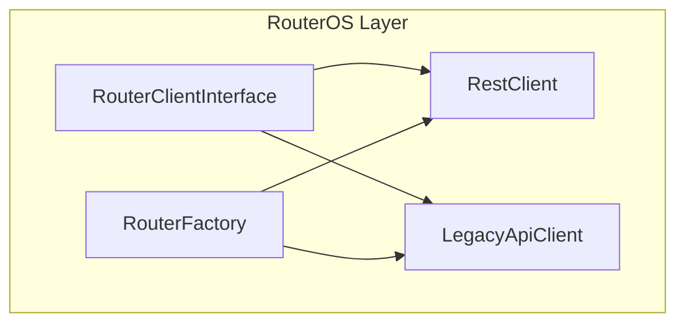
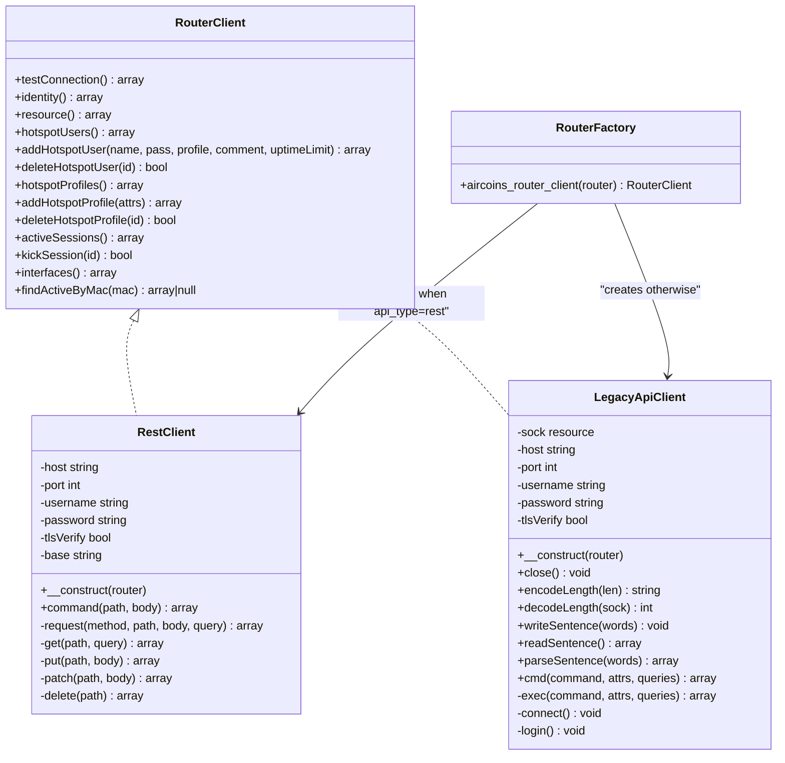
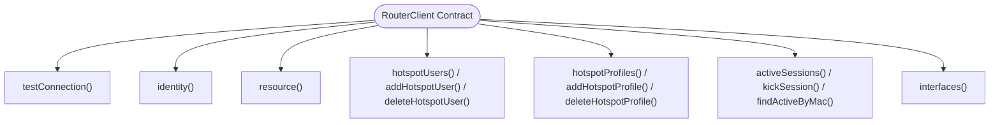
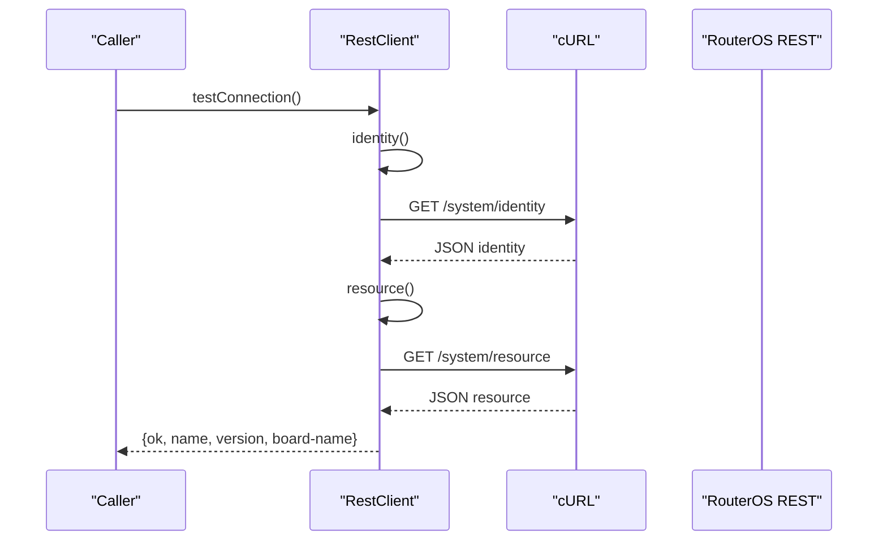
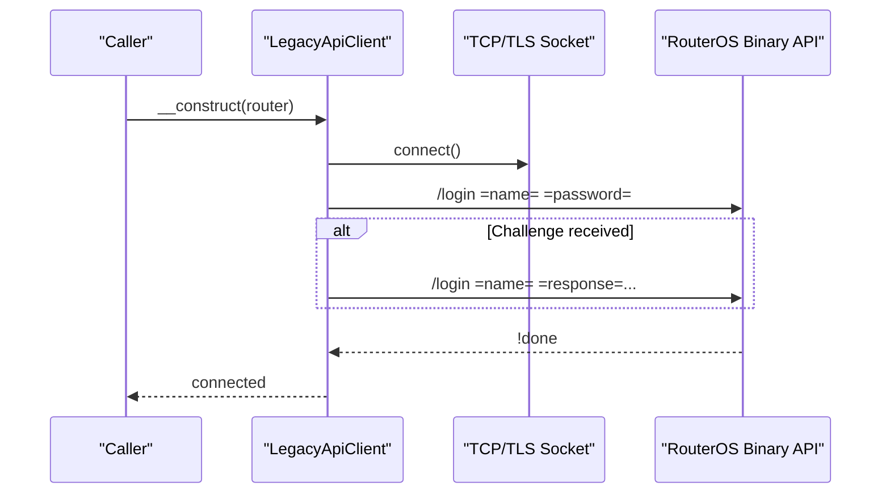
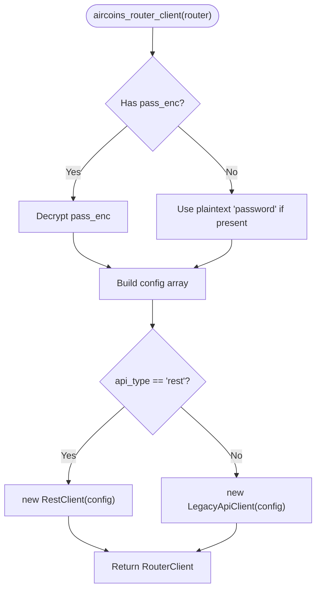
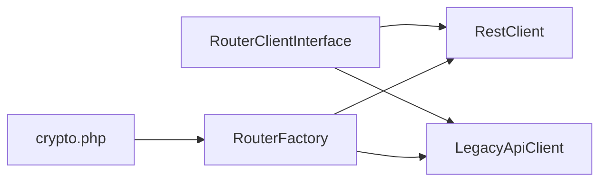

# Router Client Interface

<cite>
**Referenced Files in This Document**
- [RouterClientInterface.php](file://includes/RouterOS/RouterClientInterface.php)
- [RestClient.php](file://includes/RouterOS/RestClient.php)
- [LegacyApiClient.php](file://includes/RouterOS/LegacyApiClient.php)
- [RouterFactory.php](file://includes/RouterOS/RouterFactory.php)
</cite>

## Table of Contents
1. [Introduction](#introduction)
2. [Project Structure](#project-structure)
3. [Core Components](#core-components)
4. [Architecture Overview](#architecture-overview)
5. [Detailed Component Analysis](#detailed-component-analysis)
6. [Dependency Analysis](#dependency-analysis)
7. [Performance Considerations](#performance-considerations)
8. [Troubleshooting Guide](#troubleshooting-guide)
9. [Conclusion](#conclusion)

## Introduction
This document explains the Router Client abstraction layer used to communicate with MikroTik RouterOS devices. The central contract is a single interface that defines how all RouterOS API clients must behave. Two concrete implementations exist:
- REST client for RouterOS v7 over HTTPS
- Legacy binary API client for RouterOS v6 and v7 over TCP/TLS port 8728/8729

The interface standardizes connection probing, identity and resource queries, hotspot user/profile management, active session inspection and termination, interface listing, and MAC-based session lookup. A factory builds the correct implementation based on router configuration, enabling polymorphism without exposing protocol details to higher layers such as the admin panel or portal session API.

## Project Structure
The RouterOS client code lives under `includes/RouterOS/`:
- `RouterClientInterface.php` declares the unified contract
- `RestClient.php` implements the contract using HTTP/JSON
- `LegacyApiClient.php` implements the contract using the RouterOS binary sentence protocol
- `RouterFactory.php` selects and constructs the appropriate client

**Diagram sources**
- [RouterClientInterface.php:31-127](file://includes/RouterOS/RouterClientInterface.php#L31-L127)
- [RestClient.php:24-25](file://includes/RouterOS/RestClient.php#L24-L25)
- [LegacyApiClient.php:22-23](file://includes/RouterOS/LegacyApiClient.php#L22-L23)
- [RouterFactory.php:29-55](file://includes/RouterOS/RouterFactory.php#L29-L55)

**Section sources**
- [RouterClientInterface.php:1-27](file://includes/RouterOS/RouterClientInterface.php#L1-L27)
- [RestClient.php:1-18](file://includes/RouterOS/RestClient.php#L1-L18)
- [LegacyApiClient.php:1-16](file://includes/RouterOS/LegacyApiClient.php#L1-L16)
- [RouterFactory.php:1-15](file://includes/RouterOS/RouterFactory.php#L1-L15)

## Core Components
The core components are:
- RouterClient interface: the contract for all RouterOS clients
- RestClient: HTTP/JSON client for RouterOS v7 REST API
- LegacyApiClient: binary sentence client for legacy RouterOS API
- RouterFactory: creates the correct client based on configuration

Key responsibilities:
- Define consistent method signatures across protocols
- Normalize data shapes returned by different APIs into a common structure
- Provide connection testing, authentication (handled internally), and CRUD-like operations for hotspot users and profiles
- Expose read-only operations for active sessions, interfaces, identity, and system resources

**Section sources**
- [RouterClientInterface.php:31-127](file://includes/RouterOS/RouterClientInterface.php#L31-L127)
- [RestClient.php:24-25](file://includes/RouterOS/RestClient.php#L24-L25)
- [LegacyApiClient.php:22-23](file://includes/RouterOS/LegacyApiClient.php#L22-L23)
- [RouterFactory.php:29-55](file://includes/RouterOS/RouterFactory.php#L29-L55)

## Architecture Overview
The RouterOS client architecture follows an interface-driven design:
- Higher layers depend only on the RouterClient interface
- RestClient and LegacyApiClient implement the same methods but use different transport protocols
- RouterFactory encapsulates selection logic and credential handling

**Diagram sources**
- [RouterClientInterface.php:31-127](file://includes/RouterOS/RouterClientInterface.php#L31-L127)
- [RestClient.php:24-48](file://includes/RouterOS/RestClient.php#L24-L48)
- [RestClient.php:255-316](file://includes/RouterOS/RestClient.php#L255-L316)
- [LegacyApiClient.php:22-50](file://includes/RouterOS/LegacyApiClient.php#L22-L50)
- [LegacyApiClient.php:70-94](file://includes/RouterOS/LegacyApiClient.php#L70-L94)
- [LegacyApiClient.php:101-167](file://includes/RouterOS/LegacyApiClient.php#L101-L167)
- [LegacyApiClient.php:186-241](file://includes/RouterOS/LegacyApiClient.php#L186-L241)
- [LegacyApiClient.php:286-331](file://includes/RouterOS/LegacyApiClient.php#L286-L331)
- [LegacyApiClient.php:372-423](file://includes/RouterOS/LegacyApiClient.php#L372-L423)
- [RouterFactory.php:29-55](file://includes/RouterOS/RouterFactory.php#L29-L55)

## Detailed Component Analysis

### RouterClient Interface
The interface defines the complete contract for interacting with RouterOS devices. It includes:
- Connection probing via testConnection
- Identity and resource queries
- Hotspot user and profile management (list, add, delete)
- Active session management (list, kick, find by MAC)
- Interface listing with traffic counters

Return-value conventions are documented at the top of the interface file and enforced by both implementations. Methods throw exceptions on transport or authentication failures.

**Diagram sources**
- [RouterClientInterface.php:31-127](file://includes/RouterOS/RouterClientInterface.php#L31-L127)

**Section sources**
- [RouterClientInterface.php:1-27](file://includes/RouterOS/RouterClientInterface.php#L1-L27)
- [RouterClientInterface.php:31-127](file://includes/RouterOS/RouterClientInterface.php#L31-L127)

### RestClient Implementation
The REST client communicates with RouterOS v7 over HTTPS using cURL and HTTP Basic Authentication. It maps REST verbs to RouterOS operations:
- GET -> print
- PUT -> add
- PATCH -> set
- DELETE -> remove
- POST -> command

Important behaviors:
- All values come back as strings; numeric fields are cast to satisfy the interface contract
- `.id` values are appended raw to paths to avoid percent-encoding asterisks
- Errors are converted into descriptive RuntimeException messages
- Uptime strings are parsed into seconds
- Boolean-ish values are coerced to PHP booleans

**Diagram sources**
- [RestClient.php:55-65](file://includes/RouterOS/RestClient.php#L55-L65)
- [RestClient.php:68-86](file://includes/RouterOS/RestClient.php#L68-L86)
- [RestClient.php:270-316](file://includes/RouterOS/RestClient.php#L270-L316)

**Section sources**
- [RestClient.php:1-18](file://includes/RouterOS/RestClient.php#L1-L18)
- [RestClient.php:24-48](file://includes/RouterOS/RestClient.php#L24-L48)
- [RestClient.php:55-222](file://includes/RouterOS/RestClient.php#L55-L222)
- [RestClient.php:270-316](file://includes/RouterOS/RestClient.php#L270-L316)
- [RestClient.php:354-457](file://includes/RouterOS/RestClient.php#L354-L457)

### LegacyApiClient Implementation
The Legacy client uses the RouterOS binary sentence protocol over TCP or TLS. Key features:
- Dual-mode login: plaintext for newer firmware, challenge-response for older firmware
- Length-prefixed word encoding/decoding for the binary protocol
- Sentence I/O with error handling for traps and fatal errors
- Command execution returning records and done attributes

**Diagram sources**
- [LegacyApiClient.php:40-50](file://includes/RouterOS/LegacyApiClient.php#L40-L50)
- [LegacyApiClient.php:70-94](file://includes/RouterOS/LegacyApiClient.php#L70-L94)
- [LegacyApiClient.php:101-167](file://includes/RouterOS/LegacyApiClient.php#L101-L167)

**Section sources**
- [LegacyApiClient.php:1-16](file://includes/RouterOS/LegacyApiClient.php#L1-L16)
- [LegacyApiClient.php:22-50](file://includes/RouterOS/LegacyApiClient.php#L22-L50)
- [LegacyApiClient.php:70-167](file://includes/RouterOS/LegacyApiClient.php#L70-L167)
- [LegacyApiClient.php:186-241](file://includes/RouterOS/LegacyApiClient.php#L186-L241)
- [LegacyApiClient.php:286-423](file://includes/RouterOS/LegacyApiClient.php#L286-L423)
- [LegacyApiClient.php:430-599](file://includes/RouterOS/LegacyApiClient.php#L430-L599)

### RouterFactory Pattern
The factory provides polymorphic instantiation of RouterClient implementations:
- Reads router configuration including encrypted password
- Decrypts credentials in memory only
- Selects RestClient for api_type='rest', otherwise LegacyApiClient
- Returns a fully constructed and authenticated client

**Diagram sources**
- [RouterFactory.php:29-55](file://includes/RouterOS/RouterFactory.php#L29-L55)

**Section sources**
- [RouterFactory.php:1-15](file://includes/RouterOS/RouterFactory.php#L1-L15)
- [RouterFactory.php:29-55](file://includes/RouterOS/RouterFactory.php#L29-L55)

## Dependency Analysis
The dependency relationships are straightforward:
- Both RestClient and LegacyApiClient depend on RouterClientInterface
- RouterFactory depends on both implementations and the crypto helper
- Higher layers depend only on RouterClientInterface and RouterFactory

**Diagram sources**
- [RouterClientInterface.php:31-127](file://includes/RouterOS/RouterClientInterface.php#L31-L127)
- [RestClient.php:22-24](file://includes/RouterOS/RestClient.php#L22-L24)
- [LegacyApiClient.php:20-22](file://includes/RouterOS/LegacyApiClient.php#L20-L22)
- [RouterFactory.php:12-15](file://includes/RouterOS/RouterFactory.php#L12-L15)

**Section sources**
- [RouterClientInterface.php:31-127](file://includes/RouterOS/RouterClientInterface.php#L31-L127)
- [RestClient.php:22-24](file://includes/RouterOS/RestClient.php#L22-L24)
- [LegacyApiClient.php:20-22](file://includes/RouterOS/LegacyApiClient.php#L20-L22)
- [RouterFactory.php:12-15](file://includes/RouterOS/RouterFactory.php#L12-L15)

## Performance Considerations
- REST client uses cURL with timeouts and SSL verification options; ensure proper network configuration for optimal performance
- Legacy client uses stream sockets with configurable timeouts; consider connection pooling if multiple concurrent requests are needed
- Both clients normalize data types and parse uptime strings; this adds minimal overhead but ensures consistent return shapes
- Avoid unnecessary repeated calls to hotspotUsers(), activeSessions(), and interfaces() by caching results where appropriate in higher layers

[No sources needed since this section provides general guidance]

## Troubleshooting Guide
Common issues and their handling:
- REST client throws RuntimeException on transport failures, HTTP errors >= 400, or invalid JSON responses
- Legacy client throws RuntimeException on socket errors, timeout, EOF, short reads, write failures, or RouterOS trap/fatal replies
- Authentication failures are surfaced through detailed exception messages from both clients
- Ensure TLS verification settings match your environment (self-signed certificates may require disabling verification)

**Section sources**
- [RestClient.php:270-316](file://includes/RouterOS/RestClient.php#L270-L316)
- [RestClient.php:325-340](file://includes/RouterOS/RestClient.php#L325-L340)
- [LegacyApiClient.php:70-94](file://includes/RouterOS/LegacyApiClient.php#L70-L94)
- [LegacyApiClient.php:101-167](file://includes/RouterOS/LegacyApiClient.php#L101-L167)
- [LegacyApiClient.php:255-278](file://includes/RouterOS/LegacyApiClient.php#L255-L278)
- [LegacyApiClient.php:297-312](file://includes/RouterOS/LegacyApiClient.php#L297-L312)
- [LegacyApiClient.php:386-423](file://includes/RouterOS/LegacyApiClient.php#L386-L423)

## Conclusion
The RouterClient interface provides a clean, protocol-agnostic contract for RouterOS communication. By implementing this interface, both REST and Legacy clients offer consistent behavior while hiding protocol-specific details. The RouterFactory pattern enables polymorphic client selection based on configuration, making the system flexible and maintainable. This design allows higher layers to interact with RouterOS devices uniformly, regardless of whether they use modern REST APIs or legacy binary protocols.

[No sources needed since this section summarizes without analyzing specific files]