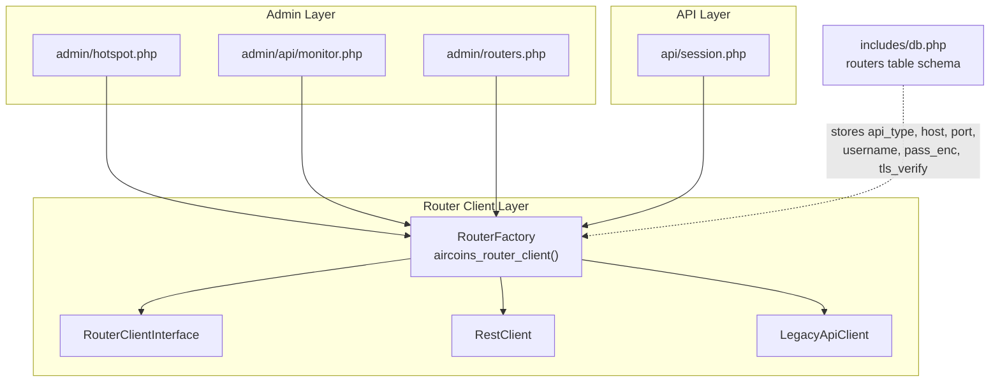
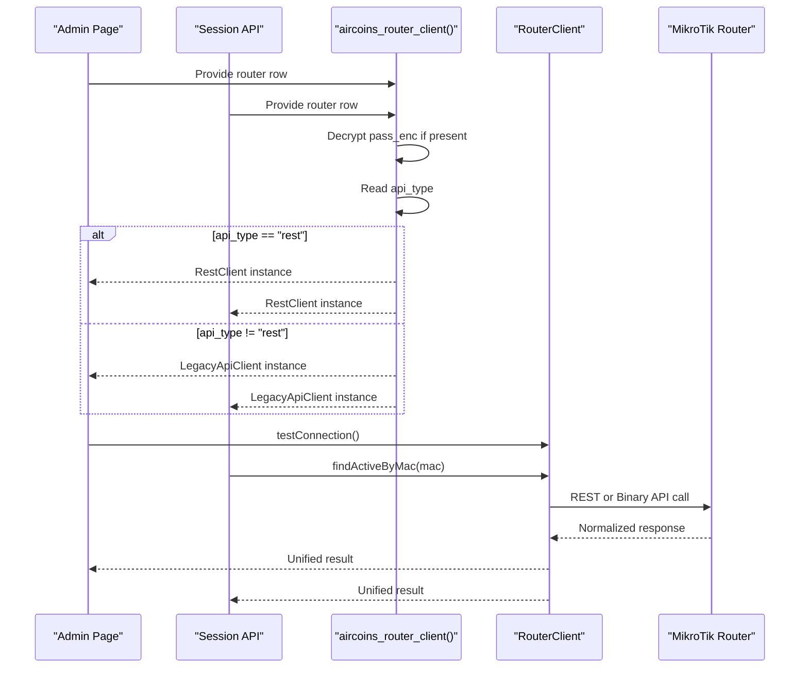
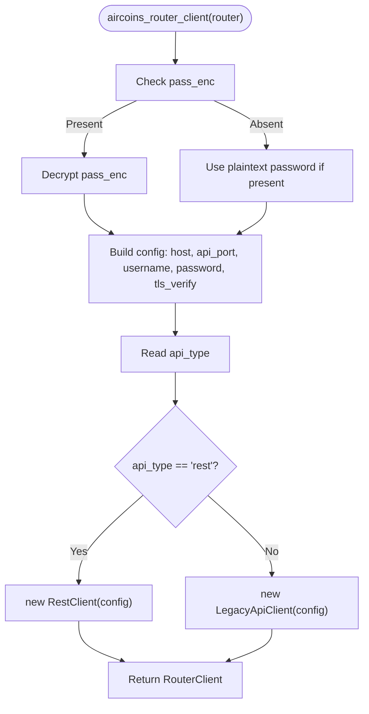
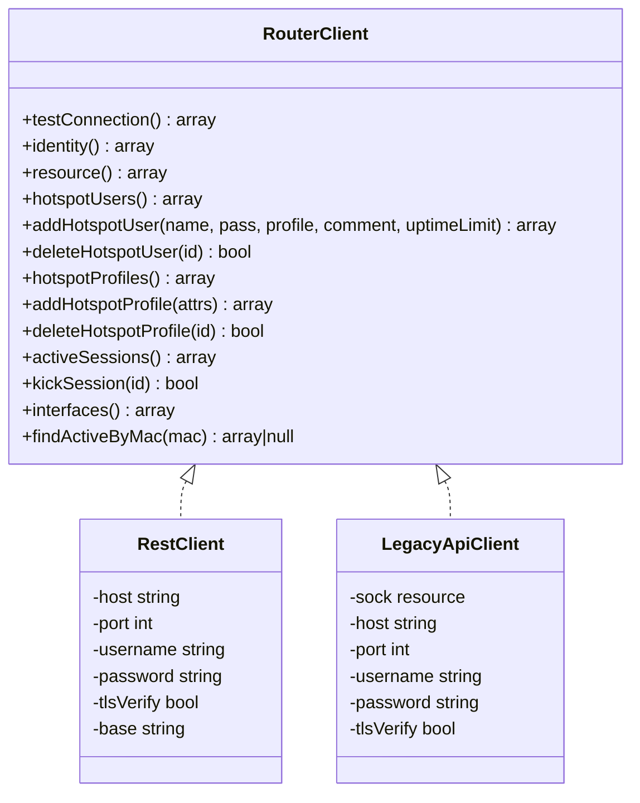
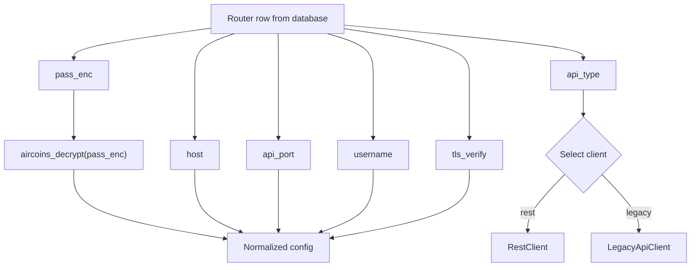
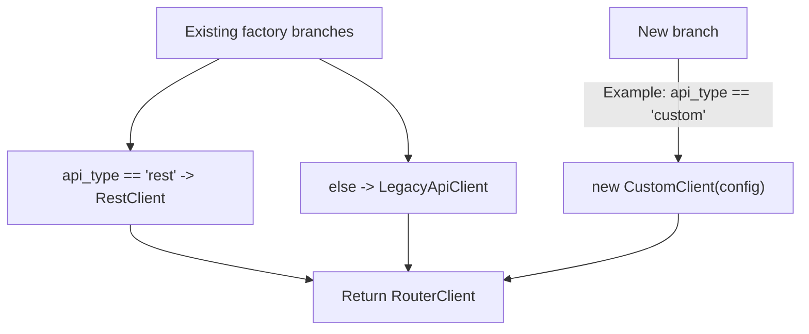
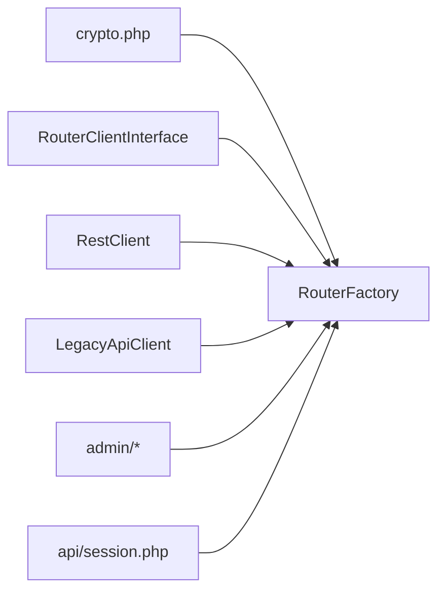

# Router Factory Pattern

<cite>
**Referenced Files in This Document**
- [RouterFactory.php](file://includes/RouterOS/RouterFactory.php)
- [RouterClientInterface.php](file://includes/RouterOS/RouterClientInterface.php)
- [RestClient.php](file://includes/RouterOS/RestClient.php)
- [LegacyApiClient.php](file://includes/RouterOS/LegacyApiClient.php)
- [monitor.php](file://admin/api/monitor.php)
- [hotspot.php](file://admin/hotspot.php)
- [routers.php](file://admin/routers.php)
- [session.php](file://api/session.php)
- [db.php](file://includes/db.php)
</cite>

## Table of Contents
1. [Introduction](#introduction)
2. [Project Structure](#project-structure)
3. [Core Components](#core-components)
4. [Architecture Overview](#architecture-overview)
5. [Detailed Component Analysis](#detailed-component-analysis)
6. [Dependency Analysis](#dependency-analysis)
7. [Performance Considerations](#performance-considerations)
8. [Troubleshooting Guide](#troubleshooting-guide)
9. [Conclusion](#conclusion)

## Introduction
This document explains the Router Factory pattern used to dynamically select between two MikroTik RouterOS client implementations: a modern REST client and a legacy binary API client. The factory is configuration-driven, resolves encrypted router credentials safely, and returns a unified `RouterClient` so higher layers do not need to know which protocol is being used.

The design follows the Factory Method pattern: callers request a `RouterClient`, and the factory decides whether to instantiate `RestClient` or `LegacyApiClient`. There is no automatic version detection logic in the factory; selection is based on the stored `api_type` value.

## Project Structure
The relevant code lives under `includes/RouterOS/` and is consumed by admin and API entry points.

**Diagram sources**
- [RouterFactory.php:10-55](file://includes/RouterOS/RouterFactory.php#L10-L55)
- [RouterClientInterface.php:31-127](file://includes/RouterOS/RouterClientInterface.php#L31-L127)
- [RestClient.php:24-48](file://includes/RouterOS/RestClient.php#L24-L48)
- [LegacyApiClient.php:22-50](file://includes/RouterOS/LegacyApiClient.php#L22-L50)
- [monitor.php:131](file://admin/api/monitor.php#L131)
- [hotspot.php:102](file://admin/hotspot.php#L102)
- [hotspot.php:290](file://admin/hotspot.php#L290)
- [routers.php:80](file://admin/routers.php#L80)
- [routers.php:126](file://admin/routers.php#L126)
- [session.php:69](file://api/session.php#L69)
- [db.php:68-81](file://includes/db.php#L68-L81)

**Section sources**
- [RouterFactory.php:1-55](file://includes/RouterOS/RouterFactory.php#L1-L55)
- [db.php:68-81](file://includes/db.php#L68-L81)

## Core Components
- `RouterClientInterface`: Defines the unified contract for all router clients. Both REST and Legacy implementations expose identical methods such as `testConnection`, `identity`, `resource`, `hotspotUsers`, `addHotspotUser`, `deleteHotspotUser`, `hotspotProfiles`, `addHotspotProfile`, `deleteHotspotProfile`, `activeSessions`, `kickSession`, `interfaces`, and `findActiveByMac`.
- `RestClient`: Implements the interface using HTTP Basic authentication over HTTPS (or HTTP) against RouterOS v7 REST endpoints. It maps REST verbs to RouterOS operations and normalizes responses into the shared shape.
- `LegacyApiClient`: Implements the interface using the RouterOS binary sentence protocol over TCP or TLS. It supports both plaintext login and challenge-response authentication flows.
- `RouterFactory`: Provides the global factory function `aircoins_router_client(routerRow)` that builds the correct client based on configuration.

Key responsibilities:
- Resolve plaintext password from encrypted storage or test data.
- Build a normalized configuration array.
- Select implementation based on `api_type`.
- Return a connected `RouterClient`.

**Section sources**
- [RouterClientInterface.php:31-127](file://includes/RouterOS/RouterClientInterface.php#L31-L127)
- [RestClient.php:24-48](file://includes/RouterOS/RestClient.php#L24-L48)
- [LegacyApiClient.php:22-50](file://includes/RouterOS/LegacyApiClient.php#L22-L50)
- [RouterFactory.php:17-55](file://includes/RouterOS/RouterFactory.php#L17-L55)

## Architecture Overview
The system uses a simple but robust separation:
- Configuration layer stores router metadata and encrypted credentials.
- Factory layer selects and instantiates the appropriate client.
- Consumer layers call only the unified interface.

**Diagram sources**
- [RouterFactory.php:29-55](file://includes/RouterOS/RouterFactory.php#L29-L55)
- [RestClient.php:54-65](file://includes/RouterOS/RestClient.php#L54-L65)
- [LegacyApiClient.php:429-440](file://includes/RouterOS/LegacyApiClient.php#L429-L440)
- [monitor.php:131](file://admin/api/monitor.php#L131)
- [session.php:69](file://api/session.php#L69)

## Detailed Component Analysis

### Factory Function Design
The factory is a procedural function rather than a class-based factory. This keeps dependencies flat because the project does not use Composer namespaces. The function:
- Accepts a router row array.
- Resolves the plaintext password either from an encrypted field or a direct plaintext field.
- Builds a normalized configuration object with host, port, username, password, and TLS verification preference.
- Chooses the client type based on `api_type`.

**Diagram sources**
- [RouterFactory.php:29-55](file://includes/RouterOS/RouterFactory.php#L29-L55)

**Section sources**
- [RouterFactory.php:17-55](file://includes/RouterOS/RouterFactory.php#L17-L55)

### RouterClient Interface Contract
The interface defines a stable surface area for all router interactions. Consumers can switch implementations without changing business logic. Important behaviors include:
- Connection probing via `testConnection`.
- Identity and resource queries.
- Hotspot user and profile CRUD.
- Active session listing and disconnection.
- Interface enumeration.
- MAC-based active session lookup.

**Diagram sources**
- [RouterClientInterface.php:31-127](file://includes/RouterOS/RouterClientInterface.php#L31-L127)
- [RestClient.php:24-48](file://includes/RouterOS/RestClient.php#L24-L48)
- [LegacyApiClient.php:22-50](file://includes/RouterOS/LegacyApiClient.php#L22-L50)

**Section sources**
- [RouterClientInterface.php:31-127](file://includes/RouterOS/RouterClientInterface.php#L31-L127)

### REST Client Implementation
The REST client targets RouterOS v7’s `/rest` endpoint. It:
- Uses HTTP Basic authentication.
- Maps REST verbs to RouterOS operations.
- Handles JSON responses and coerces types to match the interface contract.
- Treats `.id` values as raw path segments to avoid encoding issues.

Key operational notes:
- Default base URL is built from scheme, host, port, and `/rest`.
- Errors are converted into descriptive exceptions.
- Uptime strings are parsed into seconds.
- Boolean-like values are normalized.

**Section sources**
- [RestClient.php:1-48](file://includes/RouterOS/RestClient.php#L1-L48)
- [RestClient.php:54-65](file://includes/RouterOS/RestClient.php#L54-L65)
- [RestClient.php:228-316](file://includes/RouterOS/RestClient.php#L228-L316)
- [RestClient.php:354-457](file://includes/RouterOS/RestClient.php#L354-L457)

### Legacy API Client Implementation
The legacy client implements the RouterOS binary sentence protocol over TCP or TLS. It:
- Connects immediately during construction.
- Authenticates using a dual-mode handshake: plaintext first, then challenge-response when required.
- Encodes and decodes length-prefixed words.
- Parses sentences into attribute maps.
- Exposes command execution and record collection.

Important characteristics:
- Port 8728 is plain TCP; port 8729 is TLS.
- Socket lifecycle is managed through constructor and destructor.
- Network errors and protocol traps/fatals are turned into exceptions.
- Response normalization mirrors the REST client’s output shape.

**Section sources**
- [LegacyApiClient.php:1-50](file://includes/RouterOS/LegacyApiClient.php#L1-L50)
- [LegacyApiClient.php:70-167](file://includes/RouterOS/LegacyApiClient.php#L70-L167)
- [LegacyApiClient.php:186-241](file://includes/RouterOS/LegacyApiClient.php#L186-L241)
- [LegacyApiClient.php:286-423](file://includes/RouterOS/LegacyApiClient.php#L286-L423)
- [LegacyApiClient.php:429-440](file://includes/RouterOS/LegacyApiClient.php#L429-L440)

### Configuration-Driven Client Instantiation
The factory reads the following fields from the router row:
- `host`: Router hostname or IP.
- `api_port`: Protocol-specific port.
- `username`: RouterOS account name.
- `pass_enc` or `password`: Encrypted or plaintext password.
- `tls_verify`: Whether to verify TLS certificates.
- `api_type`: Either `rest` or another value (defaulting to legacy).

The database schema enforces `api_type` to be one of `rest` or `legacy`.

**Diagram sources**
- [RouterFactory.php:31-54](file://includes/RouterOS/RouterFactory.php#L31-L54)
- [db.php:68-81](file://includes/db.php#L68-L81)

**Section sources**
- [RouterFactory.php:31-54](file://includes/RouterOS/RouterFactory.php#L31-L54)
- [db.php:68-81](file://includes/db.php#L68-L81)

### Automatic Protocol Detection Logic
There is no automatic RouterOS version detection in the factory. Selection is explicitly driven by the `api_type` field:
- If `api_type` equals `rest`, the factory returns `RestClient`.
- Otherwise, it returns `LegacyApiClient`.

This means administrators must configure routers correctly. If a router should use REST, set `api_type = rest`; otherwise, use `legacy`.

**Section sources**
- [RouterFactory.php:48-54](file://includes/RouterOS/RouterFactory.php#L48-L54)
- [db.php:72](file://includes/db.php#L72)

### Factory Usage Patterns
The factory is used across admin pages and the session API. Typical usage patterns include:
- Loading a router row from the database.
- Calling `aircoins_router_client(row)` to obtain a `RouterClient`.
- Using the returned client for connection tests, hotspot management, session queries, and interface monitoring.

Examples in this repository:
- Admin monitor endpoint retrieves a router row and creates a client.
- Hotspot management pages create clients for reading and modifying hotspot users and profiles.
- Router management pages test connectivity and update status.
- Session API locates active sessions by MAC address.

**Section sources**
- [monitor.php:131](file://admin/api/monitor.php#L131)
- [hotspot.php:102](file://admin/hotspot.php#L102)
- [hotspot.php:290](file://admin/hotspot.php#L290)
- [routers.php:80](file://admin/routers.php#L80)
- [routers.php:126](file://admin/routers.php#L126)
- [session.php:69](file://api/session.php#L69)

### Extension Points for Adding New Client Types
To add a new client type:
1. Implement the `RouterClient` interface.
2. Add a new branch in `aircoins_router_client` to return the new client when a specific `api_type` value is configured.
3. Update the database schema validation if you introduce a new allowed `api_type`.
4. Ensure the new client normalizes responses to match the interface contract.

**Diagram sources**
- [RouterFactory.php:48-54](file://includes/RouterOS/RouterFactory.php#L48-L54)
- [RouterClientInterface.php:31-127](file://includes/RouterOS/RouterClientInterface.php#L31-L127)

**Section sources**
- [RouterFactory.php:48-54](file://includes/RouterOS/RouterFactory.php#L48-L54)
- [RouterClientInterface.php:31-127](file://includes/RouterOS/RouterClientInterface.php#L31-L127)

## Dependency Analysis
The factory depends on:
- The interface definition.
- Both client implementations.
- The encryption helper for decrypting stored passwords.

Consumers depend only on the factory function and the interface contract.

**Diagram sources**
- [RouterFactory.php:12-15](file://includes/RouterOS/RouterFactory.php#L12-L15)
- [monitor.php:131](file://admin/api/monitor.php#L131)
- [hotspot.php:102](file://admin/hotspot.php#L102)
- [hotspot.php:290](file://admin/hotspot.php#L290)
- [routers.php:80](file://admin/routers.php#L80)
- [routers.php:126](file://admin/routers.php#L126)
- [session.php:69](file://api/session.php#L69)

**Section sources**
- [RouterFactory.php:12-15](file://includes/RouterOS/RouterFactory.php#L12-L15)
- [monitor.php:131](file://admin/api/monitor.php#L131)
- [hotspot.php:102](file://admin/hotspot.php#L102)
- [hotspot.php:290](file://admin/hotspot.php#L290)
- [routers.php:80](file://admin/routers.php#L80)
- [routers.php:126](file://admin/routers.php#L126)
- [session.php:69](file://api/session.php#L69)

## Performance Considerations
- REST client uses cURL with short timeouts and JSON payloads. It avoids persistent connections per request, which simplifies error handling but may incur connection overhead.
- Legacy client opens a TCP/TLS socket during construction and keeps it open until destruction. This reduces repeated handshake costs within a single request lifecycle.
- Password decryption happens once per factory call and is kept in memory only.
- Response normalization ensures consistent types, reducing downstream casting costs.

[No sources needed since this section provides general guidance]

## Troubleshooting Guide
Common issues and where they originate:
- Decryption failures: Occur when encrypted passwords cannot be decrypted before client instantiation.
- REST transport errors: cURL initialization, network failures, or HTTP errors above 400 raise exceptions.
- Legacy connection/login failures: Socket connection, TLS context, or RouterOS trap/fatal replies raise exceptions.
- Incorrect `api_type`: If a router is misconfigured, the wrong protocol will be used, causing authentication or endpoint errors.

Recommended checks:
- Verify `api_type` matches the router’s available API.
- Confirm `host`, `api_port`, `username`, and `pass_enc` are correct.
- Review TLS settings when using HTTPS or TLS ports.
- Inspect exception messages from the selected client for detailed diagnostics.

**Section sources**
- [RouterFactory.php:26-28](file://includes/RouterOS/RouterFactory.php#L26-L28)
- [RestClient.php:277-316](file://includes/RouterOS/RestClient.php#L277-L316)
- [LegacyApiClient.php:70-167](file://includes/RouterOS/LegacyApiClient.php#L70-L167)

## Conclusion
The Router Factory pattern in this project cleanly separates configuration from protocol details. By exposing a single `RouterClient` interface and a configuration-driven factory function, the application supports both modern REST and legacy binary APIs without burdening consumers with implementation differences. While there is no automatic RouterOS version detection, the design remains extensible: adding new client types requires implementing the interface and extending the factory’s selection logic.

[No sources needed since this section summarizes without analyzing specific files]