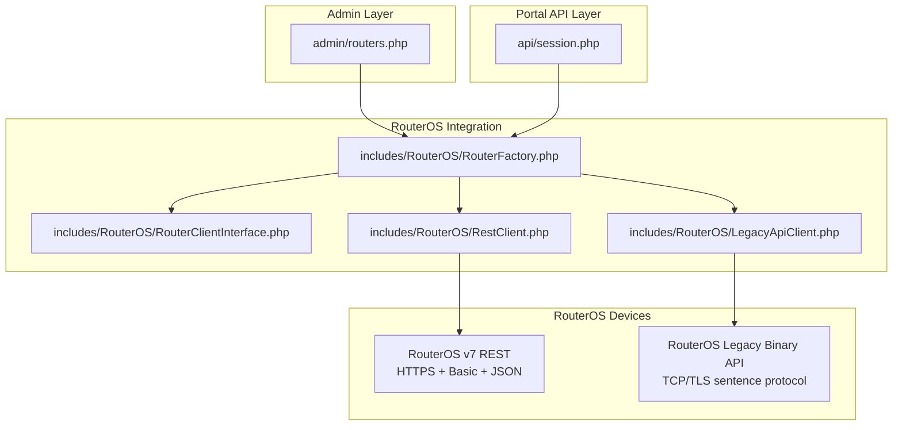
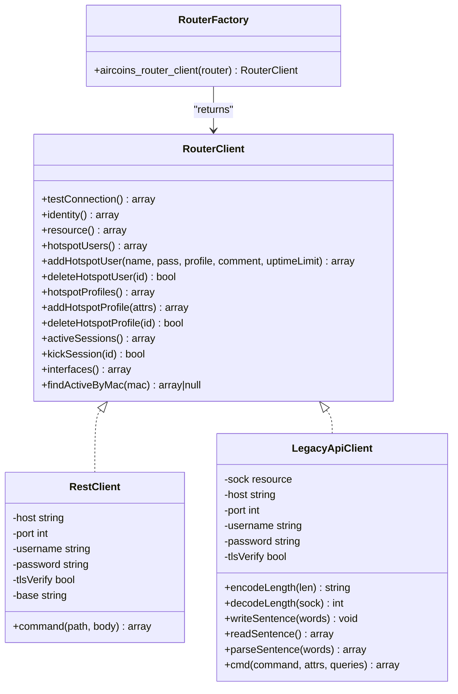
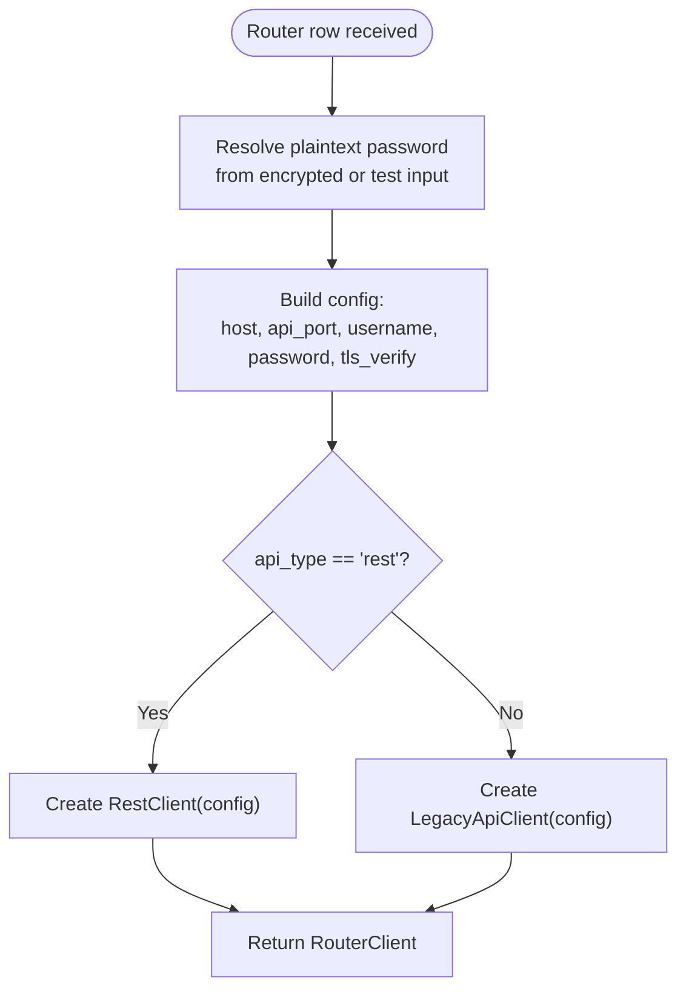
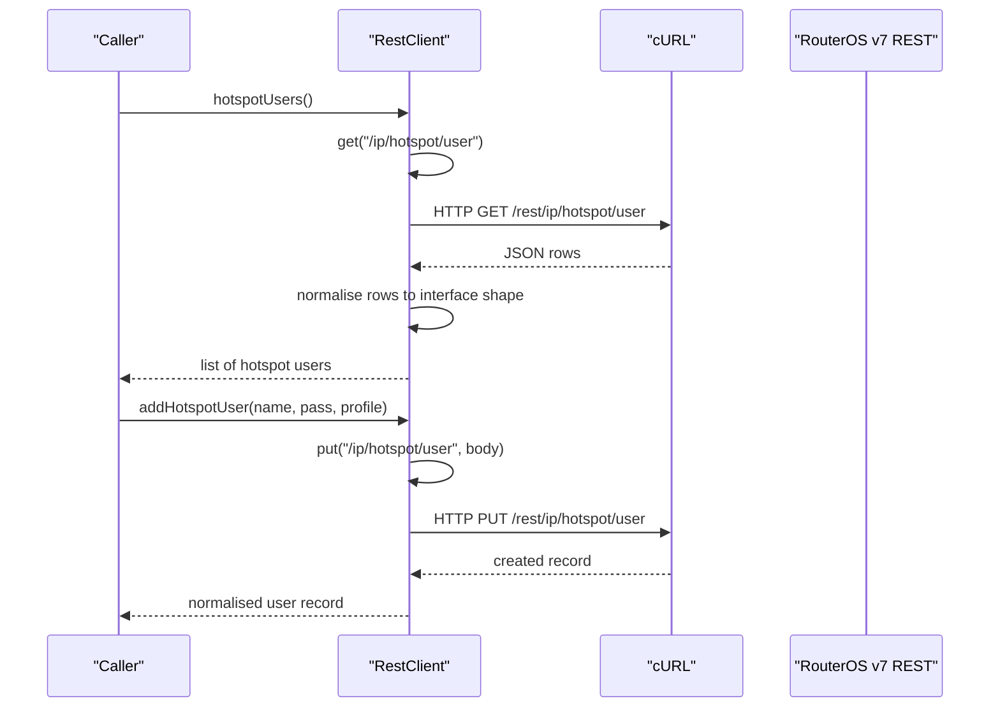
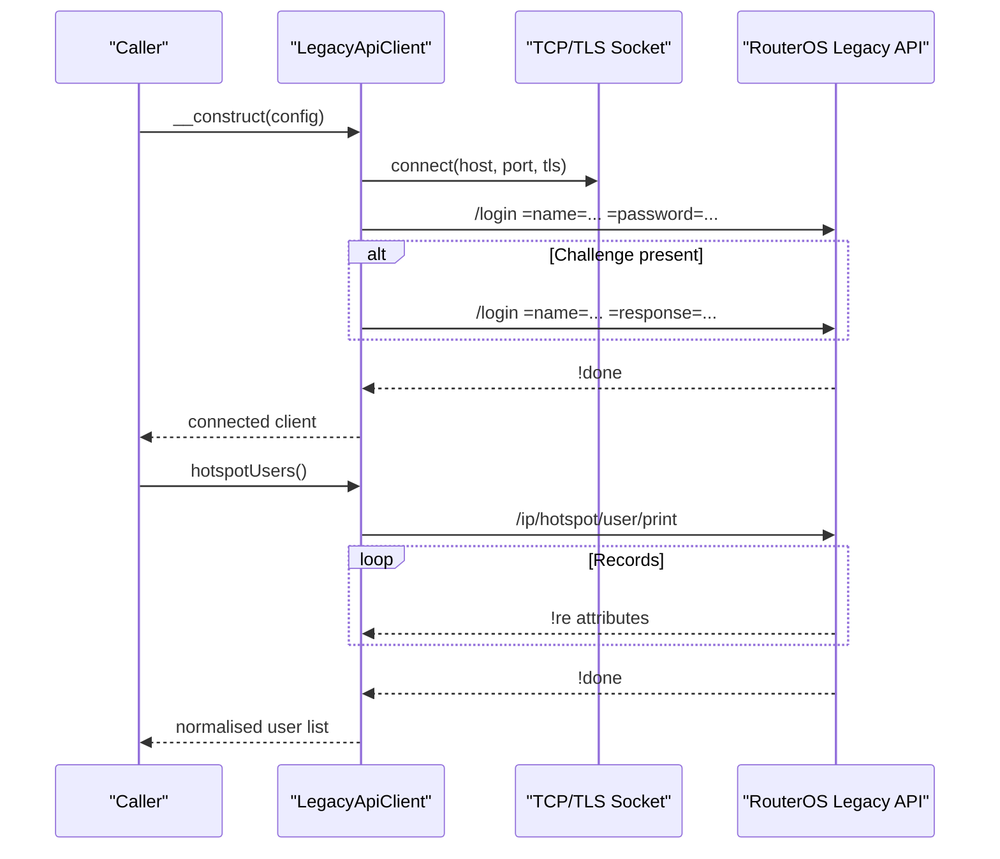
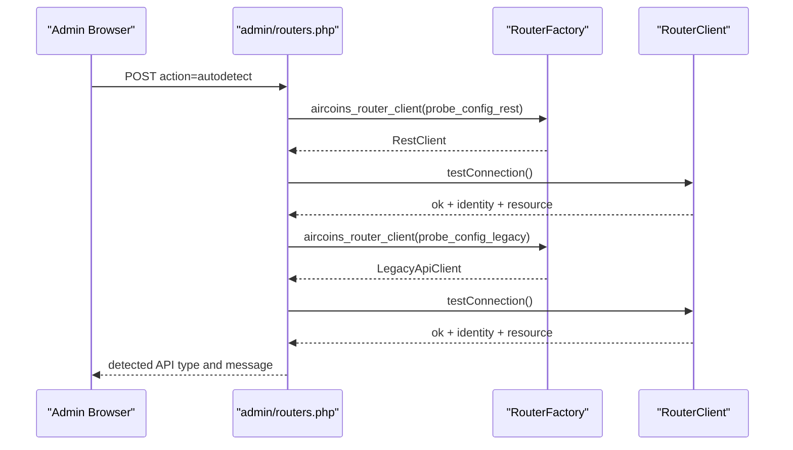
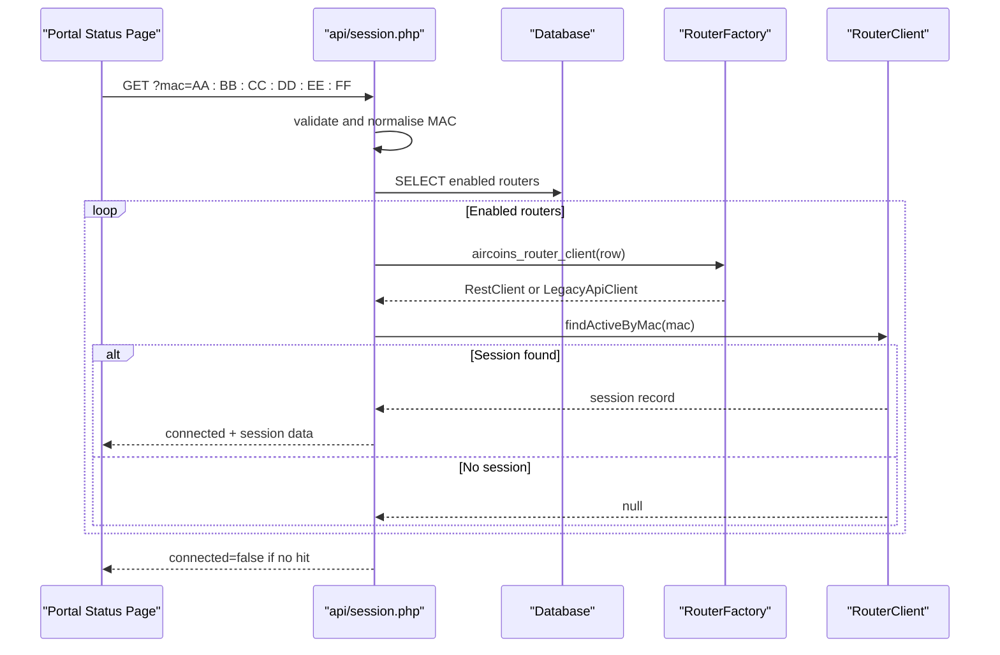
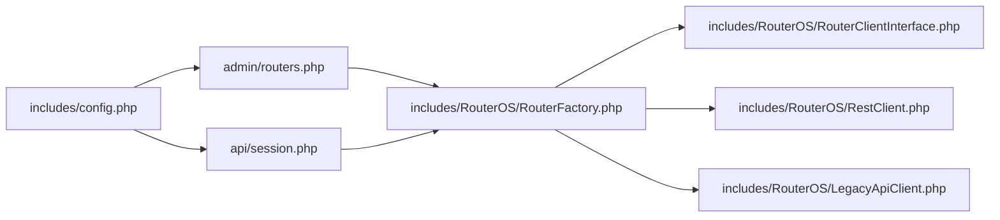

# RouterOS Integration APIs

<cite>
**Referenced Files in This Document**
- [RouterClientInterface.php](file://includes/RouterOS/RouterClientInterface.php)
- [RouterFactory.php](file://includes/RouterOS/RouterFactory.php)
- [RestClient.php](file://includes/RouterOS/RestClient.php)
- [LegacyApiClient.php](file://includes/RouterOS/LegacyApiClient.php)
- [routers.php](file://admin/routers.php)
- [session.php](file://api/session.php)
- [config.php](file://includes/config.php)
</cite>

## Table of Contents
1. [Introduction](#introduction)
2. [Project Structure](#project-structure)
3. [Core Components](#core-components)
4. [Architecture Overview](#architecture-overview)
5. [Detailed Component Analysis](#detailed-component-analysis)
6. [Dependency Analysis](#dependency-analysis)
7. [Performance Considerations](#performance-considerations)
8. [Troubleshooting Guide](#troubleshooting-guide)
9. [Conclusion](#conclusion)
10. [Appendices](#appendices)

## Introduction
This document explains the RouterOS integration layer used by the controller to manage MikroTik routers through two protocol implementations:
- REST API client for RouterOS v7.
- Legacy binary API client for RouterOS v6 and v7.

The layer exposes a single `RouterClient` interface so higher-level code, such as the admin panel and portal session endpoint, can operate against either implementation without knowing which protocol is actually used. A factory resolves the correct client based on stored router configuration, decrypting credentials only in memory.

## Project Structure
The RouterOS integration lives under `includes/RouterOS`. The surrounding application uses it from:
- Admin router management page, which adds, edits, tests, and auto-detects routers.
- Portal-facing session JSON endpoint, which queries active sessions across enabled routers.

**Diagram sources**
- [routers.php:17-21](file://admin/routers.php#L17-L21)
- [session.php:23-25](file://api/session.php#L23-L25)
- [RouterFactory.php:12-15](file://includes/RouterOS/RouterFactory.php#L12-L15)
- [RestClient.php:22-24](file://includes/RouterOS/RestClient.php#L22-L24)
- [LegacyApiClient.php:20-22](file://includes/RouterOS/LegacyApiClient.php#L20-L22)

**Section sources**
- [routers.php:1-13](file://admin/routers.php#L1-L13)
- [session.php:1-19](file://api/session.php#L1-L19)
- [RouterFactory.php:1-28](file://includes/RouterOS/RouterFactory.php#L1-L28)

## Core Components
The integration has four core pieces:
- `RouterClientInterface`: the unified contract for all RouterOS operations.
- `RestClient`: RouterOS v7 REST client using HTTPS, HTTP Basic authentication, and JSON.
- `LegacyApiClient`: RouterOS legacy binary client over TCP or TLS with a length-prefixed sentence protocol and dual-mode login.
- `RouterFactory`: builds the correct client from a router row, handling encrypted password resolution and API type selection.

Key responsibilities:
- Normalise RouterOS responses into consistent shapes.
- Provide connection testing, identity and resource queries.
- Manage hotspot users, profiles, active sessions, and interfaces.
- Support MAC-based session lookup for the portal status endpoint.

**Section sources**
- [RouterClientInterface.php:1-27](file://includes/RouterOS/RouterClientInterface.php#L1-L27)
- [RouterClientInterface.php:31-127](file://includes/RouterOS/RouterClientInterface.php#L31-L127)
- [RestClient.php:1-18](file://includes/RouterOS/RestClient.php#L1-L18)
- [LegacyApiClient.php:1-16](file://includes/RouterOS/LegacyApiClient.php#L1-L16)
- [RouterFactory.php:17-28](file://includes/RouterOS/RouterFactory.php#L17-L28)

## Architecture Overview
The system follows a simple layered design:
- Presentation/admin and portal endpoints call the factory.
- The factory returns a concrete `RouterClient`.
- Each client implements the same methods but uses different transport and protocol details.
- Errors from network, authentication, or RouterOS are wrapped as exceptions and handled by callers.

**Diagram sources**
- [RouterClientInterface.php:31-127](file://includes/RouterOS/RouterClientInterface.php#L31-L127)
- [RestClient.php:24-48](file://includes/RouterOS/RestClient.php#L24-L48)
- [RestClient.php:255-258](file://includes/RouterOS/RestClient.php#L255-L258)
- [LegacyApiClient.php:22-50](file://includes/RouterOS/LegacyApiClient.php#L22-L50)
- [LegacyApiClient.php:186-241](file://includes/RouterOS/LegacyApiClient.php#L186-L241)
- [LegacyApiClient.php:286-331](file://includes/RouterOS/LegacyApiClient.php#L286-L331)
- [LegacyApiClient.php:342-361](file://includes/RouterOS/LegacyApiClient.php#L342-L361)
- [LegacyApiClient.php:372-375](file://includes/RouterOS/LegacyApiClient.php#L372-L375)
- [RouterFactory.php:29-55](file://includes/RouterOS/RouterFactory.php#L29-L55)

## Detailed Component Analysis

### RouterClientInterface
The interface defines the stable contract between the controller and RouterOS devices. It abstracts away whether the underlying device speaks REST or the legacy binary protocol.

Important behaviors documented by the interface:
- Connection probing returns a structured result including router name, version, and board name.
- Resource data includes CPU load, memory, uptime, version, and board name.
- Hotspot user and profile CRUD operations return normalised records.
- Active session listing and per-MAC lookup support portal status pages.
- Interface listing includes traffic counters.

Return-value conventions are explicitly documented so both implementations must match the expected shape.

**Section sources**
- [RouterClientInterface.php:1-27](file://includes/RouterOS/RouterClientInterface.php#L1-L27)
- [RouterClientInterface.php:31-127](file://includes/RouterOS/RouterClientInterface.php#L31-L127)

### RouterFactory
The factory is responsible for:
- Loading required client files.
- Resolving plaintext passwords from encrypted storage or test inputs.
- Building a configuration array with host, port, username, password, and TLS verification flag.
- Selecting `RestClient` when `api_type` is `rest`, otherwise selecting `LegacyApiClient`.

Security note:
- Passwords are decrypted only in memory.
- No plaintext password is persisted by this layer.

Error behavior:
- Throws runtime exceptions when decryption fails or when the selected client cannot connect or authenticate.

**Diagram sources**
- [RouterFactory.php:31-46](file://includes/RouterOS/RouterFactory.php#L31-L46)
- [RouterFactory.php:48-55](file://includes/RouterOS/RouterFactory.php#L48-L55)

**Section sources**
- [RouterFactory.php:1-28](file://includes/RouterOS/RouterFactory.php#L1-L28)
- [RouterFactory.php:29-55](file://includes/RouterOS/RouterFactory.php#L29-L55)

### RestClient: RouterOS v7 REST Client
The REST client communicates with RouterOS v7 over HTTPS using cURL and HTTP Basic authentication. It maps REST verbs to RouterOS operations:
- GET reads resources.
- PUT creates resources.
- PATCH updates resources.
- DELETE removes resources.
- POST executes commands.

Key implementation characteristics:
- Base URL is built from host, port, and scheme; default port is 443.
- All values returned by RouterOS REST are strings, so numeric fields are cast to satisfy the interface contract.
- `.id` values are appended raw to paths so leading asterisks are not percent-encoded.
- Timeouts are set for connection and request duration.
- TLS verification is controlled by the `tls_verify` flag.
- HTTP errors with status codes 400 or above throw exceptions with messages derived from the response body.

Common operations:
- Identity and resource queries.
- Hotspot user and profile listing, creation, and deletion.
- Active session listing, per-MAC lookup, and session kick.
- Interface listing with traffic counters.

**Diagram sources**
- [RestClient.php:89-104](file://includes/RouterOS/RestClient.php#L89-L104)
- [RestClient.php:107-124](file://includes/RouterOS/RestClient.php#L107-L124)
- [RestClient.php:228-246](file://includes/RouterOS/RestClient.php#L228-L246)
- [RestClient.php:270-316](file://includes/RouterOS/RestClient.php#L270-L316)

**Section sources**
- [RestClient.php:1-18](file://includes/RouterOS/RestClient.php#L1-L18)
- [RestClient.php:24-48](file://includes/RouterOS/RestClient.php#L24-L48)
- [RestClient.php:54-86](file://includes/RouterOS/RestClient.php#L54-L86)
- [RestClient.php:88-132](file://includes/RouterOS/RestClient.php#L88-L132)
- [RestClient.php:134-175](file://includes/RouterOS/RestClient.php#L134-L175)
- [RestClient.php:177-222](file://includes/RouterOS/RestClient.php#L177-L222)
- [RestClient.php:228-316](file://includes/RouterOS/RestClient.php#L228-L316)
- [RestClient.php:318-340](file://includes/RouterOS/RestClient.php#L318-L340)
- [RestClient.php:346-457](file://includes/RouterOS/RestClient.php#L346-L457)

### LegacyApiClient: RouterOS Legacy Binary Client
The legacy client implements the RouterOS binary sentence protocol over TCP or TLS. Each sentence consists of length-prefixed words terminated by a zero-length word. Replies use tags such as `!re`, `!done`, `!trap`, and `!fatal`.

Authentication flow:
- Round 1 sends a plaintext login with username and password.
- If the router responds with a challenge, round 2 computes an MD5-based response.
- Older firmware may reject plaintext login and require the challenge-response path.

Protocol helpers:
- Length encoding and decoding follow the RouterOS spec.
- Sentence writing and reading handle partial I/O and timeouts.
- Reply parsing converts attribute words into associative arrays.

Common operations:
- Uses `/system/identity/print`, `/system/resource/print`, `/ip/hotspot/user/print`, `/ip/hotspot/profile/print`, `/ip/hotspot/active/print`, and `/interface/print`.
- Add/remove operations use command execution and extract returned IDs.
- Session lookup supports filtering by MAC address.

**Diagram sources**
- [LegacyApiClient.php:40-50](file://includes/RouterOS/LegacyApiClient.php#L40-L50)
- [LegacyApiClient.php:70-94](file://includes/RouterOS/LegacyApiClient.php#L70-L94)
- [LegacyApiClient.php:101-167](file://includes/RouterOS/LegacyApiClient.php#L101-L167)
- [LegacyApiClient.php:372-423](file://includes/RouterOS/LegacyApiClient.php#L372-L423)
- [LegacyApiClient.php:465-481](file://includes/RouterOS/LegacyApiClient.php#L465-L481)

**Section sources**
- [LegacyApiClient.php:1-16](file://includes/RouterOS/LegacyApiClient.php#L1-L16)
- [LegacyApiClient.php:22-64](file://includes/RouterOS/LegacyApiClient.php#L22-L64)
- [LegacyApiClient.php:70-167](file://includes/RouterOS/LegacyApiClient.php#L70-L167)
- [LegacyApiClient.php:186-241](file://includes/RouterOS/LegacyApiClient.php#L186-L241)
- [LegacyApiClient.php:286-331](file://includes/RouterOS/LegacyApiClient.php#L286-L331)
- [LegacyApiClient.php:342-423](file://includes/RouterOS/LegacyApiClient.php#L342-L423)
- [LegacyApiClient.php:429-599](file://includes/RouterOS/LegacyApiClient.php#L429-L599)
- [LegacyApiClient.php:611-665](file://includes/RouterOS/LegacyApiClient.php#L611-L665)

### Admin Router Management Flow
The admin router page demonstrates how the factory and clients are used in practice:
- Auto-detect probes both REST on port 443 and Legacy on port 8728.
- Test connection calls `testConnection()` and stores status and error information.
- Add/edit/delete operations persist router configuration and audit changes.

**Diagram sources**
- [routers.php:52-97](file://admin/routers.php#L52-L97)
- [RouterFactory.php:29-55](file://includes/RouterOS/RouterFactory.php#L29-L55)

**Section sources**
- [routers.php:36-97](file://admin/routers.php#L36-L97)
- [routers.php:116-141](file://admin/routers.php#L116-L141)
- [routers.php:143-223](file://admin/routers.php#L143-L223)

### Portal Session Lookup Flow
The portal session endpoint provides read-only status for a client’s MAC address across enabled routers. It does not require admin authentication and intentionally avoids leaking stack traces.

**Diagram sources**
- [session.php:33-48](file://api/session.php#L33-L48)
- [session.php:50-83](file://api/session.php#L50-L83)
- [session.php:85-106](file://api/session.php#L85-L106)
- [RouterFactory.php:29-55](file://includes/RouterOS/RouterFactory.php#L29-L55)

**Section sources**
- [session.php:1-19](file://api/session.php#L1-L19)
- [session.php:33-48](file://api/session.php#L33-L48)
- [session.php:50-106](file://api/session.php#L50-L106)

## Dependency Analysis
The integration has clear boundaries:
- Admin and portal layers depend only on the factory function and the interface contract.
- The factory depends on both client implementations and the encryption helper.
- Clients depend on the interface and their respective transports.

**Diagram sources**
- [config.php:1-44](file://includes/config.php#L1-L44)
- [routers.php:17-21](file://admin/routers.php#L17-L21)
- [session.php:23-25](file://api/session.php#L23-L25)
- [RouterFactory.php:12-15](file://includes/RouterOS/RouterFactory.php#L12-L15)

**Section sources**
- [config.php:1-44](file://includes/config.php#L1-L44)
- [routers.php:17-21](file://admin/routers.php#L17-L21)
- [session.php:23-25](file://api/session.php#L23-L25)
- [RouterFactory.php:12-15](file://includes/RouterOS/RouterFactory.php#L12-L15)

## Performance Considerations
- REST client uses cURL with short timeouts:
  - Request timeout around 10 seconds.
  - Connection timeout around 5 seconds.
  - Suitable for per-request HTTP calls but not ideal for high-frequency polling without caching.
- Legacy client maintains a persistent socket per client instance:
  - Constructor connects and authenticates immediately.
  - Destructor closes the socket.
  - Lower overhead for multiple commands compared to opening new connections.
- Both clients normalise RouterOS string values to typed PHP values, adding small CPU cost but ensuring consistent contracts.
- The portal session endpoint iterates enabled routers until a matching session is found, stopping early on success.
- For monitoring-heavy workloads, consider:
  - Caching router state where appropriate.
  - Batching requests at the application layer.
  - Using the legacy client when many commands are needed per connection.
  - Enabling TLS verification in production unless self-signed certificates are unavoidable.

[No sources needed since this section provides general guidance]

## Troubleshooting Guide
Common issues and where they surface:

- Router unreachable or wrong port:
  - REST client throws a runtime exception when cURL fails or HTTP status is 400+.
  - Legacy client throws a runtime exception when socket connection fails.
- Authentication failures:
  - REST client wraps HTTP error responses into descriptive exceptions.
  - Legacy client throws exceptions for `!trap` and `!fatal` during login and command execution.
- Invalid MAC address:
  - Portal session endpoint returns a 400 response with an invalid MAC error.
- Database or setup failure:
  - Portal session endpoint returns a safe `connected=false` response without leaking stack traces.
- Router configuration problems:
  - Admin page stores last status and last error after test attempts and displays them in the UI.

Recommended checks:
- Verify router host, API type, and port.
- Confirm that REST service or legacy API service is enabled on the router.
- Validate username and password.
- Review TLS verification settings for self-signed certificates.
- Use the admin “Test” button to capture detailed error messages.

**Section sources**
- [RestClient.php:270-316](file://includes/RouterOS/RestClient.php#L270-L316)
- [RestClient.php:318-340](file://includes/RouterOS/RestClient.php#L318-L340)
- [LegacyApiClient.php:70-94](file://includes/RouterOS/LegacyApiClient.php#L70-L94)
- [LegacyApiClient.php:101-167](file://includes/RouterOS/LegacyApiClient.php#L101-L167)
- [LegacyApiClient.php:415-423](file://includes/RouterOS/LegacyApiClient.php#L415-L423)
- [session.php:50-83](file://api/session.php#L50-L83)
- [routers.php:116-141](file://admin/routers.php#L116-L141)

## Conclusion
The RouterOS integration layer provides a clean abstraction over two very different protocols. The `RouterClientInterface` ensures that admin and portal code can treat REST and legacy clients uniformly. The factory centralises client selection and credential handling, while each client encapsulates its own transport, authentication, and response normalisation logic.

For new deployments on RouterOS v7, prefer the REST client for its modern HTTP semantics and JSON payloads. For older routers or environments requiring the legacy binary protocol, the legacy client remains fully supported. Migration between API types should focus on updating the stored router configuration rather than changing application code, because the interface contract remains stable.

[No sources needed since this section summarizes without analyzing specific files]

## Appendices

### Protocol Differences Summary
- REST API:
  - RouterOS version: v7.
  - Transport: HTTPS with HTTP Basic authentication.
  - Payload: JSON.
  - Operations: GET, PUT, PATCH, DELETE, POST.
  - Default port: 443.
- Legacy API:
  - RouterOS version: v6 and v7.
  - Transport: TCP or TLS sentence protocol.
  - Payload: length-prefixed binary words.
  - Authentication: plaintext login with optional challenge-response.
  - Default ports: 8728 plain, 8729 TLS.

**Section sources**
- [RestClient.php:1-18](file://includes/RouterOS/RestClient.php#L1-L18)
- [LegacyApiClient.php:1-16](file://includes/RouterOS/LegacyApiClient.php#L1-L16)
- [routers.php:427-442](file://admin/routers.php#L427-L442)

### Common Operations Reference
- Session management:
  - List active sessions via `activeSessions()`.
  - Kick a session via `kickSession(id)`.
  - Find a session by MAC via `findActiveByMac(mac)`.
- User authentication and voucher management:
  - List hotspot users via `hotspotUsers()`.
  - Create a user via `addHotspotUser(name, pass, profile, comment, uptimeLimit)`.
  - Delete a user via `deleteHotspotUser(id)`.
- Traffic monitoring:
  - List interfaces with counters via `interfaces()`.
  - REST client exposes a generic `command(path, body)` method for RouterOS commands such as traffic monitoring.

**Section sources**
- [RouterClientInterface.php:51-127](file://includes/RouterOS/RouterClientInterface.php#L51-L127)
- [RestClient.php:177-222](file://includes/RouterOS/RestClient.php#L177-L222)
- [RestClient.php:255-258](file://includes/RouterOS/RestClient.php#L255-L258)
- [LegacyApiClient.php:555-599](file://includes/RouterOS/LegacyApiClient.php#L555-L599)