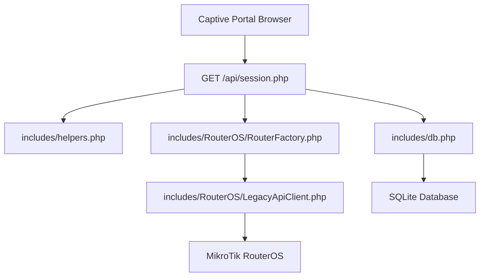
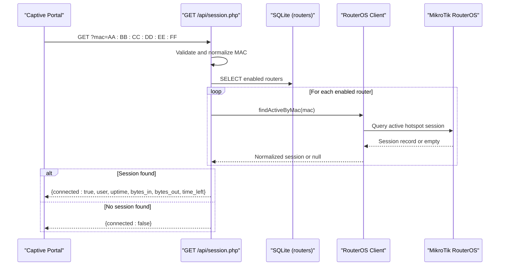
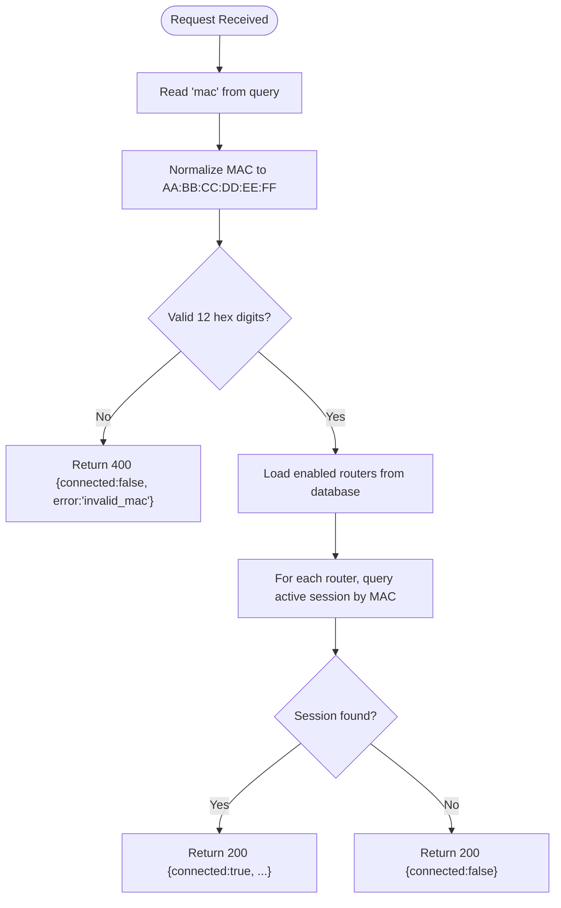
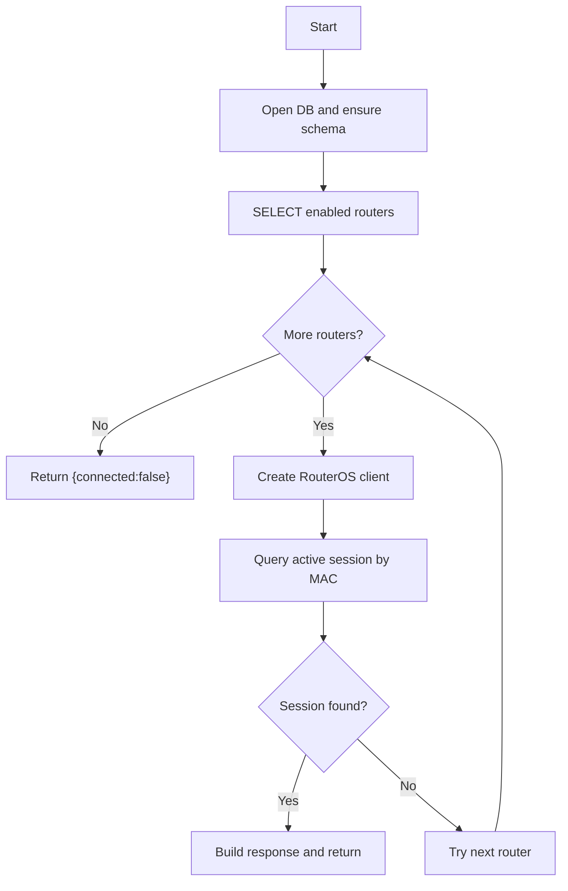
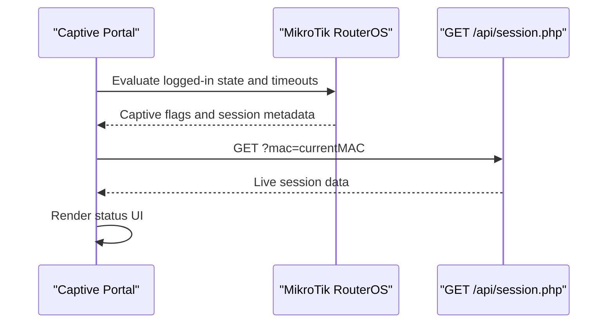
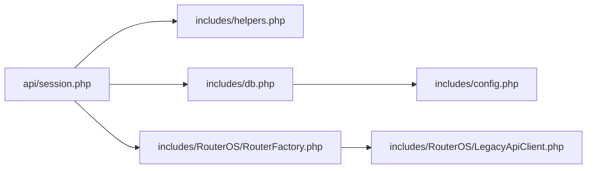

# Session API

<cite>
**Referenced Files in This Document**
- [session.php](file://api/session.php)
- [helpers.php](file://includes/helpers.php)
- [db.php](file://includes/db.php)
- [config.php](file://includes/config.php)
- [auth.php](file://includes/auth.php)
- [LegacyApiClient.php](file://includes/RouterOS/LegacyApiClient.php)
- [api.json](file://hotspot/api.json)
</cite>

## Table of Contents
1. [Introduction](#introduction)
2. [Project Structure](#project-structure)
3. [Core Components](#core-components)
4. [Architecture Overview](#architecture-overview)
5. [Detailed Component Analysis](#detailed-component-analysis)
6. [Dependency Analysis](#dependency-analysis)
7. [Performance Considerations](#performance-considerations)
8. [Troubleshooting Guide](#troubleshooting-guide)
9. [Conclusion](#conclusion)

## Introduction
The Session API is a lightweight, portal-facing JSON endpoint that reports whether a specific client MAC address currently has an active MikroTik Hotspot session. It is designed to be polled by the captive portal status page and intentionally does not require administrative authentication. The endpoint returns read-only session information such as connected status, user name, uptime, byte counters, and optional time remaining.

This document explains:
- HTTP method and URL contract
- Request parameters and validation rules
- Response schema and field meanings
- Authentication model and CORS configuration
- Security considerations
- Integration with the captive portal
- Performance and rate-limiting guidance for high-frequency polling

## Project Structure
The Session API lives under the `api` directory and depends on shared helpers, database access, and RouterOS client abstractions.

**Diagram sources**
- [session.php:23-25](file://api/session.php#L23-L25)
- [db.php:23-47](file://includes/db.php#L23-L47)
- [LegacyApiClient.php:548-555](file://includes/RouterOS/LegacyApiClient.php#L548-L555)

**Section sources**
- [session.php:1-107](file://api/session.php#L1-L107)
- [db.php:1-117](file://includes/db.php#L1-L117)

## Core Components
- Session endpoint: Implements input validation, router iteration, and JSON response generation.
- Helper utilities: Provide JSON serialization and formatting functions.
- Database layer: Provides a singleton PDO connection and idempotent schema creation.
- RouterOS client abstraction: Queries active Hotspot sessions via REST or legacy API.

Key responsibilities:
- Normalize and validate the MAC parameter.
- Query enabled routers from the local database.
- Ask each router for an active session matching the MAC.
- Return a consistent JSON payload regardless of which router owns the session.

**Section sources**
- [session.php:23-107](file://api/session.php#L23-L107)
- [helpers.php:23-38](file://includes/helpers.php#L23-L38)
- [db.php:23-47](file://includes/db.php#L23-L47)
- [LegacyApiClient.php:548-577](file://includes/RouterOS/LegacyApiClient.php#L548-L577)

## Architecture Overview
The endpoint follows a simple request flow:
1. Parse and normalize the MAC address.
2. Connect to the local SQLite database and ensure schema exists.
3. Load enabled routers.
4. For each router, create a RouterOS client and query for an active session by MAC.
5. On first successful match, build and return the session response.
6. If no match is found or errors occur, return a safe “not connected” response.

**Diagram sources**
- [session.php:50-106](file://api/session.php#L50-L106)
- [LegacyApiClient.php:548-555](file://includes/RouterOS/LegacyApiClient.php#L548-L555)

## Detailed Component Analysis

### HTTP Method and URL Contract
- Method: GET
- Path: `/api/session.php`
- Required query parameter:
  - `mac`: Client MAC address. Accepts formats with separators (`:` `-` `.`) or without separators. Must contain exactly 12 hexadecimal digits after normalization.

Example calls:
- `GET /api/session.php?mac=AA:BB:CC:DD:EE:FF`
- `GET /api/session.php?mac=AA-BB-CC-DD-EE-FF`
- `GET /api/session.php?mac=AABBCCDDEEFF`

**Section sources**
- [session.php:10-14](file://api/session.php#L10-L14)
- [session.php:40-56](file://api/session.php#L40-L56)

### Request Validation and Error Handling
Validation steps:
- Extract raw `mac` from the query string.
- Normalize to canonical uppercase colon-separated form.
- Reject if missing or malformed.

Error behavior:
- Invalid or missing MAC returns HTTP 400 with an error code indicating invalid input.
- Database or setup failures do not leak details; they return a safe “not connected” response.
- Unreachable routers are skipped silently while scanning other routers.

**Diagram sources**
- [session.php:40-56](file://api/session.php#L40-L56)
- [session.php:58-87](file://api/session.php#L58-L87)

**Section sources**
- [session.php:40-87](file://api/session.php#L40-L87)

### Authentication Requirements
- No admin authentication is required for this endpoint.
- It is explicitly read-only and intended for the portal’s own status page.
- Administrative endpoints use separate authentication logic and are not involved here.

Security implications:
- Because it is unauthenticated, callers must only expose their own MAC address.
- The endpoint never writes data and never exposes stack traces.

**Section sources**
- [session.php:3-18](file://api/session.php#L3-L18)
- [auth.php:192-231](file://includes/auth.php#L192-L231)

### CORS Configuration
- The endpoint sets `Access-Control-Allow-Origin: *`.
- This allows browser-based captive portal pages to call the endpoint directly.
- The payload is non-sensitive live status for the caller’s own MAC.

Recommendations:
- Keep CORS open only for this endpoint.
- Avoid exposing sensitive data through this interface.
- Consider restricting origins at the web server level if needed.

**Section sources**
- [session.php:27-31](file://api/session.php#L27-L31)

### MAC Address Validation Process
Normalization rules:
- Strip all non-hex characters.
- Require exactly 12 hexadecimal digits.
- Convert to uppercase and insert colons between pairs.

Examples of accepted inputs:
- `AA:BB:CC:DD:EE:FF`
- `AABBCCDDEEFF`
- `aa-bb-cc-dd-ee-ff`

Invalid inputs include:
- Missing parameter
- Fewer or more than 12 hex digits
- Non-hexadecimal characters after stripping separators

**Section sources**
- [session.php:40-48](file://api/session.php#L40-L48)

### Data Flow and Router Iteration
Processing steps:
- Connect to SQLite and ensure schema exists.
- Select enabled routers ordered by ID.
- For each router:
  - Create a RouterOS client using the router row.
  - Call `findActiveByMac(mac)` to retrieve an active session.
  - If a valid session is returned, stop iterating and use it.
- If no router returns a session, respond with not connected.

**Diagram sources**
- [session.php:58-87](file://api/session.php#L58-L87)
- [db.php:56-82](file://includes/db.php#L56-L82)
- [LegacyApiClient.php:548-555](file://includes/RouterOS/LegacyApiClient.php#L548-L555)

**Section sources**
- [session.php:58-87](file://api/session.php#L58-L87)
- [db.php:56-82](file://includes/db.php#L56-L82)

### Response Schema
Successful connection:
- HTTP 200
- Body contains:
  - `connected`: boolean true
  - `user`: string username associated with the session
  - `uptime`: string uptime value from the router
  - `bytes_in`: integer received bytes
  - `bytes_out`: integer sent bytes
  - `time_left`: string or null; derived from router fields when available

Not connected:
- HTTP 200
- Body contains:
  - `connected`: boolean false

Invalid input:
- HTTP 400
- Body contains:
  - `connected`: boolean false
  - `error`: string code indicating invalid MAC

Notes:
- `time_left` may be null if the router does not provide a compatible time-left field.
- Byte counters default to zero when not present.

**Section sources**
- [session.php:89-106](file://api/session.php#L89-L106)
- [helpers.php:23-38](file://includes/helpers.php#L23-L38)

### Captive Portal Integration
The captive portal uses its own context variables to determine login state and session limits. The Session API complements this by providing live session data for the current MAC.

Portal integration points:
- The portal determines whether the client is captive based on logged-in state.
- The portal can use the Session API to render live session details.
- The portal also receives timeout and byte-limit hints from its own API metadata.

**Diagram sources**
- [api.json:1-11](file://hotspot/api.json#L1-L11)
- [session.php:5-18](file://api/session.php#L5-L18)

**Section sources**
- [api.json:1-11](file://hotspot/api.json#L1-L11)
- [session.php:5-18](file://api/session.php#L5-L18)

### Security Considerations
- Input validation prevents malformed MAC values from reaching downstream queries.
- Exceptions are caught and converted into safe responses; stack traces are not exposed.
- The endpoint is read-only and does not perform administrative actions.
- CORS is permissive but limited to this endpoint; avoid exposing sensitive data.
- Do not rely solely on client-side MAC validation; always validate server-side.

**Section sources**
- [session.php:10-18](file://api/session.php#L10-L18)
- [session.php:50-87](file://api/session.php#L50-L87)

## Dependency Analysis
The Session API depends on:
- Helpers for JSON output
- Database layer for router metadata
- RouterOS client abstraction for querying active sessions

**Diagram sources**
- [session.php:23-25](file://api/session.php#L23-L25)
- [db.php:12-12](file://includes/db.php#L12-L12)
- [LegacyApiClient.php:548-577](file://includes/RouterOS/LegacyApiClient.php#L548-L577)

**Section sources**
- [session.php:23-25](file://api/session.php#L23-L25)
- [db.php:12-47](file://includes/db.php#L12-L47)
- [LegacyApiClient.php:548-577](file://includes/RouterOS/LegacyApiClient.php#L548-L577)

## Performance Considerations
Optimization tips:
- Cache router list locally where possible. The endpoint loads enabled routers on every request; consider caching the result for a short TTL if router configuration changes infrequently.
- Use exponential backoff and jitter on the captive portal side to avoid thundering herds during high-frequency polling.
- Prefer debouncing repeated polls when the UI state is unchanged.
- Ensure the web server enables HTTP/2 and keep-alive connections to reduce overhead.
- Monitor database WAL performance and ensure sufficient disk I/O capacity.
- Limit maximum concurrent requests at the web server or application layer.

Rate limiting considerations:
- The existing rate-limiting logic targets administrative login attempts, not this public status endpoint.
- For high-frequency polling, implement rate limiting at the web server or reverse proxy level (for example, per-IP request caps).
- Consider adding application-level rate limiting keyed by MAC or client IP if needed.
- Tune cache headers carefully; the endpoint already disables caching to reflect live session state.

[No sources needed since this section provides general guidance]

## Troubleshooting Guide
Common issues and resolutions:
- Invalid MAC parameter:
  - Symptom: HTTP 400 with error code indicating invalid MAC.
  - Resolution: Ensure the MAC contains exactly 12 hexadecimal digits and is properly encoded in the URL.
- No active session:
  - Symptom: HTTP 200 with `connected:false`.
  - Resolution: Verify the client is actually authenticated on a configured router.
- Database unavailable:
  - Symptom: HTTP 200 with `connected:false`.
  - Resolution: Check SQLite file path, permissions, and database integrity.
- Router unreachable:
  - Symptom: Some routers are skipped; the endpoint continues scanning others.
  - Resolution: Verify router credentials, host connectivity, and API service availability.

Operational checks:
- Confirm the endpoint returns JSON with correct content type.
- Inspect network logs for CORS errors.
- Validate that the captive portal sends the correct MAC parameter.

**Section sources**
- [session.php:50-87](file://api/session.php#L50-L87)
- [db.php:23-47](file://includes/db.php#L23-L47)

## Conclusion
The Session API provides a simple, secure, and read-only way for the captive portal to discover whether a given MAC address has an active Hotspot session. It normalizes input, iterates enabled routers, and returns a consistent JSON payload. While it intentionally remains unauthenticated and permissive with CORS, operators should treat it as a read-only status interface and apply appropriate operational safeguards such as rate limiting and monitoring for high-frequency polling scenarios.

[No sources needed since this section summarizes without analyzing specific files]