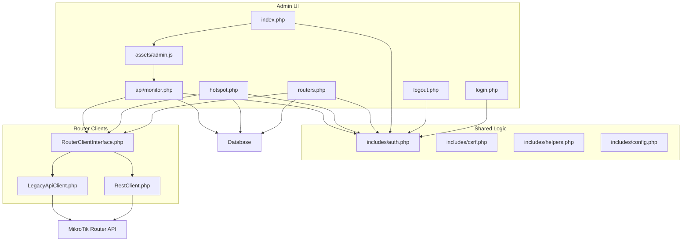
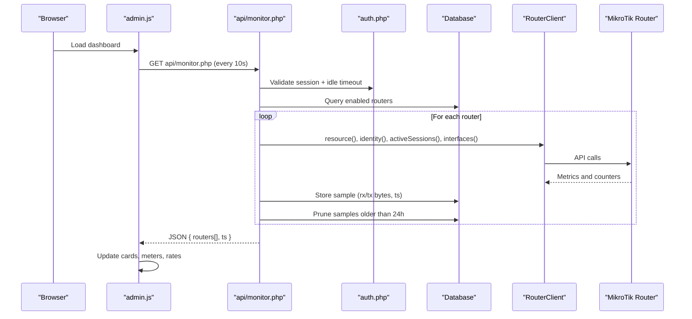
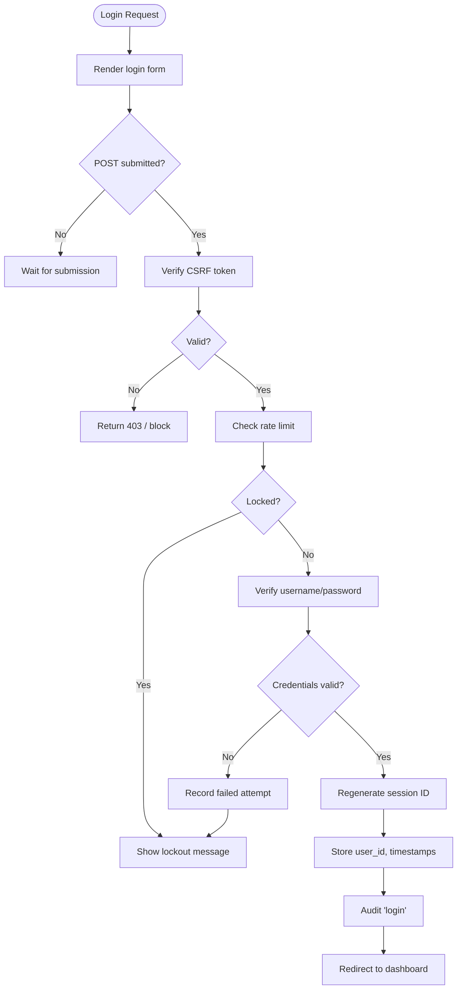
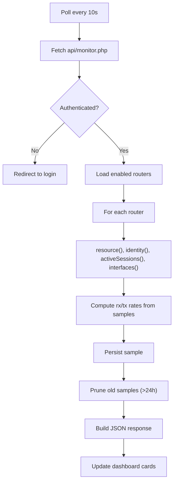
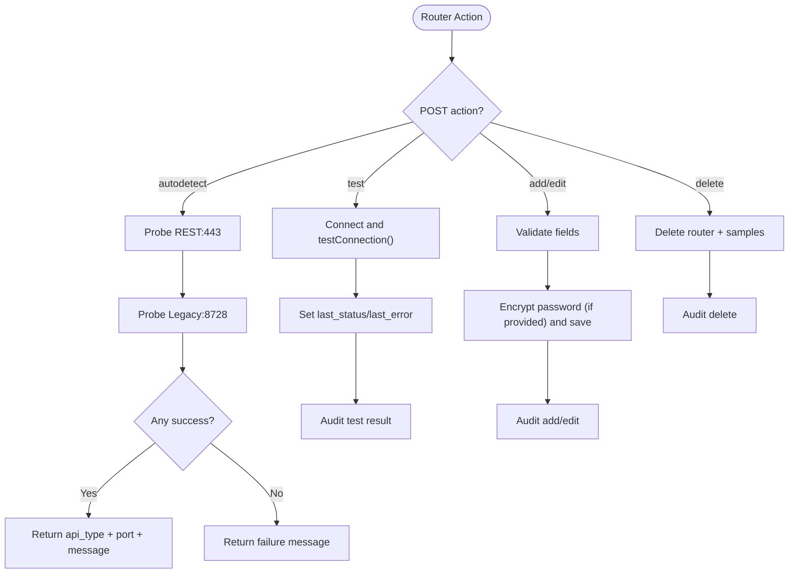
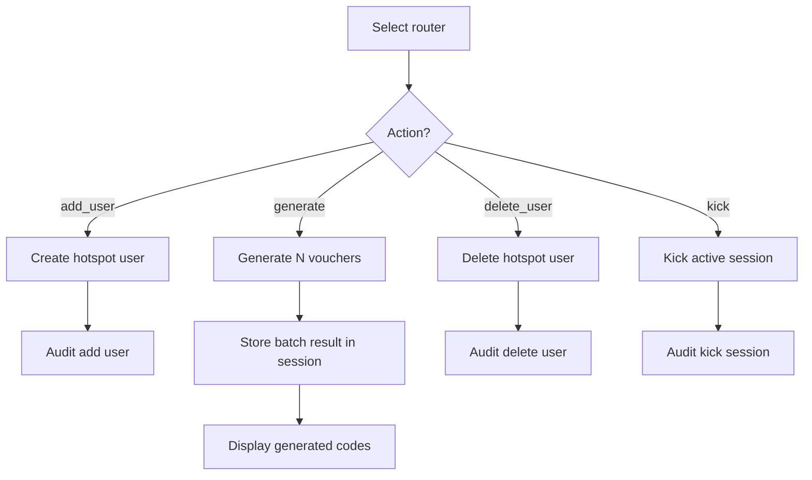
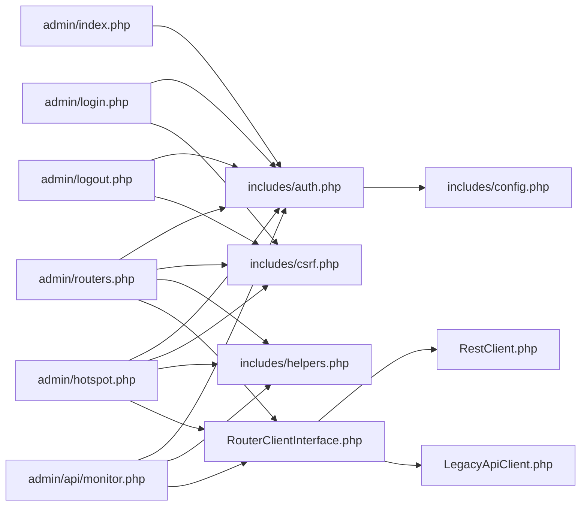

# Administrative Panel

<cite>
**Referenced Files in This Document**
- [admin/index.php](file://admin/index.php)
- [admin/login.php](file://admin/login.php)
- [admin/logout.php](file://admin/logout.php)
- [admin/routers.php](file://admin/routers.php)
- [admin/hotspot.php](file://admin/hotspot.php)
- [admin/api/monitor.php](file://admin/api/monitor.php)
- [admin/assets/admin.js](file://admin/assets/admin.js)
- [includes/auth.php](file://includes/auth.php)
- [includes/csrf.php](file://includes/csrf.php)
- [includes/helpers.php](file://includes/helpers.php)
- [includes/config.php](file://includes/config.php)
- [includes/RouterOS/RouterClientInterface.php](file://includes/RouterOS/RouterClientInterface.php)
- [includes/RouterOS/RestClient.php](file://includes/RouterOS/RestClient.php)
- [includes/RouterOS/LegacyApiClient.php](file://includes/RouterOS/LegacyApiClient.php)
</cite>

## Table of Contents
1. [Introduction](#introduction)
2. [Project Structure](#project-structure)
3. [Core Components](#core-components)
4. [Architecture Overview](#architecture-overview)
5. [Detailed Component Analysis](#detailed-component-analysis)
6. [Dependency Analysis](#dependency-analysis)
7. [Performance Considerations](#performance-considerations)
8. [Troubleshooting Guide](#troubleshooting-guide)
9. [Daily Operations and Maintenance](#daily-operations-and-maintenance)
10. [Conclusion](#conclusion)

## Introduction
The administrative panel is a secure, HTTPS-only PHP interface for managing MikroTik routers, hotspot users, active sessions, and system monitoring. It provides:
- A login screen with rate-limited authentication and CSRF protection.
- A dashboard showing live router metrics, active session counts, CPU/memory usage, uptime, and per-interface traffic rates.
- Router management for adding, editing, testing connections, and deleting routers.
- Hotspot management for user administration, voucher generation, and session control.
- Real-time monitoring through automatic polling and robust error handling.
- Security controls including CSRF validation, idle session timeouts, rate limiting, and audit logging.

This document explains how the interface works, how to operate it safely, and how its components interact.

## Project Structure
The administrative panel lives under `admin/`, with shared security and configuration logic under `includes/`. The key entry points are:
- `admin/login.php` — standalone login page.
- `admin/logout.php` — state-changing logout endpoint.
- `admin/index.php` — dashboard view.
- `admin/routers.php` — router CRUD and connection testing.
- `admin/hotspot.php` — hotspot user and session management.
- `admin/api/monitor.php` — JSON feed polled by the dashboard.
- `admin/assets/admin.js` — client-side behavior (polling, modals, tabs, auto-detect).

**Diagram sources**
- [admin/index.php:1-154](file://admin/index.php#L1-L154)
- [admin/login.php:1-114](file://admin/login.php#L1-L114)
- [admin/logout.php:1-43](file://admin/logout.php#L1-L43)
- [admin/routers.php:1-455](file://admin/routers.php#L1-L455)
- [admin/hotspot.php:1-531](file://admin/hotspot.php#L1-L531)
- [admin/api/monitor.php:1-188](file://admin/api/monitor.php#L1-L188)
- [admin/assets/admin.js:1-422](file://admin/assets/admin.js#L1-L422)
- [includes/auth.php:1-282](file://includes/auth.php#L1-L282)
- [includes/csrf.php:1-68](file://includes/csrf.php#L1-L68)
- [includes/helpers.php:1-97](file://includes/helpers.php#L1-L97)
- [includes/config.php:1-44](file://includes/config.php#L1-L44)
- [includes/RouterOS/RouterClientInterface.php:1-99](file://includes/RouterOS/RouterClientInterface.php#L1-L99)
- [includes/RouterOS/RestClient.php:101-184](file://includes/RouterOS/RestClient.php#L101-L184)
- [includes/RouterOS/LegacyApiClient.php:541-582](file://includes/RouterOS/LegacyApiClient.php#L541-L582)

**Section sources**
- [admin/index.php:1-154](file://admin/index.php#L1-L154)
- [admin/login.php:1-114](file://admin/login.php#L1-L114)
- [admin/logout.php:1-43](file://admin/logout.php#L1-L43)
- [admin/routers.php:1-455](file://admin/routers.php#L1-L455)
- [admin/hotspot.php:1-531](file://admin/hotspot.php#L1-L531)
- [admin/api/monitor.php:1-188](file://admin/api/monitor.php#L1-L188)
- [admin/assets/admin.js:1-422](file://admin/assets/admin.js#L1-L422)
- [includes/auth.php:1-282](file://includes/auth.php#L1-L282)
- [includes/csrf.php:1-68](file://includes/csrf.php#L1-L68)
- [includes/helpers.php:1-97](file://includes/helpers.php#L1-L97)
- [includes/config.php:1-44](file://includes/config.php#L1-L44)
- [includes/RouterOS/RouterClientInterface.php:1-99](file://includes/RouterOS/RouterClientInterface.php#L1-L99)

## Core Components
- Authentication and session hardening:
  - Secure cookie settings, idle timeout enforcement, and redirect-to-login flow.
  - Rate limiting on failed logins per client IP.
  - Audit logging for privileged actions.
- CSRF protection:
  - Per-session token embedded in forms and validated on POST.
- Router abstraction:
  - Unified interface for REST and Legacy clients.
  - Methods for resource/identity queries, hotspot user/session operations, and interface traffic counters.
- Dashboard and monitor feed:
  - Live cards per enabled router.
  - Automatic polling every 10 seconds.
  - Per-interface traffic rate calculation from stored samples.

**Section sources**
- [includes/auth.php:1-282](file://includes/auth.php#L1-L282)
- [includes/csrf.php:1-68](file://includes/csrf.php#L1-L68)
- [includes/RouterOS/RouterClientInterface.php:1-99](file://includes/RouterOS/RouterClientInterface.php#L1-L99)
- [admin/index.php:1-154](file://admin/index.php#L1-L154)
- [admin/api/monitor.php:1-188](file://admin/api/monitor.php#L1-L188)
- [admin/assets/admin.js:1-422](file://admin/assets/admin.js#L1-L422)

## Architecture Overview
The admin panel follows a layered architecture:
- Presentation layer: PHP pages render HTML; JavaScript handles interactivity.
- Application layer: Request handlers enforce auth, CSRF, input validation, and business logic.
- Data access layer: PDO database interactions for admins, routers, audit logs, and monitor samples.
- Integration layer: Router clients abstract MikroTik API differences.

**Diagram sources**
- [admin/assets/admin.js:294-397](file://admin/assets/admin.js#L294-L397)
- [admin/api/monitor.php:1-188](file://admin/api/monitor.php#L1-L188)
- [includes/auth.php:192-231](file://includes/auth.php#L192-L231)
- [includes/RouterOS/RouterClientInterface.php:28-99](file://includes/RouterOS/RouterClientInterface.php#L28-L99)

## Detailed Component Analysis

### Authentication and Session Management
- Login page:
  - Renders a form protected by CSRF.
  - Validates credentials via `aircoins_login_ok`, which enforces rate limits, records failures, regenerates session ID, and stores session metadata.
  - Redirects authenticated users to the dashboard and logs the login event.
- Logout:
  - Requires POST and CSRF verification.
  - Audits logout if a session exists, destroys the session, and redirects to login.
- Session hardening:
  - Cookie path `/`, SameSite=Strict, HttpOnly, Secure when TLS is detected.
  - Idle timeout enforced by `aircoins_require_login`; expired sessions redirect to login with a notice.

**Diagram sources**
- [admin/login.php:37-62](file://admin/login.php#L37-L62)
- [includes/auth.php:151-190](file://includes/auth.php#L151-L190)
- [includes/csrf.php:48-67](file://includes/csrf.php#L48-L67)

**Section sources**
- [admin/login.php:1-114](file://admin/login.php#L1-L114)
- [admin/logout.php:1-43](file://admin/logout.php#L1-L43)
- [includes/auth.php:65-94](file://includes/auth.php#L65-L94)
- [includes/auth.php:151-231](file://includes/auth.php#L151-L231)
- [includes/csrf.php:1-68](file://includes/csrf.php#L1-L68)

### Dashboard and Live Monitoring
- Dashboard (`index.php`):
  - Loads enabled routers and renders cards with placeholders for identity, version, CPU, memory, uptime, active sessions, and interface traffic.
  - Uses data attributes to bind metrics to DOM elements.
- Monitor feed (`api/monitor.php`):
  - Requires an authenticated session; returns JSON errors instead of redirects.
  - For each router, reads resource/identity, active sessions, and interfaces.
  - Computes per-interface traffic rates by diffing stored samples and persists new samples.
  - Prunes monitor samples older than 24 hours per router.
- Client-side polling (`admin.js`):
  - Polls `api/monitor.php` every 10 seconds.
  - Updates card states (online/offline), metrics, meters, and interface rates.
  - Handles unauthorized responses by redirecting to login.

**Diagram sources**
- [admin/index.php:22-36](file://admin/index.php#L22-L36)
- [admin/api/monitor.php:106-187](file://admin/api/monitor.php#L106-L187)
- [admin/assets/admin.js:358-397](file://admin/assets/admin.js#L358-L397)

**Section sources**
- [admin/index.php:1-154](file://admin/index.php#L1-L154)
- [admin/api/monitor.php:1-188](file://admin/api/monitor.php#L1-L188)
- [admin/assets/admin.js:294-397](file://admin/assets/admin.js#L294-L397)

### Router Management
- Add/Edit/Delete:
  - All mutations require CSRF verification and are audited.
  - Passwords are encrypted before storage and never rendered back into forms.
  - Edit mode preserves existing password unless explicitly changed.
- Connection Testing:
  - Tests reachability and retrieves version/board info.
  - Updates last_status/last_error and audits the result.
- Auto-Detect API Type:
  - Probes REST:443 then Legacy:8728 using provided host/credentials/TLS setting.
  - Returns JSON with detected type/port/version hint.
- Validation:
  - Name/host/username required; port range checked; password required on add.

**Diagram sources**
- [admin/routers.php:47-223](file://admin/routers.php#L47-L223)
- [admin/routers.php:226-251](file://admin/routers.php#L226-L251)
- [admin/routers.php:253-455](file://admin/routers.php#L253-L455)

**Section sources**
- [admin/routers.php:1-455](file://admin/routers.php#L1-L455)
- [admin/assets/admin.js:176-258](file://admin/assets/admin.js#L176-L258)

### Hotspot Management
- User Administration:
  - Add single user with optional profile, comment, and session time limit.
  - Delete users by router-assigned id.
- Voucher Generation:
  - Bulk generator creates unique codes (no ambiguous characters).
  - Each code used as both username and password; session time set as uptime-limit.
  - Results stored in session and displayed after PRG redirect.
- Active Sessions:
  - Lists current sessions with MAC, address, uptime, and byte counters.
  - Kick action disconnects a session and audits the operation.

**Diagram sources**
- [admin/hotspot.php:85-224](file://admin/hotspot.php#L85-L224)
- [admin/hotspot.php:227-251](file://admin/hotspot.php#L227-L251)
- [admin/hotspot.php:253-531](file://admin/hotspot.php#L253-L531)

**Section sources**
- [admin/hotspot.php:1-531](file://admin/hotspot.php#L1-L531)

### Security Features
- CSRF Protection:
  - Token generated per session and embedded in forms.
  - Verified on all state-changing POST requests; mismatch returns HTTP 403.
- Rate Limiting:
  - Failed login attempts tracked per IP within a configurable window.
  - Lockout message indicates wait duration based on configured window.
- Audit Logging:
  - Privileged actions logged with admin id, action name, detail, client IP, and timestamp.
- Session Hardening:
  - Secure cookie flags, SameSite=Strict, HttpOnly.
  - Idle timeout enforced across pages and API endpoints.

**Section sources**
- [includes/csrf.php:1-68](file://includes/csrf.php#L1-L68)
- [includes/auth.php:96-138](file://includes/auth.php#L96-L138)
- [includes/auth.php:261-282](file://includes/auth.php#L261-L282)
- [includes/config.php:30-43](file://includes/config.php#L30-L43)

## Dependency Analysis
The admin panel depends on shared modules for authentication, CSRF, helpers, and configuration, and integrates with MikroTik routers through a unified client interface.

**Diagram sources**
- [admin/index.php:14-17](file://admin/index.php#L14-L17)
- [admin/routers.php:17-22](file://admin/routers.php#L17-L22)
- [admin/hotspot.php:16-21](file://admin/hotspot.php#L16-L21)
- [admin/api/monitor.php:21-24](file://admin/api/monitor.php#L21-L24)
- [admin/login.php:14-16](file://admin/login.php#L14-L16)
- [admin/logout.php:15-17](file://admin/logout.php#L15-L17)
- [includes/auth.php:14-15](file://includes/auth.php#L14-L15)
- [includes/RouterOS/RouterClientInterface.php:1-24](file://includes/RouterOS/RouterClientInterface.php#L1-L24)

**Section sources**
- [admin/index.php:14-17](file://admin/index.php#L14-L17)
- [admin/routers.php:17-22](file://admin/routers.php#L17-L22)
- [admin/hotspot.php:16-21](file://admin/hotspot.php#L16-L21)
- [admin/api/monitor.php:21-24](file://admin/api/monitor.php#L21-L24)
- [admin/login.php:14-16](file://admin/login.php#L14-L16)
- [admin/logout.php:15-17](file://admin/logout.php#L15-L17)
- [includes/auth.php:14-15](file://includes/auth.php#L14-L15)
- [includes/RouterOS/RouterClientInterface.php:1-24](file://includes/RouterOS/RouterClientInterface.php#L1-L24)

## Performance Considerations
- Dashboard polling interval is 10 seconds; this balances freshness with server load.
- Monitor feed computes per-interface rates by diffing stored samples; ensure database performance for `monitor_samples` growth.
- Samples are pruned daily per router to bound table size.
- Router client calls are wrapped in try/catch to avoid cascading failures across multiple routers.
- Avoid excessive bulk voucher generation; defaults cap count at 200 and code length at 12.

[No sources needed since this section provides general guidance]

## Troubleshooting Guide
- Cannot log in:
  - Check rate limiting; too many failed attempts will temporarily lock out the client IP.
  - Ensure CSRF token is present and valid in forms.
- Dashboard shows offline or error:
  - Verify router connectivity and credentials.
  - Check monitor feed availability and session validity.
- Router test fails:
  - Confirm API service is enabled (REST www-ssl or Legacy api/api-ssl).
  - Validate host, port, username, password, and TLS certificate settings.
- Hotspot operations fail:
  - Ensure selected router is reachable and credentials are correct.
  - Review error banners for specific failure messages.
- Audit log not updated:
  - Verify database write permissions and audit_log table existence.

**Section sources**
- [admin/login.php:54-60](file://admin/login.php#L54-L60)
- [admin/api/monitor.php:179-182](file://admin/api/monitor.php#L179-L182)
- [admin/routers.php:125-140](file://admin/routers.php#L125-L140)
- [admin/hotspot.php:236-244](file://admin/hotspot.php#L236-L244)

## Daily Operations and Maintenance
- Adding a router:
  - Navigate to Routers, click Add Router, fill in name/host/API type/port/username/password, optionally enable TLS verification, and save.
  - Use Auto-detect to probe REST:443 and Legacy:8728 automatically.
- Testing connectivity:
  - Click Test next to a router to verify reachability and capture version/board info.
- Managing hotspot users:
  - Select a router in Hotspot, add single users or generate vouchers in bulk.
  - Assign profiles and session time limits as needed.
- Monitoring sessions:
  - View active sessions and kick any that need immediate disconnection.
- Monitoring dashboard:
  - Observe live metrics; refresh manually if needed.
  - Investigate offline cards and error messages for connectivity issues.
- Maintenance tasks:
  - Periodically review audit logs for unusual activity.
  - Ensure database backups include `audit_log`, `login_attempts`, `routers`, and `monitor_samples`.
  - Rotate admin passwords and consider tightening idle timeout and rate limits via configuration constants.

**Section sources**
- [admin/routers.php:265-455](file://admin/routers.php#L265-L455)
- [admin/hotspot.php:253-531](file://admin/hotspot.php#L253-L531)
- [admin/index.php:41-154](file://admin/index.php#L41-L154)
- [includes/config.php:15-43](file://includes/config.php#L15-L43)

## Conclusion
The administrative panel provides a secure, feature-rich interface for managing MikroTik routers and hotspot operations. Its design emphasizes safety through CSRF protection, rate limiting, and audit logging, while delivering real-time visibility into router health and traffic. Operators can confidently perform daily tasks such as adding routers, generating vouchers, and monitoring sessions, with clear feedback and robust error handling throughout.

[No sources needed since this section summarizes without analyzing specific files]