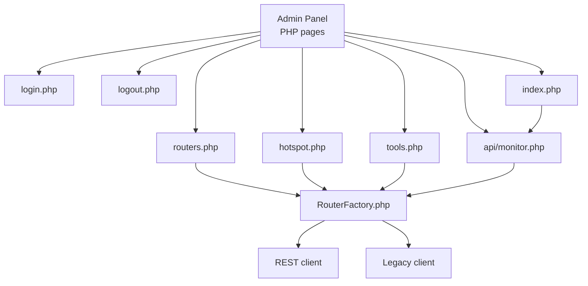
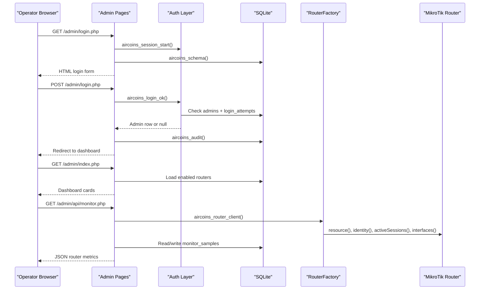
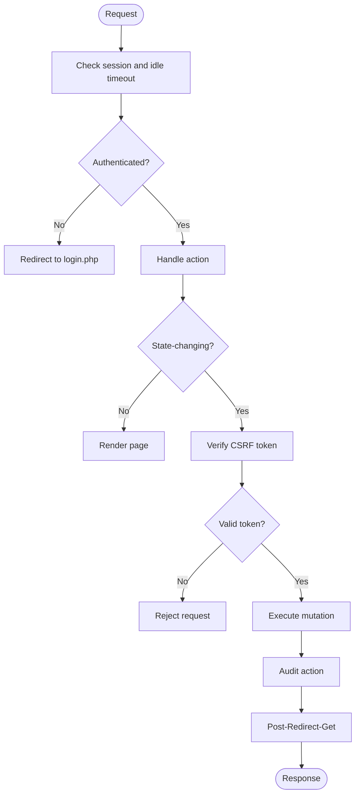
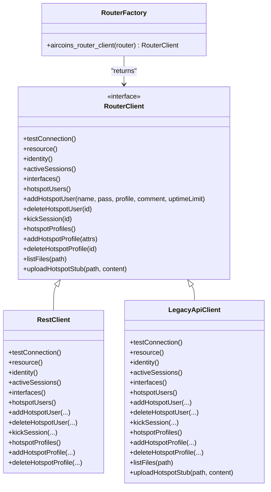
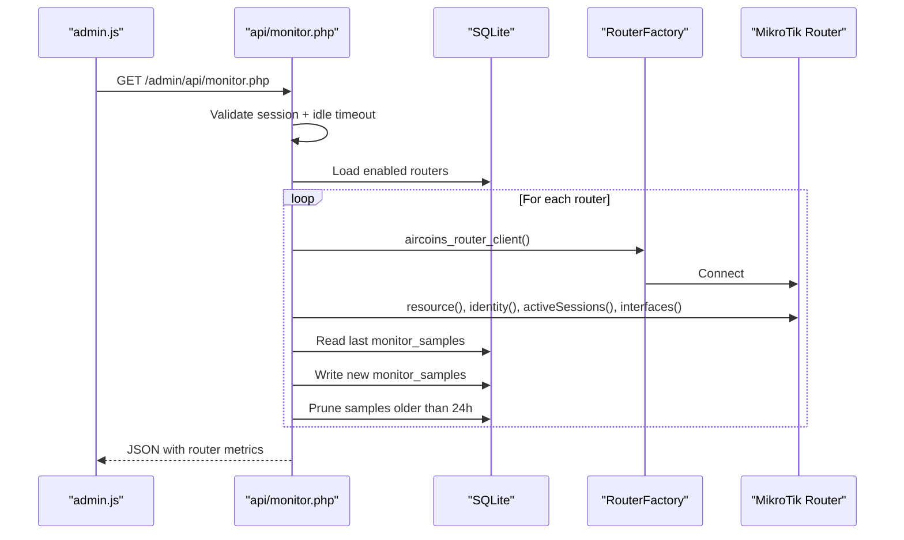
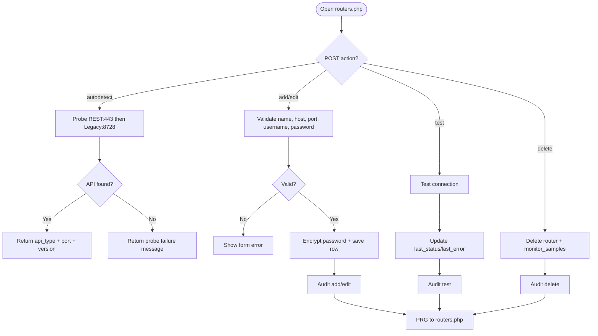
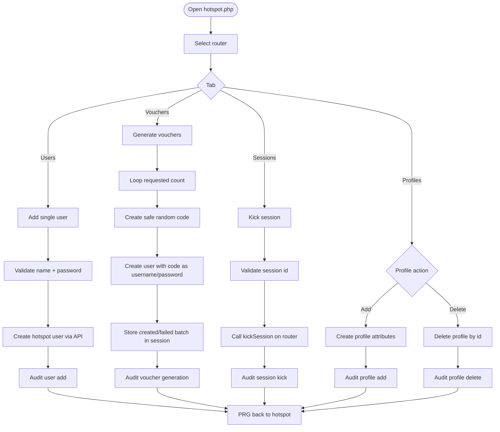
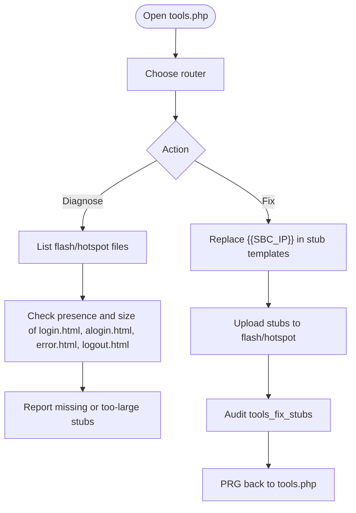
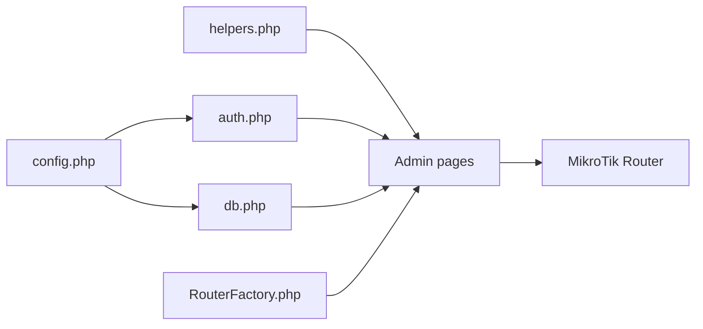

# Administrative Tools

<cite>
**Referenced Files in This Document**   
- [admin/index.php](file://admin/index.php)
- [admin/login.php](file://admin/login.php)
- [admin/logout.php](file://admin/logout.php)
- [admin/hotspot.php](file://admin/hotspot.php)
- [admin/routers.php](file://admin/routers.php)
- [admin/tools.php](file://admin/tools.php)
- [admin/api/monitor.php](file://admin/api/monitor.php)
- [includes/config.php](file://includes/config.php)
- [includes/helpers.php](file://includes/helpers.php)
- [includes/auth.php](file://includes/auth.php)
- [includes/db.php](file://includes/db.php)
- [includes/RouterOS/RouterFactory.php](file://includes/RouterOS/RouterFactory.php)
- [DEPLOYMENT.md](file://DEPLOYMENT.md)
</cite>

## Update Summary
**Changes Made**   
- Updated Tools section to reflect the fixed database query that now includes all router authentication fields (pass_enc, username)
- Enhanced documentation of router authentication requirements for hotspot stub management
- Clarified the relationship between database queries and router client creation

## Table of Contents
1. [Introduction](#introduction)
2. [Project Structure](#project-structure)
3. [Core Components](#core-components)
4. [Architecture Overview](#architecture-overview)
5. [Detailed Component Analysis](#detailed-component-analysis)
6. [Dependency Analysis](#dependency-analysis)
7. [Performance Considerations](#performance-considerations)
8. [Troubleshooting Guide](#troubleshooting-guide)
9. [Conclusion](#conclusion)

## Introduction
This document describes the administrative tools provided by the AIRCOINS NETFI controller. The admin panel is a PHP 8 application that lets an authorized operator:

- Authenticate securely and manage their session.
- Register, test, edit, and delete MikroTik routers using either REST (RouterOS v7) or Legacy API (v6/v7).
- Manage hotspot users, generate vouchers, view active sessions, kick clients, and create hotspot profiles.
- Diagnose and repair router-side hotspot redirect stubs.
- Monitor live router identity, resource usage, uptime, active-session count, and per-interface traffic rates.

The system uses SQLite for persistence, libsodium for encrypting router passwords at rest, Argon2id (with bcrypt fallback) for admin password hashing, CSRF protection for state-changing requests, and an audit log for privileged actions.

## Project Structure
The administrative tooling lives under `admin/`, with shared logic under `includes/`. Key responsibilities:

| Area | Responsibility |
|---|---|
| `admin/login.php` | Standalone login form, rate-limited authentication, CSRF protection, audit logging. |
| `admin/logout.php` | CSRF-protected sign-out; destroys session and audits logout. |
| `admin/index.php` | Dashboard showing enabled routers and live metrics via `api/monitor.php`. |
| `admin/routers.php` | Router CRUD, auto-detect, connection testing, encrypted password handling. |
| `admin/hotspot.php` | Hotspot user management, voucher generation, active sessions, profile management. |
| `admin/tools.php` | Diagnose and upload thin hotspot redirect stubs to routers. |
| `admin/api/monitor.php` | JSON feed polled every 10 seconds; computes interface traffic rates from samples. |
| `includes/*` | Configuration, database schema, authentication, helpers, and RouterOS client factory. |



**Diagram sources**
- [admin/index.php:1-154](file://admin/index.php#L1-L154)
- [admin/login.php:1-114](file://admin/login.php#L1-L114)
- [admin/logout.php:1-43](file://admin/logout.php#L1-L43)
- [admin/routers.php:1-455](file://admin/routers.php#L1-L455)
- [admin/hotspot.php:1-701](file://admin/hotspot.php#L1-L701)
- [admin/tools.php:1-358](file://admin/tools.php#L1-L358)
- [admin/api/monitor.php:1-188](file://admin/api/monitor.php#L1-L188)
- [includes/RouterOS/RouterFactory.php:1-56](file://includes/RouterOS/RouterFactory.php#L1-L56)

**Section sources**
- [DEPLOYMENT.md:10-28](file://DEPLOYMENT.md#L10-L28)
- [DEPLOYMENT.md:508-557](file://DEPLOYMENT.md#L508-L557)

## Core Components
The administrative experience is built around these core components:

- **Authentication and session layer**: Provides hardened session configuration, idle timeout enforcement, rate limiting, password hashing, and audit logging.
- **Database layer**: A singleton PDO connection to SQLite with idempotent schema creation and indexes for login attempts and monitor samples.
- **Router abstraction**: A factory that decrypts stored router credentials and returns either a REST or Legacy API client.
- **Admin pages**: Each page requires login, validates CSRF on mutations, performs operations through the router client, and surfaces errors as flash messages.
- **Live monitoring**: A JSON endpoint that reads router resources, sessions, interfaces, and persists traffic counters to compute rates.

Key implementation patterns include:

- Post-Redirect-Get for all mutating actions.
- Per-action CSRF verification.
- Try/catch wrappers around router calls so one unreachable device does not break the whole response.
- Encrypted storage of router passwords and hashed storage of admin passwords.
- Audit logging for sensitive operations such as login, logout, router changes, hotspot mutations, and stub fixes.

**Section sources**
- [includes/auth.php:1-282](file://includes/auth.php#L1-L282)
- [includes/db.php:1-117](file://includes/db.php#L1-L117)
- [includes/RouterOS/RouterFactory.php:1-56](file://includes/RouterOS/RouterFactory.php#L1-L56)
- [includes/helpers.php:1-97](file://includes/helpers.php#L1-L97)

## Architecture Overview
At a high level, the administrative tools sit between the operator's browser and the MikroTik routers.



**Diagram sources**
- [admin/login.php:1-114](file://admin/login.php#L1-L114)
- [admin/index.php:1-154](file://admin/index.php#L1-L154)
- [admin/api/monitor.php:1-188](file://admin/api/monitor.php#L1-L188)
- [includes/auth.php:1-282](file://includes/auth.php#L1-L282)
- [includes/db.php:1-117](file://includes/db.php#L1-L117)
- [includes/RouterOS/RouterFactory.php:1-56](file://includes/RouterOS/RouterFactory.php#L1-L56)

## Detailed Component Analysis

### Authentication and Session Management
The login flow is intentionally strict:

- The login page renders a standalone form without the normal admin chrome.
- Every POST verifies CSRF.
- Failed attempts are recorded and rate-limited per IP.
- Successful authentication regenerates the session ID, stores admin metadata, clears failed attempts, and audits the login.
- Protected pages call `aircoins_require_login()` to enforce an idle timeout and validate the current admin record.
- Logout is restricted to POST with CSRF verification and audits the logout before destroying the session.



**Diagram sources**
- [admin/login.php:1-114](file://admin/login.php#L1-L114)
- [admin/logout.php:1-43](file://admin/logout.php#L1-L43)
- [includes/auth.php:1-282](file://includes/auth.php#L1-L282)

Security characteristics:

- Admin passwords use Argon2id when available, falling back to bcrypt.
- Sessions use `HttpOnly`, `SameSite=Strict`, and `Secure` over TLS.
- Login attempts are limited to five failures per 300 seconds per IP.
- Idle timeout defaults to 900 seconds.
- All privileged actions can be written to the audit log.

**Section sources**
- [admin/login.php:1-114](file://admin/login.php#L1-L114)
- [admin/logout.php:1-43](file://admin/logout.php#L1-L43)
- [includes/auth.php:1-282](file://includes/auth.php#L1-L282)
- [includes/config.php:1-44](file://includes/config.php#L1-L44)

### Database and Persistence
The database layer provides:

- A singleton PDO connection to SQLite.
- WAL mode, busy timeout, synchronous mode, and foreign key enforcement.
- Idempotent schema creation for administrators, routers, login attempts, audit log, and monitor samples.
- Indexes on login attempts and monitor samples to keep rate-limit checks and traffic-rate calculations efficient.

Important tables:

| Table | Purpose |
|---|---|
| `admins` | Stores admin usernames and password hashes. |
| `routers` | Stores router connection details, including encrypted passwords. |
| `login_attempts` | Tracks failed login attempts for rate limiting. |
| `audit_log` | Records privileged actions with admin ID, action name, detail, IP, and timestamp. |
| `monitor_samples` | Stores per-router, per-interface byte counters used to compute traffic rates. |

**Section sources**
- [includes/db.php:1-117](file://includes/db.php#L1-L117)

### Router Abstraction and Client Selection
The router factory centralizes how the admin panel talks to MikroTik devices:

- It accepts either a full router row with an encrypted password or a decrypted configuration array.
- It decrypts `pass_enc` only in memory.
- It selects a REST client for `api_type = rest` and a Legacy client otherwise.
- Mutating pages construct a client once per request and wrap each operation in try/catch.



**Diagram sources**
- [includes/RouterOS/RouterFactory.php:1-56](file://includes/RouterOS/RouterFactory.php#L1-L56)

**Section sources**
- [includes/RouterOS/RouterFactory.php:1-56](file://includes/RouterOS/RouterFactory.php#L1-L56)

### Dashboard and Live Monitoring
The dashboard displays one card per enabled router. Each card shows:

- Identity and RouterOS version.
- CPU load and memory usage.
- Uptime.
- Active session count.
- Per-interface traffic rates.

The frontend polls `/admin/api/monitor.php` every 10 seconds. The endpoint:

- Requires an authenticated session.
- Loads enabled routers.
- Calls the router client for resource, identity, active sessions, and interfaces.
- Computes bytes-per-second by comparing current counter values with the most recent sample.
- Persists new samples and prunes samples older than 24 hours per router.
- Returns a JSON object where each router entry contains an error field if that specific router failed, rather than failing the entire response.



**Diagram sources**
- [admin/index.php:1-154](file://admin/index.php#L1-L154)
- [admin/api/monitor.php:1-188](file://admin/api/monitor.php#L1-L188)

**Section sources**
- [admin/index.php:1-154](file://admin/index.php#L1-L154)
- [admin/api/monitor.php:1-188](file://admin/api/monitor.php#L1-L188)

### Router Management
The router management page supports:

- Adding routers with REST or Legacy API type.
- Editing existing routers while keeping stored passwords hidden.
- Testing connectivity and recording status/error fields.
- Auto-detecting whether REST or Legacy API responds.
- Deleting routers and their monitor samples.
- Encrypting router passwords before storage.

Auto-detection probes REST on port 443 first, then Legacy on port 8728. If neither responds, it reports that the service may be disabled or credentials are incorrect.



**Diagram sources**
- [admin/routers.php:1-455](file://admin/routers.php#L1-L455)

**Section sources**
- [admin/routers.php:1-455](file://admin/routers.php#L1-L455)

### Hotspot Management
The hotspot page is organized into three tabs:

- Users and vouchers: list users, add single users, bulk-generate vouchers, delete users.
- Active sessions: list connected clients and kick individual sessions.
- Profiles: create and delete hotspot profiles with session timeout, uptime limit, rate limit, shared users, and idle timeout.

Voucher generation creates codes using a safe character set that avoids ambiguous characters like zero, capital O, one, capital I, and lowercase L. Each generated code is used as both username and password, and the per-user uptime limit is applied on the router side.



**Diagram sources**
- [admin/hotspot.php:1-701](file://admin/hotspot.php#L1-L701)

**Section sources**
- [admin/hotspot.php:1-701](file://admin/hotspot.php#L1-L701)

### Tools: Fix Router Hotspot Files
The tools page addresses a common operational problem: when the full SBC portal is uploaded to the router instead of the thin redirect stubs, voucher login fails because the router serves the full portal in CHAP mode rather than redirecting to the SBC for HTTP-PAP login.

**Updated** Fixed database query to include all router authentication fields (pass_enc, username) required for hotspot stub management operations.

The tools page:

- Lists enabled routers using a comprehensive SELECT * query that includes all authentication fields.
- Diagnoses whether the four required stub files exist and are small enough to be thin redirectors.
- Uploads embedded stub templates to the router after replacing the SBC IP placeholder.
- Audits the fix action.

The router selection query now ensures all necessary authentication fields are available for creating router clients:

```sql
SELECT * FROM routers WHERE disabled = 0 ORDER BY name COLLATE NOCASE ASC
```

This query retrieves all router fields including `pass_enc` and `username`, which are essential for the router factory to create authenticated connections for stub management operations.



**Diagram sources**
- [admin/tools.php:1-358](file://admin/tools.php#L1-L358)

**Section sources**
- [admin/tools.php:1-358](file://admin/tools.php#L1-L358)

## Dependency Analysis
The administrative tools have clear dependency boundaries:

- Pages depend on shared includes for configuration, database access, authentication, CSRF, helpers, layout, and the router factory.
- Only the router-facing endpoints actually reach MikroTik devices.
- The monitor endpoint writes only to `monitor_samples`; it does not mutate router configuration.
- Router passwords are never rendered into forms; they are encrypted at rest and decrypted only when constructing a client.



**Diagram sources**
- [includes/config.php:1-44](file://includes/config.php#L1-L44)
- [includes/auth.php:1-282](file://includes/auth.php#L1-L282)
- [includes/db.php:1-117](file://includes/db.php#L1-L117)
- [includes/helpers.php:1-97](file://includes/helpers.php#L1-L97)
- [includes/RouterOS/RouterFactory.php:1-56](file://includes/RouterOS/RouterFactory.php#L1-L56)

**Section sources**
- [admin/index.php:1-154](file://admin/index.php#L1-L154)
- [admin/routers.php:1-455](file://admin/routers.php#L1-L455)
- [admin/hotspot.php:1-701](file://admin/hotspot.php#L1-L701)
- [admin/tools.php:1-358](file://admin/tools.php#L1-L358)
- [admin/api/monitor.php:1-188](file://admin/api/monitor.php#L1-L188)

## Performance Considerations
Several design choices reduce overhead on a low-resource SBC:

- The php-fpm pool uses `ondemand` workers, minimizing idle RAM usage.
- SQLite runs in WAL mode with a busy timeout and synchronous mode tuned for reduced disk wear.
- Monitor samples are pruned to 24 hours per router.
- The dashboard refresh interval is 10 seconds, balancing responsiveness with network and router load.
- Router API calls are wrapped in try/catch so one slow or unreachable router does not block the entire response.
- The monitor endpoint computes traffic rates locally by diffing stored byte counters rather than maintaining continuous state in PHP.

[No sources needed since this section provides general guidance]

## Troubleshooting Guide
Common operational issues and their likely causes:

| Symptom | Likely Cause | Recommended Action |
|---|---|---|
| Admin login repeatedly fails | Wrong credentials or rate limit triggered | Wait for the rate-limit window; check audit log and login attempts table. |
| Session expires frequently | Idle timeout exceeded or clock drift | Check server time synchronization and idle timeout configuration. |
| Router cannot be added | Wrong API type, port, credentials, or service disabled | Use Auto-detect; verify REST `www-ssl` or Legacy `api`/`api-ssl` is enabled. |
| Dashboard shows error for one router | That router is unreachable or misconfigured | Test connection from the Routers page; check firewall and API permissions. |
| Voucher login fails with invalid username or password | Full portal uploaded instead of thin stubs | Use Tools → Diagnose and Tools → Fix — Upload Stubs. |
| Status page shows no active session | MAC mismatch, no enabled router, or router unreachable | Verify MAC parameter, enable router, and test connection. |
| Monitor feed stops updating | Session expired or database unavailable | Refresh the page; check SQLite file permissions and database path. |
| Tools page cannot connect to router | Missing authentication fields in database query | Ensure router query includes pass_enc and username fields. |

Operational safeguards already present:

- CSRF protection prevents cross-site request forgery on state-changing actions.
- Audit logging records login, logout, router changes, hotspot mutations, and stub fixes.
- Router passwords are encrypted at rest and never displayed in forms.
- Error banners and flash messages surface friendly messages instead of raw stack traces.

**Section sources**
- [admin/login.php:1-114](file://admin/login.php#L1-L114)
- [admin/routers.php:1-455](file://admin/routers.php#L1-L455)
- [admin/hotspot.php:1-701](file://admin/hotspot.php#L1-L701)
- [admin/tools.php:1-358](file://admin/tools.php#L1-L358)
- [admin/api/monitor.php:1-188](file://admin/api/monitor.php#L1-L188)
- [DEPLOYMENT.md:473-505](file://DEPLOYMENT.md#L473-L505)

## Conclusion
The administrative tools provide a focused, secure, and practical interface for managing MikroTik hotspot deployments. They separate concerns cleanly: authentication and persistence are centralized, router communication is abstracted behind a factory, and each admin page handles one domain—dashboard, routers, hotspot operations, or operational tools. The system emphasizes security through CSRF, rate limiting, encrypted secrets, hashed passwords, and audit logging, while remaining lightweight enough for deployment on a single-board computer.

The recent fix to the tools.php database query ensures that all router authentication fields (pass_enc, username) are properly included when performing hotspot stub management operations, resolving connectivity issues that could prevent successful stub uploads.

[No sources needed since this section summarizes without analyzing specific files]