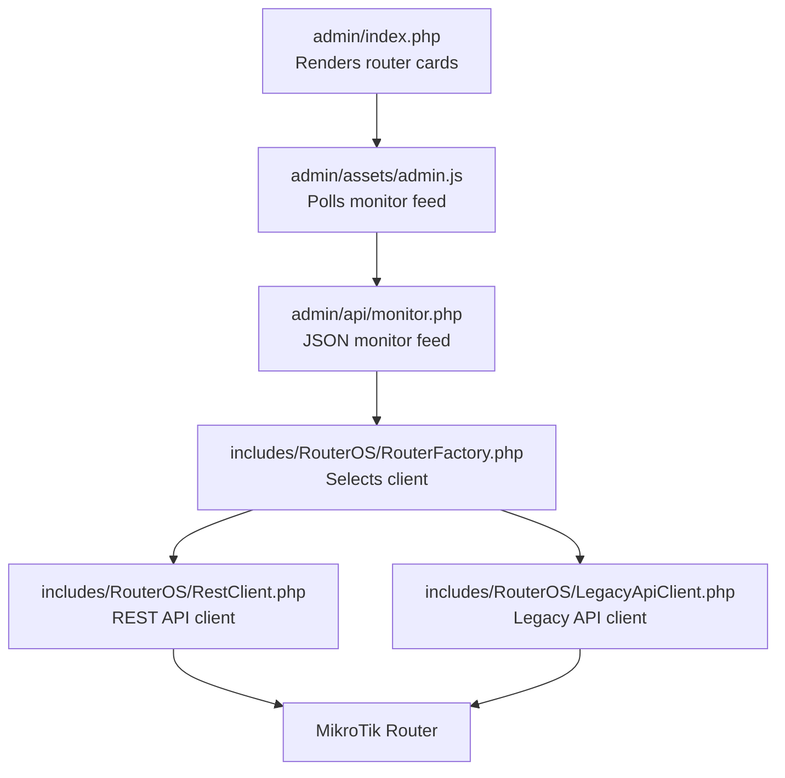
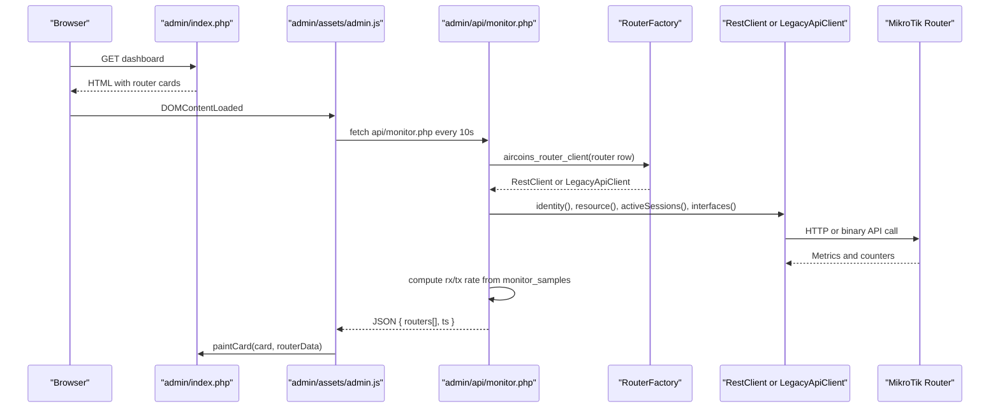
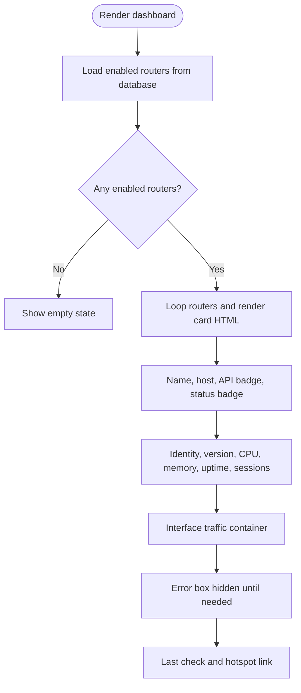
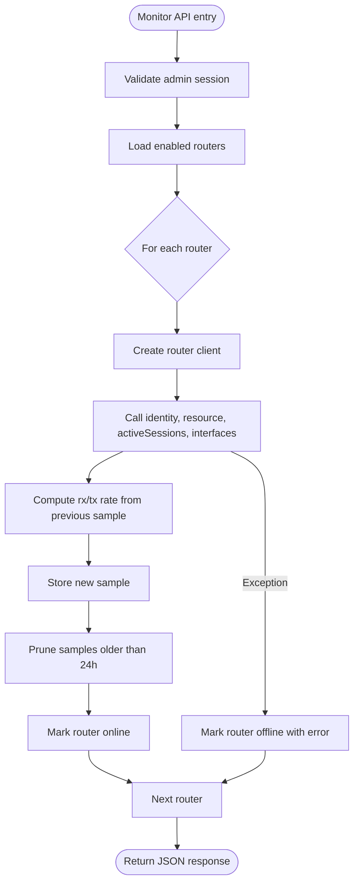
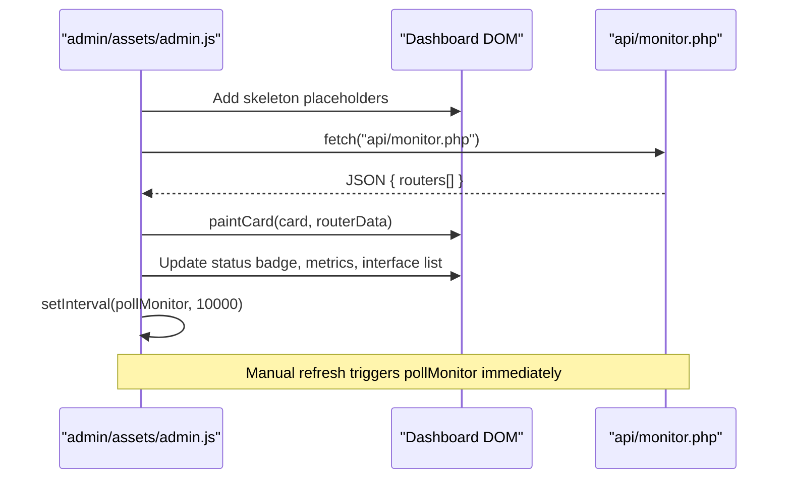
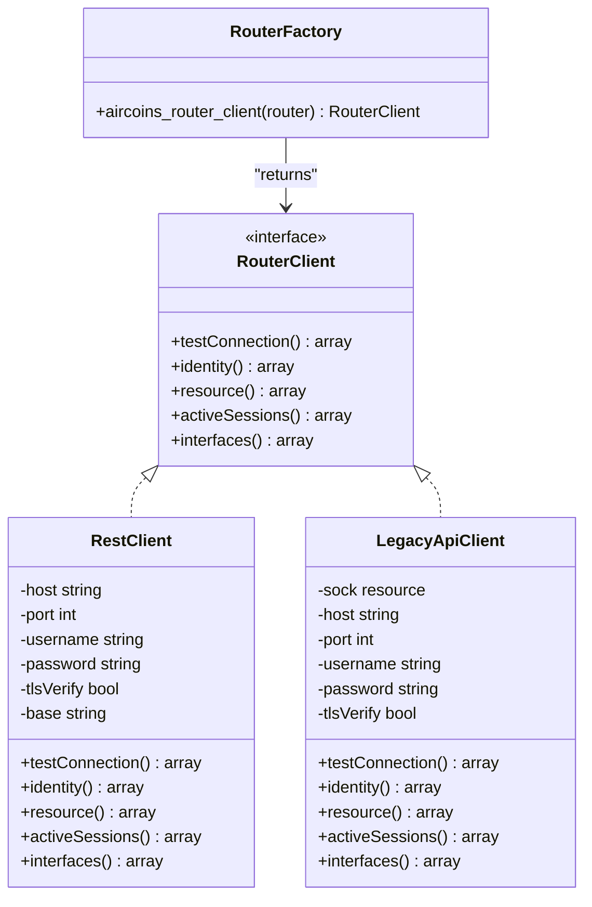
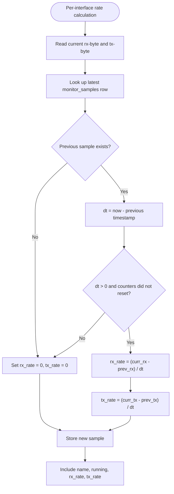
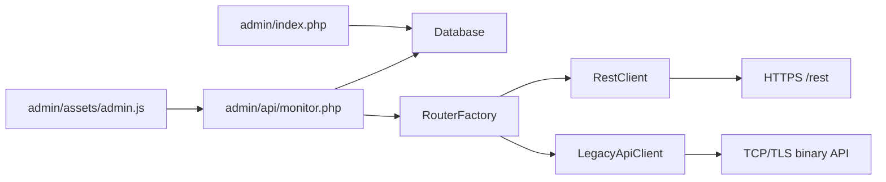

# Dashboard & Real-Time Monitoring

<cite>
**Referenced Files in This Document**
- [admin/index.php](file://admin/index.php)
- [admin/api/monitor.php](file://admin/api/monitor.php)
- [admin/assets/admin.js](file://admin/assets/admin.js)
- [admin/assets/admin.css](file://admin/assets/admin.css)
- [includes/RouterOS/RouterFactory.php](file://includes/RouterOS/RouterFactory.php)
- [includes/RouterOS/RestClient.php](file://includes/RouterOS/RestClient.php)
- [includes/RouterOS/LegacyApiClient.php](file://includes/RouterOS/LegacyApiClient.php)
</cite>

## Table of Contents
1. [Introduction](#introduction)
2. [Project Structure](#project-structure)
3. [Core Components](#core-components)
4. [Architecture Overview](#architecture-overview)
5. [Detailed Component Analysis](#detailed-component-analysis)
6. [Dependency Analysis](#dependency-analysis)
7. [Performance Considerations](#performance-considerations)
8. [Troubleshooting Guide](#troubleshooting-guide)
9. [Conclusion](#conclusion)

## Introduction
This document explains the dashboard and real-time monitoring system used to observe enabled MikroTik routers from the admin panel. The dashboard renders one card per enabled router and displays:
- Identity
- RouterOS version
- CPU load
- Memory usage
- Uptime
- Active sessions count
- Per-interface traffic rates (download and upload)

The interface is automatically refreshed every 10 seconds by a JavaScript polling loop that calls the monitor API. Each router is polled independently, so a failure for one device does not break the entire page. The UI supports manual refresh, status badges, error states, skeleton loading placeholders, and a last-check timestamp.

## Project Structure
The monitoring feature spans four main layers:
- Server-side dashboard template that renders router cards.
- Monitor JSON endpoint that queries each router and computes traffic rates.
- Router client abstraction supporting REST and Legacy binary APIs.
- Client-side JavaScript that polls the monitor feed and paints the cards.

**Diagram sources**
- [admin/index.php:5-9](file://admin/index.php#L5-L9)
- [admin/assets/admin.js:15-15](file://admin/assets/admin.js#L15-L15)
- [admin/api/monitor.php:3-16](file://admin/api/monitor.php#L3-L16)
- [includes/RouterOS/RouterFactory.php:3-8](file://includes/RouterOS/RouterFactory.php#L3-L8)
- [includes/RouterOS/RestClient.php:3-17](file://includes/RouterOS/RestClient.php#L3-L17)
- [includes/RouterOS/LegacyApiClient.php:3-15](file://includes/RouterOS/LegacyApiClient.php#L3-L15)

**Section sources**
- [admin/index.php:5-9](file://admin/index.php#L5-L9)
- [admin/api/monitor.php:3-16](file://admin/api/monitor.php#L3-L16)
- [admin/assets/admin.js:1-11](file://admin/assets/admin.js#L1-L11)

## Core Components
- Dashboard template: loads enabled routers from the database and outputs a card per router with metric placeholders and status badges.
- Monitor API: authenticates the admin session, reads enabled routers, connects to each router through the factory, collects identity, resource, active sessions, and interfaces, computes byte-per-second rates using stored samples, stores new samples, prunes old samples, and returns a JSON array.
- Router clients: implement a common interface for REST and Legacy APIs; both expose identity, resource, active sessions, and interfaces.
- Dashboard JavaScript: formats bytes and uptime, renders interface rows, paints card metrics, handles online/offline/error states, and polls the monitor API every 10 seconds.

**Section sources**
- [admin/index.php:22-150](file://admin/index.php#L22-L150)
- [admin/api/monitor.php:101-187](file://admin/api/monitor.php#L101-L187)
- [admin/assets/admin.js:294-397](file://admin/assets/admin.js#L294-L397)
- [includes/RouterOS/RouterFactory.php:29-55](file://includes/RouterOS/RouterFactory.php#L29-L55)

## Architecture Overview
The dashboard follows a simple request-response polling architecture rather than WebSockets. The browser loads the dashboard page, then repeatedly requests the monitor JSON endpoint. The server responds with per-router data including an online flag, identity, resource metrics, active session count, and interface traffic rates. The JavaScript updates only the matching card instead of reloading the page.

**Diagram sources**
- [admin/index.php:38-150](file://admin/index.php#L38-L150)
- [admin/assets/admin.js:358-397](file://admin/assets/admin.js#L358-L397)
- [admin/api/monitor.php:101-187](file://admin/api/monitor.php#L101-L187)
- [includes/RouterOS/RouterFactory.php:29-55](file://includes/RouterOS/RouterFactory.php#L29-L55)
- [includes/RouterOS/RestClient.php:68-86](file://includes/RouterOS/RestClient.php#L68-L86)
- [includes/RouterOS/LegacyApiClient.php:443-463](file://includes/RouterOS/LegacyApiClient.php#L443-L463)

## Detailed Component Analysis

### Dashboard Template: Card-Based Interface
The dashboard template loads enabled routers and renders a grid of cards. Each card contains:
- Router name and host/port
- API type badge (REST or Legacy)
- Online/offline status badge
- Metric slots for identity, RouterOS version, CPU load, memory, uptime, active sessions
- Interface traffic list
- Error box shown when the router is offline
- Last check status and quick link to hotspot management

The template uses `data-*` attributes such as `data-m-identity`, `data-m-cpu`, `data-meter-cpu`, `data-ifaces`, and `data-error` so the JavaScript can locate and update elements without fragile selectors.

**Diagram sources**
- [admin/index.php:22-150](file://admin/index.php#L22-L150)

**Section sources**
- [admin/index.php:22-150](file://admin/index.php#L22-L150)

### Monitor API: Live JSON Feed
The monitor endpoint performs these steps:
1. Enforce authentication and session validity.
2. Load enabled routers.
3. For each router:
   - Create a router client via the factory.
   - Call identity, resource, active sessions, and interfaces.
   - Compute per-interface download/upload rates by comparing current byte counters with the most recent sample.
   - Store the new sample.
   - Prune samples older than 24 hours.
   - Mark the router online if successful, otherwise set error details.
4. Return a JSON object containing all router results and a server timestamp.

**Diagram sources**
- [admin/api/monitor.php:29-50](file://admin/api/monitor.php#L29-L50)
- [admin/api/monitor.php:101-187](file://admin/api/monitor.php#L101-L187)

**Section sources**
- [admin/api/monitor.php:3-16](file://admin/api/monitor.php#L3-L16)
- [admin/api/monitor.php:54-99](file://admin/api/monitor.php#L54-L99)
- [admin/api/monitor.php:101-187](file://admin/api/monitor.php#L101-L187)

### JavaScript Polling and State Management
The dashboard JavaScript implements:
- A 10-second poll interval.
- A fetch to `api/monitor.php`.
- Unauthorized handling that redirects to login.
- Per-card painting based on router ID.
- Online/offline/error state toggling.
- Skeleton loading placeholders before the first sample arrives.
- Manual refresh button behavior.
- Interface traffic rendering with formatted rates.

**Diagram sources**
- [admin/assets/admin.js:15-15](file://admin/assets/admin.js#L15-L15)
- [admin/assets/admin.js:294-397](file://admin/assets/admin.js#L294-L397)

**Section sources**
- [admin/assets/admin.js:15-15](file://admin/assets/admin.js#L15-L15)
- [admin/assets/admin.js:294-397](file://admin/assets/admin.js#L294-L397)

### Router Client Abstraction: REST vs Legacy API
Both REST and Legacy clients implement the same contract expected by the monitor API:
- `identity()`
- `resource()`
- `activeSessions()`
- `interfaces()`

The factory selects the correct implementation based on the router’s `api_type`:
- REST: uses HTTPS `/rest` endpoints with HTTP Basic authentication.
- Legacy: uses the binary API over TCP port 8728 or TLS port 8729.

**Diagram sources**
- [includes/RouterOS/RouterFactory.php:29-55](file://includes/RouterOS/RouterFactory.php#L29-L55)
- [includes/RouterOS/RestClient.php:24-86](file://includes/RouterOS/RestClient.php#L24-L86)
- [includes/RouterOS/LegacyApiClient.php:22-50](file://includes/RouterOS/LegacyApiClient.php#L22-L50)

**Section sources**
- [includes/RouterOS/RouterFactory.php:3-8](file://includes/RouterOS/RouterFactory.php#L3-L8)
- [includes/RouterOS/RouterFactory.php:29-55](file://includes/RouterOS/RouterFactory.php#L29-L55)
- [includes/RouterOS/RestClient.php:3-17](file://includes/RouterOS/RestClient.php#L3-L17)
- [includes/RouterOS/LegacyApiClient.php:3-15](file://includes/RouterOS/LegacyApiClient.php#L3-L15)

### Traffic Statistics Interpretation
The monitor API calculates per-interface traffic rates by diffing cumulative byte counters between samples:
- Download rate (`rx_rate`) comes from the interface `rx-byte` counter.
- Upload rate (`tx_rate`) comes from the interface `tx-byte` counter.
- If there is no previous sample, the rate starts at zero.
- If the time delta is zero or the counter reset occurred, the rate is zero.
- Rates are displayed as bytes per second, formatted with human-readable units.

**Diagram sources**
- [admin/api/monitor.php:54-99](file://admin/api/monitor.php#L54-L99)
- [admin/api/monitor.php:141-161](file://admin/api/monitor.php#L141-L161)

**Section sources**
- [admin/api/monitor.php:54-99](file://admin/api/monitor.php#L54-L99)
- [admin/api/monitor.php:141-161](file://admin/api/monitor.php#L141-L161)

### Status Indicators and Error Handling
Each router card has three visual states:
- Loading: skeleton placeholders appear while waiting for the first successful sample.
- Online: green status badge, metrics visible, interface traffic shown.
- Offline/Error: red border, error message shown, metrics hidden.

The JavaScript also sets a global “updated” timestamp when the feed succeeds and shows “feed error” when the fetch fails. A failed router does not stop other routers from updating.

**Section sources**
- [admin/assets/admin.js:312-383](file://admin/assets/admin.js#L312-L383)
- [admin/assets/admin.css:522-563](file://admin/assets/admin.css#L522-L563)

### Manual Refresh and Connection Failure Behavior
- The dashboard includes a manual refresh button that immediately calls the poll function and shows a toast notification.
- If the monitor API returns 401, the browser redirects to the login page.
- If the fetch itself fails, all cards receive an error state with a generic “Monitor feed unavailable” message.
- The polling loop continues after errors because it uses `setInterval`, not recursive retry logic.

**Section sources**
- [admin/assets/admin.js:358-397](file://admin/assets/admin.js#L358-L397)

## Dependency Analysis
The monitoring stack has clear layering:
- The dashboard template depends on the database and layout helpers.
- The monitor API depends on authentication, database, and the router client factory.
- The router client factory depends on encryption helpers and the two concrete clients.
- The REST client depends on cURL and HTTPS.
- The Legacy client depends on raw sockets and the RouterOS binary protocol.

**Diagram sources**
- [admin/index.php:14-28](file://admin/index.php#L14-L28)
- [admin/api/monitor.php:21-24](file://admin/api/monitor.php#L21-L24)
- [includes/RouterOS/RouterFactory.php:12-15](file://includes/RouterOS/RouterFactory.php#L12-L15)
- [includes/RouterOS/RestClient.php:270-316](file://includes/RouterOS/RestClient.php#L270-L316)
- [includes/RouterOS/LegacyApiClient.php:70-94](file://includes/RouterOS/LegacyApiClient.php#L70-L94)

**Section sources**
- [admin/index.php:14-28](file://admin/index.php#L14-L28)
- [admin/api/monitor.php:21-24](file://admin/api/monitor.php#L21-L24)
- [includes/RouterOS/RouterFactory.php:12-15](file://includes/RouterOS/RouterFactory.php#L12-L15)

## Performance Considerations
- Polling interval is fixed at 10 seconds, which balances freshness with network overhead.
- Each router is handled inside its own try/catch block, preventing one unreachable router from blocking others.
- Traffic rate computation uses previously stored samples instead of repeated historical queries.
- Sample storage is bounded by pruning entries older than 24 hours per router.
- The REST client uses short connection and request timeouts.
- The Legacy client uses socket timeouts and avoids keeping connections open longer than necessary.

[No sources needed since this section provides general guidance]

## Troubleshooting Guide

### Dashboard Shows Waiting or Never Updates
- Verify the admin session is active.
- Check whether the monitor API returns JSON instead of redirecting to login.
- Confirm the browser console does not show fetch failures.
- Use the manual refresh button to force an immediate poll.

**Section sources**
- [admin/assets/admin.js:358-397](file://admin/assets/admin.js#L358-L397)

### Router Card Shows Offline or Error
- The monitor API marks a router offline when any router-specific exception occurs.
- The error message comes from the thrown exception, usually related to authentication, connectivity, or API response parsing.
- Check the router’s API credentials, host, port, and TLS settings.
- For REST routers, verify HTTPS access to `/rest`.
- For Legacy routers, verify TCP 8728 or TLS 8729 access.

**Section sources**
- [admin/api/monitor.php:130-182](file://admin/api/monitor.php#L130-L182)
- [includes/RouterOS/RestClient.php:270-316](file://includes/RouterOS/RestClient.php#L270-L316)
- [includes/RouterOS/LegacyApiClient.php:70-94](file://includes/RouterOS/LegacyApiClient.php#L70-L94)

### Traffic Rates Are Zero
- The first sample has no previous counter, so rates start at zero.
- A counter reset causes the rate to be zero.
- A zero time delta prevents division and returns zero.
- Wait for at least one full polling cycle after enabling monitoring.

**Section sources**
- [admin/api/monitor.php:90-99](file://admin/api/monitor.php#L90-L99)
- [admin/api/monitor.php:141-161](file://admin/api/monitor.php#L141-L161)

### REST vs Legacy API Differences
- REST routers use HTTPS and JSON responses.
- Legacy routers use the binary protocol over TCP or TLS.
- Both clients normalize uptime, booleans, and numeric fields into a shared shape.
- The factory chooses the client based on `api_type`.

**Section sources**
- [includes/RouterOS/RestClient.php:3-17](file://includes/RouterOS/RestClient.php#L3-L17)
- [includes/RouterOS/LegacyApiClient.php:3-15](file://includes/RouterOS/LegacyApiClient.php#L3-L15)
- [includes/RouterOS/RouterFactory.php:48-54](file://includes/RouterOS/RouterFactory.php#L48-L54)

## Conclusion
The dashboard and real-time monitoring system provide a resilient, card-based view of enabled MikroTik routers. It separates concerns cleanly: the template renders the UI, the monitor API collects live metrics, the router clients abstract REST and Legacy differences, and the JavaScript polls and paints the interface. The design tolerates individual router failures, keeps sample storage bounded, and offers both automatic and manual refresh capabilities.

[No sources needed since this section summarizes without analyzing specific files]