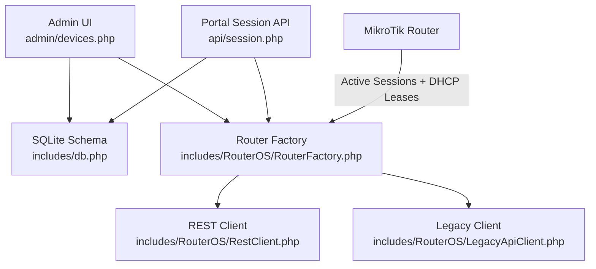
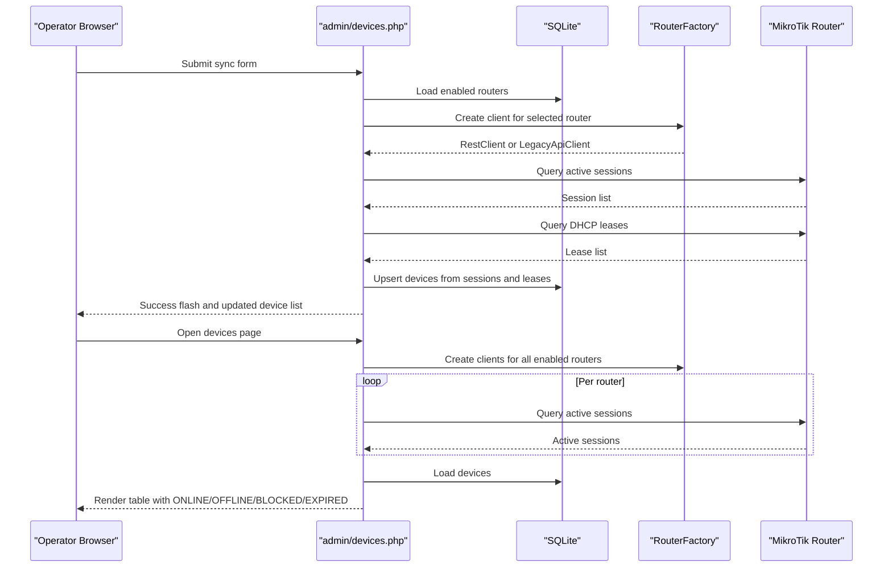
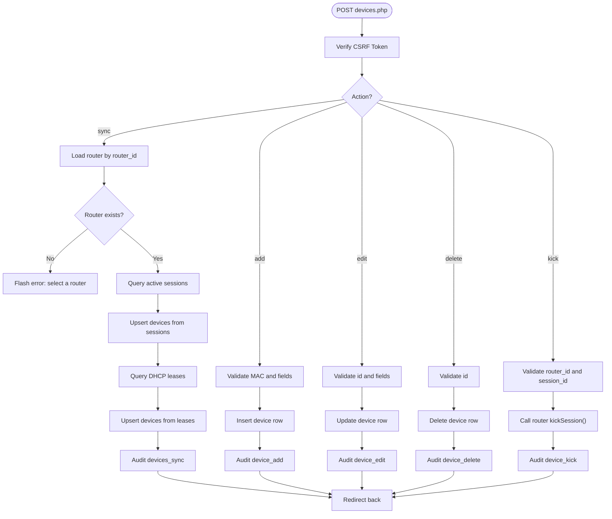
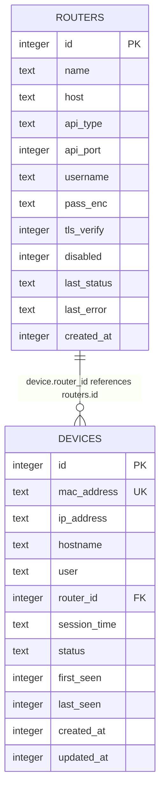
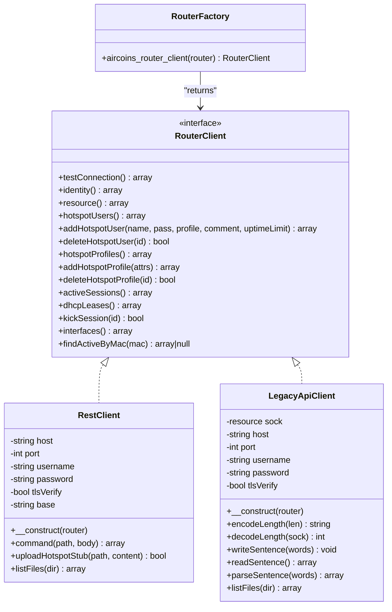
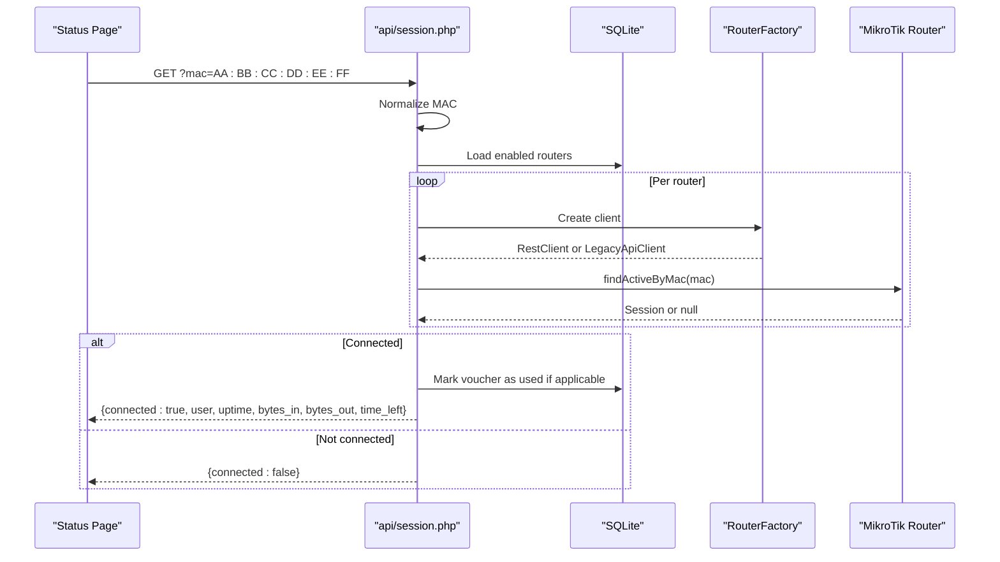
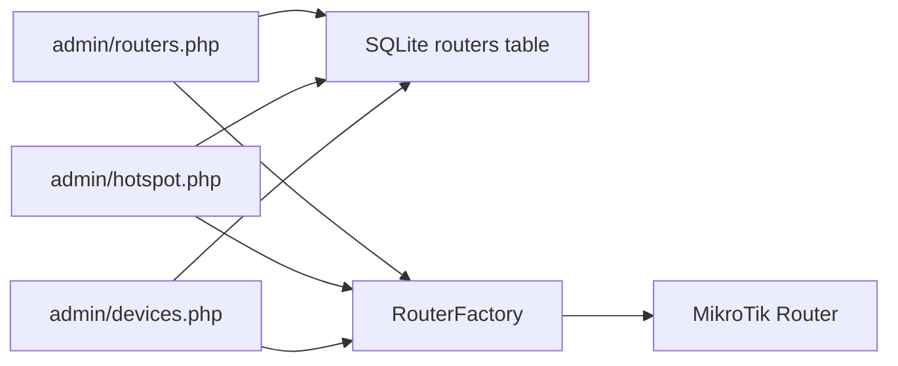
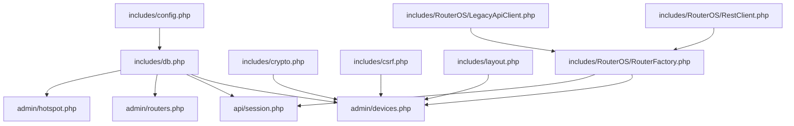

# Device Management

<cite>
**Referenced Files in This Document**   
- [DEPLOYMENT.md](file://DEPLOYMENT.md)
- [admin/devices.php](file://admin/devices.php)
- [admin/routers.php](file://admin/routers.php)
- [admin/hotspot.php](file://admin/hotspot.php)
- [api/session.php](file://api/session.php)
- [includes/db.php](file://includes/db.php)
- [includes/config.php](file://includes/config.php)
- [includes/RouterOS/RouterFactory.php](file://includes/RouterOS/RouterFactory.php)
- [includes/RouterOS/RestClient.php](file://includes/RouterOS/RestClient.php)
- [includes/RouterOS/LegacyApiClient.php](file://includes/RouterOS/LegacyApiClient.php)
- [hotspot/api.json](file://hotspot/api.json)
</cite>

## Table of Contents
1. [Introduction](#introduction)
2. [Project Structure](#project-structure)
3. [Core Components](#core-components)
4. [Architecture Overview](#architecture-overview)
5. [Detailed Component Analysis](#detailed-component-analysis)
6. [Dependency Analysis](#dependency-analysis)
7. [Performance Considerations](#performance-considerations)
8. [Troubleshooting Guide](#troubleshooting-guide)
9. [Conclusion](#conclusion)

## Introduction
This document explains the **Device Management** capabilities of the MikroTik hotspot controller. It focuses on how devices are discovered, synchronized, classified as online or offline, and managed through the admin panel, including manual CRUD operations, live session kicking, and integration with both REST and Legacy MikroTik APIs.

The system is designed for a single-board computer running behind a MikroTik hotspot. The portal serves captive-portal pages over HTTP, while the admin panel runs over HTTPS. Router communication uses either RouterOS v7 REST (HTTPS JSON) or the Legacy binary API (TCP 8728 / TLS 8729).

## Project Structure
The device management feature spans several layers:

- **Admin UI**: `admin/devices.php` provides the device list, sync form, add/edit/delete forms, and kick controls.
- **Persistence**: `includes/db.php` defines the SQLite schema, including the `devices` table and its unique MAC index.
- **Router access**: `includes/RouterOS/RouterFactory.php`, `RestClient.php`, and `LegacyApiClient.php` provide unified access to active sessions and DHCP leases.
- **Portal status API**: `api/session.php` reports whether a given MAC has an active session; it also marks vouchers as used when a user connects.
- **Deployment context**: `DEPLOYMENT.md` describes the overall architecture, redirect flow, and router configuration that makes device discovery possible.

**Diagram sources**
- [admin/devices.php:1-537](file://admin/devices.php#L1-L537)
- [includes/db.php:58-149](file://includes/db.php#L58-L149)
- [includes/RouterOS/RouterFactory.php:29-55](file://includes/RouterOS/RouterFactory.php#L29-L55)
- [includes/RouterOS/RestClient.php:178-240](file://includes/RouterOS/RestClient.php#L178-L240)
- [includes/RouterOS/LegacyApiClient.php:556-618](file://includes/RouterOS/LegacyApiClient.php#L556-L618)
- [api/session.php:58-122](file://api/session.php#L58-L122)

**Section sources**
- [DEPLOYMENT.md:32-70](file://DEPLOYMENT.md#L32-L70)
- [DEPLOYMENT.md:508-557](file://DEPLOYMENT.md#L508-L557)

## Core Components
The device management subsystem consists of these core parts:

| Component | Responsibility | Key Behavior |
|---|---|---|
| Devices page | List, sync, add, edit, delete, and kick devices | Uses CSRF protection, audits actions, and classifies devices by live sessions |
| Database layer | Provide PDO connection and schema | Creates `admins`, `routers`, `login_attempts`, `audit_log`, `monitor_samples`, `devices`, and `voucher_log` tables |
| Router factory | Build REST or Legacy client from stored router config | Decrypts password only in memory |
| REST client | Communicate with RouterOS v7 via HTTPS JSON | Implements session listing, DHCP lease listing, profile/user CRUD, and interface monitoring |
| Legacy client | Communicate with RouterOS v6/v7 via binary API | Implements the same logical surface using `/print`, `/add`, `/remove`, and sentence protocol |
| Portal session API | Expose read-only session status for the status page | Accepts a MAC, scans enabled routers, returns connected state, and marks voucher usage |

**Section sources**
- [admin/devices.php:1-236](file://admin/devices.php#L1-L236)
- [includes/db.php:14-48](file://includes/db.php#L14-L48)
- [includes/db.php:58-149](file://includes/db.php#L58-L149)
- [includes/RouterOS/RouterFactory.php:17-55](file://includes/RouterOS/RouterFactory.php#L17-L55)
- [api/session.php:1-122](file://api/session.php#L1-L122)

## Architecture Overview
Device management integrates three main flows:

1. **Sync flow**: The admin selects a router and triggers a sync. The controller queries active hotspot sessions and DHCP leases, then upserts device records into SQLite.
2. **Classification flow**: When rendering the device table, the controller queries all enabled routers for active sessions and marks devices whose MAC appears as online.
3. **Kick flow**: For an online device, the admin can disconnect the underlying MikroTik session directly.

**Diagram sources**
- [admin/devices.php:39-124](file://admin/devices.php#L39-L124)
- [admin/devices.php:246-263](file://admin/devices.php#L246-L263)
- [includes/RouterOS/RouterFactory.php:29-55](file://includes/RouterOS/RouterFactory.php#L29-L55)

## Detailed Component Analysis

### Devices Page (`admin/devices.php`)
The devices page is the central control point for device management. It handles multiple POST actions:

| Action | Input | Behavior |
|---|---|---|
| `sync` | `router_id` | Queries active sessions and DHCP leases, upserts devices, audits the operation |
| `add` | `mac_address`, optional `ip_address`, `hostname`, `status`, `session_time` | Inserts a new device row with validation and uniqueness handling |
| `edit` | `id`, optional `hostname`, `ip_address`, `status`, `session_time` | Updates device metadata without changing the MAC identity |
| `delete` | `id`, `mac` | Removes the device row and logs the deletion |
| `kick` | `router_id`, `session_id`, `mac` | Disconnects the live MikroTik session |

Key implementation characteristics:

- All mutating requests require a valid CSRF token.
- Sync first processes active sessions, then DHCP leases; DHCP is best-effort so a failed lease query does not invalidate a successful session sync.
- Device status values are constrained to `active`, `expired`, or `blocked`.
- Online classification is computed at render time by scanning all enabled routers for active sessions.
- Kick is only shown for devices currently found online, and includes a confirmation prompt.

**Diagram sources**
- [admin/devices.php:34-236](file://admin/devices.php#L34-L236)

**Section sources**
- [admin/devices.php:1-236](file://admin/devices.php#L1-L236)
- [admin/devices.php:238-263](file://admin/devices.php#L238-L263)
- [admin/devices.php:268-537](file://admin/devices.php#L268-L537)

### Database Schema for Devices (`includes/db.php`)
The `devices` table stores persistent device metadata:

| Column | Type | Purpose |
|---|---|---|
| `id` | INTEGER PRIMARY KEY AUTOINCREMENT | Internal identifier |
| `mac_address` | TEXT NOT NULL | Canonical device identity; unique index |
| `ip_address` | TEXT | Last known IP address |
| `hostname` | TEXT | Optional hostname from DHCP or manual entry |
| `user` | TEXT | Hotspot username associated with the device |
| `router_id` | INTEGER | Link to the router that reported the device |
| `session_time` | TEXT | Human-readable session duration such as `1h30m` |
| `status` | TEXT DEFAULT `active` | Local classification: `active`, `expired`, `blocked` |
| `first_seen` | INTEGER | Unix timestamp of first sync |
| `last_seen` | INTEGER | Unix timestamp of last sync |
| `created_at` | INTEGER | Creation timestamp |
| `updated_at` | INTEGER | Last update timestamp |

There is also a unique index `idx_devices_mac` to prevent duplicate MAC entries.

**Diagram sources**
- [includes/db.php:117-134](file://includes/db.php#L117-L134)
- [includes/db.php:67-82](file://includes/db.php#L67-L82)

**Section sources**
- [includes/db.php:14-48](file://includes/db.php#L14-L48)
- [includes/db.php:58-149](file://includes/db.php#L58-L149)

### Router Access Layer
Device management relies on a unified router abstraction. The factory chooses between REST and Legacy implementations based on the stored router configuration.

| Class | Protocol | Typical Port | Main Use Cases |
|---|---|---|---|
| `RestClient` | HTTPS + JSON | 443 | RouterOS v7 REST API |
| `LegacyApiClient` | Binary sentence protocol | 8728 / 8729 | RouterOS v6 and v7 legacy API |
| `RouterFactory` | PHP factory function | N/A | Builds the correct client and decrypts passwords in memory |

Both clients expose the same logical methods:

- `testConnection()`
- `identity()`
- `resource()`
- `hotspotUsers()`
- `addHotspotUser()`
- `deleteHotspotUser()`
- `hotspotProfiles()`
- `addHotspotProfile()`
- `deleteHotspotProfile()`
- `activeSessions()`
- `dhcpLeases()`
- `kickSession()`
- `interfaces()`
- `findActiveByMac()`

**Diagram sources**
- [includes/RouterOS/RouterFactory.php:29-55](file://includes/RouterOS/RouterFactory.php#L29-L55)
- [includes/RouterOS/RestClient.php:24-48](file://includes/RouterOS/RestClient.php#L24-L48)
- [includes/RouterOS/LegacyApiClient.php:22-50](file://includes/RouterOS/LegacyApiClient.php#L22-L50)

**Section sources**
- [includes/RouterOS/RouterFactory.php:1-56](file://includes/RouterOS/RouterFactory.php#L1-L56)
- [includes/RouterOS/RestClient.php:1-539](file://includes/RouterOS/RestClient.php#L1-L539)
- [includes/RouterOS/LegacyApiClient.php:1-743](file://includes/RouterOS/LegacyApiClient.php#L1-L743)

### Portal Session API and Voucher Usage Tracking
Although primarily used by the captive portal status page, `api/session.php` is relevant to device management because it confirms whether a device is actively connected and updates voucher usage tracking.

Behavior summary:

- Accepts a normalized MAC address via `?mac=`.
- Returns `{connected:false}` for missing or malformed MACs.
- Scans enabled routers and returns the first matching active session.
- Marks a voucher as used if the username matches a generated voucher code.
- Never leaks stack traces; errors are surfaced as friendly JSON responses.

**Diagram sources**
- [api/session.php:33-48](file://api/session.php#L33-L48)
- [api/session.php:50-83](file://api/session.php#L50-L83)
- [api/session.php:89-122](file://api/session.php#L89-L122)

**Section sources**
- [api/session.php:1-122](file://api/session.php#L1-L122)

### Integration with Routers and Hotspot Management
Device management shares router configuration and authentication with the broader admin panel:

- `admin/routers.php` manages router definitions, encryption of passwords, auto-detection of REST vs Legacy API, and connection testing.
- `admin/hotspot.php` manages hotspot users, vouchers, active sessions, and profiles, and uses the same router client layer.
- Device management depends on enabled routers being reachable; otherwise sync and classification will skip unreachable routers.

**Diagram sources**
- [admin/routers.php:17-27](file://admin/routers.php#L17-L27)
- [admin/hotspot.php:17-27](file://admin/hotspot.php#L17-L27)
- [admin/devices.php:11-21](file://admin/devices.php#L11-L21)
- [includes/RouterOS/RouterFactory.php:29-55](file://includes/RouterOS/RouterFactory.php#L29-L55)

**Section sources**
- [admin/routers.php:1-455](file://admin/routers.php#L1-L455)
- [admin/hotspot.php:1-733](file://admin/hotspot.php#L1-L733)

## Dependency Analysis
The device management feature has clear dependency boundaries:

- `admin/devices.php` depends on shared helpers: database, crypto, CSRF, layout, and router factory.
- Router clients depend on the router interface contract but hide protocol differences.
- The portal session API depends on the same router factory and database layer, ensuring consistent behavior between admin tools and the customer-facing status page.
- Configuration constants such as database path, key file path, session name, idle timeout, and rate limits come from `includes/config.php`.

**Diagram sources**
- [includes/config.php:15-43](file://includes/config.php#L15-L43)
- [includes/db.php:12-48](file://includes/db.php#L12-L48)
- [admin/devices.php:11-21](file://admin/devices.php#L11-L21)
- [api/session.php:23-25](file://api/session.php#L23-L25)
- [includes/RouterOS/RouterFactory.php:12-15](file://includes/RouterOS/RouterFactory.php#L12-L15)

**Section sources**
- [includes/config.php:1-44](file://includes/config.php#L1-L44)
- [includes/db.php:1-150](file://includes/db.php#L1-L150)
- [admin/devices.php:1-21](file://admin/devices.php#L1-L21)
- [api/session.php:23-25](file://api/session.php#L23-L25)

## Performance Considerations
Device management is optimized for low-resource environments:

- **SQLite WAL mode**: Improves concurrent read/write performance and reduces locking issues.
- **Lazy database connection**: The PDO instance is created once per request.
- **Best-effort DHCP sync**: If DHCP lease fetching fails, the already-successful active session sync remains valid.
- **Per-router error isolation**: Unreachable routers are skipped during classification rather than failing the entire page.
- **On-demand php-fpm pool**: The deployment guide specifies an `ondemand` pool with limited children, keeping idle RAM low.
- **Read-only portal API**: The session endpoint is intentionally unauthenticated and read-only, reducing attack surface and complexity.

[No sources needed since this section provides general guidance]

## Troubleshooting Guide

### Devices Do Not Appear After Sync
Common causes:

- No router is selected in the sync form.
- The selected router is disabled or unreachable.
- The router’s hotspot service is not configured correctly.
- The SBC cannot reach the router API due to firewall or network routing.

Recommended checks:

- Confirm the router is enabled in the Routers page.
- Use **Test connection** in the Routers page.
- Verify the walled garden and IP binding rules described in the deployment guide.
- Ensure the router API service (`www-ssl` for REST, `api`/`api-ssl` for Legacy) is enabled.

**Section sources**
- [admin/devices.php:39-124](file://admin/devices.php#L39-L124)
- [admin/routers.php:116-141](file://admin/routers.php#L116-L141)
- [DEPLOYMENT.md:386-413](file://DEPLOYMENT.md#L386-L413)

### Device Shows OFFLINE Even Though User Is Online
Possible reasons:

- The device was synced under a different router.
- The device MAC differs across interfaces or devices.
- The device is not currently in an active hotspot session.
- The device is marked `blocked` or `expired` locally even though it may briefly appear online.

Verification steps:

- Run another sync from the correct router.
- Check the Active Sessions tab in the Hotspot page.
- Use the portal session API manually: `http://<SBC_IP>/api/session.php?mac=AA:BB:CC:DD:EE:FF`.

**Section sources**
- [admin/devices.php:246-263](file://admin/devices.php#L246-L263)
- [api/session.php:58-83](file://api/session.php#L58-L83)

### Kick Fails
Likely causes:

- Missing router ID or session ID.
- The session no longer exists.
- The router API returned an error.
- The device is not actually online.

Mitigation:

- Refresh the device list and confirm the Kick button is present.
- Check the Hotspot → Active Sessions page for the session.
- Review the error flash message produced by the kick handler.

**Section sources**
- [admin/devices.php:210-231](file://admin/devices.php#L210-L231)

### REST vs Legacy API Issues
Symptoms include test failures, sync failures, or inability to manage hotspot users.

Checklist:

- Choose REST for RouterOS v7 when port 443 is available.
- Choose Legacy for RouterOS v6 or when REST is unavailable.
- Use Auto-detect to probe both endpoints.
- For REST, verify Basic auth, JSON content type, and certificate settings.
- For Legacy, verify port 8728 or 8729 and check `!trap` messages.

**Section sources**
- [admin/routers.php:52-97](file://admin/routers.php#L52-L97)
- [DEPLOYMENT.md:394-413](file://DEPLOYMENT.md#L394-L413)

### Captive Portal Does Not Show Live Session Data
If the status page always shows disconnected:

- Confirm the MAC parameter is passed correctly.
- Confirm at least one router is enabled.
- Confirm the `/api/session.php` alias is reachable on port 80.
- Confirm the router has active sessions for the MAC.

**Section sources**
- [api/session.php:50-83](file://api/session.php#L50-L83)
- [DEPLOYMENT.md:494-498](file://DEPLOYMENT.md#L494-L498)

## Conclusion
Device management in this controller is a practical bridge between MikroTik hotspot runtime data and an operator-friendly admin interface. It combines:

- A robust sync process that merges active sessions and DHCP leases.
- A simple local device model with meaningful lifecycle states.
- Unified router access through REST and Legacy clients.
- Secure, audited administrative actions.
- A read-only portal session API that keeps the captive portal informed about live connectivity.

For most deployments, the recommended workflow is:

1. Add and test the router in the Routers page.
2. Generate vouchers or hotspot users in the Hotspot page.
3. Sync devices from the Devices page.
4. Monitor online/offline status and use Kick when necessary.
5. Customize the captive portal assets if branding or UX changes are required.

[No sources needed since this section summarizes without analyzing specific files]