# Hotspot Administration

<cite>
**Referenced Files in This Document**
- [admin/index.php](file://admin/index.php)
- [admin/login.php](file://admin/login.php)
- [admin/hotspot.php](file://admin/hotspot.php)
- [admin/routers.php](file://admin/routers.php)
- [admin/api/monitor.php](file://admin/api/monitor.php)
- [api/session.php](file://api/session.php)
- [includes/config.php](file://includes/config.php)
- [includes/db.php](file://includes/db.php)
- [includes/auth.php](file://includes/auth.php)
- [includes/helpers.php](file://includes/helpers.php)
- [includes/RouterOS/RouterFactory.php](file://includes/RouterOS/RouterFactory.php)
- [includes/RouterOS/RouterClientInterface.php](file://includes/RouterOS/RouterClientInterface.php)
- [includes/RouterOS/LegacyApiClient.php](file://includes/RouterOS/LegacyApiClient.php)
- [includes/RouterOS/RestClient.php](file://includes/RouterOS/RestClient.php)
</cite>

## Update Summary
**Changes Made**
- Enhanced Voucher Tracking section to document new voucher_log table functionality with usage logging, MAC/IP tracking, and expiration management
- Updated Voucher Status Indicators section to explain READY/USED status system with visual badges
- Added Voucher Lifecycle Management section covering complete workflow from generation to usage tracking
- Enhanced User Management section to include voucher status display in users table
- Updated troubleshooting guide with voucher-related issues and monitoring guidance

## Table of Contents
1. [Introduction](#introduction)
2. [Project Structure](#project-structure)
3. [Core Components](#core-components)
4. [Architecture Overview](#architecture-overview)
5. [Detailed Component Analysis](#detailed-component-analysis)
6. [Dependency Analysis](#dependency-analysis)
7. [Performance Considerations](#performance-considerations)
8. [Troubleshooting Guide](#troubleshooting-guide)
9. [Conclusion](#conclusion)
10. [Appendices](#appendices)

## Introduction
This document explains the hotspot administration interface for managing MikroTik hotspot routers, users, vouchers, active sessions, and bandwidth profiles. It covers:
- User management operations including member login support, voucher generation, and session control.
- Active session monitoring with real-time updates and session termination.
- Enhanced voucher system management including code generation, time-based access control, promotional rate configurations, and comprehensive usage tracking.
- Interface-level traffic monitoring and bandwidth management features.
- Daily operational tasks such as user support, session troubleshooting, and performance monitoring.
- Common administrative workflows and best practices.

The system is a PHP application that connects to MikroTik routers via REST or legacy API, stores configuration and audit data in SQLite, and exposes both an admin web UI and lightweight JSON APIs for live monitoring and portal status checks.

## Project Structure
The hotspot administration surface is primarily under `admin/`, with shared logic in `includes/` and router-specific clients under `includes/RouterOS/`. The public-facing portal session lookup lives under `api/`.

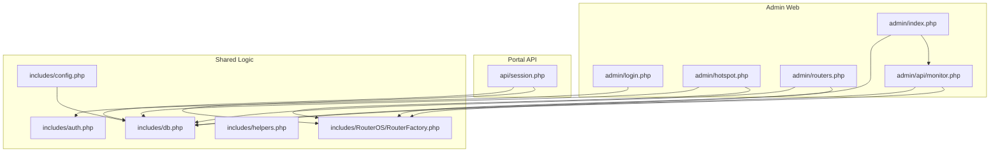

**Diagram sources**
- [admin/index.php:1-154](file://admin/index.php#L1-L154)
- [admin/login.php:1-114](file://admin/login.php#L1-L114)
- [admin/hotspot.php:1-733](file://admin/hotspot.php#L1-L733)
- [admin/routers.php:1-455](file://admin/routers.php#L1-L455)
- [admin/api/monitor.php:1-188](file://admin/api/monitor.php#L1-L188)
- [api/session.php:1-123](file://api/session.php#L1-L123)
- [includes/config.php:1-44](file://includes/config.php#L1-L44)
- [includes/db.php:1-150](file://includes/db.php#L1-L150)
- [includes/auth.php:1-282](file://includes/auth.php#L1-L282)
- [includes/helpers.php:1-97](file://includes/helpers.php#L1-L97)
- [includes/RouterOS/RouterFactory.php:1-56](file://includes/RouterOS/RouterFactory.php#L1-L56)

**Section sources**
- [admin/index.php:1-154](file://admin/index.php#L1-L154)
- [admin/hotspot.php:1-733](file://admin/hotspot.php#L1-L733)
- [admin/routers.php:1-455](file://admin/routers.php#L1-L455)
- [admin/api/monitor.php:1-188](file://admin/api/monitor.php#L1-L188)
- [api/session.php:1-123](file://api/session.php#L1-L123)
- [includes/config.php:1-44](file://includes/config.php#L1-L44)
- [includes/db.php:1-150](file://includes/db.php#L1-L150)
- [includes/auth.php:1-282](file://includes/auth.php#L1-L282)
- [includes/helpers.php:1-97](file://includes/helpers.php#L1-L97)
- [includes/RouterOS/RouterFactory.php:1-56](file://includes/RouterOS/RouterFactory.php#L1-L56)

## Core Components
- Admin authentication and session management: secure login, idle timeout, CSRF protection, rate limiting, and audit logging.
- Router management: add/edit/delete routers, test connectivity, auto-detect REST vs Legacy API, encrypted credential storage.
- Hotspot management: create users, bulk generate vouchers, manage hotspot profiles, view and kick active sessions.
- Enhanced voucher tracking: comprehensive usage logging with MAC/IP tracking, status indicators (READY/USED), and expiration management.
- Live monitoring dashboard: per-router metrics (identity, version, CPU/memory/uptime), active session count, per-interface traffic rates.
- Portal session lookup: unauthenticated JSON endpoint returning session state by MAC address for the SBC portal.

Key responsibilities:
- `admin/login.php`: standalone login page with CSRF and rate limiting.
- `admin/index.php`: dashboard rendering and polling trigger.
- `admin/api/monitor.php`: authenticated JSON feed for live metrics and traffic rates.
- `admin/hotspot.php`: hotspot user/voucher/profile/session management with enhanced voucher tracking.
- `admin/routers.php`: router CRUD and connection testing.
- `api/session.php`: portal-facing session lookup by MAC with automatic voucher usage logging.
- `includes/*`: configuration, database schema, auth helpers, utilities, and router client factory.

**Section sources**
- [admin/login.php:1-114](file://admin/login.php#L1-L114)
- [admin/index.php:1-154](file://admin/index.php#L1-L154)
- [admin/api/monitor.php:1-188](file://admin/api/monitor.php#L1-L188)
- [admin/hotspot.php:1-733](file://admin/hotspot.php#L1-L733)
- [admin/routers.php:1-455](file://admin/routers.php#L1-L455)
- [api/session.php:1-123](file://api/session.php#L1-L123)
- [includes/config.php:1-44](file://includes/config.php#L1-L44)
- [includes/db.php:1-150](file://includes/db.php#L1-L150)
- [includes/auth.php:1-282](file://includes/auth.php#L1-L282)
- [includes/helpers.php:1-97](file://includes/helpers.php#L1-L97)
- [includes/RouterOS/RouterFactory.php:1-56](file://includes/RouterOS/RouterFactory.php#L1-L56)

## Architecture Overview
The admin UI is protected by server-side authentication and CSRF. The dashboard polls a JSON monitor endpoint every 10 seconds. The hotspot page performs mutating actions against MikroTik routers through a router client factory that selects REST or Legacy API based on configuration.

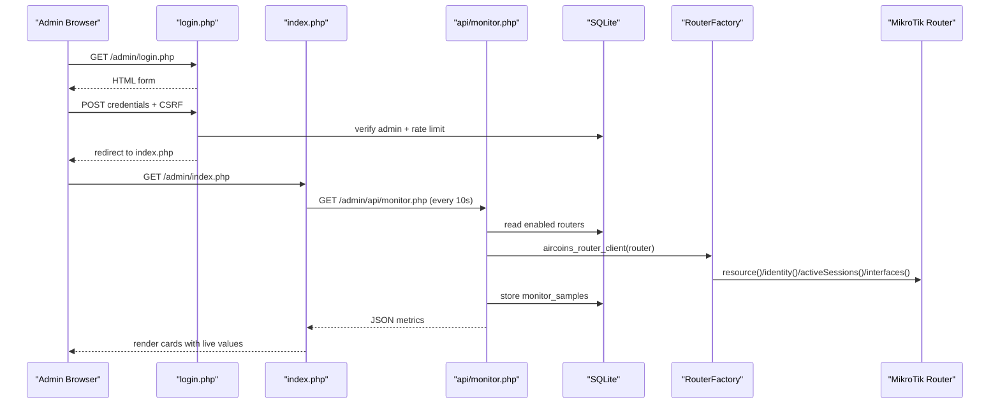

**Diagram sources**
- [admin/login.php:1-114](file://admin/login.php#L1-L114)
- [admin/index.php:1-154](file://admin/index.php#L1-L154)
- [admin/api/monitor.php:1-188](file://admin/api/monitor.php#L1-L188)
- [includes/RouterOS/RouterFactory.php:1-56](file://includes/RouterOS/RouterFactory.php#L1-L56)
- [includes/db.php:1-150](file://includes/db.php#L1-L150)

## Detailed Component Analysis

### Authentication and Session Control
- Login page validates CSRF, enforces rate limiting, and records failed attempts. Successful login regenerates session ID and sets idle timeout tracking.
- Protected pages use a require-login helper that enforces idle timeout and redirects to login if expired.
- Audit log captures privileged actions; login events are audited.

Operational implications:
- Use strong passwords; the system supports Argon2id with bcrypt fallback.
- Idle sessions expire after the configured timeout.
- Brute-force protection limits repeated failures per IP within a configurable window.

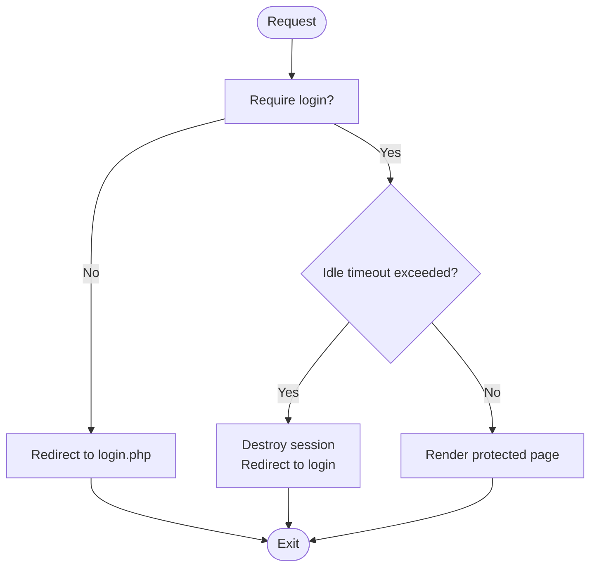

**Diagram sources**
- [includes/auth.php:151-231](file://includes/auth.php#L151-L231)
- [admin/login.php:37-62](file://admin/login.php#L37-L62)

**Section sources**
- [admin/login.php:1-114](file://admin/login.php#L1-L114)
- [includes/auth.php:1-282](file://includes/auth.php#L1-L282)
- [includes/config.php:30-43](file://includes/config.php#L30-L43)

### Router Management
- Add/Edit/Delete routers with encrypted password storage.
- Auto-detect API type by probing REST:443 and Legacy:8728.
- Test connection updates last_status/last_error and audits the action.

Best practices:
- Prefer REST API for RouterOS v7; Legacy API for v6/v7.
- Enable TLS certificate verification when possible; disable only for self-signed environments.
- Disable routers instead of deleting them when temporarily removing from monitoring.

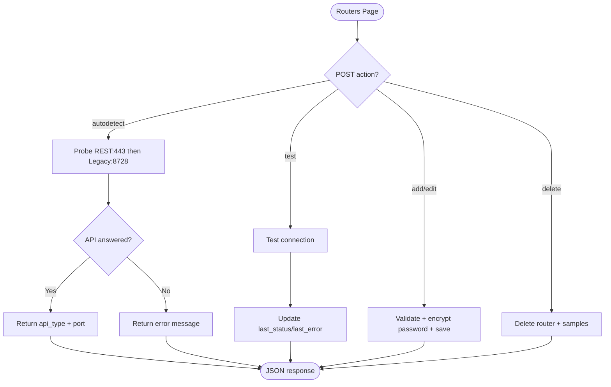

**Diagram sources**
- [admin/routers.php:52-97](file://admin/routers.php#L52-L97)
- [admin/routers.php:116-141](file://admin/routers.php#L116-L141)
- [admin/routers.php:143-223](file://admin/routers.php#L143-L223)
- [admin/routers.php:99-114](file://admin/routers.php#L99-L114)

**Section sources**
- [admin/routers.php:1-455](file://admin/routers.php#L1-L455)
- [includes/RouterOS/RouterFactory.php:1-56](file://includes/RouterOS/RouterFactory.php#L1-L56)

### Enhanced Voucher Tracking and Usage Logging
The system now includes comprehensive voucher tracking capabilities through a dedicated `voucher_log` table that monitors the complete lifecycle of generated vouchers:

**Voucher Log Schema:**
- `code`: Unique voucher identifier
- `mac`: MAC address of device that used the voucher
- `ip`: IP address assigned during session
- `router_id`: Associated router identifier
- `used_at`: Timestamp when voucher was first used
- `expires_at`: Calculated expiration timestamp based on uptime settings

**Automatic Usage Tracking:**
When a user successfully authenticates using a voucher, the system automatically logs the usage event with MAC address, IP address, and timestamp. This provides complete visibility into voucher utilization patterns.

**Status Indicators System:**
Users now display visual status indicators based on voucher usage:
- **READY** (green badge): Voucher has been generated but not yet used
- **USED** (gray badge): Voucher has been successfully used, showing usage timestamp and MAC address
- **None**: No voucher tracking information available

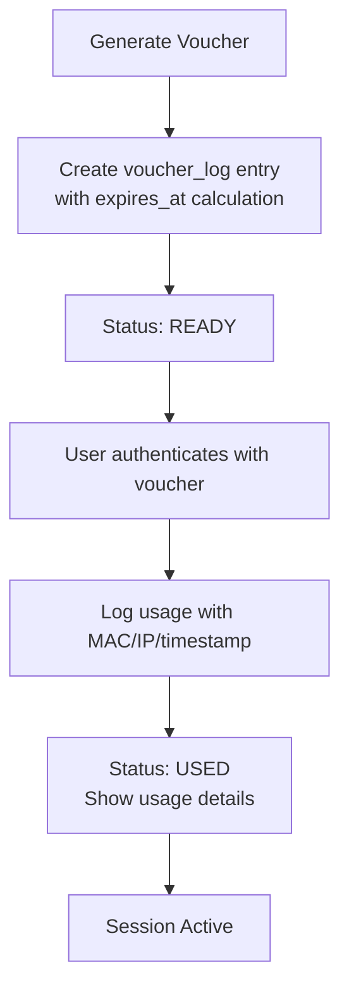

**Diagram sources**
- [admin/hotspot.php:176-183](file://admin/hotspot.php#L176-L183)
- [api/session.php:89-103](file://api/session.php#L89-L103)
- [includes/db.php:137-149](file://includes/db.php#L137-L149)

**Section sources**
- [admin/hotspot.php:176-183](file://admin/hotspot.php#L176-L183)
- [admin/hotspot.php:312-321](file://admin/hotspot.php#L312-L321)
- [admin/hotspot.php:535-546](file://admin/hotspot.php#L535-L546)
- [api/session.php:89-103](file://api/session.php#L89-L103)
- [includes/db.php:137-149](file://includes/db.php#L137-L149)

### Voucher Lifecycle Management
The enhanced voucher system provides complete lifecycle management from generation through usage:

**Generation Phase:**
- Vouchers are created with unique codes (no ambiguous characters)
- Each voucher gets a corresponding entry in `voucher_log` table
- Expiration time is calculated based on uptime settings
- Initial status is set to READY

**Usage Phase:**
- Automatic tracking when user successfully authenticates
- MAC address and IP address captured for audit purposes
- Usage timestamp recorded for reporting and analytics
- Status updated to USED with detailed usage information

**Monitoring Phase:**
- Real-time status indicators in user management interface
- Visual distinction between unused (READY) and used (USED) vouchers
- Usage history available for reporting and troubleshooting

```mermaid
stateDiagram-v2
[*] --> Generated
Generated --> READY : Created in voucher_log
READY --> USED : First successful authentication
USED --> [*] : Session ends
note right of GENERATED
Code generated
voucher_log entry created
expires_at calculated
end note
note right of READY
Status : READY
Available for use
No usage recorded
end note
note right of USED
Status : USED
MAC/IP tracked
Usage timestamp recorded
end note
```

**Diagram sources**
- [admin/hotspot.php:159-209](file://admin/hotspot.php#L159-L209)
- [api/session.php:89-103](file://api/session.php#L89-L103)

**Section sources**
- [admin/hotspot.php:159-209](file://admin/hotspot.php#L159-L209)
- [api/session.php:89-103](file://api/session.php#L89-L103)

### Hotspot User Management and Voucher Generation
- Single user creation: username/password, profile selection, optional comment, optional per-user uptime limit.
- Bulk voucher generator: prefix, count, code length, profile, optional comment, optional uptime limit. Codes are generated without ambiguous characters and used as both username and password.
- User deletion: removes hotspot user from the router.

Voucher behavior:
- Each generated voucher is pushed to the router as a hotspot user.
- Per-user uptime-limit can be set; otherwise profile settings apply.
- Batch results show created codes and any failures.
- **Enhanced**: Automatic voucher tracking with usage logging and status indicators.

**Updated** Removed 'login-by' authentication method selection field from user creation forms. Users now inherit authentication methods from their assigned profiles.

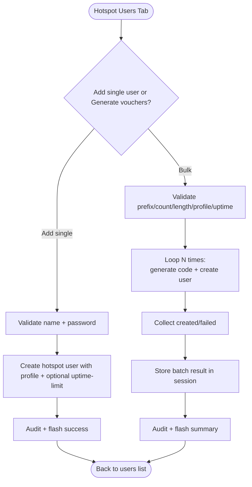

**Diagram sources**
- [admin/hotspot.php:113-137](file://admin/hotspot.php#L113-L137)
- [admin/hotspot.php:159-201](file://admin/hotspot.php#L159-L201)
- [admin/hotspot.php:364-493](file://admin/hotspot.php#L364-L493)

**Section sources**
- [admin/hotspot.php:1-733](file://admin/hotspot.php#L1-L733)

### Active Session Monitoring and Termination
- Active sessions tab lists connected users with MAC, IP, uptime, and bytes in/out.
- Kick action disconnects a specific session; each kick is audited.
- Real-time session counts are shown in the dashboard card per router.

Operational guidance:
- Use kick sparingly; prefer letting profiles enforce timeouts.
- Investigate high byte usage or long uptimes before disconnecting.

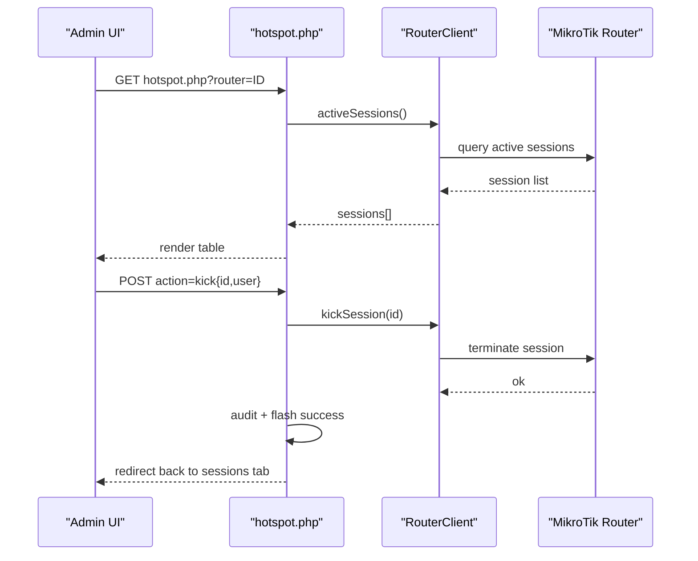

**Diagram sources**
- [admin/hotspot.php:203-220](file://admin/hotspot.php#L203-L220)
- [admin/hotspot.php:288-297](file://admin/hotspot.php#L288-L297)
- [admin/hotspot.php:546-589](file://admin/hotspot.php#L546-L589)

**Section sources**
- [admin/hotspot.php:203-220](file://admin/hotspot.php#L203-L220)
- [admin/hotspot.php:288-297](file://admin/hotspot.php#L288-L297)
- [admin/hotspot.php:546-589](file://admin/hotspot.php#L546-L589)

### Hotspot Profiles and Bandwidth Management
- Profiles define session timeout, uptime limit, rate limit, shared users, and idle timeout.
- Rate limit uses MikroTik format rx/tx (e.g., symmetric 5 Mbps).
- Shared users controls how many devices can share one voucher simultaneously.

Promotional configurations:
- Create dedicated profiles for promotions (e.g., "promo-1h", "guest-24h").
- Use short session timeouts and low rate limits for trial users.
- Keep shared users at 1 for single-device vouchers.

**Updated** Removed 'login-by' authentication method field from profile creation forms. Authentication methods are now managed exclusively through profile assignments.

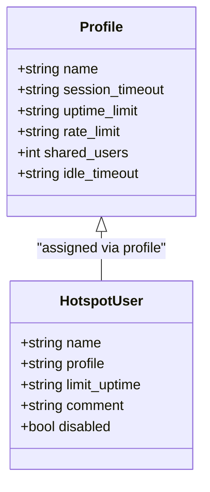

**Diagram sources**
- [admin/hotspot.php:222-251](file://admin/hotspot.php#L222-L251)
- [admin/hotspot.php:591-666](file://admin/hotspot.php#L591-L666)
- [admin/hotspot.php:669-711](file://admin/hotspot.php#L669-L711)

**Section sources**
- [admin/hotspot.php:222-251](file://admin/hotspot.php#L222-L251)
- [admin/hotspot.php:591-666](file://admin/hotspot.php#L591-L666)
- [admin/hotspot.php:669-711](file://admin/hotspot.php#L669-L711)

### Enhanced Rate Limit Display and Uptime Limit Columns
The hotspot administration interface provides enhanced visibility into rate limiting and uptime configurations:

**Rate Limit Display:**
- Profiles table shows rate-limit values in a dedicated column with proper formatting
- Rate limits are displayed in MikroTik format (rx/tx) for easy identification
- Empty rate limits are handled gracefully with blank cells

**Uptime Limit Columns:**
- Hotspot users table displays `limit-uptime` attribute for per-user session limits
- Profiles table displays `uptime-limit` attribute for profile-level session limits
- Clear distinction between per-user overrides and profile defaults

**Updated** Enhanced table views now properly distinguish between per-user `limit-uptime` and profile-level `uptime-limit` attributes, providing clearer visibility into session duration controls.

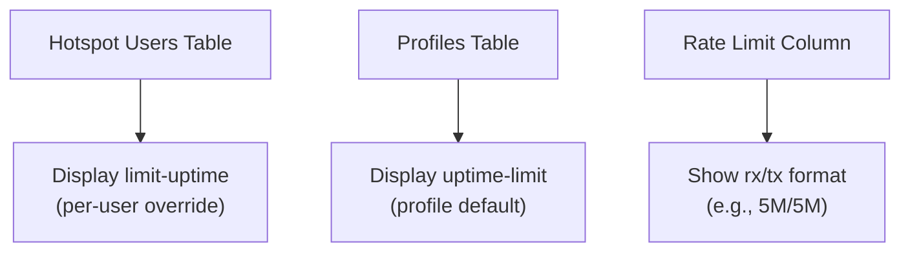

**Diagram sources**
- [admin/hotspot.php:507-514](file://admin/hotspot.php#L507-L514)
- [admin/hotspot.php:666-674](file://admin/hotspot.php#L666-L674)

**Section sources**
- [admin/hotspot.php:507-514](file://admin/hotspot.php#L507-L514)
- [admin/hotspot.php:666-674](file://admin/hotspot.php#L666-L674)

### Interface-Level Traffic Monitoring and Bandwidth Visibility
- Dashboard cards display per-interface traffic rates computed from counter diffs stored in `monitor_samples`.
- Monitor endpoint reads interfaces, computes rx_rate/tx_rate, persists samples, and prunes older than 24 hours.
- Rates are non-negative; counter resets or zero elapsed time yield zero rate.

Bandwidth insights:
- Use interface rates to detect congestion or unusual spikes.
- Combine with active session counts to correlate load.

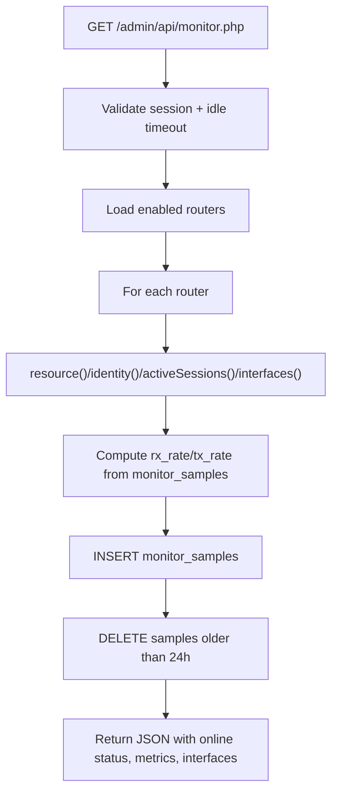

**Diagram sources**
- [admin/api/monitor.php:29-50](file://admin/api/monitor.php#L29-L50)
- [admin/api/monitor.php:101-188](file://admin/api/monitor.php#L101-L188)

**Section sources**
- [admin/api/monitor.php:1-188](file://admin/api/monitor.php#L1-L188)
- [includes/db.php:103-116](file://includes/db.php#L103-L116)

### Portal-Facing Session Lookup
- Unauthenticated JSON endpoint returns whether a given MAC has an active session on any enabled router.
- Normalizes MAC input and safely iterates routers; errors are suppressed to avoid leaking details.
- Returns user, uptime, bytes_in/out, and time_left when available.
- **Enhanced**: Automatically marks vouchers as used in voucher_log when successful authentication occurs.

Use cases:
- SBC portal displays live session status to the end user.
- Useful for diagnosing why a device cannot connect despite valid credentials.
- Provides automatic voucher usage tracking for audit and reporting purposes.

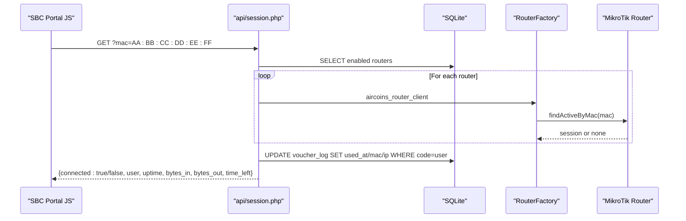

**Diagram sources**
- [api/session.php:1-123](file://api/session.php#L1-L123)
- [includes/RouterOS/RouterFactory.php:1-56](file://includes/RouterOS/RouterFactory.php#L1-L56)

**Section sources**
- [api/session.php:1-123](file://api/session.php#L1-L123)

## Dependency Analysis
The admin pages depend on shared modules for configuration, database access, authentication, and utilities. Router interactions are abstracted behind a factory that chooses between REST and Legacy clients.

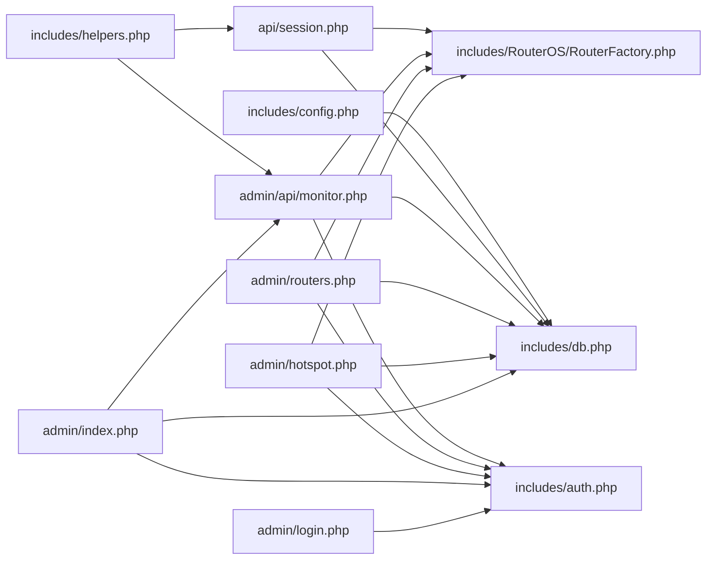

**Diagram sources**
- [admin/index.php:1-154](file://admin/index.php#L1-L154)
- [admin/hotspot.php:1-733](file://admin/hotspot.php#L1-L733)
- [admin/routers.php:1-455](file://admin/routers.php#L1-L455)
- [admin/api/monitor.php:1-188](file://admin/api/monitor.php#L1-L188)
- [api/session.php:1-123](file://api/session.php#L1-L123)
- [includes/config.php:1-44](file://includes/config.php#L1-L44)
- [includes/db.php:1-150](file://includes/db.php#L1-L150)
- [includes/auth.php:1-282](file://includes/auth.php#L1-L282)
- [includes/helpers.php:1-97](file://includes/helpers.php#L1-L97)
- [includes/RouterOS/RouterFactory.php:1-56](file://includes/RouterOS/RouterFactory.php#L1-L56)

**Section sources**
- [admin/index.php:1-154](file://admin/index.php#L1-L154)
- [admin/hotspot.php:1-733](file://admin/hotspot.php#L1-L733)
- [admin/routers.php:1-455](file://admin/routers.php#L1-L455)
- [admin/api/monitor.php:1-188](file://admin/api/monitor.php#L1-L188)
- [api/session.php:1-123](file://api/session.php#L1-L123)
- [includes/config.php:1-44](file://includes/config.php#L1-L44)
- [includes/db.php:1-150](file://includes/db.php#L1-L150)
- [includes/auth.php:1-282](file://includes/auth.php#L1-L282)
- [includes/helpers.php:1-97](file://includes/helpers.php#L1-L97)
- [includes/RouterOS/RouterFactory.php:1-56](file://includes/RouterOS/RouterFactory.php#L1-L56)

## Performance Considerations
- Dashboard polling interval is 10 seconds; ensure backend can handle concurrent requests during peak hours.
- Monitor endpoint writes per-interface samples on each poll; sample pruning keeps the table bounded to 24 hours.
- Database uses WAL mode and sane busy timeout to reduce contention.
- Avoid large bulk voucher generations during peak traffic; consider off-peak scheduling.
- Rate limits protect login endpoints but may affect operators with multiple failed attempts; advise resetting after successful login.
- **Enhanced**: Voucher tracking adds minimal overhead; usage logging occurs only on successful authentication.

## Troubleshooting Guide
Common issues and resolutions:
- Cannot reach router: check host/port/API type; use Test Connection to update last_status/last_error.
- Session expired: re-authenticate; idle timeout is enforced by require-login and monitor endpoint.
- Voucher creation fails: verify profile exists and permissions; first failure aborts further generation.
- No active sessions: confirm hotspot service is running on router; check MAC lookup via portal API.
- High CPU/memory: review router identity/version/board-name and monitor trends over time.
- Voucher shows READY but user cannot connect: verify voucher hasn't expired and profile permissions are correct.
- Voucher shows USED but user reports never used it: check voucher_log for MAC/IP mismatch or timing discrepancies.

Operational tips:
- Use audit logs to trace who created/deleted users or kicked sessions.
- Keep profiles minimal and well-named; reuse them across users and vouchers.
- When troubleshooting bandwidth, compare interface rates with active session counts.
- Verify that per-user `limit-uptime` values are correctly applied and not conflicting with profile `uptime-limit` settings.
- Monitor voucher status indicators (READY/USED) to track voucher utilization patterns.
- Use voucher_log entries to identify which devices used specific vouchers for security auditing.

**Section sources**
- [admin/routers.php:116-141](file://admin/routers.php#L116-L141)
- [admin/hotspot.php:159-201](file://admin/hotspot.php#L159-L201)
- [admin/api/monitor.php:164-177](file://admin/api/monitor.php#L164-L177)
- [api/session.php:58-83](file://api/session.php#L58-L83)
- [admin/hotspot.php:535-546](file://admin/hotspot.php#L535-L546)

## Conclusion
The hotspot administration interface provides a comprehensive toolkit for managing MikroTik hotspot deployments. Operators can securely authenticate, configure routers, create and manage hotspot users and vouchers, monitor active sessions, and analyze interface-level traffic. The enhanced voucher tracking system provides complete visibility into voucher lifecycle management with automatic usage logging, status indicators, and comprehensive audit trails. Profiles enable fine-grained control over session duration and bandwidth. Following the recommended workflows and best practices ensures reliable daily operations and scalable hotspot management.

## Appendices

### Daily Operational Tasks
- Morning check:
  - Open dashboard and verify all routers are online.
  - Review active session counts and interface traffic rates.
  - Check voucher status indicators for any unexpected USED statuses.
- User support:
  - Locate user by MAC using portal session lookup.
  - If needed, kick session and guide user to re-login.
  - Check voucher_log for usage history if user claims voucher didn't work.
- Voucher distribution:
  - Generate vouchers with appropriate profile and uptime limit.
  - Distribute codes securely; track batch comments for auditing.
  - Monitor READY/USED status indicators to track voucher utilization.
- Performance monitoring:
  - Watch CPU/memory and uptime trends.
  - Investigate spikes in interface traffic and correlate with sessions.
  - Analyze voucher usage patterns for capacity planning.

### Best Practices
- Use REST API where supported; fall back to Legacy only when necessary.
- Enforce TLS certificate verification unless operating with self-signed certificates.
- Keep shared users at 1 for single-device vouchers to prevent sharing.
- Use descriptive comments for voucher batches and users for auditability.
- Regularly review audit logs for anomalies.
- Configure appropriate rate limits and session timeouts through profiles.
- Monitor the distinction between per-user `limit-uptime` and profile `uptime-limit` settings.
- Leverage voucher status indicators (READY/USED) to track voucher utilization and identify potential security issues.
- Use voucher_log entries for comprehensive audit trails and usage analytics.