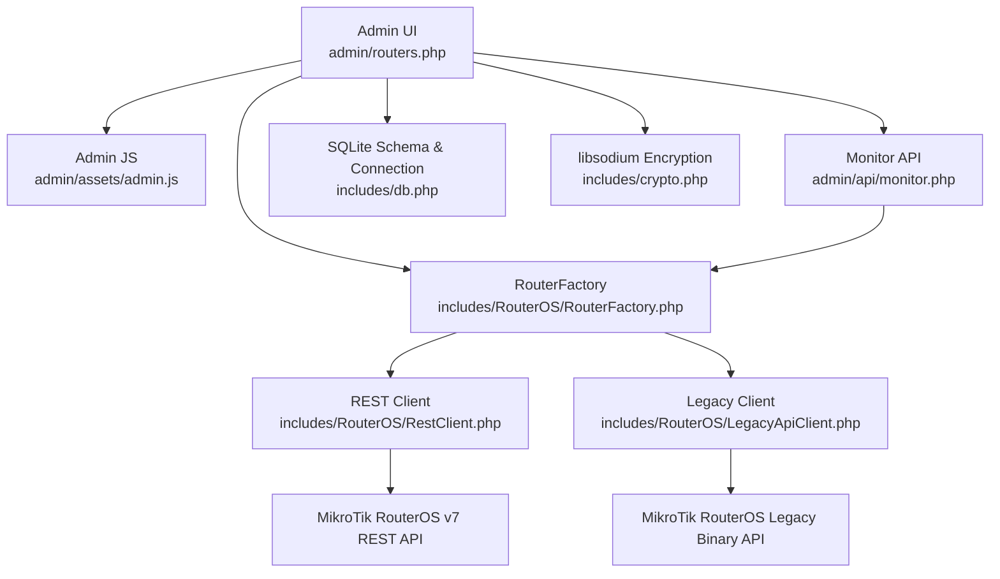
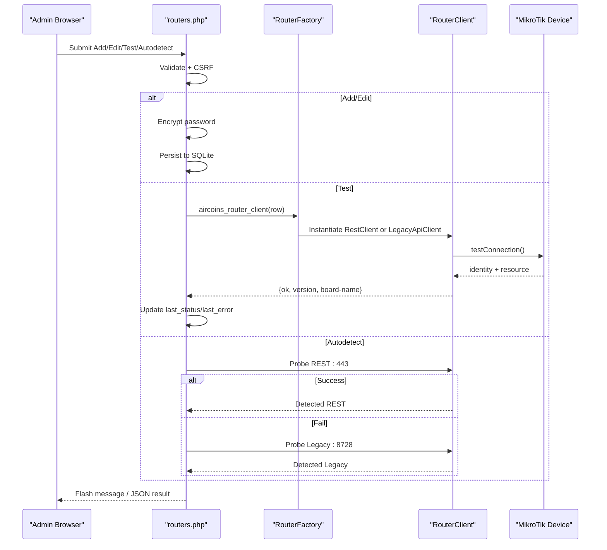
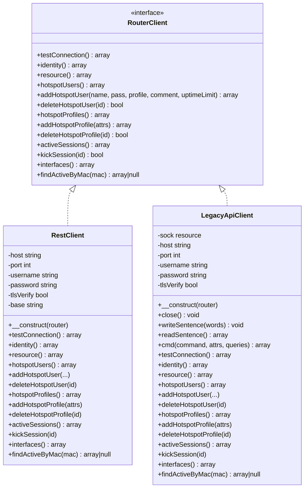
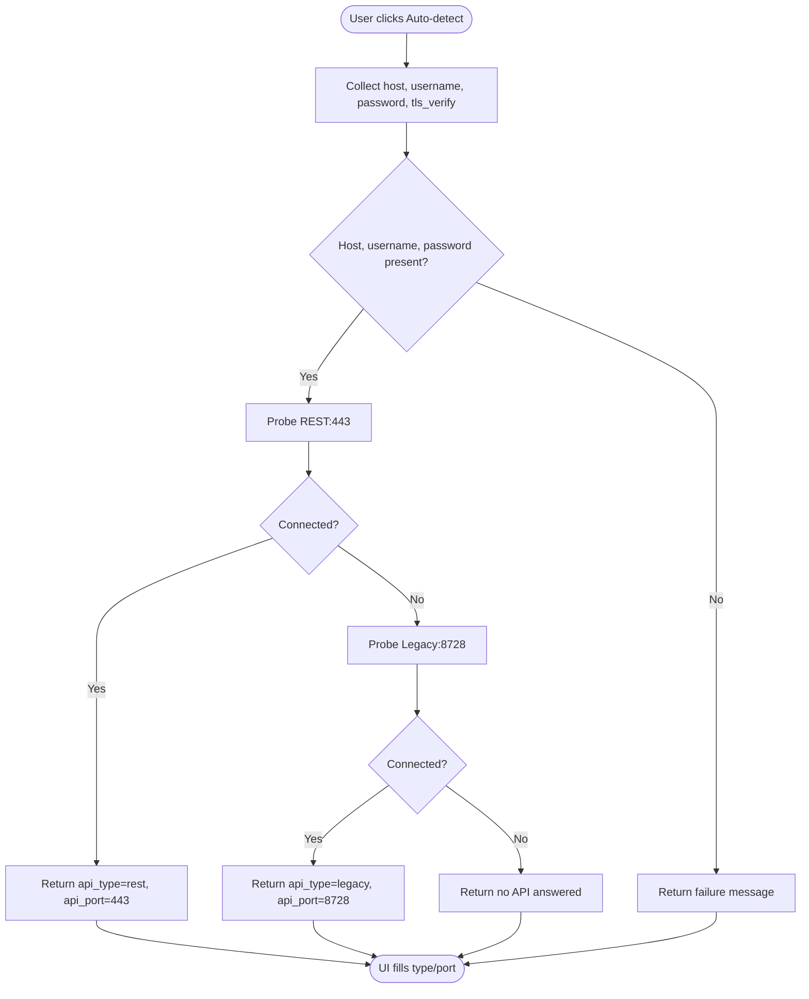
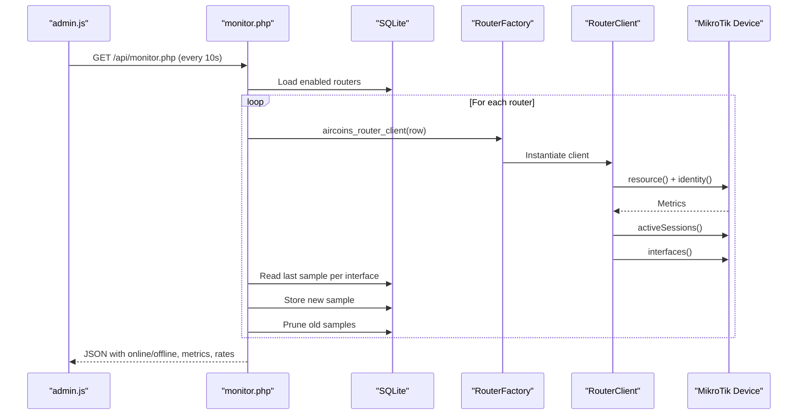
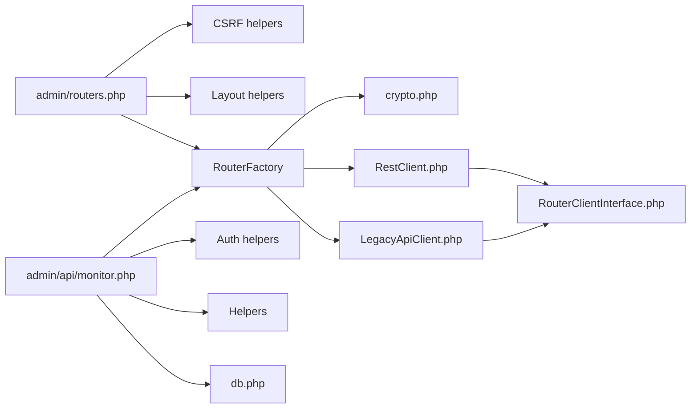

# Router Management

<cite>
**Referenced Files in This Document**
- [routers.php](file://admin/routers.php)
- [admin.js](file://admin/assets/admin.js)
- [monitor.php](file://admin/api/monitor.php)
- [RouterFactory.php](file://includes/RouterOS/RouterFactory.php)
- [RestClient.php](file://includes/RouterOS/RestClient.php)
- [LegacyApiClient.php](file://includes/RouterOS/LegacyApiClient.php)
- [RouterClientInterface.php](file://includes/RouterOS/RouterClientInterface.php)
- [crypto.php](file://includes/crypto.php)
- [db.php](file://includes/db.php)
</cite>

## Table of Contents
1. [Introduction](#introduction)
2. [Project Structure](#project-structure)
3. [Core Components](#core-components)
4. [Architecture Overview](#architecture-overview)
5. [Detailed Component Analysis](#detailed-component-analysis)
6. [Dependency Analysis](#dependency-analysis)
7. [Performance Considerations](#performance-considerations)
8. [Troubleshooting Guide](#troubleshooting-guide)
9. [Conclusion](#conclusion)
10. [Appendices](#appendices)

## Introduction
This document explains the router management interface for MikroTik devices. It covers how to add routers, configure host and API settings, manage credentials securely, test connectivity, monitor health, and operate routers through a unified REST v7 and Legacy binary protocol abstraction. It also documents automatic API type detection, encrypted credential storage, enable/disable behavior, bulk operations, and step-by-step setup and maintenance procedures.

## Project Structure
The router management feature spans the admin UI, an internal monitoring API, and a RouterOS client layer:

- Admin UI: `admin/routers.php` renders the router list, add/edit modal, CSRF-protected actions, and inline auto-detect.
- Admin JavaScript: `admin/assets/admin.js` wires auto-detect, default port logic, dashboard polling, and user interactions.
- Monitoring API: `admin/api/monitor.php` polls enabled routers every 10 seconds and returns live metrics.
- RouterOS clients: `includes/RouterOS/RestClient.php`, `includes/RouterOS/LegacyApiClient.php`, and `includes/RouterOS/RouterFactory.php` implement dual API support behind `includes/RouterOS/RouterClientInterface.php`.
- Security and persistence: `includes/crypto.php` encrypts passwords with libsodium; `includes/db.php` manages SQLite schema and connections.

**Diagram sources**
- [routers.php:17-27](file://admin/routers.php#L17-L27)
- [admin.js:176-230](file://admin/assets/admin.js#L176-L230)
- [monitor.php:21-24](file://admin/api/monitor.php#L21-L24)
- [RouterFactory.php:12-15](file://includes/RouterOS/RouterFactory.php#L12-L15)
- [RestClient.php:22-48](file://includes/RouterOS/RestClient.php#L22-L48)
- [LegacyApiClient.php:20-50](file://includes/RouterOS/LegacyApiClient.php#L20-L50)
- [db.php:36-47](file://includes/db.php#L36-L47)
- [crypto.php:25-48](file://includes/crypto.php#L25-L48)

**Section sources**
- [routers.php:1-455](file://admin/routers.php#L1-L455)
- [admin.js:1-422](file://admin/assets/admin.js#L1-L422)
- [monitor.php:1-188](file://admin/api/monitor.php#L1-L188)
- [RouterFactory.php:1-56](file://includes/RouterOS/RouterFactory.php#L1-L56)
- [RestClient.php:1-459](file://includes/RouterOS/RestClient.php#L1-L459)
- [LegacyApiClient.php:1-667](file://includes/RouterOS/LegacyApiClient.php#L1-L667)
- [RouterClientInterface.php:1-128](file://includes/RouterOS/RouterClientInterface.php#L1-L128)
- [crypto.php:1-138](file://includes/crypto.php#L1-L138)
- [db.php:1-117](file://includes/db.php#L1-L117)

## Core Components
- Router configuration form and CRUD actions: name, host, API type (REST or Legacy), API port, username, password, TLS verification, disabled flag, last status, and last error.
- Dual API support: REST v7 over HTTPS JSON and Legacy binary protocol over TCP/TLS.
- Automatic API type detection: probes REST:443 then Legacy:8728 using provided host and credentials.
- Health monitoring: per-router online/offline state, version, board name, CPU/memory/uptime, active sessions, and per-interface traffic rates.
- Encrypted credential storage: passwords are stored as base64(nonce || ciphertext) using libsodium secretbox.
- Enable/disable: disabled routers are excluded from monitoring and lookups.

Key responsibilities by file:
- `admin/routers.php`: CSRF-protected POST handling for add/edit/delete/test/autodetect; stores encrypted passwords; updates last_status/last_error.
- `admin/assets/admin.js`: Auto-detect button flow, default port selection, dashboard polling, toast notifications.
- `admin/api/monitor.php`: Authenticated JSON feed that queries enabled routers and computes per-interface rates.
- `includes/RouterOS/RouterFactory.php`: Resolves plaintext password from encrypted store and selects RestClient vs LegacyApiClient.
- `includes/RouterOS/RestClient.php`: HTTP Basic + JSON REST client for RouterOS v7.
- `includes/RouterOS/LegacyApiClient.php`: Binary sentence protocol client supporting modern and legacy challenge-response login.
- `includes/RouterOS/RouterClientInterface.php`: Unified contract for both implementations.
- `includes/crypto.php`: Key loading, normalization, encryption, decryption.
- `includes/db.php`: PDO connection, WAL mode, and schema including routers and monitor_samples tables.

**Section sources**
- [routers.php:29-223](file://admin/routers.php#L29-L223)
- [admin.js:176-258](file://admin/assets/admin.js#L176-L258)
- [monitor.php:101-187](file://admin/api/monitor.php#L101-L187)
- [RouterFactory.php:29-55](file://includes/RouterOS/RouterFactory.php#L29-L55)
- [RestClient.php:54-86](file://includes/RouterOS/RestClient.php#L54-L86)
- [LegacyApiClient.php:42-50](file://includes/RouterOS/LegacyApiClient.php#L42-L50)
- [RouterClientInterface.php:31-127](file://includes/RouterOS/RouterClientInterface.php#L31-L127)
- [crypto.php:91-137](file://includes/crypto.php#L91-L137)
- [db.php:56-116](file://includes/db.php#L56-L116)

## Architecture Overview
The system uses a layered architecture:

- Presentation layer: Admin UI and JavaScript handle user input, validation feedback, and real-time dashboards.
- Application layer: PHP controllers process requests, enforce CSRF, validate inputs, persist data, and orchestrate API calls.
- Domain layer: RouterOS client abstraction provides a consistent interface regardless of underlying protocol.
- Infrastructure layer: SQLite database and libsodium cryptography provide persistence and security.

**Diagram sources**
- [routers.php:47-97](file://admin/routers.php#L47-L97)
- [routers.php:116-141](file://admin/routers.php#L116-L141)
- [RouterFactory.php:29-55](file://includes/RouterOS/RouterFactory.php#L29-L55)
- [RestClient.php:54-86](file://includes/RouterOS/RestClient.php#L54-L86)
- [LegacyApiClient.php:429-463](file://includes/RouterOS/LegacyApiClient.php#L429-L463)

## Detailed Component Analysis

### Router Configuration and Credential Management
- Host configuration: The form requires a human-readable name and a host/IP address.
- API type and port: Users select REST or Legacy; default ports are 443 for REST and 8728 for Legacy, with 8729 available for Legacy TLS.
- Credentials: Username is required; password is required on add and optional on edit (blank means keep existing). Passwords are encrypted at rest using libsodium before being stored in `routers.pass_enc`.
- TLS verification: A checkbox controls whether TLS certificate verification is enforced for both REST and Legacy connections.
- Disabled flag: When set, the router is excluded from monitoring and lookups.

Validation rules:
- Name, host, and username are mandatory.
- Port must be between 1 and 65535.
- Password is mandatory when adding a new router.

Storage:
- On add, the password is encrypted and inserted into the routers table.
- On edit, if a new password is provided, it is encrypted and updated; otherwise, other fields are updated without touching the stored password.

Audit and flash messages:
- All mutations are audited and surfaced via flash messages.

**Section sources**
- [routers.php:143-223](file://admin/routers.php#L143-L223)
- [crypto.php:91-137](file://includes/crypto.php#L91-L137)
- [db.php:67-82](file://includes/db.php#L67-L82)

### Dual API Support System
The system supports two protocols:

- REST v7: Uses HTTPS with HTTP Basic authentication and JSON payloads. It maps HTTP verbs to RouterOS operations and normalizes string values returned by the API.
- Legacy binary: Implements the RouterOS binary sentence protocol over TCP (port 8728) or TLS (port 8729). It supports both modern firmware (plaintext login) and older firmware (challenge-response MD5).

Both implementations conform to `RouterClientInterface`, which defines methods such as `testConnection`, `identity`, `resource`, `hotspotUsers`, `activeSessions`, `interfaces`, and more.

**Diagram sources**
- [RouterClientInterface.php:31-127](file://includes/RouterOS/RouterClientInterface.php#L31-L127)
- [RestClient.php:24-48](file://includes/RouterOS/RestClient.php#L24-L48)
- [LegacyApiClient.php:22-50](file://includes/RouterOS/LegacyApiClient.php#L22-L50)

**Section sources**
- [RouterClientInterface.php:1-128](file://includes/RouterOS/RouterClientInterface.php#L1-L128)
- [RestClient.php:1-459](file://includes/RouterOS/RestClient.php#L1-L459)
- [LegacyApiClient.php:1-667](file://includes/RouterOS/LegacyApiClient.php#L1-L667)

### Connection Testing and Automatic API Type Detection
- Manual test: Clicking “Test” on a router row triggers a POST action that constructs a client from the stored row, calls `testConnection()`, and updates `last_status` and `last_error`.
- Auto-detect: The “Auto-detect API type” button sends host, username, password, and TLS setting to the server. The server probes REST:443 first, then Legacy:8728. If either succeeds, it returns the detected type and port, and the UI pre-fills the radio button and port field.

**Diagram sources**
- [routers.php:52-97](file://admin/routers.php#L52-L97)
- [admin.js:176-230](file://admin/assets/admin.js#L176-L230)

**Section sources**
- [routers.php:52-97](file://admin/routers.php#L52-L97)
- [routers.php:116-141](file://admin/routers.php#L116-L141)
- [admin.js:176-230](file://admin/assets/admin.js#L176-L230)

### Health Monitoring and Live Dashboard
- The monitoring endpoint authenticates the session, loads all enabled routers, and for each one:
  - Reads resource and identity.
  - Counts active sessions.
  - Lists interfaces and computes per-interface RX/TX rates by diffing counter samples.
  - Stores new samples and prunes samples older than 24 hours.
- The admin JavaScript polls this endpoint every 10 seconds and paints cards showing online/offline state, CPU/memory bars, uptime, active count, and interface rates.

**Diagram sources**
- [monitor.php:101-187](file://admin/api/monitor.php#L101-L187)
- [admin.js:358-397](file://admin/assets/admin.js#L358-L397)
- [RouterFactory.php:29-55](file://includes/RouterOS/RouterFactory.php#L29-L55)

**Section sources**
- [monitor.php:1-188](file://admin/api/monitor.php#L1-L188)
- [admin.js:294-397](file://admin/assets/admin.js#L294-L397)

### Encrypted Credential Storage Using libsodium
- Passwords are never persisted in plaintext.
- Encryption produces base64(nonce || ciphertext) using XSalsa20-Poly1305.
- The 32-byte key is loaded from a secure file path configured outside the web root.
- Decryption occurs only in memory during request processing.

Security notes:
- If the sodium extension is missing, operations throw runtime exceptions.
- Malformed keys or tampered payloads cause explicit errors.

**Section sources**
- [crypto.php:1-138](file://includes/crypto.php#L1-L138)
- [routers.php:173-213](file://admin/routers.php#L173-L213)

### Router Enable/Disable Operations
- The disabled flag is stored in the routers table.
- Disabled routers are excluded from the monitoring endpoint’s query.
- The UI shows ENABLED/DISABLED badges and allows toggling via the edit form.

Operational impact:
- Disabled routers do not appear in live dashboards.
- They are still manageable via the router list but are intentionally excluded from automated monitoring.

**Section sources**
- [db.php:67-82](file://includes/db.php#L67-L82)
- [monitor.php:106-112](file://admin/api/monitor.php#L106-L112)
- [routers.php:297-324](file://admin/routers.php#L297-L324)

### Bulk Management Features
- Bulk voucher generation: The admin JavaScript includes logic for generating multiple vouchers with configurable prefix, code length, and session duration.
- While the current router management page does not expose a dedicated bulk router operation, the voucher generator demonstrates bulk creation patterns for hotspot users.

Implementation highlights:
- The JS validates count limits and updates a preview label reflecting generated codes and session duration.
- This pattern can be extended to bulk router operations if needed.

**Section sources**
- [admin.js:260-292](file://admin/assets/admin.js#L260-L292)

## Dependency Analysis
The router management module depends on several layers:

- Admin UI depends on CSRF helpers, layout helpers, and the RouterFactory.
- Monitoring API depends on auth, helpers, db, and RouterFactory.
- RouterFactory depends on crypto and both client implementations.
- Both clients depend on the RouterClientInterface.

**Diagram sources**
- [routers.php:17-21](file://admin/routers.php#L17-L21)
- [monitor.php:21-24](file://admin/api/monitor.php#L21-L24)
- [RouterFactory.php:12-15](file://includes/RouterOS/RouterFactory.php#L12-L15)
- [RestClient.php:22-24](file://includes/RouterOS/RestClient.php#L22-L24)
- [LegacyApiClient.php:20-22](file://includes/RouterOS/LegacyApiClient.php#L20-L22)
- [RouterClientInterface.php:31-127](file://includes/RouterOS/RouterClientInterface.php#L31-L127)

**Section sources**
- [routers.php:17-21](file://admin/routers.php#L17-L21)
- [monitor.php:21-24](file://admin/api/monitor.php#L21-L24)
- [RouterFactory.php:12-15](file://includes/RouterOS/RouterFactory.php#L12-L15)

## Performance Considerations
- REST client uses cURL with short timeouts (connect 5s, total 10s) and JSON encoding/decoding.
- Legacy client uses stream sockets with timeouts and robust read/write loops.
- Monitoring endpoint computes per-interface rates by comparing recent samples and prunes old samples to bound table growth.
- Database uses SQLite with WAL mode and busy timeout to improve concurrency and durability.

Recommendations:
- Keep TLS verification enabled in production where possible.
- Avoid excessive polling intervals; 10 seconds balances responsiveness and load.
- Ensure network paths to routers are low-latency to avoid timeouts.

[No sources needed since this section provides general guidance]

## Troubleshooting Guide

### Common Connection Issues
- REST:443 unreachable:
  - Verify www-ssl service is enabled on the router.
  - Confirm host/IP and port 443 are reachable from the controller.
  - Check TLS certificate settings; disable verification only if using self-signed certificates.
- Legacy:8728/8729 unreachable:
  - Verify api or api-ssl services are enabled.
  - Confirm TCP/TLS reachability and firewall rules.
  - For TLS, ensure certificate verification matches your environment.

### API Authentication Problems
- Wrong username/password:
  - Use the “Test” action to verify credentials.
  - For Legacy, ensure the router firmware supports the expected login mode; the client handles both plaintext and challenge-response.
- Self-signed TLS:
  - Disable TLS verification in the form if necessary for development environments.

### Network Connectivity Troubleshooting
- DNS resolution failures:
  - Use IP addresses instead of hostnames when testing.
- Firewall blocking ports:
  - Open 443 for REST and 8728/8729 for Legacy.
- Timeouts:
  - Increase network reliability or reduce concurrent polling.

### Steps to Diagnose
1. Run “Auto-detect” to confirm API type and port.
2. Run “Test” to check connectivity and capture last_status/last_error.
3. Review the monitoring dashboard for online/offline indicators and error messages.
4. Inspect the database for last_status and last_error entries.

**Section sources**
- [routers.php:52-97](file://admin/routers.php#L52-L97)
- [routers.php:116-141](file://admin/routers.php#L116-L141)
- [monitor.php:179-182](file://admin/api/monitor.php#L179-L182)

## Conclusion
The router management interface provides a secure, user-friendly way to manage MikroTik routers across REST v7 and Legacy binary protocols. It supports automatic API detection, encrypted credential storage, health monitoring, and operational controls like enable/disable. With clear validation, audit logging, and troubleshooting tools, administrators can confidently add, test, and maintain routers while keeping sensitive data protected.

[No sources needed since this section summarizes without analyzing specific files]

## Appendices

### Step-by-Step Setup Procedures

#### Adding a New Router
1. Log in to the admin panel.
2. Click “Add Router”.
3. Enter a descriptive name and the router’s host/IP.
4. Choose API type:
   - REST: RouterOS v7, typically port 443.
   - Legacy: RouterOS v6/v7, typically port 8728 or 8729.
5. Enter the API username and password.
6. Configure TLS verification based on your environment.
7. Optionally mark the router as disabled to exclude it from monitoring.
8. Click “Add router”.
9. Use “Test” to verify connectivity and review last_status/last_error.

#### Verifying API Type Automatically
1. In the add/edit modal, fill host, username, and password.
2. Click “Auto-detect API type”.
3. The UI will pre-select the correct API type and port if successful.

#### Enabling or Disabling a Router
1. Edit the router.
2. Toggle the “Disabled” checkbox.
3. Save changes.
4. Disabled routers will not appear in the live dashboard.

#### Maintaining Routers
- Periodically run “Test” to ensure connectivity remains stable.
- Monitor the dashboard for CPU, memory, uptime, and interface rates.
- Update TLS verification settings as certificates change.
- Rotate API credentials by editing the router and entering a new password.

**Section sources**
- [routers.php:265-455](file://admin/routers.php#L265-L455)
- [admin.js:176-258](file://admin/assets/admin.js#L176-L258)
- [monitor.php:106-187](file://admin/api/monitor.php#L106-L187)