# Security & Authentication

<cite>
**Referenced Files in This Document**
- [admin/login.php](file://admin/login.php)
- [admin/logout.php](file://admin/logout.php)
- [admin/index.php](file://admin/index.php)
- [admin/devices.php](file://admin/devices.php)
- [admin/routers.php](file://admin/routers.php)
- [includes/auth.php](file://includes/auth.php)
- [includes/csrf.php](file://includes/csrf.php)
- [includes/crypto.php](file://includes/crypto.php)
- [includes/config.php](file://includes/config.php)
- [includes/db.php](file://includes/db.php)
- [includes/helpers.php](file://includes/helpers.php)
- [api/session.php](file://api/session.php)
</cite>

## Update Summary
**Changes Made**
- Enhanced CSRF protection implementation across all administrative endpoints
- Comprehensive input validation for device management operations
- Detailed audit logging for all device CRUD operations (add, edit, delete, kick)
- Router management security enhancements with encrypted credentials
- Improved session handling and authentication flow
- Added device management security controls and monitoring capabilities

## Table of Contents
1. [Introduction](#introduction)
2. [Project Structure](#project-structure)
3. [Core Components](#core-components)
4. [Architecture Overview](#architecture-overview)
5. [Detailed Component Analysis](#detailed-component-analysis)
6. [Device Management Security](#device-management-security)
7. [Router Management Security](#router-management-security)
8. [Dependency Analysis](#dependency-analysis)
9. [Performance Considerations](#performance-considerations)
10. [Troubleshooting Guide](#troubleshooting-guide)
11. [Conclusion](#conclusion)

## Introduction
This document explains the administrative panel security and authentication system for the project. It covers secure HTTPS-only session handling, comprehensive CSRF protection, input validation, rate limiting, brute-force prevention, detailed audit logging, password hashing with Argon2id (with bcrypt fallback), logout procedures, and operational guidance to keep the admin interface secure. The system now includes enhanced security for device and router management operations with complete audit trails.

## Project Structure
The security-relevant parts are concentrated under `admin/` for user-facing endpoints and `includes/` for shared security logic:

- Admin entry points: login, logout, dashboard, device management, router management.
- Shared security modules: authentication, CSRF, configuration, database schema, helpers, and encryption utilities.
- A portal-facing API endpoint that is intentionally unauthenticated but read-only and input-validated.

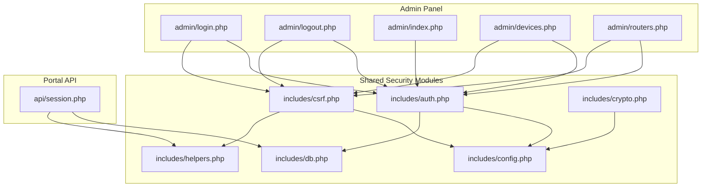

**Diagram sources**
- [admin/login.php:14-18](file://admin/login.php#L14-L18)
- [admin/logout.php:15-19](file://admin/logout.php#L15-L19)
- [admin/index.php:14-17](file://admin/index.php#L14-L17)
- [admin/devices.php:11-15](file://admin/devices.php#L11-L15)
- [admin/routers.php:17-21](file://admin/routers.php#L17-L21)
- [includes/auth.php:14-15](file://includes/auth.php#L14-L15)
- [includes/csrf.php:12-14](file://includes/csrf.php#L12-L14)
- [includes/config.php:15-43](file://includes/config.php#L15-L43)
- [includes/db.php:12-47](file://includes/db.php#L12-L47)
- [includes/helpers.php:11-38](file://includes/helpers.php#L11-L38)
- [includes/crypto.php:15-47](file://includes/crypto.php#L15-L47)
- [api/session.php:23-31](file://api/session.php#L23-L31)

**Section sources**
- [admin/login.php:1-114](file://admin/login.php#L1-L114)
- [admin/logout.php:1-43](file://admin/logout.php#L1-L43)
- [admin/index.php:1-154](file://admin/index.php#L1-L154)
- [admin/devices.php:1-537](file://admin/devices.php#L1-L537)
- [admin/routers.php:1-455](file://admin/routers.php#L1-L455)
- [includes/auth.php:1-282](file://includes/auth.php#L1-L282)
- [includes/csrf.php:1-68](file://includes/csrf.php#L1-L68)
- [includes/config.php:1-44](file://includes/config.php#L1-L44)
- [includes/db.php:1-150](file://includes/db.php#L1-L150)
- [includes/helpers.php:1-97](file://includes/helpers.php#L1-L97)
- [includes/crypto.php:1-138](file://includes/crypto.php#L1-L138)
- [api/session.php:1-123](file://api/session.php#L1-L123)

## Core Components
- Authentication and session hardening: centralized in `includes/auth.php`.
- CSRF protection: token generation, rendering, and verification in `includes/csrf.php`.
- Configuration constants: timeouts, rate limits, session name, and key path in `includes/config.php`.
- Database schema and persistence: SQLite connection and tables in `includes/db.php`.
- Output escaping and JSON helpers: XSS-safe output and JSON responses in `includes/helpers.php`.
- Encryption for router credentials at rest: libsodium secretbox in `includes/crypto.php`.
- Admin UI endpoints: login, logout, dashboard, device management, and router management in `admin/`.
- Portal session lookup API: unauthenticated, read-only MAC-based status in `api/session.php`.

Key responsibilities:
- Enforce HTTPS-only cookies and strict SameSite policy.
- Protect state-changing requests with CSRF tokens across all administrative operations.
- Rate-limit failed logins per client IP and clear counters on success.
- Hash passwords with Argon2id when available; fall back to bcrypt.
- Audit privileged actions including device and router management operations.
- Destroy sessions securely on logout.
- Validate and sanitize all user inputs for device and router management.

**Section sources**
- [includes/auth.php:17-57](file://includes/auth.php#L17-L57)
- [includes/auth.php:65-83](file://includes/auth.php#L65-L83)
- [includes/auth.php:103-138](file://includes/auth.php#L103-L138)
- [includes/auth.php:151-190](file://includes/auth.php#L151-L190)
- [includes/auth.php:202-259](file://includes/auth.php#L202-L259)
- [includes/auth.php:269-281](file://includes/auth.php#L269-L281)
- [includes/csrf.php:21-67](file://includes/csrf.php#L21-L67)
- [includes/config.php:25-43](file://includes/config.php#L25-L43)
- [includes/db.php:56-150](file://includes/db.php#L56-L150)
- [includes/helpers.php:17-38](file://includes/helpers.php#L17-L38)
- [includes/crypto.php:25-47](file://includes/crypto.php#L25-L47)

## Architecture Overview
The admin panel enforces a layered security model:

- HTTP layer: TLS termination ensures HTTPS-only access; cookies are marked Secure only over HTTPS.
- Request validation: CSRF tokens protect all POST endpoints including device and router management.
- Authentication: Session-based admin login with idle timeout enforcement.
- Authorization: Protected pages call into an auth guard before rendering.
- Brute-force mitigation: Per-IP rate limiting using a dedicated table.
- Auditing: All login/logout and privileged actions including device/router management are recorded.
- Data protection: Passwords hashed with Argon2id; router credentials encrypted at rest.

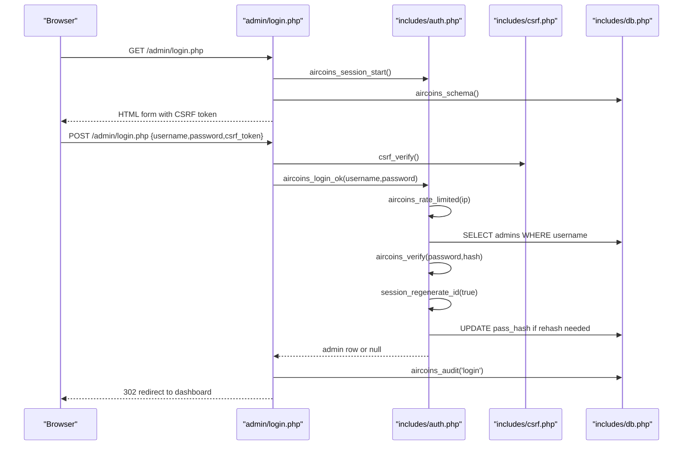

**Diagram sources**
- [admin/login.php:37-61](file://admin/login.php#L37-L61)
- [includes/csrf.php:48-67](file://includes/csrf.php#L48-L67)
- [includes/auth.php:151-190](file://includes/auth.php#L151-L190)
- [includes/db.php:56-150](file://includes/db.php#L56-L150)

## Detailed Component Analysis

### Secure HTTPS-Only Admin Interface and Session Management
- The admin session cookie is configured with:
  - Path set to `/` so it is shared across admin and API paths.
  - HttpOnly enabled to prevent JavaScript access.
  - SameSite=Strict to mitigate cross-site request forgery.
  - Secure flag set only when the request arrives over HTTPS.
- Idle timeout: sessions expire after a configurable period of inactivity, forcing re-authentication.
- Session regeneration occurs on successful login to prevent fixation attacks.

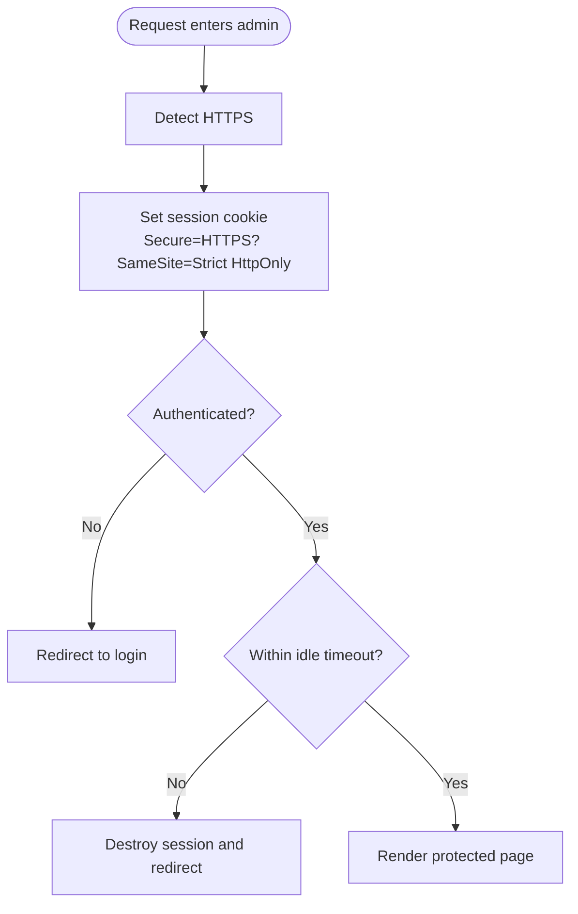

**Diagram sources**
- [includes/auth.php:65-83](file://includes/auth.php#L65-L83)
- [includes/auth.php:202-231](file://includes/auth.php#L202-L231)

**Section sources**
- [includes/auth.php:65-83](file://includes/auth.php#L65-L83)
- [includes/auth.php:202-231](file://includes/auth.php#L202-L231)
- [includes/config.php:25-33](file://includes/config.php#L25-L33)

### CSRF Protection Implementation
- Each session holds a single random CSRF token generated from cryptographically secure random bytes.
- Forms include a hidden field containing the token.
- State-changing POST endpoints verify the token using a timing-safe comparison.
- Non-POST requests bypass verification, allowing safe inclusion of CSRF checks at the top of endpoints.
- All administrative operations including device and router management are protected.

```mermaid
sequenceDiagram
participant Browser as "Browser"
participant Form as "Form Page"
participant Endpoint as "State-Changing Endpoint"
participant Csrf as "CSRF Module"
Browser->>Form : GET page
Form->>Csrf : csrf_field()
Csrf-->>Form : Hidden <input name="csrf_token">
Browser->>Endpoint : POST {csrf_token}
Endpoint->>Csrf : csrf_verify()
Csrf-->>Endpoint : OK or 403
```

**Diagram sources**
- [includes/csrf.php:21-40](file://includes/csrf.php#L21-L40)
- [includes/csrf.php:48-67](file://includes/csrf.php#L48-L67)

**Section sources**
- [includes/csrf.php:1-68](file://includes/csrf.php#L1-L68)
- [admin/login.php:37-39](file://admin/login.php#L37-L39)
- [admin/logout.php:21-27](file://admin/logout.php#L21-L27)
- [admin/devices.php:34-35](file://admin/devices.php#L34-L35)
- [admin/routers.php:47-48](file://admin/routers.php#L47-L48)

### Rate Limiting and Brute Force Prevention
- Failed login attempts are tracked per client IP in a dedicated table.
- Before authenticating, the system checks whether the IP has exceeded the maximum number of failures within a time window.
- On successful login, the failure counter for the IP is cleared.
- Default settings allow a limited number of attempts within a short window to reduce brute-force risk.

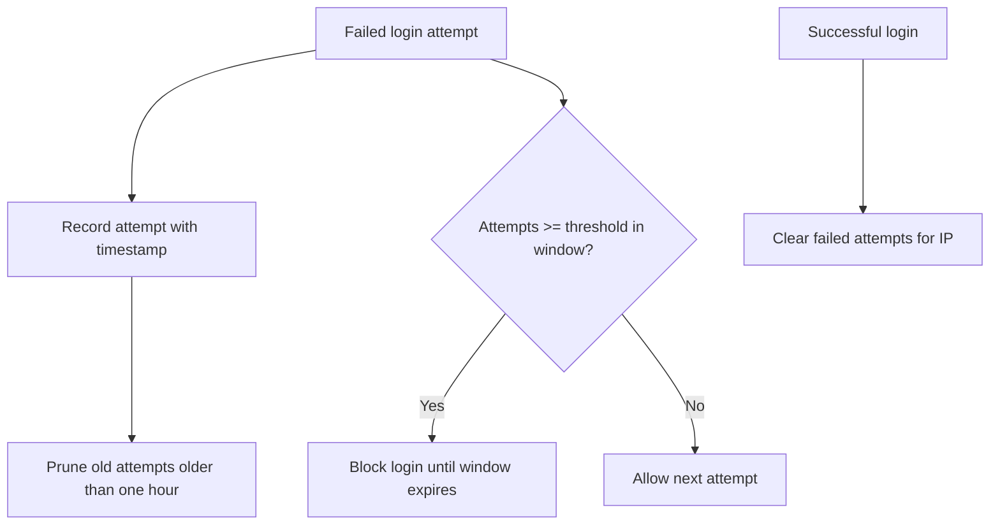

**Diagram sources**
- [includes/auth.php:103-138](file://includes/auth.php#L103-L138)
- [includes/auth.php:151-190](file://includes/auth.php#L151-L190)
- [includes/db.php:84-116](file://includes/db.php#L84-L116)

**Section sources**
- [includes/auth.php:96-138](file://includes/auth.php#L96-L138)
- [includes/auth.php:151-190](file://includes/auth.php#L151-L190)
- [includes/config.php:35-43](file://includes/config.php#L35-L43)

### Audit Logging System
- Every login and logout action is audited with the acting admin ID, action type, optional detail, client IP, and timestamp.
- Device management operations (sync, add, edit, delete, kick) are comprehensively logged.
- Router management operations (add, edit, delete, test) are fully audited.
- Audit entries are written to a dedicated table with detailed context information.
- Logout auditing is best-effort; failures do not block sign-out.

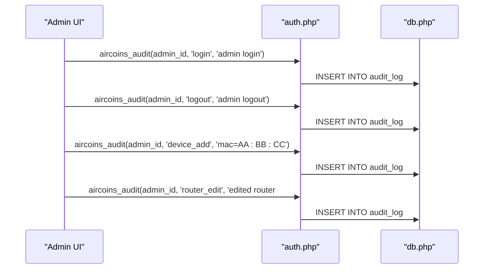

**Diagram sources**
- [includes/auth.php:269-281](file://includes/auth.php#L269-L281)
- [admin/login.php:46-50](file://admin/login.php#L46-L50)
- [admin/logout.php:29-37](file://admin/logout.php#L29-L37)
- [admin/devices.php:118-201](file://admin/devices.php#L118-L201)
- [admin/routers.php:107-211](file://admin/routers.php#L107-L211)

**Section sources**
- [includes/auth.php:269-281](file://includes/auth.php#L269-L281)
- [admin/login.php:46-50](file://admin/login.php#L46-L50)
- [admin/logout.php:29-37](file://admin/logout.php#L29-L37)
- [admin/devices.php:118-201](file://admin/devices.php#L118-L201)
- [admin/routers.php:107-211](file://admin/routers.php#L107-L211)

### Password Hashing with Argon2id and Secure Verification
- Password hashing prefers Argon2id when available and falls back to bcrypt otherwise.
- Verification uses constant-time comparison via the standard library.
- After successful verification, hashes are automatically migrated to the stronger algorithm when needed.

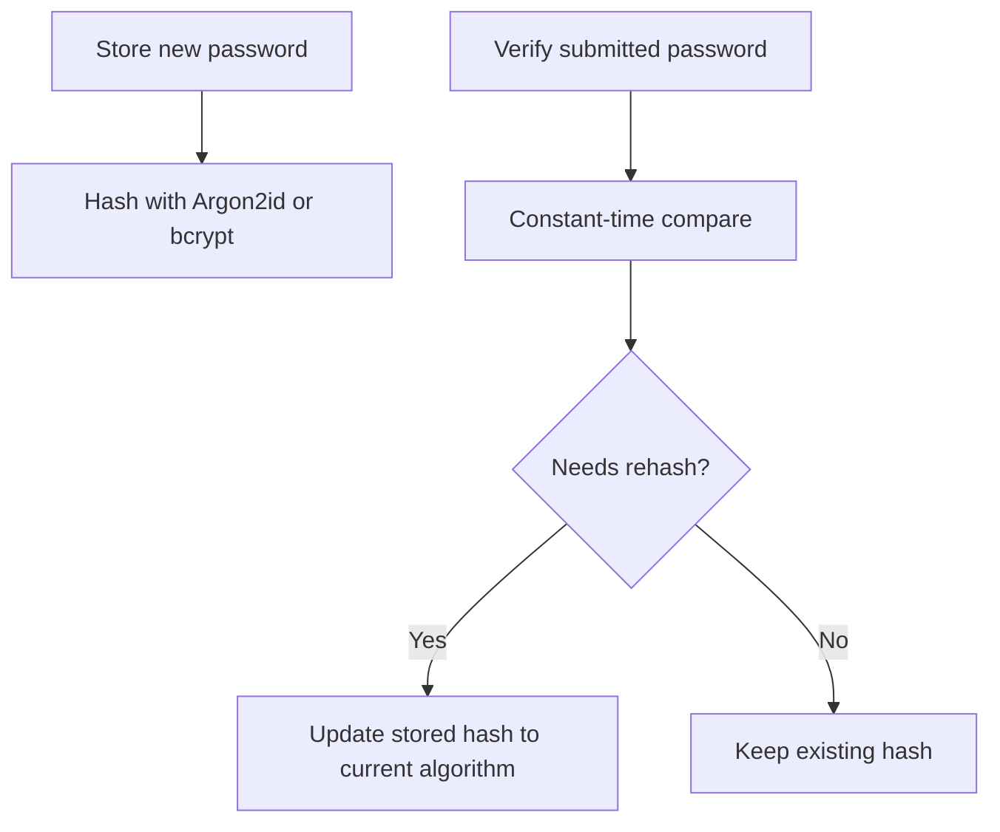

**Diagram sources**
- [includes/auth.php:17-57](file://includes/auth.php#L17-L57)
- [includes/auth.php:168-174](file://includes/auth.php#L168-L174)

**Section sources**
- [includes/auth.php:17-57](file://includes/auth.php#L17-L57)
- [includes/auth.php:168-174](file://includes/auth.php#L168-L174)

### Secure Logout Procedures
- Logout is restricted to POST requests carrying a valid CSRF token.
- Non-POST requests are redirected without modifying the session, preventing logout-CSRF.
- On successful logout, the session is destroyed, its cookie is cleared, and the operator is redirected to the login page.
- Logout auditing is performed when possible and does not block sign-out on errors.

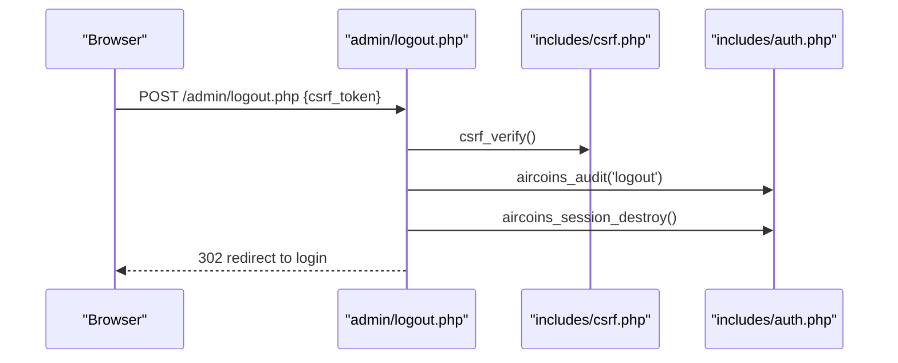

**Diagram sources**
- [admin/logout.php:21-42](file://admin/logout.php#L21-L42)
- [includes/csrf.php:48-67](file://includes/csrf.php#L48-L67)
- [includes/auth.php:236-246](file://includes/auth.php#L236-L246)

**Section sources**
- [admin/logout.php:1-43](file://admin/logout.php#L1-L43)
- [includes/auth.php:236-246](file://includes/auth.php#L236-L246)

### Administrative Interface Access Controls
- Protected pages call into an authentication guard that:
  - Starts the hardened session.
  - Checks for an active admin session.
  - Enforces idle timeout and redirects to login if expired.
  - Reloads the admin record from the database to ensure validity.
- The dashboard requires authentication before rendering any content.

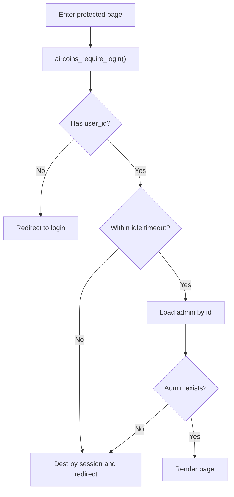

**Diagram sources**
- [includes/auth.php:202-231](file://includes/auth.php#L202-L231)
- [admin/index.php:17-17](file://admin/index.php#L17-L17)

**Section sources**
- [includes/auth.php:202-231](file://includes/auth.php#L202-L231)
- [admin/index.php:17-17](file://admin/index.php#L17-L17)

### Encryption for Router Credentials
- Router passwords are stored encrypted at rest using libsodium's XSalsa20-Poly1305 secret box.
- The 32-byte key is loaded from a file outside the web root and cached during the request.
- Plaintext values are never persisted; decryption occurs only in memory for the duration of a request.

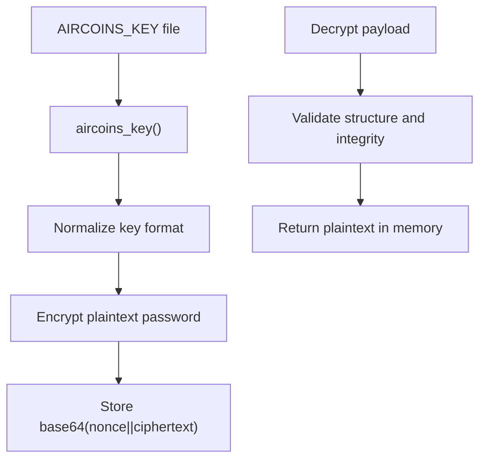

**Diagram sources**
- [includes/crypto.php:25-47](file://includes/crypto.php#L25-L47)
- [includes/crypto.php:91-102](file://includes/crypto.php#L91-L102)
- [includes/crypto.php:111-137](file://includes/crypto.php#L111-L137)

**Section sources**
- [includes/crypto.php:1-138](file://includes/crypto.php#L1-L138)
- [includes/config.php:20-23](file://includes/config.php#L20-L23)

### Portal-Facing Session Lookup API
- This endpoint is intentionally unauthenticated and read-only.
- It accepts a normalized MAC address and returns live hotspot session data if found.
- CORS is opened for this endpoint only; stack traces are suppressed.
- Input validation ensures malformed MAC addresses return a controlled error response.

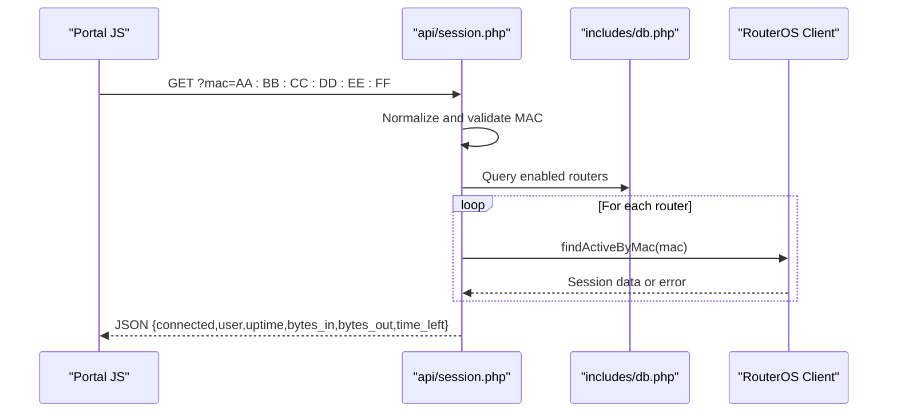

**Diagram sources**
- [api/session.php:50-106](file://api/session.php#L50-L106)
- [includes/db.php:56-150](file://includes/db.php#L56-L150)

**Section sources**
- [api/session.php:1-123](file://api/session.php#L1-L123)

## Device Management Security

### Comprehensive Input Validation
- All device management operations implement strict input validation and sanitization.
- MAC addresses are validated and normalized to uppercase format.
- Status values are restricted to predefined enums ('active', 'expired', 'blocked').
- Numeric IDs are validated to prevent injection attacks.
- Hostnames and IP addresses are trimmed and sanitized.

### CSRF Protection for Device Operations
- All device management forms include CSRF tokens.
- POST operations (sync, add, edit, delete, kick) require valid CSRF tokens.
- CSRF verification prevents unauthorized device modifications.

### Detailed Audit Logging
- Device synchronization operations are logged with router ID and count of synced devices.
- Manual device additions are logged with MAC address details.
- Device edits are logged with device ID and modification details.
- Device deletions are logged with device ID and MAC address.
- Session kick operations are logged with router ID, session ID, and MAC address.

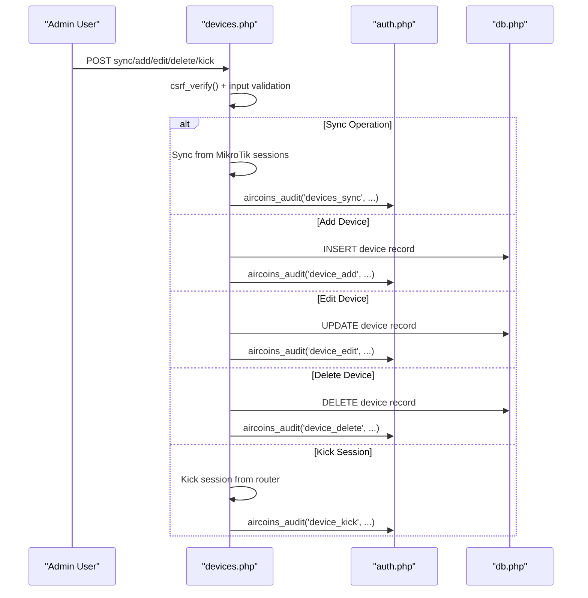

**Diagram sources**
- [admin/devices.php:34-236](file://admin/devices.php#L34-L236)
- [admin/devices.php:118-201](file://admin/devices.php#L118-L201)

**Section sources**
- [admin/devices.php:1-537](file://admin/devices.php#L1-L537)

## Router Management Security

### Encrypted Credential Storage
- Router passwords are encrypted using libsodium before storage.
- Decryption occurs only in memory during API operations.
- Password fields are never rendered back in forms during edit operations.
- Blank password fields during edit preserve existing encrypted credentials.

### Input Validation and Sanitization
- Router names, hosts, and usernames are trimmed and validated.
- API ports are validated to be within acceptable ranges (1-65535).
- API types are restricted to 'rest' or 'legacy'.
- TLS verification flags are properly handled.

### Comprehensive Audit Trail
- Router additions are logged with router ID, name, and API type.
- Router edits are logged with router ID and modification details.
- Router deletions are logged with router ID and name.
- Connection tests are logged with success/failure status and error details.

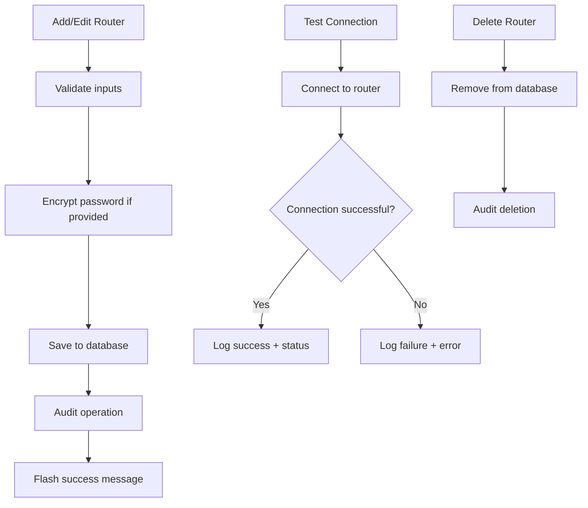

**Diagram sources**
- [admin/routers.php:143-223](file://admin/routers.php#L143-L223)
- [admin/routers.php:107-211](file://admin/routers.php#L107-L211)

**Section sources**
- [admin/routers.php:1-455](file://admin/routers.php#L1-L455)

## Dependency Analysis
The security subsystem exhibits clear separation of concerns:

- `admin/login.php` depends on helpers, auth, and csrf modules.
- `admin/logout.php` depends on helpers, auth, and csrf modules.
- `admin/index.php` depends on db and layout modules and enforces authentication via auth.
- `admin/devices.php` depends on db, crypto, csrf, layout, and router factory modules.
- `admin/routers.php` depends on db, crypto, csrf, layout, and router factory modules.
- `includes/auth.php` depends on config and db modules.
- `includes/csrf.php` depends on config, helpers, and auth modules.
- `includes/crypto.php` depends on config module.
- `api/session.php` depends on helpers, db, and router factory.

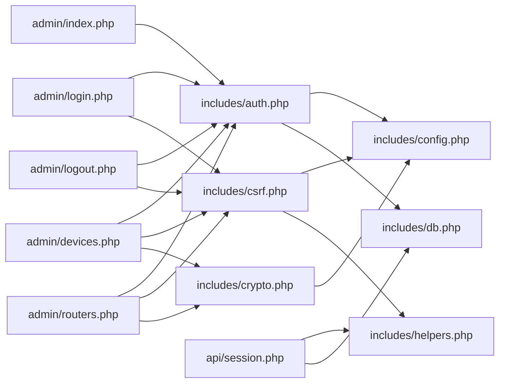

**Diagram sources**
- [admin/login.php:14-18](file://admin/login.php#L14-L18)
- [admin/logout.php:15-19](file://admin/logout.php#L15-L19)
- [admin/index.php:14-17](file://admin/index.php#L14-L17)
- [admin/devices.php:11-15](file://admin/devices.php#L11-L15)
- [admin/routers.php:17-21](file://admin/routers.php#L17-L21)
- [includes/auth.php:14-15](file://includes/auth.php#L14-L15)
- [includes/csrf.php:12-14](file://includes/csrf.php#L12-L14)
- [includes/crypto.php:15-15](file://includes/crypto.php#L15-L15)
- [api/session.php:23-25](file://api/session.php#L23-L25)

**Section sources**
- [admin/login.php:14-18](file://admin/login.php#L14-L18)
- [admin/logout.php:15-19](file://admin/logout.php#L15-L19)
- [admin/index.php:14-17](file://admin/index.php#L14-L17)
- [admin/devices.php:11-15](file://admin/devices.php#L11-L15)
- [admin/routers.php:17-21](file://admin/routers.php#L17-L21)
- [includes/auth.php:14-15](file://includes/auth.php#L14-L15)
- [includes/csrf.php:12-14](file://includes/csrf.php#L12-L14)
- [includes/crypto.php:15-15](file://includes/crypto.php#L15-L15)
- [api/session.php:23-25](file://api/session.php#L23-L25)

## Performance Considerations
- Database performance:
  - SQLite WAL mode improves concurrency.
  - Busy timeout reduces contention under load.
  - Indexes on login attempts, monitor samples, and devices optimize queries.
- Session handling:
  - Session regeneration on login prevents fixation attacks with minimal overhead.
  - Idle timeout avoids long-lived sessions unnecessarily.
- CSRF and rate limiting:
  - Token generation uses secure random bytes once per session.
  - Rate limiting queries are indexed and pruned regularly to avoid table growth.
- Device management:
  - Batch operations minimize database round-trips during sync operations.
  - Efficient MAC address lookups using indexed columns.

[No sources needed since this section provides general guidance]

## Troubleshooting Guide

Common authentication and security issues:

- Cannot access admin pages:
  - Ensure the session is started and the admin is authenticated.
  - Check for idle timeout redirection; look for the timeout notice parameter.
  - Verify that the session cookie is present and matches the expected name.

- Repeatedly locked out:
  - Review the failed login attempts table for the client IP.
  - Confirm the rate limit thresholds and window settings.
  - Wait for the window to expire or clear the attempts for the IP after a successful login.

- CSRF validation failures:
  - Ensure forms include the hidden CSRF token field.
  - Verify that the session is active before verifying the token.
  - Check that POST requests are used for state-changing operations.

- Logout not working:
  - Confirm logout is triggered via POST with a valid CSRF token.
  - Verify that the session is destroyed and the cookie is cleared.
  - Ensure the redirect goes to the login page.

- HTTPS-related cookie issues:
  - Confirm the server terminates TLS and sets the Secure flag appropriately.
  - Check browser behavior regarding SameSite=Strict cookies.

- Audit logs missing:
  - Verify that audit writes succeed and the table exists.
  - Ensure the admin ID is present for logged-in users.
  - Check device and router management audit entries.

- Router credential decryption errors:
  - Confirm the key file exists and is readable.
  - Validate the key format (raw 32 bytes, hex, or base64).
  - Check for tampered or malformed encrypted payloads.

- Device management issues:
  - Verify CSRF tokens are included in all device management forms.
  - Check input validation for MAC addresses and status values.
  - Review audit logs for device operations to identify unauthorized changes.

- Router management problems:
  - Ensure router passwords are properly encrypted.
  - Verify API connection settings and credentials.
  - Check audit logs for router operations and connection test results.

**Section sources**
- [admin/login.php:33-35](file://admin/login.php#L33-L35)
- [admin/login.php:54-60](file://admin/login.php#L54-L60)
- [includes/csrf.php:48-67](file://includes/csrf.php#L48-L67)
- [admin/logout.php:21-42](file://admin/logout.php#L21-L42)
- [includes/auth.php:236-246](file://includes/auth.php#L236-L246)
- [includes/crypto.php:25-47](file://includes/crypto.php#L25-L47)
- [includes/crypto.php:111-137](file://includes/crypto.php#L111-L137)
- [admin/devices.php:118-201](file://admin/devices.php#L118-L201)
- [admin/routers.php:107-211](file://admin/routers.php#L107-L211)

## Conclusion
The administrative panel implements a robust security model centered on hardened sessions, comprehensive CSRF protection, input validation, rate limiting, detailed audit logging, strong password hashing, and encrypted storage of sensitive credentials. The enhanced security implementation now includes complete protection for device and router management operations with full audit trails. By following the documented controls and guidelines, operators can maintain a secure admin interface and mitigate common attack vectors such as CSRF, brute force, session fixation, and credential exposure. The comprehensive audit logging system provides complete visibility into all administrative actions, enabling effective security monitoring and incident response.

[No sources needed since this section summarizes without analyzing specific files]