# Captive Portal Interface

<cite>
**Referenced Files in This Document**
- [login.html](file://hotspot/login.html)
- [varbridge.js](file://hotspot/js/varbridge.js)
- [core.js](file://hotspot/assets/js/core.js)
- [config.js](file://hotspot/assets/js/config.js)
- [JuanFi.css](file://hotspot/assets/css/JuanFi.css)
- [style.css](file://hotspot/css/style.css)
- [WISPAccessGatewayParam.xsd](file://hotspot/xml/WISPAccessGatewayParam.xsd)
- [login.xml](file://hotspot/xml/login.html)
</cite>

## Table of Contents
1. [Introduction](#introduction)
2. [Project Structure](#project-structure)
3. [Core Components](#core-components)
4. [Architecture Overview](#architecture-overview)
5. [Detailed Component Analysis](#detailed-component-analysis)
6. [Dependency Analysis](#dependency-analysis)
7. [Performance Considerations](#performance-considerations)
8. [Troubleshooting Guide](#troubleshooting-guide)
9. [Conclusion](#conclusion)
10. [Appendices](#appendices)

## Introduction
This document explains the captive portal interface that customers use to connect to the hotspot. The portal is a pure HTML/CSS/JavaScript page with Bootstrap UI components, jQuery interactions, and optional QR code generation. It supports:

- Voucher entry and submission
- Optional member login
- QR-based voucher purchase flow
- Coin insertion simulation through an external vendor device
- Promotional rate display and charging station status
- E-load top-up workflow
- Dual-mode operation: router-native MikroTik serving or external SBC lighttpd serving

The documentation focuses on how the HTML structure, styling, and JavaScript work together, how the varbridge script enables external mode, and how customization can be applied safely without breaking dependencies.

## Project Structure
The captive portal lives under the hotspot directory and consists of:

- A customer-facing login page with embedded styles and modals
- A dual-mode bridge script for external deployment
- Core runtime logic for coin simulation, modal handling, and vendor API calls
- Configuration variables for multi-vendor setups and feature toggles
- Branding and theme CSS files
- Router XML templates used by MikroTik when served natively

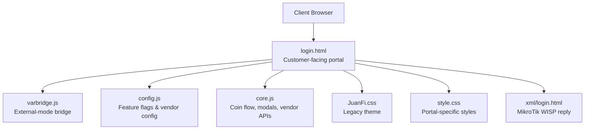

**Diagram sources**
- [login.html:1-20](file://hotspot/login.html#L1-L20)
- [varbridge.js:1-15](file://hotspot/js/varbridge.js#L1-L15)
- [config.js:1-63](file://hotspot/assets/js/config.js#L1-L63)
- [core.js:1-30](file://hotspot/assets/js/core.js#L1-L30)
- [JuanFi.css:1-20](file://hotspot/assets/css/JuanFi.css#L1-L20)
- [login.xml:1-23](file://hotspot/xml/login.html#L1-L23)

**Section sources**
- [login.html:1-20](file://hotspot/login.html#L1-L20)
- [varbridge.js:1-15](file://hotspot/js/varbridge.js#L1-L15)
- [config.js:1-63](file://hotspot/assets/js/config.js#L1-L63)
- [core.js:1-30](file://hotspot/assets/js/core.js#L1-L30)
- [JuanFi.css:1-20](file://hotspot/assets/css/JuanFi.css#L1-L20)
- [login.xml:1-23](file://hotspot/xml/login.html#L1-L23)

## Core Components
- Customer-facing login page: Provides the visible UI including banner, status area, timer, voucher input, action buttons, modals, and footer.
- External-mode bridge: Detects whether the page is served by the router or externally, exposes window.PORTAL helpers, and patches literal tokens into the DOM.
- Core runtime: Handles coin insertion simulation, modal flows, promotional rates, charging stations, e-load, error notifications, and storage utilities.
- Configuration: Feature toggles, multi-vendor mapping, default vendor IP, and behavior flags.
- Styling: Legacy theme (JuanFi.css) and portal-specific styles (embedded in login.html and style.css).

Key responsibilities:
- Voucher entry and submission path
- QR code generation for voucher purchase
- Status display and timer updates
- Integration with external vendor endpoints for coin simulation and services
- Safe customization via CSS classes and configuration variables

**Section sources**
- [login.html:347-500](file://hotspot/login.html#L347-L500)
- [varbridge.js:16-103](file://hotspot/js/varbridge.js#L16-L103)
- [core.js:30-211](file://hotspot/assets/js/core.js#L30-L211)
- [config.js:1-63](file://hotspot/assets/js/config.js#L1-L63)

## Architecture Overview
The portal operates in two modes:

- Router-native mode: MikroTik serves the HTML and substitutes $(var) tokens before delivery. The varbridge script detects no external parameters and remains a no-op.
- External mode: An SBC running lighttpd serves the same HTML file. Literal $(mac), $(ip), etc., remain in the DOM. varbridge detects this condition, publishes window.PORTAL, and patches the DOM so the page renders correctly.

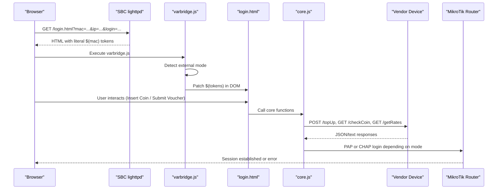

**Diagram sources**
- [login.html:349-416](file://hotspot/login.html#L349-L416)
- [varbridge.js:41-103](file://hotspot/js/varbridge.js#L41-L103)
- [core.js:490-549](file://hotspot/assets/js/core.js#L490-L549)

**Section sources**
- [login.html:349-416](file://hotspot/login.html#L349-L416)
- [varbridge.js:41-103](file://hotspot/js/varbridge.js#L41-L103)
- [core.js:490-549](file://hotspot/assets/js/core.js#L490-L549)

## Detailed Component Analysis

### Customer-Facing Login Page
The login page defines the user experience:

- Banner image placeholder
- Connection status indicator
- MAC/IP info line
- Coins and points display
- Timer showing days/hours/minutes/seconds
- Error message block
- Vendo selection dropdown (populated dynamically)
- Action buttons: Insert Coin, Pause, WiFi Rates, Charging Station, E-Load
- Voucher input field and submit button
- Member login link and QR purchase link
- Footer branding
- Chat bubble link
- Multiple Bootstrap modals for insert coin, promo rates, charging station, e-load, QR purchase, and member login
- Loading overlay spinner

Customization approach:
- Use .piso-* prefixed classes to avoid conflicts with Bootstrap
- Replace the banner image source
- Edit modal content directly in the HTML
- Adjust colors via CSS variables defined inline

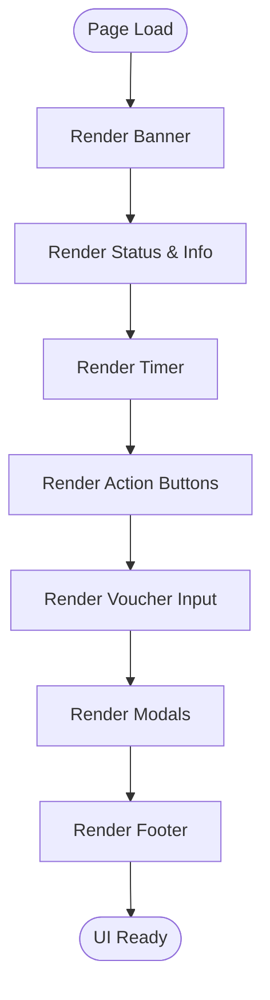

[No sources needed since this diagram shows conceptual workflow, not actual code structure]

**Section sources**
- [login.html:437-500](file://hotspot/login.html#L437-L500)
- [login.html:510-738](file://hotspot/login.html#L510-L738)
- [login.html:740-770](file://hotspot/login.html#L740-L770)

### Voucher Entry Mechanism
Voucher entry supports both router-native and external modes:

- In external mode, the login function builds a real form submission to the router’s login URL using the vendor-provided login parameter. It sets username/password to the voucher value and disables popup navigation.
- In router-native mode, it computes the CHAP challenge response based on the configured login option and submits the hidden form.

Behavioral features:
- Optional automatic population of the voucher field from stored data
- Optional MAC-as-voucher-code behavior
- Local storage persistence of active voucher and validity windows

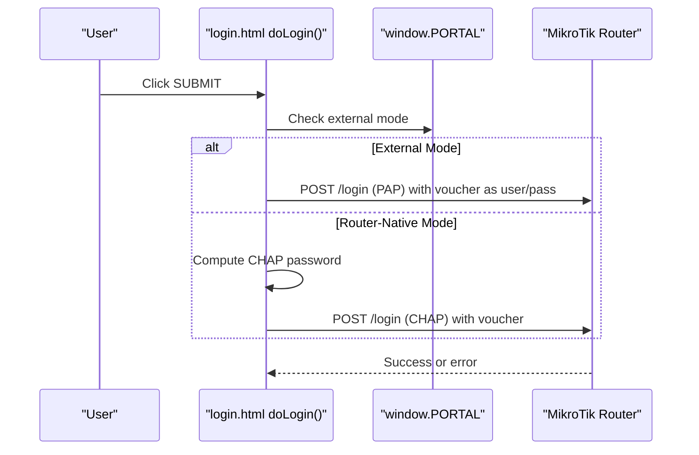

**Diagram sources**
- [login.html:365-416](file://hotspot/login.html#L365-L416)

**Section sources**
- [login.html:349-416](file://hotspot/login.html#L349-L416)
- [core.js:19-27](file://hotspot/assets/js/core.js#L19-L27)
- [config.js:37-63](file://hotspot/assets/js/config.js#L37-L63)

### QR Code Support
QR code support allows users to present a QR code to a vendo owner for voucher purchase:

- The QR payload includes a custom scheme with mac and ip parameters
- When the QR modal opens, the page polls a data endpoint for approval
- On success, a toast notification appears and auto-login is triggered after a delay

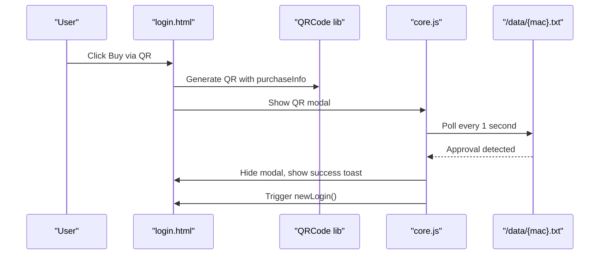

**Diagram sources**
- [login.html:767-770](file://hotspot/login.html#L767-L770)
- [core.js:304-329](file://hotspot/assets/js/core.js#L304-L329)

**Section sources**
- [login.html:767-770](file://hotspot/login.html#L767-L770)
- [core.js:304-329](file://hotspot/assets/js/core.js#L304-L329)

### Status Display Functionality
Status display includes:

- Connection status text with disconnected/connected color states
- MAC/IP info line
- Coins and points counters
- Timer showing remaining session time
- Error messages rendered conditionally

Runtime updates are driven by core.js and vendor responses. The timer formatting utility converts seconds into days/hours/minutes/seconds.

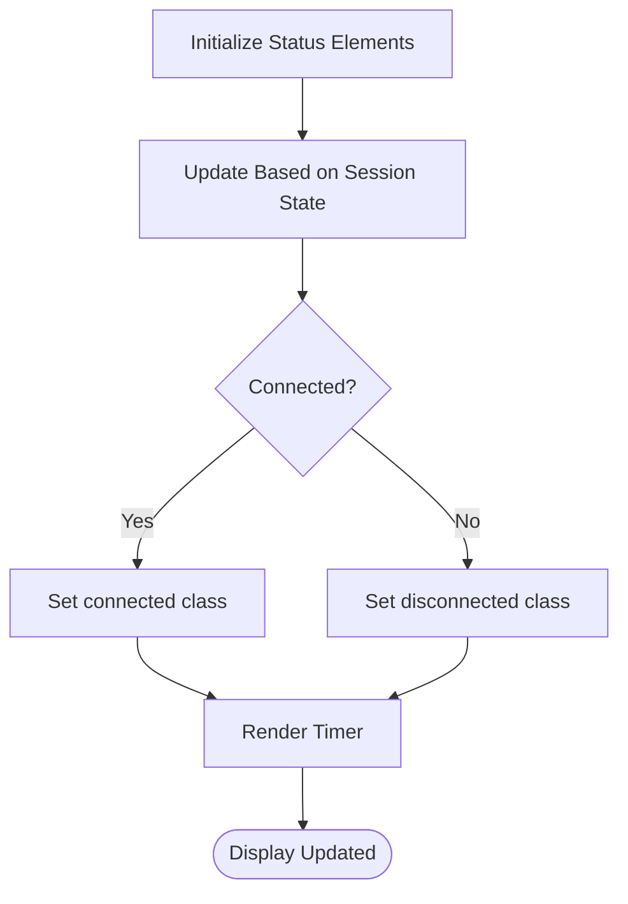

**Diagram sources**
- [login.html:448-466](file://hotspot/login.html#L448-L466)
- [core.js:817-829](file://hotspot/assets/js/core.js#L817-L829)

**Section sources**
- [login.html:448-466](file://hotspot/login.html#L448-L466)
- [core.js:817-829](file://hotspot/assets/js/core.js#L817-L829)

### varbridge.js Script
The varbridge script provides dual-mode support:

- Parses query parameters
- Detects external mode via presence of login param or literal $(mac)/(link-login-only) tokens
- Publishes window.PORTAL with helpers for statusUrl and loginUrl
- Patches the DOM to replace literal tokens and conditional markers
- Safely handles errors without breaking the page

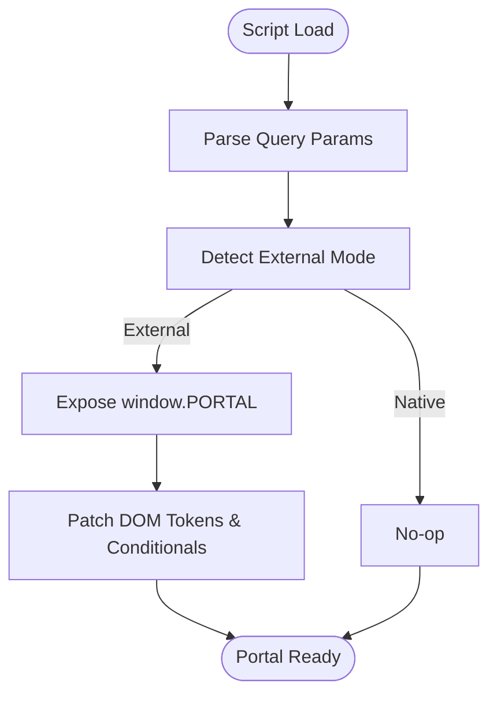

**Diagram sources**
- [varbridge.js:16-103](file://hotspot/js/varbridge.js#L16-L103)
- [varbridge.js:109-236](file://hotspot/js/varbridge.js#L109-L236)

**Section sources**
- [varbridge.js:16-103](file://hotspot/js/varbridge.js#L16-L103)
- [varbridge.js:109-236](file://hotspot/js/varbridge.js#L109-L236)

### JuanFi Assets Integration
JuanFi assets provide the legacy theme and UI elements:

- Background and container styling
- Status indicators and blinking animations
- Modal content styling
- Vendo selection styling
- Rate display containers and typography

The portal also uses modern .piso-* classes for its primary design, while JuanFi.css remains compatible with existing modal markup.

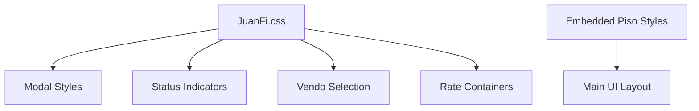

**Diagram sources**
- [JuanFi.css:1-20](file://hotspot/assets/css/JuanFi.css#L1-L20)
- [JuanFi.css:148-227](file://hotspot/assets/css/JuanFi.css#L148-L227)
- [login.html:21-344](file://hotspot/login.html#L21-L344)

**Section sources**
- [JuanFi.css:1-20](file://hotspot/assets/css/JuanFi.css#L1-L20)
- [JuanFi.css:148-227](file://hotspot/assets/css/JuanFi.css#L148-L227)
- [login.html:21-344](file://hotspot/login.html#L21-L344)

### Coin Insertion Simulation Flow
The coin insertion simulation integrates with an external vendor device:

- User clicks Insert Coin
- core.js calls vendor /topUp to initiate a session
- The insert coin modal opens with progress bar and generated voucher
- core.js polls vendor /checkCoin to track inserted coins and time added
- On success, the voucher is saved and auto-login occurs; on failure, error toasts are shown
- For charging station mode, the flow triggers charging station operations instead of internet login

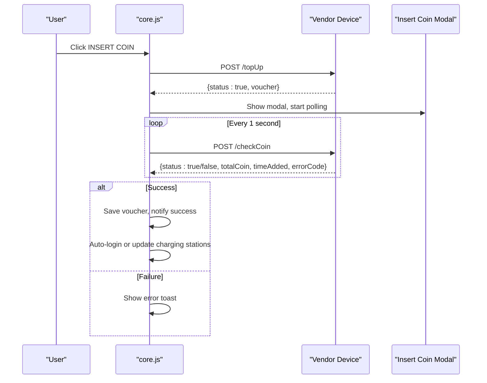

**Diagram sources**
- [core.js:264-298](file://hotspot/assets/js/core.js#L264-L298)
- [core.js:490-549](file://hotspot/assets/js/core.js#L490-L549)
- [core.js:633-761](file://hotspot/assets/js/core.js#L633-L761)

**Section sources**
- [core.js:264-298](file://hotspot/assets/js/core.js#L264-L298)
- [core.js:490-549](file://hotspot/assets/js/core.js#L490-L549)
- [core.js:633-761](file://hotspot/assets/js/core.js#L633-L761)

### Promotional Rate Displays
Promotional rates are fetched from the vendor device and displayed in the promo rates modal:

- The modal populates rows containing rate name, validity, and optional data allowance
- Rate type selection switches between Internet and Charging
- Errors trigger retry logic up to a limit

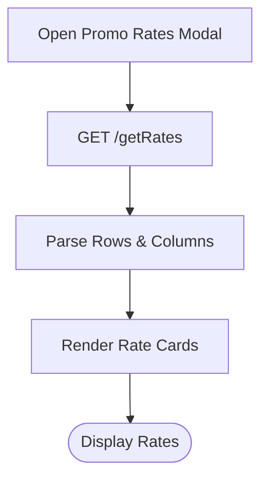

**Diagram sources**
- [core.js:331-370](file://hotspot/assets/js/core.js#L331-L370)

**Section sources**
- [core.js:331-370](file://hotspot/assets/js/core.js#L331-L370)

### Charging Station Integration
Charging station integration displays available ports and their status:

- The modal lists charging stations with name, status, remaining time, and availability button
- A background timer refreshes port statuses and reveals availability buttons when free
- Selecting a port initiates a top-up flow similar to coin insertion

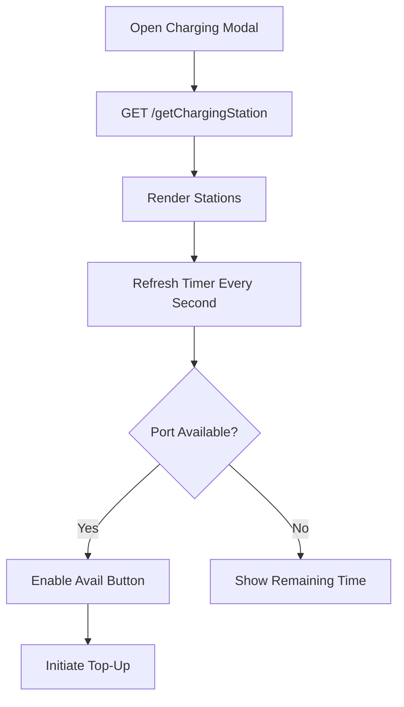

**Diagram sources**
- [core.js:376-447](file://hotspot/assets/js/core.js#L376-L447)
- [core.js:454-487](file://hotspot/assets/js/core.js#L454-L487)

**Section sources**
- [core.js:376-447](file://hotspot/assets/js/core.js#L376-L447)
- [core.js:454-487](file://hotspot/assets/js/core.js#L454-L487)

### E-Load Workflow
E-load functionality allows users to select mobile numbers and products:

- The modal collects mobile number and product details
- Prices are displayed and validated against inserted coins
- Processing involves vendor endpoints for rates, top-up, check coin, and processing

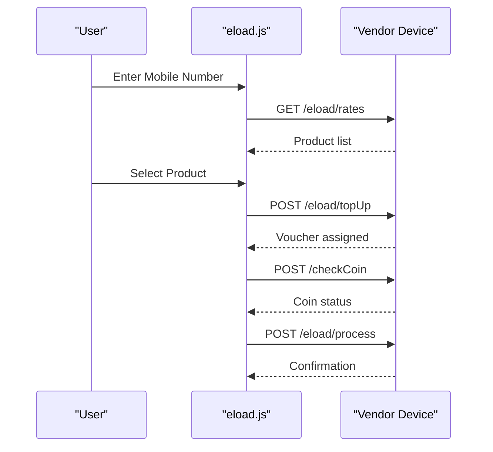

**Diagram sources**
- [eload.js:43-43](file://hotspot/assets/js/eload.js#L43-L43)
- [eload.js:130-130](file://hotspot/assets/js/eload.js#L130-L130)
- [eload.js:190-190](file://hotspot/assets/js/eload.js#L190-L190)
- [eload.js:280-280](file://hotspot/assets/js/eload.js#L280-L280)

**Section sources**
- [eload.js:43-43](file://hotspot/assets/js/eload.js#L43-L43)
- [eload.js:130-130](file://hotspot/assets/js/eload.js#L130-L130)
- [eload.js:190-190](file://hotspot/assets/js/eload.js#L190-L190)
- [eload.js:280-280](file://hotspot/assets/js/eload.js#L280-L280)

## Dependency Analysis
The portal depends on several libraries and scripts:

- Bootstrap CSS/JS for layout and modals
- jQuery for DOM manipulation and AJAX
- Toast library for notifications
- MD5 for CHAP password computation
- QRCode library for generating QR codes
- varbridge.js for external-mode token patching
- core.js for main runtime logic
- config.js for feature flags and vendor configuration
- JuanFi.css for legacy theme compatibility

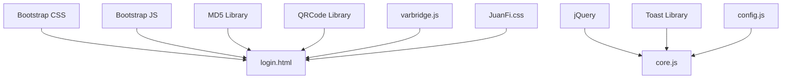

**Diagram sources**
- [login.html:6-19](file://hotspot/login.html#L6-L19)
- [login.html:747-752](file://hotspot/login.html#L747-L752)
- [core.js:1-30](file://hotspot/assets/js/core.js#L1-L30)
- [config.js:1-63](file://hotspot/assets/js/config.js#L1-L63)
- [JuanFi.css:1-20](file://hotspot/assets/css/JuanFi.css#L1-L20)

**Section sources**
- [login.html:6-19](file://hotspot/login.html#L6-L19)
- [login.html:747-752](file://hotspot/login.html#L747-L752)
- [core.js:1-30](file://hotspot/assets/js/core.js#L1-L30)
- [config.js:1-63](file://hotspot/assets/js/config.js#L1-L63)
- [JuanFi.css:1-20](file://hotspot/assets/css/JuanFi.css#L1-L20)

## Performance Considerations
- Avoid excessive DOM traversal in varbridge; it already limits scanning to text nodes and skips script/style parents.
- Debounce or throttle frequent vendor API calls if needed, especially during coin polling.
- Minimize repeated AJAX retries; current implementations cap retries to prevent infinite loops.
- Prefer CSS variables for theming changes to reduce reflows.
- Keep vendorIpAddress and multiVendoAddresses minimal to reduce configuration overhead.

[No sources needed since this section provides general guidance]

## Troubleshooting Guide
Common issues and resolutions:

- External mode not detected: Ensure URL contains login parameter or literal $(mac) tokens exist in served HTML. Verify varbridge loads before other scripts.
- Token substitution failures: Check that varbridge runs on DOMContentLoaded and that error blocks are handled gracefully.
- Vendor API unreachable: Confirm vendorIpAddress is correct and CORS is allowed for crossOrigin requests.
- Coin slot busy or expired: Review error codes and toast messages; ensure proper timeout handling and modal state cleanup.
- QR purchase not approving: Verify data endpoint returns expected format and polling interval is functioning.

**Section sources**
- [varbridge.js:142-163](file://hotspot/js/varbridge.js#L142-L163)
- [core.js:798-815](file://hotspot/assets/js/core.js#L798-L815)
- [core.js:633-761](file://hotspot/assets/js/core.js#L633-L761)

## Conclusion
The captive portal interface combines a clean customer-facing HTML/CSS/JavaScript implementation with robust integration points for external vendor devices. The varbridge script ensures seamless operation across router-native and external deployment modes. Customization is straightforward through CSS variables, modal editing, and configuration flags, while maintaining compatibility with underlying dependencies like Bootstrap, jQuery, and the vendor API contracts.

[No sources needed since this section summarizes without analyzing specific files]

## Appendices

### Customization Options
- Branding images: Replace the banner image source in the login page.
- Rates configuration: Modify config.js to enable/disable data rates and set default vendor IP.
- Modal content editing: Edit modal HTML sections directly in the login page.
- CSS styling approaches: Use .piso-* classes for primary styling and override JuanFi.css for legacy elements.

Examples:
- Change primary color: Update CSS variable --piso-primary in the embedded styles.
- Enable QR purchase: Set qrCodeVoucherPurchase to true in config.js.
- Toggle charging station: Set chargingEnable to true in config.js or per-vendo mapping.

**Section sources**
- [login.html:21-344](file://hotspot/login.html#L21-L344)
- [config.js:40-63](file://hotspot/assets/js/config.js#L40-L63)

### Router XML Templates
When served natively by MikroTik, the portal uses XML templates for authentication replies and error handling. These templates define response codes and messages based on RADIUS attributes and error conditions.

**Section sources**
- [login.xml:1-23](file://hotspot/xml/login.html#L1-L23)
- [WISPAccessGatewayParam.xsd:1-1](file://hotspot/xml/WISPAccessGatewayParam.xsd#L1-L1)