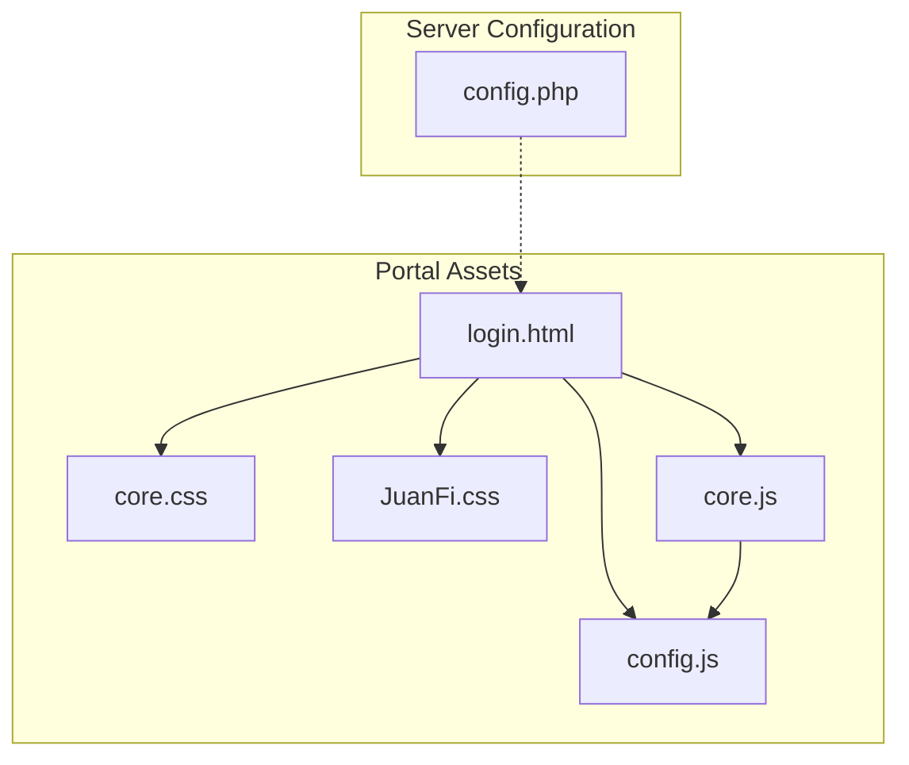
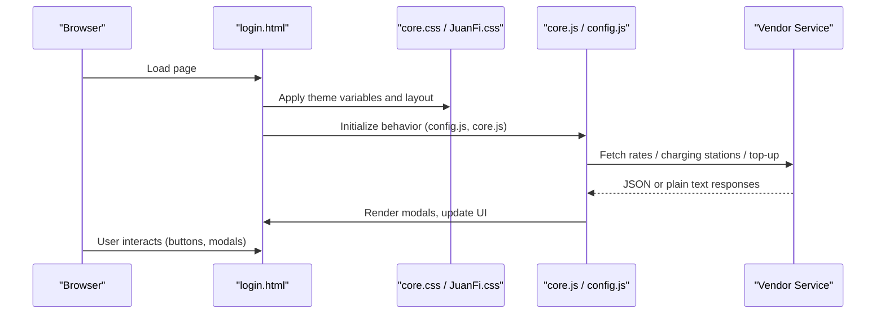
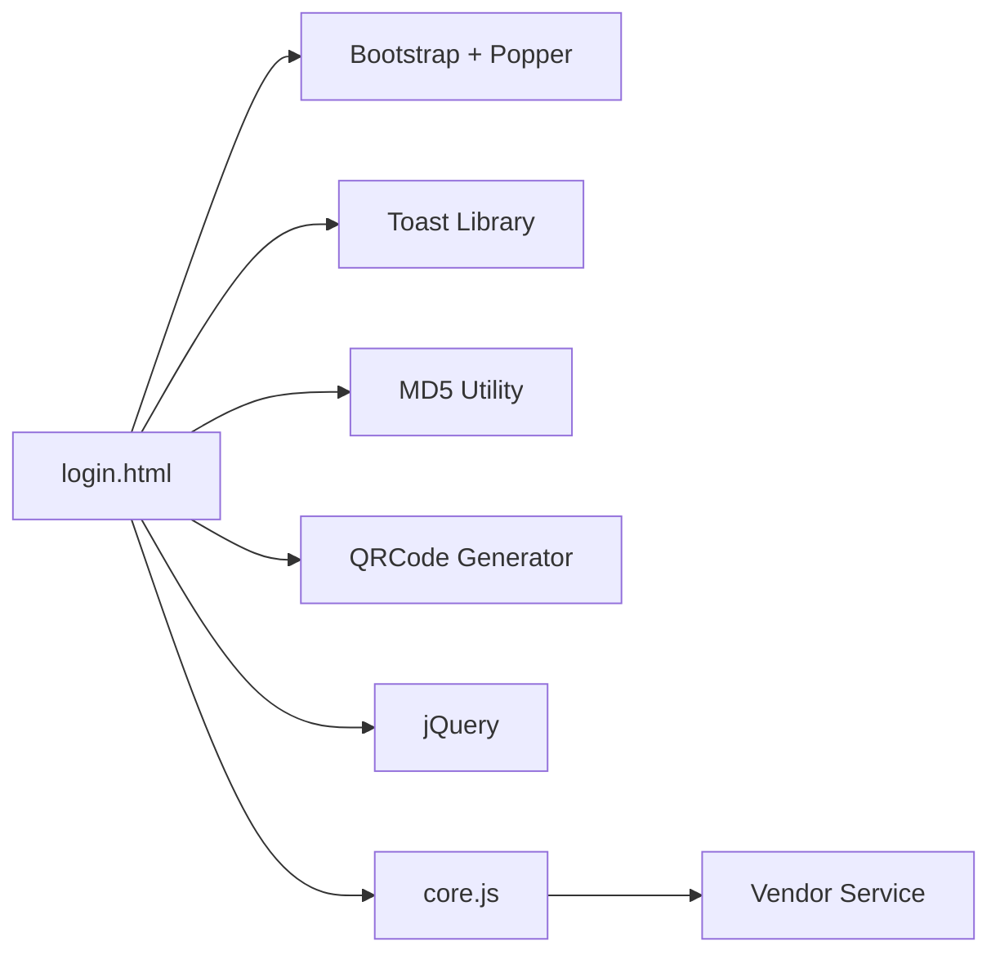

# Customization & Branding Guide

<cite>
**Referenced Files in This Document**
- [login.html](file://hotspot/login.html)
- [core.css](file://hotspot/assets/css/core.css)
- [JuanFi.css](file://hotspot/assets/css/JuanFi.css)
- [config.js](file://hotspot/assets/js/config.js)
- [core.js](file://hotspot/assets/js/core.js)
- [config.php](file://includes/config.php)
</cite>

## Table of Contents
1. [Introduction](#introduction)
2. [Project Structure](#project-structure)
3. [Core Components](#core-components)
4. [Architecture Overview](#architecture-overview)
5. [Detailed Component Analysis](#detailed-component-analysis)
6. [Dependency Analysis](#dependency-analysis)
7. [Performance Considerations](#performance-considerations)
8. [Troubleshooting Guide](#troubleshooting-guide)
9. [Conclusion](#conclusion)

## Introduction
This guide explains how to customize the portal’s branding and appearance, including CSS variables for theming, replacing images and logos, adjusting color schemes, updating layout elements, and configuring behavioral parameters. It also documents configuration options for rates, vendor settings, and runtime behavior, with examples for common customizations such as changing company colors, updating contact information, modifying modal content, and adapting the interface for different business models while maintaining compatibility with JavaScript dependencies.

## Project Structure
The captive portal is primarily composed of:
- HTML templates that define the user interface and modals
- CSS files that control visual styling and theme variables
- JavaScript files that configure behavior, render dynamic content, and communicate with backend services
- A PHP configuration file for server-side constants

**Diagram sources**
- [login.html:6-10](file://hotspot/login.html#L6-L10)
- [login.html:16-19](file://hotspot/login.html#L16-L19)
- [login.html:747-752](file://hotspot/login.html#L747-L752)
- [core.css:1-29](file://hotspot/assets/css/core.css#L1-L29)
- [JuanFi.css:1-324](file://hotspot/assets/css/JuanFi.css#L1-L324)
- [config.js:1-63](file://hotspot/assets/js/config.js#L1-L63)
- [config.php:1-44](file://includes/config.php#L1-L44)

**Section sources**
- [login.html:6-10](file://hotspot/login.html#L6-L10)
- [login.html:16-19](file://hotspot/login.html#L16-L19)
- [login.html:747-752](file://hotspot/login.html#L747-L752)
- [core.css:1-29](file://hotspot/assets/css/core.css#L1-L29)
- [JuanFi.css:1-324](file://hotspot/assets/css/JuanFi.css#L1-L324)
- [config.js:1-63](file://hotspot/assets/js/config.js#L1-L63)
- [config.php:1-44](file://includes/config.php#L1-L44)

## Core Components
- Visual theme and layout are defined by CSS variables and classes in the login template and stylesheets.
- Behavioral toggles (e.g., enabling/disabling features like charging, e-load, member login, pause time, data rates) are controlled via JavaScript configuration.
- Server-side constants (database path, session name, rate limits) are defined in a PHP configuration file.

Key customization areas:
- CSS variables for brand colors and UI tokens
- Banner image and loading animation assets
- Modal content and footer text
- Feature flags and vendor/rate behavior in config.js
- Server-side security and session settings in config.php

**Section sources**
- [login.html:21-35](file://hotspot/login.html#L21-L35)
- [login.html:438-500](file://hotspot/login.html#L438-L500)
- [login.html:510-738](file://hotspot/login.html#L510-L738)
- [core.css:1-29](file://hotspot/assets/css/core.css#L1-L29)
- [config.js:1-63](file://hotspot/assets/js/config.js#L1-L63)
- [config.php:1-44](file://includes/config.php#L1-L44)

## Architecture Overview
The portal loads Bootstrap and custom styles, then initializes behavior through core.js and config.js. The HTML defines static sections (banner, status, buttons, modals) and uses JS to populate dynamic content (rates, charging stations, QR codes). Vendor interactions occur over HTTP to configured endpoints.

**Diagram sources**
- [login.html:6-10](file://hotspot/login.html#L6-L10)
- [login.html:16-19](file://hotspot/login.html#L16-L19)
- [login.html:747-752](file://hotspot/login.html#L747-L752)
- [core.js:331-370](file://hotspot/assets/js/core.js#L331-L370)
- [core.js:376-426](file://hotspot/assets/js/core.js#L376-L426)
- [core.js:490-549](file://hotspot/assets/js/core.js#L490-L549)

## Detailed Component Analysis

### Theme and Appearance Customization
- CSS variables are defined in the login template’s style block and used throughout the UI for primary colors, backgrounds, cards, text, and muted tones.
- Override these variables to change the entire look-and-feel without editing many selectors.
- Additional legacy styles exist in JuanFi.css; avoid conflicts by using the .piso-* prefixed classes already present in the template.

Common changes:
- Change company colors by redefining the primary and danger variables.
- Adjust background and card colors to match your brand palette.
- Modify typography and spacing by editing the body and container rules.

Asset replacements:
- Replace the banner image referenced in the template to update the header graphic.
- Replace the loading animation SVG referenced by the spinner overlay.

Modal and footer updates:
- Edit modal titles, headings, and body content directly in the HTML to reflect your service names and instructions.
- Update the footer text to include your company name and copyright notice.

Compatibility notes:
- Keep Bootstrap and toast libraries intact.
- Preserve class names used by core.js (e.g., promoRatesModal, insertCoinModal, chargingModal, eloadModal, scanQrModal, memberModal) to ensure JS functionality remains intact.

**Section sources**
- [login.html:21-35](file://hotspot/login.html#L21-L35)
- [login.html:438-500](file://hotspot/login.html#L438-L500)
- [login.html:510-738](file://hotspot/login.html#L510-L738)
- [login.html:740-745](file://hotspot/login.html#L740-L745)
- [core.css:1-29](file://hotspot/assets/css/core.css#L1-L29)
- [JuanFi.css:1-324](file://hotspot/assets/css/JuanFi.css#L1-L324)

### Behavioral Configuration (config.js)
Use config.js to toggle features and set defaults:
- Multi-vendor setup: enable multi-vendo mode, choose selection strategy, and define vendor addresses with per-vendor feature flags.
- Login options: username-only vs username+password.
- Data rates display: show/hide data usage info in rates.
- Default vendor IP address.
- Charging station and e-load toggles.
- UI visibility flags: pause/logout button, member login, extend time button, voucher input disablement, MAC-as-voucher code, QR-based purchase.

Examples:
- Enable charging and e-load globally, or per vendor in the multi-vendor list.
- Hide the pause/logout button if you do not want users to manage sessions from the portal.
- Disable voucher input to force QR-based purchases only.

Behavioral flow highlights:
- When multi-vendor is enabled, core.js populates the vendor selector or auto-selects based on hotspot address or interface name.
- Buttons for charging and e-load are hidden when disabled in config.
- QR purchase link is shown when enabled.

**Section sources**
- [config.js:1-63](file://hotspot/assets/js/config.js#L1-L63)
- [core.js:75-117](file://hotspot/assets/js/core.js#L75-L117)
- [core.js:119-164](file://hotspot/assets/js/core.js#L119-L164)
- [core.js:139-147](file://hotspot/assets/js/core.js#L139-L147)

### Rates and Vendor Settings
Rates and charging stations are fetched from the configured vendor endpoint. The UI renders lists of rates and available charging ports.

Key behaviors:
- Rates are retrieved via an HTTP request to the vendor service and rendered into the promo rates modal.
- Charging stations are polled and updated with timers to reflect availability and remaining time.
- Error handling includes retries and toast notifications.

Customization tips:
- Ensure vendorIpAddress matches your deployment (or use multi-vendor mapping).
- If you disable data rates, the data column will be hidden in the rates view.

**Section sources**
- [core.js:331-370](file://hotspot/assets/js/core.js#L331-L370)
- [core.js:376-426](file://hotspot/assets/js/core.js#L376-L426)
- [core.js:449-452](file://hotspot/assets/js/core.js#L449-L452)

### Server-Side Configuration (config.php)
Server-side constants define database paths, encryption key location, admin session naming, idle timeout, and rate-limiting thresholds. These are guarded so they can be overridden before inclusion.

Operational considerations:
- Adjust session cookie name and idle timeout according to your security policy.
- Tune rate-limit window and maximum attempts to balance security and usability.

**Section sources**
- [config.php:1-44](file://includes/config.php#L1-L44)

### Common Customization Examples

#### Changing Company Colors
- Redefine the primary and danger CSS variables in the login template’s style block to match your brand colors.
- Verify that buttons, links, and status indicators adopt the new colors automatically due to variable usage.

**Section sources**
- [login.html:21-35](file://hotspot/login.html#L21-L35)

#### Updating Contact Information
- Edit the chat bubble link in the template to point to your support channel.
- Update the footer text to include your company name and legal notices.

**Section sources**
- [login.html:503-508](file://hotspot/login.html#L503-L508)
- [login.html:496-499](file://hotspot/login.html#L496-L499)

#### Modifying Modal Content
- Change modal titles and instructional text in the promo rates, charging, e-load, QR purchase, and member login modals.
- Keep modal IDs unchanged to preserve JS event bindings.

**Section sources**
- [login.html:510-738](file://hotspot/login.html#L510-L738)

#### Adapting for Different Business Models
- For voucher-only portals: disable member login and hide the member link.
- For QR-first flows: enable QR purchase and optionally disable voucher input.
- For multi-location deployments: enable multi-vendor mode and map vendors by hotspot address or interface name.

**Section sources**
- [config.js:1-63](file://hotspot/assets/js/config.js#L1-L63)
- [core.js:75-117](file://hotspot/assets/js/core.js#L75-L117)

## Dependency Analysis
The portal depends on:
- Bootstrap and Popper for layout and modals
- Toast library for notifications
- MD5 utility for challenge-response hashing
- QRCode generator for QR-based purchases
- jQuery for DOM manipulation and AJAX calls

These dependencies are loaded in the login template and must remain intact for the portal to function correctly.

**Diagram sources**
- [login.html:6-10](file://hotspot/login.html#L6-L10)
- [login.html:16-19](file://hotspot/login.html#L16-L19)
- [login.html:747-752](file://hotspot/login.html#L747-L752)
- [core.js:331-370](file://hotspot/assets/js/core.js#L331-L370)

**Section sources**
- [login.html:6-10](file://hotspot/login.html#L6-L10)
- [login.html:16-19](file://hotspot/login.html#L16-L19)
- [login.html:747-752](file://hotspot/login.html#L747-L752)

## Performance Considerations
- Prefer lightweight asset formats for banners and icons to reduce load times.
- Avoid excessive animations; keep fade-in effects minimal.
- Use CSS variables to minimize repeated color definitions and improve maintainability.
- Limit polling intervals for charging stations and rates to necessary frequencies.

[No sources needed since this section provides general guidance]

## Troubleshooting Guide
- Vendor connectivity issues:
  - Confirm vendorIpAddress or multi-vendor mappings are correct.
  - Check network reachability to the vendor service endpoints.
- Missing assets:
  - Ensure banner and loading SVG paths are correct and accessible.
- JS errors:
  - Verify all required scripts (Bootstrap, jQuery, toast, MD5, QRCode) are loaded.
  - Confirm modal IDs match those referenced by core.js.
- Rate rendering failures:
  - Inspect vendor response format and retry logic in core.js.

**Section sources**
- [core.js:331-370](file://hotspot/assets/js/core.js#L331-L370)
- [core.js:376-426](file://hotspot/assets/js/core.js#L376-L426)
- [login.html:740-745](file://hotspot/login.html#L740-L745)

## Conclusion
By leveraging CSS variables, updating HTML content, and adjusting config.js flags, you can fully tailor the portal’s appearance and behavior to match your brand and operational model. Maintain dependency integrity and keep modal IDs consistent to ensure smooth integration with the underlying JavaScript. For server-side policies, adjust config.php constants to align with your security and session requirements.

[No sources needed since this section summarizes without analyzing specific files]