# Login Interface & Voucher Entry

<cite>
**Referenced Files in This Document**
- [login.html](file://hotspot/login.html)
- [alogin.html](file://hotspot/alogin.html)
- [rlogin.html](file://hotspot/rlogin.html)
- [core.js](file://hotspot/assets/js/core.js)
- [config.js](file://hotspot/assets/js/config.js)
- [varbridge.js](file://hotspot/js/varbridge.js)
- [md5.js](file://hotspot/md5.js)
- [auth.php](file://includes/auth.php)
- [crypto.php](file://includes/crypto.php)
- [hotspot-external-portal.rsc](file://deploy/mikrotik/hotspot-external-portal.rsc)
</cite>

## Update Summary
**Changes Made**
- Enhanced external mode login functionality with dynamic form creation fallback
- Added robust validation checks for voucher-based authentication reliability
- Improved SBC lighttpd deployment compatibility through improved form construction
- Updated architecture diagrams to reflect enhanced error handling and fallback mechanisms

## Table of Contents
1. [Introduction](#introduction)
2. [Project Structure](#project-structure)
3. [Core Components](#core-components)
4. [Architecture Overview](#architecture-overview)
5. [Detailed Component Analysis](#detailed-component-analysis)
6. [Dependency Analysis](#dependency-analysis)
7. [Performance Considerations](#performance-considerations)
8. [Troubleshooting Guide](#troubleshooting-guide)
9. [Conclusion](#conclusion)

## Introduction
This document explains the login interface and voucher entry system for the captive portal. It covers:
- The voucher input form and member login modal
- Dual authentication flows: router-native CHAP challenge-response and external HTTP-PAP
- MD5 hashing used for CHAP password computation
- Automatic MAC-address-as-voucher generation
- Form validation, error handling, and integration with the underlying MikroTik hotspot and vendor systems
- **Enhanced external mode operation with dynamic form creation and improved reliability**

The portal supports two deployment modes:
- Router-native mode: served by MikroTik; uses CHAP challenge-response
- External mode: served by an SBC behind lighttpd; uses HTTP-PAP to the router's login endpoint

## Project Structure
The login UI is implemented as HTML templates with client-side JavaScript. Supporting assets include configuration, a dual-mode bridge, and an MD5 implementation. Server-side components provide secure admin authentication and encrypted storage for router credentials.

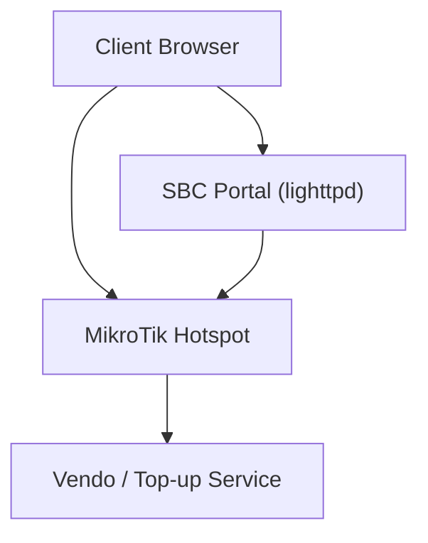

**Diagram sources**
- [hotspot-external-portal.rsc:122-144](file://deploy/mikrotik/hotspot-external-portal.rsc#L122-L144)
- [login.html:349-428](file://hotspot/login.html#L349-L428)
- [varbridge.js:41-103](file://hotspot/js/varbridge.js#L41-L103)

**Section sources**
- [login.html:1-790](file://hotspot/login.html#L1-L790)
- [core.js:1-959](file://hotspot/assets/js/core.js#L1-L959)
- [config.js:1-63](file://hotspot/assets/js/config.js#L1-L63)
- [varbridge.js:1-239](file://hotspot/js/varbridge.js#L1-L239)
- [md5.js:1-218](file://hotspot/md5.js#L1-L218)
- [auth.php:1-282](file://includes/auth.php#L1-L282)
- [crypto.php:1-138](file://includes/crypto.php#L1-L138)
- [hotspot-external-portal.rsc:1-235](file://deploy/mikrotik/hotspot-external-portal.rsc#L1-L235)

## Core Components
- Voucher input form: single-line input plus submit button that triggers doLogin()
- Member login modal: username/password form that computes CHAP response via hexMD5()
- Dual-mode bridge: varbridge.js detects external mode and patches $(...) tokens
- Configuration: config.js toggles features like MAC-as-voucher, member login visibility, and multi-vendor behavior
- MD5 helper: md5.js provides hexMD5() for CHAP password computation
- Router stubs: rlogin.html and alogin.html redirect or refresh after PAP login
- Admin auth utilities: auth.php and crypto.php secure admin sessions and router credentials

Key responsibilities:
- login.html orchestrates CHAP/PAP submission and stores temporary validity data
- core.js manages vendor interactions, coin slot flow, QR purchase, and auto-login triggers
- varbridge.js enables the same HTML to run on both router and SBC
- hotspot-external-portal.rsc documents the external PAP flow and router configuration

**Updated** Enhanced external mode support with dynamic form creation fallback when sendin form element is missing from DOM

**Section sources**
- [login.html:349-428](file://hotspot/login.html#L349-L428)
- [login.html:483-494](file://hotspot/login.html#L483-L494)
- [login.html:704-738](file://hotspot/login.html#L704-L738)
- [core.js:1-959](file://hotspot/assets/js/core.js#L1-L959)
- [config.js:37-63](file://hotspot/assets/js/config.js#L37-L63)
- [varbridge.js:1-239](file://hotspot/js/varbridge.js#L1-L239)
- [md5.js:209-218](file://hotspot/md5.js#L209-L218)
- [rlogin.html:1-13](file://hotspot/rlogin.html#L1-L13)
- [alogin.html:1-45](file://hotspot/alogin.html#L1-L45)
- [auth.php:18-57](file://includes/auth.php#L18-L57)
- [crypto.php:17-48](file://includes/crypto.php#L17-L48)

## Architecture Overview
The portal supports two authentication paths:

- Router-native mode (CHAP):
  - The browser submits a hidden form to the router's login endpoint
  - Password is computed as MD5(chap-id + "" + chap-challenge) or MD5(chap-id + voucher + chap-challenge) depending on loginOption
- External mode (HTTP-PAP):
  - The SBC serves the portal; the login form posts plaintext voucher to the router's login URL
  - Router responds with redirect to the SBC status page

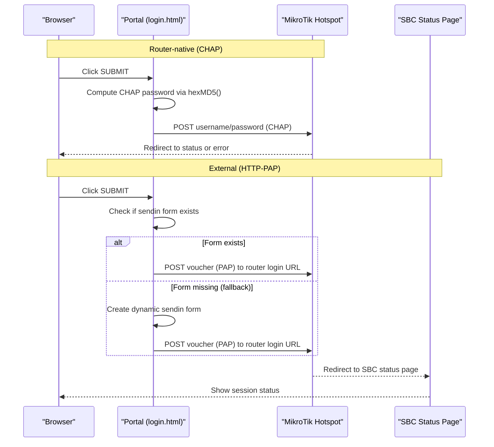

**Diagram sources**
- [login.html:365-415](file://hotspot/login.html#L365-L415)
- [hotspot-external-portal.rsc:122-144](file://deploy/mikrotik/hotspot-external-portal.rsc#L122-L144)

**Section sources**
- [login.html:349-428](file://hotspot/login.html#L349-L428)
- [hotspot-external-portal.rsc:122-144](file://deploy/mikrotik/hotspot-external-portal.rsc#L122-L144)

## Detailed Component Analysis

### Voucher Input Form and Submission Flow
- The voucher input field and submit button are defined in the main content area
- On submit, doLogin() runs:
  - In external mode, it sets username/password to the voucher and navigates to the router login URL
  - **Enhanced**: Dynamic form creation fallback when sendin form element is missing from DOM
  - In router-native mode, it computes CHAP password using hexMD5() and submits the hidden form
- Temporary validity is stored locally and merged with persisted validity when available

**Updated** Added robust fallback mechanism for external mode form creation

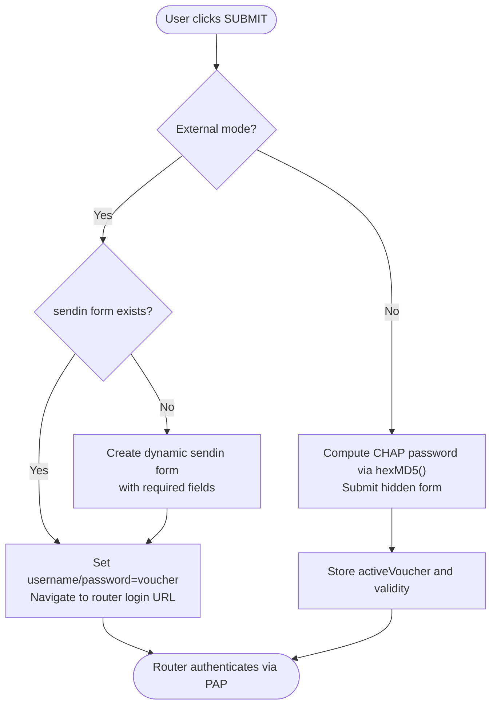

**Diagram sources**
- [login.html:365-415](file://hotspot/login.html#L365-L415)
- [md5.js:209-218](file://hotspot/md5.js#L209-L218)

**Section sources**
- [login.html:349-428](file://hotspot/login.html#L349-L428)
- [login.html:483-494](file://hotspot/login.html#L483-L494)

### Enhanced External Mode Form Creation
When operating in external mode (SBC lighttpd deployment), the system now includes enhanced form creation logic:

- **Dynamic Form Detection**: Checks if the sendin form exists in the DOM before attempting to use it
- **Fallback Form Construction**: If the form is missing (due to varbridge stripping conditional elements), creates a new form element programmatically
- **Field Population**: Automatically populates all required fields including username, password, dst, and popup parameters
- **Action URL Handling**: Uses PORTAL.params.login for the router login URL or falls back gracefully

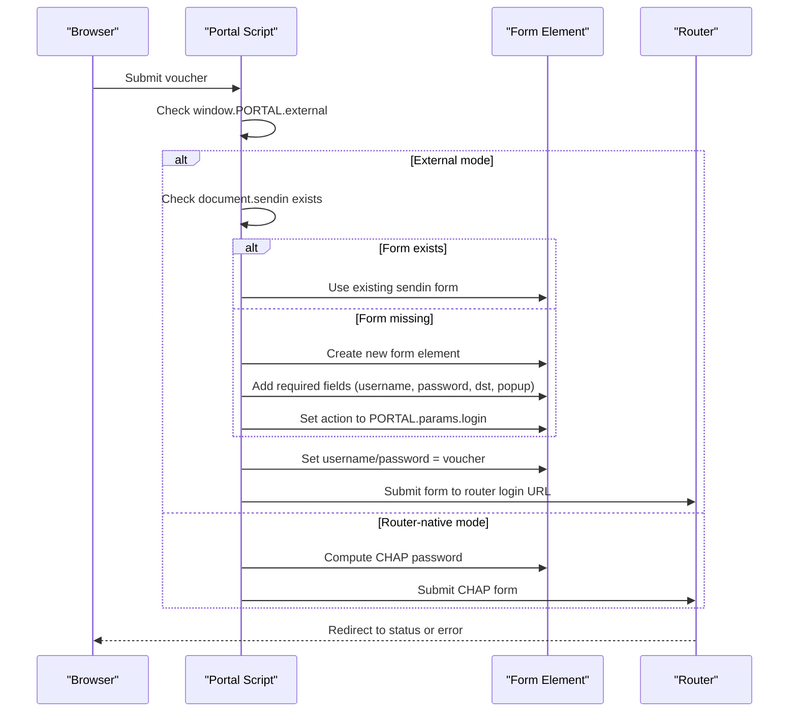

**Diagram sources**
- [login.html:365-394](file://hotspot/login.html#L365-L394)
- [varbridge.js:126-140](file://hotspot/js/varbridge.js#L126-L140)

**Section sources**
- [login.html:365-394](file://hotspot/login.html#L365-L394)
- [varbridge.js:126-140](file://hotspot/js/varbridge.js#L126-L140)

### Member Login Modal and CHAP Response
- The member login modal contains username and password fields
- On submit, doLoginMember() computes CHAP password as hexMD5(chap-id + password + chap-challenge) and submits the hidden form
- This path is only present when the router supplies CHAP variables

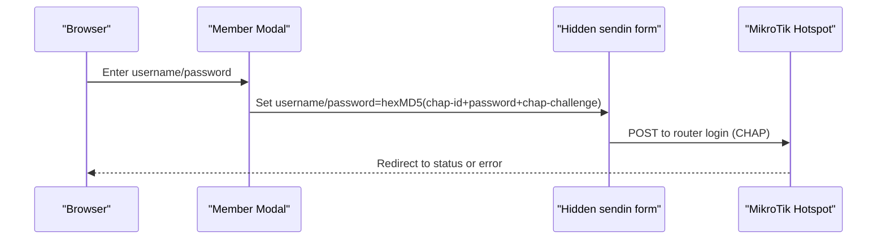

**Diagram sources**
- [login.html:418-428](file://hotspot/login.html#L418-L428)
- [login.html:718-726](file://hotspot/login.html#L718-L726)

**Section sources**
- [login.html:418-428](file://hotspot/login.html#L418-L428)
- [login.html:704-738](file://hotspot/login.html#L704-L738)

### Dual Authentication Flows: CHAP vs HTTP-PAP
- Router-native mode uses CHAP:
  - Password = MD5(chap-id + "" + chap-challenge) when loginOption == 0
  - Password = MD5(chap-id + voucher + chap-challenge) when loginOption == 1
- External mode uses HTTP-PAP:
  - The SBC portal posts the voucher as plaintext to the router's login URL
  - Router redirects to the SBC status page upon success

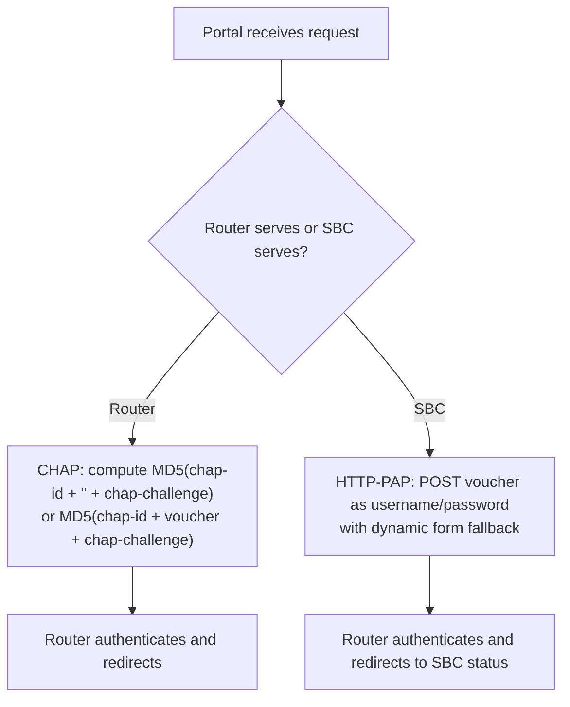

**Diagram sources**
- [login.html:365-415](file://hotspot/login.html#L365-L415)
- [hotspot-external-portal.rsc:122-144](file://deploy/mikrotik/hotspot-external-portal.rsc#L122-L144)

**Section sources**
- [login.html:365-415](file://hotspot/login.html#L365-L415)
- [hotspot-external-portal.rsc:122-144](file://deploy/mikrotik/hotspot-external-portal.rsc#L122-L144)

### CHAP Challenge-Response Mechanism
- The hidden form sendin carries username and password
- doLogin() populates these fields based on the current mode and loginOption
- hexMD5() from md5.js performs the MD5 digest required by CHAP

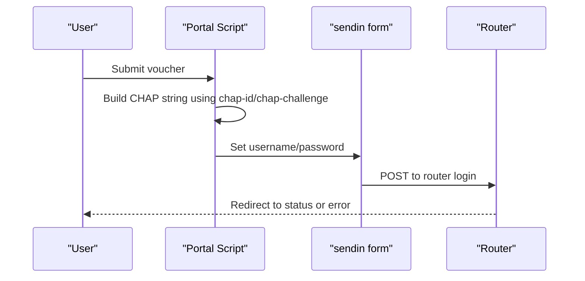

**Diagram sources**
- [login.html:349-428](file://hotspot/login.html#L349-L428)
- [md5.js:209-218](file://hotspot/md5.js#L209-L218)

**Section sources**
- [login.html:349-428](file://hotspot/login.html#L349-L428)
- [md5.js:1-218](file://hotspot/md5.js#L1-L218)

### HTTP-PAP Flow for External Mode
- When PORTAL.external is true, doLogin() sets username/password to the voucher and submits directly to the router login URL
- **Enhanced**: Includes dynamic form creation fallback when the sendin form element is missing from the DOM
- The router authenticates via PAP and redirects to the SBC status page

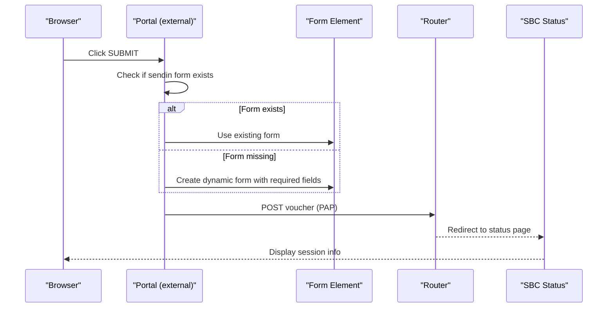

**Diagram sources**
- [login.html:365-394](file://hotspot/login.html#L365-L394)
- [hotspot-external-portal.rsc:122-144](file://deploy/mikrotik/hotspot-external-portal.rsc#L122-L144)

**Section sources**
- [login.html:365-394](file://hotspot/login.html#L365-L394)
- [hotspot-external-portal.rsc:122-144](file://deploy/mikrotik/hotspot-external-portal.rsc#L122-L144)

### MD5 Hashing Implementation
- md5.js implements RFC 1321 MD5 in JavaScript
- Exposed functions include hexMD5(), which returns a lowercase hexadecimal digest
- Used exclusively for CHAP password computation in the portal

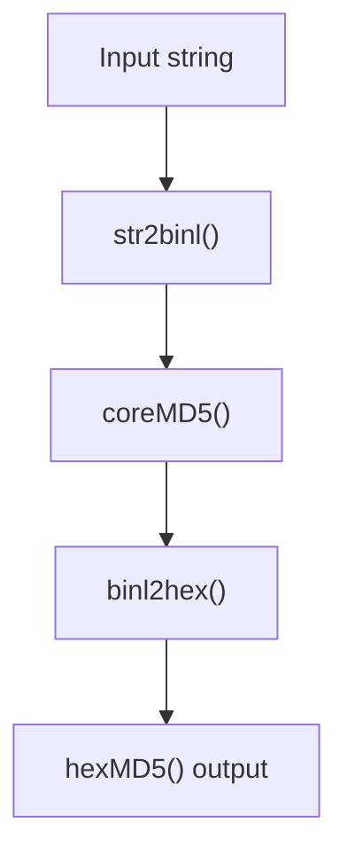

**Diagram sources**
- [md5.js:181-218](file://hotspot/md5.js#L181-L218)

**Section sources**
- [md5.js:1-218](file://hotspot/md5.js#L1-L218)

### Automatic MAC Address Voucher Generation
- When macAsVoucherCode is enabled, the portal fills the voucher input with the device MAC address without colons
- This allows devices to log in automatically using their MAC as the voucher code

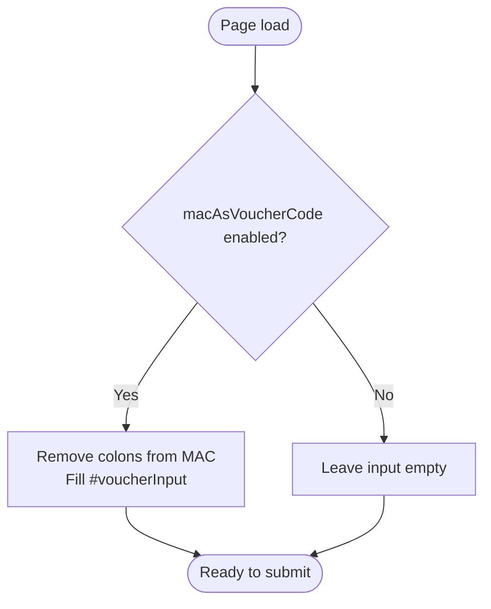

**Diagram sources**
- [login.html:380-385](file://hotspot/login.html#L380-L385)
- [core.js:139-143](file://hotspot/assets/js/core.js#L139-L143)
- [config.js:60-61](file://hotspot/assets/js/config.js#L60-L61)

**Section sources**
- [login.html:380-385](file://hotspot/login.html#L380-L385)
- [core.js:139-143](file://hotspot/assets/js/core.js#L139-L143)
- [config.js:60-61](file://hotspot/assets/js/config.js#L60-L61)

### Enhanced Form Validation and Error Handling
- Frontend validation:
  - Empty voucher handling and toast notifications
  - Error messages from vendor responses mapped via errorCodeMap
  - **Enhanced**: Robust form existence checks and fallback creation for external mode
- Backend/admin security:
  - Argon2id/bcrypt password hashing and verification for admin accounts
  - Rate limiting per IP and audit logging
  - Encrypted router credential storage using libsodium secretbox

**Updated** Added enhanced form validation with dynamic form creation fallback for external mode reliability

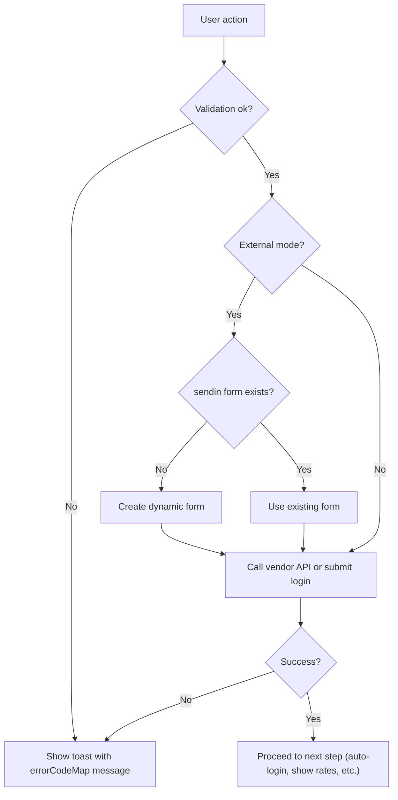

**Diagram sources**
- [core.js:1-14](file://hotspot/assets/js/core.js#L1-L14)
- [core.js:62-73](file://hotspot/assets/js/core.js#L62-L73)
- [login.html:365-394](file://hotspot/login.html#L365-L394)
- [auth.php:18-57](file://includes/auth.php#L18-L57)
- [auth.php:96-138](file://includes/auth.php#L96-L138)
- [crypto.php:84-137](file://includes/crypto.php#L84-L137)

**Section sources**
- [core.js:1-14](file://hotspot/assets/js/core.js#L1-L14)
- [core.js:62-73](file://hotspot/assets/js/core.js#L62-L73)
- [login.html:365-394](file://hotspot/login.html#L365-L394)
- [auth.php:18-57](file://includes/auth.php#L18-L57)
- [auth.php:96-138](file://includes/auth.php#L96-L138)
- [crypto.php:84-137](file://includes/crypto.php#L84-L137)

### Integration with Underlying Systems
- Router integration:
  - Router-native CHAP via hidden form submission
  - External PAP via direct navigation to router login URL with enhanced form fallback
- Vendor/top-up integration:
  - AJAX calls to vendor endpoints for top-up, coin check, and voucher conversion
  - Multi-vendor selection and feature toggles via config.js
- Admin panel:
  - Secure session management and rate-limited login
  - Encrypted storage of router credentials

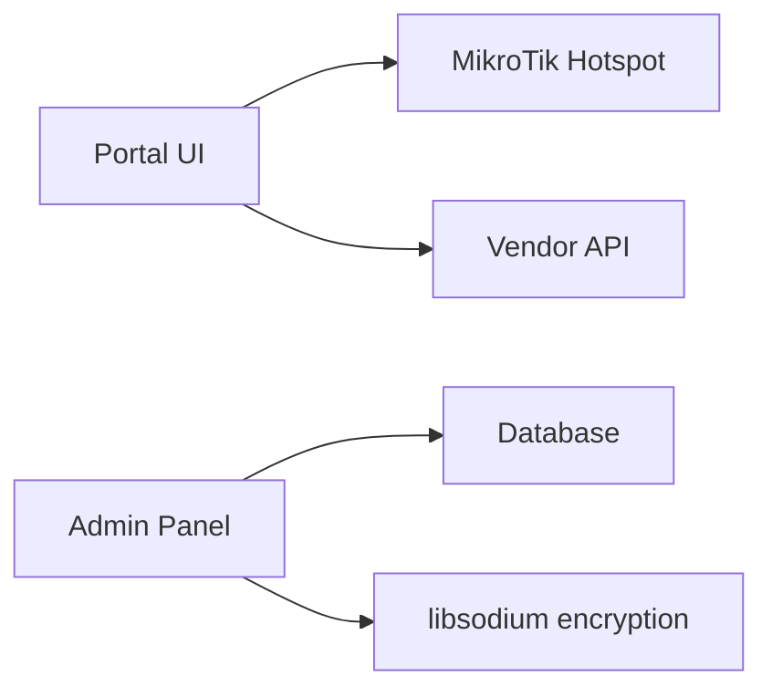

**Diagram sources**
- [login.html:349-428](file://hotspot/login.html#L349-L428)
- [core.js:490-549](file://hotspot/assets/js/core.js#L490-L549)
- [auth.php:140-190](file://includes/auth.php#L140-L190)
- [crypto.php:84-137](file://includes/crypto.php#L84-L137)

**Section sources**
- [login.html:349-428](file://hotspot/login.html#L349-L428)
- [core.js:490-549](file://hotspot/assets/js/core.js#L490-L549)
- [auth.php:140-190](file://includes/auth.php#L140-L190)
- [crypto.php:84-137](file://includes/crypto.php#L84-L137)

## Dependency Analysis
- login.html depends on:
  - varbridge.js for dual-mode token patching
  - md5.js for CHAP password computation
  - core.js for vendor interactions and UI state
  - config.js for feature flags
- hotspot-external-portal.rsc defines the PAP profile and redirect behavior
- auth.php and crypto.php support admin security and router credential protection

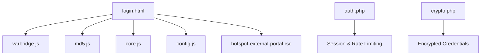

**Diagram sources**
- [login.html:14-19](file://hotspot/login.html#L14-L19)
- [hotspot-external-portal.rsc:122-144](file://deploy/mikrotik/hotspot-external-portal.rsc#L122-L144)
- [auth.php:18-57](file://includes/auth.php#L18-L57)
- [crypto.php:84-137](file://includes/crypto.php#L84-L137)

**Section sources**
- [login.html:14-19](file://hotspot/login.html#L14-L19)
- [hotspot-external-portal.rsc:122-144](file://deploy/mikrotik/hotspot-external-portal.rsc#L122-L144)
- [auth.php:18-57](file://includes/auth.php#L18-L57)
- [crypto.php:84-137](file://includes/crypto.php#L84-L137)

## Performance Considerations
- Avoid unnecessary reflows by minimizing DOM updates during coin slot polling
- Use local storage for temporary validity to reduce server round-trips
- Prefer router-native CHAP when possible to avoid extra redirects in external mode
- Keep vendor API retry logic bounded to prevent excessive network traffic
- **Enhanced**: Dynamic form creation is lightweight and only occurs when needed in external mode

[No sources needed since this section provides general guidance]

## Troubleshooting Guide
Common issues and resolutions:
- Invalid voucher:
  - Frontend shows a toast with a user-friendly message
  - Clear activeVoucher and retry
- Coin slot busy or not available:
  - Polling stops and a toast informs the user
  - Retry after a short delay
- External mode redirect loop:
  - Ensure the SBC IP is bypassed in hotspot ip-binding
  - Confirm walled garden allows unauthenticated access to the SBC portal
- CHAP failures:
  - Verify chap-id and chap-challenge are present in router-native mode
  - Confirm hexMD5() is loaded and functioning
- **Enhanced**: External mode form issues:
  - The system now automatically creates a fallback form if the sendin form is missing
  - Check that PORTAL.external is properly detected by varbridge.js
  - Verify that PORTAL.params.login contains the correct router login URL

**Updated** Added troubleshooting guidance for enhanced external mode form creation

**Section sources**
- [core.js:1-14](file://hotspot/assets/js/core.js#L1-L14)
- [core.js:62-73](file://hotspot/assets/js/core.js#L62-L73)
- [hotspot-external-portal.rsc:147-171](file://deploy/mikrotik/hotspot-external-portal.rsc#L147-L171)
- [login.html:349-428](file://hotspot/login.html#L349-L428)
- [login.html:365-394](file://hotspot/login.html#L365-L394)

## Conclusion
The portal provides a flexible login interface supporting both voucher-based and member-based authentication. It seamlessly operates in router-native CHAP mode and external HTTP-PAP mode, with robust client-side handling for voucher entry, automatic MAC-as-voucher generation, and vendor integrations. 

**Enhanced** The latest improvements include dynamic form creation fallback for external mode operation, ensuring reliable authentication even when the sendin form element is missing from the DOM due to varbridge processing. Security is reinforced through modern password hashing for admin accounts and encrypted storage for router credentials. Proper configuration of the router and SBC ensures reliable operation across both deployment modes.

[No sources needed since this section summarizes without analyzing specific files]