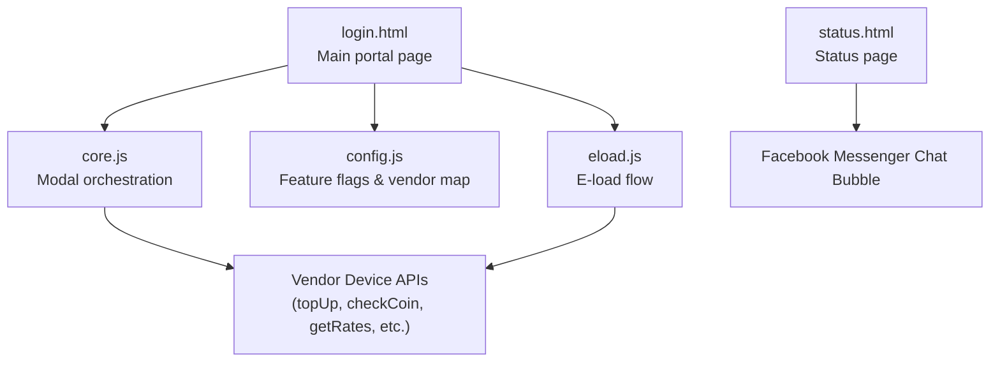
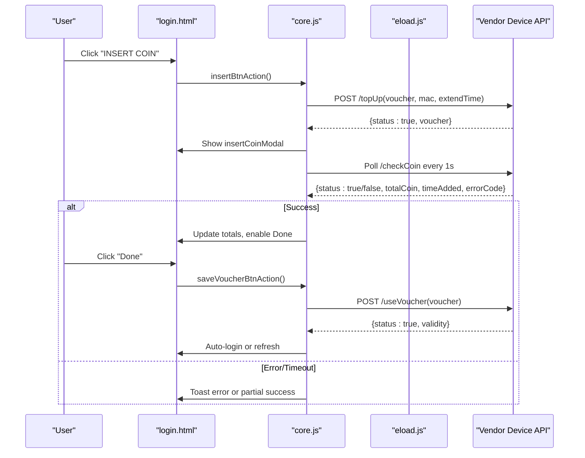
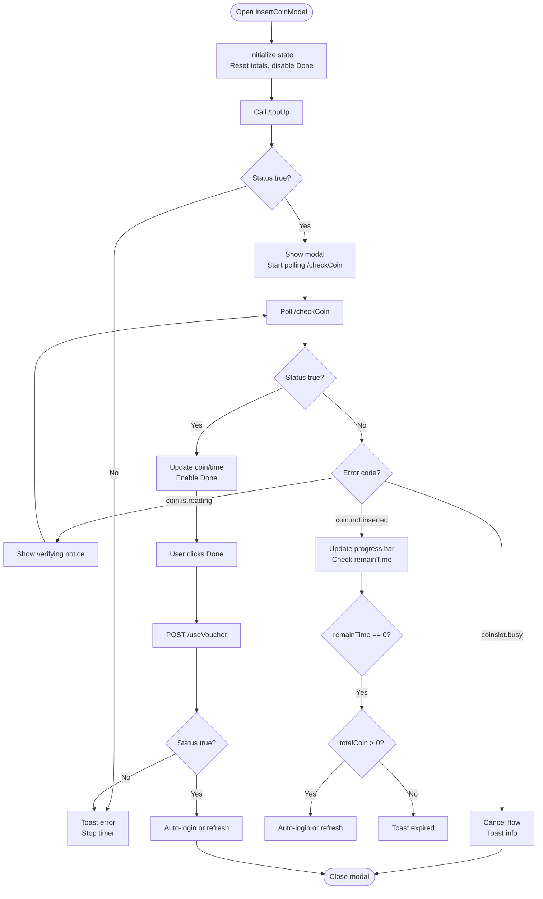
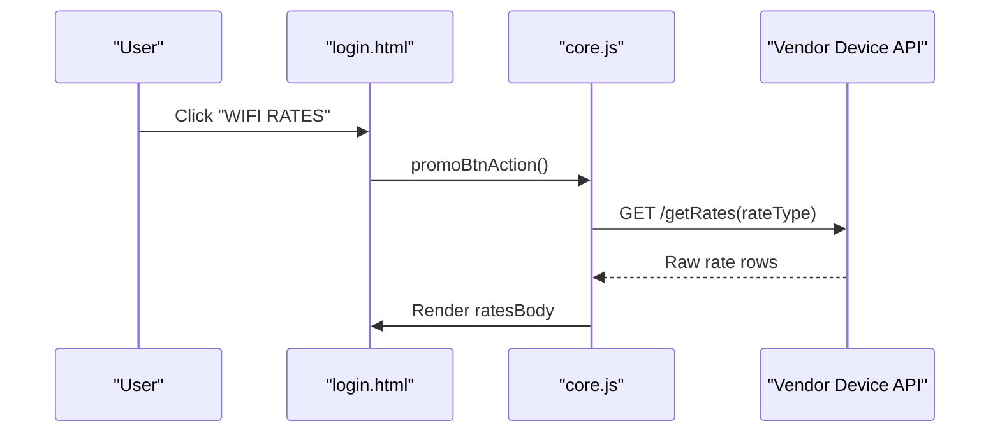
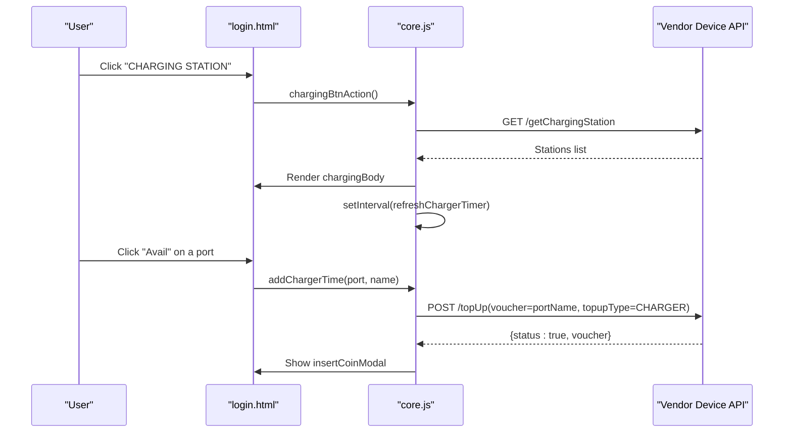
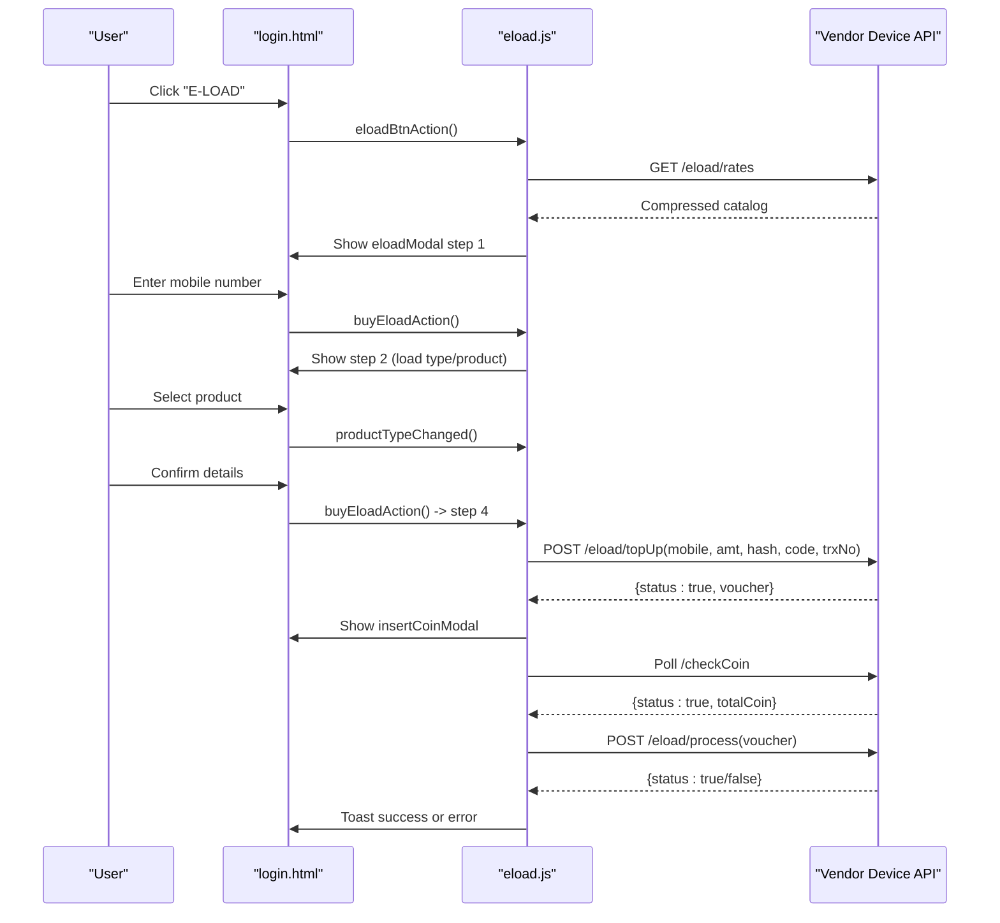
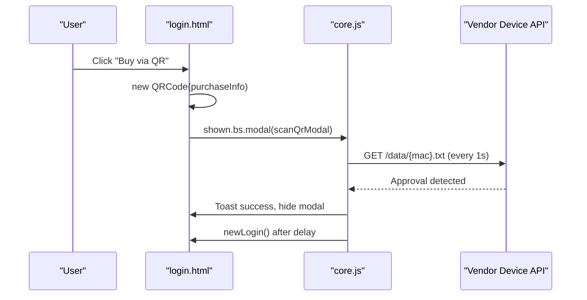
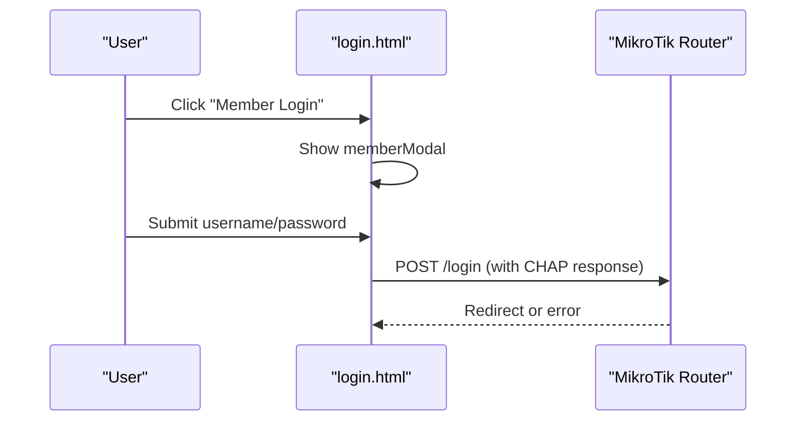
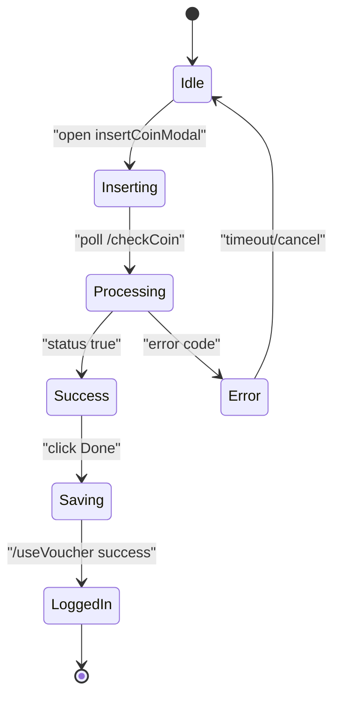

# Modal System & Interactive Features

<cite>
**Referenced Files in This Document**   
- [login.html](file://hotspot/login.html)
- [core.js](file://hotspot/assets/js/core.js)
- [config.js](file://hotspot/assets/js/config.js)
- [eload.js](file://hotspot/assets/js/eload.js)
- [status.html](file://hotspot/status.html)
</cite>

## Table of Contents
1. [Introduction](#introduction)
2. [Project Structure](#project-structure)
3. [Core Components](#core-components)
4. [Architecture Overview](#architecture-overview)
5. [Detailed Component Analysis](#detailed-component-analysis)
6. [Dependency Analysis](#dependency-analysis)
7. [Performance Considerations](#performance-considerations)
8. [Troubleshooting Guide](#troubleshooting-guide)
9. [Conclusion](#conclusion)

## Introduction
This document explains the Bootstrap modal system and interactive features used by the captive portal interface. It covers:
- Coin insertion simulation modal for internet top-up, charging station access, and e-load purchases
- Promotional rates display modal
- Charging station interface modal
- E-load service integration modal
- QR code generation for voucher purchases
- Member login modal
- Modal lifecycle management, event handling, and data flow between modals and the main interface
- Custom behaviors, form interactions within modals, and external integrations such as Facebook Messenger chat bubble

The implementation uses Bootstrap modals with custom JavaScript orchestration to coordinate user flows, vendor device communication, and session state.

## Project Structure
The hotspot portal is composed of:
- A primary login page that hosts all modals and UI controls
- Core JavaScript that manages modal behavior, vendor API calls, timers, and state
- Configuration for multi-vendor setups and feature toggles
- E-load module for mobile load purchase flows
- Status page that integrates a Facebook Messenger chat bubble

**Diagram sources**
- [login.html:437-500](file://hotspot/login.html#L437-L500)
- [core.js:30-211](file://hotspot/assets/js/core.js#L30-L211)
- [config.js:1-63](file://hotspot/assets/js/config.js#L1-L63)
- [status.html:29-38](file://hotspot/status.html#L29-L38)

**Section sources**
- [login.html:1-775](file://hotspot/login.html#L1-L775)
- [core.js:1-959](file://hotspot/assets/js/core.js#L1-L959)
- [config.js:1-63](file://hotspot/assets/js/config.js#L1-L63)
- [status.html:1-38](file://hotspot/status.html#L1-L38)

## Core Components
- Main portal page defines all modals and triggers:
  - Insert coin modal
  - Promo rates modal
  - Charging station modal
  - E-load modal
  - QR purchase modal
  - Member login modal
- Core JavaScript handles:
  - Modal show/hide events
  - Vendor API polling and responses
  - Timer management for coin insertion windows
  - State persistence via local storage or cookies
- Configuration file toggles features like member login, QR purchase, charging, and e-load availability per vendor.

Key responsibilities:
- UI orchestration: opening/closing modals based on user actions and vendor responses
- Data fetching: retrieving rates, charging stations, and e-load catalogs from vendor devices
- Session coordination: preparing vouchers, auto-login, and logout flows

**Section sources**
- [login.html:437-775](file://hotspot/login.html#L437-L775)
- [core.js:30-211](file://hotspot/assets/js/core.js#L30-L211)
- [config.js:1-63](file://hotspot/assets/js/config.js#L1-L63)

## Architecture Overview
The modal-driven architecture coordinates three layers:
- Presentation layer (Bootstrap modals in login.html)
- Orchestration layer (core.js and eload.js)
- External vendor services (HTTP endpoints on the vending hardware)

**Diagram sources**
- [login.html:476-481](file://hotspot/login.html#L476-L481)
- [core.js:264-298](file://hotspot/assets/js/core.js#L264-L298)
- [core.js:490-549](file://hotspot/assets/js/core.js#L490-L549)
- [core.js:633-761](file://hotspot/assets/js/core.js#L633-L761)
- [core.js:552-631](file://hotspot/assets/js/core.js#L552-L631)

## Detailed Component Analysis

### Coin Insertion Simulation Modal
Purpose:
- Simulate coin insertion workflow for purchasing internet time or accessing charging stations
- Displays generated voucher, progress bar, coin totals, and expected amounts
- Supports conversion of unused vouchers into usable codes

Lifecycle:
- Opened by:
  - Internet top-up via “INSERT COIN” button
  - Charging station selection
  - E-load confirmation step
- Polling:
  - Every second, checks vendor status for coin insertion and updates UI
- Closing:
  - On timeout, insufficient coins, busy slot, or manual cancel
  - Triggers vendor cancellation if no coins were inserted

Data flow:
- Top-up request returns a temporary voucher
- Check coin loop accumulates inserted amount and displays time/data added
- Save voucher finalizes usage and triggers auto-login or charging station refresh

Custom behaviors:
- Background audio plays during active coin insertion
- Multi-vendor mode updates modal title to indicate selected vendo
- Partial coin processing handled gracefully with informative toasts

**Diagram sources**
- [core.js:264-298](file://hotspot/assets/js/core.js#L264-L298)
- [core.js:490-549](file://hotspot/assets/js/core.js#L490-L549)
- [core.js:633-761](file://hotspot/assets/js/core.js#L633-L761)
- [core.js:552-631](file://hotspot/assets/js/core.js#L552-L631)

**Section sources**
- [login.html:512-577](file://hotspot/login.html#L512-L577)
- [core.js:30-56](file://hotspot/assets/js/core.js#L30-L56)
- [core.js:264-298](file://hotspot/assets/js/core.js#L264-L298)
- [core.js:490-549](file://hotspot/assets/js/core.js#L490-L549)
- [core.js:633-761](file://hotspot/assets/js/core.js#L633-L761)
- [core.js:552-631](file://hotspot/assets/js/core.js#L552-L631)

### Promotional Rates Display Modal
Purpose:
- Display promotional rates for internet or charging categories
- Allows switching rate types and shows validity and optional data allowances

Behavior:
- Opens when clicking “WIFI RATES”
- Populates rows from vendor endpoint
- Retries up to two times on failure

Data flow:
- Fetches rates from vendor device
- Parses pipe-separated rows and hash-separated columns
- Renders HTML cards with rate, validity, and data information

**Diagram sources**
- [login.html:478-479](file://hotspot/login.html#L478-L479)
- [core.js:252-255](file://hotspot/assets/js/core.js#L252-L255)
- [core.js:300-302](file://hotspot/assets/js/core.js#L300-L302)
- [core.js:331-370](file://hotspot/assets/js/core.js#L331-L370)

**Section sources**
- [login.html:579-609](file://hotspot/login.html#L579-L609)
- [core.js:252-255](file://hotspot/assets/js/core.js#L252-L255)
- [core.js:300-302](file://hotspot/assets/js/core.js#L300-L302)
- [core.js:331-370](file://hotspot/assets/js/core.js#L331-L370)

### Charging Station Interface Modal
Purpose:
- Show available charging ports, their status, remaining time, and allow users to reserve a port

Behavior:
- Opens when clicking “CHARGING STATION”
- Loads charging stations from vendor device
- Refreshes port status and countdown every second
- Reserving a port triggers top-up flow and opens coin insertion modal

Data flow:
- Fetches list of charging stations
- Updates UI with status and availability
- On reservation, calls top-up and transitions to coin insertion modal

**Diagram sources**
- [login.html:479-480](file://hotspot/login.html#L479-L480)
- [core.js:257-260](file://hotspot/assets/js/core.js#L257-L260)
- [core.js:372-374](file://hotspot/assets/js/core.js#L372-L374)
- [core.js:376-426](file://hotspot/assets/js/core.js#L376-L426)
- [core.js:454-487](file://hotspot/assets/js/core.js#L454-L487)

**Section sources**
- [login.html:611-630](file://hotspot/login.html#L611-L630)
- [core.js:372-426](file://hotspot/assets/js/core.js#L372-L426)
- [core.js:454-487](file://hotspot/assets/js/core.js#L454-L487)

### E-Load Service Integration Modal
Purpose:
- Allow users to purchase mobile load using coins
- Guides through steps: enter mobile number, select load type and product, confirm details, then process payment

Behavior:
- Opens when clicking “E-LOAD”
- Loads compressed catalog from vendor device
- Step-based UI rendering with validation
- After confirmation, initiates top-up and coin insertion flow

Data flow:
- Fetches and decompresses e-load rates
- Populates dropdowns dynamically
- Submits top-up request with product hash and price
- Polls coin insertion until sufficient amount or timeout
- Processes e-load transaction and handles excess/insufficient coin scenarios

**Diagram sources**
- [login.html:480-481](file://hotspot/login.html#L480-L481)
- [eload.js:8-15](file://hotspot/assets/js/eload.js#L8-L15)
- [eload.js:17-105](file://hotspot/assets/js/eload.js#L17-L105)
- [eload.js:120-163](file://hotspot/assets/js/eload.js#L120-L163)
- [eload.js:187-267](file://hotspot/assets/js/eload.js#L187-L267)
- [eload.js:269-345](file://hotspot/assets/js/eload.js#L269-L345)

**Section sources**
- [login.html:631-675](file://hotspot/login.html#L631-L675)
- [eload.js:1-357](file://hotspot/assets/js/eload.js#L1-L357)

### QR Code Generation for Voucher Purchases
Purpose:
- Generate a QR code containing a purchase link for vendors to approve voucher purchases remotely

Behavior:
- Triggered by “Buy via QR” link (hidden unless enabled)
- Creates QR code with a deep link including MAC and IP
- Polls a data endpoint to detect approval and auto-login

Data flow:
- Builds purchaseInfo string with MAC and IP
- Generates QR code using qrcode library
- Starts interval to poll /data/{mac}.txt for approval
- On success, hides modal and performs auto-login after delay

**Diagram sources**
- [login.html:493-494](file://hotspot/login.html#L493-L494)
- [login.html:677-700](file://hotspot/login.html#L677-L700)
- [login.html:767-770](file://hotspot/login.html#L677-L770)
- [core.js:304-329](file://hotspot/assets/js/core.js#L304-L329)

**Section sources**
- [login.html:677-700](file://hotspot/login.html#L677-L700)
- [login.html:767-770](file://hotspot/login.html#L767-L770)
- [core.js:304-329](file://hotspot/assets/js/core.js#L304-L329)

### Member Login Modal
Purpose:
- Provide a member login form inside a modal for authenticated users

Behavior:
- Opened via “Member Login” link
- Uses Bootstrap modal attributes to control backdrop and keyboard behavior
- Submits credentials to router login endpoint with CHAP challenge-response

Data flow:
- Form fields are submitted to router-native login flow
- If CHAP is present, password is hashed before submission

**Diagram sources**
- [login.html:491-494](file://hotspot/login.html#L491-L494)
- [login.html:704-738](file://hotspot/login.html#L704-L738)
- [login.html:421-428](file://hotspot/login.html#L421-L428)

**Section sources**
- [login.html:704-738](file://hotspot/login.html#L704-L738)
- [login.html:421-428](file://hotspot/login.html#L421-L428)

### Modal Lifecycle Management and Event Handling
Key aspects:
- Initialization sets default states for buttons and toast instances
- Modal hidden events clear timers, pause audio, and call vendor cancellation if needed
- Shown events trigger data population (rates, charging stations)
- Global variables track insertion state, top-up mode, and retry counters

State management:
- Local storage or cookies store active voucher, total coins received, and temporary validity
- Storage helpers abstract localStorage vs cookie fallback

**Diagram sources**
- [core.js:30-56](file://hotspot/assets/js/core.js#L30-L56)
- [core.js:633-761](file://hotspot/assets/js/core.js#L633-L761)
- [core.js:552-631](file://hotspot/assets/js/core.js#L552-L631)

**Section sources**
- [core.js:30-56](file://hotspot/assets/js/core.js#L30-L56)
- [core.js:831-891](file://hotspot/assets/js/core.js#L831-L891)

### External Integrations: Facebook Messenger Chat Bubble
Purpose:
- Provide customer support via Facebook Messenger chat plugin

Implementation:
- Status page includes Facebook Messenger chat plugin container
- Initializes chatbox with page ID and other settings

Note:
- The login page also includes a simple chat bubble icon linking to Facebook Messenger; the status page uses the official chat plugin.

**Section sources**
- [login.html:503-508](file://hotspot/login.html#L503-L508)
- [status.html:29-38](file://hotspot/status.html#L29-L38)

## Dependency Analysis
Component relationships:
- login.html depends on:
  - core.js for modal orchestration and vendor communication
  - config.js for feature flags and vendor mapping
  - eload.js for e-load flow
  - Bootstrap CSS/JS for modal UI
- core.js depends on:
  - Vendor HTTP endpoints for top-up, coin checking, rates, and charging stations
  - Local storage/cookies for state persistence
- eload.js depends on:
  - Vendor endpoints for rates, top-up, and processing
  - pako library for decompression

Coupling and cohesion:
- High cohesion within each JS module (core.js for general flows, eload.js for e-load specifics)
- Moderate coupling to vendor APIs; errors are retried with limited attempts
- Feature toggles in config.js reduce unnecessary dependencies at runtime

Potential circular dependencies:
- None observed; modules are loaded sequentially and do not reference each other cyclically

External dependencies:
- Bootstrap modal framework
- jQuery for DOM manipulation and AJAX
- qrcode library for QR generation
- pako for gzip decompression
- Facebook Messenger chat plugin

**Section sources**
- [login.html:747-752](file://hotspot/login.html#L747-L752)
- [core.js:1-28](file://hotspot/assets/js/core.js#L1-L28)
- [config.js:1-63](file://hotspot/assets/js/config.js#L1-L63)
- [eload.js:1-7](file://hotspot/assets/js/eload.js#L1-L7)

## Performance Considerations
- Polling intervals:
  - Coin insertion polling runs every second; ensure vendor endpoints respond quickly to avoid UI lag
- Retry logic:
  - Rate fetching and charging station loading retry up to two times; consider exponential backoff for better resilience
- Audio playback:
  - Background audio loops during coin insertion; pause and reset on modal close to prevent resource leaks
- DOM updates:
  - Avoid excessive reflows by batching updates when rendering rates or charging stations
- Compression:
  - E-load catalog is gzipped; client-side decompression adds CPU overhead but reduces bandwidth

[No sources needed since this section provides general guidance]

## Troubleshooting Guide
Common issues and resolutions:
- Coin slot expired:
  - Indicates timeout without sufficient coins; user may have partial credit converted to voucher
- Coin not inserted:
  - No coin detected; prompt user to insert coins
- Coinslot cancelled/busy:
  - Manual cancellation or concurrent requests; inform user and reset state
- Product hash invalid:
  - Tampered product selection; ensure integrity of product hash from vendor
- Convert voucher empty/invalid:
  - Missing or incorrect voucher code for conversion; validate input
- Insufficient load:
  - Vendor machine lacks capacity; retry later
- E-load failed:
  - Transaction failure; handle excess/insufficient coins and provide voucher fallback

Diagnostic tips:
- Check toast messages for human-readable error descriptions
- Verify vendor endpoint connectivity and CORS settings
- Inspect local storage for active voucher and temp validity values
- Monitor console logs for AJAX errors and retry counts

**Section sources**
- [core.js:1-14](file://hotspot/assets/js/core.js#L1-L14)
- [core.js:798-815](file://hotspot/assets/js/core.js#L798-L815)
- [core.js:633-761](file://hotspot/assets/js/core.js#L633-L761)
- [eload.js:187-267](file://hotspot/assets/js/eload.js#L187-L267)

## Conclusion
The modal system provides a cohesive, interactive experience for voucher purchases, promotional rate browsing, charging station reservations, and e-load transactions. Core orchestration ensures robust state management, vendor communication, and graceful error handling. Configuration-driven feature toggles allow flexible deployment across multiple vendors. External integrations like Facebook Messenger enhance user support. By following the documented flows and troubleshooting guidance, operators can maintain reliable and user-friendly captive portal experiences.

[No sources needed since this section summarizes without analyzing specific files]