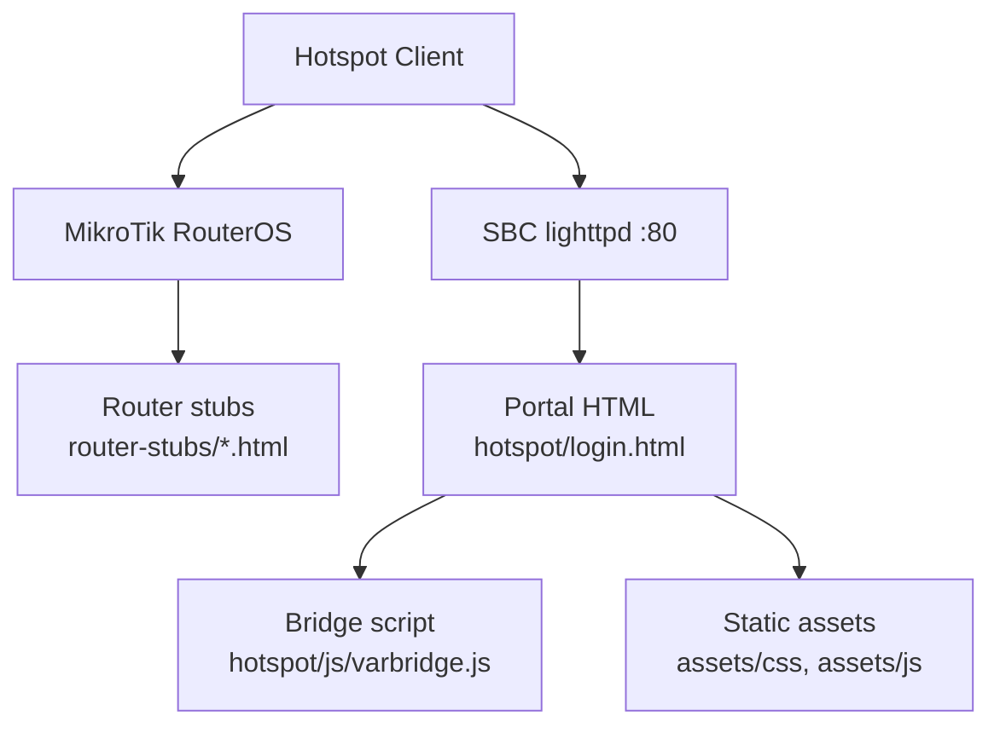
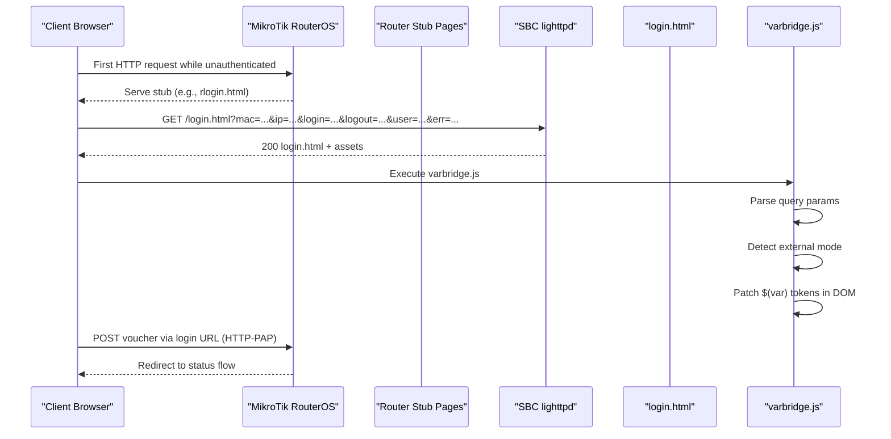
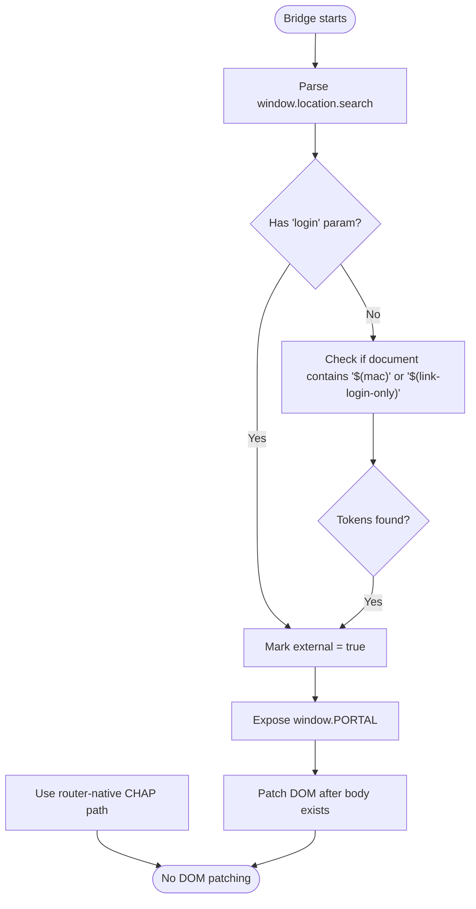
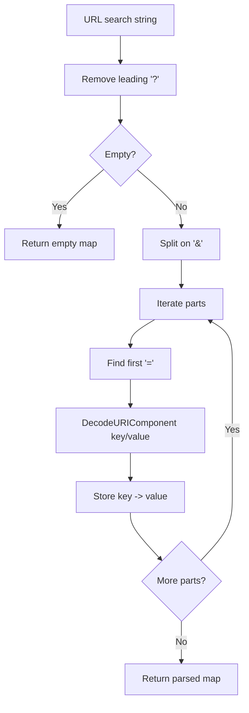
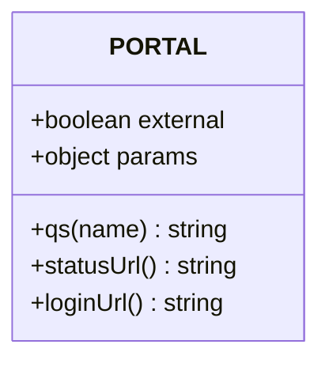
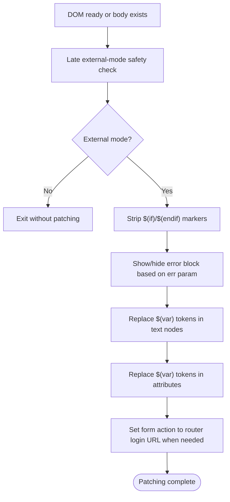
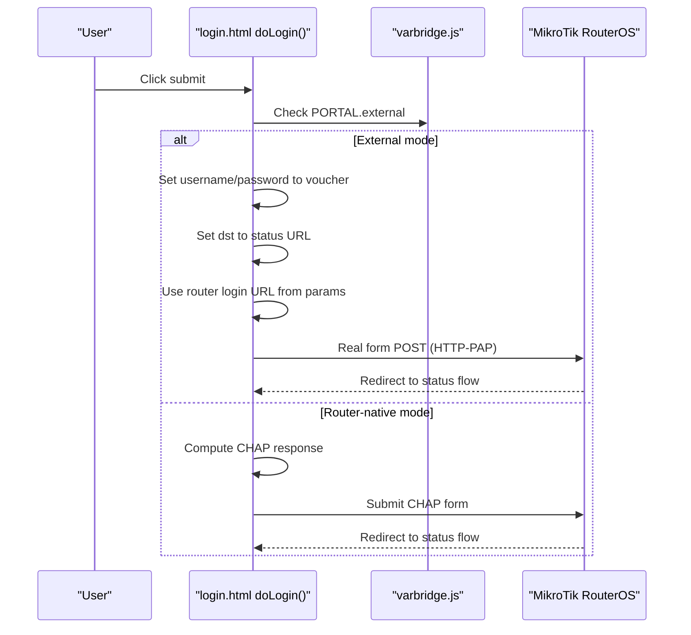
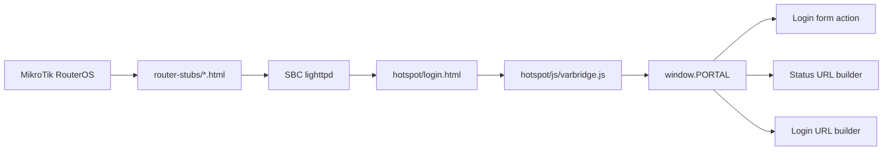

# Portal Architecture & Dual-Mode Operation

<cite>
**Referenced Files in This Document**
- [varbridge.js](file://hotspot/js/varbridge.js)
- [login.html](file://hotspot/login.html)
- [rlogin.html](file://hotspot/rlogin.html)
- [alogin.html](file://hotspot/alogin.html)
- [config.php](file://includes/config.php)
- [DEPLOYMENT.md](file://DEPLOYMENT.md)
</cite>

## Table of Contents
1. [Introduction](#introduction)
2. [Project Structure](#project-structure)
3. [Core Components](#core-components)
4. [Architecture Overview](#architecture-overview)
5. [Detailed Component Analysis](#detailed-component-analysis)
6. [Dependency Analysis](#dependency-analysis)
7. [Performance Considerations](#performance-considerations)
8. [Troubleshooting Guide](#troubleshooting-guide)
9. [Conclusion](#conclusion)

## Introduction
This document explains the captive portal’s dual-mode architecture: the same HTML files run either as router-native MikroTik hotspot pages or as external pages served by the SBC web server. The key design is that the client-side bridge detects which environment it is running in, processes query parameters, and patches literal template tokens so the page behaves correctly in both deployments.

The two modes are:
- **Router-native mode**: MikroTik serves the page and substitutes `$(...)` tokens server-side. The bridge is effectively a no-op.
- **External mode**: lighttpd on the SBC serves the page; RouterOS tokens remain literal. The bridge reads URL query parameters, exposes a small runtime API, and rewrites the DOM to replace tokens and configure form actions.

The result is one shared HTML template that works in both scenarios without duplication.

## Project Structure
The relevant parts for dual-mode operation live under the portal tree and its JavaScript bridge:

**Diagram sources**
- [DEPLOYMENT.md:34-70](file://DEPLOYMENT.md#L34-L70)
- [login.html:14-19](file://hotspot/login.html#L14-L19)
- [varbridge.js:1-15](file://hotspot/js/varbridge.js#L1-L15)

**Section sources**
- [DEPLOYMENT.md:34-70](file://DEPLOYMENT.md#L34-L70)
- [login.html:14-19](file://hotspot/login.html#L14-L19)

## Core Components
The dual-mode behavior is implemented primarily by:
- The portal login page, which includes the bridge early and contains RouterOS template tokens.
- The bridge script, which parses query parameters, detects external mode, publishes a runtime object, and patches the DOM.
- Thin router stubs that redirect clients to the SBC with encoded parameters.
- Post-login and status flows that rely on the same token set.

Key responsibilities:
- **Parameter parsing**: Convert the URL query string into a usable map.
- **Mode detection**: Decide whether the page is being served externally.
- **Token patching**: Replace literal `$(mac)`, `$(ip)`, `$(username)`, `$(error)`, and `$(link-logout)` in text and attributes.
- **Form routing**: Point the login form action to the router’s real login URL when in external mode.
- **Conditional markers**: Remove RouterOS `$(if ...)` / `$(endif)` marker text nodes.

**Section sources**
- [varbridge.js:1-15](file://hotspot/js/varbridge.js#L1-L15)
- [varbridge.js:22-37](file://hotspot/js/varbridge.js#L22-L37)
- [varbridge.js:46-57](file://hotspot/js/varbridge.js#L46-L57)
- [varbridge.js:67-98](file://hotspot/js/varbridge.js#L67-L98)
- [varbridge.js:109-118](file://hotspot/js/varbridge.js#L109-L118)
- [varbridge.js:126-140](file://hotspot/js/varbridge.js#L126-L140)
- [varbridge.js:142-163](file://hotspot/js/varbridge.js#L142-L163)
- [varbridge.js:165-182](file://hotspot/js/varbridge.js#L165-L182)
- [varbridge.js:184-212](file://hotspot/js/varbridge.js#L184-L212)
- [varbridge.js:214-236](file://hotspot/js/varbridge.js#L214-L236)

## Architecture Overview
At a high level, the system separates the thin router-facing redirect logic from the richer SBC-served portal UI.

**Diagram sources**
- [DEPLOYMENT.md:174-183](file://DEPLOYMENT.md#L174-L183)
- [login.html:349-429](file://hotspot/login.html#L349-L429)
- [varbridge.js:22-57](file://hotspot/js/varbridge.js#L22-L57)
- [varbridge.js:184-212](file://hotspot/js/varbridge.js#L184-L212)

## Detailed Component Analysis

### External Mode Detection
The bridge determines external mode using two signals:
1. A `login` query parameter present and non-empty.
2. The presence of literal RouterOS tokens such as `$(mac)` or `$(link-login-only)` in the document.

If either condition is true, the bridge treats the page as external. If not, it assumes router-native mode and does nothing beyond exposing the runtime API.

**Diagram sources**
- [varbridge.js:22-37](file://hotspot/js/varbridge.js#L22-L37)
- [varbridge.js:46-57](file://hotspot/js/varbridge.js#L46-L57)
- [varbridge.js:102-103](file://hotspot/js/varbridge.js#L102-L103)
- [varbridge.js:214-236](file://hotspot/js/varbridge.js#L214-L236)

**Section sources**
- [varbridge.js:22-37](file://hotspot/js/varbridge.js#L22-L37)
- [varbridge.js:46-57](file://hotspot/js/varbridge.js#L46-L57)
- [varbridge.js:102-103](file://hotspot/js/varbridge.js#L102-L103)

### Query Parameter Processing
The bridge implements a lightweight query-string parser:
- It removes the leading question mark.
- It splits on ampersand.
- For each part, it finds the first equals sign to separate key and value.
- It decodes percent-encoded values and tolerates malformed input.
- It stores the snapshot in `PORTAL.params`.
- It also provides a live accessor that falls back to the current URL if needed.

This allows the rest of the portal to read parameters through `PORTAL.qs(name)` rather than directly parsing the URL.

**Diagram sources**
- [varbridge.js:22-37](file://hotspot/js/varbridge.js#L22-L37)
- [varbridge.js:67-76](file://hotspot/js/varbridge.js#L67-L76)

**Section sources**
- [varbridge.js:22-37](file://hotspot/js/varbridge.js#L22-L37)
- [varbridge.js:67-76](file://hotspot/js/varbridge.js#L67-L76)

### Runtime API: `window.PORTAL`
When loaded, the bridge creates and assigns a global `PORTAL` object. Its main properties and methods are:

| Member | Purpose |
|---|---|
| `PORTAL.external` | Boolean indicating external SBC mode. |
| `PORTAL.params` | Snapshot of parsed query parameters. |
| `PORTAL.qs(name)` | Read a single parameter, falling back to the live URL. |
| `PORTAL.statusUrl()` | Build the SBC status URL carrying required parameters. |
| `PORTAL.loginUrl()` | Build the SBC login URL carrying required parameters. |

This API lets other scripts check deployment mode and build URLs without duplicating query-parameter logic.

**Diagram sources**
- [varbridge.js:67-98](file://hotspot/js/varbridge.js#L67-L98)

**Section sources**
- [varbridge.js:67-98](file://hotspot/js/varbridge.js#L67-L98)

### Token Patching in External Mode
In external mode, the bridge performs four related DOM operations after the `<body>` is available:

1. **Strip conditional markers**: Remove text nodes containing only RouterOS `$(if ...)` or `$(endif)` markers.
2. **Handle error blocks**: Show error content when an error parameter exists; hide it otherwise.
3. **Substitute text tokens**: Replace literal `$(mac)`, `$(ip)`, `$(username)`, `$(error)`, and `$(link-logout)` in text nodes.
4. **Substitute attribute tokens**: Replace tokens inside element attributes, including setting the login form action to the router’s real login URL when the action is the literal `$(link-login-only)`.

Skippable nodes include those inside `<script>` and `<style>` elements, so the bridge does not corrupt inline code.

**Diagram sources**
- [varbridge.js:109-118](file://hotspot/js/varbridge.js#L109-L118)
- [varbridge.js:126-140](file://hotspot/js/varbridge.js#L126-L140)
- [varbridge.js:142-163](file://hotspot/js/varbridge.js#L142-L163)
- [varbridge.js:165-182](file://hotspot/js/varbridge.js#L165-L182)
- [varbridge.js:184-212](file://hotspot/js/varbridge.js#L184-L212)
- [varbridge.js:214-236](file://hotspot/js/varbridge.js#L214-L236)

**Section sources**
- [varbridge.js:109-118](file://hotspot/js/varbridge.js#L109-L118)
- [varbridge.js:126-140](file://hotspot/js/varbridge.js#L126-L140)
- [varbridge.js:142-163](file://hotspot/js/varbridge.js#L142-L163)
- [varbridge.js:165-182](file://hotspot/js/varbridge.js#L165-L182)
- [varbridge.js:184-212](file://hotspot/js/varbridge.js#L184-L212)
- [varbridge.js:214-236](file://hotspot/js/varbridge.js#L214-L236)

### Seamless Transition Between CHAP and HTTP-PAP
The login page contains logic that chooses between router-native CHAP authentication and external HTTP-PAP authentication:

- In **external mode**, the login function prepares a hidden form with the voucher as both username and password, sets the destination to the status URL, forces top-level navigation instead of popup submission, uses the router login URL from the query parameters, and submits the form. This avoids CORS issues and matches the router’s expected HTTP-PAP flow.
- In **router-native mode**, the page relies on RouterOS-provided CHAP challenge data and computes the MD5 response before submitting.

This is what makes the same HTML work in both deployments: the bridge ensures the external form has the correct action and parameters, while the router-native path remains unchanged.

**Diagram sources**
- [login.html:349-429](file://hotspot/login.html#L349-L429)
- [varbridge.js:184-212](file://hotspot/js/varbridge.js#L184-L212)

**Section sources**
- [login.html:349-429](file://hotspot/login.html#L349-L429)

### Integration Patterns That Allow One HTML File to Work Everywhere
Several patterns make the dual-mode approach robust:

| Pattern | How It Works |
|---|---|
| Early bridge inclusion | The bridge is loaded before other scripts so `window.PORTAL` is available immediately. |
| Template tokens in HTML | The HTML contains `$(mac)`, `$(ip)`, `$(username)`, `$(error)`, `$(link-login-only)`, and conditional markers. RouterOS substitutes them server-side; the bridge substitutes them client-side in external mode. |
| Conditional markers | RouterOS `$(if chap-id)` and `$(endif)` sections exist in the HTML. In external mode, the bridge strips these marker text nodes so they do not appear as visible text. |
| Form action patching | When the login form action is the literal `$(link-login-only)`, the bridge replaces it with the router login URL from the query parameters. |
| Status and login URL helpers | The bridge builds consistent status and login URLs from the same parameter set, keeping redirects predictable. |
| Safe fallbacks | The bridge catches errors during patching and never breaks the portal even if substitution fails partially. |

**Section sources**
- [login.html:14-19](file://hotspot/login.html#L14-L19)
- [login.html:349-429](file://hotspot/login.html#L349-L429)
- [login.html:431-435](file://hotspot/login.html#L431-L435)
- [login.html:464-466](file://hotspot/login.html#L464-L466)
- [login.html:718-726](file://hotspot/login.html#L718-L726)
- [varbridge.js:102-103](file://hotspot/js/varbridge.js#L102-L103)
- [varbridge.js:126-140](file://hotspot/js/varbridge.js#L126-L140)
- [varbridge.js:142-163](file://hotspot/js/varbridge.js#L142-L163)
- [varbridge.js:184-212](file://hotspot/js/varbridge.js#L184-L212)
- [varbridge.js:214-236](file://hotspot/js/varbridge.js#L214-L236)

### Router Stub Behavior
The router stubs are intentionally minimal. They redirect the browser to the SBC portal with encoded parameters and handle post-login redirection.

- `rlogin.html` shows a short message when a login is required and refreshes to the redirect URL.
- `alogin.html` redirects to the SBC status page after successful authentication and handles some error cases by returning to the login page.

These stubs ensure the client always reaches the SBC portal and then returns to the SBC status page once authenticated.

**Section sources**
- [rlogin.html:1-13](file://hotspot/rlogin.html#L1-L13)
- [alogin.html:1-45](file://hotspot/alogin.html#L1-L45)
- [DEPLOYMENT.md:174-183](file://DEPLOYMENT.md#L174-L183)

## Dependency Analysis
The portal’s dual-mode behavior depends on a small but precise chain of interactions:

**Diagram sources**
- [DEPLOYMENT.md:174-183](file://DEPLOYMENT.md#L174-L183)
- [login.html:14-19](file://hotspot/login.html#L14-L19)
- [varbridge.js:67-98](file://hotspot/js/varbridge.js#L67-L98)
- [varbridge.js:184-212](file://hotspot/js/varbridge.js#L184-L212)

Coupling and cohesion observations:
- The bridge is tightly coupled to the portal’s use of `$(...)` tokens and the router’s parameter names.
- The login page is loosely coupled to the bridge because it checks `window.PORTAL.external` rather than parsing URLs itself.
- Router stubs are decoupled from the portal’s UI; they only manage redirects and basic messages.
- There is no circular dependency: the bridge runs before most portal logic and only mutates the DOM and URL-related attributes.

**Section sources**
- [login.html:14-19](file://hotspot/login.html#L14-L19)
- [login.html:349-429](file://hotspot/login.html#L349-L429)
- [varbridge.js:67-98](file://hotspot/js/varbridge.js#L67-L98)
- [varbridge.js:184-212](file://hotspot/js/varbridge.js#L184-L212)

## Performance Considerations
- The bridge is dependency-free and lightweight, minimizing startup cost.
- DOM patching runs once after the body is available, avoiding repeated work.
- Token substitution walks text nodes and attributes only when external mode is detected.
- The bridge skips `<script>` and `<style>` nodes, reducing unnecessary processing.
- Errors during patching are caught so the portal remains usable even if substitution fails.

[No sources needed since this section provides general guidance]

## Troubleshooting Guide
Common issues and their likely causes in the dual-mode setup:

| Symptom | Likely Cause | What to Check |
|---|---|---|
| Literal `$(mac)` or `$(ip)` appears on the page | External mode was not detected or parameters were missing | Verify the redirect URL includes `mac`, `ip`, `login`, `logout`, `user`, and `err`; confirm `varbridge.js` loads before other scripts. |
| Login form posts to the wrong URL | The bridge did not patch the form action | Confirm the login form action is `$(link-login-only)` in the HTML and that the `login` query parameter points to the router login endpoint. |
| RouterOS conditional markers appear as text | Conditional marker stripping failed | Ensure the markers are plain text nodes and not inside script/style blocks where they should be ignored. |
| External login does nothing | `PORTAL.external` is false | Check whether `login` is present in the URL and whether literal tokens remain in the document. |
| Status page shows disconnected | Wrong MAC or session lookup failure | Inspect the MAC passed to the status URL and verify `/api/session.php` can find an active session. |
| Router-native login fails | CHAP computation issue | Confirm the page is actually being served by RouterOS and that `chap-id` and `chap-challenge` are present. |

Operational notes:
- The router stubs must use the `-esc` variants when placing values in URLs or query strings.
- The SBC must be reachable by unauthenticated clients through the walled garden.
- The SBC IP must be excluded from hotspot interception via IP binding to avoid redirect loops.

**Section sources**
- [DEPLOYMENT.md:483-498](file://DEPLOYMENT.md#L483-L498)
- [varbridge.js:102-103](file://hotspot/js/varbridge.js#L102-L103)
- [varbridge.js:126-140](file://hotspot/js/varbridge.js#L126-L140)
- [varbridge.js:142-163](file://hotspot/js/varbridge.js#L142-L163)
- [varbridge.js:184-212](file://hotspot/js/varbridge.js#L184-L212)

## Conclusion
The captive portal achieves dual-mode operation through a small, focused JavaScript bridge and carefully chosen integration patterns. RouterOS handles server-side token substitution and CHAP authentication when serving the page directly. When the SBC serves the page, the bridge detects external mode, parses query parameters, exposes a runtime API, and patches the DOM so the same HTML renders correctly and submits the voucher via HTTP-PAP.

This design keeps the portal simple, avoids duplicate templates, and preserves a clear separation between router stubs, SBC portal UI, and backend session APIs.

[No sources needed since this section summarizes without analyzing specific files]