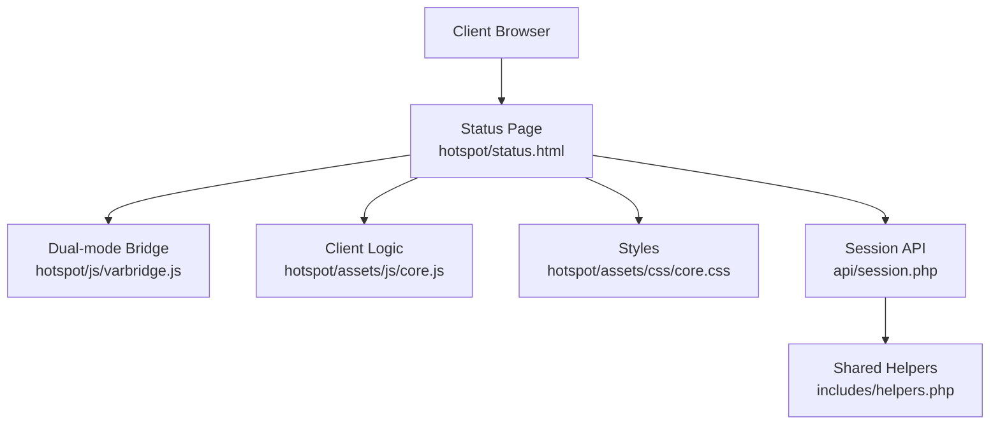
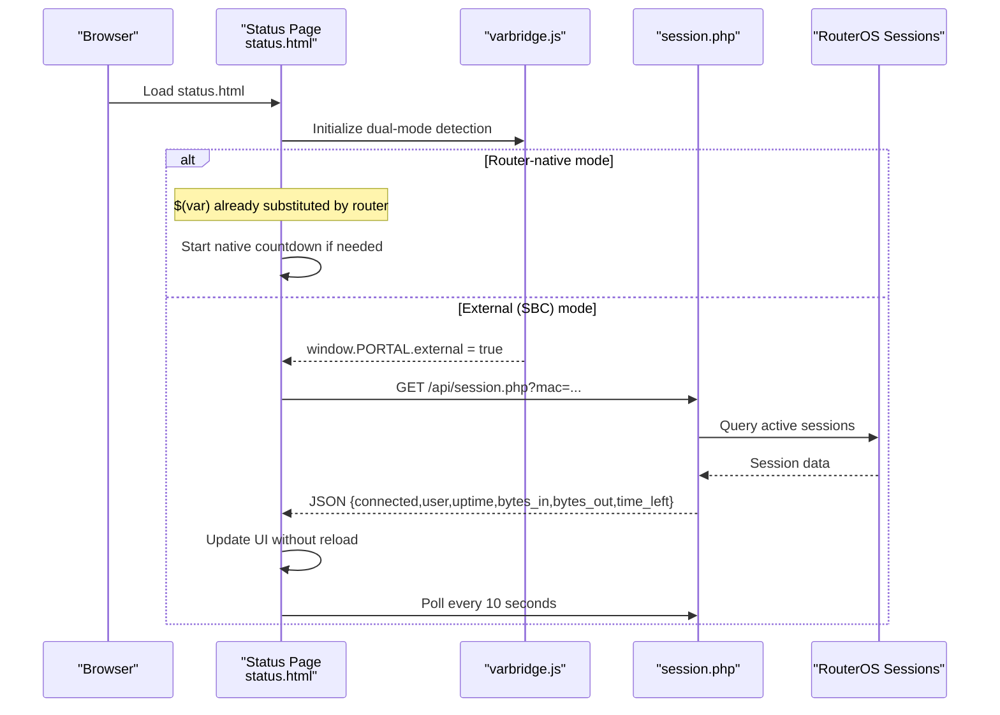
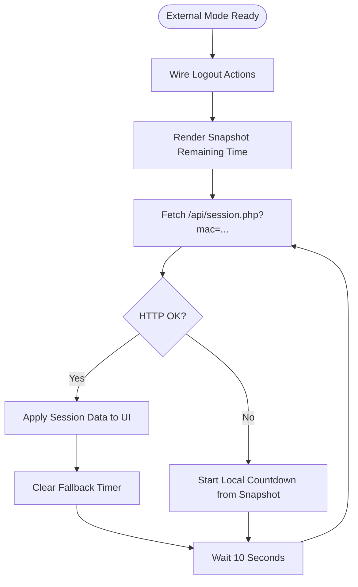
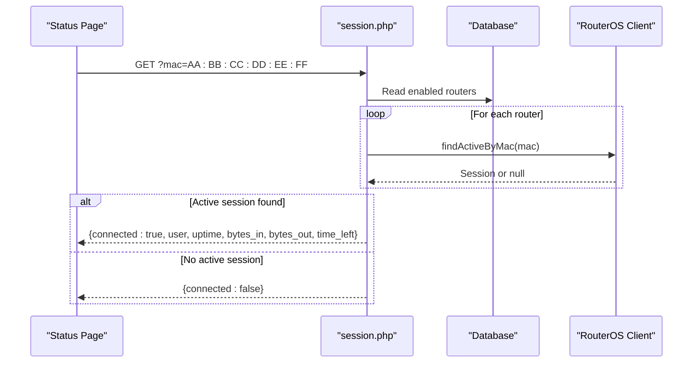
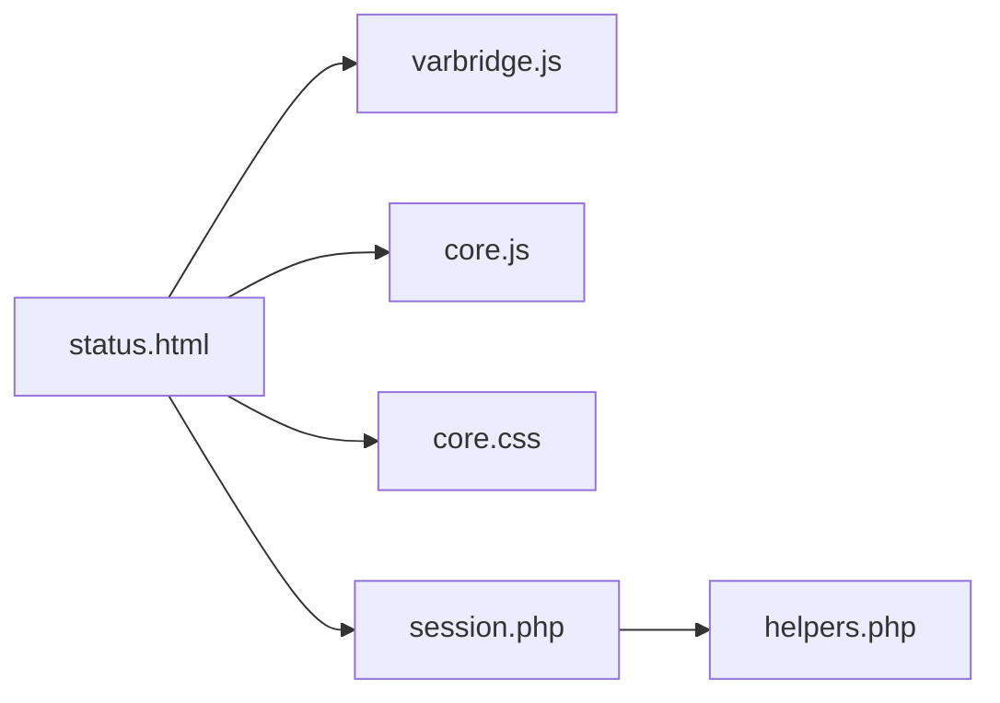

# Status Display & Session Monitoring

<cite>
**Referenced Files in This Document**   
- [hotspot/status.html](file://hotspot/status.html)
- [api/session.php](file://api/session.php)
- [hotspot/js/varbridge.js](file://hotspot/js/varbridge.js)
- [hotspot/assets/js/core.js](file://hotspot/assets/js/core.js)
- [hotspot/assets/css/core.css](file://hotspot/assets/css/core.css)
- [includes/helpers.php](file://includes/helpers.php)
</cite>

## Table of Contents
1. [Introduction](#introduction)
2. [Project Structure](#project-structure)
3. [Core Components](#core-components)
4. [Architecture Overview](#architecture-overview)
5. [Detailed Component Analysis](#detailed-component-analysis)
6. [Dependency Analysis](#dependency-analysis)
7. [Performance Considerations](#performance-considerations)
8. [Troubleshooting Guide](#troubleshooting-guide)
9. [Conclusion](#conclusion)

## Introduction
This document explains the status display and session monitoring functionality for the captive portal. It covers how the status page shows connection state, remaining time, data usage, uptime, and current session information; how real-time polling updates the UI without full page refreshes; how the external-mode integration with `/api/session.php` works; and how error states and disconnections are handled.

The implementation supports two operating modes:
- Router-native mode: the MikroTik router serves the HTML and substitutes `$(var)` tokens directly.
- External (SBC/lighttpd) mode: the same HTML is served by an application server, where a bridge script patches literal tokens and a JavaScript poller fetches live session data from the API.

## Project Structure
The status display and session monitoring span a small set of focused files:
- The status page template renders the user-facing dashboard.
- A dual-mode bridge detects whether the page is served by the router or the SBC and prepares runtime context.
- An unauthenticated JSON endpoint returns current session data for a given MAC address.
- Shared helpers provide JSON responses and formatting utilities.
- Core client-side logic handles timers, UI updates, and fallback behavior.

**Diagram sources**
- [hotspot/status.html:1-571](file://hotspot/status.html#L1-L571)
- [hotspot/js/varbridge.js:1-239](file://hotspot/js/varbridge.js#L1-L239)
- [hotspot/assets/js/core.js:1-959](file://hotspot/assets/js/core.js#L1-L959)
- [hotspot/assets/css/core.css:1-29](file://hotspot/assets/css/core.css#L1-L29)
- [api/session.php:1-107](file://api/session.php#L1-L107)
- [includes/helpers.php:1-97](file://includes/helpers.php#L1-L97)

**Section sources**
- [hotspot/status.html:1-571](file://hotspot/status.html#L1-L571)
- [hotspot/js/varbridge.js:1-239](file://hotspot/js/varbridge.js#L1-L239)
- [hotspot/assets/js/core.js:1-959](file://hotspot/assets/js/core.js#L1-L959)
- [hotspot/assets/css/core.css:1-29](file://hotspot/assets/css/core.css#L1-L29)
- [api/session.php:1-107](file://api/session.php#L1-L107)
- [includes/helpers.php:1-97](file://includes/helpers.php#L1-L97)

## Core Components
- Status page (`hotspot/status.html`)
  - Renders connection status, IP/MAC, voucher username, remaining time, expiration time, upload/download data usage, optional uptime, and action buttons.
  - Contains both router-native countdown logic and external-mode polling logic guarded by a dual-mode flag.
- Dual-mode bridge (`hotspot/js/varbridge.js`)
  - Detects external mode, exposes `window.PORTAL`, and patches literal `$(var)` tokens into the DOM so the page renders correctly when not served by the router.
- Session API (`api/session.php`)
  - Accepts a normalized MAC parameter and returns a JSON object describing whether the client is connected, plus session fields such as user, uptime, bytes_in, bytes_out, and time_left.
- Client logic (`hotspot/assets/js/core.js`)
  - Manages UI interactions, coin slot flows, promo rates, charging stations, and general portal behaviors. It also contains shared formatting helpers used by the status page.
- Styles (`hotspot/assets/css/core.css`)
  - Provides a spinner overlay and utility classes used during asynchronous operations.
- Helpers (`includes/helpers.php`)
  - JSON response helper and formatting functions used by the API layer.

**Section sources**
- [hotspot/status.html:57-339](file://hotspot/status.html#L57-L339)
- [hotspot/js/varbridge.js:16-103](file://hotspot/js/varbridge.js#L16-L103)
- [api/session.php:21-107](file://api/session.php#L21-L107)
- [hotspot/assets/js/core.js:1-226](file://hotspot/assets/js/core.js#L1-L226)
- [hotspot/assets/css/core.css:1-29](file://hotspot/assets/css/core.css#L1-L29)
- [includes/helpers.php:22-81](file://includes/helpers.php#L22-L81)

## Architecture Overview
The status display has two paths depending on deployment mode.

**Diagram sources**
- [hotspot/status.html:461-559](file://hotspot/status.html#L461-L559)
- [hotspot/js/varbridge.js:56-103](file://hotspot/js/varbridge.js#L56-L103)
- [api/session.php:58-106](file://api/session.php#L58-L106)

## Detailed Component Analysis

### Status Page: Connection State, Time, Data Usage, and Session Info
The status page displays:
- Connection indicator text updated by the active mode.
- IP and MAC addresses injected via router variables or patched by the bridge.
- Voucher username shown prominently.
- Remaining time countdown.
- Expiration time derived from local data or API snapshot.
- Upload and download byte counters.
- Optional uptime section visible only in external mode.

Key elements:
- Connection status label and blinking class.
- Username field.
- Remaining time element.
- Expiration time element.
- Bytes-in and bytes-out elements.
- Uptime container hidden until live data arrives.

Responsive layout uses Bootstrap grid classes to arrange content across devices.

**Section sources**
- [hotspot/status.html:66-135](file://hotspot/status.html#L66-L135)

### Real-Time Polling Mechanism (External Mode)
In external mode, the status page polls `/api/session.php` every 10 seconds to update the UI without reloading the page. The flow:
1. On load, wire logout actions and render initial remaining time from URL snapshot.
2. Immediately call the session API.
3. On success, clear any fallback timer and apply session data to the DOM.
4. If the API fails, start a local fallback countdown based on the snapshot.
5. Repeat polling every 10 seconds.

**Diagram sources**
- [hotspot/status.html:501-558](file://hotspot/status.html#L501-L558)

**Section sources**
- [hotspot/status.html:461-559](file://hotspot/status.html#L461-L559)

### Session API Integration
The session endpoint provides read-only session data for the caller’s own MAC address:
- Input: `mac` query parameter (normalized).
- Output: JSON object including `connected`, `user`, `uptime`, `bytes_in`, `bytes_out`, and optionally `time_left`.
- Behavior:
  - Iterates enabled routers and queries each for an active session matching the MAC.
  - Returns `{connected:false}` when no active session is found or on database/setup errors.
  - Returns `{connected:true,...}` with session fields when found.
  - Uses CORS headers to allow browser calls from the status page.

**Diagram sources**
- [api/session.php:58-106](file://api/session.php#L58-L106)

**Section sources**
- [api/session.php:1-107](file://api/session.php#L1-L107)
- [includes/helpers.php:22-38](file://includes/helpers.php#L22-L38)

### Dual-Mode Bridge and Token Patching
The bridge script ensures the same HTML works in both router-native and external modes:
- Detects external mode by presence of a `login` query param or literal `$(var)` tokens.
- Publishes `window.PORTAL` with parameters, status/login URLs, and helpers.
- Patches literal tokens in text nodes and attributes.
- Strips conditional markers and handles error blocks.

This allows the status page to render meaningful values even when served by lighttpd.

**Section sources**
- [hotspot/js/varbridge.js:16-103](file://hotspot/js/varbridge.js#L16-L103)
- [hotspot/js/varbridge.js:109-236](file://hotspot/js/varbridge.js#L109-L236)

### Status Indicators, Timer Countdowns, and Responsive Design
- Status indicators:
  - Connection status label with a blinking class.
  - Uptime visibility toggled when live data arrives.
- Timer countdowns:
  - Router-native mode uses a per-second interval to decrement remaining time and triggers logout after timeout.
  - External mode uses a snapshot-based fallback countdown when the API is unreachable.
- Responsive design:
  - Bootstrap grid organizes columns for different screen sizes.
  - Modal dialogs and progress bars adapt to device width.

**Section sources**
- [hotspot/status.html:84-135](file://hotspot/status.html#L84-L135)
- [hotspot/status.html:348-383](file://hotspot/status.html#L348-L383)
- [hotspot/status.html:517-526](file://hotspot/status.html#L517-L526)

### Error States and Disconnection Handling
- Router-native mode:
  - When remaining time reaches zero, a success toast is shown and the page submits a logout form after a delay.
  - Expiration time falls back to stored validity or shows “Not Available” when unavailable.
- External mode:
  - If the session API reports `connected=false`, the page redirects to the login URL.
  - If the API request fails, a local fallback countdown starts from the snapshot.
  - Network or HTTP errors trigger fallback behavior rather than breaking the UI.

**Section sources**
- [hotspot/status.html:365-380](file://hotspot/status.html#L365-L380)
- [hotspot/status.html:432-447](file://hotspot/status.html#L432-L447)
- [hotspot/status.html:528-549](file://hotspot/status.html#L528-L549)

## Dependency Analysis
The status display depends on:
- The dual-mode bridge for token substitution and runtime context.
- The session API for live session data in external mode.
- Shared helpers for JSON responses and formatting.
- Bootstrap and core styles for layout and loading indicators.
- Core client logic for broader portal features and shared utilities.

**Diagram sources**
- [hotspot/status.html:1-571](file://hotspot/status.html#L1-L571)
- [hotspot/js/varbridge.js:1-239](file://hotspot/js/varbridge.js#L1-L239)
- [hotspot/assets/js/core.js:1-959](file://hotspot/assets/js/core.js#L1-L959)
- [hotspot/assets/css/core.css:1-29](file://hotspot/assets/css/core.css#L1-L29)
- [api/session.php:1-107](file://api/session.php#L1-L107)
- [includes/helpers.php:1-97](file://includes/helpers.php#L1-L97)

**Section sources**
- [hotspot/status.html:1-571](file://hotspot/status.html#L1-L571)
- [hotspot/js/varbridge.js:1-239](file://hotspot/js/varbridge.js#L1-L239)
- [hotspot/assets/js/core.js:1-959](file://hotspot/assets/js/core.js#L1-L959)
- [hotspot/assets/css/core.css:1-29](file://hotspot/assets/css/core.css#L1-L29)
- [api/session.php:1-107](file://api/session.php#L1-L107)
- [includes/helpers.php:1-97](file://includes/helpers.php#L1-L97)

## Performance Considerations
- Polling interval:
  - External mode polls every 10 seconds, balancing responsiveness with server load.
- Fallback countdown:
  - Avoids unnecessary API calls when the endpoint is unreachable, preserving battery and bandwidth.
- DOM updates:
  - Minimal updates to specific elements reduce reflow cost.
- Caching:
  - The session API sets cache-control headers to prevent stale data.
- Conditional rendering:
  - Uptime and data usage sections are shown only when relevant to avoid unnecessary UI work.

[No sources needed since this section provides general guidance]

## Troubleshooting Guide
Common issues and resolutions:
- Status page shows literal `$(var)` tokens:
  - Ensure the bridge script loads before inline scripts that read `window.PORTAL`.
  - Verify external mode detection and token patching are running.
- Remaining time does not count down:
  - In router-native mode, check that the countdown interval is initialized and not interrupted.
  - In external mode, verify the session API responds and the snapshot parameter is present.
- Connection status remains disconnected:
  - Confirm the MAC parameter is correct and normalized.
  - Check that at least one enabled router has an active session for the MAC.
- UI freezes or spinner remains visible:
  - Inspect AJAX calls and ensure error handlers hide the spinner.
  - Validate network connectivity to vendor endpoints and the session API.

**Section sources**
- [hotspot/js/varbridge.js:56-103](file://hotspot/js/varbridge.js#L56-L103)
- [hotspot/status.html:348-383](file://hotspot/status.html#L348-L383)
- [hotspot/status.html:517-558](file://hotspot/status.html#L517-L558)
- [api/session.php:50-56](file://api/session.php#L50-L56)
- [api/session.php:58-87](file://api/session.php#L58-L87)

## Conclusion
The status display and session monitoring system provides a responsive, real-time view of connection state, time remaining, data usage, and session details. It operates seamlessly in both router-native and external modes, using a dual-mode bridge and a lightweight polling mechanism to keep the UI current without full page reloads. Robust fallbacks and clear error handling ensure a reliable user experience even under network instability or API failures.

[No sources needed since this section summarizes without analyzing specific files]