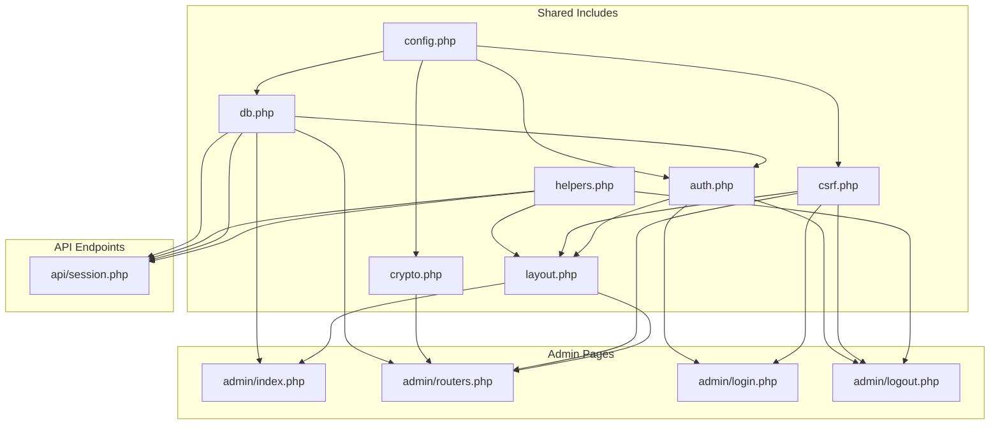
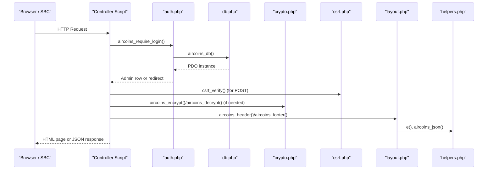
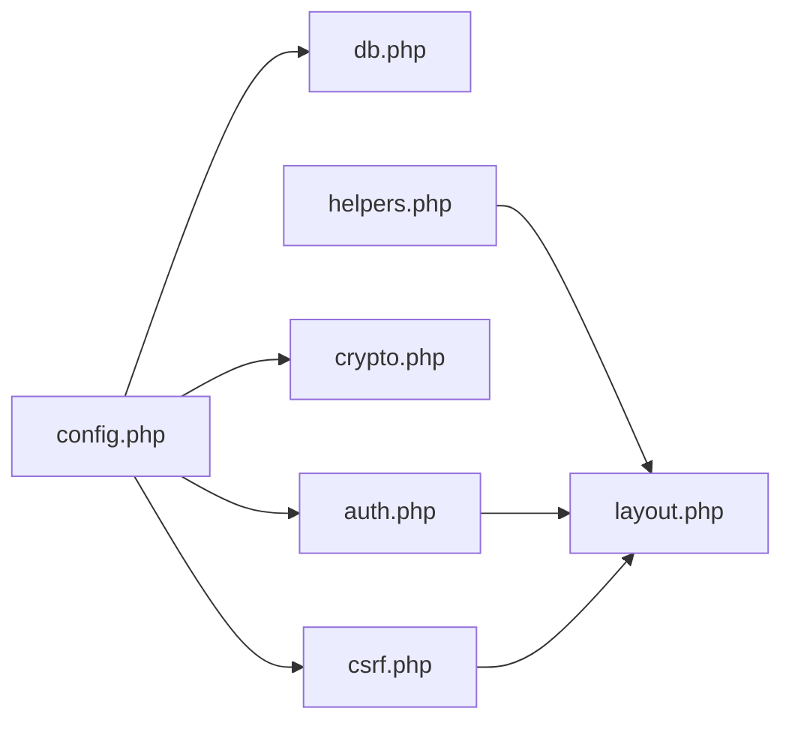

# Core Libraries & Utilities

<cite>
**Referenced Files in This Document**   
- [helpers.php](file://includes/helpers.php)
- [config.php](file://includes/config.php)
- [layout.php](file://includes/layout.php)
- [db.php](file://includes/db.php)
- [auth.php](file://includes/auth.php)
- [crypto.php](file://includes/crypto.php)
- [csrf.php](file://includes/csrf.php)
- [index.php](file://admin/index.php)
- [routers.php](file://admin/routers.php)
- [login.php](file://admin/login.php)
- [logout.php](file://admin/logout.php)
- [session.php](file://api/session.php)
</cite>

## Table of Contents
1. [Introduction](#introduction)
2. [Project Structure](#project-structure)
3. [Core Components](#core-components)
4. [Architecture Overview](#architecture-overview)
5. [Detailed Component Analysis](#detailed-component-analysis)
6. [Dependency Analysis](#dependency-analysis)
7. [Performance Considerations](#performance-considerations)
8. [Troubleshooting Guide](#troubleshooting-guide)
9. [Conclusion](#conclusion)
10. [Appendices](#appendices)

## Introduction
This document explains the core library components that provide shared functionality across the application. It focuses on:
- Helper utilities for escaping, JSON responses, and data formatting
- The centralized layout rendering system used by admin pages
- Centralized configuration management and environment-style overrides
- Database persistence and schema initialization
- Authentication, session hardening, rate limiting, CSRF protection, and audit logging
- Encrypted storage of router credentials using libsodium
- File structure conventions, naming patterns, and extension points
- Performance considerations and best practices for using these core libraries effectively

The goal is to help both new contributors and experienced developers understand how the shared layer works and how to extend it safely.

## Project Structure
At a high level, the repository separates concerns into:
- `includes/`: Shared PHP libraries (configuration, helpers, database, authentication, crypto, CSRF, layout)
- `admin/`: Admin UI entry points that consume the shared libraries
- `api/`: Public-facing API endpoints that use shared libraries without requiring admin authentication
- `hotspot/`, `deploy/`, `router-stubs/`: Portal assets, deployment scripts, and router templates

**Diagram sources**
- [config.php:1-44](file://includes/config.php#L1-L44)
- [db.php:1-117](file://includes/db.php#L1-L117)
- [auth.php:1-282](file://includes/auth.php#L1-L282)
- [crypto.php:1-138](file://includes/crypto.php#L1-L138)
- [csrf.php:1-68](file://includes/csrf.php#L1-L68)
- [helpers.php:1-97](file://includes/helpers.php#L1-L97)
- [layout.php:1-176](file://includes/layout.php#L1-L176)
- [index.php:1-154](file://admin/index.php#L1-L154)
- [routers.php:1-455](file://admin/routers.php#L1-L455)
- [login.php:1-114](file://admin/login.php#L1-L114)
- [logout.php:1-43](file://admin/logout.php#L1-L43)
- [session.php:1-107](file://api/session.php#L1-L107)

**Section sources**
- [config.php:1-44](file://includes/config.php#L1-L44)
- [db.php:1-117](file://includes/db.php#L1-L117)
- [auth.php:1-282](file://includes/auth.php#L1-L282)
- [crypto.php:1-138](file://includes/crypto.php#L1-L138)
- [csrf.php:1-68](file://includes/csrf.php#L1-L68)
- [helpers.php:1-97](file://includes/helpers.php#L1-L97)
- [layout.php:1-176](file://includes/layout.php#L1-L176)
- [index.php:1-154](file://admin/index.php#L1-L154)
- [routers.php:1-455](file://admin/routers.php#L1-L455)
- [login.php:1-114](file://admin/login.php#L1-L114)
- [logout.php:1-43](file://admin/logout.php#L1-L43)
- [session.php:1-107](file://api/session.php#L1-L107)

## Core Components
The core libraries are small, dependency-free PHP modules designed to be required from any entry point. They provide:

- Configuration constants with safe defaults and override guards
- Helpers for HTML escaping, JSON responses, and human-readable formatting
- SQLite persistence with a singleton PDO connection and idempotent schema creation
- Authentication with Argon2id/bcrypt hashing, hardened sessions, idle timeouts, and per-IP login rate limiting
- CSRF protection via per-session tokens and timing-safe verification
- Encrypted credential storage using libsodium secretbox
- A shared admin layout with navigation, top bar, flash messages, and consistent chrome

These components are intentionally cohesive and loosely coupled through well-defined function contracts.

**Section sources**
- [config.php:1-44](file://includes/config.php#L1-L44)
- [helpers.php:1-97](file://includes/helpers.php#L1-L97)
- [db.php:1-117](file://includes/db.php#L1-L117)
- [auth.php:1-282](file://includes/auth.php#L1-L282)
- [csrf.php:1-68](file://includes/csrf.php#L1-L68)
- [crypto.php:1-138](file://includes/crypto.php#L1-L138)
- [layout.php:1-176](file://includes/layout.php#L1-L176)

## Architecture Overview
The application follows a simple request-driven architecture:
- Entry points (`admin/*` and `api/*`) bootstrap shared includes
- Controllers perform validation, call services/helpers, and render views or return JSON
- Shared libraries encapsulate cross-cutting concerns: config, DB, auth, CSRF, crypto, helpers, layout

**Diagram sources**
- [auth.php:192-231](file://includes/auth.php#L192-L231)
- [db.php:23-48](file://includes/db.php#L23-L48)
- [csrf.php:48-67](file://includes/csrf.php#L48-L67)
- [crypto.php:91-137](file://includes/crypto.php#L91-L137)
- [layout.php:82-175](file://includes/layout.php#L82-L175)
- [helpers.php:17-38](file://includes/helpers.php#L17-L38)

## Detailed Component Analysis

### Helper Utilities
Helpers provide common functions used across admin and API code:
- HTML escaping helper for safe output
- JSON response emitter that sets headers and exits
- Human-friendly formatters for bytes and durations
- Simple router lookup helper for the routers table

Key responsibilities:
- Prevent XSS by escaping user-controlled values before output
- Standardize JSON responses with proper content type and error fallback
- Provide readable representations of numeric metrics

Best practices:
- Always escape dynamic values with the escaping helper when rendering HTML
- Use the JSON helper for API endpoints to ensure consistent responses
- Prefer formatter helpers for display logic instead of ad-hoc formatting

**Section sources**
- [helpers.php:17-20](file://includes/helpers.php#L17-L20)
- [helpers.php:28-38](file://includes/helpers.php#L28-L38)
- [helpers.php:46-63](file://includes/helpers.php#L46-L63)
- [helpers.php:71-81](file://includes/helpers.php#L71-L81)
- [helpers.php:90-96](file://includes/helpers.php#L90-L96)

### Layout Rendering System
The layout module provides shared admin chrome:
- Flash message queueing and consumption
- Current username resolution
- Header/footer rendering with navigation rail, top bar, and footer
- Integration with CSRF and helpers

Design principles:
- Pure presentation: no business logic beyond reading session state
- Consistent UX across admin pages
- Self-contained assets and no external dependencies

Usage pattern:
- Call header with title and active nav key
- Render page-specific markup inside main
- Call footer to close the document

Flash messaging:
- Queue one-shot messages before redirects
- Messages are consumed once during header rendering

**Section sources**
- [layout.php:29-57](file://includes/layout.php#L29-L57)
- [layout.php:64-71](file://includes/layout.php#L64-L71)
- [layout.php:82-175](file://includes/layout.php#L82-L175)

### Centralized Configuration Management
Configuration is defined in a single file with sensible defaults and override guards:
- Database path
- Encryption key file path
- Session cookie name
- Idle timeout
- Rate-limit maximum attempts and window

Override strategy:
- Constants are guarded so test harnesses or bootstrap files can define them before inclusion
- No framework or Composer dependency; plain PHP 8

Operational guidance:
- Place sensitive paths outside the web root
- Ensure the key file exists and is readable by the web server
- Tune idle timeout and rate limits according to your security policy

**Section sources**
- [config.php:15-43](file://includes/config.php#L15-L43)

### Database Persistence Layer
The database module provides:
- Lazy singleton PDO connection to SQLite
- WAL mode, busy timeout, synchronous settings, and foreign keys enabled
- Idempotent schema creation for all tables and indexes

Tables include:
- Admins
- Routers
- Login attempts
- Audit log
- Monitor samples

Connection characteristics:
- Exception error mode
- Associative fetch mode
- Native prepared statements (no emulation)

Schema design:
- All DDL uses CREATE TABLE IF NOT EXISTS
- Indexes improve query performance for login attempts and monitor samples

**Section sources**
- [db.php:23-48](file://includes/db.php#L23-L48)
- [db.php:56-116](file://includes/db.php#L56-L116)

### Authentication, Sessions, and Security
Authentication and session handling include:
- Password hashing with Argon2id when available, falling back to bcrypt
- Verification and automatic rehashing to stronger algorithms
- Hardened session cookies (HTTP-only, SameSite=Strict, Secure over TLS)
- Per-IP login rate limiting using the login_attempts table
- Idle timeout enforcement and session regeneration
- Audit logging for privileged actions

Security features:
- Timing-safe CSRF token comparison
- One-shot flash messages to avoid leaking state
- Redirect helpers for unauthenticated access

Flow highlights:
- Login checks rate limit, verifies credentials, migrates weak hashes, regenerates session ID, clears failed attempts
- Require login enforces idle timeout and reloads admin row from DB

**Section sources**
- [auth.php:23-57](file://includes/auth.php#L23-L57)
- [auth.php:65-83](file://includes/auth.php#L65-L83)
- [auth.php:103-138](file://includes/auth.php#L103-L138)
- [auth.php:151-190](file://includes/auth.php#L151-L190)
- [auth.php:202-231](file://includes/auth.php#L202-L231)
- [auth.php:269-281](file://includes/auth.php#L269-L281)

### CSRF Protection
CSRF protection ensures state-changing requests carry a valid token:
- Token generation stored per session
- Hidden field rendering for forms
- Verification aborts non-POST or mismatched tokens with 403

Integration:
- Used by login, logout, and router management forms
- Works with session start helpers

**Section sources**
- [csrf.php:21-30](file://includes/csrf.php#L21-L30)
- [csrf.php:37-40](file://includes/csrf.php#L37-L40)
- [csrf.php:48-67](file://includes/csrf.php#L48-L67)

### Encrypted Credential Storage
Router passwords are encrypted at rest using libsodium secretbox:
- Key loading supports raw binary, hex, or base64 formats
- Encrypt returns base64(nonce || ciphertext)
- Decrypt validates payload length and integrity

Safety guarantees:
- Plaintext never persisted
- Decryption occurs only in memory for the lifetime of an API request
- Errors thrown for missing key, malformed input, or tampered data

**Section sources**
- [crypto.php:25-48](file://includes/crypto.php#L25-L48)
- [crypto.php:57-82](file://includes/crypto.php#L57-L82)
- [crypto.php:91-102](file://includes/crypto.php#L91-L102)
- [crypto.php:111-137](file://includes/crypto.php#L111-L137)

### Admin Entry Points and Control Flow
Admin pages demonstrate how to use the core libraries:
- Dashboard lists enabled routers and integrates with monitoring
- Router management performs CRUD operations, tests connections, and auto-detects API types
- Login and logout enforce CSRF and audit events

Patterns:
- Require login at the top of protected pages
- Use schema initialization to ensure tables exist
- Use flash messages for user feedback
- Use CSRF verification for all POST handlers

**Section sources**
- [index.php:14-38](file://admin/index.php#L14-L38)
- [index.php:38-154](file://admin/index.php#L38-L154)
- [routers.php:17-34](file://admin/routers.php#L17-L34)
- [routers.php:47-224](file://admin/routers.php#L47-L224)
- [routers.php:226-262](file://admin/routers.php#L226-L262)
- [login.php:14-62](file://admin/login.php#L14-L62)
- [logout.php:13-43](file://admin/logout.php#L13-L43)

### Public API Endpoint
The portal-facing session endpoint:
- Accepts MAC address parameter and normalizes it
- Iterates enabled routers to find active sessions
- Returns JSON with connection status and session details
- Uses CORS headers for browser-based polling from the hotspot status page

Error handling:
- Invalid MAC returns a clear error
- Unreachable routers are skipped silently
- Database errors do not leak stack traces

**Section sources**
- [session.php:23-48](file://api/session.php#L23-L48)
- [session.php:50-83](file://api/session.php#L50-L83)
- [session.php:85-106](file://api/session.php#L85-L106)

## Dependency Analysis
The core libraries have clear dependency boundaries:
- Config has no internal dependencies
- Helpers depend only on PHP built-ins
- DB depends on config
- Auth depends on config and db
- CSRF depends on config, helpers, and auth
- Crypto depends on config
- Layout depends on helpers, auth, and csrf

**Diagram sources**
- [config.php:1-44](file://includes/config.php#L1-L44)
- [helpers.php:1-97](file://includes/helpers.php#L1-L97)
- [db.php:12-12](file://includes/db.php#L12-L12)
- [auth.php:14-15](file://includes/auth.php#L14-L15)
- [csrf.php:12-14](file://includes/csrf.php#L12-L14)
- [crypto.php:15-15](file://includes/crypto.php#L15-L15)
- [layout.php:16-18](file://includes/layout.php#L16-L18)

**Section sources**
- [config.php:1-44](file://includes/config.php#L1-L44)
- [helpers.php:1-97](file://includes/helpers.php#L1-L97)
- [db.php:12-12](file://includes/db.php#L12-L12)
- [auth.php:14-15](file://includes/auth.php#L14-L15)
- [csrf.php:12-14](file://includes/csrf.php#L12-L14)
- [crypto.php:15-15](file://includes/crypto.php#L15-L15)
- [layout.php:16-18](file://includes/layout.php#L16-L18)

## Performance Considerations
- Database
  - SQLite WAL mode improves concurrency
  - Busy timeout reduces lock contention
  - Indexes on login attempts and monitor samples optimize queries
  - Singleton PDO avoids repeated connection overhead
- Authentication
  - Argon2id preferred for stronger hashing; bcrypt fallback maintains compatibility
  - Automatic rehashing on successful login upgrades legacy hashes
  - Idle timeout prevents long-lived stale sessions
- CSRF
  - Timing-safe comparison avoids side-channel leaks
- Crypto
  - Key caching avoids repeated disk reads
  - Decryption only in memory for request lifetime
- Helpers
  - JSON helper sets headers once and exits, reducing unnecessary processing
- Layout
  - Minimal DOM and self-contained assets reduce client-side load

Best practices:
- Keep database queries minimal and parameterized
- Avoid heavy computations in request path; offload where possible
- Cache static configuration and keys within process lifetime
- Use flash messages sparingly to reduce session writes

[No sources needed since this section provides general guidance]

## Troubleshooting Guide
Common issues and resolutions:
- Missing or unreadable encryption key
  - Symptom: runtime exception indicating key file missing or unreadable
  - Resolution: ensure the key file path is correct and readable by the web server
- Sodium extension not installed
  - Symptom: exceptions stating sodium extension is required
  - Resolution: install and enable the sodium PHP extension
- CSRF validation failures
  - Symptom: 403 response or “CSRF validation failed”
  - Resolution: ensure forms include the hidden CSRF field and that sessions are started
- Login rate limiting
  - Symptom: temporary lockout after multiple failed attempts
  - Resolution: wait for the configured rate window to expire; verify IP source
- Session expiration
  - Symptom: redirect to login with timeout notice
  - Resolution: adjust idle timeout constant if appropriate; ensure secure cookie settings match deployment
- Database setup errors
  - Symptom: schema creation fails due to permissions or directory issues
  - Resolution: ensure parent directory of the SQLite file is writable by the web server

**Section sources**
- [crypto.php:32-48](file://includes/crypto.php#L32-L48)
- [crypto.php:91-102](file://includes/crypto.php#L91-L102)
- [crypto.php:111-137](file://includes/crypto.php#L111-L137)
- [csrf.php:48-67](file://includes/csrf.php#L48-L67)
- [auth.php:103-138](file://includes/auth.php#L103-L138)
- [auth.php:202-231](file://includes/auth.php#L202-L231)
- [db.php:30-47](file://includes/db.php#L30-L47)

## Conclusion
The core libraries provide a robust, secure, and maintainable foundation for the application. They centralize configuration, protect against common web vulnerabilities, manage persistent state efficiently, and offer consistent UI chrome. By following the established patterns—parameterized queries, CSRF verification, encrypted secrets, and structured helpers—you can extend the system safely and predictably.

[No sources needed since this section summarizes without analyzing specific files]

## Appendices

### Extending the Core Libraries
To add new functionality:
- Create a new file under `includes/` with a focused responsibility
- Follow the existing naming convention: snake_case filenames and descriptive function names prefixed appropriately
- Depend only on necessary modules; avoid circular dependencies
- Use helpers for escaping and JSON responses
- Integrate with auth and CSRF where state changes occur
- Add tests or bootstrap overrides via config constants if needed

Coding standards:
- Strict typing enabled at the top of each file
- Defensive input validation and null checks
- Clear function documentation describing parameters and return values
- Avoid global state except for configuration constants and lazy-initialized resources

Examples of extending:
- Add a new helper for date formatting and reuse it in admin pages
- Implement a new service that interacts with routers via the factory interface
- Extend audit logging with additional action categories

[No sources needed since this section provides general guidance]