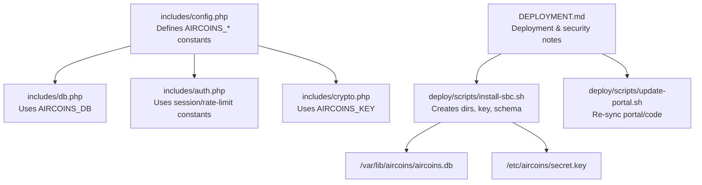
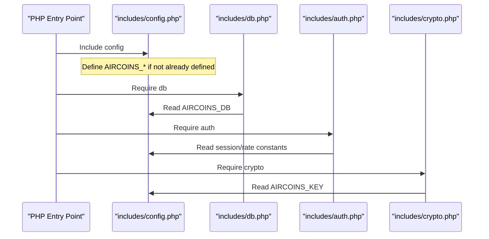
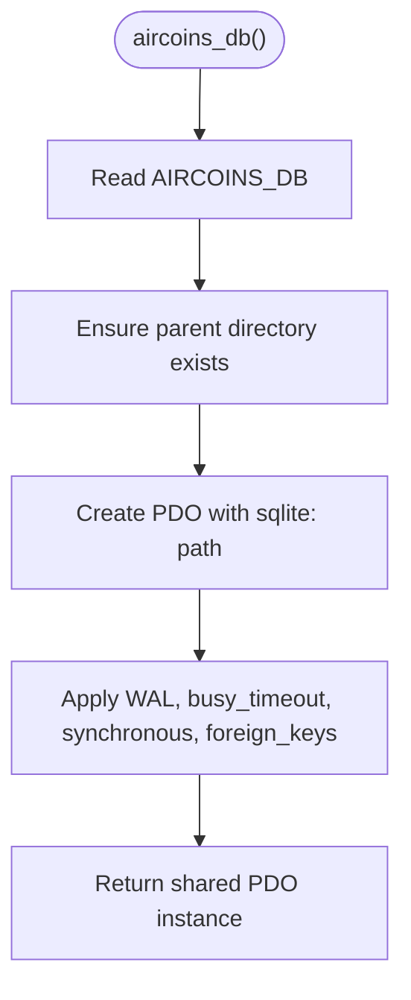
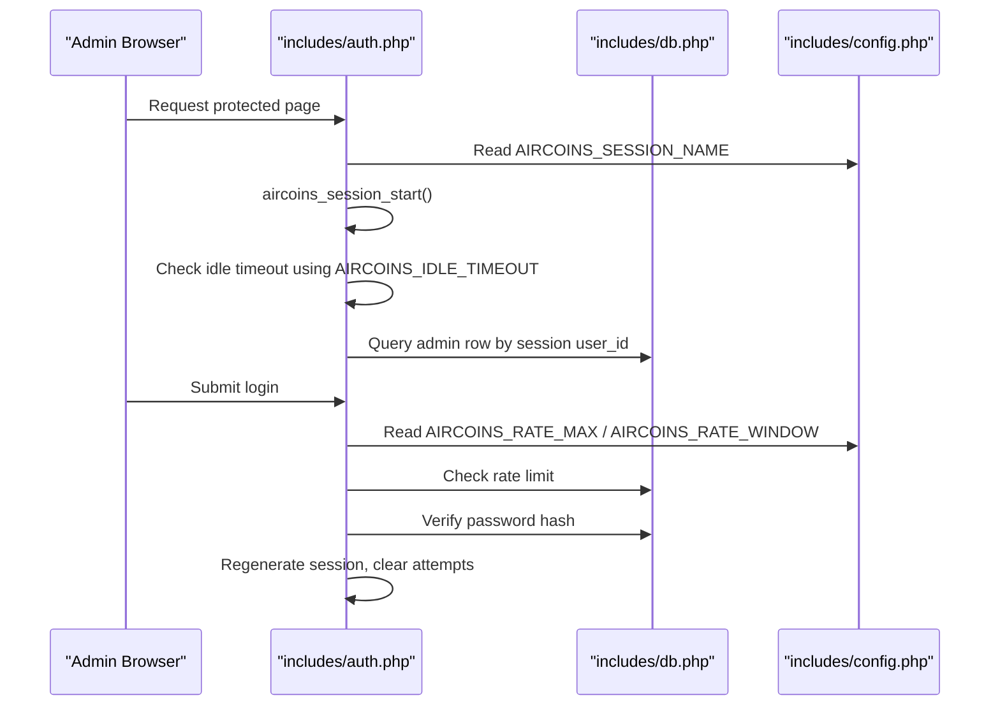
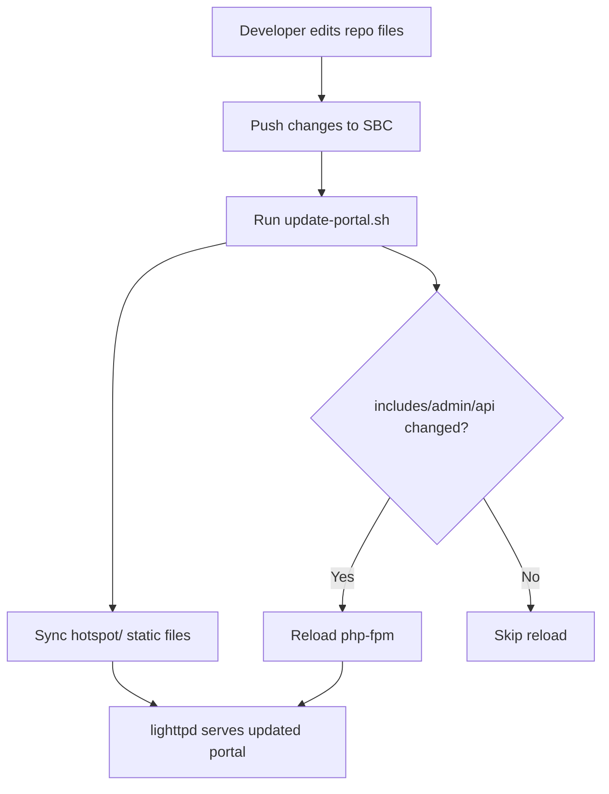
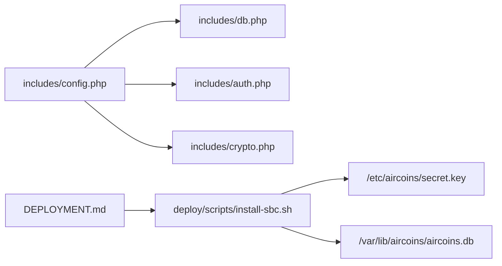

# Configuration Management

<cite>
**Referenced Files in This Document**
- [config.php](file://includes/config.php)
- [db.php](file://includes/db.php)
- [auth.php](file://includes/auth.php)
- [crypto.php](file://includes/crypto.php)
- [install-sbc.sh](file://deploy/scripts/install-sbc.sh)
- [update-portal.sh](file://deploy/scripts/update-portal.sh)
- [DEPLOYMENT.md](file://DEPLOYMENT.md)
</cite>

## Table of Contents
1. [Introduction](#introduction)
2. [Project Structure](#project-structure)
3. [Core Components](#core-components)
4. [Architecture Overview](#architecture-overview)
5. [Detailed Component Analysis](#detailed-component-analysis)
6. [Dependency Analysis](#dependency-analysis)
7. [Performance Considerations](#performance-considerations)
8. [Troubleshooting Guide](#troubleshooting-guide)
9. [Conclusion](#conclusion)
10. [Appendices](#appendices)

## Introduction
This document explains how configuration is managed across the MT-CONTROLLER-PISOWIFI system, with a focus on the centralized configuration file, environment-specific settings, runtime overrides, update behavior, and safe modification practices. It also covers security-sensitive configuration such as database paths, encryption keys, session naming, idle timeouts, and rate-limiting parameters.

The system uses a minimal, framework-free PHP layout where `includes/config.php` defines all core constants. Other modules read these constants at runtime rather than parsing files or environment variables directly. Deployment scripts create required directories, generate secrets, initialize the database schema, and install web server configuration.

## Project Structure
Configuration-related code lives primarily under `includes/`, while deployment and operational guidance are under `deploy/` and `DEPLOYMENT.md`. The most important configuration entry point is `includes/config.php`; it is included by other core modules such as the database layer, authentication module, and crypto utilities.

**Diagram sources**
- [config.php:15-43](file://includes/config.php#L15-L43)
- [db.php:12-30](file://includes/db.php#L12-L30)
- [auth.php:14-108](file://includes/auth.php#L14-L108)
- [crypto.php:18-36](file://includes/crypto.php#L18-L36)
- [install-sbc.sh:208-239](file://deploy/scripts/install-sbc.sh#L208-L239)
- [DEPLOYMENT.md:230-241](file://DEPLOYMENT.md#L230-L241)

**Section sources**
- [config.php:1-44](file://includes/config.php#L1-L44)
- [DEPLOYMENT.md:508-555](file://DEPLOYMENT.md#L508-L555)

## Core Components
The central configuration component is `includes/config.php`. It declares global constants using a “define-if-not-defined” guard. This allows an operator or test harness to define any constant before this file is first included, effectively enabling runtime overrides without editing the source.

Key configuration areas:
- Database path: `AIRCOINS_DB`
- Encryption key path: `AIRCOINS_KEY`
- Admin session cookie name: `AIRCOINS_SESSION_NAME`
- Idle timeout: `AIRCOINS_IDLE_TIMEOUT`
- Rate-limit maximum failures: `AIRCOINS_RATE_MAX`
- Rate-limit window seconds: `AIRCOINS_RATE_WINDOW`

These constants are consumed by:
- `includes/db.php`: reads `AIRCOINS_DB` to open SQLite.
- `includes/auth.php`: reads session and rate-limit constants for login protection.
- `includes/crypto.php`: reads `AIRCOINS_KEY` to load the libsodium secretbox key.

**Section sources**
- [config.php:15-43](file://includes/config.php#L15-L43)
- [db.php:12-30](file://includes/db.php#L12-L30)
- [auth.php:14-108](file://includes/auth.php#L14-L108)
- [crypto.php:18-36](file://includes/crypto.php#L18-L36)

## Architecture Overview
At runtime, PHP entry points (admin panel, API, or portal endpoints) include shared includes. The configuration layer is intentionally flat: there is no configuration parser, no `.env` loader, and no framework configuration object. Instead, constants are defined once and used everywhere.

**Diagram sources**
- [config.php:15-43](file://includes/config.php#L15-L43)
- [db.php:12-30](file://includes/db.php#L12-L30)
- [auth.php:14-108](file://includes/auth.php#L14-L108)
- [crypto.php:18-36](file://includes/crypto.php#L18-L36)

## Detailed Component Analysis

### Centralized Configuration (`includes/config.php`)
`includes/config.php` is the single source of truth for application-wide constants. Each constant is guarded so that it can be overridden externally before inclusion.

| Constant | Default Value | Purpose | Consumers |
|---|---|---|---|
| `AIRCOINS_DB` | `/var/lib/aircoins/aircoins.db` | Path to the SQLite database file | `includes/db.php` |
| `AIRCOINS_KEY` | `/etc/aircoins/secret.key` | Path to the 32-byte libsodium secretbox key file | `includes/crypto.php` |
| `AIRCOINS_SESSION_NAME` | `AIRCOINS_ADMIN` | Name of the admin session cookie | `includes/auth.php` |
| `AIRCOINS_IDLE_TIMEOUT` | `900` | Idle timeout in seconds before admin session expiry | `includes/auth.php`, admin endpoints |
| `AIRCOINS_RATE_MAX` | `5` | Maximum failed login attempts per window | `includes/auth.php` |
| `AIRCOINS_RATE_WINDOW` | `300` | Rate-limit window in seconds | `includes/auth.php` |

Important behaviors:
- Constants are only defined if they are not already defined. This enables pre-configuration via an external bootstrap or test harness.
- There is no validation logic in this file; consumers assume valid values. For example, `AIRCOINS_DB` must point to a writable location, and `AIRCOINS_KEY` must contain a valid key when used.

**Section sources**
- [config.php:15-43](file://includes/config.php#L15-L43)

### Database Configuration and Schema (`includes/db.php`)
The database layer requires `config.php` and uses `AIRCOINS_DB` to construct the SQLite connection. It also creates the parent directory if missing and applies performance/security pragmas such as WAL mode, busy timeout, synchronous mode, and foreign key enforcement.

Key responsibilities:
- Singleton PDO connection creation.
- Directory creation for the database file.
- SQLite PRAGMAs for concurrency and durability.
- Idempotent schema creation for admins, routers, login attempts, audit log, and monitor samples.

**Diagram sources**
- [db.php:23-47](file://includes/db.php#L23-L47)

**Section sources**
- [db.php:12-47](file://includes/db.php#L12-L47)
- [db.php:56-116](file://includes/db.php#L56-L116)

### Authentication and Session Configuration (`includes/auth.php`)
Authentication depends on several configuration constants:
- `AIRCOINS_SESSION_NAME` sets the session cookie name.
- `AIRCOINS_RATE_MAX` and `AIRCOINS_RATE_WINDOW` control login rate limiting.
- `AIRCOINS_IDLE_TIMEOUT` controls session expiration after inactivity.

Security features:
- Password hashing prefers Argon2id with bcrypt fallback.
- Sessions use HttpOnly, SameSite=Strict, and Secure cookies when TLS is detected.
- Failed login attempts are recorded and pruned.
- Successful login regenerates the session ID and clears failure counters.

**Diagram sources**
- [auth.php:65-83](file://includes/auth.php#L65-L83)
- [auth.php:103-108](file://includes/auth.php#L103-L108)
- [auth.php:151-189](file://includes/auth.php#L151-L189)
- [auth.php:202-230](file://includes/auth.php#L202-L230)

**Section sources**
- [auth.php:14-108](file://includes/auth.php#L14-L108)
- [auth.php:151-189](file://includes/auth.php#L151-L189)
- [auth.php:202-230](file://includes/auth.php#L202-L230)

### Cryptography and Secret Key Handling (`includes/crypto.php`)
The crypto module loads the libsodium secretbox key from the path defined by `AIRCOINS_KEY`. This key is used to encrypt router passwords at rest. The installation process generates this key and sets restrictive permissions.

Security implications:
- Losing `AIRCOINS_KEY` makes stored encrypted router credentials unrecoverable.
- Rotating the key invalidates existing encrypted router passwords.
- The key file should remain outside the web root and be readable only by the web server user.

**Section sources**
- [crypto.php:18-36](file://includes/crypto.php#L18-L36)
- [DEPLOYMENT.md:561-571](file://DEPLOYMENT.md#L561-L571)

### Environment-Specific Settings and Runtime Overrides
The repository does not implement a dedicated environment variable loader. Instead, configuration is controlled through:
- Predefined constants in `includes/config.php`.
- Optional external definition of those constants before including `config.php`.
- Deployment scripts that create required directories, files, and permissions.

Recommended override strategies:
- Bootstrap override: Define constants before requiring `includes/config.php`. This is explicitly supported by the “define-if-not-defined” guards.
- Deployment-time customization: Use deployment scripts and configuration templates to set paths, ports, and service names appropriate for each environment.
- Operational separation: Keep sensitive files like `/etc/aircoins/secret.key` and `/var/lib/aircoins/aircoins.db` out of version control and manage them per environment.

Note: No `.env` file is present in the repository, and the PHP code does not read `$_ENV` or `getenv()` for configuration.

**Section sources**
- [config.php:1-11](file://includes/config.php#L1-L11)
- [config.php:15-43](file://includes/config.php#L15-L43)

### Validation Rules and Defaults
Validation is not centralized in `config.php`. Consumers rely on correct values:
- `AIRCOINS_DB` must be a valid SQLite path with a writable parent directory.
- `AIRCOINS_KEY` must exist and contain a valid key when encryption is used.
- `AIRCOINS_IDLE_TIMEOUT` should be a positive integer representing seconds.
- `AIRCOINS_RATE_MAX` and `AIRCOINS_RATE_WINDOW` should be positive integers consistent with expected login protection behavior.

Best practice:
- Validate configuration early in your bootstrap or installer before loading heavy components.
- Fail fast with clear errors if required files or paths are missing.

**Section sources**
- [db.php:30-47](file://includes/db.php#L30-L47)
- [auth.php:103-108](file://includes/auth.php#L103-L108)
- [auth.php:212-216](file://includes/auth.php#L212-L216)

### Update Mechanism and Safe Modification
The repository provides two primary mechanisms for updating the deployed system:

1. **Full installation script**: `deploy/scripts/install-sbc.sh` provisions packages, copies code, installs lighttpd and php-fpm configuration, generates TLS certificates, creates the encryption key, initializes the database schema, and starts services. It is idempotent and backs up the stock lighttpd configuration.

2. **Portal/code sync script**: `deploy/scripts/update-portal.sh` re-copies portal HTML and PHP core without running the full installer. It reloads php-fpm only when `includes/`, `admin/`, or `api/` changed.

Safe modification guidelines:
- Do not edit deployed files directly under `/var/www/aircoins`. Edit files in the repository and re-sync using the provided scripts.
- Back up custom configurations before updates.
- Keep sensitive data (database, encryption key) separate from version-controlled code.
- Use the installer’s backup of the original lighttpd configuration if you need to restore web server settings.

**Diagram sources**
- [update-portal.sh:1-23](file://deploy/scripts/update-portal.sh#L1-L23)
- [DEPLOYMENT.md:453-469](file://DEPLOYMENT.md#L453-L469)

**Section sources**
- [install-sbc.sh:208-239](file://deploy/scripts/install-sbc.sh#L208-L239)
- [update-portal.sh:1-23](file://deploy/scripts/update-portal.sh#L1-L23)
- [DEPLOYMENT.md:230-241](file://DEPLOYMENT.md#L230-L241)
- [DEPLOYMENT.md:453-469](file://DEPLOYMENT.md#L453-L469)

### Backup Strategies for Custom Configurations
Recommended backups:
- Database: `/var/lib/aircoins/aircoins.db`
- Encryption key: `/etc/aircoins/secret.key`
- Web server configuration: `/etc/lighttpd/lighttpd.conf` (installer backs up the stock config as `lighttpd.conf.aircoins-bak`)
- PHP-FPM pool configuration: `/etc/php/<FPMVER>/fpm/pool.d/aircoins.conf`
- TLS certificate: `/etc/lighttpd/certs/aircoins.pem`

Operational advice:
- Back up the encryption key separately and securely; losing it invalidates encrypted router credentials.
- Store database backups off the same device if possible.
- Version-control only non-sensitive configuration templates, not secrets.

**Section sources**
- [install-sbc.sh:226-239](file://deploy/scripts/install-sbc.sh#L226-L239)
- [DEPLOYMENT.md:548-555](file://DEPLOYMENT.md#L548-L555)
- [DEPLOYMENT.md:561-571](file://DEPLOYMENT.md#L561-L571)

### Configuration Migration Scripts
There is no dedicated migration script for configuration versions. However:
- Database schema creation is idempotent (`CREATE TABLE IF NOT EXISTS`).
- Password hashing supports automatic upgrade from weaker hashes to Argon2id on successful login.
- Deployment scripts are idempotent and safe to re-run.

Migration recommendations:
- Treat schema initialization as part of deployment.
- If adding new configuration constants, add defaults in `includes/config.php` and validate them in your bootstrap or installer.
- Use deployment scripts to apply environment-specific changes rather than modifying installed files.

**Section sources**
- [db.php:56-116](file://includes/db.php#L56-L116)
- [auth.php:53-57](file://includes/auth.php#L53-L57)
- [install-sbc.sh:230-241](file://deploy/scripts/install-sbc.sh#L230-L241)

### Security and Sensitive Data Handling
Sensitive configuration is handled as follows:
- Admin passwords are hashed with Argon2id (bcrypt fallback).
- Router passwords are encrypted at rest using libsodium with the key from `AIRCOINS_KEY`.
- The encryption key file has restrictive permissions and resides outside the web root.
- Sessions use secure cookie settings.
- Login attempts are rate-limited and audited.

Security best practices:
- Never commit `/etc/aircoins/secret.key` or `/var/lib/aircoins/aircoins.db`.
- Restrict access to the admin panel to trusted networks.
- Replace self-signed TLS certificates with CA-issued certificates if the admin site is exposed beyond a private network.
- Keep firewall rules tight: only expose port 80 for the portal and port 443 for the admin panel.

**Section sources**
- [auth.php:18-57](file://includes/auth.php#L18-L57)
- [auth.php:65-83](file://includes/auth.php#L65-L83)
- [auth.php:103-108](file://includes/auth.php#L103-L108)
- [crypto.php:18-36](file://includes/crypto.php#L18-L36)
- [DEPLOYMENT.md:561-571](file://DEPLOYMENT.md#L561-L571)

## Dependency Analysis
Configuration dependencies form a simple hierarchy:
- `includes/config.php` defines constants.
- `includes/db.php` depends on `AIRCOINS_DB`.
- `includes/auth.php` depends on session and rate-limit constants.
- `includes/crypto.php` depends on `AIRCOINS_KEY`.
- Deployment scripts create required files and directories referenced by configuration.

**Diagram sources**
- [config.php:15-43](file://includes/config.php#L15-L43)
- [db.php:12-30](file://includes/db.php#L12-L30)
- [auth.php:14-108](file://includes/auth.php#L14-L108)
- [crypto.php:18-36](file://includes/crypto.php#L18-L36)
- [install-sbc.sh:208-239](file://deploy/scripts/install-sbc.sh#L208-L239)

**Section sources**
- [config.php:15-43](file://includes/config.php#L15-L43)
- [db.php:12-47](file://includes/db.php#L12-L47)
- [auth.php:14-108](file://includes/auth.php#L14-L108)
- [crypto.php:18-36](file://includes/crypto.php#L18-L36)
- [install-sbc.sh:208-239](file://deploy/scripts/install-sbc.sh#L208-L239)

## Performance Considerations
Configuration itself has negligible runtime cost. Performance considerations relevant to configuration include:
- Using a reliable SQLite path ensures efficient database access.
- Proper idle timeout balances security against administrative convenience.
- Rate-limit windows should reflect expected traffic patterns to avoid false lockouts.
- Keeping the encryption key accessible only to the web server reduces overhead and risk.

[No sources needed since this section provides general guidance]

## Troubleshooting Guide
Common configuration-related issues and resolutions:
- Database path incorrect: Ensure `AIRCOINS_DB` points to a writable directory and that the parent directory exists.
- Missing encryption key: Ensure `/etc/aircoins/secret.key` exists and has correct permissions.
- Session issues: Verify `AIRCOINS_SESSION_NAME` matches expectations and that sessions are configured correctly in the web server and PHP-FPM.
- Login lockout: Adjust `AIRCOINS_RATE_MAX` and `AIRCOINS_RATE_WINDOW` if legitimate users are being throttled.
- Service restarts: After changing PHP core files, use `update-portal.sh` to reload php-fpm; static portal changes do not require a restart.

**Section sources**
- [db.php:30-47](file://includes/db.php#L30-L47)
- [auth.php:103-108](file://includes/auth.php#L103-L108)
- [auth.php:212-216](file://includes/auth.php#L212-L216)
- [update-portal.sh:1-23](file://deploy/scripts/update-portal.sh#L1-L23)

## Conclusion
The MT-CONTROLLER-PISOWIFI configuration model is intentionally simple: a single configuration file defines constants, and other modules consume those constants. This design avoids framework complexity and makes it easy to understand what affects runtime behavior. For safe operations:
- Prefer repository-based changes and deployment scripts.
- Keep secrets out of version control.
- Back up the database and encryption key.
- Use the provided update mechanism to avoid losing customizations.
- Apply security best practices for sensitive data and deployment environments.

[No sources needed since this section summarizes without analyzing specific files]

## Appendices

### Configuration Reference Summary
| Area | Configuration | Default | Notes |
|---|---|---|---|
| Database | `AIRCOINS_DB` | `/var/lib/aircoins/aircoins.db` | SQLite path; parent directory created automatically |
| Encryption Key | `AIRCOINS_KEY` | `/etc/aircoins/secret.key` | 32-byte libsodium key; restrict permissions |
| Session | `AIRCOINS_SESSION_NAME` | `AIRCOINS_ADMIN` | Cookie name for admin sessions |
| Idle Timeout | `AIRCOINS_IDLE_TIMEOUT` | `900` seconds | Session inactivity threshold |
| Rate Limit Max | `AIRCOINS_RATE_MAX` | `5` | Failed login attempts allowed |
| Rate Limit Window | `AIRCOINS_RATE_WINDOW` | `300` seconds | Time window for rate limiting |

**Section sources**
- [config.php:15-43](file://includes/config.php#L15-L43)