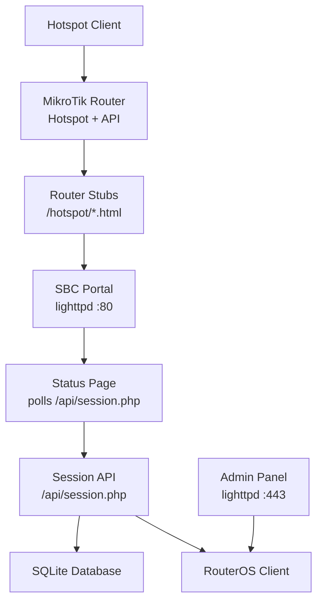
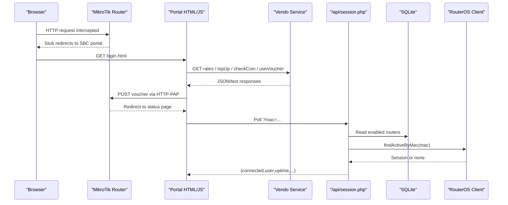
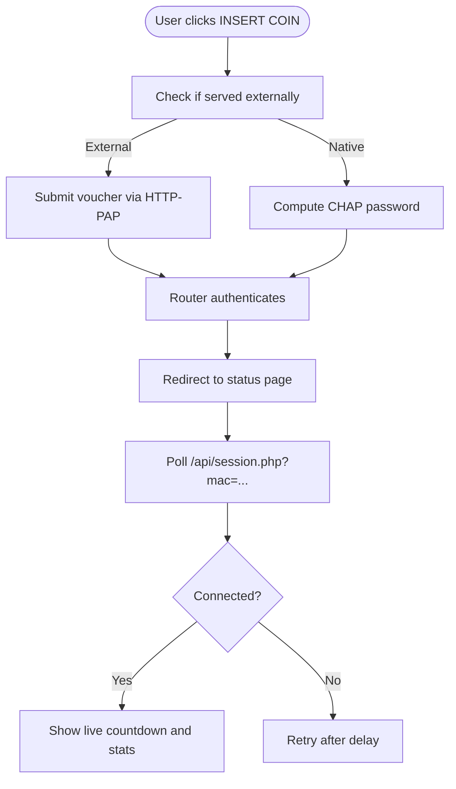
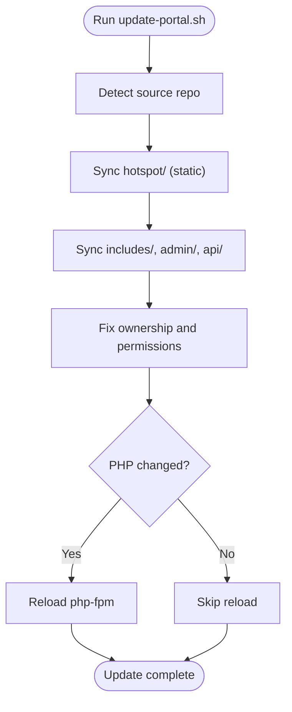
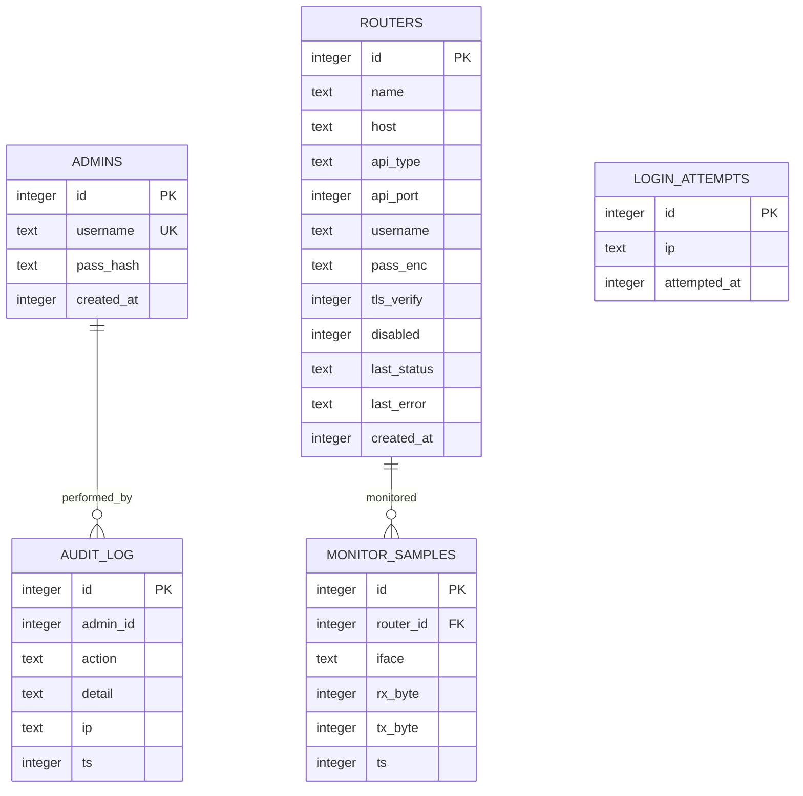
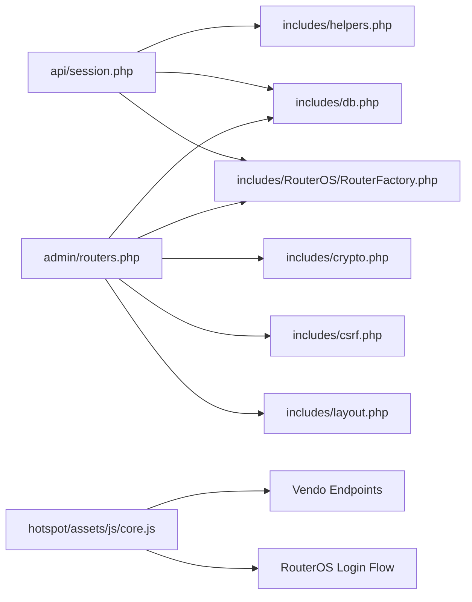

# Customization & Extension

<cite>
**Referenced Files in This Document**   
- [DEPLOYMENT.md](file://DEPLOYMENT.md)
- [config.php](file://includes/config.php)
- [db.php](file://includes/db.php)
- [login.html](file://hotspot/login.html)
- [core.js](file://hotspot/assets/js/core.js)
- [config.js](file://hotspot/assets/js/config.js)
- [core.css](file://hotspot/assets/css/core.css)
- [session.php](file://api/session.php)
- [routers.php](file://admin/routers.php)
- [update-portal.sh](file://deploy/scripts/update-portal.sh)
</cite>

## Table of Contents
1. [Introduction](#introduction)
2. [Project Structure](#project-structure)
3. [Core Components](#core-components)
4. [Architecture Overview](#architecture-overview)
5. [Detailed Component Analysis](#detailed-component-analysis)
6. [Dependency Analysis](#dependency-analysis)
7. [Performance Considerations](#performance-considerations)
8. [Troubleshooting Guide](#troubleshooting-guide)
9. [Conclusion](#conclusion)
10. [Appendices](#appendices)

## Introduction
This document explains how to customize and extend the MT-CONTROLLER-PISOWIFI system, focusing on:
- Portal customization: theme, branding, UI elements, and modal content.
- Extension points: adding new features, integrating third-party services, and modifying existing behavior.
- Configuration system: constants, runtime flags, and override strategies.
- Update mechanism: safe file changes without losing customizations during updates.
- Common customization examples: payment providers, voucher logic, external integrations.
- Best practices for maintenance and version upgrades.

The system is intentionally lightweight: no framework, no Composer, no build step. The captive portal is static HTML/CSS/JS served by lighttpd; PHP powers the admin panel and session lookup; MikroTik routers provide hotspot authentication and API access.

## Project Structure
At a high level, the repository separates:
- `hotspot/`: customer-facing portal (HTML, CSS, JS, assets).
- `router-stubs/`: thin MikroTik redirect pages uploaded to `/hotspot` on the router.
- `includes/`: shared PHP core (configuration, database, crypto, CSRF, helpers, layout, RouterOS clients).
- `admin/`: operator web interface and endpoints.
- `api/`: portal-facing JSON endpoint for live session status.
- `deploy/`: installation, server configuration, and update scripts.

**Diagram sources**
- [DEPLOYMENT.md:34-70](file://DEPLOYMENT.md#L34-L70)
- [DEPLOYMENT.md:174-183](file://DEPLOYMENT.md#L174-L183)
- [session.php:1-19](file://api/session.php#L1-L19)

**Section sources**
- [DEPLOYMENT.md:508-557](file://DEPLOYMENT.md#L508-L557)

## Core Components
Key components relevant to customization and extension:
- Configuration constants (`includes/config.php`) define paths, session settings, and rate limits with guard-based overrides.
- Database schema (`includes/db.php`) defines tables for admins, routers, login attempts, audit log, and monitor samples.
- Portal UI (`hotspot/login.html`, `hotspot/assets/js/core.js`, `hotspot/assets/js/config.js`, `hotspot/assets/css/core.css`) controls branding, modals, vendor integration, and user flows.
- Session API (`api/session.php`) exposes read-only session data for the status page.
- Admin router management (`admin/routers.php`) manages router connections and credentials.
- Update script (`deploy/scripts/update-portal.sh`) safely re-syncs files and reloads PHP only when needed.

**Section sources**
- [config.php:1-44](file://includes/config.php#L1-L44)
- [db.php:1-117](file://includes/db.php#L1-L117)
- [login.html:1-775](file://hotspot/login.html#L1-L775)
- [core.js:1-959](file://hotspot/assets/js/core.js#L1-L959)
- [config.js:1-63](file://hotspot/assets/js/config.js#L1-L63)
- [core.css:1-29](file://hotspot/assets/css/core.css#L1-L29)
- [session.php:1-107](file://api/session.php#L1-L107)
- [routers.php:1-455](file://admin/routers.php#L1-L455)
- [update-portal.sh:1-117](file://deploy/scripts/update-portal.sh#L1-L117)

## Architecture Overview
The portal customization surface is primarily client-side (HTML/CSS/JS), while backend extension points are in PHP and the RouterOS client layer.

**Diagram sources**
- [DEPLOYMENT.md:174-183](file://DEPLOYMENT.md#L174-L183)
- [core.js:490-549](file://hotspot/assets/js/core.js#L490-L549)
- [session.php:58-106](file://api/session.php#L58-L106)

## Detailed Component Analysis

### Portal Theme and Branding
Customization targets:
- Banner image: replace `hotspot/assets/MainPic.PNG`.
- Colors and layout: modify CSS variables and `.piso-*` classes in `hotspot/login.html` and `hotspot/assets/css/core.css`.
- Modal content: edit markup inside `hotspot/login.html` for promo rates, charging station, e-load, QR purchase, and member login.
- JavaScript behavior: adjust flow in `hotspot/assets/js/core.js` and feature toggles in `hotspot/assets/js/config.js`.

Best practices:
- Use namespaced classes (e.g., `.piso-*`) to avoid conflicts with Bootstrap.
- Keep element IDs referenced by controller scripts unchanged (e.g., `voucherInput`, `connectBtn`, `promoRateBtn`, `insertCoinModal`, `totalCoin`, `expectedCoin`, `codeGenerated`, `vendoSelected`).
- Preserve RouterOS template tags (`$(...)`) and dual-mode bridge behavior provided by `js/varbridge.js`.

**Section sources**
- [DEPLOYMENT.md:453-469](file://DEPLOYMENT.md#L453-L469)
- [login.html:21-344](file://hotspot/login.html#L21-L344)
- [login.html:437-500](file://hotspot/login.html#L437-L500)
- [core.css:1-29](file://hotspot/assets/css/core.css#L1-L29)

### Voucher Logic and Payment Flow
The voucher flow integrates with an external “vendo” service:
- Rates and charging stations are fetched from the vendo endpoint.
- Top-up requests generate vouchers and start coin insertion workflows.
- Coin polling checks progress and finalizes usage.

Key behaviors:
- Multi-vendor support via `isMultiVendo`, `multiVendoOption`, and `multiVendoAddresses` in `config.js`.
- Error mapping and toast notifications in `core.js`.
- External mode login uses HTTP-PAP form submission to the router’s login URL.

**Diagram sources**
- [login.html:349-416](file://hotspot/login.html#L349-L416)
- [core.js:490-549](file://hotspot/assets/js/core.js#L490-L549)
- [session.php:58-106](file://api/session.php#L58-L106)

**Section sources**
- [core.js:1-14](file://hotspot/assets/js/core.js#L1-L14)
- [core.js:30-211](file://hotspot/assets/js/core.js#L30-L211)
- [core.js:490-549](file://hotspot/assets/js/core.js#L490-L549)
- [core.js:552-631](file://hotspot/assets/js/core.js#L552-L631)
- [core.js:633-761](file://hotspot/assets/js/core.js#L633-L761)
- [config.js:1-63](file://hotspot/assets/js/config.js#L1-L63)

### Configuration System and Overrides
Configuration is centralized in `includes/config.php` using constant definitions guarded by `if (!defined(...))`. This allows operators or test harnesses to override defaults before inclusion.

Important constants:
- `AIRCOINS_DB`: SQLite database path.
- `AIRCOINS_KEY`: libsodium secret key path.
- `AIRCOINS_SESSION_NAME`: admin session cookie name.
- `AIRCOINS_IDLE_TIMEOUT`: idle timeout seconds.
- `AIRCOINS_RATE_MAX` / `AIRCOINS_RATE_WINDOW`: login rate limiting.

Runtime UI/runtime flags are controlled by `hotspot/assets/js/config.js`:
- `isMultiVendo`, `multiVendoOption`, `multiVendoAddresses` for multi-vendor setups.
- `loginOption`, `dataRateOption`, `vendorIpAddress`.
- `chargingEnable`, `eloadEnable`, `showPauseTime`, `showMemberLogin`, `showExtendTimeButton`, `disableVoucherInput`, `macAsVoucherCode`, `qrCodeVoucherPurchase`.

Override strategy:
- For PHP constants: define them before including `includes/config.php` (e.g., via a bootstrap file or environment-specific include).
- For JS flags: edit `hotspot/assets/js/config.js` or inject values via a separate config script loaded before `core.js`.

**Section sources**
- [config.php:1-44](file://includes/config.php#L1-L44)
- [config.js:1-63](file://hotspot/assets/js/config.js#L1-L63)

### Extension Points for New Features
Common extension points:
- Adding new payment providers: integrate additional endpoints similar to existing vendo calls (`/topUp`, `/checkCoin`, `/useVoucher`, `/getRates`, `/getChargingStation`). Extend error handling and UI feedback in `core.js`.
- Modifying voucher logic: adjust token generation, validity storage, and auto-login behavior in `core.js`; ensure RouterOS PAP/CHAP flows remain intact.
- Integrating external systems: add AJAX calls to your service, handle CORS, and map responses to existing UI elements.
- Extending admin functionality: add new CRUD operations in `admin/routers.php` or create new admin pages under `admin/`, leveraging shared includes (`db.php`, `crypto.php`, `csrf.php`, `layout.php`).

Security considerations:
- All state-changing admin POSTs are CSRF-protected.
- Router passwords are encrypted at rest; never render stored secrets back into forms.
- Rate limiting and audit logging protect admin operations.

**Section sources**
- [routers.php:1-22](file://admin/routers.php#L1-L22)
- [routers.php:47-224](file://admin/routers.php#L47-L224)
- [core.js:490-549](file://hotspot/assets/js/core.js#L490-L549)

### Update Mechanism and Safe Modifications
Use `deploy/scripts/update-portal.sh` to re-sync files:
- Copies `hotspot/`, `admin/`, `includes/`, `api/` from source repo to deployed directories.
- Fixes ownership and permissions.
- Reloads php-fpm only if PHP code changed; static portal edits take effect immediately.

Safe modification guidelines:
- Edit files in the repository, then run the update script pointing at your source directory.
- Avoid editing deployed files directly unless necessary; prefer repository-driven changes.
- Keep RouterOS stubs (`router-stubs/*.html`) synchronized with site variables and MAC/IP placeholders.

**Diagram sources**
- [update-portal.sh:60-117](file://deploy/scripts/update-portal.sh#L60-L117)

**Section sources**
- [DEPLOYMENT.md:453-469](file://DEPLOYMENT.md#L453-L469)
- [update-portal.sh:1-117](file://deploy/scripts/update-portal.sh#L1-L117)

### Data Model and Persistence
The SQLite schema includes:
- `admins`: operator accounts with hashed passwords.
- `routers`: MikroTik devices with encrypted credentials and API type/port.
- `login_attempts`: rate-limit tracking per IP.
- `audit_log`: operator actions.
- `monitor_samples`: per-interface traffic metrics.

Indexes optimize queries for login attempts and monitoring samples.

**Diagram sources**
- [db.php:56-116](file://includes/db.php#L56-L116)

**Section sources**
- [db.php:1-117](file://includes/db.php#L1-L117)

## Dependency Analysis
Component relationships:
- `api/session.php` depends on `includes/helpers.php`, `includes/db.php`, and `includes/RouterOS/RouterFactory.php`.
- `admin/routers.php` depends on `includes/db.php`, `includes/crypto.php`, `includes/csrf.php`, `includes/layout.php`, and `includes/RouterOS/RouterFactory.php`.
- Portal JS (`core.js`) depends on vendor endpoints and RouterOS login flows.

**Diagram sources**
- [session.php:23-25](file://api/session.php#L23-L25)
- [routers.php:17-21](file://admin/routers.php#L17-L21)
- [core.js:490-549](file://hotspot/assets/js/core.js#L490-L549)

**Section sources**
- [session.php:1-107](file://api/session.php#L1-L107)
- [routers.php:1-455](file://admin/routers.php#L1-L455)
- [core.js:1-959](file://hotspot/assets/js/core.js#L1-L959)

## Performance Considerations
- Lighttpd serves static portal assets directly; no PHP overhead for HTML/CSS/JS.
- PHP-FPM pool runs on-demand with minimal children, reducing idle memory usage.
- SQLite uses WAL mode and sane busy timeouts for concurrency.
- Monitoring samples are pruned automatically to limit growth.
- Avoid heavy client-side loops; rely on existing retry mechanisms in `core.js`.

[No sources needed since this section provides general guidance]

## Troubleshooting Guide
Common issues and resolutions:
- Port conflicts: ensure lighttpd owns ports 80 and 443; disable conflicting services.
- Armbian network overlays: set static IP outside DHCP range; open firewall rules for 80/443.
- PAP plaintext note: voucher submitted over isolated hotspot LAN; keep admin panel protected via TLS.
- REST errors: verify service enablement, headers, and paths.
- Legacy API traps: inspect trap messages for auth or protocol errors.
- Session not detected: verify MAC parameter, router enabled state, and `/api/` alias.
- SD card wear: consider log2ram and endurance media; monitor sample pruning helps.
- Time sync: ensure NTP active to prevent spurious logouts and TLS warnings.
- Lighttpd startup failures: validate config and certificate paths.

**Section sources**
- [DEPLOYMENT.md:473-505](file://DEPLOYMENT.md#L473-L505)

## Conclusion
Customizing and extending MT-CONTROLLER-PISOWIFI involves:
- Editing portal assets and JS for branding and UI changes.
- Using configuration constants and runtime flags to tailor behavior.
- Leveraging extension points for payment providers and external integrations.
- Applying updates safely via the provided script to preserve changes.
- Following security and performance best practices for stable operation.

[No sources needed since this section summarizes without analyzing specific files]

## Appendices

### A. Example Customizations

#### Adding a New Payment Provider
Steps:
- Add provider configuration in `hotspot/assets/js/config.js` (e.g., new entry in `multiVendoAddresses`).
- Implement or adapt AJAX calls in `hotspot/assets/js/core.js` for `/topUp`, `/checkCoin`, `/useVoucher`.
- Map provider error codes to user-friendly messages using the existing error map.
- Test end-to-end flow: rates display, top-up initiation, coin insertion, and auto-login.

**Section sources**
- [config.js:1-63](file://hotspot/assets/js/config.js#L1-L63)
- [core.js:490-549](file://hotspot/assets/js/core.js#L490-L549)
- [core.js:633-761](file://hotspot/assets/js/core.js#L633-L761)

#### Modifying Voucher Logic
Adjustments:
- Change voucher generation or validation in `core.js`.
- Ensure RouterOS PAP/CHAP flows remain intact in `hotspot/login.html`.
- Update storage keys and validity handling as needed.

**Section sources**
- [login.html:349-416](file://hotspot/login.html#L349-L416)
- [core.js:552-631](file://hotspot/assets/js/core.js#L552-L631)

#### Integrating with External Systems
Approach:
- Add AJAX calls to your service in `core.js`.
- Handle CORS and error states gracefully.
- Update UI elements to reflect external system responses.

**Section sources**
- [core.js:331-370](file://hotspot/assets/js/core.js#L331-L370)
- [core.js:376-426](file://hotspot/assets/js/core.js#L376-L426)

### B. Version Upgrade Best Practices
- Maintain all customizations in the repository; avoid direct edits to deployed files.
- Use `deploy/scripts/update-portal.sh` to apply updates.
- Review changelogs and migration notes for breaking changes.
- Back up `/etc/aircoins/secret.key` and SQLite database before major upgrades.
- Validate RouterOS API connectivity and service enablement post-upgrade.

**Section sources**
- [DEPLOYMENT.md:453-469](file://DEPLOYMENT.md#L453-L469)
- [update-portal.sh:1-117](file://deploy/scripts/update-portal.sh#L1-L117)