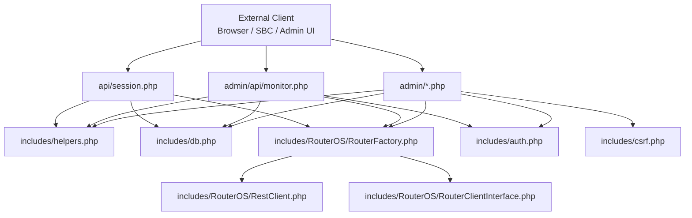
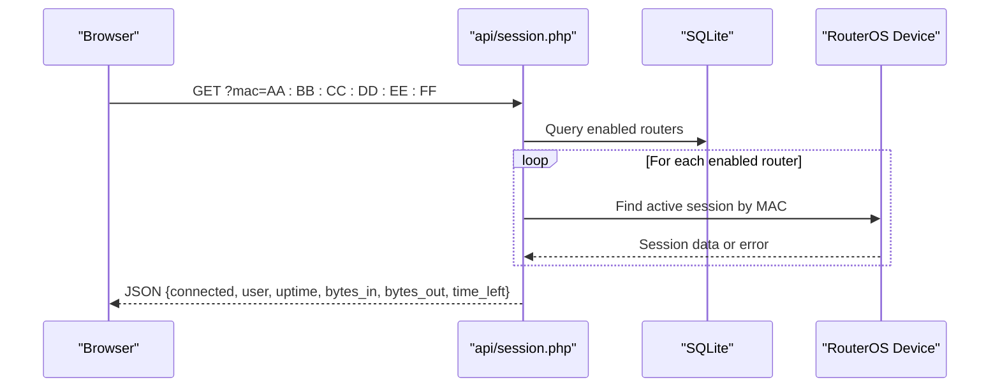
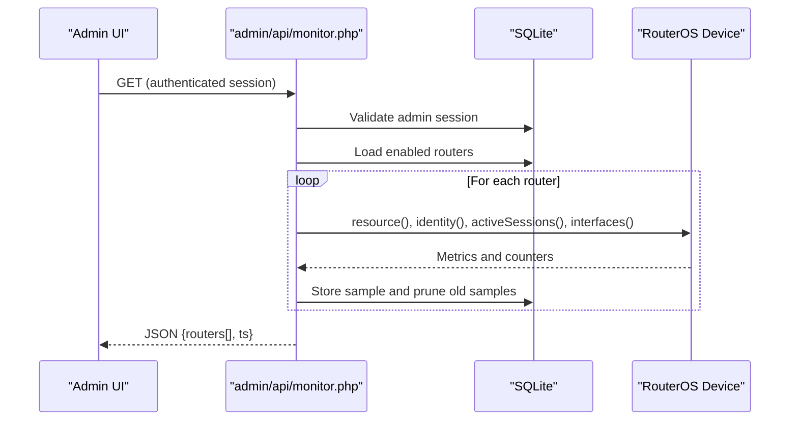
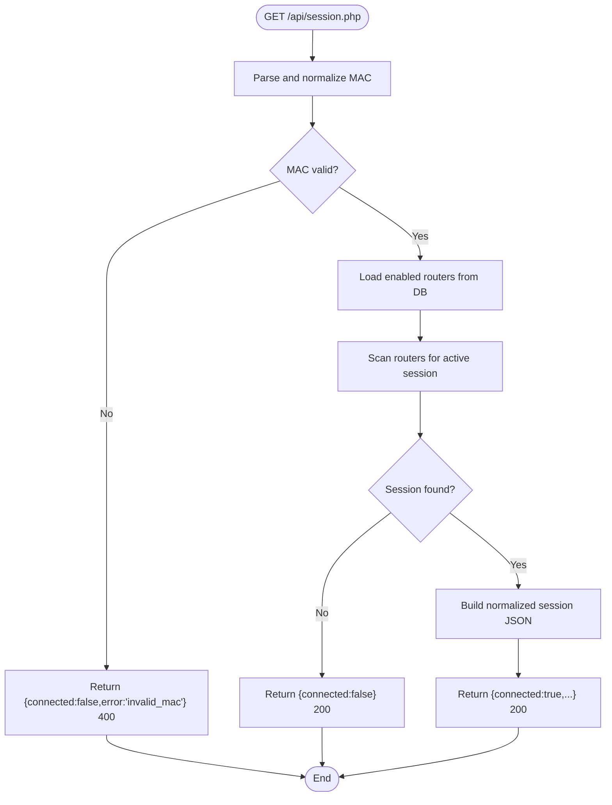
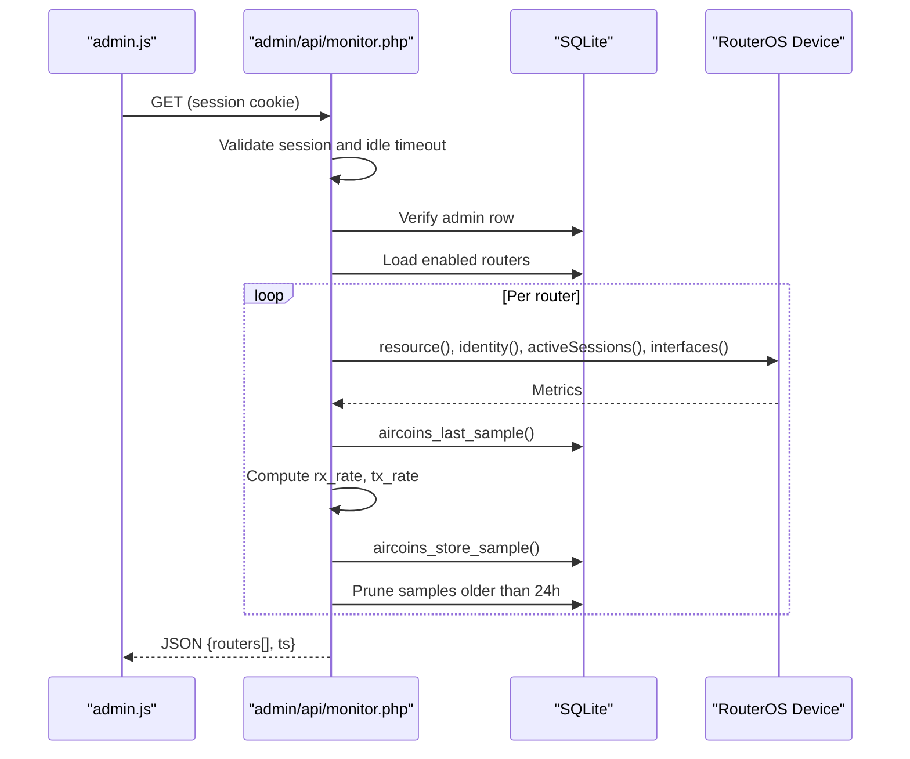
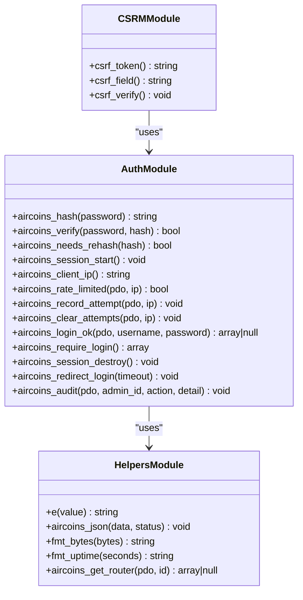
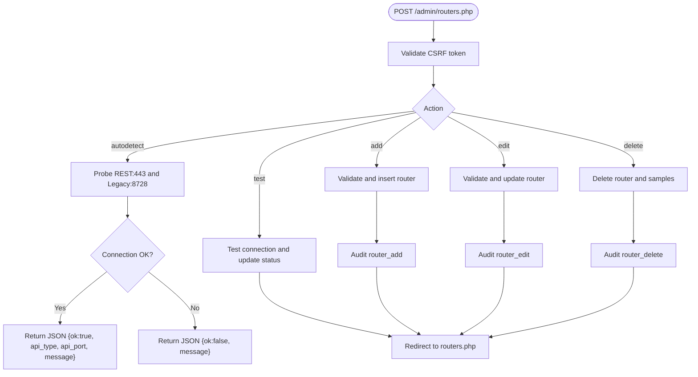
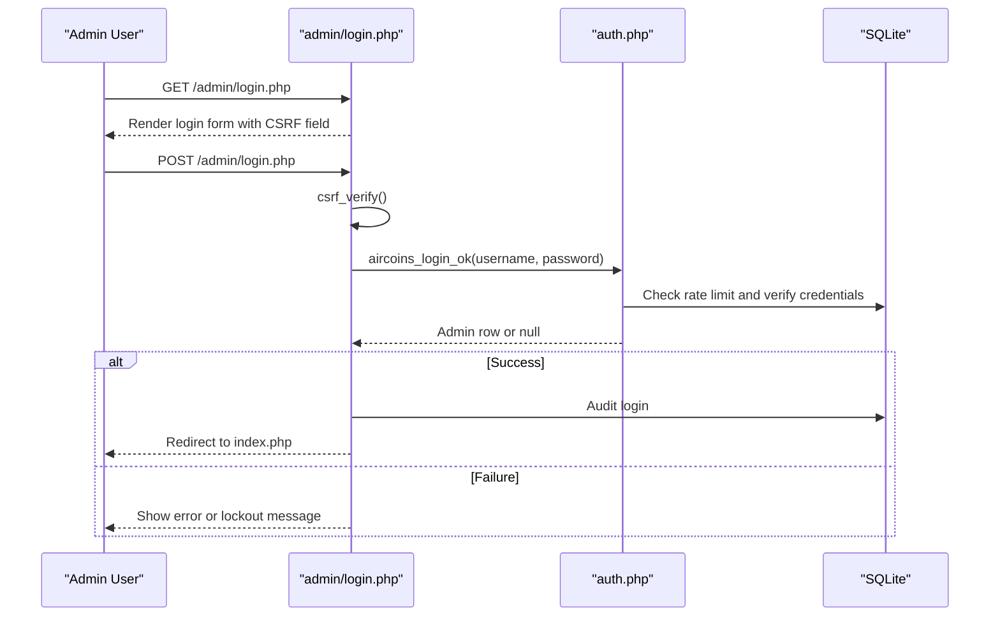
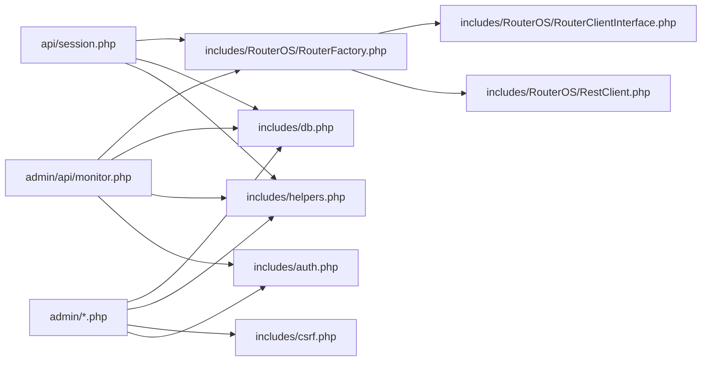

# API Development

<cite>
**Referenced Files in This Document**   
- [session.php](file://api/session.php)
- [monitor.php](file://admin/api/monitor.php)
- [auth.php](file://includes/auth.php)
- [csrf.php](file://includes/csrf.php)
- [helpers.php](file://includes/helpers.php)
- [db.php](file://includes/db.php)
- [config.php](file://includes/config.php)
- [routers.php](file://admin/routers.php)
- [login.php](file://admin/login.php)
- [RestClient.php](file://includes/RouterOS/RestClient.php)
- [RouterClientInterface.php](file://includes/RouterOS/RouterClientInterface.php)
- [api.json](file://hotspot/api.json)
</cite>

## Table of Contents
1. [Introduction](#introduction)
2. [Project Structure](#project-structure)
3. [Core Components](#core-components)
4. [Architecture Overview](#architecture-overview)
5. [Detailed Component Analysis](#detailed-component-analysis)
6. [Dependency Analysis](#dependency-analysis)
7. [Performance Considerations](#performance-considerations)
8. [Troubleshooting Guide](#troubleshooting-guide)
9. [Conclusion](#conclusion)
10. [Appendices](#appendices)

## Introduction
This document explains how to create custom API endpoints for MT-CONTROLLER-PISOWIFI. It documents the RESTful patterns used by the application, request and response formats, error handling conventions, authentication mechanisms, CSRF protection, rate limiting, and security best practices. It also provides guidance on API versioning, documentation generation, client SDK development, file uploads, and performance considerations.

The codebase is a plain PHP 8 application with no framework or Composer dependency. Endpoints are individual PHP files that include shared helpers for JSON responses, database access, authentication, CSRF validation, and RouterOS client abstraction.

## Project Structure
The repository separates public-facing portal data, admin-only APIs, shared includes, and RouterOS integration:

- `api/` — Public or portal-facing JSON endpoints.
- `admin/` — Admin UI pages and admin-only API endpoints.
- `includes/` — Shared logic: configuration, database, authentication, CSRF, helpers, and RouterOS clients.
- `hotspot/` — Hotspot portal assets and MikroTik captive-portal JSON template.
- `deploy/` — Deployment scripts and server configurations.

**Diagram sources**
- [session.php:23-25](file://api/session.php#L23-L25)
- [monitor.php:21-24](file://admin/api/monitor.php#L21-L24)
- [routers.php:17-21](file://admin/routers.php#L17-L21)
- [login.php:14-16](file://admin/login.php#L14-L16)
- [helpers.php:23-38](file://includes/helpers.php#L23-L38)
- [db.php:23-48](file://includes/db.php#L23-L48)
- [auth.php:65-83](file://includes/auth.php#L65-L83)
- [csrf.php:21-30](file://includes/csrf.php#L21-L30)
- [RestClient.php:255-258](file://includes/RouterOS/RestClient.php#L255-L258)
- [RouterClientInterface.php:31-63](file://includes/RouterOS/RouterClientInterface.php#L31-L63)

**Section sources**
- [session.php:1-107](file://api/session.php#L1-L107)
- [monitor.php:1-188](file://admin/api/monitor.php#L1-L188)
- [routers.php:1-455](file://admin/routers.php#L1-L455)
- [login.php:1-114](file://admin/login.php#L1-L114)
- [helpers.php:1-97](file://includes/helpers.php#L1-L97)
- [db.php:1-117](file://includes/db.php#L1-L117)
- [auth.php:1-282](file://includes/auth.php#L1-L282)
- [csrf.php:1-68](file://includes/csrf.php#L1-L68)
- [config.php:1-44](file://includes/config.php#L1-L44)
- [RestClient.php:255-356](file://includes/RouterOS/RestClient.php#L255-L356)
- [RouterClientInterface.php:23-63](file://includes/RouterOS/RouterClientInterface.php#L23-L63)
- [api.json:1-12](file://hotspot/api.json#L1-L12)

## Core Components
The application’s API surface is small and focused:

- Public session lookup endpoint: returns whether a MAC address has an active hotspot session.
- Admin monitor feed: returns router health, resource usage, active sessions, and per-interface traffic rates.
- Admin management endpoints: router CRUD and connection testing via HTML forms and JSON probes.
- Authentication and CSRF: hardened sessions, login rate limiting, audit logging, and CSRF token validation.
- Database layer: SQLite schema and singleton PDO connection.
- RouterOS client abstraction: REST and legacy clients with a common interface.

Key implementation patterns:
- JSON responses are emitted through a shared helper that sets headers and terminates the script.
- Admin endpoints require an authenticated session; unauthenticated requests return JSON errors instead of redirects.
- State-changing POSTs validate CSRF tokens before processing.
- Router operations are wrapped in try/catch blocks so one unreachable device does not fail the entire response.

**Section sources**
- [helpers.php:23-38](file://includes/helpers.php#L23-L38)
- [auth.php:151-190](file://includes/auth.php#L151-L190)
- [csrf.php:48-67](file://includes/csrf.php#L48-L67)
- [db.php:56-116](file://includes/db.php#L56-L116)
- [RouterClientInterface.php:31-63](file://includes/RouterOS/RouterClientInterface.php#L31-L63)

## Architecture Overview
The system exposes two primary API categories:

1. Portal-facing read-only status API:
   - Endpoint: `/api/session.php`
   - Purpose: allow the SBC-served status page to poll live session data for the caller’s own MAC address.
   - Security: intentionally unauthenticated but strictly read-only; CORS is opened only for this endpoint.

2. Admin-only monitoring API:
   - Endpoint: `/admin/api/monitor.php`
   - Purpose: provide real-time router health, resource metrics, active session counts, and per-interface traffic rates.
   - Security: requires an authenticated admin session; returns JSON errors for unauthorized or expired sessions.

**Diagram sources**
- [session.php:50-106](file://api/session.php#L50-L106)
- [db.php:23-48](file://includes/db.php#L23-L48)

**Diagram sources**
- [monitor.php:29-50](file://admin/api/monitor.php#L29-L50)
- [monitor.php:103-187](file://admin/api/monitor.php#L103-L187)
- [db.php:56-116](file://includes/db.php#L56-L116)

## Detailed Component Analysis

### Public Session Lookup API
The session lookup endpoint is designed for browser-based polling from the captive portal status page. It accepts a MAC address parameter, normalizes it, queries enabled routers, and returns a consistent JSON shape.

Request format:
- Method: GET
- Path: `/api/session.php`
- Query parameters:
  - `mac`: MAC address with optional separators (`:` `-` `.` or none).

Response format:
- Success when connected: `{connected: true, user, uptime, bytes_in, bytes_out, time_left}`
- No active session: `{connected: false}`
- Invalid input: `{connected: false, error: "invalid_mac"}` with HTTP 400.

Security characteristics:
- No authentication required.
- Read-only behavior.
- CORS allowed for all origins.
- Cache disabled.
- Stack traces are never leaked; all client calls run inside try/catch.

Error handling:
- Missing or malformed MAC returns a 400 JSON error.
- Database or setup failures return `{connected: false}` with HTTP 200 to avoid leaking internals.
- Unreachable routers are skipped silently while scanning other routers.

**Diagram sources**
- [session.php:40-56](file://api/session.php#L40-L56)
- [session.php:58-87](file://api/session.php#L58-L87)
- [session.php:89-106](file://api/session.php#L89-L106)

**Section sources**
- [session.php:1-107](file://api/session.php#L1-L107)

### Admin Monitor Feed API
The monitor feed is polled by the admin UI every few seconds. It requires an authenticated admin session and returns per-router health, resource metrics, active session counts, and per-interface traffic rates computed from stored samples.

Authentication flow:
- Starts a hardened session.
- Checks for a valid admin session ID.
- Validates idle timeout and destroys expired sessions.
- Verifies the admin row exists in the database.

Data flow:
- Loads enabled routers.
- For each router:
  - Reads resource and identity information.
  - Counts active sessions.
  - Reads interface counters.
  - Computes RX/TX rates by diffing against the last stored sample.
  - Stores new samples and prunes older than 24 hours.

Response format:
- JSON object with `routers[]` array and `ts` timestamp.
- Each router item includes `id`, `name`, `api_type`, `online`, `identity`, `resource`, `active_count`, `interfaces[]`, and optional `error`.

Error handling:
- Unauthorized or expired session returns JSON `{error: "unauthorized"}` or `{error: "session_expired"}` with HTTP 401.
- Database unavailability returns `{routers: [], error: "db_unavailable"}` with HTTP 200.
- Individual router failures set `online: false` and `error` without failing the whole response.

**Diagram sources**
- [monitor.php:29-50](file://admin/api/monitor.php#L29-L50)
- [monitor.php:54-99](file://admin/api/monitor.php#L54-L99)
- [monitor.php:103-187](file://admin/api/monitor.php#L103-L187)

**Section sources**
- [monitor.php:1-188](file://admin/api/monitor.php#L1-L188)

### Authentication and Session Hardening
Authentication is centralized in the auth module. It provides password hashing, verification, rehashing, session hardening, IP-based rate limiting, and audit logging.

Key behaviors:
- Password hashing prefers Argon2id and falls back to bcrypt.
- Sessions use an httponly, SameSite=Strict cookie marked Secure over TLS.
- Login attempts are rate-limited per client IP using a database table.
- Successful login regenerates the session ID and stores metadata.
- Idle timeout enforces automatic logout after inactivity.
- Audit log records privileged actions with IP and timestamp.

Rate limiting:
- Tracks failed login attempts within a configurable window.
- Locks out clients exceeding the maximum failure count.
- Clears attempt counter on successful login.

CSRF protection:
- Generates a per-session random token.
- Renders a hidden CSRF field for forms.
- Validates CSRF tokens on POST requests using timing-safe comparison.

**Diagram sources**
- [auth.php:23-28](file://includes/auth.php#L23-L28)
- [auth.php:65-83](file://includes/auth.php#L65-L83)
- [auth.php:103-138](file://includes/auth.php#L103-L138)
- [auth.php:151-190](file://includes/auth.php#L151-L190)
- [auth.php:202-231](file://includes/auth.php#L202-L231)
- [auth.php:269-281](file://includes/auth.php#L269-L281)
- [csrf.php:21-30](file://includes/csrf.php#L21-L30)
- [csrf.php:48-67](file://includes/csrf.php#L48-L67)
- [helpers.php:17-20](file://includes/helpers.php#L17-L20)
- [helpers.php:23-38](file://includes/helpers.php#L23-L38)
- [helpers.php:90-96](file://includes/helpers.php#L90-L96)

**Section sources**
- [auth.php:1-282](file://includes/auth.php#L1-L282)
- [csrf.php:1-68](file://includes/csrf.php#L1-L68)
- [helpers.php:1-97](file://includes/helpers.php#L1-L97)

### Admin Management Endpoints
The router management page demonstrates both HTML form workflows and JSON probes. It uses Post-Redirect-Get for state-changing actions and validates CSRF tokens on all POSTs.

Supported operations:
- Auto-detect API type: JSON probe returning detected API type and port.
- Test connection: updates last_status and last_error fields.
- Add/Edit router: encrypts passwords before storage and audits changes.
- Delete router: removes router and associated monitor samples.

Validation and security:
- All POSTs call CSRF verification.
- Required fields are validated before persistence.
- Passwords are encrypted and never rendered back into forms.
- Changes are audited with admin ID, action, and detail.

**Diagram sources**
- [routers.php:47-97](file://admin/routers.php#L47-L97)
- [routers.php:116-141](file://admin/routers.php#L116-L141)
- [routers.php:143-223](file://admin/routers.php#L143-L223)
- [routers.php:99-114](file://admin/routers.php#L99-L114)

**Section sources**
- [routers.php:1-455](file://admin/routers.php#L1-L455)

### Login Flow
The admin login page handles GET and POST requests. GET renders the form; POST validates CSRF, authenticates credentials, audits the login, and redirects to the dashboard.

Security features:
- Rate-limited authentication via the auth module.
- Distinguishes lockout from invalid credentials.
- Uses hardened session cookies.
- Audits successful logins.

**Diagram sources**
- [login.php:37-62](file://admin/login.php#L37-L62)
- [auth.php:151-190](file://includes/auth.php#L151-L190)

**Section sources**
- [login.php:1-114](file://admin/login.php#L1-L114)
- [auth.php:151-190](file://includes/auth.php#L151-L190)

### Hotspot Captive Portal JSON Template
The hotspot directory contains a MikroTik captive-portal JSON template that informs the portal about captive status, login URL, remaining session time, and remaining bytes.

This template is processed by MikroTik and embedded into the portal response. It is not a traditional REST endpoint but part of the captive portal integration.

**Section sources**
- [api.json:1-12](file://hotspot/api.json#L1-L12)

## Dependency Analysis
The API layer depends on shared modules for consistency and security:

- JSON responses are standardized through `aircoins_json`.
- Database access uses a singleton PDO connection with WAL mode and prepared statements.
- Authentication and CSRF are enforced at the entry point of protected endpoints.
- RouterOS communication is abstracted behind a common interface, allowing REST and legacy clients to be used interchangeably.

**Diagram sources**
- [session.php:23-25](file://api/session.php#L23-L25)
- [monitor.php:21-24](file://admin/api/monitor.php#L21-L24)
- [routers.php:17-21](file://admin/routers.php#L17-L21)
- [helpers.php:23-38](file://includes/helpers.php#L23-L38)
- [db.php:23-48](file://includes/db.php#L23-L48)
- [auth.php:65-83](file://includes/auth.php#L65-L83)
- [csrf.php:21-30](file://includes/csrf.php#L21-L30)
- [RestClient.php:255-258](file://includes/RouterOS/RestClient.php#L255-L258)
- [RouterClientInterface.php:31-63](file://includes/RouterOS/RouterClientInterface.php#L31-L63)

**Section sources**
- [session.php:23-25](file://api/session.php#L23-L25)
- [monitor.php:21-24](file://admin/api/monitor.php#L21-L24)
- [routers.php:17-21](file://admin/routers.php#L17-L21)
- [helpers.php:23-38](file://includes/helpers.php#L23-L38)
- [db.php:23-48](file://includes/db.php#L23-L48)
- [auth.php:65-83](file://includes/auth.php#L65-L83)
- [csrf.php:21-30](file://includes/csrf.php#L21-L30)
- [RestClient.php:255-258](file://includes/RouterOS/RestClient.php#L255-L258)
- [RouterClientInterface.php:31-63](file://includes/RouterOS/RouterClientInterface.php#L31-L63)

## Performance Considerations
- Use prepared statements for all database queries to prevent SQL injection and improve execution plans.
- Avoid unnecessary database reads by caching frequently accessed configuration where appropriate.
- Limit the scope of external network calls; wrap RouterOS client calls in try/catch to prevent slow devices from blocking the entire response.
- Prune historical data regularly, as demonstrated by the monitor endpoint’s 24-hour sample retention policy.
- Disable caching for sensitive or live data endpoints to ensure clients receive fresh information.
- Prefer read-only endpoints for public-facing APIs to reduce write amplification and attack surface.

[No sources needed since this section provides general guidance]

## Troubleshooting Guide
Common issues and their resolution strategies:

- Unauthorized API access:
  - Ensure the admin session is active and not expired.
  - Check that the session cookie is present and valid.
  - Verify that the admin row still exists in the database.

- CSRF validation failures:
  - Ensure forms include the CSRF hidden field generated by `csrf_field()`.
  - Confirm that the session is started before calling `csrf_verify()`.
  - Check that the request method is POST when CSRF validation is expected.

- Database connectivity problems:
  - Verify the SQLite database path and permissions.
  - Check that the schema has been created via `aircoins_schema()`.
  - Inspect error logs for PDO exceptions.

- RouterOS connectivity issues:
  - Validate host, port, username, and password.
  - Check TLS certificate settings if TLS verification is enabled.
  - Review the router’s API service status and firewall rules.

- Rate limiting lockouts:
  - Wait for the rate-limit window to expire.
  - Clear failed attempts after successful login.
  - Adjust `AIRCOINS_RATE_MAX` and `AIRCOINS_RATE_WINDOW` if necessary.

**Section sources**
- [monitor.php:29-50](file://admin/api/monitor.php#L29-L50)
- [csrf.php:48-67](file://includes/csrf.php#L48-L67)
- [db.php:23-48](file://includes/db.php#L23-L48)
- [auth.php:103-138](file://includes/auth.php#L103-L138)

## Conclusion
MT-CONTROLLER-PISOWIFI provides a minimal but secure API surface for hotspot session lookups and admin monitoring. New endpoints should follow the established patterns: use `aircoins_json` for responses, enforce authentication and CSRF where appropriate, sanitize and validate inputs, handle errors gracefully, and avoid leaking stack traces. The shared helpers and RouterOS client abstraction make it straightforward to extend the API while maintaining consistency and security.

[No sources needed since this section summarizes without analyzing specific files]

## Appendices

### Creating Custom API Endpoints
Follow these steps when adding a new endpoint:

1. Choose the appropriate location:
   - Public or portal-facing endpoints go under `api/`.
   - Admin-only endpoints go under `admin/api/`.

2. Include shared dependencies:
   - `includes/helpers.php` for JSON responses and utilities.
   - `includes/db.php` for database access.
   - `includes/auth.php` for authentication and session handling.
   - `includes/csrf.php` for CSRF validation on state-changing requests.
   - `includes/RouterOS/RouterFactory.php` for RouterOS client creation.

3. Set response headers:
   - Use `Content-Type: application/json`.
   - Disable caching for live data.
   - Add security headers such as `X-Content-Type-Options: nosniff`.

4. Validate inputs:
   - Normalize and validate query parameters or request bodies.
   - Return structured JSON errors with appropriate HTTP status codes.

5. Enforce security:
   - Require authentication for admin endpoints.
   - Validate CSRF tokens for POST requests.
   - Apply rate limiting for sensitive operations.

6. Handle errors gracefully:
   - Wrap external calls in try/catch.
   - Never expose stack traces to clients.
   - Return meaningful error codes and messages.

7. Audit state-changing actions:
   - Log admin actions with `aircoins_audit`.
   - Record IP addresses and timestamps.

**Section sources**
- [helpers.php:23-38](file://includes/helpers.php#L23-L38)
- [auth.php:269-281](file://includes/auth.php#L269-L281)
- [csrf.php:48-67](file://includes/csrf.php#L48-L67)

### RESTful API Patterns Used in the Application
- GET endpoints return JSON payloads with clear success shapes.
- POST endpoints perform state changes and use CSRF protection.
- Errors are returned as JSON objects with descriptive fields.
- Status codes distinguish between client errors (400), authentication failures (401), and server-side issues.
- External dependencies are isolated to prevent partial failures from affecting the entire response.

**Section sources**
- [session.php:50-106](file://api/session.php#L50-L106)
- [monitor.php:29-50](file://admin/api/monitor.php#L29-L50)
- [routers.php:47-97](file://admin/routers.php#L47-L97)

### Request and Response Formats
- Session lookup:
  - GET `/api/session.php?mac=...`
  - Returns `{connected, user, uptime, bytes_in, bytes_out, time_left}`.

- Admin monitor:
  - GET `/admin/api/monitor.php`
  - Returns `{routers[], ts}`.

- Router auto-detect:
  - POST `/admin/routers.php` with `action=autodetect`
  - Returns `{ok, api_type, api_port, message}`.

- Router test connection:
  - POST `/admin/routers.php` with `action=test`
  - Updates status and redirects.

- Router add/edit/delete:
  - POST `/admin/routers.php` with `action=add|edit|delete`
  - Uses CSRF and audits changes.

**Section sources**
- [session.php:50-106](file://api/session.php#L50-L106)
- [monitor.php:103-187](file://admin/api/monitor.php#L103-L187)
- [routers.php:52-97](file://admin/routers.php#L52-L97)
- [routers.php:116-223](file://admin/routers.php#L116-L223)

### Authentication Mechanisms
- Session-based authentication for admin endpoints.
- Hardened session cookies with SameSite=Strict and Secure over TLS.
- Idle timeout enforcement.
- Login rate limiting per client IP.
- Audit logging for privileged actions.

**Section sources**
- [auth.php:65-83](file://includes/auth.php#L65-L83)
- [auth.php:103-138](file://includes/auth.php#L103-L138)
- [auth.php:151-190](file://includes/auth.php#L151-L190)
- [auth.php:202-231](file://includes/auth.php#L202-L231)
- [auth.php:269-281](file://includes/auth.php#L269-L281)

### CSRF Protection
- Per-session CSRF token generation.
- Hidden CSRF field rendering for forms.
- Timing-safe CSRF validation on POST requests.
- HTTP 403 response on validation failure.

**Section sources**
- [csrf.php:21-30](file://includes/csrf.php#L21-L30)
- [csrf.php:48-67](file://includes/csrf.php#L48-L67)

### Security Best Practices for New Endpoints
- Always validate and sanitize inputs.
- Use prepared statements for database queries.
- Enforce authentication and authorization checks.
- Apply CSRF protection to state-changing endpoints.
- Avoid exposing sensitive data in logs or error messages.
- Use HTTPS and secure session cookies.
- Implement rate limiting for sensitive operations.
- Audit privileged actions.

**Section sources**
- [auth.php:151-190](file://includes/auth.php#L151-L190)
- [csrf.php:48-67](file://includes/csrf.php#L48-L67)
- [db.php:36-48](file://includes/db.php#L36-L48)

### Rate Limiting
- Implemented via `login_attempts` table.
- Configurable thresholds and windows.
- Applied to login and can be extended to other sensitive endpoints.

**Section sources**
- [auth.php:103-138](file://includes/auth.php#L103-L138)
- [config.php:35-43](file://includes/config.php#L35-L43)

### File Uploads
The current codebase does not include file upload endpoints. If you need to add file upload support:

- Validate file type, size, and content.
- Store files outside the web root when possible.
- Generate unique filenames and avoid user-controlled paths.
- Scan uploaded files for malware if applicable.
- Return structured JSON responses for upload results.
- Apply CSRF protection and authentication.
- Log upload attempts for audit purposes.

[No sources needed since this section provides general guidance]

### API Versioning Strategies
- Use URL path versioning: `/api/v1/session.php`, `/api/v2/session.php`.
- Maintain backward compatibility for existing clients.
- Deprecate old versions with clear migration guides.
- Track API versions in audit logs and monitoring.

[No sources needed since this section provides general guidance]

### Documentation Generation
- Generate OpenAPI/Swagger specifications from endpoint definitions.
- Document request/response schemas and error codes.
- Include examples for each endpoint.
- Keep documentation synchronized with code changes.

[No sources needed since this section provides general guidance]

### Client SDK Development Considerations
- Use typed request/response models.
- Handle authentication and session expiration gracefully.
- Implement retry logic with exponential backoff for transient errors.
- Respect rate limits and backoff headers if added later.
- Provide clear error messages and debugging information.
- Support both synchronous and asynchronous request patterns.

[No sources needed since this section provides general guidance]