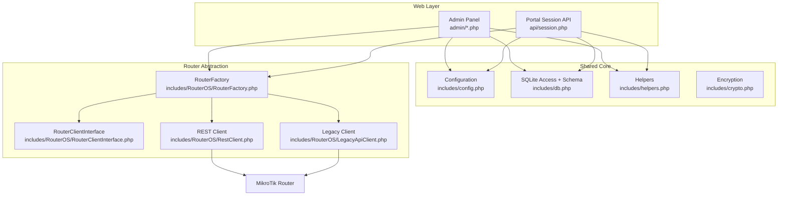
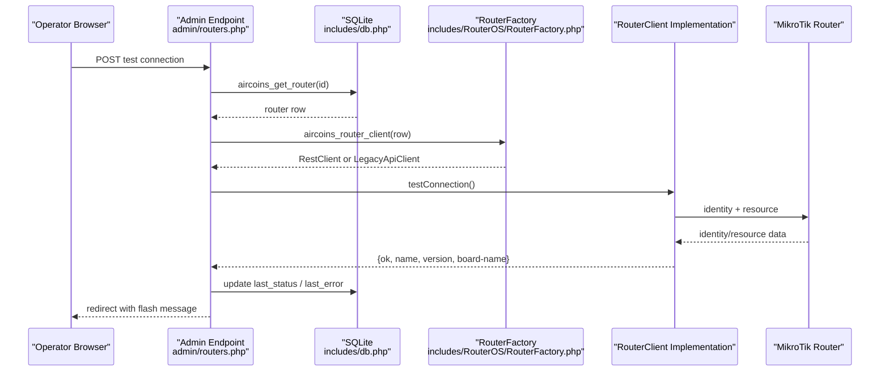
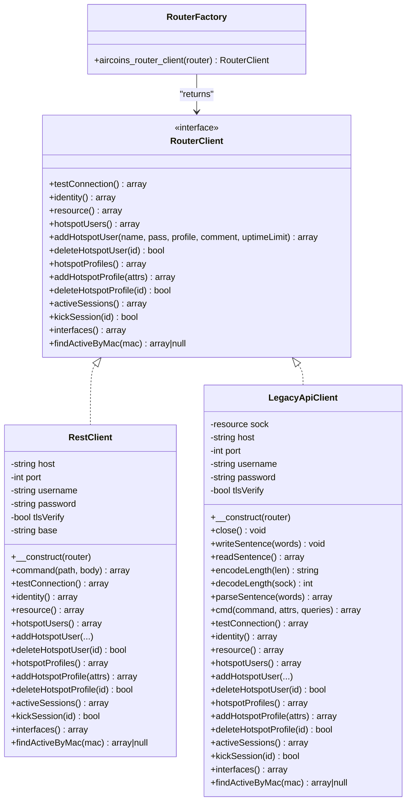
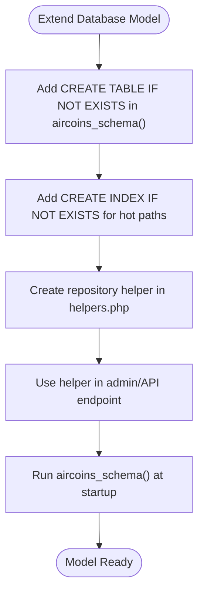
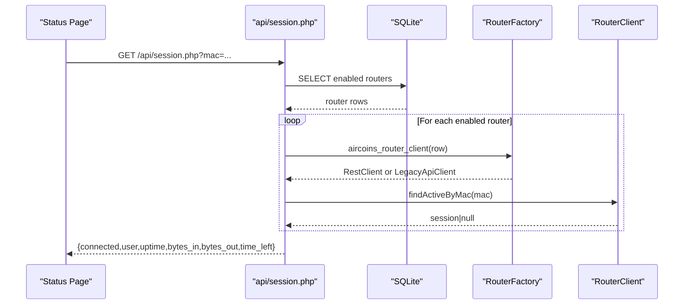
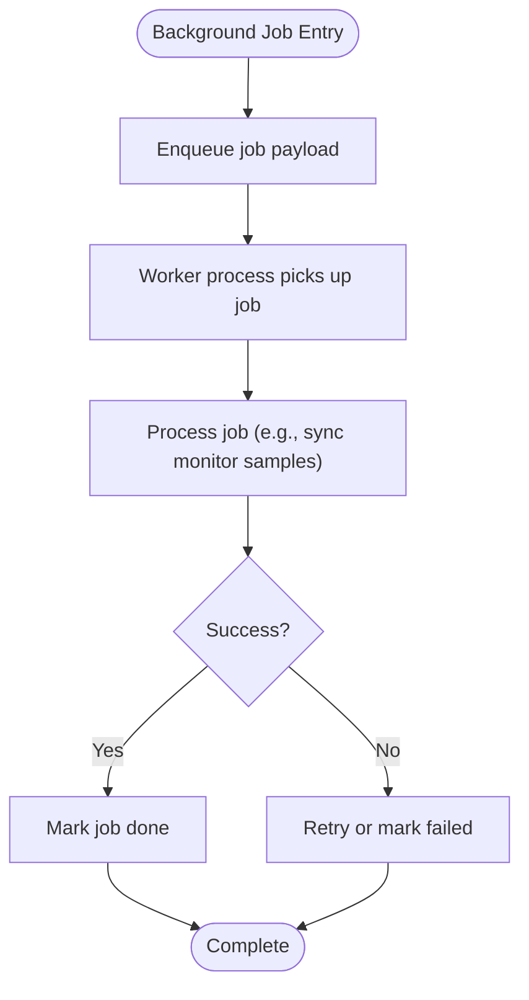
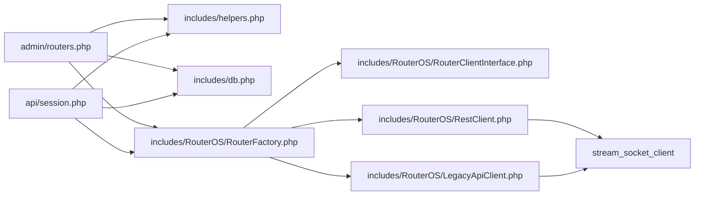

# Backend Extensions

<cite>
**Referenced Files in This Document**
- [RouterClientInterface.php](file://includes/RouterOS/RouterClientInterface.php)
- [RestClient.php](file://includes/RouterOS/RestClient.php)
- [LegacyApiClient.php](file://includes/RouterOS/LegacyApiClient.php)
- [RouterFactory.php](file://includes/RouterOS/RouterFactory.php)
- [db.php](file://includes/db.php)
- [helpers.php](file://includes/helpers.php)
- [config.php](file://includes/config.php)
- [routers.php](file://admin/routers.php)
- [session.php](file://api/session.php)
- [DEPLOYMENT.md](file://DEPLOYMENT.md)
</cite>

## Table of Contents
1. [Introduction](#introduction)
2. [Project Structure](#project-structure)
3. [Core Components](#core-components)
4. [Architecture Overview](#architecture-overview)
5. [Detailed Component Analysis](#detailed-component-analysis)
6. [Dependency Analysis](#dependency-analysis)
7. [Performance Considerations](#performance-considerations)
8. [Troubleshooting Guide](#troubleshooting-guide)
9. [Conclusion](#conclusion)
10. [Appendices](#appendices)

## Introduction
This document explains how to extend the backend of MT-CONTROLLER-PISOWIFI. It focuses on:
- Adding new router client implementations using the existing factory pattern.
- Extending database models and repositories.
- Creating custom helper functions.
- Understanding the service layer architecture and adding business logic components.
- Adding new data sources, creating validation rules, and implementing background job processing.
- Applying dependency injection patterns and testing strategies for extended components.

The system is intentionally lightweight: no framework, no Composer, and plain PHP 8 files loaded with `require_once`. The controller talks to MikroTik routers through a unified interface, persists configuration in SQLite, and exposes both an admin panel and a portal-facing session API.

## Project Structure
At a high level, the backend is organized by responsibility:
- `includes/` contains shared core code: configuration, database access, helpers, crypto, CSRF, layout, and the RouterOS client abstraction plus implementations.
- `admin/` contains the operator-facing UI and endpoints.
- `api/` contains public, unauthenticated endpoints used by the captive portal.
- `hotspot/` contains static portal assets and HTML templates.
- `deploy/` contains deployment scripts and configuration templates.
- `router-stubs/` contains thin pages uploaded to the MikroTik device.

**Diagram sources**
- [routers.php:17-21](file://admin/routers.php#L17-L21)
- [session.php:23-25](file://api/session.php#L23-L25)
- [db.php:12-48](file://includes/db.php#L12-L48)
- [helpers.php:1-97](file://includes/helpers.php#L1-L97)
- [config.php:15-43](file://includes/config.php#L15-L43)
- [RouterFactory.php:12-15](file://includes/RouterOS/RouterFactory.php#L12-L15)
- [RestClient.php:22-48](file://includes/RouterOS/RestClient.php#L22-L48)
- [LegacyApiClient.php:20-50](file://includes/RouterOS/LegacyApiClient.php#L20-L50)

**Section sources**
- [DEPLOYMENT.md:508-535](file://DEPLOYMENT.md#L508-L535)
- [DEPLOYMENT.md:537-557](file://DEPLOYMENT.md#L537-L557)

## Core Components
The backend’s extensibility points are concentrated in these areas:
- Router client abstraction and factory: add new router protocols or transports by implementing the interface and wiring them into the factory.
- Database schema and helpers: extend tables and repository-style helpers for new entities.
- Helper utilities: add small, reusable functions for escaping, formatting, JSON responses, and common operations.
- Configuration constants: override defaults safely before includes are loaded.
- Admin and API entry points: consume the abstractions and implement business workflows.

Key responsibilities:
- `RouterClientInterface`: defines the contract for all router clients.
- `RestClient` and `LegacyApiClient`: concrete implementations for RouterOS v7 REST and legacy binary API.
- `RouterFactory`: selects the correct implementation based on stored router configuration.
- `aircoins_db()` and `aircoins_schema()`: provide a singleton PDO connection and idempotent schema creation.
- `helpers.php`: provides safe output, JSON response emission, formatting, and simple repository helpers.
- `config.php`: centralizes environment-sensitive constants.

**Section sources**
- [RouterClientInterface.php:1-128](file://includes/RouterOS/RouterClientInterface.php#L1-L128)
- [RestClient.php:1-459](file://includes/RouterOS/RestClient.php#L1-L459)
- [LegacyApiClient.php:1-667](file://includes/RouterOS/LegacyApiClient.php#L1-L667)
- [RouterFactory.php:1-56](file://includes/RouterOS/RouterFactory.php#L1-L56)
- [db.php:1-117](file://includes/db.php#L1-L117)
- [helpers.php:1-97](file://includes/helpers.php#L1-L97)
- [config.php:1-44](file://includes/config.php#L1-L44)

## Architecture Overview
The system uses a layered approach without a formal framework:
- Web layer: admin endpoints and portal API.
- Service layer: router client abstraction and factory.
- Data layer: SQLite via PDO.
- Utilities: helpers, encryption, CSRF, and configuration.

**Diagram sources**
- [routers.php:116-141](file://admin/routers.php#L116-L141)
- [helpers.php:90-96](file://includes/helpers.php#L90-L96)
- [RouterFactory.php:29-55](file://includes/RouterOS/RouterFactory.php#L29-L55)
- [RestClient.php:54-86](file://includes/RouterOS/RestClient.php#L54-L86)
- [LegacyApiClient.php:429-463](file://includes/RouterOS/LegacyApiClient.php#L429-L463)

## Detailed Component Analysis

### Router Client Extension Pattern
To add a new router protocol or transport:
1. Implement `RouterClientInterface`.
2. Map the new type in `RouterFactory`.
3. Optionally add configuration fields if needed.
4. Update admin forms and validation where relevant.

**Diagram sources**
- [RouterClientInterface.php:31-127](file://includes/RouterOS/RouterClientInterface.php#L31-L127)
- [RestClient.php:24-48](file://includes/RouterOS/RestClient.php#L24-L48)
- [LegacyApiClient.php:22-50](file://includes/RouterOS/LegacyApiClient.php#L22-L50)
- [RouterFactory.php:29-55](file://includes/RouterOS/RouterFactory.php#L29-L55)

#### Steps to Add a New Router Client
- Create a new file under `includes/RouterOS/`, e.g., `ThirdPartyClient.php`.
- Implement every method declared in `RouterClientInterface`.
- Normalize return values to match the documented shapes (e.g., booleans coerced from strings, uptime parsed to seconds).
- In `RouterFactory::aircoins_router_client`, add a branch for the new `api_type` value and return your new client instance.
- If you need additional configuration fields, add them to the router table schema and admin form handling.

**Section sources**
- [RouterClientInterface.php:1-128](file://includes/RouterOS/RouterClientInterface.php#L1-L128)
- [RouterFactory.php:17-55](file://includes/RouterOS/RouterFactory.php#L17-L55)

### Database Models and Repositories
The database layer provides:
- A singleton PDO connection with WAL mode, busy timeout, and foreign keys enabled.
- An idempotent schema initializer that creates all required tables.
- Simple repository-style helpers such as fetching a router by ID.

To extend the data model:
1. Add a new table in `aircoins_schema()`.
2. Add indexes where appropriate.
3. Create repository helpers in `helpers.php` or a dedicated repository file.
4. Use prepared statements and parameter binding consistently.

Example extension pattern:
- Add a new table definition inside `aircoins_schema()`.
- Add an index for frequent query patterns.
- Provide a helper like `aircoins_get_new_entity(PDO $pdo, int $id): ?array`.
- Use `aircoins_db()` to obtain the shared connection.

**Diagram sources**
- [db.php:56-116](file://includes/db.php#L56-L116)
- [helpers.php:90-96](file://includes/helpers.php#L90-L96)

**Section sources**
- [db.php:1-117](file://includes/db.php#L1-L117)
- [helpers.php:83-96](file://includes/helpers.php#L83-L96)

### Custom Helper Functions
Helpers should be small, dependency-free, and focused on one concern:
- Output escaping: `e()`.
- JSON responses: `aircoins_json()`.
- Formatting: `fmt_bytes()`, `fmt_uptime()`.
- Repository helpers: `aircoins_get_router()`.

When adding new helpers:
- Keep them pure when possible.
- Avoid global state unless necessary.
- Document parameters and return types.
- Reuse existing helpers rather than reimplementing behavior.

Example extension pattern:
- Add a function like `aircoins_validate_mac(string $raw): ?string`.
- Return null on invalid input.
- Use it in API endpoints before querying routers.

**Section sources**
- [helpers.php:11-96](file://includes/helpers.php#L11-L96)

### Service Layer Architecture and Business Logic
The service layer centers around the router client abstraction:
- `RouterClientInterface` defines the contract.
- `RestClient` and `LegacyApiClient` implement it.
- `RouterFactory` chooses the implementation based on router configuration.
- Admin and API endpoints call the factory and then invoke methods on the returned client.

Business logic examples:
- Testing router connectivity and updating status/error columns.
- Iterating enabled routers to find active sessions by MAC.
- Validating inputs and emitting standardized JSON responses.

**Diagram sources**
- [session.php:58-106](file://api/session.php#L58-L106)
- [RouterFactory.php:29-55](file://includes/RouterOS/RouterFactory.php#L29-L55)
- [RestClient.php:213-222](file://includes/RouterOS/RestClient.php#L213-L222)
- [LegacyApiClient.php:591-599](file://includes/RouterOS/LegacyApiClient.php#L591-L599)

**Section sources**
- [session.php:1-107](file://api/session.php#L1-L107)
- [routers.php:116-141](file://admin/routers.php#L116-L141)

### Adding New Data Sources
Beyond MikroTik routers, you may want to integrate other data sources:
- External APIs: create a new client class similar to `RestClient`.
- File-based data: read CSV/JSON files with strict parsing and validation.
- Message queues: enqueue jobs and process them asynchronously.

Guidelines:
- Encapsulate each source behind an interface.
- Use factories to select implementations.
- Handle timeouts, retries, and errors gracefully.
- Never expose stack traces; log internally and return safe payloads.

**Section sources**
- [RestClient.php:270-316](file://includes/RouterOS/RestClient.php#L270-L316)
- [LegacyApiClient.php:70-167](file://includes/RouterOS/LegacyApiClient.php#L70-L167)

### Creating Custom Validation Rules
Validation should occur early and fail fast:
- Validate HTTP parameters in API endpoints.
- Validate form inputs in admin endpoints.
- Centralize reusable rules in helpers or a validator module.

Examples from the codebase:
- MAC normalization and validation in `api/session.php`.
- Router form validation in `admin/routers.php`.

Extension pattern:
- Create a function like `validate_hotspot_profile_name(string $name): string|false`.
- Return false on invalid input.
- Use it in both admin and API layers.

**Section sources**
- [session.php:33-56](file://api/session.php#L33-L56)
- [routers.php:165-171](file://admin/routers.php#L165-L171)

### Implementing Background Job Processing
The current codebase does not include a built-in background job processor. To add one:
- Use a queue file or external queue system (Redis, RabbitMQ, etc.).
- Spawn worker processes via systemd or a supervisor.
- Ensure workers have access to the same configuration and secrets.
- Log job results and failures without exposing sensitive details.

Conceptual flow:

[No sources needed since this diagram shows conceptual workflow, not actual code structure]

### Dependency Injection Patterns
The project avoids frameworks and DI containers. Instead, it uses:
- Global helper functions.
- Function-level dependencies passed explicitly (e.g., `PDO` to helpers).
- Factories to construct objects with configuration arrays.

Recommended patterns for extensions:
- Prefer passing dependencies explicitly to functions/classes.
- Use factories for object construction.
- Avoid global mutable state where possible.
- Keep configuration accessible via constants or injected config objects.

**Section sources**
- [helpers.php:90-96](file://includes/helpers.php#L90-L96)
- [RouterFactory.php:29-55](file://includes/RouterOS/RouterFactory.php#L29-L55)

### Testing Strategies
Testing approaches suitable for this codebase:
- Unit tests for pure helpers and normalizers.
- Mock the PDO connection for repository helpers.
- Mock the router client for endpoint tests.
- Use integration tests against a real or stubbed router.

Patterns:
- Test `encodeLength`/`decodeLength` round-trips for the legacy client.
- Test MAC normalization and error cases.
- Test factory selection logic for different `api_type` values.
- Assert JSON response shapes and status codes.

**Section sources**
- [LegacyApiClient.php:186-241](file://includes/RouterOS/LegacyApiClient.php#L186-L241)
- [session.php:33-56](file://api/session.php#L33-L56)

## Dependency Analysis
The main dependencies are:
- Admin and API endpoints depend on helpers, database, and router factory.
- Router factory depends on the interface and concrete clients.
- Clients depend on network libraries (cURL for REST, stream sockets for legacy).
- Configuration constants drive behavior across layers.

**Diagram sources**
- [routers.php:17-21](file://admin/routers.php#L17-L21)
- [session.php:23-25](file://api/session.php#L23-L25)
- [RouterFactory.php:12-15](file://includes/RouterOS/RouterFactory.php#L12-L15)
- [RestClient.php:22-48](file://includes/RouterOS/RestClient.php#L22-L48)
- [LegacyApiClient.php:20-50](file://includes/RouterOS/LegacyApiClient.php#L20-L50)

**Section sources**
- [routers.php:17-21](file://admin/routers.php#L17-L21)
- [session.php:23-25](file://api/session.php#L23-L25)
- [RouterFactory.php:12-15](file://includes/RouterOS/RouterFactory.php#L12-L15)

## Performance Considerations
- SQLite is configured with WAL mode, busy timeout, and synchronous=NORMAL to reduce disk contention.
- Router clients use timeouts to avoid hanging requests.
- The admin dashboard polls periodically; ensure polling intervals balance freshness and load.
- Monitor sample data is indexed and pruned to limit growth.

Recommendations:
- Keep helper functions pure and efficient.
- Avoid unnecessary network calls in loops.
- Cache frequently accessed data when safe.
- Use indexes for hot query patterns.

**Section sources**
- [db.php:36-47](file://includes/db.php#L36-L47)
- [RestClient.php:287-291](file://includes/RouterOS/RestClient.php#L287-L291)

## Troubleshooting Guide
Common issues and resolutions:
- Router connectivity failures: verify service enablement, credentials, ports, and TLS settings.
- REST errors: check HTTP status codes and response bodies for messages.
- Legacy API traps/fatals: inspect trap messages and verify service availability.
- Session API returns disconnected: validate MAC parameter, router enablement, and reachability.

Operational checks:
- Use the admin panel’s “Test connection” feature.
- Inspect `last_status` and `last_error` columns.
- Verify lighttpd and php-fpm configurations.
- Confirm time synchronization for TLS and rate limiting.

**Section sources**
- [routers.php:116-141](file://admin/routers.php#L116-L141)
- [RestClient.php:311-340](file://includes/RouterOS/RestClient.php#L311-L340)
- [LegacyApiClient.php:124-167](file://includes/RouterOS/LegacyApiClient.php#L124-L167)
- [session.php:58-83](file://api/session.php#L58-L83)
- [DEPLOYMENT.md:485-502](file://DEPLOYMENT.md#L485-L502)

## Conclusion
Extending MT-CONTROLLER-PISOWIFI involves:
- Implementing new router clients via the interface and factory.
- Extending the database schema and repository helpers.
- Adding small, focused helper functions.
- Following the established patterns for validation, error handling, and JSON responses.
- Using explicit dependencies and factories instead of global state.
- Testing pure logic and mocking external dependencies.

The design prioritizes simplicity, security, and clarity while remaining flexible enough to support new protocols, data sources, and business logic.

## Appendices

### Configuration Constants
Centralized constants allow safe overrides before includes are loaded:
- Database path.
- Encryption key path.
- Session cookie name.
- Idle timeout.
- Rate-limit window and maximum attempts.

Usage:
- Define constants in a bootstrap file before including `config.php`.
- Respect the guards so tests can override values.

**Section sources**
- [config.php:15-43](file://includes/config.php#L15-L43)