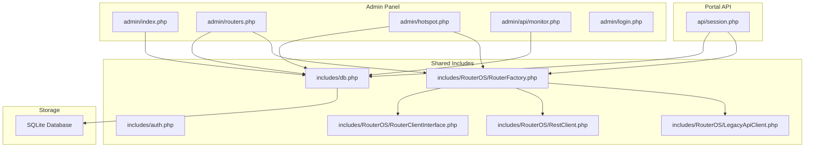
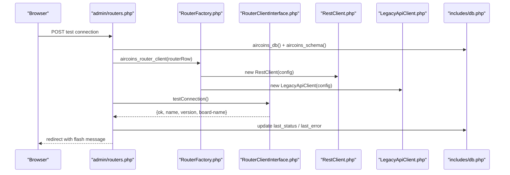
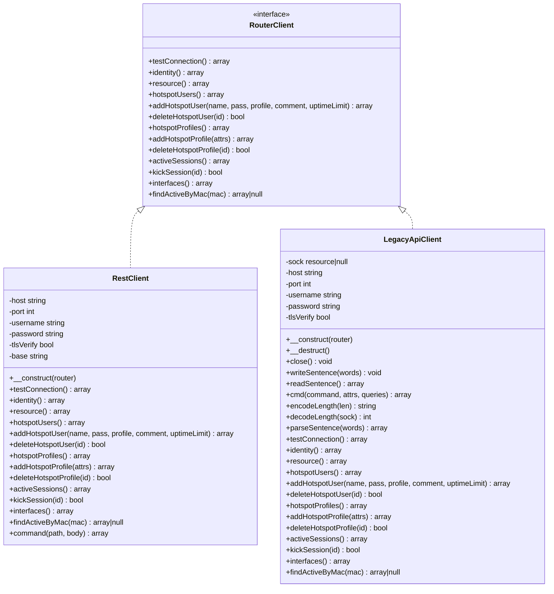
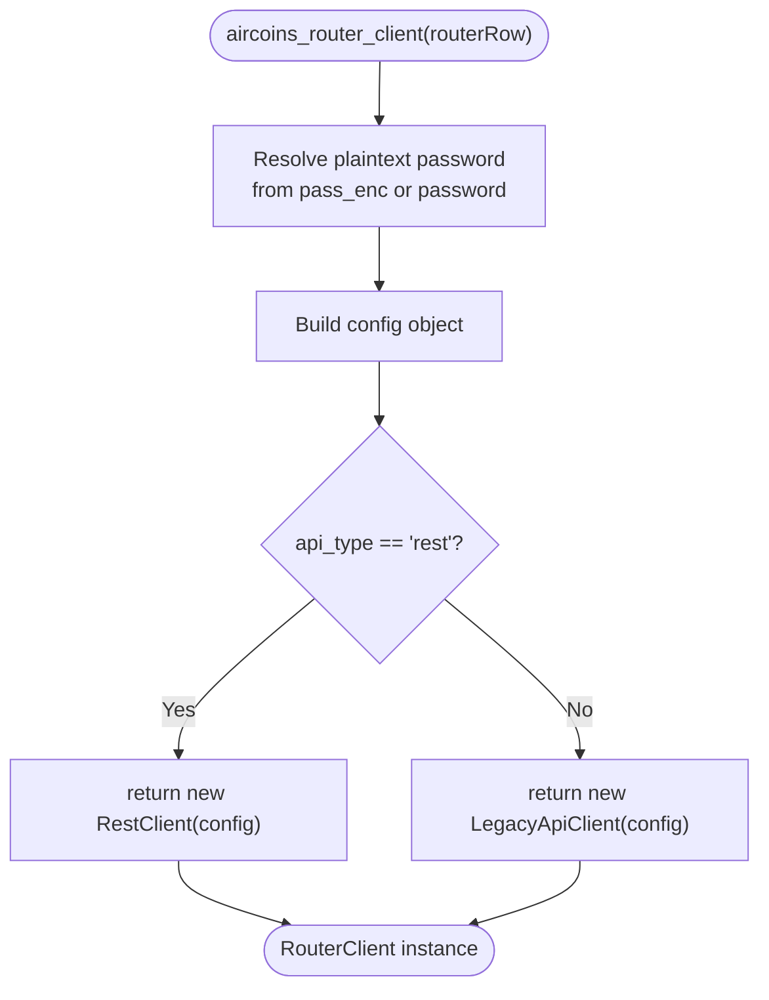
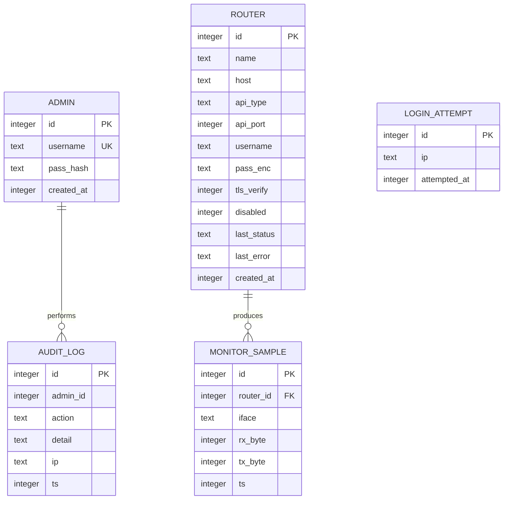
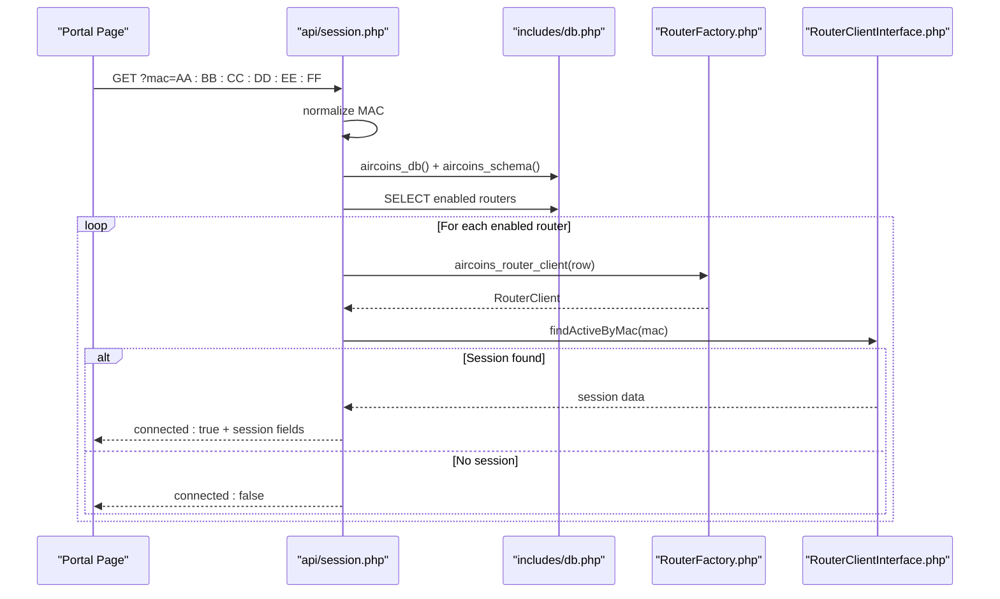
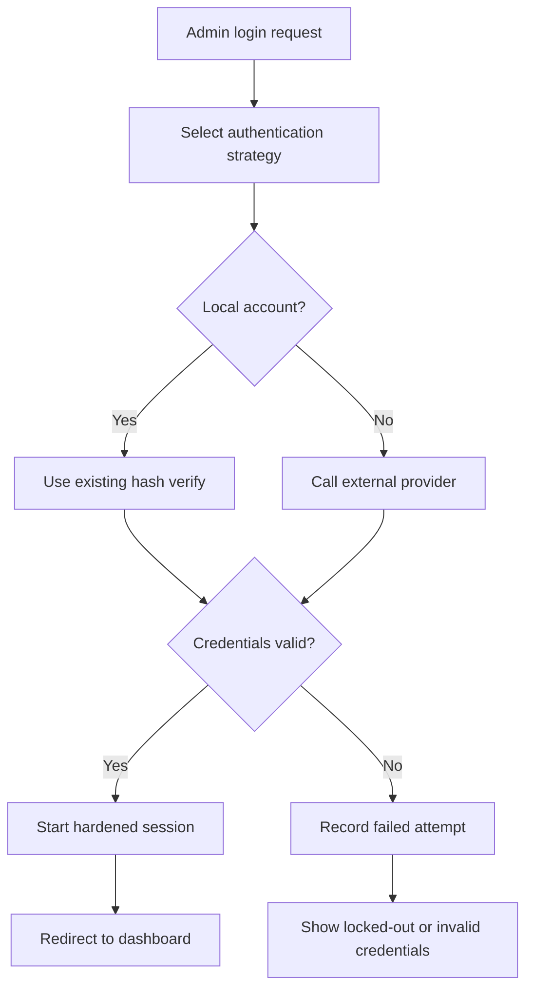
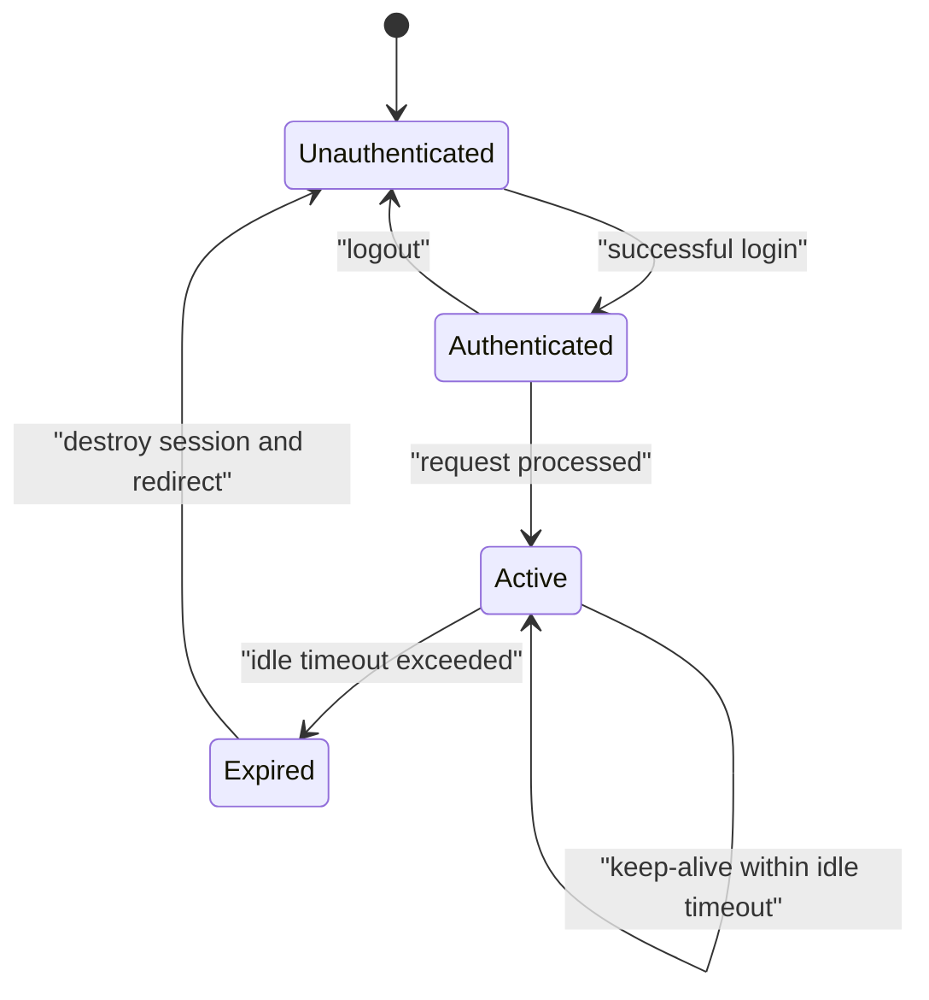
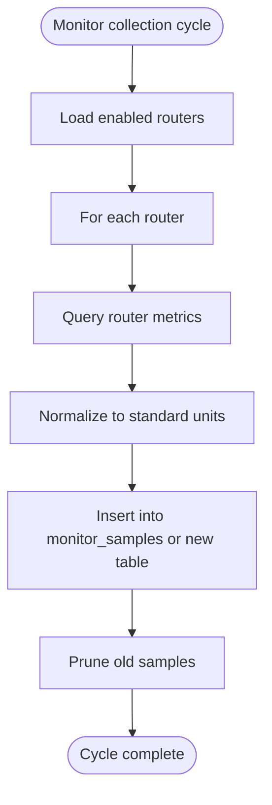
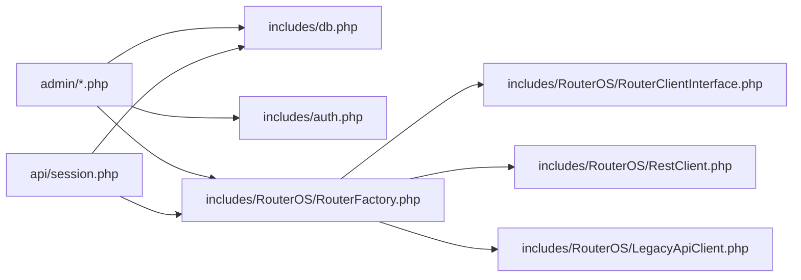

# Feature Extension

<cite>
**Referenced Files in This Document**
- [RouterClientInterface.php](file://includes/RouterOS/RouterClientInterface.php)
- [RestClient.php](file://includes/RouterOS/RestClient.php)
- [LegacyApiClient.php](file://includes/RouterOS/LegacyApiClient.php)
- [RouterFactory.php](file://includes/RouterOS/RouterFactory.php)
- [db.php](file://includes/db.php)
- [auth.php](file://includes/auth.php)
- [login.php](file://admin/login.php)
- [index.php](file://admin/index.php)
- [routers.php](file://admin/routers.php)
- [hotspot.php](file://admin/hotspot.php)
- [session.php](file://api/session.php)
- [monitor.php](file://admin/api/monitor.php)
</cite>

## Table of Contents
1. [Introduction](#introduction)
2. [Project Structure](#project-structure)
3. [Core Components](#core-components)
4. [Architecture Overview](#architecture-overview)
5. [Detailed Component Analysis](#detailed-component-analysis)
6. [Dependency Analysis](#dependency-analysis)
7. [Performance Considerations](#performance-considerations)
8. [Troubleshooting Guide](#troubleshooting-guide)
9. [Conclusion](#conclusion)
10. [Appendices](#appendices)

## Introduction
This document explains how to extend the MT-CONTROLLER-PISOWIFI system, focusing on:
- Extending the RouterOS integration layer with new client types.
- Extending the SQLite-backed data model and repository-style access patterns.
- Adding API endpoints for portal or admin use.
- Integrating third-party services such as payment providers.
- Creating custom authentication methods.
- Building custom admin panel modules.
- Extending session management and monitoring features.
- Maintaining backward compatibility while following existing architectural patterns.

The codebase is a PHP application without Composer dependencies. It uses flat `require_once` includes, a single SQLite database, and a small set of administrative pages plus a portal-facing JSON endpoint. The most important extension points are the router client interface, the factory function, the schema definition, and the request handlers under `admin/` and `api/`.

## Project Structure
At a high level, the project separates concerns into:
- `includes/`: shared libraries (database, configuration, cryptography, CSRF, layout helpers, and RouterOS clients).
- `admin/`: authenticated administrative pages and an internal monitor API.
- `api/`: unauthenticated portal-facing endpoints.
- `hotspot/`: static assets and HTML templates used by the MikroTik external portal flow.
- `deploy/`: deployment examples for Lighttpd, PHP-FPM, and MikroTik scripts.

**Diagram sources**
- [index.php:14-28](file://admin/index.php#L14-L28)
- [routers.php:17-27](file://admin/routers.php#L17-L27)
- [hotspot.php:17-27](file://admin/hotspot.php#L17-L27)
- [session.php:23-25](file://api/session.php#L23-L25)
- [db.php:10-48](file://includes/db.php#L10-L48)
- [RouterFactory.php:12-15](file://includes/RouterOS/RouterFactory.php#L12-L15)
- [RouterClientInterface.php:31-127](file://includes/RouterOS/RouterClientInterface.php#L31-L127)
- [RestClient.php:24-48](file://includes/RouterOS/RestClient.php#L24-L48)
- [LegacyApiClient.php:22-50](file://includes/RouterOS/LegacyApiClient.php#L22-L50)

**Section sources**
- [index.php:1-154](file://admin/index.php#L1-L154)
- [routers.php:1-455](file://admin/routers.php#L1-L455)
- [hotspot.php:1-718](file://admin/hotspot.php#L1-L718)
- [session.php:1-107](file://api/session.php#L1-L107)
- [db.php:1-117](file://includes/db.php#L1-L117)
- [RouterFactory.php:1-56](file://includes/RouterOS/RouterFactory.php#L1-L56)
- [RouterClientInterface.php:1-128](file://includes/RouterOS/RouterClientInterface.php#L1-L128)
- [RestClient.php:1-459](file://includes/RouterOS/RestClient.php#L1-L459)
- [LegacyApiClient.php:1-667](file://includes/RouterOS/LegacyApiClient.php#L1-L667)

## Core Components
The extension surface centers around five areas:

1. **Router client contract**: `RouterClientInterface.php` defines the unified shape that both REST and legacy clients implement.
2. **Router client implementations**: `RestClient.php` and `LegacyApiClient.php` translate the contract into RouterOS v7 REST calls and RouterOS binary API calls respectively.
3. **Router client factory**: `RouterFactory.php` builds the correct client based on stored router configuration.
4. **Database schema and persistence**: `db.php` provides a singleton PDO connection and idempotent schema creation.
5. **Authentication and session layer**: `auth.php` manages login, rate limiting, session hardening, and audit logging.

These components together define where you should add new router client types, new data tables, new admin actions, and new API endpoints.

**Section sources**
- [RouterClientInterface.php:31-127](file://includes/RouterOS/RouterClientInterface.php#L31-L127)
- [RestClient.php:24-222](file://includes/RouterOS/RestClient.php#L24-L222)
- [LegacyApiClient.php:22-599](file://includes/RouterOS/LegacyApiClient.php#L22-L599)
- [RouterFactory.php:29-55](file://includes/RouterOS/RouterFactory.php#L29-L55)
- [db.php:23-116](file://includes/db.php#L23-L116)
- [auth.php:17-281](file://includes/auth.php#L17-L281)

## Architecture Overview
The system follows a layered pattern:
- Request handlers in `admin/` and `api/` load shared includes.
- Handlers call `aircoins_db()` to get a persistent database connection and ensure the schema exists.
- Handlers call `aircoins_router_client()` to obtain a router client instance.
- Router clients implement a stable interface so callers do not care whether they talk to REST or legacy APIs.
- Admin pages render HTML; the portal API returns JSON.
- Authentication protects admin routes; the portal session endpoint is intentionally unauthenticated but read-only.

**Diagram sources**
- [routers.php:116-141](file://admin/routers.php#L116-L141)
- [RouterFactory.php:29-55](file://includes/RouterOS/RouterFactory.php#L29-L55)
- [RestClient.php:54-65](file://includes/RouterOS/RestClient.php#L54-L65)
- [LegacyApiClient.php:429-440](file://includes/RouterOS/LegacyApiClient.php#L429-L440)
- [db.php:23-48](file://includes/db.php#L23-L48)

## Detailed Component Analysis

### RouterOS Integration Layer Extension Points
The RouterOS integration layer exposes three key extension points:

| Extension Point | Purpose | How to Extend | Backward Compatibility Notes |
|---|---|---|---|
| `RouterClientInterface` | Defines the unified contract for all router clients. | Add new methods only when necessary; prefer optional parameters or default values. Existing callers depend on current method shapes. | Do not rename existing methods or change return structures. New methods can be added if consumers opt in. |
| `RestClient` | Implements the contract over RouterOS v7 REST. | Extend HTTP helpers, normalize additional fields, or add new commands via the existing `command()` helper. | Keep existing REST paths and field mappings intact. |
| `LegacyApiClient` | Implements the contract over the RouterOS binary API. | Extend sentence encoding/decoding, command execution, or session mapping. | Preserve challenge-response behavior and error tags. |
| `RouterFactory` | Chooses the correct client implementation from a router row. | Add new `api_type` branches and register new client classes. | Treat unknown types as legacy unless explicitly configured. |

#### Class Diagram: Router Clients

**Diagram sources**
- [RouterClientInterface.php:31-127](file://includes/RouterOS/RouterClientInterface.php#L31-L127)
- [RestClient.php:24-258](file://includes/RouterOS/RestClient.php#L24-L258)
- [LegacyApiClient.php:22-423](file://includes/RouterOS/LegacyApiClient.php#L22-L423)

#### Factory Pattern: Adding a New Router Client Type
To add a new router client type:
1. Create a new class implementing `RouterClientInterface`.
2. Implement every required method, normalizing results to match the documented return shapes.
3. Register the new type in `RouterFactory::aircoins_router_client()` by adding a branch for the new `api_type`.
4. If the new type requires extra configuration, add a column to the `routers` table through `aircoins_schema()` and handle it in the factory.
5. Update admin UI forms and validation if the new type needs new fields.

**Diagram sources**
- [RouterFactory.php:29-55](file://includes/RouterOS/RouterFactory.php#L29-L55)

**Section sources**
- [RouterClientInterface.php:31-127](file://includes/RouterOS/RouterClientInterface.php#L31-L127)
- [RestClient.php:24-222](file://includes/RouterOS/RestClient.php#L24-L222)
- [LegacyApiClient.php:22-599](file://includes/RouterOS/LegacyApiClient.php#L22-L599)
- [RouterFactory.php:29-55](file://includes/RouterOS/RouterFactory.php#L29-L55)

### Database Schema Extensions and Repository Patterns
The database layer is intentionally simple:
- `aircoins_db()` returns a singleton PDO connection.
- `aircoins_schema()` creates all tables using `CREATE TABLE IF NOT EXISTS`, making schema initialization idempotent.
- Tables include administrators, routers, login attempts, audit log, and monitor samples.

When extending data access:
- Add new tables inside `aircoins_schema()` rather than creating ad hoc migration scripts.
- Use prepared statements and parameter binding consistently.
- Wrap database operations in try/catch blocks and convert errors into user-friendly messages.
- Prefer small helper functions per feature area instead of one large monolithic repository.

#### Current Schema Overview
| Table | Purpose | Key Columns | Extension Guidance |
|---|---|---|---|
| `admins` | Administrative accounts | `id`, `username`, `pass_hash`, `created_at` | Add provider-specific fields only if needed; keep core auth minimal. |
| `routers` | RouterOS device configuration | `name`, `host`, `api_type`, `api_port`, `username`, `pass_enc`, `tls_verify`, `disabled`, `last_status`, `last_error`, `created_at` | Add columns for new client types; never store plaintext passwords. |
| `login_attempts` | Brute-force protection | `ip`, `attempted_at` | Extend retention policies carefully; avoid exposing raw attempt details publicly. |
| `audit_log` | Audit trail | `admin_id`, `action`, `detail`, `ip`, `ts` | Add structured action names; avoid storing secrets in `detail`. |
| `monitor_samples` | Interface traffic history | `router_id`, `iface`, `rx_byte`, `tx_byte`, `ts` | Add new metrics by adding columns and updating collection logic. |

**Diagram sources**
- [db.php:58-116](file://includes/db.php#L58-L116)

**Section sources**
- [db.php:23-116](file://includes/db.php#L23-L116)

### API Endpoint Extensions
The portal-facing session endpoint demonstrates the expected pattern for public JSON APIs:
- Set explicit response headers.
- Validate input strictly.
- Normalize MAC addresses.
- Iterate enabled routers safely.
- Catch exceptions and return safe responses without leaking stack traces.
- Return a stable JSON contract.

To add a new API endpoint:
1. Create a new file under `api/`.
2. Require only the minimal includes needed.
3. Decide whether the endpoint requires admin authentication or is public.
4. Validate and sanitize all inputs.
5. Use `aircoins_db()` and `aircoins_router_client()` where appropriate.
6. Return JSON with consistent success/error shapes.
7. Avoid returning stack traces or sensitive internals.

**Diagram sources**
- [session.php:40-106](file://api/session.php#L40-L106)
- [RouterFactory.php:29-55](file://includes/RouterOS/RouterFactory.php#L29-L55)
- [RouterClientInterface.php:120-127](file://includes/RouterOS/RouterClientInterface.php#L120-L127)

**Section sources**
- [session.php:1-107](file://api/session.php#L1-L107)

### Payment Provider Integration
The current codebase does not contain a built-in payment provider abstraction. However, the architecture supports integrating third-party payment systems through these recommended extension points:

1. **Create a payment service module** under a new directory such as `includes/payments/`.
2. **Define a payment provider interface** similar to `RouterClientInterface`, with methods like:
   - `createPayment(amount, currency, metadata)`
   - `verifyPayment(paymentId)`
   - `refundPayment(paymentId)`
   - `getBalance()`
3. **Implement concrete providers** for each payment gateway.
4. **Add a provider registry or factory** that selects the active provider based on configuration.
5. **Persist payment records** in a new `payments` table defined in `aircoins_schema()`.
6. **Expose admin endpoints** to view, reconcile, and refund payments.
7. **Expose portal endpoints** to initiate payments and check status.
8. **Audit all payment actions** using `aircoins_audit()`.

Best practices:
- Never log full card numbers, CVVs, or tokens.
- Store only provider IDs, amounts, currencies, statuses, timestamps, and sanitized metadata.
- Use HTTPS and TLS verification for all provider calls.
- Handle retries, timeouts, and partial failures idempotently.
- Separate webhook handling from synchronous payment flows.

[No sources needed since this section provides conceptual guidance based on existing patterns]

### Third-Party Service Integration
Third-party integrations should follow the same principles as payment providers:
- Isolate integration code in dedicated files.
- Use configuration-driven settings.
- Wrap network calls in try/catch blocks.
- Normalize responses into domain objects.
- Log outcomes without secrets.
- Provide admin UI controls for enabling/disabling integrations.

Examples of suitable integration points:
- SMS or email notification services.
- QR code generation services.
- External voucher vendors.
- Analytics or telemetry collectors.

[No sources needed since this section provides conceptual guidance based on existing patterns]

### Custom Authentication Methods
The current admin authentication relies on local usernames and hashed passwords stored in the `admins` table. To support additional authentication methods:

1. **Extend the admin model**:
   - Add columns such as `provider`, `external_id`, `email`, `mfa_enabled`, or `last_login_provider`.
2. **Create an authentication strategy interface**:
   - Methods could include `authenticate(credentials)`, `validateSession(session)`, and `revokeAccess(adminId)`.
3. **Implement strategies**:
   - Local password authentication already exists in `auth.php`.
   - Add LDAP, OAuth, SAML, or token-based strategies as needed.
4. **Update `aircoins_login_ok()`**:
   - Route authentication through a strategy selector.
   - Maintain backward compatibility with existing local accounts.
5. **Protect sessions**:
   - Continue using `aircoins_session_start()` and `aircoins_require_login()`.
6. **Audit authentication events**:
   - Record successful and failed authentications, including provider and reason.

**Diagram sources**
- [auth.php:151-190](file://includes/auth.php#L151-L190)
- [login.php:37-62](file://admin/login.php#L37-L62)

**Section sources**
- [auth.php:17-281](file://includes/auth.php#L17-L281)
- [login.php:1-114](file://admin/login.php#L1-L114)

### Custom Admin Panel Modules
Admin modules should follow the structure of existing pages:
- Require shared includes.
- Call `aircoins_require_login()`.
- Initialize the database and schema.
- Handle CSRF-protected POST actions.
- Render HTML using the shared layout helpers.
- Use flash messages for user feedback.
- Audit destructive or state-changing actions.

Recommended steps:
1. Create a new PHP file under `admin/`, e.g., `admin/payments.php`.
2. Follow the Post-Redirect-Get pattern.
3. Use the existing CSS and layout conventions.
4. Add navigation links from the dashboard or header.
5. Protect all mutating endpoints with CSRF and admin authentication.
6. Write audit entries for important operations.

Example responsibilities for a payments module:
- List pending, completed, and failed payments.
- Initiate manual refunds.
- View provider logs (sanitized).
- Export reconciliation reports.

**Section sources**
- [index.php:14-28](file://admin/index.php#L14-L28)
- [routers.php:47-223](file://admin/routers.php#L47-L223)
- [hotspot.php:86-276](file://admin/hotspot.php#L86-L276)

### Extending Session Management
Session management is centralized in `auth.php`. Extensions should preserve:
- Secure cookie settings.
- SameSite strict policy.
- Idle timeout enforcement.
- Session regeneration after login.
- Clear separation between admin sessions and portal state.

Possible extensions:
- Add multi-session support per admin role.
- Track active sessions with IP and user agent.
- Implement automatic logout on privilege changes.
- Add session-level audit events.

**Diagram sources**
- [auth.php:65-83](file://includes/auth.php#L65-L83)
- [auth.php:202-231](file://includes/auth.php#L202-L231)

**Section sources**
- [auth.php:65-83](file://includes/auth.php#L65-L83)
- [auth.php:202-246](file://includes/auth.php#L202-L246)

### Implementing New Monitoring Features
Monitoring currently collects interface traffic samples and displays them in the dashboard. The monitor API enforces admin authentication and session validity before returning data.

To extend monitoring:
1. Add new metric columns to `monitor_samples` or create a separate metrics table.
2. Extend the collection routine to capture CPU, memory, temperature, or vendor-specific counters.
3. Normalize timestamps and units.
4. Add cleanup jobs to prevent unbounded growth.
5. Expose new metrics through the monitor API or a dedicated metrics endpoint.
6. Update the dashboard cards to display the new metrics.

**Diagram sources**
- [db.php:103-116](file://includes/db.php#L103-L116)
- [monitor.php:33-78](file://admin/api/monitor.php#L33-L78)

**Section sources**
- [db.php:103-116](file://includes/db.php#L103-L116)
- [monitor.php:33-78](file://admin/api/monitor.php#L33-L78)

## Dependency Analysis
The main dependency relationships are:

**Diagram sources**
- [index.php:14-28](file://admin/index.php#L14-L28)
- [routers.php:17-27](file://admin/routers.php#L17-L27)
- [hotspot.php:17-27](file://admin/hotspot.php#L17-L27)
- [session.php:23-25](file://api/session.php#L23-L25)
- [RouterFactory.php:12-15](file://includes/RouterOS/RouterFactory.php#L12-L15)

Key observations:
- The factory decouples admin and portal code from specific router implementations.
- The database layer is shared across all layers.
- Authentication is centralized and reused by admin pages and internal APIs.
- There is no circular dependency between router clients and higher layers.

**Section sources**
- [index.php:14-28](file://admin/index.php#L14-L28)
- [routers.php:17-27](file://admin/routers.php#L17-L27)
- [hotspot.php:17-27](file://admin/hotspot.php#L17-L27)
- [session.php:23-25](file://api/session.php#L23-L25)
- [RouterFactory.php:12-15](file://includes/RouterOS/RouterFactory.php#L12-L15)

## Performance Considerations
- Use the singleton database connection provided by `aircoins_db()` to avoid repeated connections.
- Keep router client lifetimes short; avoid long-lived socket connections unless necessary.
- Prefer filtered queries and indexes; the schema already includes useful indexes for login attempts and monitor samples.
- Avoid loading all hotspot users or sessions into memory for large deployments; paginate or limit results.
- Cache read-only configuration where safe, but invalidate caches when router configuration changes.
- Monitor SQLite WAL mode performance and adjust busy timeout if concurrent writes become a bottleneck.
- Limit bulk voucher generation and batch operations to reasonable sizes to avoid long-running requests.

[No sources needed since this section provides general guidance]

## Troubleshooting Guide
Common issues and their likely locations:

| Symptom | Likely Cause | Where to Investigate |
|---|---|---|
| Router test fails | Wrong host, port, credentials, TLS settings, or disabled service | `admin/routers.php` test action and router client constructors |
| REST client throws HTTP errors | Router returned non-2xx status or malformed JSON | `includes/RouterOS/RestClient.php` request and error handling |
| Legacy client throws trap or fatal | Binary protocol error or authentication failure | `includes/RouterOS/LegacyApiClient.php` login and command execution |
| Admin login blocked | Rate-limited due to too many failed attempts | `includes/auth.php` rate limiting and `admin/login.php` error messages |
| Session expires unexpectedly | Idle timeout exceeded | `includes/auth.php` session checks |
| Portal shows not connected | MAC normalization issue or no active session on enabled routers | `api/session.php` MAC normalization and router iteration |
| Dashboard metrics missing | Monitor collection not running or no recent samples | `admin/api/monitor.php` and `includes/db.php` monitor table |

**Section sources**
- [routers.php:116-141](file://admin/routers.php#L116-L141)
- [RestClient.php:270-316](file://includes/RouterOS/RestClient.php#L270-L316)
- [LegacyApiClient.php:101-167](file://includes/RouterOS/LegacyApiClient.php#L101-L167)
- [auth.php:103-138](file://includes/auth.php#L103-L138)
- [auth.php:202-231](file://includes/auth.php#L202-L231)
- [session.php:40-106](file://api/session.php#L40-L106)
- [monitor.php:33-78](file://admin/api/monitor.php#L33-L78)

## Conclusion
Extending MT-CONTROLLER-PISOWIFI is most effective when you respect its existing boundaries:
- Add new router client types by implementing `RouterClientInterface` and registering them in the factory.
- Extend the database schema through `aircoins_schema()` and keep persistence logic close to the feature it serves.
- Add API endpoints following the portal session pattern: validate input, protect sensitive routes, and return stable JSON.
- Integrate third-party services with isolated modules, strong error handling, and audit logging.
- Extend authentication by introducing strategy-based providers while preserving local account compatibility.
- Build admin modules using the established request-handling, CSRF, flash-message, and audit patterns.
- Extend session management and monitoring by augmenting the centralized auth and monitoring layers.

Following these patterns ensures backward compatibility, clear ownership of responsibilities, and a maintainable evolution path for future features.

[No sources needed since this section summarizes without analyzing specific files]

## Appendices

### Best Practices for Backward Compatibility
- Do not rename existing interface methods or change documented return shapes.
- Add optional parameters with defaults rather than breaking existing calls.
- Treat unknown router `api_type` values as legacy unless explicitly configured.
- Keep new database columns nullable and optional during rollout.
- Preserve existing flash messages and redirect behavior in admin pages.
- Avoid exposing stack traces or internal error details in public APIs.
- Audit new destructive actions consistently.

[No sources needed since this section provides general guidance]