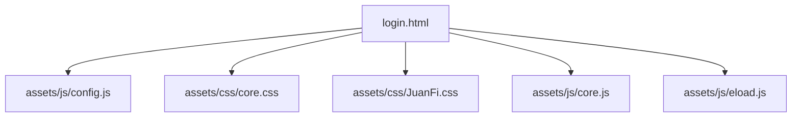
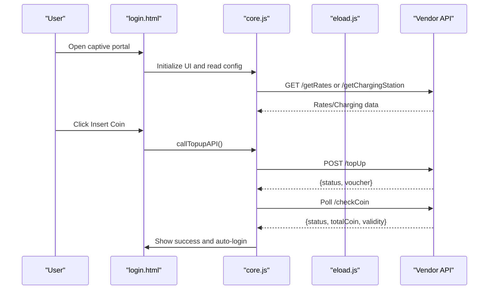
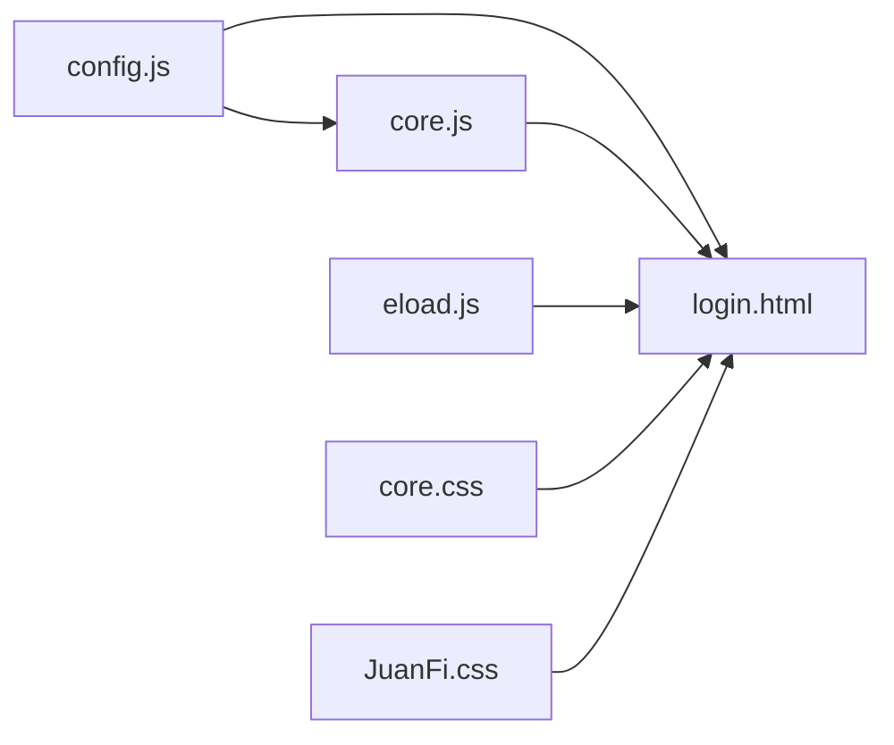

# Portal Customization

<cite>
**Referenced Files in This Document**
- [config.js](file://hotspot/assets/js/config.js)
- [login.html](file://hotspot/login.html)
- [core.css](file://hotspot/assets/css/core.css)
- [JuanFi.css](file://hotspot/assets/css/JuanFi.css)
- [core.js](file://hotspot/assets/js/core.js)
- [eload.js](file://hotspot/assets/js/eload.js)
- [config.php](file://includes/config.php)
</cite>

## Table of Contents
1. [Introduction](#introduction)
2. [Project Structure](#project-structure)
3. [Core Components](#core-components)
4. [Architecture Overview](#architecture-overview)
5. [Detailed Component Analysis](#detailed-component-analysis)
6. [Dependency Analysis](#dependency-analysis)
7. [Performance Considerations](#performance-considerations)
8. [Troubleshooting Guide](#troubleshooting-guide)
9. [Conclusion](#conclusion)
10. [Appendices](#appendices)

## Introduction
This document explains how to customize the captive portal interface, including configuration options, UI styling, images, feature toggles, voucher system behavior, member login, and QR code integration. It is intended for administrators and developers who want to adapt the portal’s appearance and behavior without changing core logic.

The customization surface includes:
- Frontend configuration in a JavaScript file
- HTML structure and inline styles in the login page
- CSS files for layout and branding
- Runtime behavior controlled by JavaScript modules
- Server-side constants for administrative settings

## Project Structure
The portal is composed of:
- A main login page that loads assets and renders the user interface
- A JavaScript configuration file for feature toggles and multi-vendor setup
- CSS files defining theme variables, layout, and responsive rules
- Core runtime scripts handling login flows, coin slot interactions, charging stations, e-load, and QR purchase flow

**Diagram sources**
- [login.html:6-19](file://hotspot/login.html#L6-L19)
- [login.html:747-752](file://hotspot/login.html#L747-L752)
- [config.js:1-63](file://hotspot/assets/js/config.js#L1-L63)
- [core.css:1-29](file://hotspot/assets/css/core.css#L1-L29)
- [JuanFi.css:1-324](file://hotspot/assets/css/JuanFi.css#L1-L324)
- [core.js:30-211](file://hotspot/assets/js/core.js#L30-L211)
- [eload.js:1-357](file://hotspot/assets/js/eload.js#L1-L357)

**Section sources**
- [login.html:1-775](file://hotspot/login.html#L1-L775)
- [config.js:1-63](file://hotspot/assets/js/config.js#L1-L63)
- [core.css:1-29](file://hotspot/assets/css/core.css#L1-L29)
- [JuanFi.css:1-324](file://hotspot/assets/css/JuanFi.css#L1-L324)
- [core.js:1-959](file://hotspot/assets/js/core.js#L1-L959)
- [eload.js:1-357](file://hotspot/assets/js/eload.js#L1-L357)

## Core Components
- Configuration (config.js): Multi-vendor setup, login mode, feature toggles, default vendor IP, and UI flags.
- Login Page (login.html): DOM structure, inline theme variables, asset loading, modals, and event wiring.
- Styles (core.css, JuanFi.css): Spinner, utility classes, legacy theme, and responsive adjustments.
- Runtime Logic (core.js, eload.js): Vendo selection, feature visibility, voucher flow, coin slot polling, charging station UI, e-load workflow, and QR purchase flow.
- Server Constants (config.php): Administrative session and rate-limiting constants not directly used by the portal UI.

Key responsibilities:
- config.js exposes global flags consumed by core.js and login.html.
- login.html defines the visual structure and embeds inline CSS variables for theming.
- core.js reacts to configuration flags to show/hide elements and drive business flows.
- eload.js manages the e-load product selection and payment flow.

**Section sources**
- [config.js:1-63](file://hotspot/assets/js/config.js#L1-L63)
- [login.html:21-344](file://hotspot/login.html#L21-L344)
- [core.css:1-29](file://hotspot/assets/css/core.css#L1-L29)
- [JuanFi.css:1-324](file://hotspot/assets/css/JuanFi.css#L1-L324)
- [core.js:30-211](file://hotspot/assets/js/core.js#L30-L211)
- [eload.js:1-357](file://hotspot/assets/js/eload.js#L1-L357)
- [config.php:1-44](file://includes/config.php#L1-L44)

## Architecture Overview
The portal follows a client-side driven architecture:
- The login page loads Bootstrap, toast notifications, MD5 hashing, and custom scripts.
- The configuration script sets feature flags before runtime logic executes.
- Core runtime initializes UI state based on configuration and router-provided variables.
- Vendor-specific endpoints are polled for rates, charging stations, and coin slot status.
- Modals provide interactive flows for insert coin, promo rates, charging, e-load, and QR purchase.

**Diagram sources**
- [login.html:474-487](file://hotspot/login.html#L474-L487)
- [core.js:264-298](file://hotspot/assets/js/core.js#L264-L298)
- [core.js:490-549](file://hotspot/assets/js/core.js#L490-L549)
- [core.js:633-760](file://hotspot/assets/js/core.js#L633-L760)

## Detailed Component Analysis

### Configuration Options (config.js)
This file centralizes all frontend customization flags:
- Multi-vendor setup
  - isMultiVendo: Enable multi-vendor mode
  - multiVendoOption: Selection strategy (traditional, auto-select by hotspot address, or interface name)
  - multiVendoAddresses: Array of vendors with names, IPs, and per-vendor feature flags (chargingEnable, eloadEnable), plus optional hotspotAddress and interfaceName for auto-selection
- Login options
  - loginOption: Traditional voucher-only vs username+password
  - macAsVoucherCode: Use device MAC as voucher code
- Feature toggles
  - dataRateOption: Show data usage info in promo rates
  - showPauseTime: Show pause/logout controls
  - showMemberLogin: Show member login link
  - showExtendTimeButton: Show extend time button
  - disableVoucherInput: Hide voucher input field
  - qrCodeVoucherPurchase: Show QR purchase option
- Defaults
  - vendorIpAddress: Default vendor IP when not using multi-vendor

How these flags affect the UI:
- core.js reads these flags at startup to hide/show buttons and links, populate vendor selector, and enable/disable features like QR purchase and member login.

Common customizations:
- Change default vendor IP: Set vendorIpAddress
- Enable member login: Set showMemberLogin to true
- Disable voucher input: Set disableVoucherInput to true
- Enable QR purchase: Set qrCodeVoucherPurchase to true
- Configure multi-vendor: Set isMultiVendo and define multiVendoAddresses

**Section sources**
- [config.js:1-63](file://hotspot/assets/js/config.js#L1-L63)
- [core.js:75-164](file://hotspot/assets/js/core.js#L75-L164)

### Login Page Structure and Inline Theming (login.html)
The login page defines:
- Asset references (Bootstrap, toast, core styles, brand styles, scripts)
- Inline CSS variables for colors and typography
- Main container and sections: banner, content area, status, timer, error messages, vendo selector, action buttons, voucher input, member/QR links, footer
- Modals: insert coin, promo rates, charging station, e-load, scan QR, member login
- Router variables injected via server templates (e.g., $(mac), $(ip), $(link-login-only))

Inline theme variables:
- --piso-primary, --piso-primary-dark, --piso-danger, --piso-gray, --piso-bg, --piso-card, --piso-text, --piso-muted
These control the primary color palette, background, card color, text color, and muted text color.

Responsive considerations:
- Viewport meta tag ensures mobile-friendly scaling
- Container max-width centers content on larger screens
- Flexbox layouts and relative units improve responsiveness

Customization examples:
- Change branding colors: Modify CSS variables in the inline style block
- Replace banner image: Update the banner img src path
- Add custom logo: Insert an img element inside the banner section
- Hide specific buttons: Toggle corresponding flags in config.js or add CSS display:none rules

**Section sources**
- [login.html:6-19](file://hotspot/login.html#L6-L19)
- [login.html:21-344](file://hotspot/login.html#L21-L344)
- [login.html:438-500](file://hotspot/login.html#L438-L500)
- [login.html:512-738](file://hotspot/login.html#L512-L738)

### Styling and Branding (core.css, JuanFi.css)
- core.css provides spinner animation and utility classes used across modals and overlays.
- JuanFi.css contains legacy theme styles, modal backgrounds, table styling, and responsive breakpoints.

Recommendations:
- Prefer modifying inline CSS variables in login.html for quick branding changes
- Extend or override existing .piso-* classes for consistent design
- Keep legacy styles intact unless you fully replace the theme

**Section sources**
- [core.css:1-29](file://hotspot/assets/css/core.css#L1-L29)
- [JuanFi.css:1-324](file://hotspot/assets/css/JuanFi.css#L1-L324)

### Runtime Behavior and Feature Visibility (core.js)
Core runtime handles:
- Multi-vendor initialization and selection
- Hiding/showing UI elements based on configuration flags
- Auto-filling voucher from local storage or MAC-based codes
- Enabling QR purchase link visibility
- Managing coin slot workflows, timers, and error handling
- Populating promo rates and charging stations via vendor APIs
- Handling extend-time flows and logout/relogin sequences

Key behaviors tied to configuration:
- If isMultiVendo is false, the vendo selector is hidden
- If showMemberLogin is false, the member login link is hidden
- If qrCodeVoucherPurchase is true, the QR purchase link is shown
- If chargingEnable or eloadEnable are false, respective buttons are hidden or evaluated per vendor

Error handling:
- Toast notifications for errors and successes
- Retry logic for vendor API calls
- Graceful fallbacks when coin slot is busy or expired

**Section sources**
- [core.js:30-211](file://hotspot/assets/js/core.js#L30-L211)
- [core.js:228-240](file://hotspot/assets/js/core.js#L228-L240)
- [core.js:300-370](file://hotspot/assets/js/core.js#L300-L370)
- [core.js:372-447](file://hotspot/assets/js/core.js#L372-L447)
- [core.js:490-631](file://hotspot/assets/js/core.js#L490-L631)
- [core.js:633-760](file://hotspot/assets/js/core.js#L633-L760)

### E-Load Workflow (eload.js)
E-load functionality allows users to select mobile load types and products, then pay via coin slot:
- Fetches compressed rate data from vendor endpoint
- Renders step-by-step modal flow (select type, choose product, confirm, pay)
- Integrates with coin slot polling and processes transactions
- Handles excess coins by converting them into vouchers

Configuration impact:
- eloadEnable flag controls whether the e-load button is available
- Per-vendor eloadEnable can override availability in multi-vendor setups

**Section sources**
- [eload.js:1-357](file://hotspot/assets/js/eload.js#L1-L357)
- [core.js:158-164](file://hotspot/assets/js/core.js#L158-L164)

### QR Code Integration
QR purchase flow:
- When qrCodeVoucherPurchase is enabled, a “Buy via QR” link appears
- Opening the QR modal generates a QR code containing a purchase intent URL with MAC and IP
- The portal polls a data endpoint to detect successful purchases and auto-logs in

Implementation details:
- QR generation uses a QR library loaded in the login page
- Polling interval checks for purchase completion and triggers login

**Section sources**
- [login.html:489-494](file://hotspot/login.html#L489-L494)
- [login.html:677-700](file://hotspot/login.html#L677-L700)
- [login.html:762-770](file://hotspot/login.html#L762-L770)
- [core.js:145-147](file://hotspot/assets/js/core.js#L145-L147)
- [core.js:304-329](file://hotspot/assets/js/core.js#L304-L329)

### Member Login Features
Member login is provided via a modal form that submits credentials to the router’s login endpoint:
- Controlled by showMemberLogin flag
- Uses CHAP challenge-response when applicable
- Can be disabled entirely by setting the flag to false

**Section sources**
- [login.html:704-738](file://hotspot/login.html#L704-L738)
- [core.js:128-130](file://hotspot/assets/js/core.js#L128-L130)

### Voucher System Customization
Voucher behavior includes:
- Traditional voucher entry or MAC-as-voucher
- Optional username+password login mode
- Auto-fill from local storage or external data file
- Extend-time support and re-login flow after successful top-up

Configuration points:
- loginOption: Switch between voucher-only and username+password
- macAsVoucherCode: Use MAC as voucher code
- disableVoucherInput: Hide manual voucher input
- showExtendTimeButton: Control extend-time button visibility

**Section sources**
- [config.js:37-61](file://hotspot/assets/js/config.js#L37-L61)
- [login.html:365-415](file://hotspot/login.html#L365-L415)
- [core.js:139-143](file://hotspot/assets/js/core.js#L139-L143)
- [core.js:490-549](file://hotspot/assets/js/core.js#L490-L549)

## Dependency Analysis
The following diagram shows how components depend on each other:

**Diagram sources**
- [config.js:1-63](file://hotspot/assets/js/config.js#L1-L63)
- [core.js:30-211](file://hotspot/assets/js/core.js#L30-L211)
- [eload.js:1-357](file://hotspot/assets/js/eload.js#L1-L357)
- [login.html:6-19](file://hotspot/login.html#L6-L19)
- [login.html:747-752](file://hotspot/login.html#L747-L752)

**Section sources**
- [config.js:1-63](file://hotspot/assets/js/config.js#L1-L63)
- [core.js:1-959](file://hotspot/assets/js/core.js#L1-L959)
- [eload.js:1-357](file://hotspot/assets/js/eload.js#L1-L357)
- [login.html:1-775](file://hotspot/login.html#L1-L775)

## Performance Considerations
- Minimize unnecessary DOM manipulations in modals; reuse elements where possible
- Debounce or throttle frequent AJAX polling (coin slot checks) if needed
- Optimize images (banner, loading spinner) for size and format
- Avoid heavy animations on low-end devices; consider reducing animation durations
- Ensure vendor API responses are cached appropriately to reduce network overhead

[No sources needed since this section provides general guidance]

## Troubleshooting Guide
Common issues and resolutions:
- QR purchase does not appear: Ensure qrCodeVoucherPurchase is enabled in config.js
- Member login link missing: Verify showMemberLogin is enabled
- Charging/E-load buttons hidden: Check chargingEnable/eloadEnable flags and per-vendor settings in multi-vendor configuration
- Voucher not auto-filled: Confirm ignoreSaveCode and insertCoinRefreshed states; check local storage values
- Error toasts for coin slot: Review errorCodeMap entries and vendor API responses

Relevant implementation areas:
- Error mapping and toast notifications
- Feature visibility toggles
- Local storage interactions for voucher persistence

**Section sources**
- [core.js:1-14](file://hotspot/assets/js/core.js#L1-L14)
- [core.js:62-73](file://hotspot/assets/js/core.js#L62-L73)
- [core.js:128-164](file://hotspot/assets/js/core.js#L128-L164)
- [core.js:798-800](file://hotspot/assets/js/core.js#L798-L800)

## Conclusion
Customizing the captive portal involves adjusting configuration flags, updating inline theme variables, replacing images, and optionally extending CSS and JS behavior. The modular structure allows targeted changes to branding, feature visibility, and workflows such as voucher login, member authentication, QR purchases, and e-load transactions. Always test changes across devices and browsers to ensure consistent behavior.

[No sources needed since this section summarizes without analyzing specific files]

## Appendices

### Common Customization Examples
- Change branding colors:
  - Edit CSS variables in the inline style block of the login page
- Add custom logos:
  - Insert an img element within the banner section
- Modify layout elements:
  - Adjust container width, padding, and spacing via CSS classes
- Enable/disable features:
  - Toggle flags in config.js (member login, QR purchase, charging, e-load, pause time, extend time)

[No sources needed since this section provides general guidance]