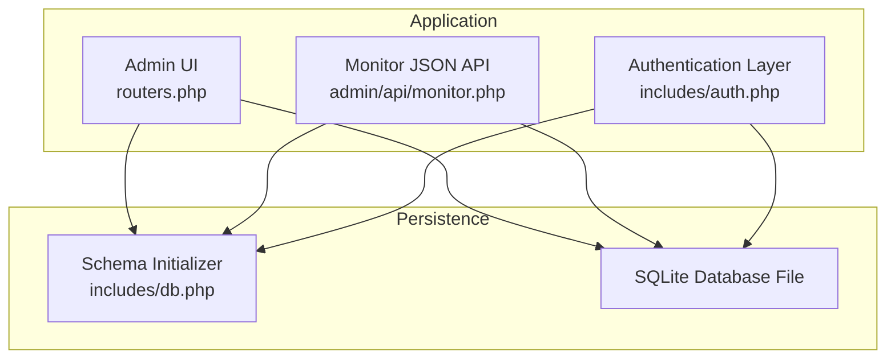
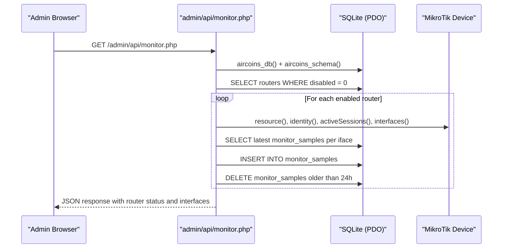
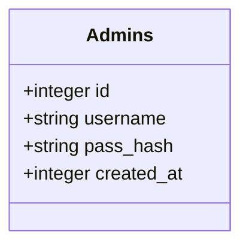
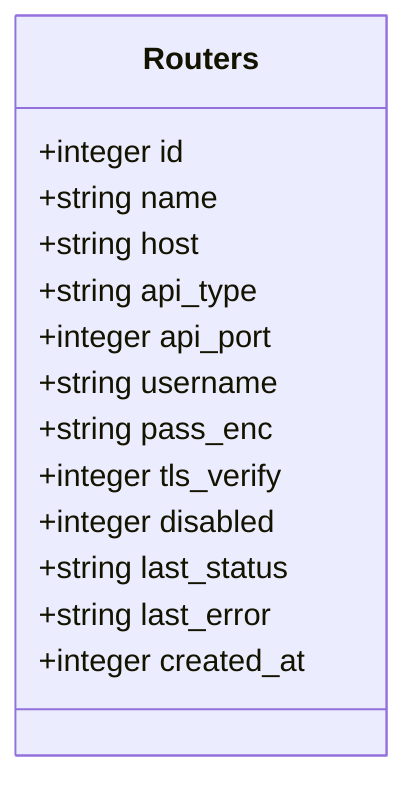
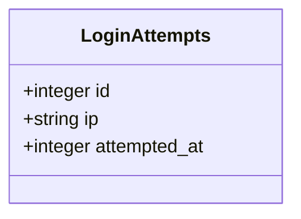
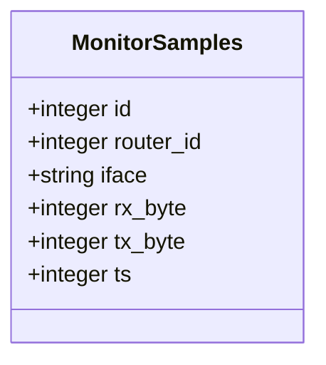
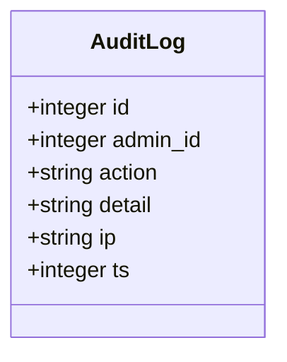
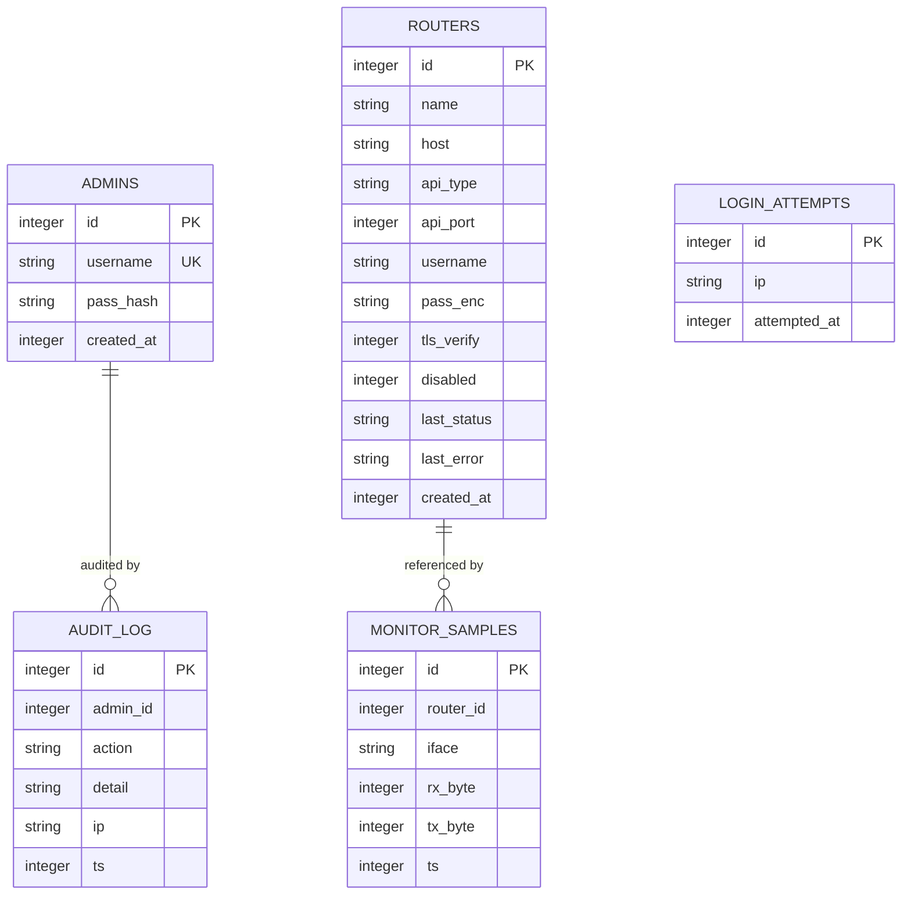
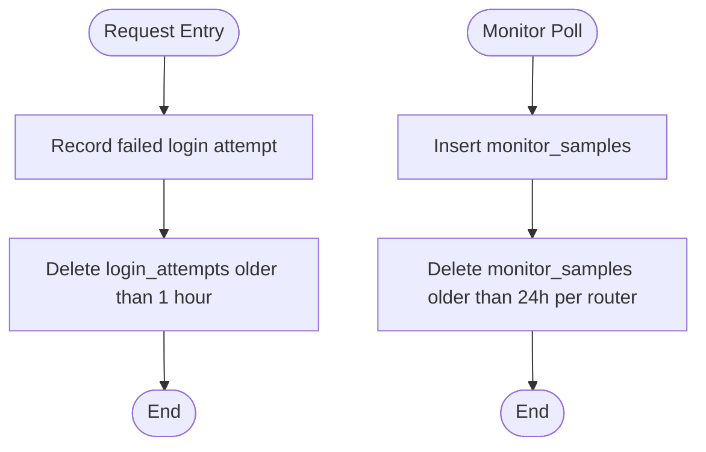

# Database Schema & Data Models

<cite>
**Referenced Files in This Document**   
- [db.php](file://includes/db.php)
- [auth.php](file://includes/auth.php)
- [monitor.php](file://admin/api/monitor.php)
- [routers.php](file://admin/routers.php)
</cite>

## Table of Contents
1. [Introduction](#introduction)
2. [Project Structure](#project-structure)
3. [Core Components](#core-components)
4. [Architecture Overview](#architecture-overview)
5. [Detailed Component Analysis](#detailed-component-analysis)
6. [Dependency Analysis](#dependency-analysis)
7. [Performance Considerations](#performance-considerations)
8. [Data Lifecycle and Retention](#data-lifecycle-and-retention)
9. [Security, Backup, and Migration Procedures](#security-backup-and-migration-procedures)
10. [Sample Data and Common Queries](#sample-data-and-common-queries)
11. [Troubleshooting Guide](#troubleshooting-guide)
12. [Conclusion](#conclusion)

## Introduction
This document describes the SQLite database schema and data models used by the MikroTik controller application. It focuses on the core tables for routers, admin users, login attempts, monitor samples, and audit logging. It explains field definitions, constraints, relationships, validation rules enforced at the database level, access patterns, performance characteristics, retention policies, security considerations, backup strategies, migration procedures, and common administrative queries.

The schema is created idempotently through a PHP persistence layer that initializes the SQLite connection, configures important pragmas, and runs `CREATE TABLE IF NOT EXISTS` statements.

## Project Structure
The database-related logic is primarily implemented in:
- A shared persistence and schema initializer.
- Authentication and rate-limiting helpers that write to login attempts and audit log tables.
- Router management UI and API endpoints that insert, update, and delete router records.
- A live monitoring endpoint that writes traffic samples and prunes old data.

**Diagram sources**
- [db.php:23-48](file://includes/db.php#L23-L48)
- [db.php:56-116](file://includes/db.php#L56-L116)
- [auth.php:103-138](file://includes/auth.php#L103-L138)
- [monitor.php:103-187](file://admin/api/monitor.php#L103-L187)
- [routers.php:23-34](file://admin/routers.php#L23-L34)

**Section sources**
- [db.php:23-48](file://includes/db.php#L23-L48)
- [db.php:56-116](file://includes/db.php#L56-L116)

## Core Components
The database contains five primary entities:
- admins: Administrative user accounts with hashed passwords.
- routers: Configured MikroTik devices and their API connection metadata.
- login_attempts: Rate-limiting counter for failed login attempts per IP.
- monitor_samples: Time-series traffic counters per router interface.
- audit_log: Audit trail for privileged actions.

Key design characteristics:
- All tables are created with `CREATE TABLE IF NOT EXISTS`, making schema initialization safe to run repeatedly.
- Primary keys use auto-increment integers.
- Foreign key enforcement is enabled via SQLite pragma, but explicit foreign key constraints are not declared in DDL; referential integrity is enforced by application logic.
- Indexes are defined for frequently queried composite columns.

**Section sources**
- [db.php:56-116](file://includes/db.php#L56-L116)

## Architecture Overview
The system uses a layered approach:
- The persistence layer provides a singleton PDO connection and ensures the schema exists.
- Authentication functions interact with admins and login_attempts to enforce login security and rate limiting.
- Router management updates routers and deletes related monitor samples when a router is removed.
- The monitor endpoint reads routers, polls device APIs, computes rates from monitor_samples, inserts new samples, and prunes older samples.

**Diagram sources**
- [monitor.php:103-187](file://admin/api/monitor.php#L103-L187)
- [db.php:23-48](file://includes/db.php#L23-L48)
- [db.php:56-116](file://includes/db.php#L56-L116)

## Detailed Component Analysis

### admins Table
Purpose:
- Stores administrative users who can access the admin interface.

Fields:
- id: INTEGER PRIMARY KEY AUTOINCREMENT
- username: TEXT UNIQUE NOT NULL
- pass_hash: TEXT NOT NULL
- created_at: INTEGER (Unix timestamp)

Constraints and validation:
- Unique usernames prevent duplicate admin accounts.
- Passwords are stored as hashes using Argon2id or bcrypt.
- Hash migration occurs on successful login if the stored hash needs rehashing.

Access patterns:
- Login flow selects an admin by username and verifies the password.
- Session-bound requests verify the current session’s admin ID against the table.
- Password updates occur only after successful verification and rehash check.

**Diagram sources**
- [db.php:59-65](file://includes/db.php#L59-L65)

**Section sources**
- [db.php:59-65](file://includes/db.php#L59-L65)
- [auth.php:23-57](file://includes/auth.php#L23-L57)
- [auth.php:151-190](file://includes/auth.php#L151-L190)
- [auth.php:202-231](file://includes/auth.php#L202-L231)

### routers Table
Purpose:
- Stores configuration and state for MikroTik routers managed by the controller.

Fields:
- id: INTEGER PRIMARY KEY AUTOINCREMENT
- name: TEXT NOT NULL
- host: TEXT NOT NULL
- api_type: TEXT NOT NULL CHECK(api_type IN ('rest','legacy'))
- api_port: INTEGER NOT NULL
- username: TEXT NOT NULL
- pass_enc: TEXT NOT NULL
- tls_verify: INTEGER DEFAULT 0
- disabled: INTEGER DEFAULT 0
- last_status: TEXT
- last_error: TEXT
- created_at: INTEGER

Constraints and validation:
- api_type is restricted to 'rest' or 'legacy'.
- Port values are validated in application code to be between 1 and 65535.
- Passwords are encrypted before storage and never rendered back into forms.
- disabled flag excludes routers from monitoring and lookups.

Access patterns:
- CRUD operations performed via routers.php.
- Status fields updated after test connections.
- Deleting a router also removes its monitor_samples rows.

**Diagram sources**
- [db.php:68-82](file://includes/db.php#L68-L82)

**Section sources**
- [db.php:68-82](file://includes/db.php#L68-L82)
- [routers.php:29-34](file://admin/routers.php#L29-L34)
- [routers.php:100-114](file://admin/routers.php#L100-L114)
- [routers.php:143-224](file://admin/routers.php#L143-L224)

### login_attempts Table
Purpose:
- Tracks failed login attempts per client IP to enforce rate limiting.

Fields:
- id: INTEGER PRIMARY KEY AUTOINCREMENT
- ip: TEXT NOT NULL
- attempted_at: INTEGER NOT NULL

Constraints and validation:
- No unique constraint; multiple rows per IP are allowed within the time window.
- Rows older than one hour are pruned automatically when recording new attempts.

Access patterns:
- Failed login increments the count and prunes old rows.
- Successful login clears all recorded attempts for the IP.
- Rate limiting checks whether the number of recent attempts exceeds a threshold.

**Diagram sources**
- [db.php:85-90](file://includes/db.php#L85-L90)

**Section sources**
- [db.php:85-90](file://includes/db.php#L85-L90)
- [auth.php:103-138](file://includes/auth.php#L103-L138)

### monitor_samples Table
Purpose:
- Stores cumulative byte counters per router interface to compute traffic rates.

Fields:
- id: INTEGER PRIMARY KEY AUTOINCREMENT
- router_id: INTEGER NOT NULL
- iface: TEXT NOT NULL
- rx_byte: INTEGER
- tx_byte: INTEGER
- ts: INTEGER

Constraints and validation:
- No explicit foreign key constraint; referential integrity is enforced by application logic.
- Samples are inserted per interface per poll cycle.
- Old samples are pruned per router every poll cycle.

Access patterns:
- Latest sample per (router_id, iface) is read to compute delta-based rates.
- New samples are inserted with current timestamps.
- Pruning deletes samples older than 24 hours per router.

**Diagram sources**
- [db.php:104-112](file://includes/db.php#L104-L112)

**Section sources**
- [db.php:104-112](file://includes/db.php#L104-L112)
- [monitor.php:59-99](file://admin/api/monitor.php#L59-L99)
- [monitor.php:149-166](file://admin/api/monitor.php#L149-L166)

### audit_log Table
Purpose:
- Records administrative actions for auditing and compliance.

Fields:
- id: INTEGER PRIMARY KEY AUTOINCREMENT
- admin_id: INTEGER
- action: TEXT NOT NULL
- detail: TEXT
- ip: TEXT
- ts: INTEGER

Constraints and validation:
- No explicit foreign key constraint; admin_id references admins.id conceptually.
- Action names are machine-readable strings; details provide human-readable context.

Access patterns:
- Written whenever privileged actions occur (e.g., router add/edit/delete/test).
- Includes client IP and timestamp for traceability.

**Diagram sources**
- [db.php:93-101](file://includes/db.php#L93-L101)

**Section sources**
- [db.php:93-101](file://includes/db.php#L93-L101)
- [auth.php:269-281](file://includes/auth.php#L269-L281)
- [routers.php:100-138](file://admin/routers.php#L100-L138)

## Dependency Analysis
Relationships and dependencies:
- admins: Independent entity representing administrators.
- routers: Referenced by monitor_samples via router_id (application-enforced).
- login_attempts: Independent rate-limiting table keyed by IP and timestamp.
- monitor_samples: Dependent on routers; pruned per router lifecycle.
- audit_log: References admins conceptually via admin_id; independent otherwise.

**Diagram sources**
- [db.php:59-112](file://includes/db.php#L59-L112)

**Section sources**
- [db.php:59-112](file://includes/db.php#L59-L112)

## Performance Considerations
Database-level optimizations:
- WAL journal mode improves concurrency and reduces locking contention.
- busy_timeout set to 5 seconds prevents immediate failures under load.
- synchronous=NORMAL balances durability and performance.
- foreign_keys=ON enables SQLite foreign key enforcement at runtime.
- Composite indexes:
  - idx_login_attempts_ip_ts optimizes rate-limit queries by IP and time window.
  - idx_monitor_samples_router_iface_ts optimizes latest-sample lookups and pruning.

Operational considerations:
- Monitor endpoint performs per-router network calls; errors are isolated so one unreachable router does not fail the entire response.
- Pruning monitor_samples limits table growth and keeps queries fast.
- Prepared statements are used throughout to avoid SQL injection and improve execution plans.

[No sources needed since this section provides general guidance]

## Data Lifecycle and Retention
Retention rules:
- login_attempts: Rows older than one hour are deleted when recording new attempts.
- monitor_samples: Rows older than 24 hours per router are deleted during each monitor poll cycle.

Cleanup procedures:
- Automatic cleanup occurs within the same request path that writes data:
  - auth.php prunes login_attempts after insertion.
  - monitor.php prunes monitor_samples after inserting new samples.

**Diagram sources**
- [auth.php:117-126](file://includes/auth.php#L117-L126)
- [monitor.php:164-166](file://admin/api/monitor.php#L164-L166)

**Section sources**
- [auth.php:117-126](file://includes/auth.php#L117-L126)
- [monitor.php:164-166](file://admin/api/monitor.php#L164-L166)

## Security, Backup, and Migration Procedures
Security measures:
- Password hashing uses Argon2id when available, falling back to bcrypt.
- Sessions are hardened with httponly, SameSite=Strict, and Secure flags when over TLS.
- CSRF protection is applied to POST requests in router management.
- Router API passwords are encrypted at rest and never rendered back into forms.
- Audit logging captures privileged actions with IP and timestamp.

Backup strategy:
- Since the database is SQLite, back up the database file directly.
- Ensure consistent backups by stopping writes or using a snapshot mechanism if necessary.
- Include WAL files if present to maintain consistency.

Migration procedures:
- Schema changes should be added to aircoins_schema() using CREATE TABLE IF NOT EXISTS to remain idempotent.
- For altering existing tables, introduce versioned migration scripts executed once and guarded by a version table or feature flag.
- Always test migrations on a staging copy of the SQLite file.

[No sources needed since this section provides general guidance]

## Sample Data and Common Queries
Note: The following queries are illustrative examples for typical administrative tasks. Replace placeholders as needed.

- List enabled routers sorted by name:
  - SELECT * FROM routers WHERE disabled = 0 ORDER BY name COLLATE NOCASE ASC;

- Test connectivity and update status:
  - UPDATE routers SET last_status = 'OK', last_error = NULL WHERE id = :id;

- Delete a router and its samples:
  - DELETE FROM routers WHERE id = :id;
  - DELETE FROM monitor_samples WHERE router_id = :id;

- View latest monitor samples per interface:
  - SELECT ms.router_id, ms.iface, ms.rx_byte, ms.tx_byte, ms.ts
    FROM monitor_samples ms
    INNER JOIN (
      SELECT router_id, iface, MAX(ts) AS max_ts
      FROM monitor_samples
      GROUP BY router_id, iface
    ) latest ON ms.router_id = latest.router_id AND ms.iface = latest.iface AND ms.ts = latest.max_ts;

- Count failed login attempts in the last hour:
  - SELECT COUNT(*) FROM login_attempts WHERE ip = :ip AND attempted_at > :cutoff;

- Clear failed attempts for an IP after successful login:
  - DELETE FROM login_attempts WHERE ip = :ip;

- Audit recent actions:
  - SELECT * FROM audit_log ORDER BY ts DESC LIMIT 100;

[No sources needed since this section provides general guidance]

## Troubleshooting Guide
Common issues and resolutions:
- Database unavailable:
  - The monitor endpoint returns a JSON error when querying routers fails; ensure the SQLite file is accessible and writable.
- Unreachable router:
  - The monitor endpoint isolates errors per router and marks it offline with an error message; verify credentials, TLS settings, and service ports.
- Rate limiting lockout:
  - If too many failed attempts occur within the configured window, logins are blocked; wait for the window to expire or clear attempts after a successful login.
- Stale monitor data:
  - Ensure pruning runs successfully; check that the monitor endpoint is polled regularly and has permissions to delete old samples.

**Section sources**
- [monitor.php:107-112](file://admin/api/monitor.php#L107-L112)
- [monitor.php:179-182](file://admin/api/monitor.php#L179-L182)
- [auth.php:103-138](file://includes/auth.php#L103-L138)

## Conclusion
The SQLite schema provides a compact, efficient foundation for managing MikroTik routers, securing admin access, tracking login attempts, collecting interface traffic metrics, and auditing administrative actions. Application-level validation and constraints complement the limited declarative constraints in SQLite, while indexes and pruning strategies keep performance predictable. Proper backups, security practices, and careful migration procedures will help maintain reliability and safety as the system evolves.

[No sources needed since this section summarizes without analyzing specific files]