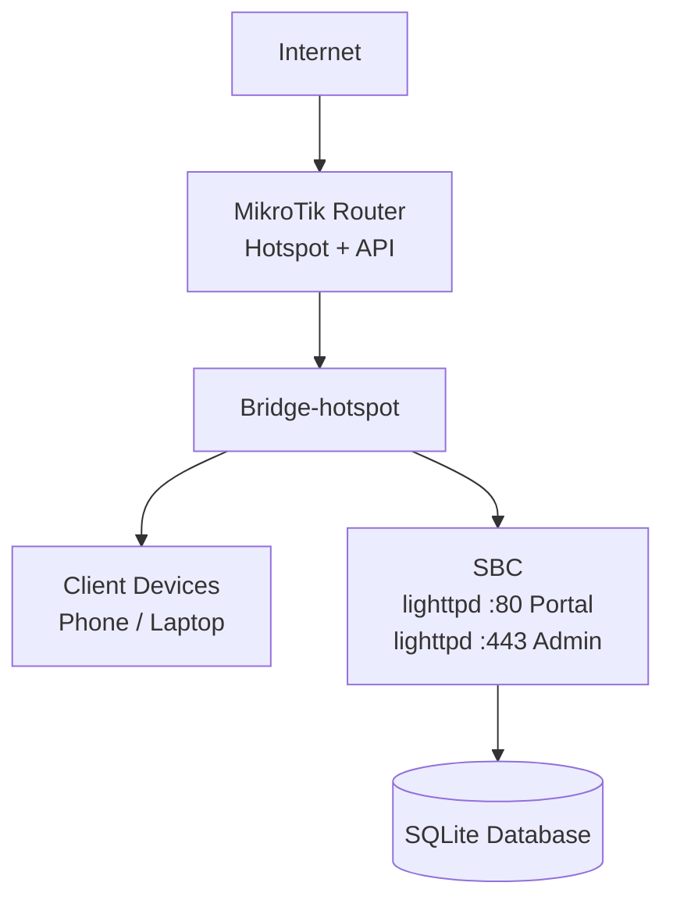
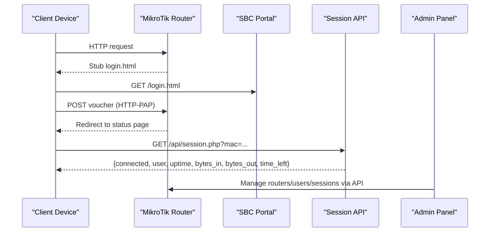
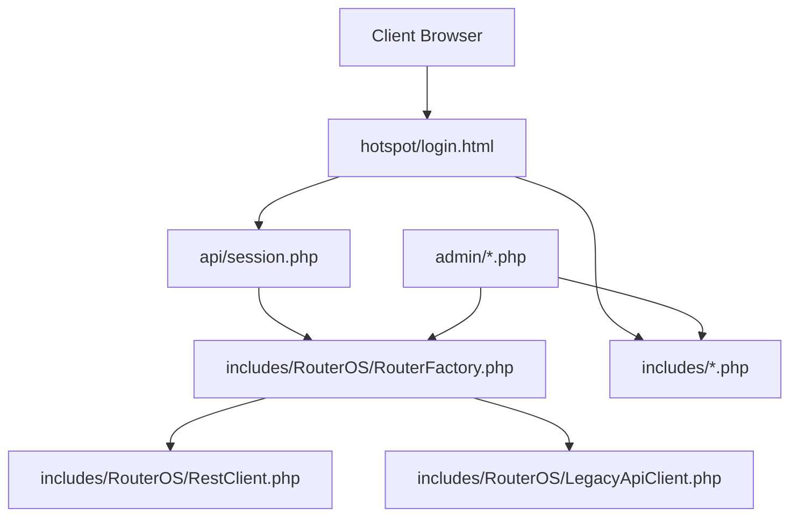

# Getting Started

<cite>
**Referenced Files in This Document**
- [DEPLOYMENT.md](file://DEPLOYMENT.md)
- [install-sbc.sh](file://deploy/scripts/install-sbc.sh)
- [config.php](file://includes/config.php)
- [login.html](file://hotspot/login.html)
- [session.php](file://api/session.php)
</cite>

## Table of Contents
1. [Introduction](#introduction)
2. [What This System Does](#what-this-system-does)
3. [System Requirements](#system-requirements)
4. [Prerequisites](#prerequisites)
5. [Network Topology](#network-topology)
6. [Quick Installation Walkthrough](#quick-installation-walkthrough)
7. [Initial Setup Steps](#initial-setup-steps)
8. [Testing the Authentication Flow](#testing-the-authentication-flow)
9. [Architecture Overview](#architecture-overview)
10. [Detailed Component Analysis](#detailed-component-analysis)
11. [Dependency Analysis](#dependency-analysis)
12. [Performance Considerations](#performance-considerations)
13. [Troubleshooting Guide](#troubleshooting-guide)
14. [Conclusion](#conclusion)

## Introduction
This guide helps you get a coin/voucher-based MikroTik hotspot controller running on a single-board computer (SBC) behind a MikroTik router. The system provides:
- A captive portal for clients to enter vouchers or interact with coin-based services.
- An admin panel to manage routers, hotspot users, vouchers, and active sessions.
- A lightweight PHP session API that tells the status page whether a client is online.

It is designed to run on Debian/Ubuntu/Armbian with minimal RAM and no framework or Composer dependency.

**Section sources**
- [DEPLOYMENT.md:10-28](file://DEPLOYMENT.md#L10-L28)

## What This System Does
The controller splits responsibilities between two hosts:
- **SBC**: runs lighttpd, PHP-FPM, SQLite, and the admin panel. It serves the captive portal and the session lookup API.
- **MikroTik router**: runs the hotspot server, intercepts HTTP requests, authenticates via HTTP-PAP, and exposes an API for the admin panel.

The flow is voucher-driven: a client connects to Wi-Fi, gets redirected to the SBC portal, enters a voucher, and the router authenticates it. After success, the client sees a status page that polls the SBC for live session data.

**Section sources**
- [DEPLOYMENT.md:10-24](file://DEPLOYMENT.md#L10-L24)
- [DEPLOYMENT.md:32-70](file://DEPLOYMENT.md#L32-L70)

## System Requirements
- **Single-board computer** with at least 512 MB RAM and microSD/eMMC storage.
- **Operating system**: Debian 12 (bookworm), Ubuntu 24.04 (noble), or Armbian based on either.
- **Root/sudo access** and `systemd`.
- **git** to clone the repository onto the SBC.
- **Network placement**: the SBC must be on the same L3 subnet as hotspot clients and reachable by them.

These requirements are explicitly called out in the deployment documentation and installer comments.

**Section sources**
- [DEPLOYMENT.md:187-197](file://DEPLOYMENT.md#L187-L197)
- [install-sbc.sh:6-23](file://deploy/scripts/install-sbc.sh#L6-L23)

## Prerequisites
Before installing, ensure your SBC has:
- **PHP 8.2+** (the installer detects and installs the correct version).
- **lighttpd** as the web server.
- **SQLite** for local storage.
- **libsodium** for encrypting stored router passwords.
- Additional PHP extensions: `fpm`, `cli`, `sqlite3`, `curl`, `mbstring`.

The installer automatically installs these packages and verifies that the sodium extension is available.

**Section sources**
- [DEPLOYMENT.md:211-212](file://DEPLOYMENT.md#L211-L212)
- [install-sbc.sh:150-187](file://deploy/scripts/install-sbc.sh#L150-L187)

## Network Topology
In the common setup, the SBC is plugged into the same bridge that carries hotspot clients. The MikroTik router handles DHCP, NAT, hotspot interception, and API access; the SBC serves the portal and admin UI.

**Diagram sources**
- [DEPLOYMENT.md:32-70](file://DEPLOYMENT.md#L32-L70)
- [DEPLOYMENT.md:74-90](file://DEPLOYMENT.md#L74-L90)

**Section sources**
- [DEPLOYMENT.md:74-90](file://DEPLOYMENT.md#L74-L90)

## Quick Installation Walkthrough
Follow these steps to install the controller on the SBC:

1. **Install git and clone the repository:**
   - Run `sudo apt-get install -y git`
   - Clone the repository: `git clone https://github.com/Djnirds1984/MT-CONTROLLER-PISOWIFI.git`
   - Enter the directory: `cd MT-CONTROLLER-PISOWIFI`

2. **Run the automated installer:**
   - Execute `sudo bash deploy/scripts/install-sbc.sh`
   - If you want to point the script at a specific source path, pass it as an argument.

3. **Create the first admin account:**
   - During installation, the script prompts for an admin username and password.
   - These credentials are hashed with Argon2id and stored in the SQLite database.

4. **Verify the installation:**
   - Check that the portal responds on port 80.
   - Check that the admin panel responds on port 443 with a self-signed certificate.
   - Confirm that lighttpd and php-fpm are listening.

The installer is idempotent, meaning you can safely re-run it without breaking an existing setup.

**Section sources**
- [DEPLOYMENT.md:119-127](file://DEPLOYMENT.md#L119-L127)
- [DEPLOYMENT.md:218-241](file://DEPLOYMENT.md#L218-L241)
- [install-sbc.sh:230-241](file://deploy/scripts/install-sbc.sh#L230-L241)
- [install-sbc.sh:397-423](file://deploy/scripts/install-sbc.sh#L397-L423)

## Initial Setup Steps
After installing on the SBC, configure the MikroTik router:

1. **Assign a static IP to the SBC:**
   - Choose an IP outside the hotspot DHCP pool.
   - Example: if the hotspot network is `192.168.88.0/24` and the DHCP range is `.100–.254`, set the SBC to `192.168.88.10`.

2. **Edit the RouterOS script variables:**
   - Open `deploy/mikrotik/hotspot-external-portal.rsc`.
   - Set `sbcIP` to your SBC’s static IP.
   - Set `hsInterface` to the bridge carrying hotspot clients.
   - Match `hsNet`, `hsAddress`, `gwIP`, and `hsPoolRange` to your network.
   - Set `wanInterface` to your internet uplink.

3. **Apply the MikroTik configuration:**
   - In WinBox terminal or SSH, run `/import file-name=hotspot-external-portal.rsc`.
   - This configures hotspot profile, walled garden, ip-binding, DHCP, NAT, and API service.

4. **Upload the router stubs:**
   - Edit each file in `router-stubs/` and replace the placeholder SBC IP with your real IP.
   - Upload them to the router’s `/hotspot` directory:
     - `login.html`
     - `alogin.html`
     - `error.html`
     - `logout.html`

5. **Enable the router API service:**
   - For REST (RouterOS v7): enable `www-ssl` on port 443.
   - For Legacy (v6 or v7): enable `api` on port 8728 or `api-ssl` on port 8729.

6. **Add the router in the admin panel:**
   - Open `https://<SBC_IP>/` and log in with the admin credentials created during installation.
   - Go to **Routers → Add router**.
   - Enter the router name, host, API type, username, and password.
   - Use **Test connection** to verify, then save.

**Section sources**
- [DEPLOYMENT.md:92-171](file://DEPLOYMENT.md#L92-L171)
- [DEPLOYMENT.md:308-390](file://DEPLOYMENT.md#L308-L390)
- [DEPLOYMENT.md:417-438](file://DEPLOYMENT.md#L417-L438)

## Testing the Authentication Flow
Once everything is configured, test the complete flow:

1. Connect a phone or laptop to the hotspot SSID.
2. The device should receive a DHCP address and redirect to `http://<SBC_IP>/login.html?mac=...&ip=...`.
3. Generate a voucher in the admin panel under **Hotspot → Vouchers**.
4. Enter the voucher on the portal and submit.
5. The client should authenticate and land on the status page showing a live countdown.

If the status page shows “not connected,” check:
- The MAC parameter passed to the session API.
- Whether the router is enabled and reachable from the SBC.
- Whether the `/api/` alias is working on port 80.

**Section sources**
- [DEPLOYMENT.md:167-171](file://DEPLOYMENT.md#L167-L171)
- [DEPLOYMENT.md:494-499](file://DEPLOYMENT.md#L494-L499)

## Architecture Overview
The system uses a thin redirect pattern:
- The MikroTik router intercepts HTTP requests and serves a small stub.
- The stub redirects the browser to the SBC portal.
- The SBC portal submits the voucher back to the router using HTTP-PAP.
- On success, the router redirects to the SBC status page.
- The status page polls the SBC session API to show live session data.
- The admin panel manages routers and sessions over the MikroTik API.

**Diagram sources**
- [DEPLOYMENT.md:32-70](file://DEPLOYMENT.md#L32-L70)
- [DEPLOYMENT.md:174-183](file://DEPLOYMENT.md#L174-L183)
- [session.php:1-19](file://api/session.php#L1-L19)

## Detailed Component Analysis

### Captive Portal (`hotspot/login.html`)
The login page is the customer-facing entry point. It supports both router-native CHAP mode and external SBC mode. In external mode, it submits the voucher directly to the router using HTTP-PAP. It also includes modals for coin insertion, promo rates, charging station, e-load, and QR code generation.

Key behaviors:
- Detects external mode and prepares the form action dynamically.
- Uses RouterOS template tokens like `$(mac)`, `$(ip)`, `$(link-login-only)`.
- Integrates with Bootstrap and custom JuanFi assets for coin-based interactions.

**Section sources**
- [login.html:14-19](file://hotspot/login.html#L14-L19)
- [login.html:349-416](file://hotspot/login.html#L349-L416)
- [login.html:437-500](file://hotspot/login.html#L437-L500)

### Session API (`api/session.php`)
The session API is intentionally unauthenticated and read-only. It accepts a MAC address and returns whether that client has an active hotspot session on any enabled router.

Contract:
- Input: `GET ?mac=AA:BB:CC:DD:EE:FF`
- Success response: `{connected:true, user, uptime, bytes_in, bytes_out, time_left}`
- Not connected: `{connected:false}`
- Invalid input: `{connected:false,error}`

It normalizes MAC addresses, queries enabled routers through the RouterFactory, and returns JSON with CORS enabled for this endpoint only.

**Section sources**
- [session.php:1-19](file://api/session.php#L1-L19)
- [session.php:40-48](file://api/session.php#L40-L48)
- [session.php:50-83](file://api/session.php#L50-L83)
- [session.php:89-106](file://api/session.php#L89-L106)

### Configuration (`includes/config.php`)
Central configuration defines constants for:
- SQLite database path.
- libsodium key file path.
- Admin session cookie name.
- Idle timeout for admin sessions.
- Rate limiting for failed login attempts.

These values can be overridden before the file is included, making it flexible for testing or custom deployments.

**Section sources**
- [config.php:1-44](file://includes/config.php#L1-L44)

### Installer (`deploy/scripts/install-sbc.sh`)
The installer provisions the SBC end-to-end:
- Detects architecture, OS, and PHP version.
- Installs lighttpd, PHP-FPM, SQLite, curl, mbstring, and sodium.
- Disables conflicting web servers like Apache or Nginx.
- Deploys the portal, admin panel, includes, and API directories.
- Generates a self-signed TLS certificate for the admin panel.
- Creates a libsodium secret key for encrypting router passwords.
- Initializes the SQLite schema and prompts for the first admin account.
- Configures UFW to allow ports 80 and 443.
- Validates and starts lighttpd.

It prints a verification checklist and points to the next step: configuring the MikroTik redirect.

**Section sources**
- [install-sbc.sh:1-24](file://deploy/scripts/install-sbc.sh#L1-L24)
- [install-sbc.sh:111-187](file://deploy/scripts/install-sbc.sh#L111-L187)
- [install-sbc.sh:205-253](file://deploy/scripts/install-sbc.sh#L205-L253)
- [install-sbc.sh:258-289](file://deploy/scripts/install-sbc.sh#L258-L289)
- [install-sbc.sh:294-355](file://deploy/scripts/install-sbc.sh#L294-L355)
- [install-sbc.sh:361-423](file://deploy/scripts/install-sbc.sh#L361-L423)

## Dependency Analysis
The system has clear separation between frontend, backend, and router integration:

**Diagram sources**
- [session.php:23-25](file://api/session.php#L23-L25)
- [DEPLOYMENT.md:508-534](file://DEPLOYMENT.md#L508-L534)

**Section sources**
- [session.php:23-25](file://api/session.php#L23-L25)
- [DEPLOYMENT.md:508-534](file://DEPLOYMENT.md#L508-L534)

## Performance Considerations
- The PHP-FPM pool uses `ondemand` mode, spawning workers only when needed.
- SQLite runs with WAL mode and reduced synchronous writes to minimize disk wear.
- Access logging is disabled to reduce I/O overhead.
- The admin panel monitors live traffic but prunes historical samples to 24 hours.
- Time synchronization is important for rate limiting, TLS, and session timeouts.

For long-term stability on SBCs, consider using a quality endurance microSD and enabling time sync via `systemd-timesyncd` or `chrony`.

**Section sources**
- [DEPLOYMENT.md:288-293](file://DEPLOYMENT.md#L288-L293)
- [DEPLOYMENT.md:500-502](file://DEPLOYMENT.md#L500-L502)

## Troubleshooting Guide
Common issues and resolutions:

- **Port 80 already in use:** Another service like Apache, Nginx, or Pi-hole may be blocking the portal. Stop or disable the conflicting service.
- **Armbian firewall blocks ports:** Some Armbian images use nftables instead of UFW. Open ports 80 and 443 in the appropriate firewall.
- **PAP plaintext warning:** Vouchers are submitted in cleartext over the isolated hotspot LAN. Keep the hotspot on its own VLAN or SSID.
- **REST API errors:** Check authentication, content type, path formatting, and whether `www-ssl` is enabled.
- **Legacy API traps:** A `!trap` message explains failures like invalid credentials or missing items. Verify the API service is enabled.
- **Session API returns not connected:** Ensure the MAC parameter is correct, the router is enabled and reachable, and the `/api/` alias is working.
- **SD card wear:** Disable unnecessary logging and consider log rotation or `log2ram`.
- **Time sync issues:** Wrong clock causes spurious logouts and TLS warnings. Enable NTP.

**Section sources**
- [DEPLOYMENT.md:473-505](file://DEPLOYMENT.md#L473-L505)

## Conclusion
You now have the essentials to deploy and operate the MT-CONTROLLER-PISOWIFI system. Start with the SBC installation, configure the MikroTik router, upload the stubs, add the router in the admin panel, and test the voucher flow. Once running, you can customize the portal, generate vouchers, monitor sessions, and troubleshoot common issues using the guidance above.