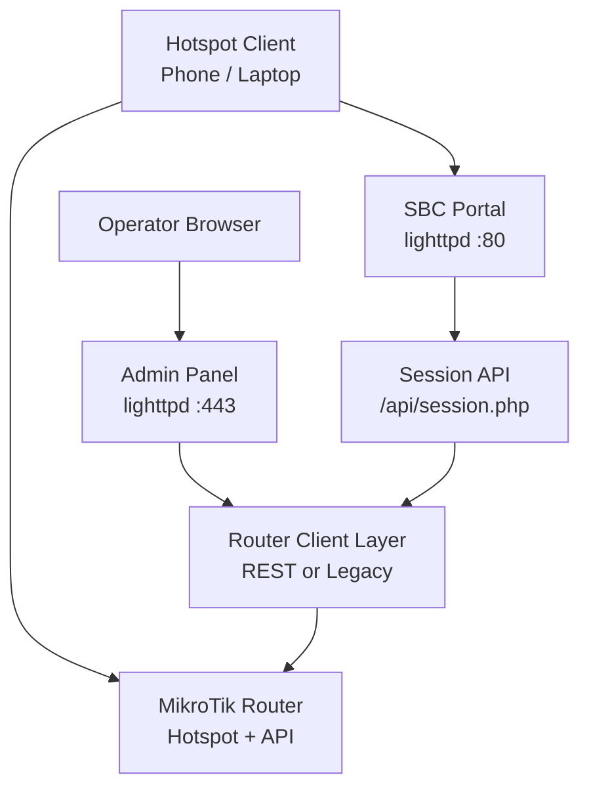
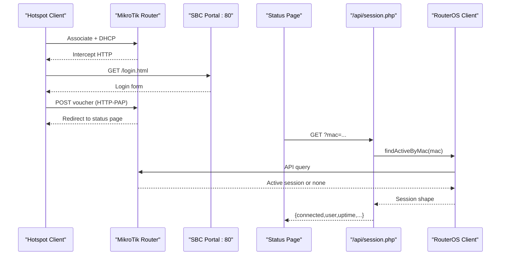
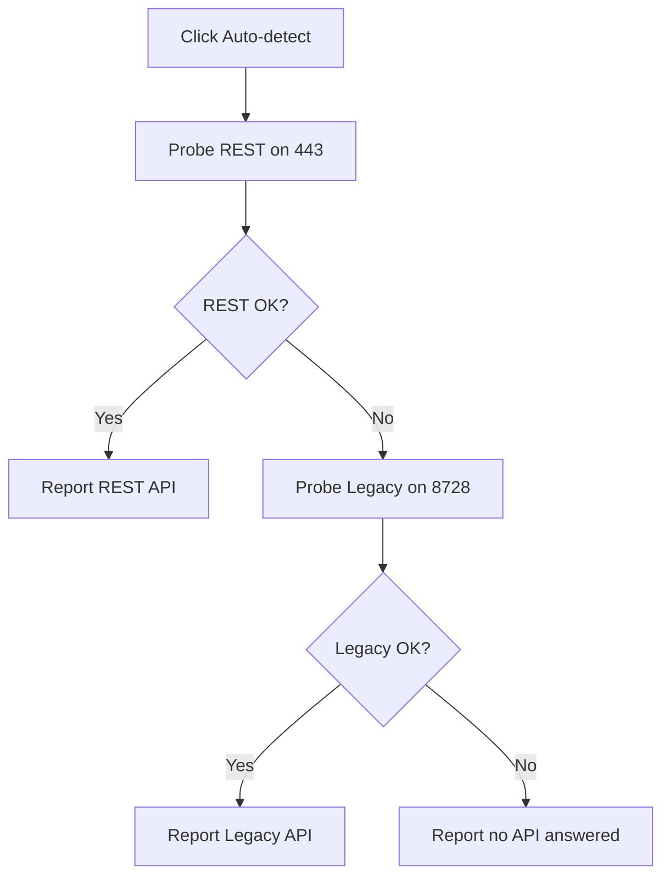
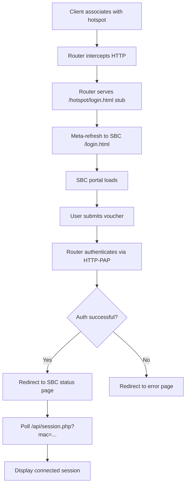
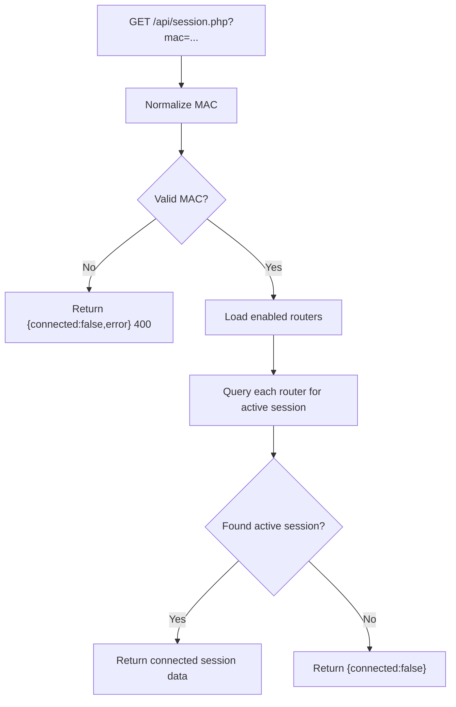
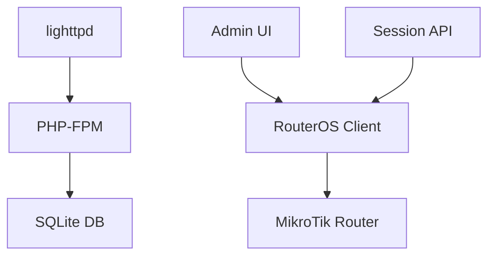

# Deployment Verification & Testing

<cite>
**Referenced Files in This Document**   
- [DEPLOYMENT.md](file://DEPLOYMENT.md)
- [install-sbc.sh](file://deploy/scripts/install-sbc.sh)
- [hotspot-external-portal.rsc](file://deploy/mikrotik/hotspot-external-portal.rsc)
- [config.php](file://includes/config.php)
- [db.php](file://includes/db.php)
- [session.php](file://api/session.php)
- [login.html](file://hotspot/login.html)
- [status.html](file://hotspot/status.html)
- [index.php](file://admin/index.php)
- [routers.php](file://admin/routers.php)
- [login.php](file://admin/login.php)
- [RouterFactory.php](file://includes/RouterOS/RouterFactory.php)
</cite>

## Table of Contents
1. [Introduction](#introduction)
2. [Project Structure](#project-structure)
3. [Core Components](#core-components)
4. [Architecture Overview](#architecture-overview)
5. [Detailed Component Analysis](#detailed-component-analysis)
6. [Dependency Analysis](#dependency-analysis)
7. [Performance Considerations](#performance-considerations)
8. [Troubleshooting Guide](#troubleshooting-guide)
9. [Conclusion](#conclusion)
10. [Appendices](#appendices)

## Introduction
This document provides a complete deployment verification and testing guide for MT-CONTROLLER-PISOWIFI (AIRCOINS NETFI). It focuses on validating:

- Web server accessibility on the SBC (port 80 portal, port 443 admin panel).
- Database connectivity using SQLite.
- RouterOS API communication via REST or Legacy API.
- Captive portal login flow from a client device.
- Administrative panel access, router discovery, and session management.
- Diagnostic commands and log analysis techniques.
- Production readiness checklists and performance baselines.

The system is split between an SBC running lighttpd + PHP-FPM and a MikroTik hotspot router that performs HTTP-PAP authentication and exposes either REST or Legacy API endpoints.

## Project Structure
At a high level, the repository contains:

- `hotspot/` — captive portal HTML, assets, and JavaScript.
- `router-stubs/` — thin MikroTik pages uploaded to `/hotspot`.
- `admin/` — operator web UI for routers, users, vouchers, and sessions.
- `api/session.php` — unauthenticated JSON endpoint returning live session data by MAC.
- `includes/` — shared PHP core: configuration, database, crypto, CSRF, helpers, layout, and RouterOS clients.
- `deploy/` — installer, lighttpd config, php-fpm pool, RouterOS script, and update scripts.

**Diagram sources**
- [DEPLOYMENT.md:32-70](file://DEPLOYMENT.md#L32-L70)
- [session.php:1-19](file://api/session.php#L1-L19)
- [index.php:1-10](file://admin/index.php#L1-L10)

**Section sources**
- [DEPLOYMENT.md:508-558](file://DEPLOYMENT.md#L508-L558)

## Core Components
The verification process should validate these components in order:

| Component | Purpose | Primary Verification Target |
|---|---|---|
| Lighttpd web server | Serves static portal on port 80 and admin panel on port 443 | HTTP responses, TLS certificate, listening sockets |
| PHP-FPM | Executes PHP for admin panel and session API | Socket presence, error log, fastcgi mapping |
| SQLite database | Stores admins, routers, audit logs, monitor samples | Schema creation, read/write access |
| Captive portal | Presents login and status pages to hotspot clients | Redirect chain, voucher submission, status polling |
| Session API | Returns whether a MAC has an active session | JSON contract, CORS, fallback behavior |
| RouterOS API client | Talks to MikroTik over REST or Legacy API | Auto-detect, test connection, session lookup |
| Admin panel | Manages routers, hotspot users, vouchers, sessions | Login, CSRF protection, dashboard metrics |

**Section sources**
- [install-sbc.sh:397-424](file://deploy/scripts/install-sbc.sh#L397-L424)
- [config.php:15-43](file://includes/config.php#L15-L43)
- [db.php:14-48](file://includes/db.php#L14-L48)
- [session.php:1-19](file://api/session.php#L1-L19)

## Architecture Overview
The end-to-end flow is:

1. A client associates with the hotspot and receives DHCP.
2. The first HTTP request is intercepted by the router and redirected to the SBC portal.
3. The SBC serves the login page; the browser submits the voucher back to the router using HTTP-PAP.
4. On success, the router redirects to the SBC status page.
5. The status page polls `/api/session.php?mac=...` every 10 seconds.
6. The session API queries enabled routers through the selected API type.
7. The admin panel manages routers and sessions over HTTPS.

**Diagram sources**
- [DEPLOYMENT.md:32-70](file://DEPLOYMENT.md#L32-L70)
- [DEPLOYMENT.md:174-184](file://DEPLOYMENT.md#L174-L184)
- [session.php:58-106](file://api/session.php#L58-L106)
- [status.html:461-558](file://hotspot/status.html#L461-L558)

## Detailed Component Analysis

### Web Server Accessibility Tests
Verify that lighttpd is installed, configured, and serving both the portal and admin panel.

#### Step-by-step verification
1. Confirm lighttpd is listening on ports 80 and 443.
2. Test the portal root returns the login page.
3. Test the session API returns a valid JSON response.
4. Test the admin panel responds over HTTPS with a self-signed certificate.
5. Confirm PHP-FPM socket exists and services are running.

#### Commands
- Check listening sockets: `ss -tlnp | grep -E ':(80|443)\b'`
- Test portal: `curl -I http://localhost/`
- Test session API: `curl -s "http://localhost/api/session.php?mac=00:00:00:00:00:00"`
- Test admin panel: `curl -kI https://localhost/`
- Check PHP-FPM socket: `ls -l /run/php/php*-fpm-aircoins.sock`
- Check services: `systemctl status lighttpd php*-fpm --no-pager`

#### Expected results
- Port 80 returns `200 OK` and serves the portal.
- Port 443 returns `200` or `302` and serves the admin login page.
- Session API returns `{connected:false}` for an invalid or unknown MAC.
- PHP-FPM socket file exists under `/run/php/`.
- Both `lighttpd` and `php*-fpm` are active.

**Section sources**
- [install-sbc.sh:397-424](file://deploy/scripts/install-sbc.sh#L397-L424)
- [DEPLOYMENT.md:288-304](file://DEPLOYMENT.md#L288-L304)

### Database Connectivity Checks
The application uses SQLite with WAL mode, prepared statements, and idempotent schema creation.

#### What to verify
- The database path is writable by `www-data`.
- The schema tables exist: `admins`, `routers`, `login_attempts`, `audit_log`, `monitor_samples`.
- Read and write operations succeed without leaking stack traces.
- Indexes are created for login attempts and monitor samples.

#### Validation approach
- Access the admin panel and add a router; this triggers schema initialization and writes.
- Inspect the SQLite database file at `/var/lib/aircoins/aircoins.db`.
- Verify table existence using SQLite CLI if available.
- Confirm no PHP errors appear in `/var/log/php-fpm-aircoins.log` during schema creation.

#### Key implementation notes
- The database path is defined centrally in configuration.
- The PDO connection enables exception error mode, associative fetches, native prepares, WAL journaling, busy timeout, synchronous normal, and foreign keys.
- Schema creation uses `CREATE TABLE IF NOT EXISTS`, making it safe to run repeatedly.

**Section sources**
- [config.php:15-23](file://includes/config.php#L15-L23)
- [db.php:14-48](file://includes/db.php#L14-L48)
- [db.php:50-116](file://includes/db.php#L50-L116)

### RouterOS API Communication Validation
The admin panel supports two API types:

| API Type | RouterOS Version | Service | Port | Protocol |
|---|---:|---|---:|---|
| REST | v7 only | `www-ssl` | 443 | HTTPS + Basic auth + JSON |
| Legacy | v6 and v7 | `api` / `api-ssl` | 8728 / 8729 | Binary sentence protocol |

#### Step-by-step validation
1. Enable the correct service on the MikroTik router.
2. Add a router in the admin panel.
3. Use **Auto-detect** to probe REST then Legacy.
4. Use **Test connection** to validate credentials and identity.
5. Confirm the dashboard shows router identity, version, CPU, memory, uptime, and active sessions.

#### Auto-detect flow
The auto-detect feature probes REST on port 443 first, then Legacy on port 8728. If one succeeds, it reports the detected API type and optional RouterOS version.

**Diagram sources**
- [routers.php:52-97](file://admin/routers.php#L52-L97)
- [RouterFactory.php:29-55](file://includes/RouterOS/RouterFactory.php#L29-L55)

**Section sources**
- [DEPLOYMENT.md:394-414](file://DEPLOYMENT.md#L394-L414)
- [routers.php:52-97](file://admin/routers.php#L52-L97)
- [routers.php:116-141](file://admin/routers.php#L116-L141)
- [RouterFactory.php:29-55](file://includes/RouterOS/RouterFactory.php#L29-L55)

### Captive Portal Functionality Testing
The captive portal must work end-to-end from a client device connecting to the hotspot SSID.

#### End-to-end test procedure
1. Connect a phone or laptop to the hotspot SSID.
2. Confirm the device receives a DHCP address.
3. Open any HTTP site; confirm redirection to `http://<SBC_IP>/login.html?mac=...&ip=...`.
4. Generate a voucher in the admin panel.
5. Enter the voucher on the portal and submit.
6. Confirm the router authenticates via HTTP-PAP.
7. Confirm the browser lands on the status page.
8. Confirm the status page polls `/api/session.php?mac=...` and displays live session data.

#### Critical redirect chain checks
- The router serves its thin stub `login.html`.
- The stub meta-refreshes to the SBC portal with client parameters.
- The SBC login form posts the voucher back to the router’s login URL.
- On success, the router serves `alogin.html` and redirects to the SBC status page.
- The status page polls the session API every 10 seconds.

**Diagram sources**
- [DEPLOYMENT.md:174-184](file://DEPLOYMENT.md#L174-L184)
- [login.html:347-416](file://hotspot/login.html#L347-L416)
- [status.html:461-558](file://hotspot/status.html#L461-L558)

**Section sources**
- [DEPLOYMENT.md:167-184](file://DEPLOYMENT.md#L167-L184)
- [login.html:347-416](file://hotspot/login.html#L347-L416)
- [status.html:461-558](file://hotspot/status.html#L461-L558)

### Administrative Panel Access Testing
The admin panel is protected by HTTPS, rate-limited login, CSRF protection, and audit logging.

#### Step-by-step verification
1. Open `https://<SBC_IP>/` in a browser.
2. Accept the self-signed certificate warning.
3. Log in with the admin username and password created during installation.
4. Confirm redirection to the dashboard.
5. Navigate to **Routers → Add router**.
6. Fill in name, host, API type, port, username, and password.
7. Click **Auto-detect** and then **Test connection**.
8. Save the router and confirm it appears in the router list.
9. Verify the dashboard shows live metrics for enabled routers.

#### Security controls to verify
- Login is rate-limited.
- Failed attempts show appropriate messages.
- Successful login is audited.
- State-changing POSTs require CSRF tokens.
- Router passwords are encrypted at rest and never rendered back into forms.

**Section sources**
- [login.php:1-114](file://admin/login.php#L1-L114)
- [routers.php:1-22](file://admin/routers.php#L1-L22)
- [routers.php:143-223](file://admin/routers.php#L143-L223)
- [DEPLOYMENT.md:417-450](file://DEPLOYMENT.md#L417-L450)

### Router Discovery and Session Management Verification
After adding a router, verify that the controller can discover and manage hotspot sessions.

#### Dashboard verification
- The dashboard lists enabled routers.
- Each card shows identity, RouterOS version, CPU load, memory used, uptime, active-session count, and interface traffic rates.
- Metrics refresh automatically every 10 seconds.
- Monitor failures flip the card to an error state without breaking the page.

#### Session management verification
- Generate a voucher and authenticate a client.
- Confirm the client appears in active sessions.
- Kick a session and confirm the client disconnects.
- Confirm actions are audited.

**Section sources**
- [index.php:1-154](file://admin/index.php#L1-L154)
- [DEPLOYMENT.md:440-450](file://DEPLOYMENT.md#L440-L450)

### Session Management API Contract
The portal-facing session API is intentionally unauthenticated but strictly read-only.

#### Request contract
- Method: `GET`
- Parameter: `mac` (MAC address, separators optional)
- Content-Type: `application/json`
- CORS: `Access-Control-Allow-Origin: *`

#### Response contract
- Success when connected: `{connected:true, user, uptime, bytes_in, bytes_out, time_left}`
- Success when not connected: `{connected:false}`
- Invalid input: `{connected:false,error}` with HTTP 400

#### Behavior
- Normalizes the MAC address.
- Iterates enabled routers.
- Calls `findActiveByMac` on the selected router client.
- Silently skips unreachable routers.
- Never leaks stack traces.

**Diagram sources**
- [session.php:33-106](file://api/session.php#L33-L106)

**Section sources**
- [session.php:1-106](file://api/session.php#L1-L106)

## Dependency Analysis
The main runtime dependencies are:

- **Web server**: lighttpd on ports 80 and 443.
- **PHP runtime**: PHP-FPM with extensions `sqlite3`, `curl`, `mbstring`, and `sodium`.
- **Database**: SQLite file at `/var/lib/aircoins/aircoins.db`.
- **Router API**: MikroTik REST (`www-ssl` on 443) or Legacy (`api` on 8728, `api-ssl` on 8729).
- **Operating system services**: `systemd`, `ufw` (optional), `openssl`.

**Diagram sources**
- [install-sbc.sh:146-187](file://deploy/scripts/install-sbc.sh#L146-L187)
- [db.php:36-48](file://includes/db.php#L36-L48)
- [RouterFactory.php:29-55](file://includes/RouterOS/RouterFactory.php#L29-L55)

**Section sources**
- [install-sbc.sh:146-187](file://deploy/scripts/install-sbc.sh#L146-L187)
- [db.php:36-48](file://includes/db.php#L36-L48)
- [DEPLOYMENT.md:394-414](file://DEPLOYMENT.md#L394-L414)

## Performance Considerations
For production readiness, establish a baseline and monitor:

- **Lighttpd responsiveness**: Time portal and admin responses under idle and moderate load.
- **PHP-FPM worker behavior**: The pool uses `ondemand` mode with limited children, so idle RAM usage should be low.
- **SQLite I/O**: Ensure the SD card or storage medium is endurance-rated; use WAL mode and avoid excessive logging.
- **Router API latency**: Measure REST or Legacy API round-trip times for session lookups and dashboard monitoring.
- **Status page polling**: The status page polls `/api/session.php` every 10 seconds; ensure this does not overload the router API layer.
- **Monitor sample retention**: Monitor samples are pruned automatically to 24 hours.

Recommended baseline measurements:

| Metric | Baseline Target | Measurement Method |
|---|---|---|
| Portal HTTP response time | Under 200 ms on LAN | `curl -w` or browser network tab |
| Admin panel login time | Under 500 ms | Browser timing + admin audit log |
| Session API response time | Under 500 ms per router | `curl` + router API logs |
| Dashboard refresh stability | No card failures under normal conditions | Observe dashboard for several minutes |
| PHP-FPM socket availability | Always present | `ls -l /run/php/php*-fpm-aircoins.sock` |
| SQLite write latency | Stable under repeated admin actions | Admin CRUD + error log inspection |

[No sources needed since this section provides general guidance]

## Troubleshooting Guide

### Common Deployment Issues

| Symptom | Likely Cause | Diagnostic Action |
|---|---|---|
| Port 80 already in use | Apache, Nginx, Pi-hole, or another lighttpd instance | `ss -tlnp | grep ':80'`; stop conflicting services |
| Armbian config changes vanish | Network manager or overlay rewriting interfaces | Set static IP via Netplan or Armbian config |
| nftables blocks ports | Firewall not allowing 80/443 | Open ports in nftables or ufw |
| REST 401 Unauthorized | Wrong credentials or `www-ssl` disabled | Check `/ip service enable www-ssl` and permissions |
| REST 415 Unsupported Media Type | Missing `Content-Type: application/json` | Verify proxy or client headers |
| REST 404 Not Found | Wrong path or `.id` encoding | Check REST addressing rules |
| Legacy `!trap` message | Router API error such as invalid credentials | Check `/ip service enable api` and port 8728/8729 |
| Session API returns `connected:false` | Wrong MAC, no enabled router, or router unreachable | Check URL, router status, and test connection |
| lighttpd won't start | Missing TLS cert or wrong PHP-FPM socket path | Validate config and check error log |

### Log Analysis Techniques
- **PHP-FPM error log**: `/var/log/php-fpm-aircoins.log`
- **Systemd logs**: `journalctl -u lighttpd -n 40`
- **Firewall status**: `ufw status`
- **Listening sockets**: `ss -tlnp | grep -E ':(80|443)\b'`
- **Service status**: `systemctl status lighttpd php*-fpm --no-pager`
- **Time synchronization**: `timedatectl status`

### Important Notes
- The portal submits vouchers in plaintext HTTP-PAP over the isolated hotspot LAN; keep the hotspot on its own VLAN or SSID.
- Always use the `-esc` variants in router stub URLs to avoid broken redirect chains.
- Admin login is rate-limited and audited; lockout messages indicate too many failed attempts.
- Router passwords are encrypted at rest with libsodium; losing the key makes stored passwords unrecoverable.

**Section sources**
- [DEPLOYMENT.md:473-505](file://DEPLOYMENT.md#L473-L505)
- [DEPLOYMENT.md:561-571](file://DEPLOYMENT.md#L561-L571)
- [login.php:37-62](file://admin/login.php#L37-L62)
- [session.php:50-83](file://api/session.php#L50-L83)

## Conclusion
Successful deployment of MT-CONTROLLER-PISOWIFI requires verifying the full chain from hotspot client association through router authentication, SBC portal rendering, session API polling, and administrative management. Use the step-by-step procedures above to validate web server accessibility, database connectivity, RouterOS API communication, captive portal login flow, admin panel access, router discovery, and session management. Combine diagnostic commands and log analysis with the production readiness checklist to ensure a stable, secure, and observable deployment.

[No sources needed since this section summarizes without analyzing specific files]

## Appendices

### Production Readiness Checklist
- [ ] SBC has a static IP outside the hotspot DHCP range.
- [ ] lighttpd is listening on ports 80 and 443.
- [ ] PHP-FPM socket exists and services are active.
- [ ] SQLite database is initialized and writable.
- [ ] Self-signed TLS certificate exists for the admin panel.
- [ ] Router API service is enabled (REST or Legacy).
- [ ] Router is added in the admin panel and test connection succeeds.
- [ ] Walled garden allows unauthenticated clients to reach the SBC portal.
- [ ] SBC IP binding bypasses hotspot interception.
- [ ] Router stubs are uploaded to `/hotspot`.
- [ ] Hotspot profile uses `login-by=http-pap,cookie`.
- [ ] Client can connect, submit a voucher, and land on the status page.
- [ ] Status page polls `/api/session.php` and shows live session data.
- [ ] Admin panel login is rate-limited and audited.
- [ ] Firewall allows required ports and restricts router API access.
- [ ] Time synchronization is enabled.
- [ ] Storage is suitable for SQLite and expected write volume.

**Section sources**
- [DEPLOYMENT.md:194-213](file://DEPLOYMENT.md#L194-L213)
- [DEPLOYMENT.md:295-304](file://DEPLOYMENT.md#L295-L304)
- [DEPLOYMENT.md:308-390](file://DEPLOYMENT.md#L308-L390)
- [DEPLOYMENT.md:561-571](file://DEPLOYMENT.md#L561-L571)

### RouterOS Configuration Checklist
- [ ] Device-mode set to hotspot on RouterOS v7.
- [ ] Gateway IP assigned to hotspot interface.
- [ ] DHCP pool and DHCP server configured.
- [ ] Hotspot profile created with HTTP-PAP and cookie.
- [ ] Hotspot server bound to the correct interface.
- [ ] Walled garden rule allows SBC portal on port 80.
- [ ] IP binding exempts SBC from hotspot interception.
- [ ] REST or Legacy API service enabled.
- [ ] Static DNS entry maps portal hostname to SBC IP.
- [ ] NAT masquerade configured for internet access.
- [ ] Router stubs uploaded to `/hotspot`.

**Section sources**
- [hotspot-external-portal.rsc:84-235](file://deploy/mikrotik/hotspot-external-portal.rsc#L84-L235)
- [DEPLOYMENT.md:308-390](file://DEPLOYMENT.md#L308-L390)