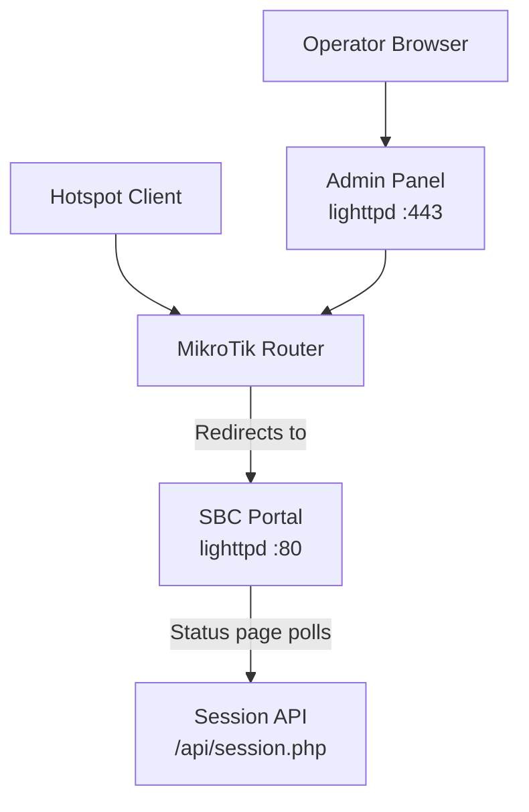
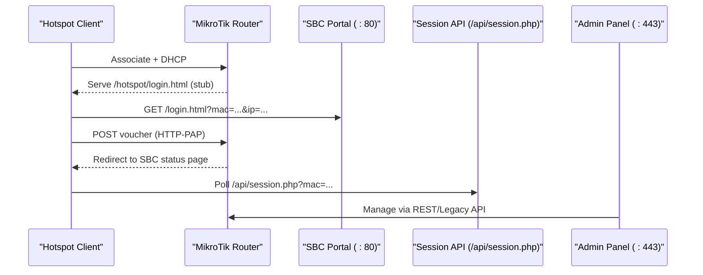
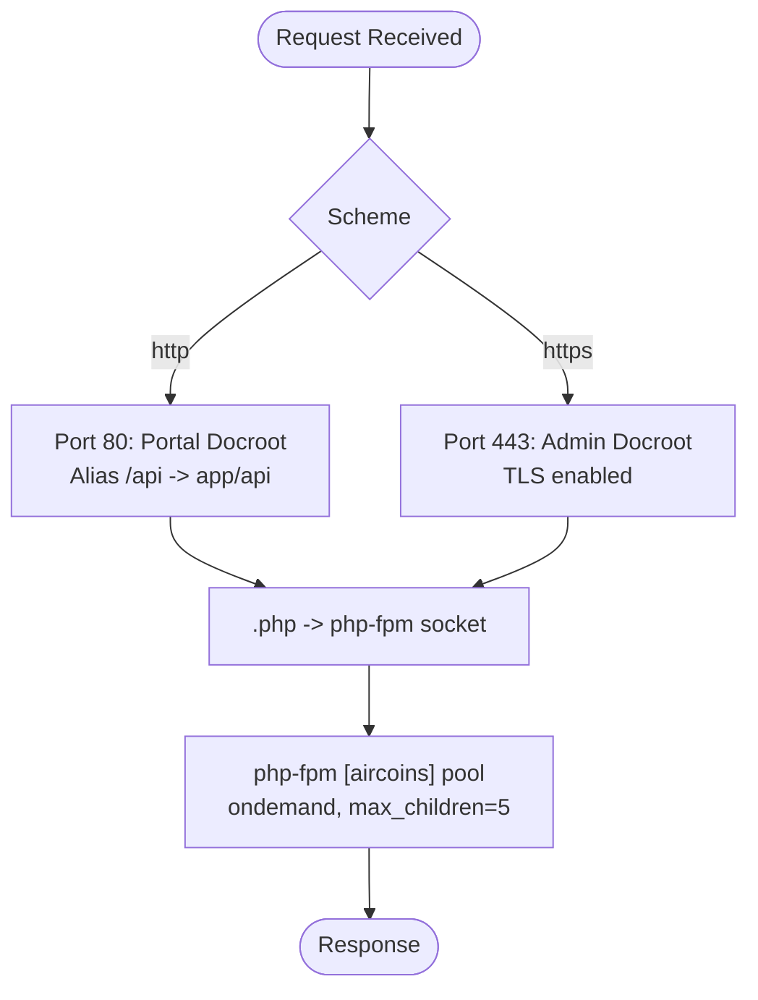
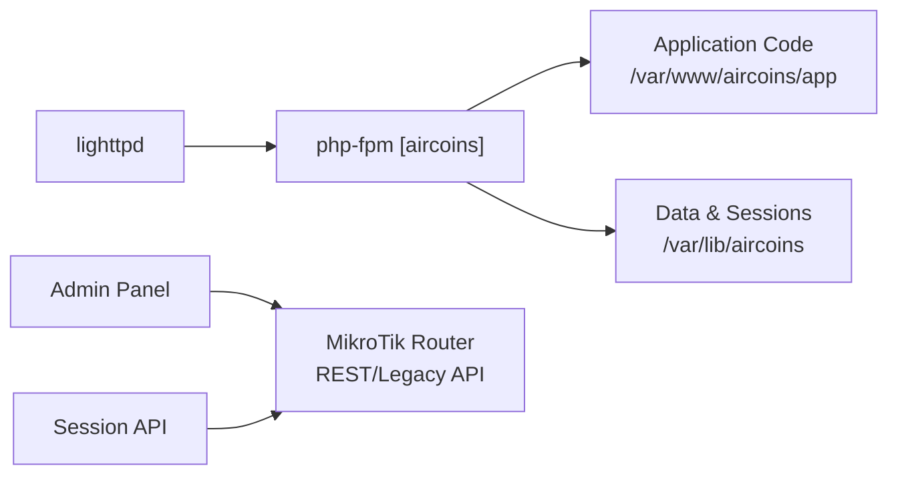

# Installation & Deployment

<cite>
**Referenced Files in This Document**   
- [DEPLOYMENT.md](file://DEPLOYMENT.md)
- [install-sbc.sh](file://deploy/scripts/install-sbc.sh)
- [aircoins.conf](file://deploy/lighttpd/aircoins.conf)
- [aircoins-pool.conf](file://deploy/php-fpm/aircoins-pool.conf)
- [hotspot-external-portal.rsc](file://deploy/mikrotik/hotspot-external-portal.rsc)
- [config.php](file://includes/config.php)
</cite>

## Table of Contents
1. [Introduction](#introduction)
2. [Project Structure](#project-structure)
3. [Core Components](#core-components)
4. [Architecture Overview](#architecture-overview)
5. [Detailed Component Analysis](#detailed-component-analysis)
6. [Dependency Analysis](#dependency-analysis)
7. [Performance Considerations](#performance-considerations)
8. [Troubleshooting Guide](#troubleshooting-guide)
9. [Verification Steps](#verification-steps)
10. [Conclusion](#conclusion)

## Introduction
This document explains how to install and deploy the MT-CONTROLLER-PISOWIFI system (also referred to as AIRCOINS NETFI in the repository). It covers:
- Automated installation using the one-shot installer script.
- Manual installation for environments where the script cannot run.
- Single-board computer (SBC) preparation, OS requirements, and package dependencies.
- Directory layout on the SBC.
- lighttpd + php-fpm configuration, including port assignments and virtual host behavior.
- MikroTik RouterOS setup: hotspot profile, walled garden, IP bindings, and API service enablement.
- Troubleshooting common issues such as port conflicts, firewall problems, and permission errors.
- Verification steps to confirm a successful deployment.

The system is designed for low-resource SBCs and avoids frameworks, Composer, or build steps. The captive portal runs on port 80, while the admin panel runs on port 443 with a self-signed TLS certificate. The router uses HTTP-PAP authentication and exposes either REST (RouterOS v7) or Legacy API (v6/v7) for the admin panel.

**Section sources**
- [DEPLOYMENT.md:10-28](file://DEPLOYMENT.md#L10-L28)

## Project Structure
At a high level, the repository contains:
- `hotspot/`: Captive portal assets and HTML served by lighttpd on port 80.
- `admin/`: Admin panel PHP UI and endpoints served by lighttpd on port 443.
- `includes/`: Shared PHP core (configuration, database, auth, CSRF, crypto, helpers, layout).
- `api/`: Portal-facing session endpoint (`session.php`).
- `router-stubs/`: Thin redirect pages uploaded to the MikroTik `/hotspot` directory.
- `deploy/`: Installer scripts, lighttpd config, php-fpm pool, MikroTik RouterOS script.

On the SBC, the installer deploys files under `/var/www/aircoins`:
- `portal/` serves the captive portal (port 80 docroot).
- `app/admin/` serves the admin panel (port 443 docroot).
- `app/includes/` holds shared PHP code.
- `app/api/` hosts the session endpoint aliased at `/api/` on port 80.



**Diagram sources**
- [DEPLOYMENT.md:32-70](file://DEPLOYMENT.md#L32-L70)

**Section sources**
- [DEPLOYMENT.md:508-557](file://DEPLOYMENT.md#L508-L557)

## Core Components
- **Captive portal**: Pure HTML/JS served from `hotspot/`, running on port 80.
- **Portal session API**: `/api/session.php` returns live session data for a given MAC by querying routers via API.
- **Admin panel**: PHP-based management UI on port 443 with self-signed TLS; manages routers, hotspot users/vouchers, active sessions, and monitoring.
- **MikroTik router**: Provides hotspot redirection stubs, authenticates clients via HTTP-PAP, and exposes REST/Legacy API for the admin panel.

Key runtime characteristics:
- SQLite database at `/var/lib/aircoins/aircoins.db`.
- Router passwords encrypted at rest with libsodium.
- Admin passwords hashed with Argon2id.
- No framework, no Composer, no build step.

**Section sources**
- [DEPLOYMENT.md:10-28](file://DEPLOYMENT.md#L10-L28)
- [DEPLOYMENT.md:508-557](file://DEPLOYMENT.md#L508-L557)

## Architecture Overview
The end-to-end flow:
1. Client associates with the hotspot and receives DHCP.
2. First HTTP request is intercepted; the router serves its thin login stub.
3. The stub redirects the browser to the SBC portal with client parameters.
4. The portal form POSTs the voucher back to the router using HTTP-PAP.
5. On success, the router redirects to the SBC status page.
6. The status page polls `/api/session.php` for live session data.
7. The admin panel (port 443) manages routers/users/sessions over the chosen API.



**Diagram sources**
- [DEPLOYMENT.md:32-70](file://DEPLOYMENT.md#L32-L70)

**Section sources**
- [DEPLOYMENT.md:174-183](file://DEPLOYMENT.md#L174-L183)

## Detailed Component Analysis

### SBC Preparation and OS Requirements
- Supported OS: Debian 12 (bookworm), Ubuntu 24.04 (noble), or Armbian based on either.
- Root/sudo access and systemd required.
- Hardware: SBC with ≥ 512 MB RAM and microSD/eMMC.
- Network: Wired or wireless Ethernet on the same L3 subnet as hotspot clients and the router.
- Static IP for the SBC must be outside the hotspot DHCP range.

Package dependencies installed by the installer:
- Base: `lighttpd`, `lighttpd-mod-openssl`, `openssl`, `ufw`, `ca-certificates`.
- PHP: `php<FPMVER>-fpm`, `php<FPMVER>-cli`, `php<FPMVER>-sqlite3`, `php<FPMVER>-curl`, `php<FPMVER>-mbstring`.
- Sodium extension is expected to be available (built into PHP core since 7.2); fallback to `php-libsodium` if missing.

**Section sources**
- [DEPLOYMENT.md:187-213](file://DEPLOYMENT.md#L187-L213)
- [install-sbc.sh:146-187](file://deploy/scripts/install-sbc.sh#L146-L187)

### Automated Installation (One-Shot Installer)
Run the installer after cloning the repository onto the SBC:
```bash
git clone https://github.com/Djnirds1984/MT-CONTROLLER-PISOWIFI.git
cd MT-CONTROLLER-PISOWIFI
sudo bash deploy/scripts/install-sbc.sh
```

What the installer does:
- Detects architecture, OS, and PHP version.
- Installs packages and disables conflicting web servers (apache2/nginx).
- Creates the deployed layout under `/var/www/aircoins` and copies `hotspot/`, `admin/`, `includes/`, `api/`.
- Installs lighttpd main config and php-fpm pool; restarts php-fpm.
- Generates a self-signed TLS certificate at `/etc/lighttpd/certs/aircoins.pem`.
- Creates libsodium key at `/etc/aircoins/secret.key` and data directories.
- Initializes SQLite schema and prompts for first admin username/password.
- Configures ufw rules (if active) and validates/starts lighttpd.

Idempotent behavior ensures safe re-runs.

**Section sources**
- [DEPLOYMENT.md:218-241](file://DEPLOYMENT.md#L218-L241)
- [install-sbc.sh:111-187](file://deploy/scripts/install-sbc.sh#L111-L187)
- [install-sbc.sh:190-253](file://deploy/scripts/install-sbc.sh#L190-L253)
- [install-sbc.sh:255-289](file://deploy/scripts/install-sbc.sh#L255-L289)
- [install-sbc.sh:291-355](file://deploy/scripts/install-sbc.sh#L291-L355)
- [install-sbc.sh:357-392](file://deploy/scripts/install-sbc.sh#L357-L392)

### Manual Installation
If you cannot run the script, perform these steps manually:
1. Install packages: `lighttpd`, `php<FPMVER>-fpm`, `php<FPMVER>-cli`, `php<FPMVER>-sqlite3`, `php<FPMVER>-curl`, `php<FPMVER>-mbstring`, `openssl`, `ufw`, `ca-certificates`.
2. Create layout: `/var/www/aircoins/portal`, `/var/www/aircoins/app/admin`, `/var/www/aircoins/app/includes`, `/var/www/aircoins/app/api`; copy repo directories accordingly.
3. Set ownership to `www-data` and create data/session/key directories.
4. Generate libsodium key at `/etc/aircoins/secret.key`.
5. Generate self-signed TLS certificate at `/etc/lighttpd/certs/aircoins.pem`.
6. Install lighttpd config from `deploy/lighttpd/aircoins.conf` and php-fpm pool from `deploy/php-fpm/aircoins-pool.conf`.
7. Start services: `systemctl restart php<FPMVER>-fpm`, validate and start lighttpd.

Replace `<FPMVER>` with your detected PHP major.minor version (e.g., `8.2` or `8.3`).

**Section sources**
- [DEPLOYMENT.md:243-286](file://DEPLOYMENT.md#L243-L286)

### lighttpd + php-fpm Configuration
- lighttpd listens on ports 80 (portal) and 443 (admin).
- Port 80 docroot is `/var/www/aircoins/portal`; it serves static portal files and aliases `/api/` to `/var/www/aircoins/app/api/`.
- Port 443 docroot is `/var/www/aircoins/app/admin`; it serves the admin panel with self-signed TLS.
- FastCGI forwards `.php` requests to a dedicated php-fpm socket: `/run/php/php<FPMVER>-fpm-aircoins.sock`.
- php-fpm pool `[aircoins]` uses `ondemand` process manager with `max_children = 5`, minimizing idle RAM usage.
- Security settings include `open_basedir`, disabled error display, and session storage under `/var/lib/aircoins/sessions`.



**Diagram sources**
- [aircoins.conf:30-156](file://deploy/lighttpd/aircoins.conf#L30-L156)
- [aircoins-pool.conf:21-72](file://deploy/php-fpm/aircoins-pool.conf#L21-L72)

**Section sources**
- [DEPLOYMENT.md:288-294](file://DEPLOYMENT.md#L288-L294)
- [aircoins.conf:30-156](file://deploy/lighttpd/aircoins.conf#L30-L156)
- [aircoins-pool.conf:21-72](file://deploy/php-fpm/aircoins-pool.conf#L21-L72)

### MikroTik RouterOS Configuration
The RouterOS script configures:
- Device-mode gate (RouterOS v7 only).
- Addressing: gateway IP, DHCP pool, DHCP server + network.
- Hotspot profile: `login-by=http-pap,cookie`, DNS name, hotspot address, HTML directory.
- Hotspot server bound to the interface with pool and profile.
- Walled garden rule allowing unauthenticated clients to reach the SBC on port 80.
- IP binding exempting the SBC from hotspot interception.
- Services enabling REST (`www-ssl` on 443) and/or Legacy API (`api` on 8728, `api-ssl` on 8729).
- Static DNS entry mapping portal hostname to the SBC IP.
- NAT masquerade out the WAN interface.

Variables to edit before applying:
- `sbcIP`: SBC panel IP.
- `hsInterface`: Interface carrying hotspot clients and the SBC.
- `hsNet` / `hsAddress` / `gwIP`: Network addressing.
- `hsPoolRange`: DHCP lease range (SBC IP must be outside).
- `dnsName`: Portal hostname resolving to SBC.
- `wanInterface`: Internet uplink.

Upload the router stubs (`router-stubs/*.html`) to `/hotspot` on the router, replacing stock pages. Ensure the SBC IP is updated in each stub file.

**Section sources**
- [DEPLOYMENT.md:308-390](file://DEPLOYMENT.md#L308-L390)
- [hotspot-external-portal.rsc:62-235](file://deploy/mikrotik/hotspot-external-portal.rsc#L62-L235)

### API Types: REST vs Legacy
- REST API: RouterOS v7 only, HTTPS on port 443 (`www-ssl`), Basic auth, JSON payloads.
- Legacy API: RouterOS v6 and v7, TCP 8728 (`api`) plaintext or 8729 (`api-ssl`) TLS, binary sentence protocol.
- Choose per router when adding it in the admin panel; Auto-detect probes REST then Legacy.

Enable the appropriate service(s) on the router:
- REST: `/ip service enable www-ssl`
- Legacy: `/ip service enable api` and/or `/ip service enable api-ssl`

**Section sources**
- [DEPLOYMENT.md:394-414](file://DEPLOYMENT.md#L394-L414)
- [hotspot-external-portal.rsc:174-194](file://deploy/mikrotik/hotspot-external-portal.rsc#L174-L194)

## Dependency Analysis
The system has clear separation between components:
- lighttpd depends on php-fpm for `.php` processing.
- php-fpm reads application code from `/var/www/aircoins/app` and data from `/var/lib/aircoins`.
- Admin panel communicates with MikroTik routers via REST or Legacy API.
- Portal session API queries routers through the same API layer.



**Diagram sources**
- [aircoins.conf:30-156](file://deploy/lighttpd/aircoins.conf#L30-L156)
- [aircoins-pool.conf:21-72](file://deploy/php-fpm/aircoins-pool.conf#L21-L72)

**Section sources**
- [DEPLOYMENT.md:508-557](file://DEPLOYMENT.md#L508-L557)

## Performance Considerations
- lighttpd is tuned for low-resource SBCs: limited connections, single worker, efficient event handler and sendfile backend.
- php-fpm uses `ondemand` process manager with small `max_children` to minimize idle memory.
- Access logging is disabled to reduce SD-card wear; SQLite runs in WAL mode with `synchronous=NORMAL`.
- Upload limits and execution time are constrained in the php-fpm pool.

[No sources needed since this section provides general guidance]

## Troubleshooting Guide
Common issues and resolutions:
- **Port 80 already in use**: Check for apache2/nginx/pi-hole/dnsmasq; stop/disable them or move the system to another box.
- **Armbian overlay/firewall**: Use Netplan or armbian-config to set static IP; open ports in nftables/firewalld if present.
- **PAP plaintext note**: Voucher submission is cleartext over the isolated hotspot LAN by design; keep hotspot on its own VLAN/SSID.
- **Escaped variables**: Always use `-esc` variants in router stub URLs/query strings to avoid broken redirect chains.
- **REST errors**: 401 Unauthorized (wrong credentials/service disabled), 415 Unsupported Media Type (missing JSON content type), 404 Not Found (wrong path/addressing), 400 Bad Request (malformed JSON/wrong verb), connection refused (service disabled/firewall/wrong port).
- **Legacy !trap messages**: Indicates failure reason (e.g., invalid credentials, item not found); verify API service and port.
- **Session API returns connected:false**: Verify MAC parameter, router enabled/unreachable, active session existence, and `/api/` alias on port 80.
- **SD-card wear**: Disable access logging, consider log2ram, use endurance microSD.
- **Time sync**: Ensure NTP is active to avoid spurious logouts/TLS warnings.
- **lighttpd won't start**: Validate config with `lighttpd -t`, check missing TLS cert or mismatched php-fpm socket path.

**Section sources**
- [DEPLOYMENT.md:473-505](file://DEPLOYMENT.md#L473-L505)

## Verification Steps
After installation and RouterOS configuration:
- Test portal on port 80: `curl -I http://localhost/`
- Test session API: `curl -s "http://localhost/api/session.php?mac=00:00:00:00:00:00"`
- Test admin on port 443: `curl -kI https://localhost/`
- Confirm listeners: `ss -tlnp | grep -E ':(80|443)\b'`
- Check php-fpm socket: `ls -l /run/php/php*-fpm-aircoins.sock`
- Service status: `systemctl status lighttpd php*-fpm --no-pager`
- From a hotspot client, browse to `http://<SBC_IP>/` and `https://<SBC_IP>/` (admin).

**Section sources**
- [DEPLOYMENT.md:295-304](file://DEPLOYMENT.md#L295-L304)
- [install-sbc.sh:397-424](file://deploy/scripts/install-sbc.sh#L397-L424)

## Conclusion
The MT-CONTROLLER-PISOWIFI system provides a lightweight, secure, and configurable captive portal and admin panel tailored for single-board computers behind MikroTik hotspots. The automated installer streamlines setup, while manual steps offer flexibility for diverse environments. Proper configuration of lighttpd, php-fpm, and RouterOS ensures reliable operation, and the troubleshooting guide helps resolve common deployment issues. Follow the verification steps to confirm that both the portal and admin panel are functioning correctly.

[No sources needed since this section summarizes without analyzing specific files]