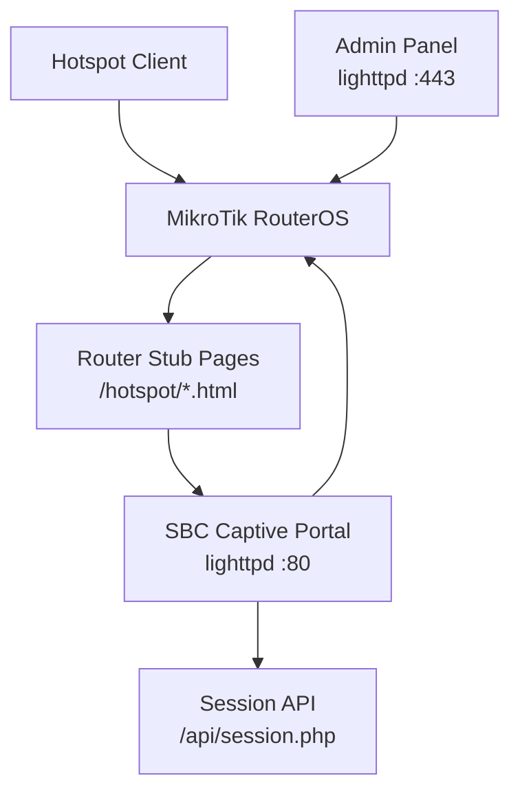
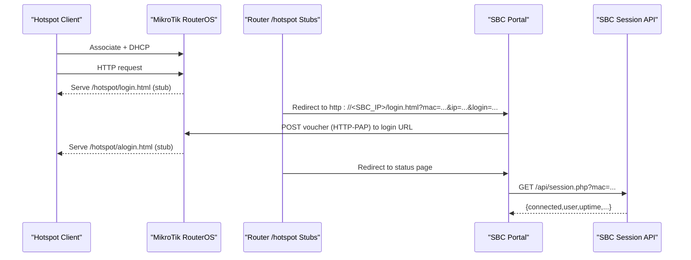
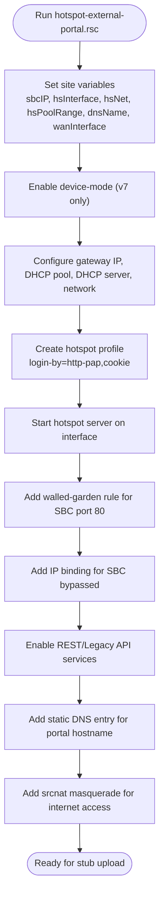
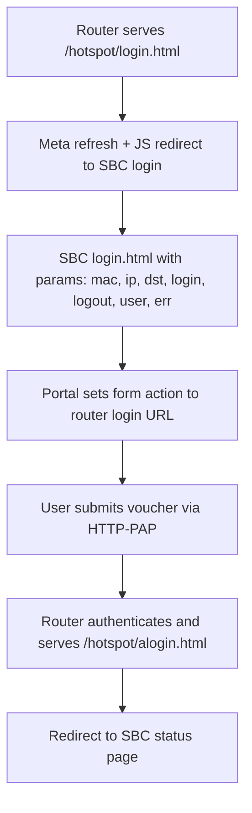
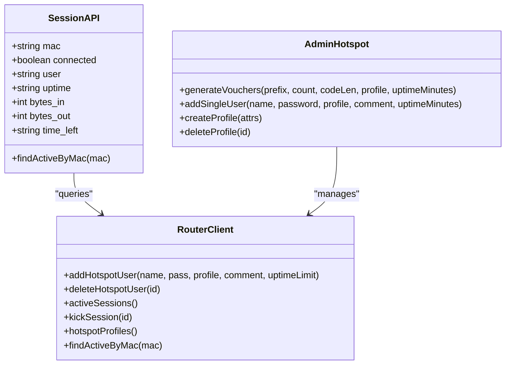
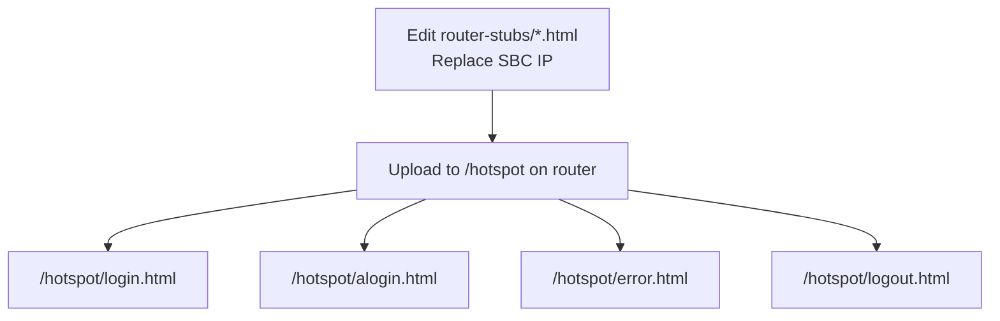
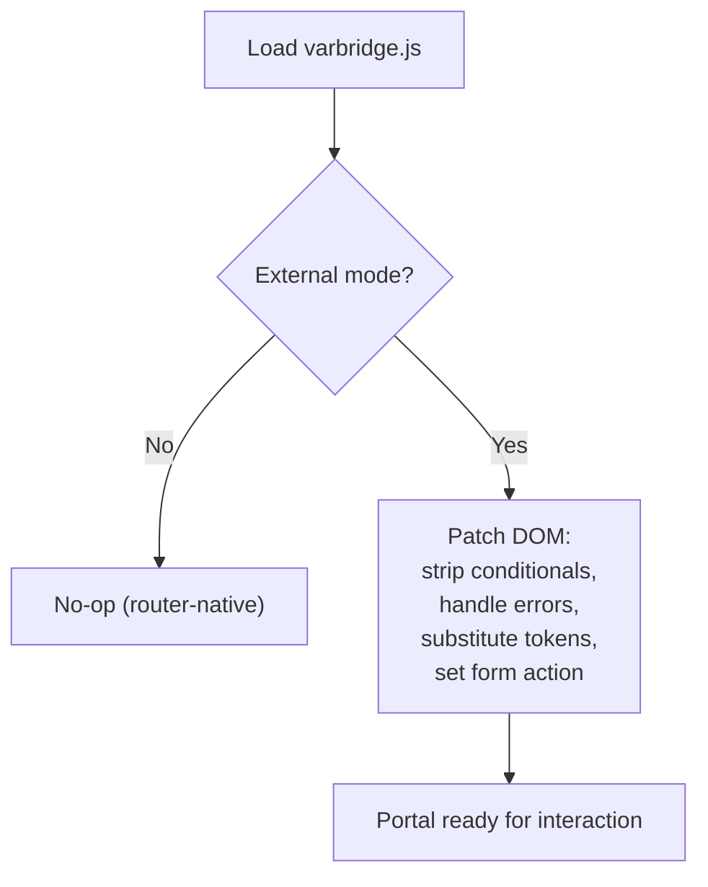
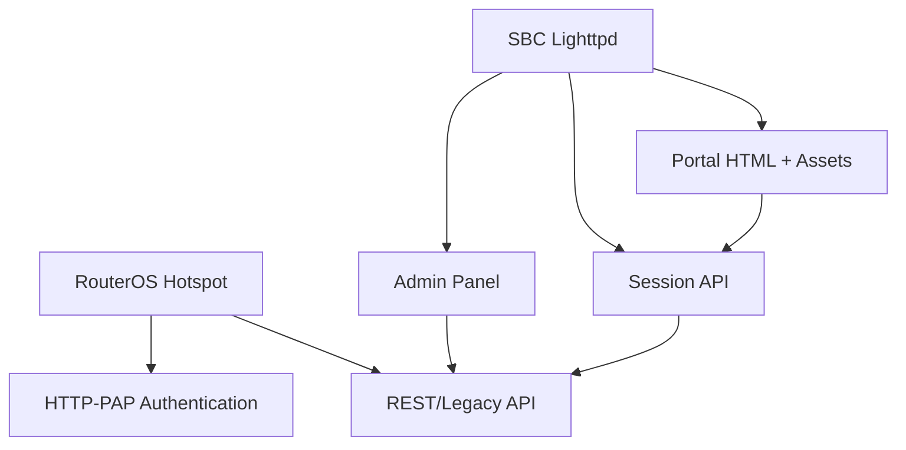

# MikroTik RouterOS Setup

<cite>
**Referenced Files in This Document**
- [DEPLOYMENT.md](file://DEPLOYMENT.md)
- [hotspot-external-portal.rsc](file://deploy/mikrotik/hotspot-external-portal.rsc)
- [login.html (router-stubs)](file://router-stubs/login.html)
- [alogin.html (router-stubs)](file://router-stubs/alogin.html)
- [error.html (router-stubs)](file://router-stubs/error.html)
- [logout.html (router-stubs)](file://router-stubs/logout.html)
- [varbridge.js](file://hotspot/js/varbridge.js)
- [session.php](file://api/session.php)
- [hotspot.php](file://admin/hotspot.php)
</cite>

## Table of Contents
1. [Introduction](#introduction)
2. [Project Structure](#project-structure)
3. [Core Components](#core-components)
4. [Architecture Overview](#architecture-overview)
5. [Detailed Component Analysis](#detailed-component-analysis)
6. [Dependency Analysis](#dependency-analysis)
7. [Performance Considerations](#performance-considerations)
8. [Troubleshooting Guide](#troubleshooting-guide)
9. [Conclusion](#conclusion)

## Introduction
This document explains how to integrate a MikroTik RouterOS hotspot with an external captive portal hosted on a separate single-board computer (SBC). The router performs the actual hotspot authentication using HTTP-PAP, while the SBC serves the user-facing login and status pages and exposes a session lookup API for live session data.

The configuration covers:
- RouterOS script execution for hotspot profile creation, server setup, walled garden, IP bindings, services, DNS, and NAT.
- External portal URL handling and the redirect flow between the router stubs and the SBC.
- Authentication method selection and session handling.
- Template replacement process for the router-stub files and their role in the captive portal flow.
- Firewall rules, NAT, and bridge networking requirements.
- Verification steps to ensure the hotspot is properly configured and communicating with the controller.

## Project Structure
The project is split into two main parts:
- **Router side**: thin HTML stubs under `router-stubs/` that are uploaded to `/hotspot` on the MikroTik device.
- **Controller side**: PHP-based admin panel, portal assets, and session API running on the SBC.

**Diagram sources**
- [hotspot-external-portal.rsc:1-59](file://deploy/mikrotik/hotspot-external-portal.rsc#L1-L59)
- [DEPLOYMENT.md:32-70](file://DEPLOYMENT.md#L32-L70)

**Section sources**
- [DEPLOYMENT.md:10-28](file://DEPLOYMENT.md#L10-L28)
- [DEPLOYMENT.md:508-535](file://DEPLOYMENT.md#L508-L535)

## Core Components
- **RouterOS script**: Defines site variables, hotspot profile, hotspot server, walled garden, IP binding, services, static DNS, and NAT.
- **Router stubs**: Minimal HTML files served by the router to redirect clients to the SBC portal or back after authentication.
- **Portal bridge script**: Detects whether the page is served by the router or the SBC and substitutes template tokens when needed.
- **Session API**: Returns whether a given MAC address has an active hotspot session.
- **Admin panel**: Manages routers, hotspot users, vouchers, sessions, and profiles via REST or Legacy API.

**Section sources**
- [hotspot-external-portal.rsc:62-235](file://deploy/mikrotik/hotspot-external-portal.rsc#L62-L235)
- [login.html (router-stubs):1-33](file://router-stubs/login.html#L1-L33)
- [varbridge.js:1-15](file://hotspot/js/varbridge.js#L1-L15)
- [session.php:1-19](file://api/session.php#L1-L19)
- [hotspot.php:1-13](file://admin/hotspot.php#L1-L13)

## Architecture Overview
The end-to-end flow is:
1. Client associates with the hotspot interface and receives DHCP from the router.
2. First HTTP request is intercepted; the router serves its own `/hotspot/login.html` stub.
3. The stub redirects the browser to the SBC portal with client context parameters.
4. The SBC portal prepares the login form to POST credentials back to the router’s hotspot login URL.
5. On successful HTTP-PAP authentication, the router serves `/hotspot/alogin.html`, which redirects to the SBC status page.
6. The status page polls the SBC session API to display live session information.

**Diagram sources**
- [DEPLOYMENT.md:174-183](file://DEPLOYMENT.md#L174-L183)
- [hotspot-external-portal.rsc:20-26](file://deploy/mikrotik/hotspot-external-portal.rsc#L20-L26)
- [login.html (router-stubs):22-27](file://router-stubs/login.html#L22-L27)
- [alogin.html (router-stubs):26-43](file://router-stubs/alogin.html#L26-L43)
- [session.php:58-106](file://api/session.php#L58-L106)

## Detailed Component Analysis

### RouterOS Script Execution
The RouterOS script configures the complete hotspot environment required for external portal integration.

Key responsibilities:
- Site variables: SBC IP, hotspot interface, network, pool range, DNS name, WAN interface.
- Device-mode gate for RouterOS v7.
- Base addressing: gateway address, DHCP pool, DHCP server, and network settings.
- Hotspot profile: uses HTTP-PAP with cookie support and sets the HTML directory to the router’s `/hotspot`.
- Hotspot server: binds to the hotspot interface with the defined pool and profile.
- Walled garden: allows unauthenticated clients to reach the SBC portal on port 80.
- IP binding: exempts the SBC from hotspot interception to prevent redirect loops.
- Services: enables REST API (`www-ssl`) and optionally Legacy API (`api`/`api-ssl`).
- Static DNS: maps the portal hostname to the SBC IP.
- NAT: masquerades authenticated hotspot clients out the WAN interface.

**Diagram sources**
- [hotspot-external-portal.rsc:62-211](file://deploy/mikrotik/hotspot-external-portal.rsc#L62-L211)

**Section sources**
- [hotspot-external-portal.rsc:62-211](file://deploy/mikrotik/hotspot-external-portal.rsc#L62-L211)
- [DEPLOYMENT.md:308-346](file://DEPLOYMENT.md#L308-L346)

### External Portal URL Configuration and Redirect Flow
The router’s `/hotspot/login.html` stub redirects the browser to the SBC portal with query parameters including MAC, IP, original destination, login URL, logout URL, username, and error. The SBC portal then prepares the login form to submit credentials back to the router’s hotspot login URL.

Important points:
- The SBC IP must be consistent across the stubs and the walled garden rule.
- The `-esc` variants of RouterOS variables are used inside URLs to safely encode special characters.
- The marker comment in `login.html` is required for RouterOS to recognize it as the hotspot login page.

**Diagram sources**
- [login.html (router-stubs):22-27](file://router-stubs/login.html#L22-L27)
- [DEPLOYMENT.md:174-183](file://DEPLOYMENT.md#L174-L183)

**Section sources**
- [login.html (router-stubs):1-33](file://router-stubs/login.html#L1-L33)
- [DEPLOYMENT.md:174-183](file://DEPLOYMENT.md#L174-L183)

### Authentication Methods and Session Handling
Authentication is performed by the router using HTTP-PAP. The SBC portal posts the voucher in plaintext over the isolated hotspot LAN. Cookie support keeps the client authenticated during the browser session.

Session handling:
- After successful authentication, the router redirects to the SBC status page.
- The status page polls `/api/session.php` with the client’s MAC to get live session data.
- The session API queries enabled routers via the selected API type and returns connection state, user, uptime, bytes, and time left.

**Diagram sources**
- [session.php:58-106](file://api/session.php#L58-L106)
- [hotspot.php:113-275](file://admin/hotspot.php#L113-L275)

**Section sources**
- [hotspot-external-portal.rsc:122-144](file://deploy/mikrotik/hotspot-external-portal.rsc#L122-L144)
- [session.php:1-106](file://api/session.php#L1-L106)
- [hotspot.php:113-275](file://admin/hotspot.php#L113-L275)

### Template Replacement Process for Router Stubs
The router keeps only four thin pages in `/hotspot`:
- `login.html`: Redirects to the SBC portal with client parameters.
- `alogin.html`: Post-login redirect to the SBC status page.
- `error.html`: Redirects back to the SBC login with error context.
- `logout.html`: Redirects to the SBC login with disconnected state.

Before uploading:
- Replace the SBC IP in each stub file.
- Keep the required marker comment in `login.html`.
- Use `-esc` variable variants in URLs.

**Diagram sources**
- [hotspot-external-portal.rsc:214-235](file://deploy/mikrotik/hotspot-external-portal.rsc#L214-L235)
- [DEPLOYMENT.md:364-379](file://DEPLOYMENT.md#L364-L379)

**Section sources**
- [login.html (router-stubs):1-33](file://router-stubs/login.html#L1-L33)
- [alogin.html (router-stubs):1-50](file://router-stubs/alogin.html#L1-L50)
- [error.html (router-stubs):1-27](file://router-stubs/error.html#L1-L27)
- [logout.html (router-stubs):1-27](file://router-stubs/logout.html#L1-L27)
- [hotspot-external-portal.rsc:214-235](file://deploy/mikrotik/hotspot-external-portal.rsc#L214-L235)

### Portal Bridge Script Behavior
The `varbridge.js` script handles dual-mode operation:
- When served by the router, it does nothing because RouterOS already substitutes template tokens.
- When served by the SBC, it detects external mode and substitutes literal tokens from query parameters.
- It also patches the login form action to point to the router’s login URL.

**Diagram sources**
- [varbridge.js:1-15](file://hotspot/js/varbridge.js#L1-L15)
- [varbridge.js:41-103](file://hotspot/js/varbridge.js#L41-L103)
- [varbridge.js:126-236](file://hotspot/js/varbridge.js#L126-L236)

**Section sources**
- [varbridge.js:1-239](file://hotspot/js/varbridge.js#L1-L239)

### Firewall Rules, NAT, and Bridge Networking
Required network configuration:
- The SBC must have a static IP outside the hotspot DHCP pool.
- The hotspot interface carries both clients and the SBC.
- Walled garden allows unauthenticated clients to reach the SBC portal on port 80.
- IP binding exempts the SBC from hotspot interception.
- NAT masquerades authenticated clients out the WAN interface.

Verification checklist:
- Ensure lighttpd is listening on ports 80 and 443.
- Confirm the SBC can reach the router API.
- Test the redirect flow from a client device.

**Section sources**
- [DEPLOYMENT.md:74-141](file://DEPLOYMENT.md#L74-L141)
- [DEPLOYMENT.md:199-210](file://DEPLOYMENT.md#L199-L210)
- [hotspot-external-portal.rsc:147-211](file://deploy/mikrotik/hotspot-external-portal.rsc#L147-L211)

## Dependency Analysis
The system depends on:
- RouterOS hotspot service with HTTP-PAP authentication.
- SBC web server (lighttpd) serving portal and admin interfaces.
- PHP-FPM for processing admin panel and session API.
- Router API (REST or Legacy) for management and session queries.

**Diagram sources**
- [DEPLOYMENT.md:32-70](file://DEPLOYMENT.md#L32-L70)
- [hotspot-external-portal.rsc:174-195](file://deploy/mikrotik/hotspot-external-portal.rsc#L174-L195)

**Section sources**
- [DEPLOYMENT.md:32-70](file://DEPLOYMENT.md#L32-L70)
- [hotspot-external-portal.rsc:174-195](file://deploy/mikrotik/hotspot-external-portal.rsc#L174-L195)

## Performance Considerations
- The SBC uses php-fpm with an on-demand pool to minimize idle resource usage.
- The portal is mostly static HTML served directly by lighttpd.
- Session API polling occurs every ~10 seconds from the status page.
- SQLite is used for local storage with WAL mode and synchronous=NORMAL to reduce disk wear.

[No sources needed since this section provides general guidance]

## Troubleshooting Guide
Common issues and resolutions:
- Port conflicts: Ensure no other service is using port 80 or 443.
- Armbian firewall: Open ports 80 and 443 if using nftables or firewalld.
- PAP plaintext: Understand that vouchers are sent in cleartext over the isolated hotspot LAN.
- REST API errors: Check Basic auth, content type, and service enablement.
- Legacy API traps: Review `!trap` messages for protocol or authentication errors.
- Session API not returning connected: Verify MAC parameter, router enablement, and API alias.

**Section sources**
- [DEPLOYMENT.md:473-505](file://DEPLOYMENT.md#L473-L505)

## Conclusion
Integrating a MikroTik RouterOS hotspot with an external captive portal requires careful configuration of the router’s hotspot profile, walled garden, IP bindings, services, and NAT, along with proper deployment of the router stubs and SBC portal. The system relies on HTTP-PAP authentication and a session API to provide live session data. Following the documented steps ensures reliable operation and clear troubleshooting paths.

[No sources needed since this section summarizes without analyzing specific files]