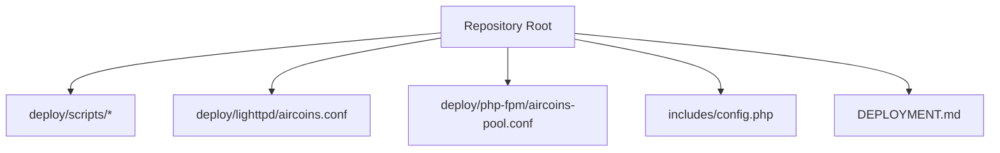
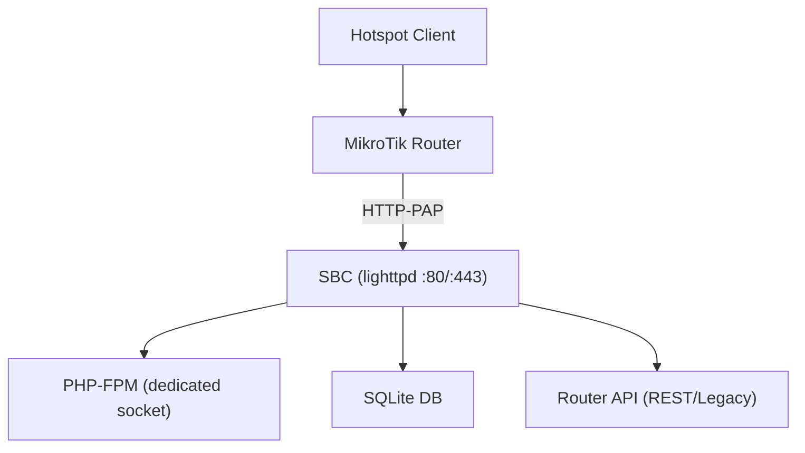
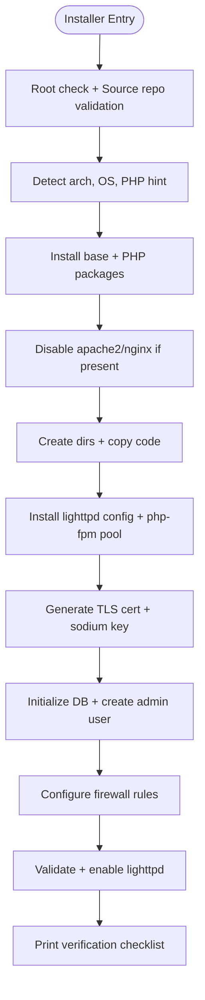

# SBC Preparation & Requirements

<cite>
**Referenced Files in This Document**
- [DEPLOYMENT.md](file://DEPLOYMENT.md)
- [install-sbc.sh](file://deploy/scripts/install-sbc.sh)
- [update-portal.sh](file://deploy/scripts/update-portal.sh)
- [aircoins.conf](file://deploy/lighttpd/aircoins.conf)
- [aircoins-pool.conf](file://deploy/php-fpm/aircoins-pool.conf)
- [config.php](file://includes/config.php)
</cite>

## Table of Contents
1. [Introduction](#introduction)
2. [Project Structure](#project-structure)
3. [Core Components](#core-components)
4. [Architecture Overview](#architecture-overview)
5. [Detailed Component Analysis](#detailed-component-analysis)
6. [Dependency Analysis](#dependency-analysis)
7. [Performance Considerations](#performance-considerations)
8. [Troubleshooting Guide](#troubleshooting-guide)
9. [Conclusion](#conclusion)
10. [Appendices](#appendices)

## Introduction
This document explains how to prepare a Single Board Computer (SBC) for MT-CONTROLLER-PISOWIFI deployment behind a MikroTik hotspot. It covers hardware requirements, supported operating systems, initial system setup, the automated installer, pre-flight checks, and security hardening guidance. The goal is to get a lightweight, low-RAM-capable SBC running the captive portal on port 80 and the admin panel on port 443 with PHP-FPM and SQLite.

## Project Structure
The repository provides:
- A complete deployment guide describing architecture, prerequisites, installation, and configuration.
- An idempotent SBC installer that provisions lighttpd, PHP-FPM, TLS, directories, permissions, and firewall rules.
- A helper script to re-sync portal and application code without a full reinstall.
- Self-contained lighttpd and PHP-FPM pool configurations tuned for low-memory SBCs.

**Diagram sources**
- [DEPLOYMENT.md:1-576](file://DEPLOYMENT.md#L1-L576)
- [install-sbc.sh:1-425](file://deploy/scripts/install-sbc.sh#L1-L425)
- [update-portal.sh:1-117](file://deploy/scripts/update-portal.sh#L1-L117)
- [aircoins.conf:1-187](file://deploy/lighttpd/aircoins.conf#L1-L187)
- [aircoins-pool.conf:1-73](file://deploy/php-fpm/aircoins-pool.conf#L1-L73)
- [config.php:1-44](file://includes/config.php#L1-L44)

**Section sources**
- [DEPLOYMENT.md:1-576](file://DEPLOYMENT.md#L1-L576)

## Core Components
- Captive portal served by lighttpd on port 80 (static HTML + assets).
- Admin panel served by lighttpd on port 443 with self-signed TLS and PHP-FPM.
- Portal session API at /api/session.php on port 80.
- SQLite database for local state; router credentials encrypted at rest.
- Automated installer handles OS detection, package installation, directory layout, TLS certificate generation, key management, schema initialization, and service enablement.

**Section sources**
- [DEPLOYMENT.md:10-28](file://DEPLOYMENT.md#L10-L28)
- [install-sbc.sh:1-24](file://deploy/scripts/install-sbc.sh#L1-L24)

## Architecture Overview
The SBC runs two web services:
- Port 80: Captive portal and session API.
- Port 443: Admin panel with TLS.

lighttpd forwards .php requests to a dedicated PHP-FPM socket. The admin panel communicates with MikroTik routers via REST or Legacy API.

**Diagram sources**
- [DEPLOYMENT.md:32-70](file://DEPLOYMENT.md#L32-L70)
- [aircoins.conf:112-156](file://deploy/lighttpd/aircoins.conf#L112-L156)
- [aircoins-pool.conf:21-46](file://deploy/php-fpm/aircoins-pool.conf#L21-L46)

## Detailed Component Analysis

### Hardware Requirements
- Minimum RAM: 512 MB.
- Storage: microSD or eMMC suitable for SBC use.
- Network: Wired or wireless Ethernet on the same L3 subnet as hotspot clients and the router.
- Recommended models: Raspberry Pi (e.g., Pi 3/4), Orange Pi (e.g., Zero/PC).

These requirements ensure the system can run lighttpd, PHP-FPM, and SQLite with minimal overhead.

**Section sources**
- [DEPLOYMENT.md:187-197](file://DEPLOYMENT.md#L187-L197)

### Supported Operating Systems
- Debian 12 (bookworm) with PHP 8.2.
- Ubuntu 24.04 (noble) with PHP 8.3.
- Armbian based on either distribution.
- Requires root/sudo access, systemd, and git.

The installer detects the OS codename and maps it to a target PHP version if none is installed.

**Section sources**
- [DEPLOYMENT.md:194-197](file://DEPLOYMENT.md#L194-L197)
- [install-sbc.sh:115-141](file://deploy/scripts/install-sbc.sh#L115-L141)

### Initial System Setup
- Assign a static IP to the SBC on the hotspot bridge network, ensuring it is outside the DHCP pool.
- Configure DNS and gateway appropriately for the hotspot environment.
- Ensure SSH access is available before enabling any firewall that might block remote sessions.
- Harden the system by keeping only necessary ports open (80 and 443 for the app; keep router API ports reachable only from the SBC).

Network configuration examples are provided for Ubuntu (Netplan) and Debian/Armbian (interfaces).

**Section sources**
- [DEPLOYMENT.md:92-117](file://DEPLOYMENT.md#L92-L117)
- [DEPLOYMENT.md:561-571](file://DEPLOYMENT.md#L561-L571)

### Automated Installer Usage
Run the installer as root. It performs:
- Root check and source repo validation.
- Platform detection (architecture, OS, PHP version).
- Package installation (lighttpd, PHP-FPM, extensions, openssl, ufw, ca-certificates).
- Disabling conflicting web servers (apache2/nginx).
- Directory layout creation and file copying.
- lighttpd config installation and php-fpm pool setup.
- Self-signed TLS certificate generation.
- Sodium key generation and secure permissions.
- SQLite schema initialization and first admin user creation.
- Firewall rule addition (without auto-enabling ufw).
- Service enablement and verification checklist.

Usage:
- Default: `sudo bash deploy/scripts/install-sbc.sh`
- With explicit source path: `sudo bash deploy/scripts/install-sbc.sh /path/to/MT-CONTROLLER-PISOWIFI`

Environment variable override:
- `AIRCOINS_SRC=/path/to/repo`

**Section sources**
- [DEPLOYMENT.md:218-241](file://DEPLOYMENT.md#L218-L241)
- [install-sbc.sh:13-16](file://deploy/scripts/install-sbc.sh#L13-L16)
- [install-sbc.sh:63-80](file://deploy/scripts/install-sbc.sh#L63-L80)
- [install-sbc.sh:109-187](file://deploy/scripts/install-sbc.sh#L109-L187)
- [install-sbc.sh:189-253](file://deploy/scripts/install-sbc.sh#L189-L253)
- [install-sbc.sh:255-355](file://deploy/scripts/install-sbc.sh#L255-L355)
- [install-sbc.sh:357-424](file://deploy/scripts/install-sbc.sh#L357-L424)

### Pre-flight Checks
Before running the installer:
- Confirm you have root privileges.
- Verify the source repository contains required directories: hotspot, admin, includes, api.
- Ensure deploy templates exist: deploy/lighttpd/aircoins.conf and deploy/php-fpm/aircoins-pool.conf.
- Check that no other service is binding to port 80 or 443 (the installer disables apache2/nginx if present).
- Validate PHP availability or allow the installer to detect and install the correct version.

The installer validates these conditions early and will exit with an error if prerequisites are missing.

**Section sources**
- [install-sbc.sh:63-80](file://deploy/scripts/install-sbc.sh#L63-L80)
- [install-sbc.sh:189-200](file://deploy/scripts/install-sbc.sh#L189-L200)

### Security Hardening
- Admin passwords are hashed with Argon2id; router passwords are encrypted at rest using libsodium.
- CSRF protection is enabled for admin POST operations.
- Login attempts are rate-limited per IP.
- Sessions are HttpOnly, SameSite=Strict, and Secure over TLS.
- The admin site uses a self-signed certificate; replace it with a CA-managed cert if exposed publicly.
- Only ports 80 and 443 should be reachable by clients; router API ports should be restricted to the SBC.
- PHP-FPM runs under www-data with open_basedir restrictions and error display disabled.

**Section sources**
- [DEPLOYMENT.md:561-571](file://DEPLOYMENT.md#L561-L571)
- [aircoins-pool.conf:47-72](file://deploy/php-fpm/aircoins-pool.conf#L47-L72)

### Customization Options
- Update portal content and assets without restarting services using the update script.
- Override the source repository path via argument or AIRCOINS_SRC environment variable.
- Adjust lighttpd and PHP-FPM settings through their respective configuration files if needed.
- Replace the self-signed TLS certificate with a CA-issued one for production exposure.

The update script re-syncs portal and application code and reloads PHP-FPM only when PHP changes are detected.

**Section sources**
- [update-portal.sh:1-20](file://deploy/scripts/update-portal.sh#L1-L20)
- [update-portal.sh:50-58](file://deploy/scripts/update-portal.sh#L50-L58)
- [update-portal.sh:86-116](file://deploy/scripts/update-portal.sh#L86-L116)
- [DEPLOYMENT.md:453-469](file://DEPLOYMENT.md#L453-L469)

## Dependency Analysis
The installer orchestrates multiple components:
- Detects platform and PHP version.
- Installs base packages and PHP extensions.
- Configures lighttpd and PHP-FPM.
- Generates TLS certificates and encryption keys.
- Initializes the database and creates the first admin user.
- Applies firewall rules and enables services.

**Diagram sources**
- [install-sbc.sh:63-80](file://deploy/scripts/install-sbc.sh#L63-L80)
- [install-sbc.sh:109-187](file://deploy/scripts/install-sbc.sh#L109-L187)
- [install-sbc.sh:189-253](file://deploy/scripts/install-sbc.sh#L189-L253)
- [install-sbc.sh:255-355](file://deploy/scripts/install-sbc.sh#L255-L355)
- [install-sbc.sh:357-424](file://deploy/scripts/install-sbc.sh#L357-L424)

**Section sources**
- [install-sbc.sh:109-424](file://deploy/scripts/install-sbc.sh#L109-L424)

## Performance Considerations
- lighttpd is configured with conservative worker and connection limits suitable for SBCs.
- PHP-FPM uses an on-demand process manager with a small max_children count to minimize idle memory usage.
- Memory limits, post size, upload size, and execution time are constrained within the PHP-FPM pool.
- Access logging is intentionally disabled to reduce SD-card wear.
- SQLite runs with WAL and synchronous=NORMAL to balance durability and performance.

These settings help maintain low resource consumption while serving both the captive portal and admin panel.

**Section sources**
- [aircoins.conf:46-66](file://deploy/lighttpd/aircoins.conf#L46-L66)
- [aircoins-pool.conf:38-51](file://deploy/php-fpm/aircoins-pool.conf#L38-L51)
- [DEPLOYMENT.md:500-502](file://DEPLOYMENT.md#L500-L502)

## Troubleshooting Guide
Common issues and resolutions:
- Port conflicts: If another web server occupies port 80, stop/disable it or move the application.
- Armbian network managers may rewrite interfaces; prefer Netplan or armbian-config for static IP.
- PAP plaintext: Vouchers are sent in cleartext over the isolated hotspot LAN; keep the hotspot isolated.
- Router stub placeholders: Use -esc variants in URLs to avoid broken redirect chains.
- REST errors: Check authentication, media type headers, paths, and service enablement.
- Legacy API traps: Review !trap messages for detailed failure reasons.
- Session API returns connected:false: Verify MAC parameter, router enablement, reachability, and /api alias.
- Time sync: Ensure NTP is active to prevent TLS and session issues.
- lighttpd startup failures: Validate configuration and check logs; ensure TLS cert and PHP-FPM socket paths match.

**Section sources**
- [DEPLOYMENT.md:473-505](file://DEPLOYMENT.md#L473-L505)

## Conclusion
Preparing an SBC for MT-CONTROLLER-PISOWIFI involves selecting a compatible board and OS, assigning a static IP, and running the automated installer to provision lighttpd, PHP-FPM, TLS, and application files. The installer is idempotent and designed for low-memory environments. After installation, configure the MikroTik router’s redirect and services, then verify the portal and admin panel. Apply security hardening practices and monitor performance using the provided configurations.

## Appendices

### Configuration Reference
- lighttpd main configuration: defines modules, docroots, FastCGI, TLS, and routing for portal and admin.
- PHP-FPM pool configuration: sets process manager, memory limits, session storage, and open_basedir.
- Application configuration constants: database path, encryption key path, session name, idle timeout, and rate-limit parameters.

**Section sources**
- [aircoins.conf:1-187](file://deploy/lighttpd/aircoins.conf#L1-L187)
- [aircoins-pool.conf:1-73](file://deploy/php-fpm/aircoins-pool.conf#L1-L73)
- [config.php:1-44](file://includes/config.php#L1-L44)