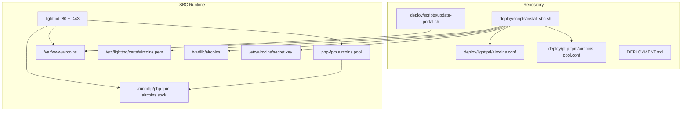
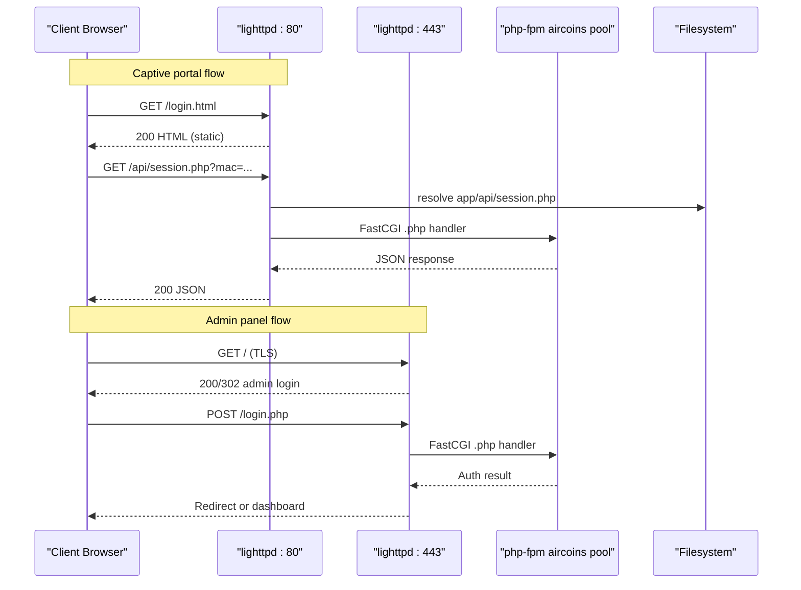
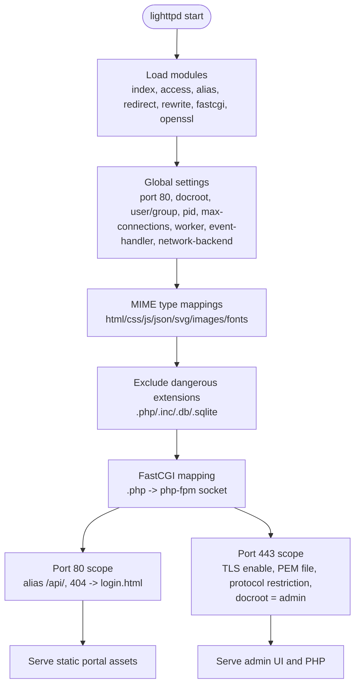
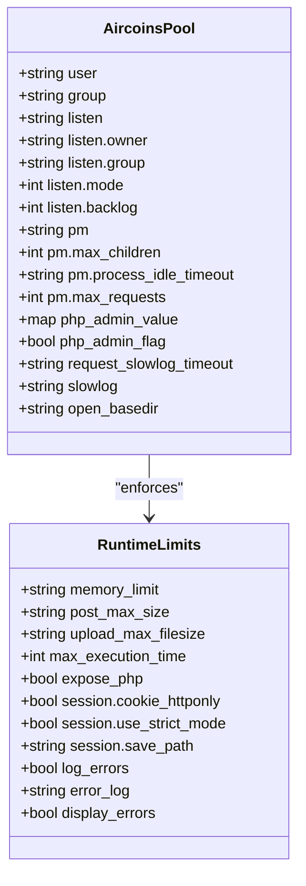
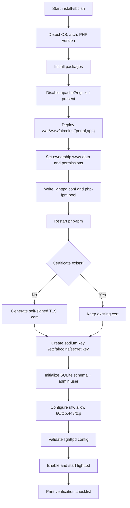
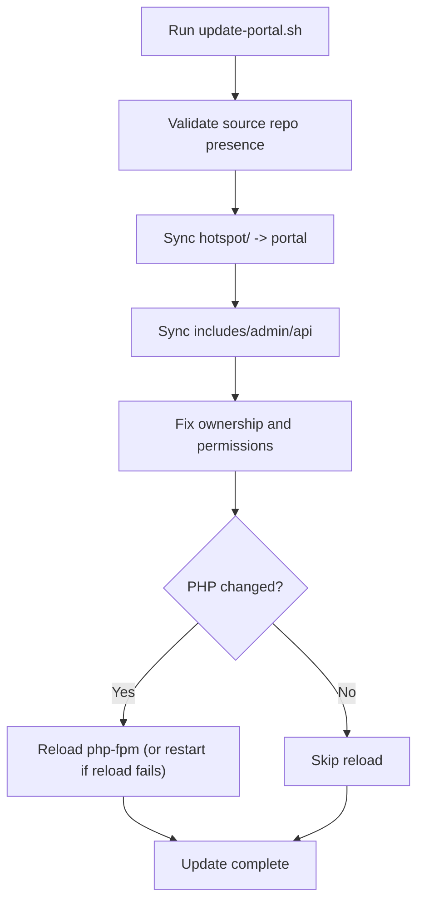
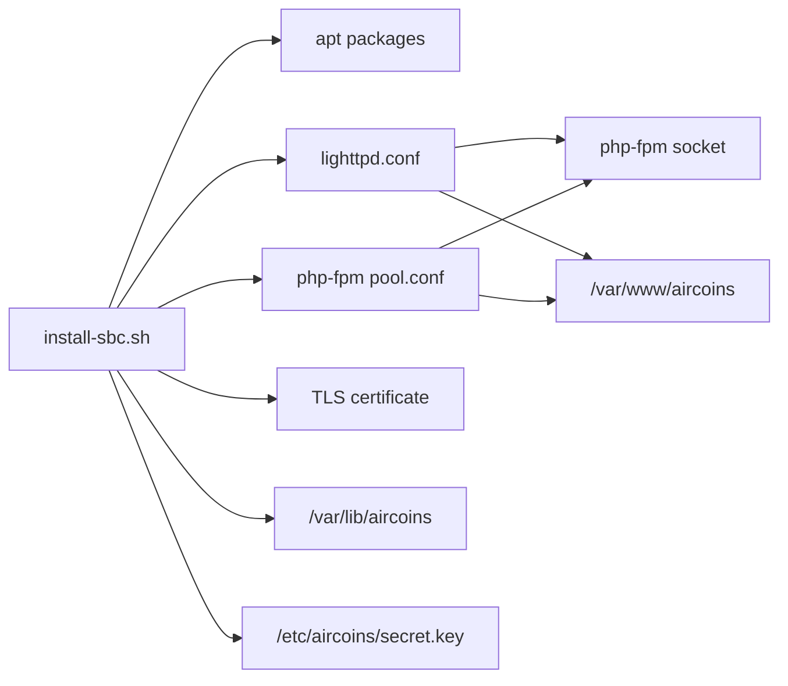

# Web Server Configuration

<cite>
**Referenced Files in This Document**   
- [aircoins.conf](file://deploy/lighttpd/aircoins.conf)
- [aircoins-pool.conf](file://deploy/php-fpm/aircoins-pool.conf)
- [install-sbc.sh](file://deploy/scripts/install-sbc.sh)
- [update-portal.sh](file://deploy/scripts/update-portal.sh)
- [DEPLOYMENT.md](file://DEPLOYMENT.md)
</cite>

## Table of Contents
1. [Introduction](#introduction)
2. [Project Structure](#project-structure)
3. [Core Components](#core-components)
4. [Architecture Overview](#architecture-overview)
5. [Detailed Component Analysis](#detailed-component-analysis)
6. [Dependency Analysis](#dependency-analysis)
7. [Performance Considerations](#performance-considerations)
8. [Troubleshooting Guide](#troubleshooting-guide)
9. [Conclusion](#conclusion)

## Introduction
This document explains the complete web server configuration for the project’s lighttpd and PHP-FPM deployment on a single-board computer behind a MikroTik hotspot. It covers:

- lighttpd virtual hosts for port 80 (captive portal) and port 443 (admin panel with TLS).
- FastCGI integration to a dedicated PHP-FPM pool.
- MIME types, static file handling, upload directories, and security-related exclusions.
- PHP-FPM worker model, memory limits, timeouts, session storage, and open-basedir restrictions.
- Directory layout, ownership, permissions, and SELinux/AppArmor considerations.
- Performance tuning for low-memory SBCs and guidance for high-traffic scaling.
- Monitoring and troubleshooting for common issues such as permission errors, PHP execution failures, and SSL certificate problems.

The goal is to make this configuration understandable for operators while remaining precise enough for advanced tuning.

## Project Structure
The repository ships self-contained deployment artifacts under `deploy/`:

- `lighttpd/aircoins.conf` — single, self-contained lighttpd site configuration.
- `php-fpm/aircoins-pool.conf` — dedicated PHP-FPM pool for the application.
- `scripts/install-sbc.sh` — idempotent installer that provisions packages, files, certificates, firewall rules, and services.
- `scripts/update-portal.sh` — lightweight re-sync script for portal and PHP code without full reinstall.
- `DEPLOYMENT.md` — end-to-end operational guide including architecture, router setup, verification, and troubleshooting.

**Diagram sources**
- [aircoins.conf:33-156](file://deploy/lighttpd/aircoins.conf#L33-L156)
- [aircoins-pool.conf:21-73](file://deploy/php-fpm/aircoins-pool.conf#L21-L73)
- [install-sbc.sh:203-253](file://deploy/scripts/install-sbc.sh#L203-L253)
- [install-sbc.sh:256-289](file://deploy/scripts/install-sbc.sh#L256-L289)
- [DEPLOYMENT.md:537-555](file://DEPLOYMENT.md#L537-L555)

**Section sources**
- [DEPLOYMENT.md:10-28](file://DEPLOYMENT.md#L10-L28)
- [DEPLOYMENT.md:537-555](file://DEPLOYMENT.md#L537-L555)

## Core Components
- lighttpd serves:
  - Port 80: captive portal static content from `/var/www/aircoins/portal`.
  - Port 443: admin panel from `/var/www/aircoins/app/admin`, protected by TLS.
- PHP-FPM runs a dedicated `[aircoins]` pool listening on a UNIX socket.
- The installer provisions:
  - Application directories under `/var/www/aircoins`.
  - Data directory `/var/lib/aircoins` and secret key `/etc/aircoins/secret.key`.
  - Self-signed TLS certificate at `/etc/lighttpd/certs/aircoins.pem`.
  - Firewall rules for ports 80 and 443 when UFW is active.

Key responsibilities:
- `aircoins.conf` defines modules, global settings, MIME types, FastCGI mapping, HTTP-only API alias, and TLS admin site.
- `aircoins-pool.conf` defines process manager, workers, memory/time limits, session path, error logging, and open_basedir.
- `install-sbc.sh` installs packages, deploys files, generates certificates, initializes data, configures firewall, validates and starts lighttpd.
- `update-portal.sh` syncs portal and PHP code and reloads php-fpm only when needed.

**Section sources**
- [aircoins.conf:33-156](file://deploy/lighttpd/aircoins.conf#L33-L156)
- [aircoins-pool.conf:21-73](file://deploy/php-fpm/aircoins-pool.conf#L21-L73)
- [install-sbc.sh:203-253](file://deploy/scripts/install-sbc.sh#L203-L253)
- [update-portal.sh:86-114](file://deploy/scripts/update-portal.sh#L86-L114)

## Architecture Overview
The runtime consists of two listeners on the SBC:

- Port 80 (HTTP):
  - Static portal assets served directly.
  - `/api/session.php` aliased to `/var/www/aircoins/app/api/session.php`.
  - Unknown paths return the portal login page to keep captive portal flows working.
- Port 443 (HTTPS):
  - Admin panel served from `/var/www/aircoins/app/admin`.
  - TLS enabled with a self-signed certificate.
  - PHP requests handled by the same FastCGI block pointing to the dedicated PHP-FPM socket.

**Diagram sources**
- [aircoins.conf:128-156](file://deploy/lighttpd/aircoins.conf#L128-L156)
- [aircoins.conf:102-110](file://deploy/lighttpd/aircoins.conf#L102-L110)
- [aircoins-pool.conf:21-73](file://deploy/php-fpm/aircoins-pool.conf#L21-L73)

## Detailed Component Analysis

### lighttpd Configuration
The lighttpd configuration is self-contained and avoids conflicts with system snippets by declaring its own modules and FastCGI mapping.

Highlights:
- Modules include index, access control, aliasing, redirect, rewrite, FastCGI, and OpenSSL.
- Global server settings are tuned for low-resource SBCs: limited connections, one worker, epoll backend, sendfile network backend.
- Upload directory configured for temporary uploads.
- Index files prioritize portal pages.
- MIME types explicitly map common extensions to correct Content-Type values.
- Dangerous extensions are excluded from static file serving.
- FastCGI maps `.php` to the dedicated PHP-FPM UNIX socket with options enabling broken script filename resolution and disabling local file checks so aliased API endpoints work correctly.
- Port 80 scope adds an `/api/` alias and sets a 404 fallback to the portal login page.
- Port 443 enables TLS using a PEM file and restricts protocols to modern TLS versions; docroot points to the admin directory.

**Diagram sources**
- [aircoins.conf:33-90](file://deploy/lighttpd/aircoins.conf#L33-L90)
- [aircoins.conf:102-110](file://deploy/lighttpd/aircoins.conf#L102-L110)
- [aircoins.conf:128-156](file://deploy/lighttpd/aircoins.conf#L128-L156)

**Section sources**
- [aircoins.conf:33-156](file://deploy/lighttpd/aircoins.conf#L33-L156)

### PHP-FPM Pool Configuration
The PHP-FPM pool is dedicated to the application and isolated from the default pool.

Key aspects:
- Runs as `www-data` user and group so it can read application files and write to data directories.
- Uses a UNIX socket with restrictive mode and owner/group set to `www-data`.
- Process manager set to `ondemand` to minimize idle memory usage on SBCs.
- Worker limits and idle timeout configured conservatively.
- PHP runtime limits enforced via `php_admin_value`:
  - Memory limit.
  - Post size and upload size.
  - Execution time.
- Security hardening:
  - Expose PHP disabled.
  - Session cookies marked HttpOnly.
  - Strict session mode enabled.
  - Session save path restricted to a secure directory.
  - Error logging enabled to a dedicated log file.
  - Display errors disabled.
- Slowlog optionally available for diagnosing slow requests.
- `open_basedir` restricts filesystem access to application directories, data, secrets, temp, upload cache, and the PHP error log.

**Diagram sources**
- [aircoins-pool.conf:21-73](file://deploy/php-fpm/aircoins-pool.conf#L21-L73)

**Section sources**
- [aircoins-pool.conf:21-73](file://deploy/php-fpm/aircoins-pool.conf#L21-L73)

### Installation and Deployment Flow
The installer performs a deterministic sequence:

1. Detects platform and PHP version.
2. Installs base packages and PHP extensions.
3. Disables conflicting web servers.
4. Deploys application directories and copies source trees.
5. Sets ownership and permissions.
6. Writes lighttpd configuration and PHP-FPM pool, then restarts PHP-FPM.
7. Generates a self-signed TLS certificate if missing.
8. Creates a libsodium encryption key outside the web root.
9. Initializes the database schema and creates the first admin account interactively.
10. Configures firewall rules when UFW is active.
11. Validates lighttpd configuration and starts the service.

**Diagram sources**
- [install-sbc.sh:109-187](file://deploy/scripts/install-sbc.sh#L109-L187)
- [install-sbc.sh:190-253](file://deploy/scripts/install-sbc.sh#L190-L253)
- [install-sbc.sh:256-289](file://deploy/scripts/install-sbc.sh#L256-L289)
- [install-sbc.sh:291-355](file://deploy/scripts/install-sbc.sh#L291-L355)
- [install-sbc.sh:357-392](file://deploy/scripts/install-sbc.sh#L357-L392)

**Section sources**
- [install-sbc.sh:109-187](file://deploy/scripts/install-sbc.sh#L109-L187)
- [install-sbc.sh:190-253](file://deploy/scripts/install-sbc.sh#L190-L253)
- [install-sbc.sh:256-289](file://deploy/scripts/install-sbc.sh#L256-L289)
- [install-sbc.sh:291-355](file://deploy/scripts/install-sbc.sh#L291-L355)
- [install-sbc.sh:357-392](file://deploy/scripts/install-sbc.sh#L357-L392)

### Portal Update Workflow
The update script synchronizes portal and PHP code without a full reinstall:

- Syncs static portal assets (no service restart required).
- Syncs includes, admin, and api directories.
- Fixes ownership and permissions.
- Reloads php-fpm only when PHP code changes; otherwise leaves services running.

**Diagram sources**
- [update-portal.sh:60-114](file://deploy/scripts/update-portal.sh#L60-L114)

**Section sources**
- [update-portal.sh:60-114](file://deploy/scripts/update-portal.sh#L60-L114)

## Dependency Analysis
The components have clear dependencies:

- lighttpd depends on:
  - OpenSSL module for TLS.
  - FastCGI module to forward `.php` requests.
  - Filesystem access to portal and admin docroots.
  - PHP-FPM UNIX socket for dynamic content.
- PHP-FPM depends on:
  - Running as `www-data`.
  - Read access to application files.
  - Write access to session directory and logs.
  - Optional slowlog path.
- Installer depends on:
  - Package manager (apt).
  - Systemd for service management.
  - OpenSSL for certificate generation.
  - UFW for firewall rules when active.

**Diagram sources**
- [install-sbc.sh:143-187](file://deploy/scripts/install-sbc.sh#L143-L187)
- [install-sbc.sh:203-253](file://deploy/scripts/install-sbc.sh#L203-L253)
- [install-sbc.sh:256-289](file://deploy/scripts/install-sbc.sh#L256-L289)
- [aircoins.conf:33-156](file://deploy/lighttpd/aircoins.conf#L33-L156)
- [aircoins-pool.conf:21-73](file://deploy/php-fpm/aircoins-pool.conf#L21-L73)

**Section sources**
- [install-sbc.sh:143-187](file://deploy/scripts/install-sbc.sh#L143-L187)
- [install-sbc.sh:203-253](file://deploy/scripts/install-sbc.sh#L203-L253)
- [aircoins.conf:33-156](file://deploy/lighttpd/aircoins.conf#L33-L156)
- [aircoins-pool.conf:21-73](file://deploy/php-fpm/aircoins-pool.conf#L21-L73)

## Performance Considerations
Current defaults are optimized for low-memory SBCs:

- lighttpd:
  - Low connection and worker limits.
  - Epoll event handler and sendfile backend.
  - Access logging intentionally disabled to reduce SD-card wear.
- PHP-FPM:
  - `ondemand` process manager minimizes idle memory.
  - Conservative memory and execution time limits.
  - Small backlog suitable for SBC concurrency.

Recommendations for higher traffic:

- Increase `server.max-connections` and consider increasing `server.max-worker` cautiously based on CPU cores and RAM.
- Monitor PHP-FPM worker utilization; consider switching to `dynamic` process manager if request bursts occur.
- Increase `pm.max_children` gradually while monitoring memory usage.
- Enable access logging temporarily during load tests and rotate logs to avoid disk pressure.
- Use a quality endurance microSD or eMMC; consider `log2ram` for log buffering.
- Ensure time synchronization to prevent TLS and rate-limit anomalies.

[No sources needed since this section provides general guidance]

## Troubleshooting Guide

Common issues and resolutions:

- Port 80 already in use:
  - Identify the conflicting service and stop/disable it.
  - Verify lighttpd is listening on both ports 80 and 443.
- Armbian overlay or nftables blocking ports:
  - Open ports 80 and 443 in the active firewall.
  - Ensure the SBC IP is static and outside the hotspot DHCP range.
- PAP plaintext note:
  - Voucher submission uses HTTP-PAP over the isolated hotspot LAN; keep the hotspot on a trusted segment.
- REST API errors:
  - Unauthorized: verify service enabled and credentials.
  - Unsupported Media Type: ensure JSON content type.
  - Not Found: check REST path format and addressing.
  - Bad Request: validate JSON and HTTP verb usage.
  - Connection refused: check service status and firewall.
- Legacy API trap messages:
  - Review RouterOS service enablement and port availability.
- Session API returns disconnected:
  - Verify MAC parameter and router reachability.
  - Confirm `/api/` alias applies on port 80.
- lighttpd won’t start:
  - Validate configuration syntax.
  - Check journal logs for missing certificate or mismatched PHP-FPM socket path.

Operational checks:

- Verify portal responds on port 80.
- Verify admin responds on port 443 with TLS.
- Confirm PHP-FPM socket exists and matches configuration.
- Check service status for lighttpd and php-fpm.

**Section sources**
- [DEPLOYMENT.md:473-505](file://DEPLOYMENT.md#L473-L505)
- [install-sbc.sh:375-392](file://deploy/scripts/install-sbc.sh#L375-L392)

## Conclusion
The deployment uses a minimal, self-contained lighttpd configuration paired with a dedicated PHP-FPM pool tailored for single-board computers. Port 80 serves the captive portal and session API, while port 443 secures the admin panel with TLS. The installer automates package installation, file deployment, certificate generation, data initialization, and service startup. For production environments, operators should monitor resource usage, tune worker and connection limits according to hardware capacity, and maintain strict file permissions and SELinux/AppArmor policies where applicable.

[No sources needed since this section summarizes without analyzing specific files]