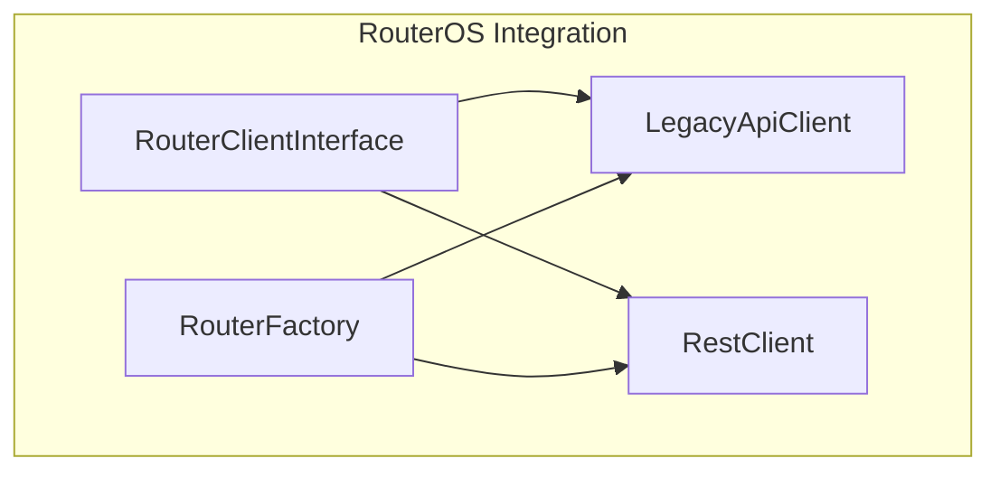
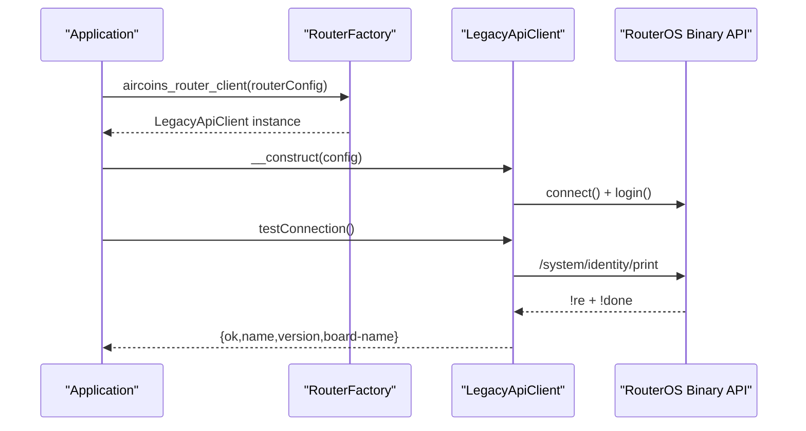
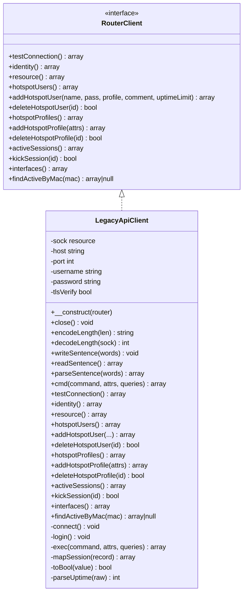
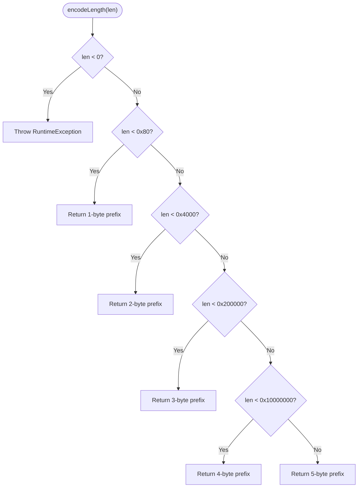
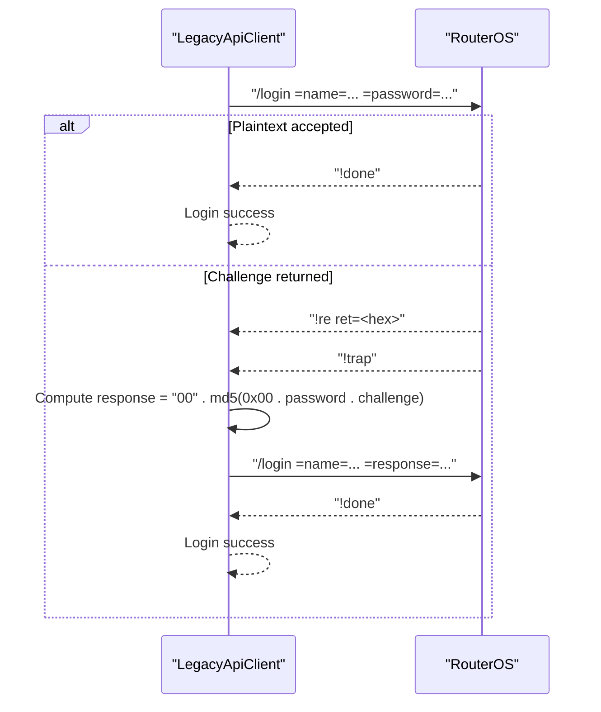
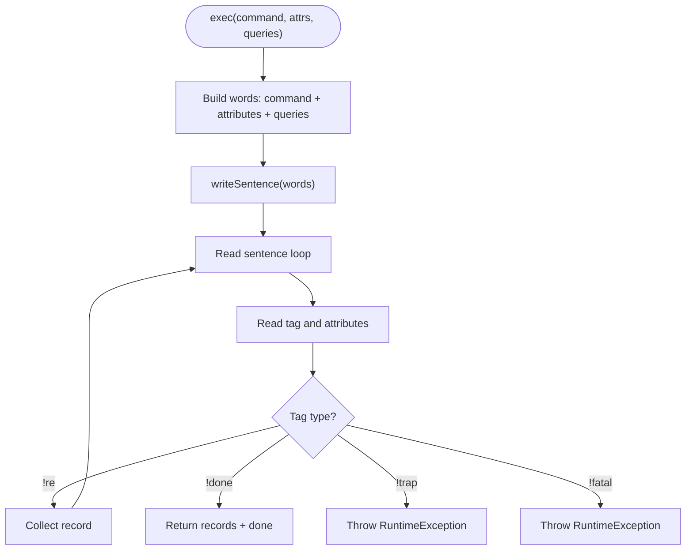
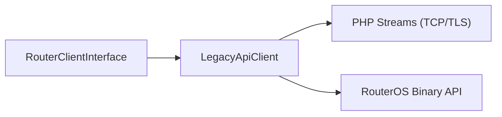

# Legacy API Client

<cite>
**Referenced Files in This Document**
- [LegacyApiClient.php](file://includes/RouterOS/LegacyApiClient.php)
- [RouterClientInterface.php](file://includes/RouterOS/RouterClientInterface.php)
- [RestClient.php](file://includes/RouterOS/RestClient.php)
- [RouterFactory.php](file://includes/RouterOS/RouterFactory.php)
</cite>

## Table of Contents
1. [Introduction](#introduction)
2. [Project Structure](#project-structure)
3. [Core Components](#core-components)
4. [Architecture Overview](#architecture-overview)
5. [Detailed Component Analysis](#detailed-component-analysis)
6. [Dependency Analysis](#dependency-analysis)
7. [Performance Considerations](#performance-considerations)
8. [Troubleshooting Guide](#troubleshooting-guide)
9. [Conclusion](#conclusion)
10. [Appendices](#appendices)

## Introduction
This document explains the Legacy API client implementation that communicates with MikroTik RouterOS using the legacy binary protocol over TCP port 8728 or TLS port 8729. It covers how `LegacyApiClient` implements the unified `RouterClientInterface`, the binary sentence protocol, connection and authentication flows, data serialization and deserialization, and how it compares to the REST client. It also provides operational examples, guidance on when to choose the legacy protocol, and troubleshooting for common issues such as binary format problems, authentication failures, and version compatibility.

## Project Structure
The RouterOS integration is implemented as a small set of PHP classes under `includes/RouterOS`:
- `RouterClientInterface.php` defines the unified contract used by both clients.
- `RestClient.php` implements the same contract over RouterOS v7 REST/HTTPS.
- `LegacyApiClient.php` implements the same contract over the legacy binary protocol.
- `RouterFactory.php` selects and constructs the correct client based on router configuration.

**Diagram sources**
- [RouterClientInterface.php:31-127](file://includes/RouterOS/RouterClientInterface.php#L31-L127)
- [LegacyApiClient.php:22-50](file://includes/RouterOS/LegacyApiClient.php#L22-L50)
- [RestClient.php:24-48](file://includes/RouterOS/RestClient.php#L24-L48)
- [RouterFactory.php:29-55](file://includes/RouterOS/RouterFactory.php#L29-L55)

**Section sources**
- [RouterClientInterface.php:1-128](file://includes/RouterOS/RouterClientInterface.php#L1-L128)
- [LegacyApiClient.php:1-667](file://includes/RouterOS/LegacyApiClient.php#L1-L667)
- [RestClient.php:1-459](file://includes/RouterOS/RestClient.php#L1-L459)
- [RouterFactory.php:1-56](file://includes/RouterOS/RouterFactory.php#L1-L56)

## Core Components
- `RouterClientInterface`: Defines the shared operations for identity, resource info, hotspot users/profiles, active sessions, interfaces, and connection testing. Both REST and legacy clients implement this interface so higher layers can remain transport-agnostic.
- `LegacyApiClient`: Implements the legacy binary protocol, including length-prefixed word encoding, sentence I/O, dual-mode login (plaintext and challenge-response), command execution, and normalization helpers.
- `RestClient`: Implements the same interface over HTTPS JSON REST endpoints.
- `RouterFactory`: Builds the appropriate client from router configuration, decrypting credentials in memory only.

Key responsibilities:
- Binary protocol framing and parsing
- Connection establishment and optional TLS
- Authentication handshake
- Command execution and record collection
- Data normalization to match the interface contract

**Section sources**
- [RouterClientInterface.php:31-127](file://includes/RouterOS/RouterClientInterface.php#L31-L127)
- [LegacyApiClient.php:22-667](file://includes/RouterOS/LegacyApiClient.php#L22-L667)
- [RestClient.php:24-459](file://includes/RouterOS/RestClient.php#L24-L459)
- [RouterFactory.php:29-55](file://includes/RouterOS/RouterFactory.php#L29-L55)

## Architecture Overview
The legacy client connects directly to RouterOS via raw TCP or TLS, sending and receiving “sentences” composed of length-prefixed words. The first word is a tag (`!re`, `!done`, `!trap`, `!fatal`), followed by attribute words like `=key=value`. Commands are sent as sentences; replies stream multiple `!re` records before a final `!done`.

**Diagram sources**
- [RouterFactory.php:29-55](file://includes/RouterOS/RouterFactory.php#L29-L55)
- [LegacyApiClient.php:40-50](file://includes/RouterOS/LegacyApiClient.php#L40-L50)
- [LegacyApiClient.php:70-94](file://includes/RouterOS/LegacyApiClient.php#L70-L94)
- [LegacyApiClient.php:101-167](file://includes/RouterOS/LegacyApiClient.php#L101-L167)
- [LegacyApiClient.php:430-440](file://includes/RouterOS/LegacyApiClient.php#L430-L440)

## Detailed Component Analysis

### LegacyApiClient: Binary Protocol and Operations
`LegacyApiClient` implements the full lifecycle for legacy protocol communication:
- Connection: Opens a TCP socket on port 8728 or TLS on 8729, with configurable peer verification.
- Authentication: Attempts plaintext login first; if the router responds with a challenge, computes MD5-based response.
- Serialization: Encodes lengths per the RouterOS spec and writes length-prefixed words terminated by a zero-length word.
- Deserialization: Reads length-prefixed words until the terminator, parses attributes into associative arrays.
- Command execution: Sends commands with attributes and queries, collects `!re` records, and throws on `!trap` or `!fatal`.
- Interface methods: Provide normalized results for identity, resources, hotspot users/profiles, active sessions, interfaces, and MAC lookup.

**Diagram sources**
- [RouterClientInterface.php:31-127](file://includes/RouterOS/RouterClientInterface.php#L31-L127)
- [LegacyApiClient.php:22-667](file://includes/RouterOS/LegacyApiClient.php#L22-L667)

#### Binary Length Encoding and Decoding
The legacy protocol uses variable-length encodings for word sizes:
- 1 byte for short lengths
- 2 bytes with high bit set
- 3 bytes with specific prefix bits
- 4 bytes with another prefix
- 5 bytes for large payloads

These functions are public static so they can be unit-tested without network access.

**Diagram sources**
- [LegacyApiClient.php:186-204](file://includes/RouterOS/LegacyApiClient.php#L186-L204)

#### Authentication Flow
Authentication supports two modes:
- Plaintext login for newer firmware (>= 6.43).
- Challenge-response for older firmware, where the server returns a hex-encoded challenge and the client must respond with `00` concatenated with MD5 of null byte, password, and challenge bytes.

**Diagram sources**
- [LegacyApiClient.php:101-167](file://includes/RouterOS/LegacyApiClient.php#L101-L167)

#### Command Execution and Record Collection
Commands are executed by writing a sentence containing the command path, attributes, and query filters. Replies are read iteratively:
- `!re` records are collected into an array.
- `!done` terminates the loop and returns metadata.
- `!trap` and `!fatal` raise exceptions.

**Diagram sources**
- [LegacyApiClient.php:386-423](file://includes/RouterOS/LegacyApiClient.php#L386-L423)

#### Data Normalization Helpers
- `mapSession`: Maps raw active session records to a consistent shape across implementations.
- `toBool`: Coerces RouterOS boolean-like strings to PHP booleans.
- `parseUptime`: Parses integer seconds or duration strings like `"6w5d4h3m2s"` into whole seconds.

**Section sources**
- [LegacyApiClient.php:611-665](file://includes/RouterOS/LegacyApiClient.php#L611-L665)

### RouterClientInterface: Unified Contract
The interface standardizes return shapes for identity, resource metrics, hotspot user management, profiles, active sessions, interfaces, and connection testing. This allows application code to switch between REST and legacy clients transparently.

Key contracts include:
- `testConnection()` returns connectivity and basic device info.
- `hotspotUsers()` and `hotspotProfiles()` return normalized lists.
- `activeSessions()` and `findActiveByMac()` provide session visibility.
- `interfaces()` returns interface stats.

**Section sources**
- [RouterClientInterface.php:31-127](file://includes/RouterOS/RouterClientInterface.php#L31-L127)

### RestClient: REST Comparison
The REST client uses HTTPS JSON endpoints and maps HTTP verbs to RouterOS operations:
- GET -> print
- PUT -> add
- PATCH -> set
- DELETE -> remove
- POST -> command

It handles JSON decoding, numeric casting, and `.id` handling. While more modern and easier to integrate with web stacks, it may have different performance characteristics compared to the binary protocol.

**Section sources**
- [RestClient.php:1-459](file://includes/RouterOS/RestClient.php#L1-L459)

### RouterFactory: Client Selection
The factory resolves the plaintext password from encrypted storage and chooses the client based on `api_type`:
- `'rest'` -> `RestClient`
- anything else -> `LegacyApiClient`

This abstraction keeps router configuration simple and centralizes credential decryption.

**Section sources**
- [RouterFactory.php:29-55](file://includes/RouterOS/RouterFactory.php#L29-L55)

## Dependency Analysis
The legacy client depends on:
- `RouterClientInterface` for method signatures and return contracts.
- PHP stream sockets for TCP/TLS communication.
- RouterOS binary protocol semantics for framing and tags.

**Diagram sources**
- [RouterClientInterface.php:31-127](file://includes/RouterOS/RouterClientInterface.php#L31-L127)
- [LegacyApiClient.php:70-94](file://includes/RouterOS/LegacyApiClient.php#L70-L94)

**Section sources**
- [LegacyApiClient.php:20-22](file://includes/RouterOS/LegacyApiClient.php#L20-L22)
- [LegacyApiClient.php:70-94](file://includes/RouterOS/LegacyApiClient.php#L70-L94)

## Performance Considerations
- Binary protocol overhead: The legacy protocol sends compact length-prefixed words, which can be more efficient than JSON payloads for bulk operations.
- Connection reuse: Each `LegacyApiClient` instance maintains a single socket handle. Reuse instances to avoid repeated handshakes.
- Keep-alive: The client does not implement explicit keep-alive logic beyond keeping the socket open. Ensure long-lived connections are managed at the application layer.
- TLS overhead: Using port 8729 adds TLS encryption costs; consider whether security requirements justify the overhead versus plain TCP 8728.
- Batch operations: Group related commands where possible to reduce round trips.

[No sources needed since this section provides general guidance]

## Troubleshooting Guide

### Binary Format Problems
Symptoms:
- Short reads or timeouts during sentence parsing.
- Malformed length prefixes causing decode errors.

Checks:
- Verify `encodeLength` and `decodeLength` behavior with known inputs.
- Ensure no partial writes occur; use `writeAll` semantics.
- Confirm RouterOS firmware supports the expected binary protocol version.

Relevant code paths:
- [LegacyApiClient.php:186-241](file://includes/RouterOS/LegacyApiClient.php#L186-L241)
- [LegacyApiClient.php:255-331](file://includes/RouterOS/LegacyApiClient.php#L255-L331)

### Authentication Failures
Symptoms:
- Plaintext login rejected with `!trap`.
- Challenge-response fails due to incorrect MD5 computation.

Checks:
- Confirm RouterOS version compatibility (challenge-response for pre-6.43).
- Validate username/password and ensure no extra whitespace.
- Inspect `ret` challenge value and verify MD5 input includes null byte.

Relevant code paths:
- [LegacyApiClient.php:101-167](file://includes/RouterOS/LegacyApiClient.php#L101-L167)

### Compatibility with Different RouterOS Versions
- Newer firmware accepts plaintext login; older firmware requires challenge-response.
- Some fields may vary between versions; normalize values using helpers like `toBool` and `parseUptime`.

Relevant code paths:
- [LegacyApiClient.php:630-665](file://includes/RouterOS/LegacyApiClient.php#L630-L665)

### Connection Issues
Symptoms:
- Connect timeout or refusal.
- TLS handshake failure.

Checks:
- Verify host/port (8728 for TCP, 8729 for TLS).
- Ensure firewall rules allow traffic.
- For TLS, check certificate validation settings (`tls_verify`).

Relevant code paths:
- [LegacyApiClient.php:70-94](file://includes/RouterOS/LegacyApiClient.php#L70-L94)

**Section sources**
- [LegacyApiClient.php:70-94](file://includes/RouterOS/LegacyApiClient.php#L70-L94)
- [LegacyApiClient.php:101-167](file://includes/RouterOS/LegacyApiClient.php#L101-L167)
- [LegacyApiClient.php:186-241](file://includes/RouterOS/LegacyApiClient.php#L186-L241)
- [LegacyApiClient.php:255-331](file://includes/RouterOS/LegacyApiClient.php#L255-L331)
- [LegacyApiClient.php:630-665](file://includes/RouterOS/LegacyApiClient.php#L630-L665)

## Conclusion
The Legacy API client provides a robust, low-level interface to RouterOS using the binary protocol. It offers fine-grained control over framing, authentication, and command execution, making it suitable for environments where performance and compatibility with older RouterOS versions matter. The unified `RouterClientInterface` ensures that application code remains portable across REST and legacy transports. Choose the legacy protocol when you need maximum efficiency, broad RouterOS version support, or direct access to features not exposed via REST. Use REST when you prefer HTTP/JSON semantics, simpler integration with web stacks, or when targeting modern RouterOS deployments.

[No sources needed since this section summarizes without analyzing specific files]

## Appendices

### RouterOS Operations Using the Legacy Protocol
Examples of typical operations:
- List hotspot users: `/ip/hotspot/user/print`
- Add hotspot user: `/ip/hotspot/user/add` with attributes `name`, `password`, `profile`, optional `comment`, `uptime-limit`
- Remove hotspot user: `/ip/hotspot/user/remove` with `.id`
- List hotspot profiles: `/ip/hotspot/profile/print`
- Add hotspot profile: `/ip/hotspot/profile/add` with `name` and optional attributes
- Remove hotspot profile: `/ip/hotspot/profile/remove` with `.id`
- List active sessions: `/ip/hotspot/active/print`
- Kick session: `/ip/hotspot/active/remove` with `.id`
- List interfaces: `/interface/print`
- Find active session by MAC: `/ip/hotspot/active/print` with query `mac=<value>`

These operations map to methods like `hotspotUsers()`, `addHotspotUser()`, `deleteHotspotUser()`, `hotspotProfiles()`, `addHotspotProfile()`, `deleteHotspotProfile()`, `activeSessions()`, `kickSession()`, `interfaces()`, and `findActiveByMac()`.

**Section sources**
- [LegacyApiClient.php:466-599](file://includes/RouterOS/LegacyApiClient.php#L466-L599)

### When to Choose Legacy Over REST
Choose legacy when:
- You need to support older RouterOS versions that do not expose all features via REST.
- You require lower overhead and faster throughput for frequent small operations.
- You need direct access to RouterOS commands not available through REST endpoints.

Choose REST when:
- You are targeting modern RouterOS deployments with stable REST APIs.
- You prefer HTTP/JSON semantics and easier integration with web frameworks.
- You want standardized error responses and well-defined HTTP status codes.

**Section sources**
- [RestClient.php:1-18](file://includes/RouterOS/RestClient.php#L1-L18)
- [RouterFactory.php:48-55](file://includes/RouterOS/RouterFactory.php#L48-L55)