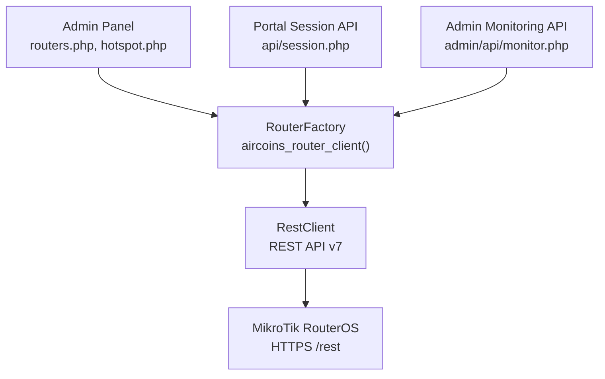
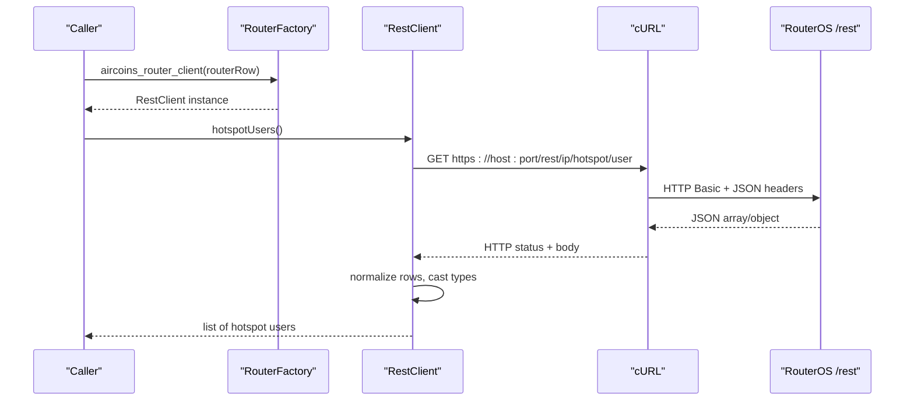
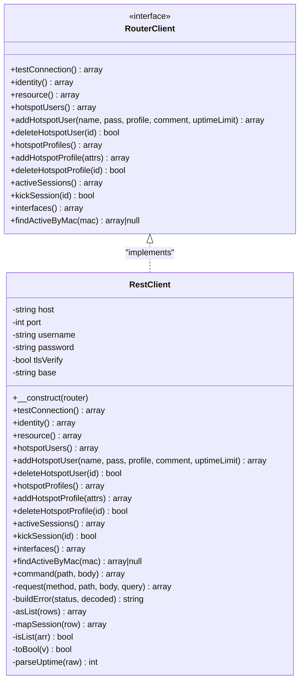
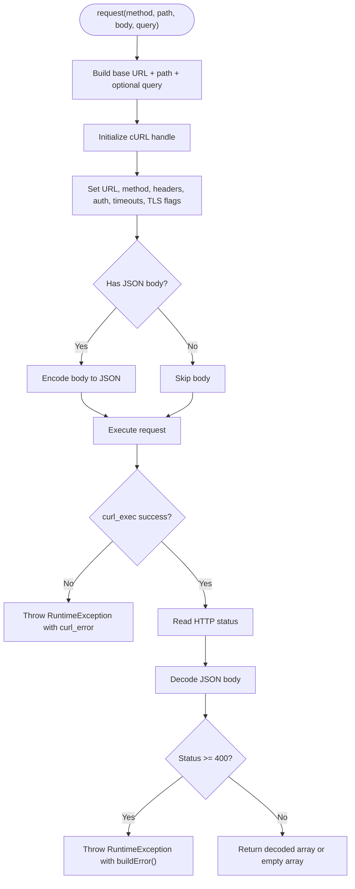
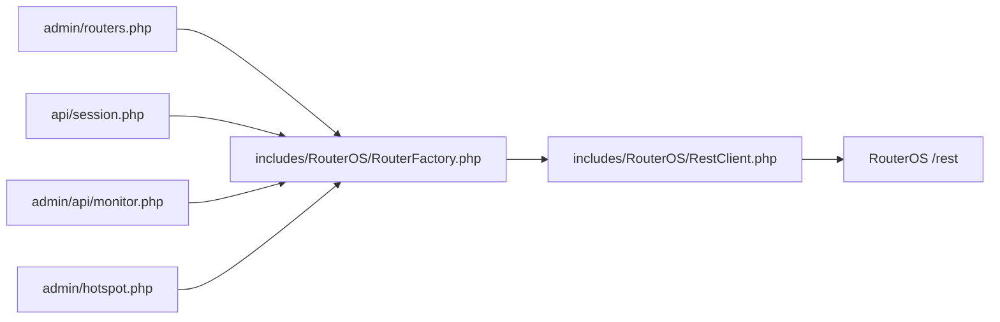

# REST API Client

<cite>
**Referenced Files in This Document**
- [RestClient.php](file://includes/RouterOS/RestClient.php)
- [RouterClientInterface.php](file://includes/RouterOS/RouterClientInterface.php)
- [RouterFactory.php](file://includes/RouterOS/RouterFactory.php)
- [routers.php](file://admin/routers.php)
- [session.php](file://api/session.php)
- [monitor.php](file://admin/api/monitor.php)
- [hotspot.php](file://admin/hotspot.php)
</cite>

## Update Summary
**Changes Made**
- Updated attribute naming conventions for RouterOS API compatibility
- Corrected hotspot profile endpoint paths for RouterOS v7 compatibility
- Enhanced documentation for API version compatibility considerations

## Table of Contents
1. [Introduction](#introduction)
2. [Project Structure](#project-structure)
3. [Core Components](#core-components)
4. [Architecture Overview](#architecture-overview)
5. [Detailed Component Analysis](#detailed-component-analysis)
6. [Dependency Analysis](#dependency-analysis)
7. [Performance Considerations](#performance-considerations)
8. [Troubleshooting Guide](#troubleshooting-guide)
9. [Conclusion](#conclusion)

## Introduction
This document explains the REST API client implementation used to communicate with MikroTik RouterOS v7 devices through their HTTPS-based REST endpoint. The `RestClient` class implements a unified `RouterClient` interface so that higher-level admin and portal code can call router operations without knowing whether the underlying transport is REST or legacy binary.

The client:
- Connects over HTTPS using cURL and HTTP Basic authentication.
- Maps HTTP verbs to RouterOS operations such as print, add, set, remove, and command execution.
- Normalizes RouterOS REST responses into a stable contract for hotspot user management, session control, and system monitoring.
- Exposes TLS verification configuration and strict error handling.

## Project Structure
The REST client lives under the shared `includes/RouterOS` layer and is consumed by:
- The admin panel for router management, testing connectivity, and hotspot administration.
- The portal-facing session API for live status lookup by MAC address.
- The admin monitoring API for collecting router metrics.

**Diagram sources**
- [routers.php:74-96](file://admin/routers.php#L74-L96)
- [session.php:67-78](file://api/session.php#L67-L78)
- [monitor.php:131-131](file://admin/api/monitor.php#L131-L131)
- [hotspot.php:102-102](file://admin/hotspot.php#L102-L102)
- [hotspot.php:290-290](file://admin/hotspot.php#L290-L290)
- [RouterFactory.php:29-54](file://includes/RouterOS/RouterFactory.php#L29-L54)
- [RestClient.php:24-48](file://includes/RouterOS/RestClient.php#L24-L48)

**Section sources**
- [RestClient.php:1-48](file://includes/RouterOS/RestClient.php#L1-L48)
- [RouterClientInterface.php:1-27](file://includes/RouterOS/RouterClientInterface.php#L1-L27)
- [RouterFactory.php:1-56](file://includes/RouterOS/RouterFactory.php#L1-L56)
- [routers.php:1-21](file://admin/routers.php#L1-L21)
- [session.php:1-25](file://api/session.php#L1-L25)

## Core Components
- `RouterClient`: A PHP interface defining the unified contract for both REST and legacy clients. It specifies return shapes for identity, resource usage, hotspot users, profiles, active sessions, interfaces, and connection testing.
- `RestClient`: Implements `RouterClient` and talks to RouterOS v7 via `/rest`. It handles HTTP construction, JSON encoding/decoding, Basic auth, TLS settings, and response normalization.
- `RouterFactory`: Builds the correct client based on stored router configuration, decrypting credentials only in memory and selecting REST when `api_type` is `rest`.

Key responsibilities:
- REST verb mapping: GET prints, PUT adds, PATCH sets, DELETE removes, POST executes commands.
- Response normalization: RouterOS returns strings; numeric and boolean fields are cast to satisfy the interface contract.
- `.id` handling: Router-assigned identifiers (including wildcard IDs like `*5`) are appended raw to paths.

**Section sources**
- [RouterClientInterface.php:31-127](file://includes/RouterOS/RouterClientInterface.php#L31-L127)
- [RestClient.php:24-48](file://includes/RouterOS/RestClient.php#L24-L48)
- [RouterFactory.php:29-54](file://includes/RouterOS/RouterFactory.php#L29-L54)

## Architecture Overview
At runtime, callers request a `RouterClient` from the factory. For REST routers, this returns `RestClient`, which uses cURL to send authenticated JSON requests to the router's `/rest` endpoint. Responses are decoded JSON and normalized into consistent arrays.

**Diagram sources**
- [RouterFactory.php:29-54](file://includes/RouterOS/RouterFactory.php#L29-L54)
- [RestClient.php:88-104](file://includes/RouterOS/RestClient.php#L88-L104)
- [RestClient.php:228-231](file://includes/RouterOS/RestClient.php#L228-L231)
- [RestClient.php:270-316](file://includes/RouterOS/RestClient.php#L270-L316)

## Detailed Component Analysis

### RestClient Class
`RestClient` encapsulates all REST-specific behavior:
- Constructor resolves host, port, username, password, and TLS verification mode, then builds the base URL (`http(s)://host:port/rest`).
- Public methods implement the `RouterClient` contract:
  - `testConnection()`: reads identity and resource endpoints to validate reachability and credentials.
  - `identity()` and `resource()`: read `/system/identity` and `/system/resource`.
  - Hotspot user/profile CRUD: `/ip/hotspot/user` and `/ip/hotspot/user/profile`.
  - Active session queries and kick: `/ip/hotspot/active`.
  - Interface listing with traffic counters: `/interface`.
  - MAC-based session lookup: `/ip/hotspot/active?mac=...`.
  - Command execution: `POST` to arbitrary REST paths with JSON bodies.

HTTP request construction:
- Base URL is built from scheme, host, port, and `/rest`.
- Query strings are appended directly when provided.
- Headers include `Content-Type: application/json` and `Accept: application/json`.
- Authentication uses HTTP Basic with the configured username and password.
- Timeouts: total timeout 10 seconds, connection timeout 5 seconds.
- TLS options: peer verification and hostname verification are controlled by `tls_verify`.

Response parsing:
- Empty bodies decode to empty arrays.
- Non-array responses are coerced to arrays where needed.
- HTTP status codes 400+ throw a descriptive exception including message, detail, and error fields when present.
- Numeric values are cast to int/float; boolean-like strings are converted to booleans.
- Uptime strings are parsed into whole seconds.

**Diagram sources**
- [RouterClientInterface.php:31-127](file://includes/RouterOS/RouterClientInterface.php#L31-L127)
- [RestClient.php:24-471](file://includes/RouterOS/RestClient.php#L24-L471)

#### HTTP Request Construction Flow

**Diagram sources**
- [RestClient.php:270-316](file://includes/RouterOS/RestClient.php#L270-L316)
- [RestClient.php:325-340](file://includes/RouterOS/RestClient.php#L325-L340)

#### Authentication Mechanisms
- The current implementation uses HTTP Basic authentication for every REST request.
- There is no cookie-based session flow in `RestClient`; each request sends credentials via Basic auth.
- Credentials are supplied by the factory after decrypting stored passwords.

Security considerations:
- Use HTTPS (default port 443) to protect credentials in transit.
- Enable TLS certificate verification when trusted certificates are available.
- Restrict RouterOS user privileges to the minimum required for hotspot and monitoring operations.

**Section sources**
- [RestClient.php:270-296](file://includes/RouterOS/RestClient.php#L270-L296)
- [RouterFactory.php:31-46](file://includes/RouterOS/RouterFactory.php#L31-L46)

#### TLS Configuration and Certificate Verification
- `tls_verify` controls both peer verification and hostname verification.
- When enabled, cURL verifies the server certificate and hostname.
- When disabled, verification is turned off, which is common for self-signed router certificates but reduces security.

Recommended practice:
- Prefer valid CA-signed certificates for production environments.
- Keep `tls_verify` enabled unless explicitly managing self-signed trust chains.

**Section sources**
- [RestClient.php:38-48](file://includes/RouterOS/RestClient.php#L38-L48)
- [RestClient.php:288-291](file://includes/RouterOS/RestClient.php#L288-L291)

#### Common RouterOS Operations via REST Endpoints
- User management:
  - List users: GET `/ip/hotspot/user`.
  - Add user: PUT `/ip/hotspot/user` with JSON body containing name, password, profile, and optional fields.
  - Delete user: DELETE `/ip/hotspot/user/.id`.
- Profile management:
  - List profiles: GET `/ip/hotspot/user/profile`.
  - Add profile: PUT `/ip/hotspot/user/profile` with JSON attributes.
  - Delete profile: DELETE `/ip/hotspot/user/profile/.id`.
- Session control:
  - List active sessions: GET `/ip/hotspot/active`.
  - Kick session: DELETE `/ip/hotspot/active/.id`.
  - Find session by MAC: GET `/ip/hotspot/active?mac=...`.
- System monitoring:
  - Identity: GET `/system/identity`.
  - Resource usage: GET `/system/resource`.
  - Interfaces: GET `/interface` with property list.
- Commands:
  - Execute commands via POST with JSON payload, e.g., traffic monitoring.

**Updated** Endpoint paths have been corrected to use `/ip/hotspot/user/profile` instead of `/ip/hotspot/profile` for RouterOS v7 compatibility.

**Section sources**
- [RestClient.php:67-86](file://includes/RouterOS/RestClient.php#L67-L86)
- [RestClient.php:88-175](file://includes/RouterOS/RestClient.php#L88-L175)
- [RestClient.php:177-222](file://includes/RouterOS/RestClient.php#L177-L222)
- [RestClient.php:255-258](file://includes/RouterOS/RestClient.php#L255-L258)

### RouterClientInterface Contract
The interface defines the expected return shapes and method signatures. This ensures that admin and portal code can treat REST and legacy clients uniformly.

Important contracts:
- `resource()` returns CPU load, memory stats, uptime in seconds, version, and board name.
- `hotspotUsers()` returns a list of user records with normalized types.
- `activeSessions()` returns a list of session records with bytes-in/out as integers.
- `interfaces()` returns interface records with running state and traffic counters.
- `testConnection()` returns a health check result including router name and version.

**Section sources**
- [RouterClientInterface.php:9-23](file://includes/RouterOS/RouterClientInterface.php#L9-L23)
- [RouterClientInterface.php:31-127](file://includes/RouterOS/RouterClientInterface.php#L31-L127)

### RouterFactory Integration
The factory:
- Accepts a router row with encrypted password or plaintext password for tests.
- Decrypts the password in memory only.
- Builds a config array with host, port, username, decrypted password, and TLS verification flag.
- Selects `RestClient` when `api_type` is `rest`; otherwise selects the legacy client.

Usage patterns:
- Admin router auto-detect probes both REST and Legacy APIs.
- Admin test connection calls `testConnection()` and updates last status/error.
- Portal session API iterates enabled routers and finds an active session by MAC.

**Section sources**
- [RouterFactory.php:1-56](file://includes/RouterOS/RouterFactory.php#L1-L56)
- [routers.php:74-96](file://admin/routers.php#L74-L96)
- [routers.php:116-141](file://admin/routers.php#L116-L141)
- [session.php:67-78](file://api/session.php#L67-L78)

## Dependency Analysis
The REST client depends on:
- cURL for HTTP transport.
- RouterOS REST API endpoints for data and commands.
- The factory for instantiation and credential resolution.
- Higher-level controllers for invoking operations.

**Diagram sources**
- [routers.php:74-96](file://admin/routers.php#L74-L96)
- [session.php:67-78](file://api/session.php#L67-L78)
- [monitor.php:131-131](file://admin/api/monitor.php#L131-L131)
- [hotspot.php:102-102](file://admin/hotspot.php#L102-L102)
- [hotspot.php:290-290](file://admin/hotspot.php#L290-L290)
- [RouterFactory.php:29-54](file://includes/RouterOS/RouterFactory.php#L29-L54)
- [RestClient.php:24-48](file://includes/RouterOS/RestClient.php#L24-L48)

**Section sources**
- [RouterFactory.php:12-15](file://includes/RouterOS/RouterFactory.php#L12-L15)
- [RestClient.php:22-24](file://includes/RouterOS/RestClient.php#L22-L24)

## Performance Considerations
- Connection and request timeouts are fixed at 5 seconds for connection establishment and 10 seconds for total request duration.
- No retry logic is implemented inside `RestClient`; failures are surfaced as exceptions to callers.
- Response normalization avoids unnecessary allocations by returning empty arrays for empty or non-array responses.
- MAC lookups use URL-encoded MAC addresses to avoid encoding issues.

Recommendations:
- If high latency or intermittent network issues occur, consider adding retry logic at the caller level with exponential backoff.
- Batch operations where possible to reduce per-request overhead.
- Cache static configuration (profiles, interfaces) if repeatedly accessed within a short time window.

[No sources needed since this section provides general guidance]

## Troubleshooting Guide

### SSL/TLS Problems
Symptoms:
- cURL fails during handshake or certificate validation.
- Self-signed certificates cause verification errors.

Checks:
- Ensure the router's www-ssl service is enabled and reachable on the configured port.
- Verify `tls_verify` setting matches your certificate setup.
- Prefer CA-signed certificates in production; disable verification only for internal/self-signed environments.

Relevant behavior:
- Peer and hostname verification are toggled together by `tls_verify`.
- Transport errors throw a `RuntimeException` with the underlying cURL error message.

**Section sources**
- [RestClient.php:288-291](file://includes/RouterOS/RestClient.php#L288-L291)
- [RestClient.php:298-303](file://includes/RouterOS/RestClient.php#L298-L303)

### Authentication Failures
Symptoms:
- HTTP 401 or 403 responses.
- Test connection fails with authentication-related messages.

Checks:
- Confirm username and password are correct and not blank.
- Ensure the RouterOS user has sufficient privileges for hotspot and monitoring endpoints.
- Verify that credentials are properly decrypted by the factory before being sent.

Relevant behavior:
- Basic auth is applied automatically for every request.
- Error responses are wrapped into descriptive exceptions including message/detail/error fields.

**Section sources**
- [RestClient.php:282-286](file://includes/RouterOS/RestClient.php#L282-L286)
- [RestClient.php:311-315](file://includes/RouterOS/RestClient.php#L311-L315)
- [RouterFactory.php:31-46](file://includes/RouterOS/RouterFactory.php#L31-L46)

### API Version Compatibility
Symptoms:
- Unexpected field types or missing endpoints.
- Behavior differs between RouterOS versions.

Checks:
- Confirm the router supports REST API v7 and that the selected API type is `rest`.
- Validate that endpoints like `/ip/hotspot/user` and `/system/resource` exist on the target device.
- Use the admin panel's auto-detect feature to verify connectivity and version.

**Updated** RouterOS API compatibility fixes have been applied:
- Attribute names corrected from `uptime-limit` to `limit-uptime` for hotspot user operations
- Endpoint paths updated from `/ip/hotspot/profile` to `/ip/hotspot/user/profile` for profile operations

Relevant behavior:
- The factory selects REST when `api_type` is `rest`.
- `testConnection()` reads identity and resource information to confirm compatibility.

**Section sources**
- [RouterFactory.php:48-54](file://includes/RouterOS/RouterFactory.php#L48-L54)
- [RestClient.php:54-65](file://includes/RouterOS/RestClient.php#L54-L65)
- [routers.php:74-96](file://admin/routers.php#L74-L96)

### Error Handling Strategies
- Transport failures (e.g., DNS, connection refused, TLS errors) throw a `RuntimeException` with the cURL error.
- HTTP errors (status >= 400) throw a `RuntimeException` constructed from the decoded JSON error fields.
- Callers should catch exceptions and surface user-friendly messages while avoiding stack trace leakage.

Best practices:
- Wrap client calls in try/catch blocks at the controller layer.
- Log detailed errors internally but display sanitized messages to users.
- Update router status/error fields in the database for auditability.

**Section sources**
- [RestClient.php:298-315](file://includes/RouterOS/RestClient.php#L298-L315)
- [RestClient.php:325-340](file://includes/RouterOS/RestClient.php#L325-L340)
- [routers.php:125-141](file://admin/routers.php#L125-L141)

### Connection Timeout Management
- Total request timeout is 10 seconds; connection timeout is 5 seconds.
- Long-running commands may exceed these limits; consider adjusting timeouts at the caller level if necessary.
- Avoid excessive concurrent requests to prevent overwhelming the router or the web server.

**Section sources**
- [RestClient.php:288-289](file://includes/RouterOS/RestClient.php#L288-L289)

## Conclusion
The REST API client provides a clean, secure, and consistent way to manage MikroTik RouterOS v7 devices through HTTPS. By implementing a unified interface, it allows the admin panel and portal to operate across different router implementations without coupling to transport details. Proper TLS configuration, robust error handling, and clear endpoint mappings make it suitable for hotspot user management, session control, and system monitoring. Recent RouterOS API compatibility fixes ensure proper attribute naming and endpoint path resolution for optimal RouterOS v7 integration. For enhanced reliability, callers may add retry logic and caching around the client's operations.

[No sources needed since this section summarizes without analyzing specific files]