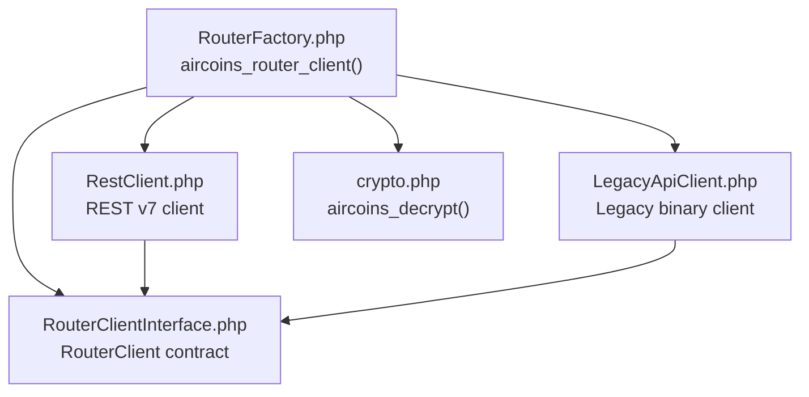
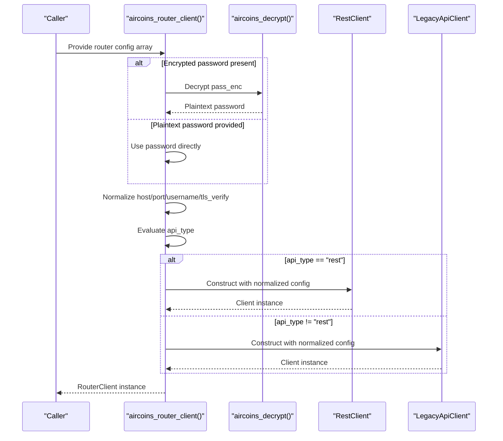
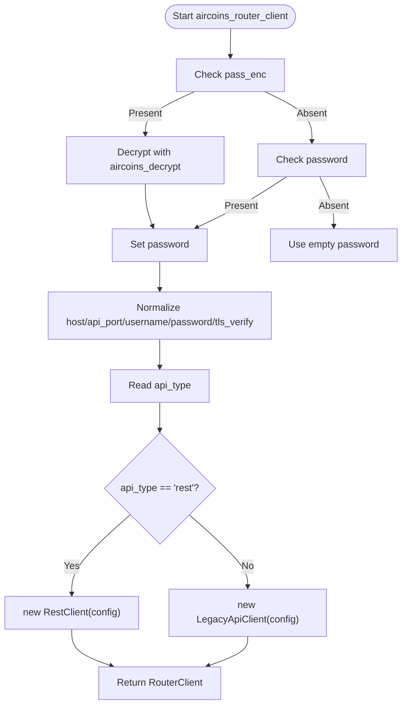
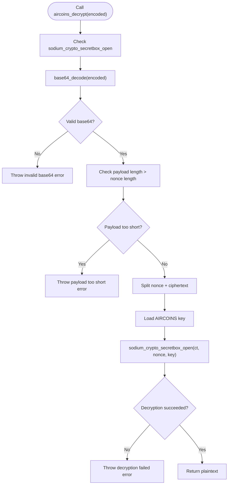
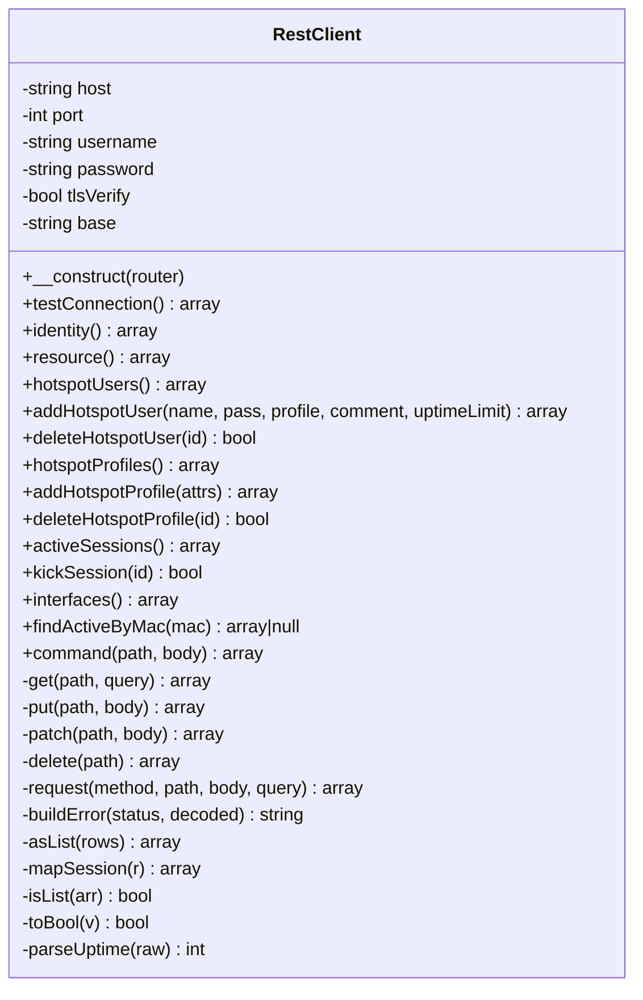
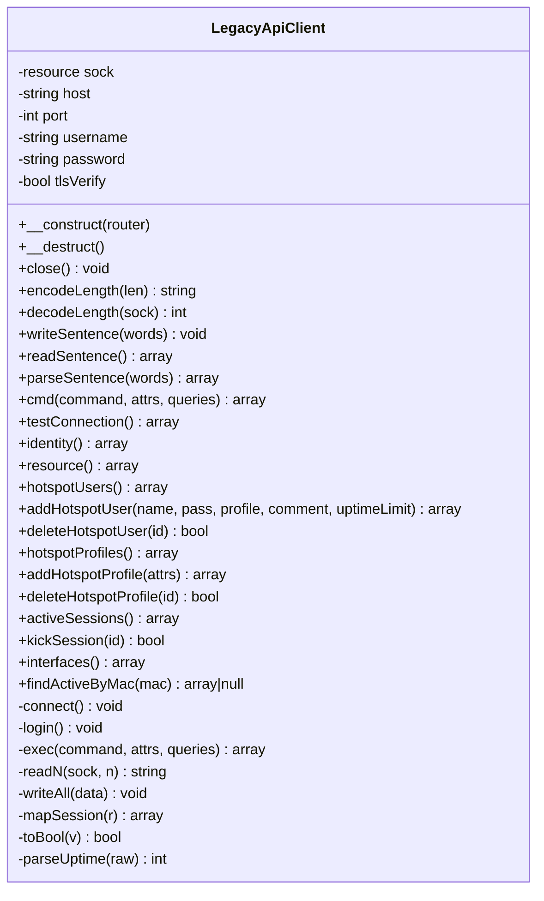
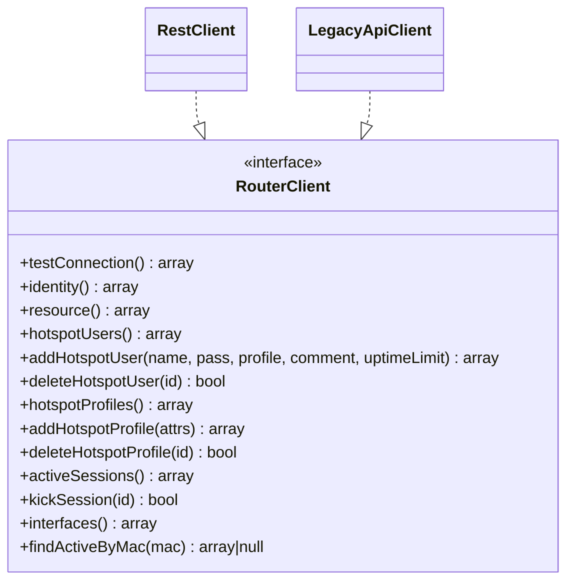
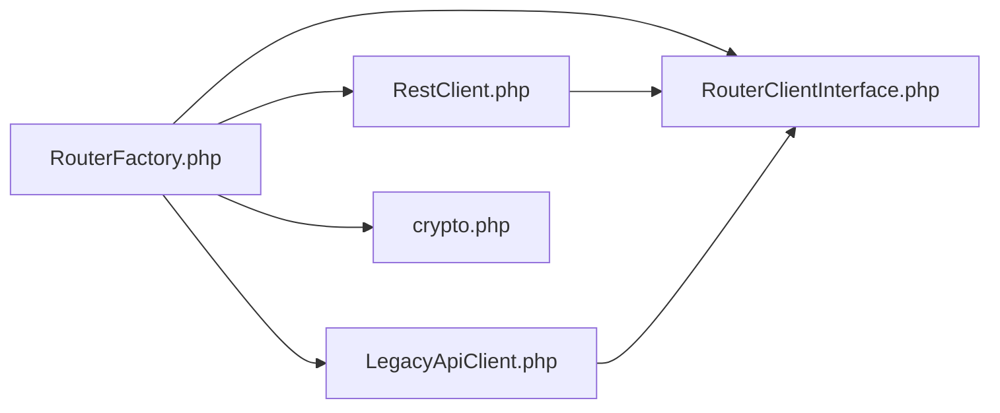

# Router Factory Pattern

<cite>
**Referenced Files in This Document**
- [RouterFactory.php](file://includes/RouterOS/RouterFactory.php)
- [RestClient.php](file://includes/RouterOS/RestClient.php)
- [LegacyApiClient.php](file://includes/RouterOS/LegacyApiClient.php)
- [RouterClientInterface.php](file://includes/RouterOS/RouterClientInterface.php)
- [crypto.php](file://includes/crypto.php)
</cite>

## Table of Contents
1. [Introduction](#introduction)
2. [Project Structure](#project-structure)
3. [Core Components](#core-components)
4. [Architecture Overview](#architecture-overview)
5. [Detailed Component Analysis](#detailed-component-analysis)
6. [Dependency Analysis](#dependency-analysis)
7. [Performance Considerations](#performance-considerations)
8. [Troubleshooting Guide](#troubleshooting-guide)
9. [Conclusion](#conclusion)
10. [Appendices](#appendices)

## Introduction
This document explains the Router Factory pattern used to create RouterOS client instances for MikroTik routers. The central entry point is the `aircoins_router_client` function, which acts as a factory: it receives router configuration, decrypts stored credentials when needed, and returns either a REST API client or a Legacy binary API client based on the configured `api_type`.

The design provides a single unified interface for all router operations while keeping transport-specific details isolated inside concrete client implementations. This makes it straightforward to add new clients, test behavior with plaintext passwords, and handle errors consistently across REST and Legacy transports.

## Project Structure
The relevant code lives under `includes/RouterOS`, plus a shared encryption helper:

**Diagram sources**
- [RouterFactory.php:12-15](file://includes/RouterOS/RouterFactory.php#L12-L15)
- [RestClient.php:22-24](file://includes/RouterOS/RestClient.php#L22-L24)
- [LegacyApiClient.php:20-22](file://includes/RouterOS/LegacyApiClient.php#L20-L22)
- [RouterClientInterface.php:31-127](file://includes/RouterOS/RouterClientInterface.php#L31-L127)
- [crypto.php:111-137](file://includes/crypto.php#L111-L137)

**Section sources**
- [RouterFactory.php:1-56](file://includes/RouterOS/RouterFactory.php#L1-L56)
- [RouterClientInterface.php:1-128](file://includes/RouterOS/RouterClientInterface.php#L1-L128)
- [RestClient.php:1-459](file://includes/RouterOS/RestClient.php#L1-L459)
- [LegacyApiClient.php:1-667](file://includes/RouterOS/LegacyApiClient.php#L1-L667)
- [crypto.php:1-138](file://includes/crypto.php#L1-L138)

## Core Components
- **RouterFactory**: Provides `aircoins_router_client`, the single factory function that builds a `RouterClient` from a router configuration array. It handles password resolution (encrypted or plaintext), normalizes configuration fields, and selects the correct client implementation.
- **RouterClientInterface**: Defines the unified contract for both REST and Legacy clients. All callers use this interface, so they do not need to know whether the underlying transport is HTTP/JSON or binary TCP.
- **RestClient**: Implements the REST API for RouterOS v7 using HTTPS, JSON bodies, and HTTP Basic authentication.
- **LegacyApiClient**: Implements the legacy binary API over TCP/TLS port 8728/8729, including dual-mode login (plaintext and challenge-response).
- **crypto module**: Provides authenticated encryption helpers (`aircoins_encrypt`, `aircoins_decrypt`) backed by libsodium. The factory uses decryption only in memory during request processing.

Key responsibilities:
- Factory resolves plaintext password from encrypted storage or test input.
- Factory maps configuration keys into client constructor parameters.
- Factory chooses REST vs Legacy based on `api_type`.
- Clients implement consistent data shapes for users, profiles, sessions, interfaces, and diagnostics.

**Section sources**
- [RouterFactory.php:17-55](file://includes/RouterOS/RouterFactory.php#L17-L55)
- [RouterClientInterface.php:31-127](file://includes/RouterOS/RouterClientInterface.php#L31-L127)
- [RestClient.php:24-48](file://includes/RouterOS/RestClient.php#L24-L48)
- [LegacyApiClient.php:22-50](file://includes/RouterOS/LegacyApiClient.php#L22-L50)
- [crypto.php:17-137](file://includes/crypto.php#L17-L137)

## Architecture Overview
The factory pattern isolates client selection and credential handling from business logic. Callers pass a router row; the factory returns a ready-to-use client instance.

**Diagram sources**
- [RouterFactory.php:29-55](file://includes/RouterOS/RouterFactory.php#L29-L55)
- [RestClient.php:38-48](file://includes/RouterOS/RestClient.php#L38-L48)
- [LegacyApiClient.php:40-50](file://includes/RouterOS/LegacyApiClient.php#L40-L50)
- [crypto.php:111-137](file://includes/crypto.php#L111-L137)

## Detailed Component Analysis

### Factory Decision Logic and Configuration Mapping
The factory performs three main tasks:
1. Resolve plaintext password from `pass_enc` via `aircoins_decrypt`, or accept a direct `password` field for tests.
2. Build a normalized configuration array with `host`, `api_port`, `username`, `password`, and `tls_verify`.
3. Select the client implementation based on `api_type`:
   - `"rest"` → `RestClient`
   - Any other value → `LegacyApiClient`

Expected configuration array keys:
- `pass_enc`: Optional encrypted password. If present, decrypted in memory.
- `password`: Optional plaintext password, primarily for tests or one-off usage.
- `host`: Router hostname or IP address.
- `api_port`: Port number. Defaults vary by client:
  - REST: defaults to 443 if missing.
  - Legacy: defaults to 8728 if missing.
- `username`: Router username.
- `tls_verify`: Boolean flag controlling TLS verification.

**Diagram sources**
- [RouterFactory.php:29-55](file://includes/RouterOS/RouterFactory.php#L29-L55)
- [RestClient.php:38-48](file://includes/RouterOS/RestClient.php#L38-L48)
- [LegacyApiClient.php:40-50](file://includes/RouterOS/LegacyApiClient.php#L40-L50)
- [crypto.php:111-137](file://includes/crypto.php#L111-L137)

**Section sources**
- [RouterFactory.php:17-55](file://includes/RouterOS/RouterFactory.php#L17-L55)

### Password Decryption Process Using `aircoins_decrypt`
The crypto module uses libsodium’s XSalsa20-Poly1305 secret box. The key is loaded from a secure file path defined by `AIRCOINS_KEY`, normalized to exactly 32 bytes, and cached per process.

Decryption flow:
1. Validate that the sodium extension is available.
2. Decode the base64 payload.
3. Extract nonce and ciphertext.
4. Load the secret key.
5. Attempt decryption; throw an exception on malformed input, bad key, or tampered data.

Security properties:
- Plaintext passwords are never persisted by the factory layer.
- Decryption happens only in memory for the lifetime of the request.
- Key material is read from a protected location outside the web root.

**Diagram sources**
- [crypto.php:111-137](file://includes/crypto.php#L111-L137)
- [crypto.php:25-48](file://includes/crypto.php#L25-L48)
- [crypto.php:57-82](file://includes/crypto.php#L57-L82)

**Section sources**
- [crypto.php:17-137](file://includes/crypto.php#L17-L137)
- [RouterFactory.php:31-38](file://includes/RouterOS/RouterFactory.php#L31-L38)

### REST Client Implementation
The REST client targets RouterOS v7’s `/rest` endpoint over HTTPS. It uses cURL with HTTP Basic authentication and JSON payloads.

Key behaviors:
- Base URL construction depends on port: port 80 uses HTTP; otherwise HTTPS.
- Requests map to RouterOS operations: GET prints, PUT adds, PATCH sets, DELETE removes, POST executes commands.
- Response normalization ensures numeric values are cast correctly and `.id` values are appended raw without percent-encoding.
- Errors include descriptive messages built from HTTP status and response body fields.

**Diagram sources**
- [RestClient.php:24-48](file://includes/RouterOS/RestClient.php#L24-L48)
- [RestClient.php:54-222](file://includes/RouterOS/RestClient.php#L54-L222)
- [RestClient.php:228-340](file://includes/RouterOS/RestClient.php#L228-L340)
- [RestClient.php:354-457](file://includes/RouterOS/RestClient.php#L354-L457)

**Section sources**
- [RestClient.php:1-459](file://includes/RouterOS/RestClient.php#L1-L459)

### Legacy API Client Implementation
The Legacy client implements the RouterOS binary protocol over TCP (port 8728) or TLS (port 8729). It supports dual-mode login:
- Modern firmware accepts plaintext `/login =name=... =password=...`.
- Older firmware responds with a challenge (`=ret=...`); the client computes `00 + md5(0x00 . password . challenge)` and sends it back.

Key behaviors:
- Connection and authentication occur in the constructor.
- Socket I/O includes timeouts, partial reads/writes, and robust error reporting.
- Public static methods expose length encoding/decoding and sentence parsing for unit testing.
- Command execution collects `!re` records and throws on `!trap` or `!fatal`.

**Diagram sources**
- [LegacyApiClient.php:22-50](file://includes/RouterOS/LegacyApiClient.php#L22-L50)
- [LegacyApiClient.php:70-167](file://includes/RouterOS/LegacyApiClient.php#L70-L167)
- [LegacyApiClient.php:186-241](file://includes/RouterOS/LegacyApiClient.php#L186-L241)
- [LegacyApiClient.php:286-423](file://includes/RouterOS/LegacyApiClient.php#L286-L423)
- [LegacyApiClient.php:429-599](file://includes/RouterOS/LegacyApiClient.php#L429-L599)
- [LegacyApiClient.php:611-665](file://includes/RouterOS/LegacyApiClient.php#L611-L665)

**Section sources**
- [LegacyApiClient.php:1-667](file://includes/RouterOS/LegacyApiClient.php#L1-L667)

### Unified Interface Contract
Both clients implement `RouterClient`, ensuring consistent return shapes for:
- Diagnostics: `testConnection`, `identity`, `resource`
- Hotspot management: `hotspotUsers`, `addHotspotUser`, `deleteHotspotUser`, `hotspotProfiles`, `addHotspotProfile`, `deleteHotspotProfile`
- Session control: `activeSessions`, `kickSession`, `findActiveByMac`
- System info: `interfaces`

This abstraction allows higher layers to operate against any router implementation without conditional logic per transport.

**Diagram sources**
- [RouterClientInterface.php:31-127](file://includes/RouterOS/RouterClientInterface.php#L31-L127)
- [RestClient.php:24-222](file://includes/RouterOS/RestClient.php#L24-L222)
- [LegacyApiClient.php:22-599](file://includes/RouterOS/LegacyApiClient.php#L22-L599)

**Section sources**
- [RouterClientInterface.php:1-128](file://includes/RouterOS/RouterClientInterface.php#L1-L128)

## Dependency Analysis
The factory depends on:
- `RouterClientInterface` for type safety and contract enforcement.
- `RestClient` and `LegacyApiClient` for transport-specific behavior.
- `crypto.php` for secure credential decryption.

Clients depend on:
- `RouterClientInterface` for their public API shape.
- External libraries: cURL for REST, PHP streams for Legacy.
- RouterOS endpoints and protocols.

**Diagram sources**
- [RouterFactory.php:12-15](file://includes/RouterOS/RouterFactory.php#L12-L15)
- [RestClient.php:22-24](file://includes/RouterOS/RestClient.php#L22-L24)
- [LegacyApiClient.php:20-22](file://includes/RouterOS/LegacyApiClient.php#L20-L22)
- [crypto.php:111-137](file://includes/crypto.php#L111-L137)

**Section sources**
- [RouterFactory.php:12-15](file://includes/RouterOS/RouterFactory.php#L12-L15)
- [RestClient.php:22-24](file://includes/RouterOS/RestClient.php#L22-L24)
- [LegacyApiClient.php:20-22](file://includes/RouterOS/LegacyApiClient.php#L20-L22)

## Performance Considerations
- Factory overhead is minimal: password decryption and simple array mapping.
- REST client uses cURL with short connection and request timeouts; avoid unnecessary retries.
- Legacy client opens a persistent socket per client instance; reuse clients where possible instead of constructing many instances rapidly.
- Both clients normalize responses; prefer using the unified interface to reduce duplication.

[No sources needed since this section provides general guidance]

## Troubleshooting Guide

### Decryption Failures
Common causes:
- Missing or unreadable key file.
- Malformed base64 payload.
- Incorrect key format or tampered ciphertext.

Symptoms:
- Exceptions thrown from `aircoins_decrypt`.
- Factory call fails before client construction.

Resolution steps:
- Verify `AIRCOINS_KEY` points to a valid, readable file containing a 32-byte key (raw, hex, or base64).
- Ensure stored `pass_enc` values were produced by `aircoins_encrypt`.
- Regenerate the key and re-encrypt stored passwords if necessary.

**Section sources**
- [crypto.php:25-48](file://includes/crypto.php#L25-L48)
- [crypto.php:57-82](file://includes/crypto.php#L57-L82)
- [crypto.php:111-137](file://includes/crypto.php#L111-L137)

### Connection Issues (REST)
Common causes:
- Unreachable host or wrong port.
- Invalid credentials.
- TLS verification failures.
- HTTP errors returned by the router.

Symptoms:
- cURL exceptions or HTTP error responses mapped to `RuntimeException`.

Resolution steps:
- Confirm `host`, `api_port`, `username`, and `password`.
- Check firewall rules and router REST service availability.
- Adjust `tls_verify` according to your certificate setup.
- Inspect HTTP status and error message fields for router-side issues.

**Section sources**
- [RestClient.php:270-340](file://includes/RouterOS/RestClient.php#L270-L340)

### Connection Issues (Legacy)
Common causes:
- Wrong port (should be 8728 or 8729).
- Network connectivity problems.
- Authentication failure (wrong credentials or unsupported firmware mode).
- Socket timeouts or closed connections.

Symptoms:
- Exceptions during `connect()` or `login()`.
- Trap/fatal replies from the router.

Resolution steps:
- Verify port and network reachability.
- Ensure credentials match the router configuration.
- For older firmware, confirm challenge-response support.
- Review timeout settings and socket state.

**Section sources**
- [LegacyApiClient.php:70-167](file://includes/RouterOS/LegacyApiClient.php#L70-L167)
- [LegacyApiClient.php:255-312](file://includes/RouterOS/LegacyApiClient.php#L255-L312)
- [LegacyApiClient.php:386-423](file://includes/RouterOS/LegacyApiClient.php#L386-L423)

## Conclusion
The Router Factory pattern in this codebase cleanly separates credential handling, client selection, and transport-specific logic. The `aircoins_router_client` function provides a safe, predictable entry point for creating router clients, supporting both modern REST and legacy binary APIs. By enforcing a unified interface, the system remains extensible and testable, with clear error handling paths for decryption and connectivity issues.

[No sources needed since this section summarizes without analyzing specific files]

## Appendices

### Factory Usage Patterns
- Production usage: Pass a full router row containing `pass_enc`; the factory decrypts it in memory and constructs the appropriate client.
- Test usage: Pass a router array with a plaintext `password` field to avoid encryption overhead during tests.

Example patterns (described):
- Create a REST client by setting `api_type` to `"rest"`.
- Create a Legacy client by omitting `api_type` or setting it to any non-rest value.

**Section sources**
- [RouterFactory.php:17-55](file://includes/RouterOS/RouterFactory.php#L17-L55)

### Extension Points for Adding New Client Implementations
To add a new client:
1. Implement the `RouterClient` interface with the required methods and consistent return shapes.
2. Add a new constructor that accepts the same normalized configuration array.
3. Extend the factory decision logic to recognize a new `api_type` value and instantiate the new client.

Considerations:
- Maintain compatibility with existing callers by preserving the interface contract.
- Handle errors consistently, preferably throwing `RuntimeException` with descriptive messages.
- Keep credential handling secure; avoid persisting plaintext passwords.

**Section sources**
- [RouterClientInterface.php:31-127](file://includes/RouterOS/RouterClientInterface.php#L31-L127)
- [RouterFactory.php:48-54](file://includes/RouterOS/RouterFactory.php#L48-L54)