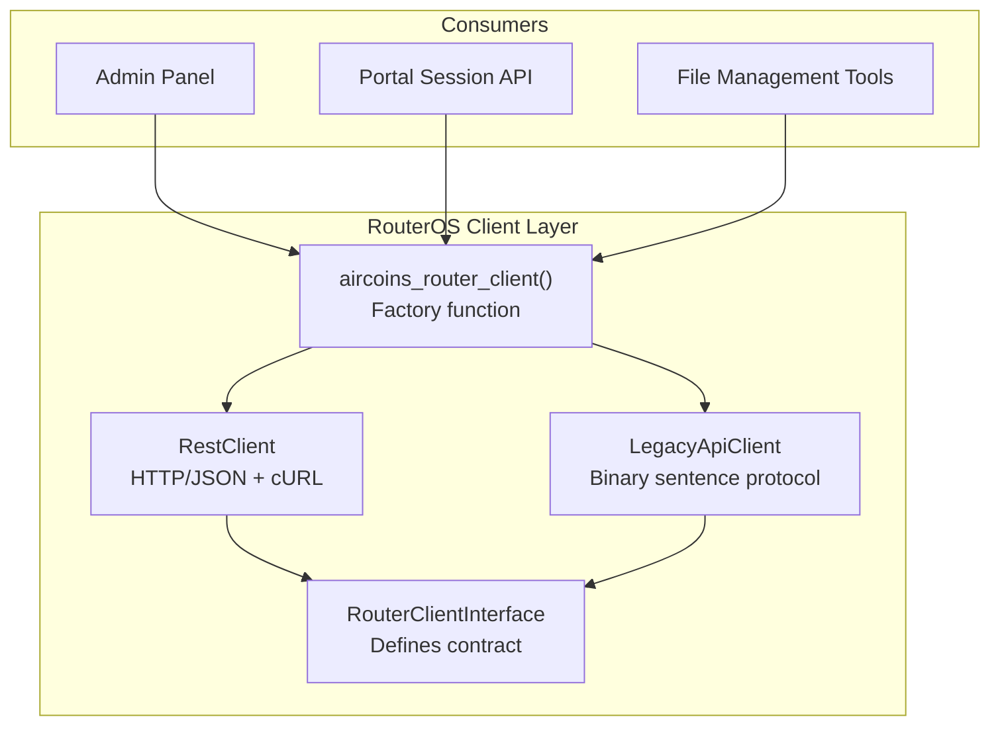
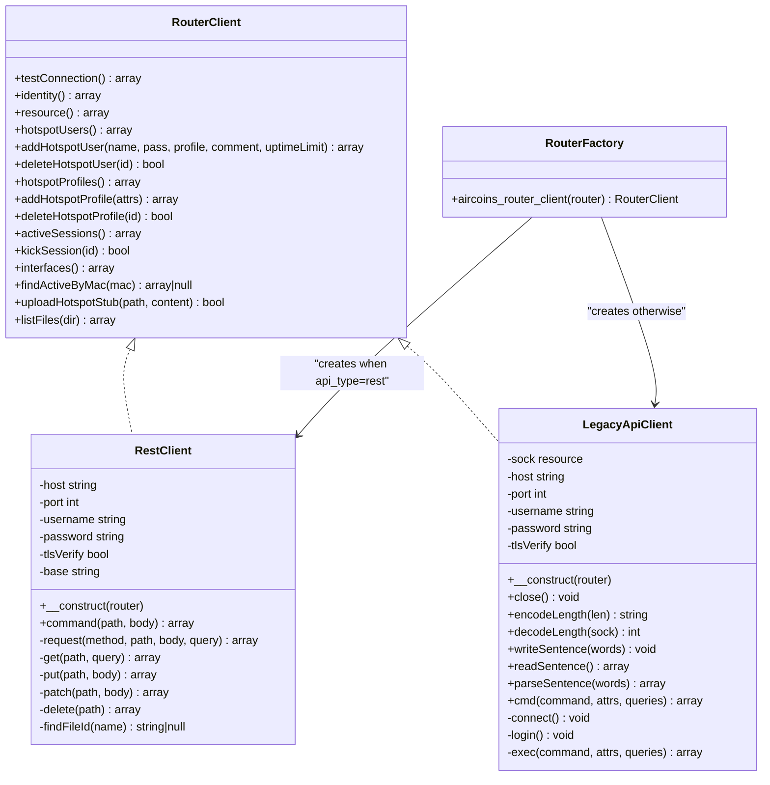
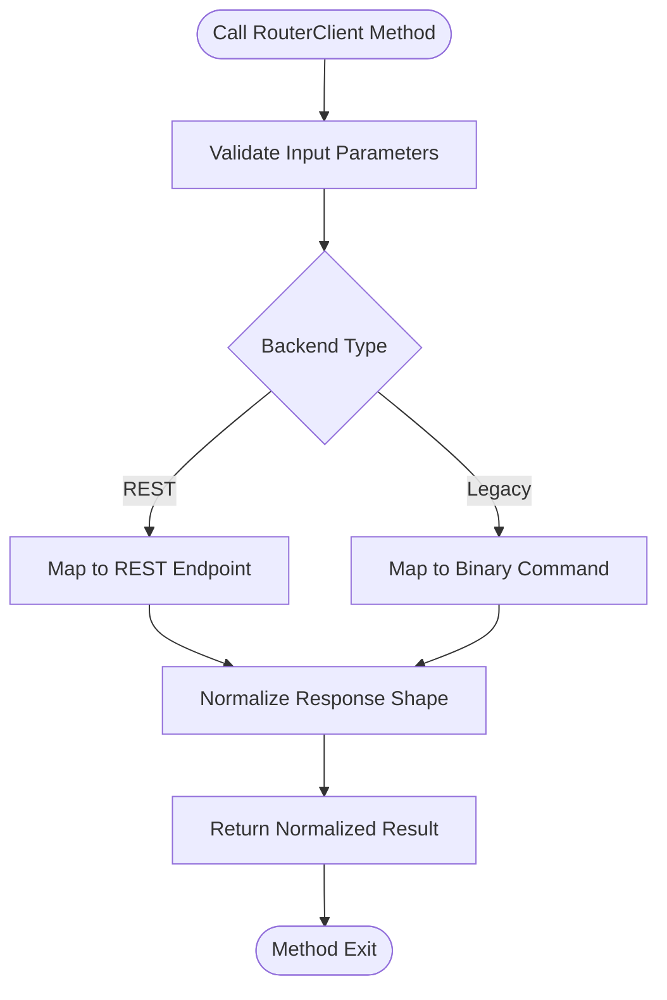
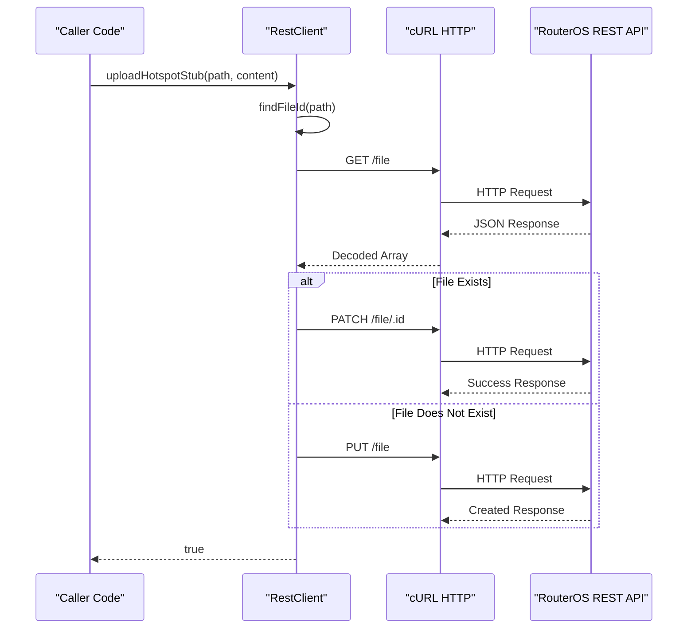
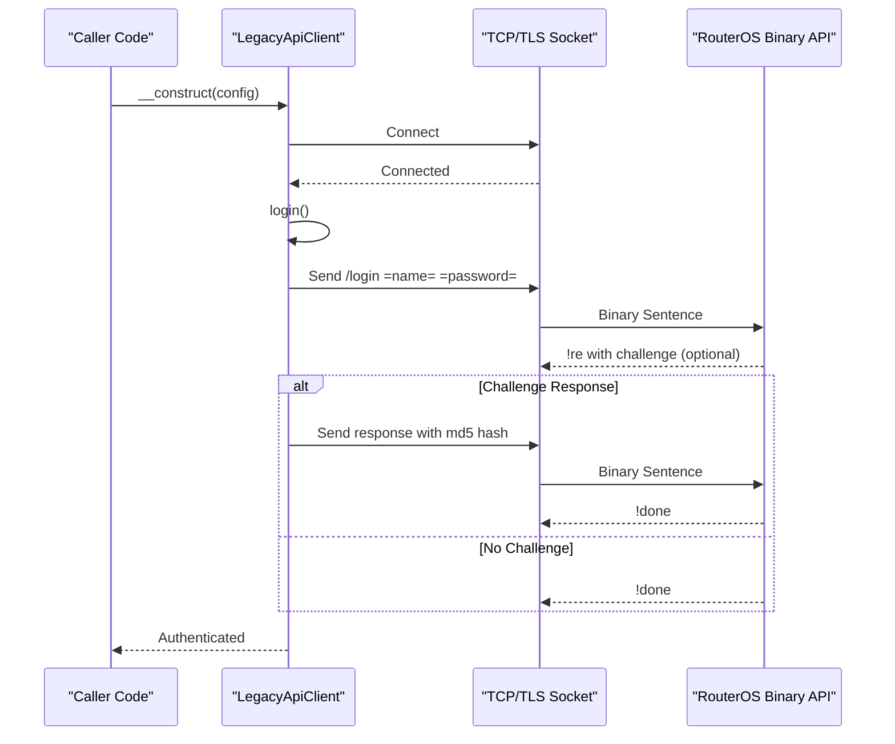
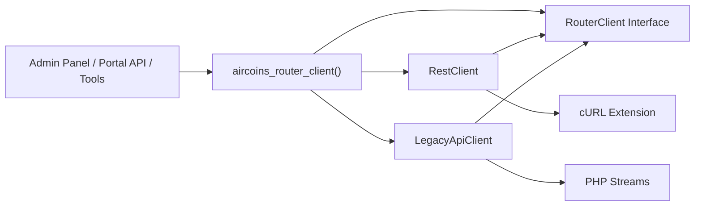

# RouterClient Interface

<cite>
**Referenced Files in This Document**
- [RouterClientInterface.php](file://includes/RouterOS/RouterClientInterface.php)
- [RestClient.php](file://includes/RouterOS/RestClient.php)
- [LegacyApiClient.php](file://includes/RouterOS/LegacyApiClient.php)
- [RouterFactory.php](file://includes/RouterOS/RouterFactory.php)
</cite>

## Update Summary
**Changes Made**
- Added documentation for new file management methods: uploadHotspotStub() and listFiles()
- Updated method signature reference to include the new file management capabilities
- Enhanced architecture diagrams to show file management functionality
- Added detailed implementation details for both REST and Legacy API clients
- Updated troubleshooting guide with file-related error handling patterns

## Table of Contents
1. [Introduction](#introduction)
2. [Project Structure](#project-structure)
3. [Core Components](#core-components)
4. [Architecture Overview](#architecture-overview)
5. [Detailed Component Analysis](#detailed-component-analysis)
6. [Dependency Analysis](#dependency-analysis)
7. [Performance Considerations](#performance-considerations)
8. [Troubleshooting Guide](#troubleshooting-guide)
9. [Conclusion](#conclusion)
10. [Appendices](#appendices)

## Introduction
This document explains the RouterClient abstraction layer that unifies access to MikroTik RouterOS devices through a single PHP interface. The interface defines the contract for all RouterOS API clients, enabling pluggable implementations such as:
- REST client for RouterOS v7 HTTP/JSON endpoints
- Legacy binary API client for RouterOS v6 and v7 over TCP/TLS port 8728/8729

The design allows the admin panel and portal session API to switch between REST and Legacy backends without changing business logic. It also supports testing with mock implementations and future protocol extensions by adding new classes that implement the same interface.

**Updated** The interface now includes comprehensive file management capabilities for uploading hotspot stub files and listing router filesystem contents, enabling dynamic content deployment and management.

## Project Structure
The RouterOS client layer lives under `includes/RouterOS` and consists of:
- An interface defining the contract
- Two concrete implementations (REST and Legacy)
- A factory function that selects the correct implementation based on router configuration



**Diagram sources**
- [RouterClientInterface.php:31-151](file://includes/RouterOS/RouterClientInterface.php#L31-L151)
- [RestClient.php:24-520](file://includes/RouterOS/RestClient.php#L24-L520)
- [LegacyApiClient.php:22-692](file://includes/RouterOS/LegacyApiClient.php#L22-L692)
- [RouterFactory.php:29-56](file://includes/RouterOS/RouterFactory.php#L29-L56)

**Section sources**
- [RouterClientInterface.php:1-27](file://includes/RouterOS/RouterClientInterface.php#L1-L27)
- [RestClient.php:1-18](file://includes/RouterOS/RestClient.php#L1-L18)
- [LegacyApiClient.php:1-16](file://includes/RouterOS/LegacyApiClient.php#L1-L16)
- [RouterFactory.php:1-8](file://includes/RouterOS/RouterFactory.php#L1-L8)

## Core Components
The core components are:
- RouterClient interface: method signatures, return shapes, and exception behavior
- RestClient: implements the interface using RouterOS v7 REST API
- LegacyApiClient: implements the interface using RouterOS legacy binary API
- aircoins_router_client factory: resolves plaintext credentials and returns the correct client type

Key responsibilities:
- Connection management: connection probing, authentication, and resource handling
- Command execution: reading identity, resources, hotspot users/profiles, active sessions, interfaces
- File management: uploading hotspot stub files and listing router filesystem contents
- Error handling: consistent RuntimeException usage across implementations
- Data normalization: converting raw API responses into stable shapes expected by consumers

**Updated** Enhanced with comprehensive file management capabilities including hotspot stub file uploads and directory listing functionality

**Section sources**
- [RouterClientInterface.php:31-151](file://includes/RouterOS/RouterClientInterface.php#L31-L151)
- [RestClient.php:24-520](file://includes/RouterOS/RestClient.php#L24-L520)
- [LegacyApiClient.php:22-692](file://includes/RouterOS/LegacyApiClient.php#L22-L692)
- [RouterFactory.php:29-56](file://includes/RouterOS/RouterFactory.php#L29-L56)

## Architecture Overview
The RouterClient architecture follows a simple strategy pattern:
- Consumers depend only on the RouterClient interface
- The factory chooses RestClient or LegacyApiClient based on api_type
- Implementations encapsulate transport-specific details (HTTP vs binary socket)
- Return values are normalized so callers do not need to know backend differences



**Diagram sources**
- [RouterClientInterface.php:31-151](file://includes/RouterOS/RouterClientInterface.php#L31-L151)
- [RestClient.php:24-520](file://includes/RouterOS/RestClient.php#L24-L520)
- [LegacyApiClient.php:22-692](file://includes/RouterOS/LegacyApiClient.php#L22-L692)
- [RouterFactory.php:29-56](file://includes/RouterOS/RouterFactory.php#L29-L56)

## Detailed Component Analysis

### RouterClient Interface Contract
The RouterClient interface defines the complete set of operations required to manage RouterOS hotspot functionality, device information, and file system operations. All methods have strict return types documented via PHPDoc annotations.

Core method categories:
- Connection and diagnostics: testConnection, identity, resource
- Hotspot user management: hotspotUsers, addHotspotUser, deleteHotspotUser
- Hotspot profile management: hotspotProfiles, addHotspotProfile, deleteHotspotProfile
- Session management: activeSessions, kickSession, findActiveByMac
- Network monitoring: interfaces
- **New** File management: uploadHotspotStub, listFiles

Return value conventions:
- Lists are arrays of associative arrays with consistent keys
- Booleans are coerced from RouterOS string representations
- Uptime is normalized to seconds
- Optional fields use safe defaults when missing
- Hotspot user records include 'limit-uptime' attribute (not 'uptime-limit') to match MikroTik API specifications

Exception handling:
- Methods may throw RuntimeException for network failures, authentication errors, or invalid responses
- File operations throw RuntimeException for upload/list failures
- Implementations must maintain this contract so callers can uniformly handle errors



**Diagram sources**
- [RouterClientInterface.php:31-151](file://includes/RouterOS/RouterClientInterface.php#L31-L151)
- [RestClient.php:54-520](file://includes/RouterOS/RestClient.php#L54-L520)
- [LegacyApiClient.php:429-692](file://includes/RouterOS/LegacyApiClient.php#L429-L692)

**Section sources**
- [RouterClientInterface.php:31-151](file://includes/RouterOS/RouterClientInterface.php#L31-L151)

### RestClient Implementation
The RestClient implements RouterClient using RouterOS v7 REST API over HTTPS with HTTP Basic authentication and JSON payloads.

Key characteristics:
- Uses cURL for HTTP requests with configurable TLS verification
- Maps REST verbs to RouterOS operations (GET→print, PUT→add, PATCH→set, DELETE→remove, POST→command)
- Handles REST quirks: all values returned as strings, .id values appended raw without percent-encoding
- Provides additional command() method for executing RouterOS commands via POST

Connection management:
- Constructor accepts router configuration including host, api_port, username, password, tls_verify
- Base URL constructed dynamically based on port (http for 80, https otherwise)
- Request timeout set to 10 seconds with 5-second connect timeout

Error handling:
- Throws RuntimeException for transport failures and HTTP status codes >= 400
- Builds descriptive error messages from response JSON fields (message, detail, error)

Data normalization:
- Converts string values to appropriate PHP types (float, int, bool)
- Parses RouterOS uptime format to seconds
- Normalizes boolean-like strings ("true", "yes", "1") to PHP booleans
- Uses 'limit-uptime' attribute for hotspot user creation and retrieval

**New** File management implementation:
- uploadHotspotStub(): Implements smart file upload with existence checking
- Uses PATCH for existing files, PUT for new files
- Includes helper method findFileId() to locate existing files
- listFiles(): Filters router file listings by directory prefix
- Handles base64 encoding for file contents in REST API



**Diagram sources**
- [RestClient.php:459-497](file://includes/RouterOS/RestClient.php#L459-L497)
- [RestClient.php:499-518](file://includes/RouterOS/RestClient.php#L499-L518)

**Section sources**
- [RestClient.php:24-520](file://includes/RouterOS/RestClient.php#L24-L520)

### LegacyApiClient Implementation
The LegacyApiClient implements RouterClient using the RouterOS binary "sentence" protocol over TCP (8728) or TLS (8729).

Key characteristics:
- Implements dual-mode authentication: plaintext login for modern firmware, challenge-response for older versions
- Exposes public static methods for length encoding/decoding to enable unit testing without network connections
- Manages persistent socket connections with proper cleanup in destructor

Connection management:
- Constructor immediately connects and authenticates
- Supports both plain TCP and TLS connections with configurable peer verification
- Provides explicit close() method and automatic cleanup via destructor

Protocol implementation:
- Encodes/decodes length-prefixed words per RouterOS binary spec
- Sends sentences terminated by zero-length word
- Parses reply tags (!re, !done, !trap, !fatal) and handles each appropriately

Error handling:
- Throws RuntimeException for socket failures, authentication errors, and protocol violations
- Distinguishes between !trap (recoverable) and !fatal (unrecoverable) errors

Additional capabilities:
- writeSentence(), readSentence(), parseSentence() for low-level protocol interaction
- cmd() method for sending commands and collecting records
- exec() internal method returning both records and done attributes
- Uses 'limit-uptime' attribute for hotspot user creation and retrieval

**New** File management implementation:
- uploadHotspotStub(): Directly sends file contents via binary protocol
- Leverages native binary protocol support for arbitrary byte data
- listFiles(): Uses regex-based filtering with '~' operator for efficient directory listing



**Diagram sources**
- [LegacyApiClient.php:40-50](file://includes/RouterOS/LegacyApiClient.php#L40-L50)
- [LegacyApiClient.php:101-167](file://includes/RouterOS/LegacyApiClient.php#L101-L167)

**Section sources**
- [LegacyApiClient.php:22-692](file://includes/RouterOS/LegacyApiClient.php#L22-L692)

### Factory Function
The aircoins_router_client factory function provides centralized client instantiation with secure credential handling.

Key features:
- Decrypts encrypted passwords from database storage before passing to clients
- Falls back to plaintext password for testing scenarios
- Selects implementation based on api_type configuration ('rest' vs legacy)
- Returns fully connected and authenticated client instances

Security considerations:
- Plaintext passwords exist only in memory during client construction
- No plaintext passwords are persisted by the factory layer
- Encryption/decryption handled by separate crypto module

Configuration resolution:
- Accepts full router table rows with encrypted credentials
- Supports already-decrypted arrays for testing convenience
- Validates and normalizes all configuration parameters

**Section sources**
- [RouterFactory.php:29-56](file://includes/RouterOS/RouterFactory.php#L29-L56)

## Dependency Analysis
The RouterOS client layer has clear dependency relationships:



**Diagram sources**
- [RouterFactory.php:29-56](file://includes/RouterOS/RouterFactory.php#L29-L56)
- [RestClient.php:270-316](file://includes/RouterOS/RestClient.php#L270-L316)
- [LegacyApiClient.php:70-94](file://includes/RouterOS/LegacyApiClient.php#L70-L94)

Coupling analysis:
- Low coupling between consumers and specific implementations
- High cohesion within each implementation class
- Clear separation of concerns between interface definition and implementation details
- Minimal external dependencies beyond standard PHP extensions

Potential circular dependencies:
- None detected; interface is independent and implementations depend only on the interface
- Factory depends on both implementations but they don't depend on the factory

**Section sources**
- [RouterClientInterface.php:31-151](file://includes/RouterOS/RouterClientInterface.php#L31-L151)
- [RestClient.php:22-25](file://includes/RouterOS/RestClient.php#L22-L25)
- [LegacyApiClient.php:20-23](file://includes/RouterOS/LegacyApiClient.php#L20-L23)
- [RouterFactory.php:12-15](file://includes/RouterOS/RouterFactory.php#L12-L15)

## Performance Considerations
Performance characteristics differ between implementations:

REST Client:
- Stateless HTTP requests with connection pooling potential
- JSON serialization/deserialization overhead
- Suitable for high-frequency operations due to lightweight nature
- Configurable timeouts prevent hanging connections
- File operations involve base64 encoding overhead

Legacy Client:
- Persistent socket connections reduce connection overhead
- Binary protocol more efficient than JSON for large datasets
- Lower bandwidth usage due to compact encoding
- Connection management adds complexity but improves throughput
- Native binary protocol support for file operations

Optimization opportunities:
- Connection reuse for frequent operations
- Batch operations where supported by RouterOS
- Caching of frequently accessed data (users, profiles, interfaces)
- Asynchronous operations for non-critical tasks
- Efficient file listing with server-side filtering (Legacy) vs client-side filtering (REST)

## Troubleshooting Guide
Common issues and their handling patterns:

Authentication failures:
- Both implementations throw RuntimeException with descriptive messages
- REST client includes HTTP status code and response details
- Legacy client distinguishes between plaintext and challenge-response failures

Network connectivity:
- Timeout exceptions indicate network issues or router unavailability
- TLS verification failures suggest certificate problems
- Socket connection errors indicate firewall or routing issues

Data parsing errors:
- Invalid RouterOS responses cause parsing exceptions
- Missing fields handled with safe defaults to prevent crashes
- Type coercion ensures consistent return formats
- Attribute naming mismatches (e.g., 'uptime-limit' vs 'limit-uptime') should be resolved by using the correct MikroTik API attribute names

**New** File management issues:
- Upload failures: Check file permissions and available disk space on router
- List failures: Verify directory paths and RouterOS file system structure
- REST-specific: Ensure proper base64 encoding for file contents
- Legacy-specific: Verify binary protocol compatibility with router firmware

Debugging strategies:
- Enable detailed logging in development environments
- Use testConnection() to verify basic connectivity
- Check router configuration for API access permissions
- Verify TLS settings match router certificate configuration
- Test file operations with small files first to validate connectivity

**Section sources**
- [RestClient.php:270-340](file://includes/RouterOS/RestClient.php#L270-L340)
- [LegacyApiClient.php:85-167](file://includes/RouterOS/LegacyApiClient.php#L85-L167)

## Conclusion
The RouterClient interface provides a robust abstraction layer for RouterOS API access that enables:
- Pluggable implementations supporting both REST and Legacy protocols
- Consistent error handling and return value formats
- Easy testing with mock implementations
- Future extibility for new protocols or API versions
- Comprehensive file management capabilities for dynamic content deployment

The design successfully separates concerns between API contracts and transport implementations while maintaining simplicity for consumers. The factory pattern ensures secure credential handling and easy switching between backend implementations.

This architecture supports the project's goal of providing unified access to MikroTik routers regardless of firmware version or available API endpoints, making it easier to maintain and extend the system as RouterOS evolves. The addition of file management capabilities enables sophisticated hotspot customization and dynamic content deployment scenarios.

## Appendices

### Method Signature Reference
Complete method signatures that implementers must follow:

- testConnection(): array - Probes router reachability and credentials
- identity(): array - Returns router identity information  
- resource(): array - Returns system resource statistics
- hotspotUsers(): array - Lists all hotspot users with 'limit-uptime' attribute
- addHotspotUser(string $name, string $pass, string $profile, string $comment = '', string $uptimeLimit = ''): array - Creates new hotspot user with 'limit-uptime' attribute
- deleteHotspotUser(string $id): bool - Removes hotspot user by ID
- hotspotProfiles(): array - Lists all hotspot profiles with 'uptime-limit' attribute
- addHotspotProfile(array $attrs): array - Creates new hotspot profile
- deleteHotspotProfile(string $id): bool - Removes hotspot profile by ID
- activeSessions(): array - Lists currently active sessions
- kickSession(string $id): bool - Disconnects active session by ID
- interfaces(): array - Lists router interfaces with traffic counters
- findActiveByMac(string $mac): ?array - Finds active session by MAC address
- **New** uploadHotspotStub(string $path, string $content): bool - Uploads hotspot stub files to router filesystem
- **New** listFiles(string $dir): array - Lists files in router filesystem directory

**Updated** Added comprehensive file management methods for hotspot stub deployment and filesystem navigation

**Section sources**
- [RouterClientInterface.php:31-151](file://includes/RouterOS/RouterClientInterface.php#L31-L151)

### Testing with Mock Implementations
To test code that uses RouterClient, create a mock implementation:

```php
class MockRouterClient implements RouterClient {
    // Implement all required methods with test data
    public function testConnection(): array { return ['ok' => true, 'name' => 'test', 'version' => '7.0', 'board-name' => 'test']; }
    public function uploadHotspotStub(string $path, string $content): bool { return true; }
    public function listFiles(string $dir): array { return [['name' => 'test.html', 'type' => 'html', 'size' => 100]]; }
    // ... implement other methods
}
```

Benefits of this approach:
- No network dependencies in tests
- Predictable test data and behavior
- Fast test execution
- Isolation from external system changes
- Ability to simulate file system operations without actual router access

**Section sources**
- [RouterClientInterface.php:31-151](file://includes/RouterOS/RouterClientInterface.php#L31-L151)

### MikroTik API Attribute Naming Conventions
Important attribute naming conventions for RouterOS API:

**Hotspot User Attributes:**
- `limit-uptime` - Per-user session time limit (correct attribute name)
- NOT `uptime-limit` - This was an incorrect naming convention

**Hotspot Profile Attributes:**
- `uptime-limit` - Profile-level uptime limit (correct attribute name)
- `session-timeout` - Session timeout configuration
- `rate-limit` - Bandwidth rate limiting
- `shared-users` - Number of concurrent users allowed
- `idle-timeout` - Idle timeout configuration

**File System Operations:**
- REST API: Files are stored with base64-encoded contents
- Legacy API: Files are sent as raw binary data
- Directory filtering: Legacy API supports regex patterns with '~' operator
- File identification: RouterOS assigns unique '.id' values to all files

**Note:** The distinction between `limit-uptime` (for individual users) and `uptime-limit` (for profiles) is crucial for proper RouterOS API communication. File operations require careful handling of encoding differences between REST and Legacy protocols.

**Section sources**
- [RestClient.php:99-114](file://includes/RouterOS/RestClient.php#L99-L114)
- [LegacyApiClient.php:476-491](file://includes/RouterOS/LegacyApiClient.php#L476-L491)
- [RestClient.php:145-157](file://includes/RouterOS/RestClient.php#L145-L157)
- [LegacyApiClient.php:522-534](file://includes/RouterOS/LegacyApiClient.php#L522-L534)
- [RestClient.php:459-518](file://includes/RouterOS/RestClient.php#L459-L518)
- [LegacyApiClient.php:667-690](file://includes/RouterOS/LegacyApiClient.php#L667-L690)