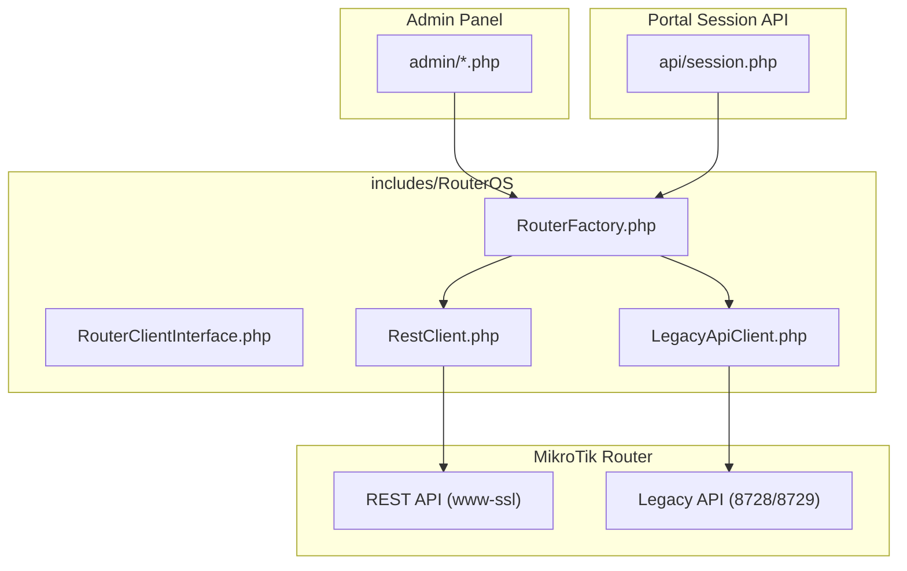
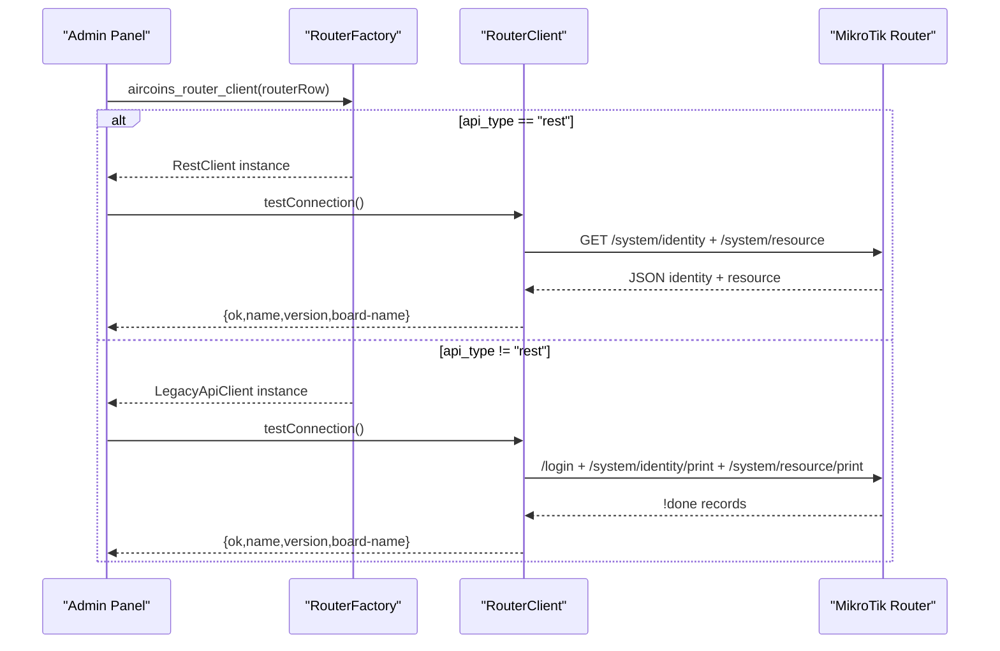
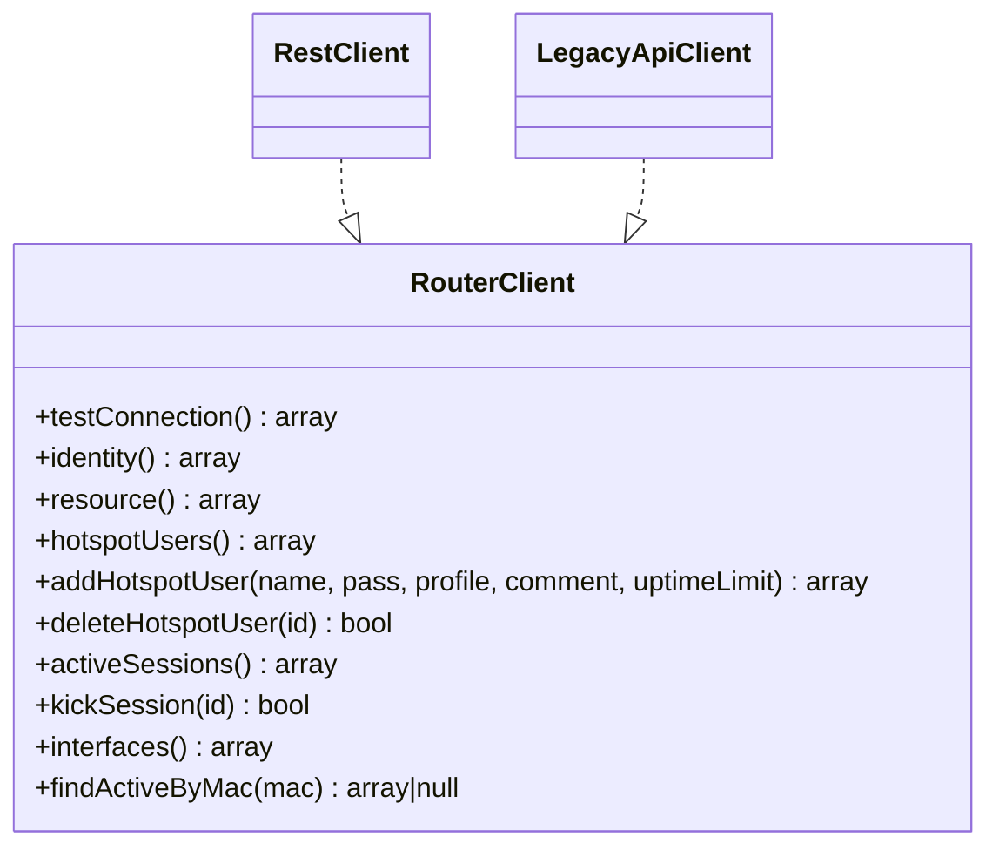
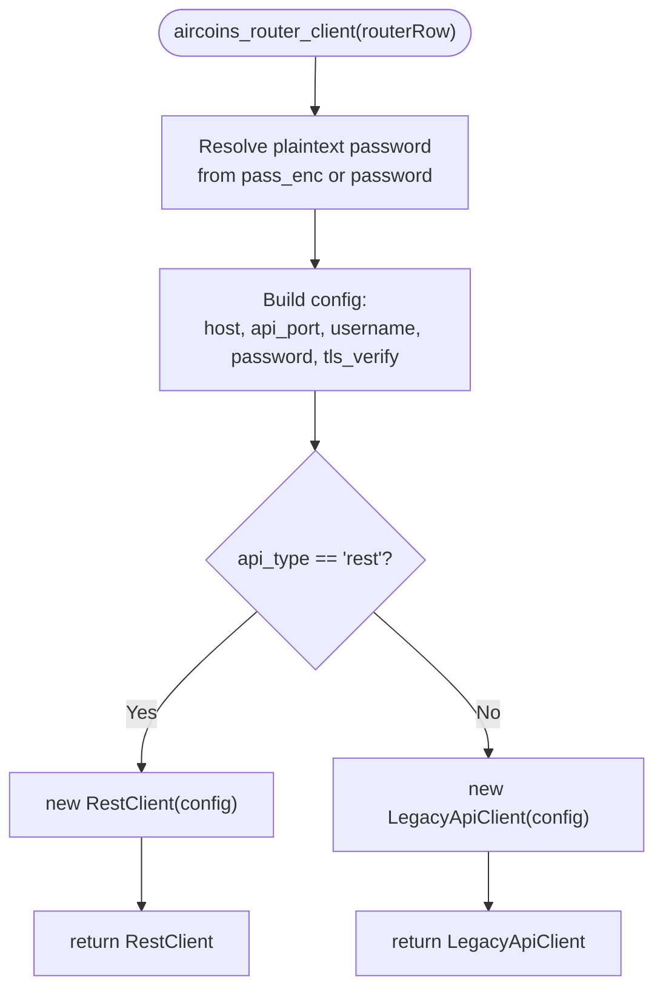
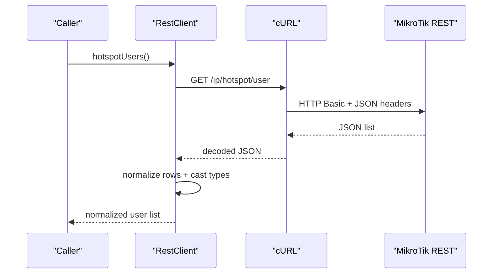
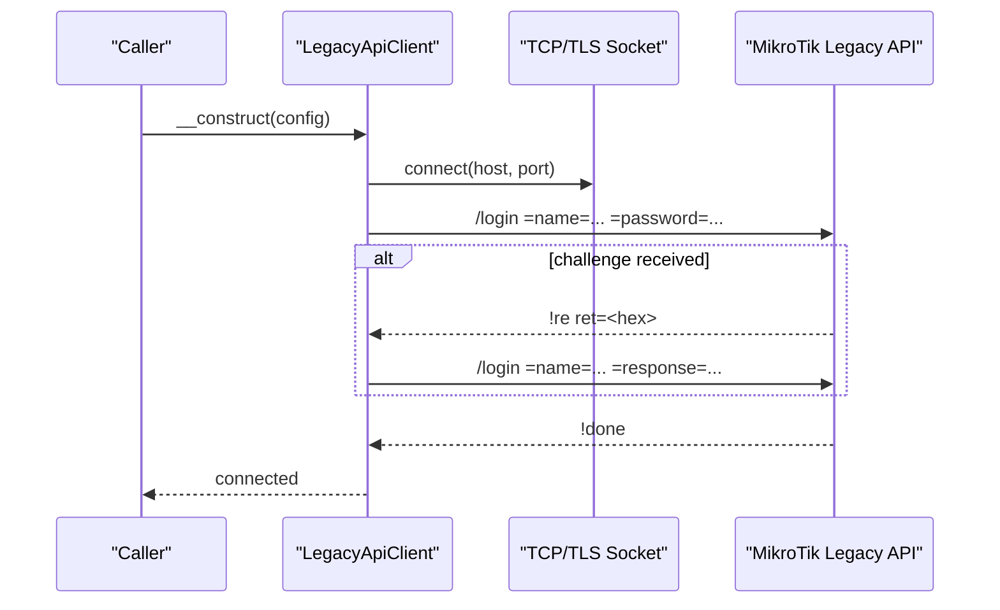
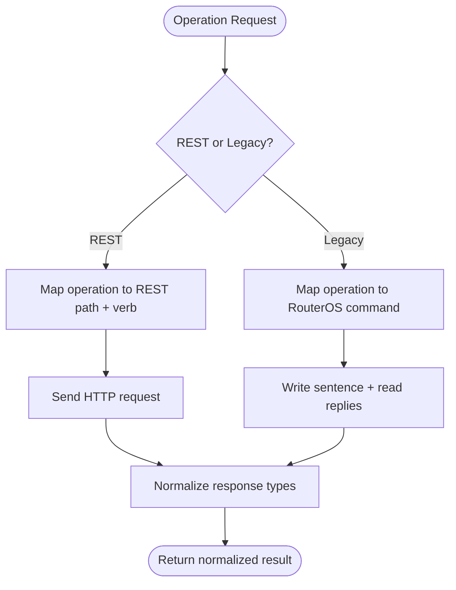
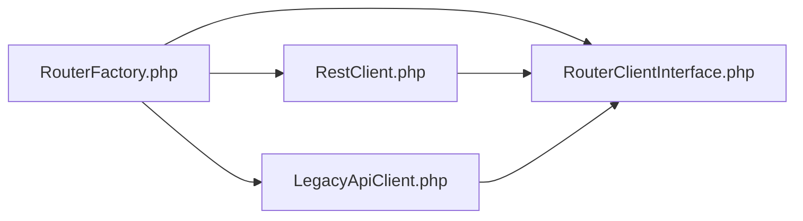

# RouterOS Integration

<cite>
**Referenced Files in This Document**
- [RouterClientInterface.php](file://includes/RouterOS/RouterClientInterface.php)
- [RouterFactory.php](file://includes/RouterOS/RouterFactory.php)
- [RestClient.php](file://includes/RouterOS/RestClient.php)
- [LegacyApiClient.php](file://includes/RouterOS/LegacyApiClient.php)
- [DEPLOYMENT.md](file://DEPLOYMENT.md)
</cite>

## Table of Contents
1. [Introduction](#introduction)
2. [Project Structure](#project-structure)
3. [Core Components](#core-components)
4. [Architecture Overview](#architecture-overview)
5. [Detailed Component Analysis](#detailed-component-analysis)
6. [Dependency Analysis](#dependency-analysis)
7. [Performance Considerations](#performance-considerations)
8. [Troubleshooting Guide](#troubleshooting-guide)
9. [Conclusion](#conclusion)
10. [Appendices](#appendices)

## Introduction
This document explains the RouterOS integration layer used by the controller to manage MikroTik hotspot users, sessions, and system resources. It focuses on:

- The factory pattern that dynamically selects a REST or Legacy API client based on router configuration.
- The `RouterClient` interface that abstracts both implementations behind one contract.
- Protocol-specific behavior for REST (RouterOS v7) and Legacy binary API (v6/v7).
- Connection management, error handling, and RouterOS command patterns.
- Troubleshooting guidance for connectivity, authentication, and protocol errors.
- Guidance for extending the system with new RouterOS integrations or custom API clients.

The goal is to make the integration understandable for both operators and developers while remaining grounded in the actual implementation files.

## Project Structure
The RouterOS integration lives under `includes/RouterOS/`. It contains:

- A shared interface defining the unified contract.
- Two concrete clients: REST and Legacy.
- A factory function that builds the correct client from stored router configuration.

**Diagram sources**
- [RouterClientInterface.php:28-99](file://includes/RouterOS/RouterClientInterface.php#L28-L99)
- [RouterFactory.php:29-55](file://includes/RouterOS/RouterFactory.php#L29-L55)
- [RestClient.php:24-48](file://includes/RouterOS/RestClient.php#L24-L48)
- [LegacyApiClient.php:22-50](file://includes/RouterOS/LegacyApiClient.php#L22-L50)

**Section sources**
- [RouterClientInterface.php:1-24](file://includes/RouterOS/RouterClientInterface.php#L1-L24)
- [RouterFactory.php:1-15](file://includes/RouterOS/RouterFactory.php#L1-L15)
- [RestClient.php:1-18](file://includes/RouterOS/RestClient.php#L1-L18)
- [LegacyApiClient.php:1-16](file://includes/RouterOS/LegacyApiClient.php#L1-L16)

## Core Components
At the center of the integration is the `RouterClient` interface. It defines a stable set of operations that both REST and Legacy clients must implement. This allows the admin panel and portal session API to call the same methods regardless of which underlying protocol is used.

Key responsibilities defined by the interface:

- Connectivity and identity checks:
  - `testConnection()`
  - `identity()`
  - `resource()`
- Hotspot user management:
  - `hotspotUsers()`
  - `addHotspotUser(...)`
  - `deleteHotspotUser(...)`
- Session control:
  - `activeSessions()`
  - `kickSession(...)`
  - `findActiveByMac(...)`
- System monitoring:
  - `interfaces()`

Return-value conventions are documented in the interface comments so consumers can rely on consistent shapes across implementations.

**Section sources**
- [RouterClientInterface.php:28-99](file://includes/RouterOS/RouterClientInterface.php#L28-L99)

## Architecture Overview
The integration uses a simple but effective architecture:

- Consumers call functions on the `RouterClient` interface.
- `RouterFactory` inspects the router row and returns either `RestClient` or `LegacyApiClient`.
- Each client implements the same interface but uses different transport layers:
  - REST client uses HTTP Basic over HTTPS with JSON payloads.
  - Legacy client uses the RouterOS binary sentence protocol over TCP/TLS.

**Diagram sources**
- [RouterFactory.php:29-55](file://includes/RouterOS/RouterFactory.php#L29-L55)
- [RestClient.php:54-86](file://includes/RouterOS/RestClient.php#L54-L86)
- [LegacyApiClient.php:429-463](file://includes/RouterOS/LegacyApiClient.php#L429-L463)

## Detailed Component Analysis

### RouterClient Interface
The interface defines the canonical shape of all RouterOS operations. It also documents return types and exceptions, making it easier to extend the system safely.

Important points:

- All implementations must normalize data into the documented array shapes.
- Boolean values may arrive as strings; implementations should coerce them consistently.
- Uptime values may be integers or duration strings; implementations parse them into seconds.
- `.id` values are router-assigned identifiers and must be passed through unchanged.

**Diagram sources**
- [RouterClientInterface.php:28-99](file://includes/RouterOS/RouterClientInterface.php#L28-L99)
- [RestClient.php:24-48](file://includes/RouterOS/RestClient.php#L24-L48)
- [LegacyApiClient.php:22-50](file://includes/RouterOS/LegacyApiClient.php#L22-L50)

**Section sources**
- [RouterClientInterface.php:28-99](file://includes/RouterOS/RouterClientInterface.php#L28-L99)

### RouterFactory: Dynamic Client Selection
The factory resolves the plaintext password from encrypted storage and chooses the correct client based on `api_type`:

- If `api_type` is `rest`, it returns `RestClient`.
- Otherwise, it returns `LegacyApiClient`.

Security note: passwords are decrypted only in memory when constructing the client. They are not persisted by this layer.

**Diagram sources**
- [RouterFactory.php:29-55](file://includes/RouterOS/RouterFactory.php#L29-L55)

**Section sources**
- [RouterFactory.php:1-55](file://includes/RouterOS/RouterFactory.php#L1-L55)

### REST Client Implementation
The REST client talks to RouterOS v7 via HTTPS using cURL and HTTP Basic authentication. It maps REST verbs to RouterOS operations:

- `GET` → read/print
- `PUT` → add
- `PATCH` → set
- `DELETE` → remove
- `POST` → commands such as monitor-traffic

Protocol-specific considerations:

- Every value returned by REST is a string; the client casts numerics and booleans to satisfy the interface contract.
- `.id` values are appended raw to paths; they must not be percent-encoded.
- TLS peer verification is controlled by `tls_verify`; self-signed router certificates are tolerated when disabled.
- Timeouts are configured for connection and request lifetime.
- HTTP status codes below 400 are treated as success; higher codes throw descriptive exceptions.

**Diagram sources**
- [RestClient.php:88-104](file://includes/RouterOS/RestClient.php#L88-L104)
- [RestClient.php:185-273](file://includes/RouterOS/RestClient.php#L185-L273)

**Section sources**
- [RestClient.php:1-18](file://includes/RouterOS/RestClient.php#L1-L18)
- [RestClient.php:24-48](file://includes/RouterOS/RestClient.php#L24-L48)
- [RestClient.php:54-179](file://includes/RouterOS/RestClient.php#L54-L179)
- [RestClient.php:185-297](file://includes/RouterOS/RestClient.php#L185-L297)
- [RestClient.php:303-414](file://includes/RouterOS/RestClient.php#L303-L414)

### Legacy API Client Implementation
The Legacy client implements the RouterOS binary sentence protocol over TCP (port 8728) or TLS (port 8729). It handles:

- Socket connection and timeout configuration.
- Dual-mode login:
  - Modern firmware accepts plaintext `/login =name= =password=`.
  - Older firmware responds with a challenge; the client computes `00 + md5(0x00 + password + challenge)`.
- Sentence encoding/decoding with length-prefixed words.
- Reply tags:
  - `!re` → record
  - `!done` → end
  - `!trap` → error
  - `!fatal` → fatal error

**Diagram sources**
- [LegacyApiClient.php:40-50](file://includes/RouterOS/LegacyApiClient.php#L40-L50)
- [LegacyApiClient.php:70-94](file://includes/RouterOS/LegacyApiClient.php#L70-L94)
- [LegacyApiClient.php:101-167](file://includes/RouterOS/LegacyApiClient.php#L101-L167)

**Section sources**
- [LegacyApiClient.php:1-16](file://includes/RouterOS/LegacyApiClient.php#L1-L16)
- [LegacyApiClient.php:22-64](file://includes/RouterOS/LegacyApiClient.php#L22-L64)
- [LegacyApiClient.php:70-167](file://includes/RouterOS/LegacyApiClient.php#L70-L167)
- [LegacyApiClient.php:173-241](file://includes/RouterOS/LegacyApiClient.php#L173-L241)
- [LegacyApiClient.php:280-423](file://includes/RouterOS/LegacyApiClient.php#L280-L423)
- [LegacyApiClient.php:429-555](file://includes/RouterOS/LegacyApiClient.php#L429-L555)

### RouterOS Command Execution Patterns
Both clients expose the same high-level operations, but their internal command patterns differ:

- REST client:
  - Reads lists via `GET` endpoints.
  - Creates users via `PUT` with JSON bodies.
  - Removes users and sessions via `DELETE`.
  - Executes commands via `POST`.
- Legacy client:
  - Uses `/ip/hotspot/user/add`, `/ip/hotspot/user/remove`, `/ip/hotspot/active/remove`, and `/ip/hotspot/*/print` commands.
  - Parses `!re` records and `!done` attributes.

Common patterns:

- Normalize boolean fields like `disabled` and `running`.
- Parse uptime strings into seconds.
- Map active session records to a consistent shape including MAC address, IP, bytes in/out, and uptime.

**Diagram sources**
- [RestClient.php:88-179](file://includes/RouterOS/RestClient.php#L88-L179)
- [LegacyApiClient.php:465-555](file://includes/RouterOS/LegacyApiClient.php#L465-L555)

**Section sources**
- [RestClient.php:88-179](file://includes/RouterOS/RestClient.php#L88-L179)
- [LegacyApiClient.php:465-555](file://includes/RouterOS/LegacyApiClient.php#L465-L555)

## Dependency Analysis
The integration has clear boundaries:

- `RouterFactory` depends on:
  - `RouterClientInterface`
  - `RestClient`
  - `LegacyApiClient`
  - Crypto helper for decrypting stored router passwords
- Both clients depend on `RouterClientInterface`.
- Consumers do not need to know which client is used; they interact only with the interface.

**Diagram sources**
- [RouterFactory.php:12-15](file://includes/RouterOS/RouterFactory.php#L12-L15)
- [RestClient.php:22-24](file://includes/RouterOS/RestClient.php#L22-L24)
- [LegacyApiClient.php:20-22](file://includes/RouterOS/LegacyApiClient.php#L20-L22)

**Section sources**
- [RouterFactory.php:12-15](file://includes/RouterOS/RouterFactory.php#L12-L15)
- [RestClient.php:22-24](file://includes/RouterOS/RestClient.php#L22-L24)
- [LegacyApiClient.php:20-22](file://includes/RouterOS/LegacyApiClient.php#L20-L22)

## Performance Considerations
- REST client:
  - Uses cURL with explicit timeouts for connection and request lifetime.
  - Encodes JSON bodies and decodes responses per request.
  - Normalizes all values to match the interface contract.
- Legacy client:
  - Opens a persistent socket during object lifetime and closes it in destructor.
  - Implements efficient length-prefixed word encoding/decoding.
  - Handles partial reads and timeouts explicitly.
- Shared normalization helpers:
  - Boolean coercion avoids inconsistent truthiness across RouterOS versions.
  - Uptime parsing converts human-readable durations into integer seconds.

Recommendations:

- Prefer REST when the router is RouterOS v7 and port 443 is available.
- Use Legacy API for maximum compatibility with older routers or restricted networks.
- Avoid unnecessary repeated connections; reuse client instances where possible.
- Monitor timeouts and retry logic at the caller level for transient network issues.

[No sources needed since this section provides general guidance]

## Troubleshooting Guide

### Connectivity Issues
- REST:
  - Ensure `www-ssl` is enabled on the router.
  - Verify the SBC can reach the router’s HTTPS API port.
  - Check firewall rules and routing between the SBC and router.
- Legacy:
  - Ensure `api` or `api-ssl` is enabled.
  - Confirm port 8728 or 8729 is reachable from the SBC.
  - Validate TLS settings if using `api-ssl`.

**Section sources**
- [DEPLOYMENT.md:394-413](file://DEPLOYMENT.md#L394-L413)

### Authentication Problems
- REST:
  - `401 Unauthorized` indicates wrong credentials or missing Basic auth support.
  - Verify the RouterOS user has appropriate permissions.
- Legacy:
  - Plaintext login works on modern firmware; older firmware requires challenge-response.
  - `!trap` messages often include “invalid username or password”.

**Section sources**
- [RestClient.php:282-297](file://includes/RouterOS/RestClient.php#L282-L297)
- [LegacyApiClient.php:101-167](file://includes/RouterOS/LegacyApiClient.php#L101-L167)
- [DEPLOYMENT.md:485-492](file://DEPLOYMENT.md#L485-L492)

### Protocol-Specific Errors
- REST:
  - `415 Unsupported Media Type` suggests missing JSON content type.
  - `404 Not Found` often means incorrect path or `.id` encoding.
  - `400 Bad Request` indicates malformed JSON or wrong verb mapping.
- Legacy:
  - `!trap` carries a message explaining the failure.
  - `!fatal` usually indicates a fatal protocol or authentication error.

**Section sources**
- [RestClient.php:282-297](file://includes/RouterOS/RestClient.php#L282-L297)
- [LegacyApiClient.php:415-420](file://includes/RouterOS/LegacyApiClient.php#L415-L420)
- [DEPLOYMENT.md:485-492](file://DEPLOYMENT.md#L485-L492)

### Portal Session API Returns No Active Session
- Verify the MAC address passed to the session endpoint.
- Ensure at least one router is enabled and reachable.
- Confirm `findActiveByMac` finds a matching active session.

**Section sources**
- [DEPLOYMENT.md:494-498](file://DEPLOYMENT.md#L494-L498)

## Conclusion
The RouterOS integration provides a clean abstraction over two very different protocols. By implementing a single interface and selecting the correct client through a factory, the system remains flexible, testable, and easy to extend. Operators can choose REST for modern RouterOS v7 deployments or Legacy for broader compatibility. Developers can add new integrations by implementing the interface and wiring them through the factory.

[No sources needed since this section summarizes without analyzing specific files]

## Appendices

### Extending the System with a New RouterOS Integration
To add a new API implementation:

1. Implement the `RouterClient` interface with the required methods.
2. Follow the established return-value conventions and normalization patterns.
3. Handle connection setup, authentication, and error conditions consistently.
4. Update `RouterFactory` to select the new client based on configuration.

Example extension steps:

- Create a new class implementing `RouterClient`.
- Add protocol-specific connection and command logic.
- Normalize all responses to match the interface contract.
- Extend `aircoins_router_client` to instantiate the new client when appropriate.

**Section sources**
- [RouterClientInterface.php:28-99](file://includes/RouterOS/RouterClientInterface.php#L28-L99)
- [RouterFactory.php:29-55](file://includes/RouterOS/RouterFactory.php#L29-L55)