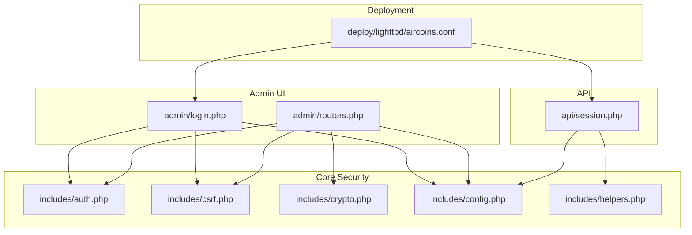
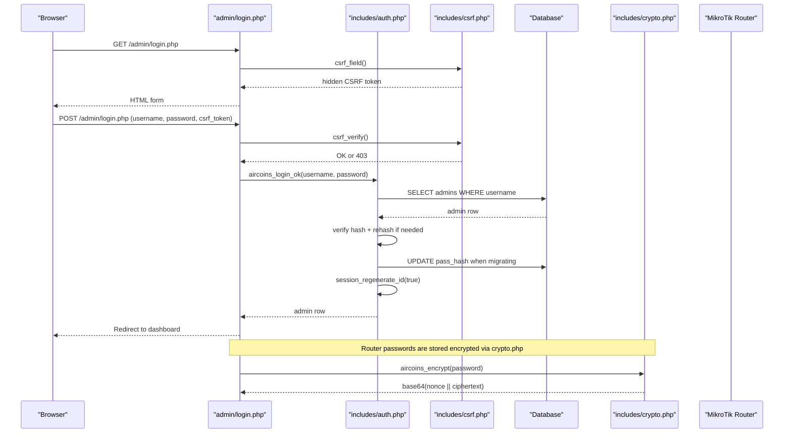
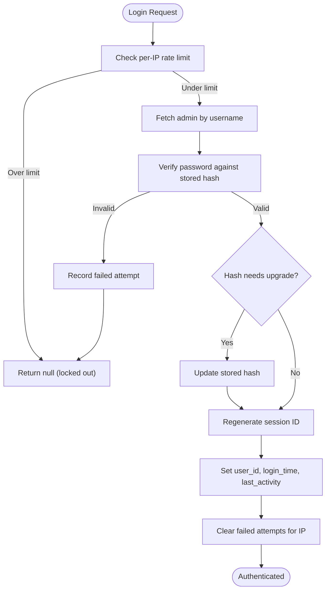
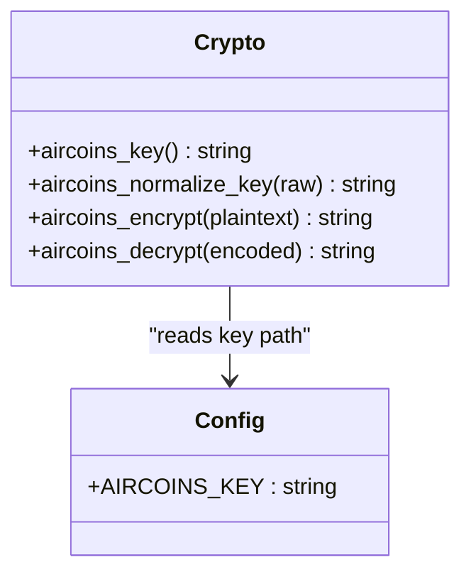
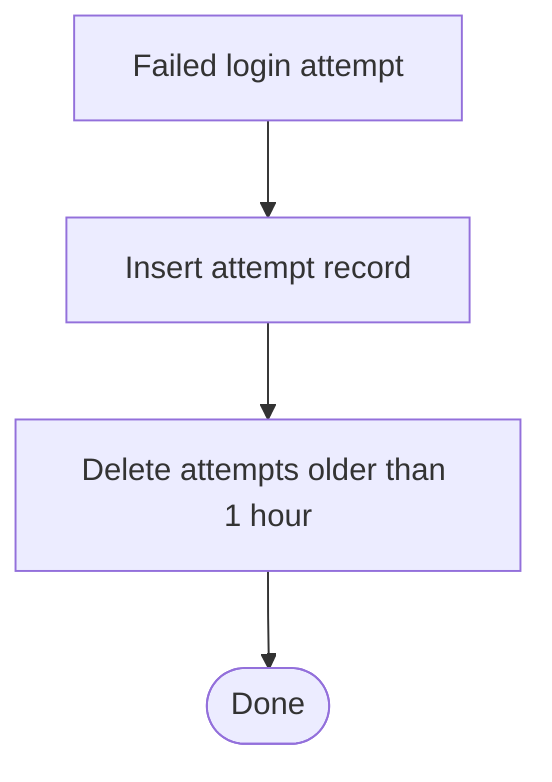
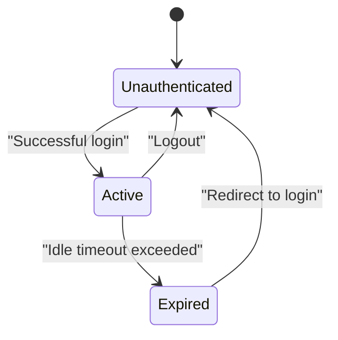
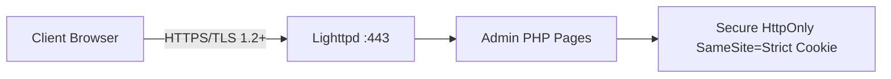
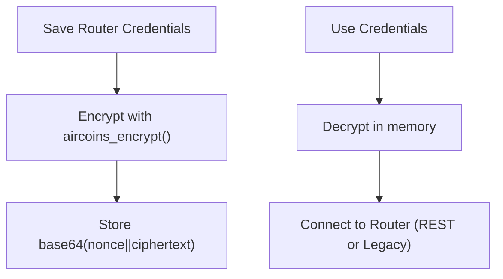
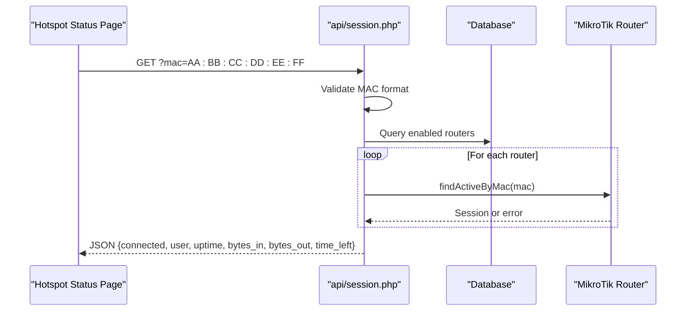
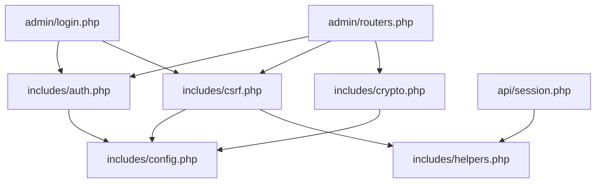

# Security Implementation

<cite>
**Referenced Files in This Document**
- [auth.php](file://includes/auth.php)
- [csrf.php](file://includes/csrf.php)
- [crypto.php](file://includes/crypto.php)
- [config.php](file://includes/config.php)
- [helpers.php](file://includes/helpers.php)
- [login.php](file://admin/login.php)
- [routers.php](file://admin/routers.php)
- [session.php](file://api/session.php)
- [aircoins.conf](file://deploy/lighttpd/aircoins.conf)
- [LegacyApiClient.php](file://includes/RouterOS/LegacyApiClient.php)
</cite>

## Table of Contents
1. [Introduction](#introduction)
2. [Project Structure](#project-structure)
3. [Core Components](#core-components)
4. [Architecture Overview](#architecture-overview)
5. [Detailed Component Analysis](#detailed-component-analysis)
6. [Dependency Analysis](#dependency-analysis)
7. [Performance Considerations](#performance-considerations)
8. [Troubleshooting Guide](#troubleshooting-guide)
9. [Conclusion](#conclusion)
10. [Appendices](#appendices)

## Introduction
This document explains the security mechanisms implemented by the MT-CONTROLLER-PISOWIFI system. It covers authentication, CSRF protection, cryptographic storage, rate limiting, session management, TLS configuration, and secure cookie handling. It also provides threat mitigation guidance, best practices, and recommendations for a security audit.

The system is a PHP-based administrative controller that:
- Authenticates administrators with hardened sessions.
- Protects state-changing requests with per-session CSRF tokens.
- Stores router credentials encrypted at rest using libsodium.
- Limits login attempts per client IP.
- Serves the admin panel over TLS with strict cipher settings.
- Exposes a read-only, unauthenticated portal API for live hotspot status.

## Project Structure
Security-relevant code is concentrated under `includes/` and used by admin pages and APIs:



**Diagram sources**
- [login.php:14-18](file://admin/login.php#L14-L18)
- [routers.php:17-21](file://admin/routers.php#L17-L21)
- [session.php:23-25](file://api/session.php#L23-L25)
- [auth.php:14-15](file://includes/auth.php#L14-L15)
- [csrf.php:12-14](file://includes/csrf.php#L12-L14)
- [crypto.php:15](file://includes/crypto.php#L15)
- [config.php:16-43](file://includes/config.php#L16-L43)
- [aircoins.conf:146-150](file://deploy/lighttpd/aircoins.conf#L146-L150)

**Section sources**
- [login.php:1-114](file://admin/login.php#L1-L114)
- [routers.php:1-455](file://admin/routers.php#L1-L455)
- [session.php:1-107](file://api/session.php#L1-L107)
- [auth.php:1-282](file://includes/auth.php#L1-L282)
- [csrf.php:1-68](file://includes/csrf.php#L1-L68)
- [crypto.php:1-138](file://includes/crypto.php#L1-L138)
- [config.php:1-44](file://includes/config.php#L1-L44)
- [aircoins.conf:128-154](file://deploy/lighttpd/aircoins.conf#L128-L154)

## Core Components
- Authentication and session hardening: password hashing, idle timeout, session regeneration, and audit logging.
- CSRF protection: per-session token generation, rendering, and timing-safe verification.
- Cryptography: libsodium secretbox encryption for router credentials.
- Rate limiting: per-IP failed-login tracking and temporary lockout.
- Secure deployment: TLS on port 443, modern protocols, and safe cookie flags.

**Section sources**
- [auth.php:17-57](file://includes/auth.php#L17-L57)
- [auth.php:65-83](file://includes/auth.php#L65-L83)
- [auth.php:103-138](file://includes/auth.php#L103-L138)
- [auth.php:151-190](file://includes/auth.php#L151-L190)
- [auth.php:202-246](file://includes/auth.php#L202-L246)
- [csrf.php:21-67](file://includes/csrf.php#L21-L67)
- [crypto.php:25-137](file://includes/crypto.php#L25-L137)
- [config.php:25-43](file://includes/config.php#L25-L43)
- [aircoins.conf:146-150](file://deploy/lighttpd/aircoins.conf#L146-L150)

## Architecture Overview
The security architecture combines layered protections:



**Diagram sources**
- [login.php:37-61](file://admin/login.php#L37-L61)
- [csrf.php:48-67](file://includes/csrf.php#L48-L67)
- [auth.php:151-190](file://includes/auth.php#L151-L190)
- [crypto.php:91-102](file://includes/crypto.php#L91-L102)

## Detailed Component Analysis

### Authentication System
- Password hashing prefers Argon2id; falls back to bcrypt when Argon2id is unavailable.
- Verification uses constant-time comparison through the standard library.
- Automatic hash upgrade occurs after successful verification if the stored hash is weaker than the current algorithm/cost.
- Sessions are started with hardened cookie parameters:
  - Path set to `/`.
  - `Secure` enabled when HTTPS is detected.
  - `HttpOnly` enabled.
  - `SameSite=Strict`.
- Session ID is regenerated after successful login to prevent fixation.
- Idle timeout enforces forced logout after inactivity.
- Audit logging records privileged actions with actor, action name, detail, IP, and timestamp.



**Diagram sources**
- [auth.php:103-138](file://includes/auth.php#L103-L138)
- [auth.php:151-190](file://includes/auth.php#L151-L190)

**Section sources**
- [auth.php:17-57](file://includes/auth.php#L17-L57)
- [auth.php:65-83](file://includes/auth.php#L65-L83)
- [auth.php:151-190](file://includes/auth.php#L151-L190)
- [auth.php:202-246](file://includes/auth.php#L202-L246)
- [auth.php:269-281](file://includes/auth.php#L269-L281)

### CSRF Protection
- A single random per-session token is generated using cryptographically secure random bytes.
- Forms include a hidden field containing the token.
- All POST endpoints call a verifier that:
  - Skips non-POST requests.
  - Starts the session if not active.
  - Compares the submitted token with the session token using a timing-safe function.
  - Returns HTTP 403 and terminates on mismatch.

```mermaid
flowchart TD
Entry(["Request"]) --> Method{"Is POST?"}
Method --> |No| Allow["Allow without CSRF check"]
Method --> |Yes| GetToken["Read posted csrf_token"]
GetToken --> EnsureSession["Ensure session is active"]
EnsureSession --> Compare{"Timing-safe equal?")
Compare --> |No| Deny["403 Forbidden"]
Compare --> |Yes| Proceed["Proceed to endpoint logic"]
```

**Diagram sources**
- [csrf.php:21-67](file://includes/csrf.php#L21-L67)

**Section sources**
- [csrf.php:1-68](file://includes/csrf.php#L1-L68)
- [login.php:37-61](file://admin/login.php#L37-L61)
- [routers.php:47-97](file://admin/routers.php#L47-L97)

### Cryptographic Functions (libsodium)
- Router credentials are never stored in plaintext.
- Encryption uses libsodium’s XSalsa20-Poly1305 secret box:
  - A 32-byte key is loaded from a protected file path configured outside the web root.
  - The key supports raw binary, 64-character hex, or base64 formats.
  - Each encryption produces a unique nonce; the payload is base64-encoded nonce plus ciphertext.
- Decryption validates structure and integrity; tampered data or wrong keys raise errors.
- Plaintext credentials exist only in memory during a request.



**Diagram sources**
- [crypto.php:25-137](file://includes/crypto.php#L25-L137)
- [config.php:20-23](file://includes/config.php#L20-L23)

**Section sources**
- [crypto.php:1-138](file://includes/crypto.php#L1-L138)
- [config.php:20-23](file://includes/config.php#L20-L23)
- [routers.php:173-213](file://admin/routers.php#L173-L213)

### Rate Limiting and Login Attempts
- Failed login attempts are recorded per client IP with timestamps.
- Rows older than one hour are pruned automatically.
- If the number of attempts within the configured window reaches the maximum, login is blocked until the window expires.
- Successful login clears the failure counter for that IP.



**Diagram sources**
- [auth.php:117-126](file://includes/auth.php#L117-L126)

**Section sources**
- [auth.php:96-138](file://includes/auth.php#L96-L138)
- [auth.php:151-190](file://includes/auth.php#L151-L190)
- [login.php:54-60](file://admin/login.php#L54-L60)
- [config.php:35-43](file://includes/config.php#L35-L43)

### Session Management
- Hardened session start sets cookie attributes based on TLS detection.
- Session ID is regenerated after successful authentication.
- Idle timeout forces logout and redirects to the login page.
- Logout destroys the session and clears the cookie.



**Diagram sources**
- [auth.php:65-83](file://includes/auth.php#L65-L83)
- [auth.php:176-189](file://includes/auth.php#L176-L189)
- [auth.php:202-246](file://includes/auth.php#L202-L246)

**Section sources**
- [auth.php:65-83](file://includes/auth.php#L65-L83)
- [auth.php:176-189](file://includes/auth.php#L176-L189)
- [auth.php:202-246](file://includes/auth.php#L202-L246)

### TLS Configuration and Certificate Handling
- The admin panel is served over TLS on port 443.
- Only TLS 1.2 and TLS 1.3 are enabled.
- The certificate PEM file path is configured in the server configuration.
- The application marks cookies `Secure` when HTTPS is detected.



**Diagram sources**
- [aircoins.conf:146-150](file://deploy/lighttpd/aircoins.conf#L146-L150)
- [auth.php:71-80](file://includes/auth.php#L71-L80)

**Section sources**
- [aircoins.conf:146-150](file://deploy/lighttpd/aircoins.conf#L146-L150)
- [auth.php:71-80](file://includes/auth.php#L71-L80)

### Secure Router Credential Storage and Transport
- Router passwords are encrypted at rest using libsodium before being stored in the database.
- When editing an existing router, leaving the password blank preserves the stored secret.
- Router connections may use:
  - REST API over HTTPS (port 443).
  - Legacy binary API over TCP (port 8728) or TLS (port 8729).
- The legacy client selects SSL transport based on port and can be configured to verify TLS certificates.



**Diagram sources**
- [routers.php:173-213](file://admin/routers.php#L173-L213)
- [crypto.php:91-137](file://includes/crypto.php#L91-L137)
- [LegacyApiClient.php:70-77](file://includes/RouterOS/LegacyApiClient.php#L70-L77)

**Section sources**
- [routers.php:143-223](file://admin/routers.php#L143-L223)
- [crypto.php:91-137](file://includes/crypto.php#L91-L137)
- [LegacyApiClient.php:70-77](file://includes/RouterOS/LegacyApiClient.php#L70-L77)

### Portal-Facing Session Lookup API
- The endpoint returns whether a given MAC address has an active hotspot session.
- It is intentionally unauthenticated but strictly read-only.
- Input validation ensures the MAC is exactly 12 hexadecimal digits (with optional separators).
- Errors return structured JSON without stack traces.
- CORS is allowed for this endpoint only, with no caching headers.



**Diagram sources**
- [session.php:50-106](file://api/session.php#L50-L106)

**Section sources**
- [session.php:1-107](file://api/session.php#L1-L107)

## Dependency Analysis
Security components depend on shared configuration and helpers:



**Diagram sources**
- [auth.php:14-15](file://includes/auth.php#L14-L15)
- [csrf.php:12-14](file://includes/csrf.php#L12-L14)
- [crypto.php:15](file://includes/crypto.php#L15)
- [login.php:14-18](file://admin/login.php#L14-L18)
- [routers.php:17-21](file://admin/routers.php#L17-L21)
- [session.php:23-25](file://api/session.php#L23-L25)

**Section sources**
- [auth.php:14-15](file://includes/auth.php#L14-L15)
- [csrf.php:12-14](file://includes/csrf.php#L12-L14)
- [crypto.php:15](file://includes/crypto.php#L15)
- [login.php:14-18](file://admin/login.php#L14-L18)
- [routers.php:17-21](file://admin/routers.php#L17-L21)
- [session.php:23-25](file://api/session.php#L23-L25)

## Performance Considerations
- Argon2id is preferred for password hashing; bcrypt fallback avoids runtime failures on systems without Argon2id support.
- Database queries for rate limiting and user lookup use prepared statements and LIMIT clauses to reduce overhead.
- CSRF token generation uses efficient secure random bytes and is cached per session.
- Router credential decryption occurs only in memory and only when required by a request.
- The portal session lookup iterates enabled routers and stops at the first match, minimizing unnecessary network calls.

[No sources needed since this section provides general guidance]

## Troubleshooting Guide
Common issues and mitigations:

- **CSRF validation failed**:
  - Cause: Missing or mismatched CSRF token on POST.
  - Resolution: Ensure forms include the CSRF field and that the session is available.
  - Evidence: Verifier returns HTTP 403 on mismatch.

- **Too many failed attempts**:
  - Cause: Per-IP rate limit reached within the configured window.
  - Resolution: Wait for the window to expire; investigate potential brute-force activity.
  - Evidence: Login page displays a lockout message.

- **Session expired**:
  - Cause: Idle timeout exceeded.
  - Resolution: Re-authenticate; ensure clients do not hold stale session cookies.
  - Evidence: Redirect to login with a timeout indicator.

- **Sodium extension missing**:
  - Cause: libsodium functions not available.
  - Resolution: Install and enable the sodium PHP extension.
  - Evidence: Exceptions thrown when loading or using crypto functions.

- **Key file missing or unreadable**:
  - Cause: Key file path incorrect or permissions insufficient.
  - Resolution: Place the 32-byte key at the configured path with appropriate access controls.
  - Evidence: Exceptions raised when reading or normalizing the key.

- **Invalid MAC in portal API**:
  - Cause: MAC parameter missing or malformed.
  - Resolution: Provide a valid 12-digit hexadecimal MAC address.
  - Evidence: Endpoint returns a JSON error response.

**Section sources**
- [csrf.php:48-67](file://includes/csrf.php#L48-L67)
- [login.php:54-60](file://admin/login.php#L54-L60)
- [auth.php:202-246](file://includes/auth.php#L202-L246)
- [crypto.php:32-47](file://includes/crypto.php#L32-L47)
- [crypto.php:111-137](file://includes/crypto.php#L111-L137)
- [session.php:50-56](file://api/session.php#L50-L56)

## Conclusion
The MT-CONTROLLER-PISOWIFI system implements a comprehensive security model:
- Strong password hashing with automatic upgrades.
- Robust CSRF protection using per-session tokens and timing-safe comparisons.
- Encrypted storage of router credentials using libsodium.
- Rate limiting to mitigate brute-force attacks.
- Hardened session management with secure cookie flags and idle timeouts.
- TLS enforcement for the admin interface with modern protocol settings.
- Carefully scoped exposure of a read-only portal API.

These controls collectively defend against common threats such as credential theft, cross-site request forgery, session fixation, brute-force login attempts, and unauthorized access to sensitive configuration data.

[No sources needed since this section summarizes without analyzing specific files]

## Appendices

### Security Best Practices
- Keep the libsodium key file outside the web root and restrict filesystem permissions.
- Prefer TLS 1.2/1.3 and disable older protocols across all services.
- Enable `Secure`, `HttpOnly`, and `SameSite=Strict` for admin cookies.
- Regularly rotate router credentials and review audit logs.
- Monitor rate-limit counters and consider integrating with intrusion prevention systems.
- Restrict the portal API to trusted networks where possible.

[No sources needed since this section provides general guidance]

### Threat Mitigation Strategies
- Brute-force login attempts: mitigated by per-IP rate limiting and clear lockout messaging.
- CSRF attacks: mitigated by per-session tokens and strict verification on all state-changing POSTs.
- Credential leakage: mitigated by encrypting router passwords at rest and avoiding plaintext output.
- Session hijacking: mitigated by regenerating session IDs and enforcing secure cookie attributes.
- Man-in-the-middle: mitigated by TLS enforcement and modern cipher suites.

[No sources needed since this section provides general guidance]

### Security Audit Recommendations
- Verify that the libsodium extension is installed and enabled.
- Confirm that the key file exists, is readable only by the web service user, and contains exactly 32 bytes.
- Validate that the admin panel is only reachable over HTTPS and that HTTP traffic is redirected or rejected.
- Review database schema and indexes for `login_attempts` and `audit_log`.
- Test CSRF protection by submitting POST requests without tokens.
- Inspect cookie headers to confirm `Secure`, `HttpOnly`, and `SameSite=Strict`.
- Assess the portal API’s exposure and consider restricting it to internal networks.

[No sources needed since this section provides general guidance]