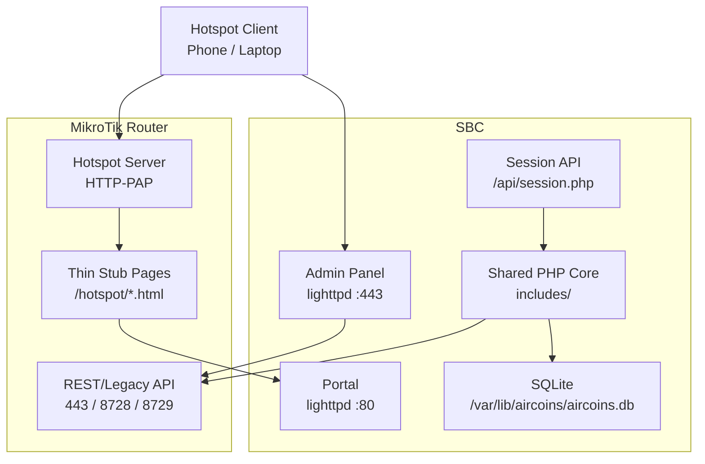
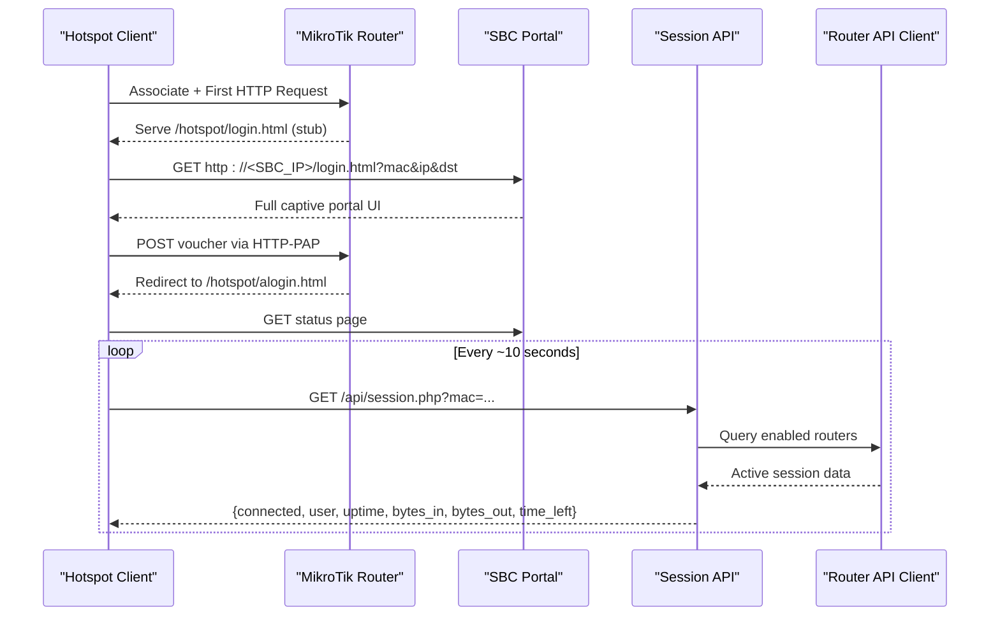
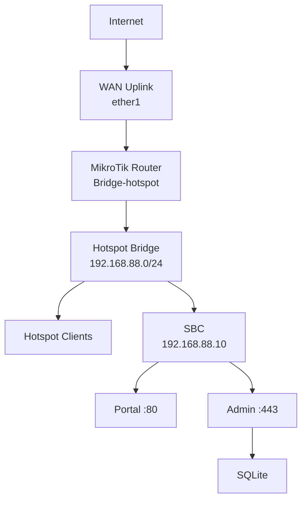
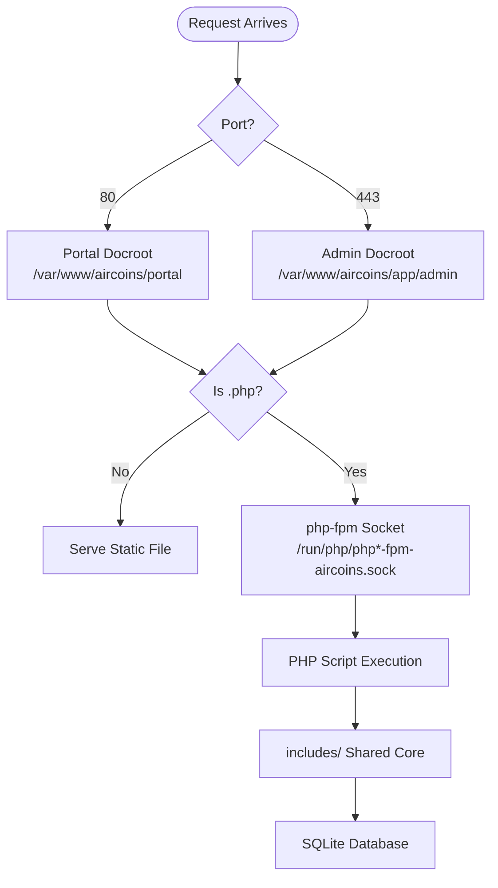
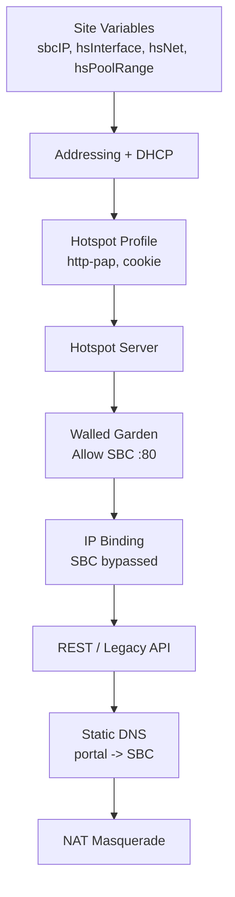
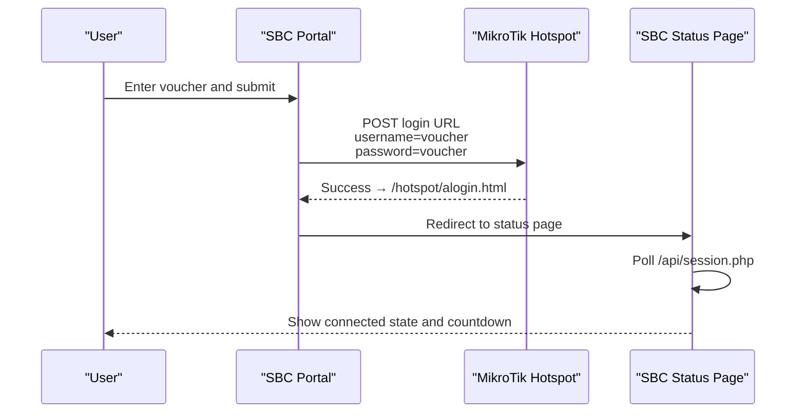
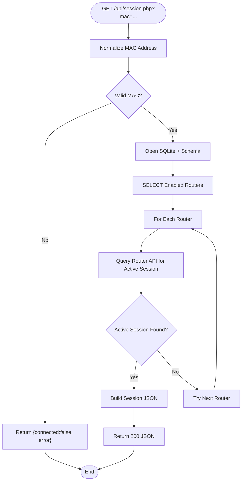
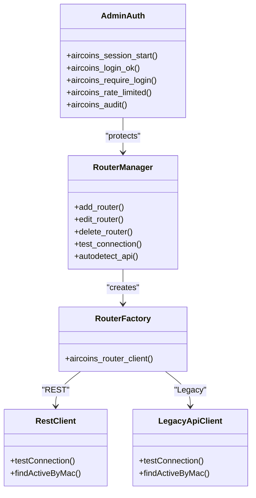
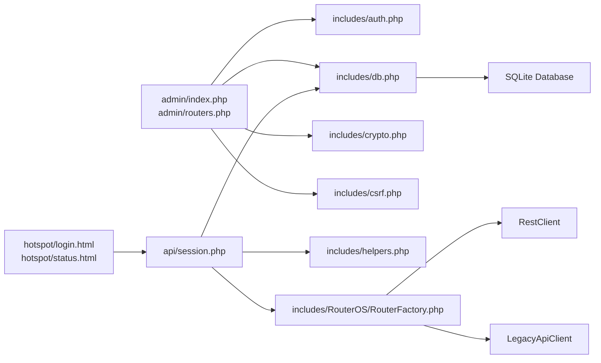

# Architecture Overview

<cite>
**Referenced Files in This Document**   
- [DEPLOYMENT.md](file://DEPLOYMENT.md)
- [hotspot-external-portal.rsc](file://deploy/mikrotik/hotspot-external-portal.rsc)
- [aircoins.conf](file://deploy/lighttpd/aircoins.conf)
- [config.php](file://includes/config.php)
- [db.php](file://includes/db.php)
- [auth.php](file://includes/auth.php)
- [session.php](file://api/session.php)
- [RouterFactory.php](file://includes/RouterOS/RouterFactory.php)
- [index.php](file://admin/index.php)
- [routers.php](file://admin/routers.php)
- [login.html](file://hotspot/login.html)
- [status.html](file://hotspot/status.html)
</cite>

## Table of Contents
1. [Introduction](#introduction)
2. [Project Structure](#project-structure)
3. [Core Components](#core-components)
4. [Architecture Overview](#architecture-overview)
5. [Detailed Component Analysis](#detailed-component-analysis)
6. [Dependency Analysis](#dependency-analysis)
7. [Performance Considerations](#performance-considerations)
8. [Troubleshooting Guide](#troubleshooting-guide)
9. [Conclusion](#conclusion)

## Introduction
MT-CONTROLLER-PISOWIFI is a lightweight MikroTik hotspot controller designed for single-board computers such as Orange Pi and Raspberry Pi. It uses a dual-host architecture: the MikroTik router provides hotspot interception, DHCP, NAT, and session enforcement, while an SBC hosts the customer-facing captive portal, admin panel, and session lookup API. The system avoids frameworks and Composer, relying on plain PHP 8, lighttpd, php-fpm, and SQLite to keep RAM, flash wear, and deployment complexity low.

The design goal is a public WiFi hotspot stack that fits on constrained hardware, supports voucher-based access via HTTP-PAP, and exposes a secure admin interface over TLS for managing routers, users, vouchers, and live sessions.

## Project Structure
At a high level, the repository separates four concerns:

| Area | Purpose | Key Paths |
|---|---|---|
| Hotspot client portal | Pure HTML + JS captive portal served from the SBC | `hotspot/` |
| Router stubs | Thin MikroTik pages that redirect to the SBC | `router-stubs/` |
| Admin panel | Authenticated PHP UI for routers, hotspot users, vouchers, and monitoring | `admin/`, `includes/` |
| Session API | Unauthenticated JSON endpoint returning per-MAC session status | `api/session.php` |
| Deployment | lighttpd site config, php-fpm pool, RouterOS script, install/update scripts | `deploy/` |

**Diagram sources**   
- [aircoins.conf:49-156](file://deploy/lighttpd/aircoins.conf#L49-L156)
- [hotspot-external-portal.rsc:122-211](file://deploy/mikrotik/hotspot-external-portal.rsc#L122-L211)
- [session.php:23-30](file://api/session.php#L23-L30)
- [db.php:58-116](file://includes/db.php#L58-L116)

**Section sources**   
- [DEPLOYMENT.md:10-28](file://DEPLOYMENT.md#L10-L28)
- [DEPLOYMENT.md:508-557](file://DEPLOYMENT.md#L508-L557)

## Core Components
The system is composed of six primary runtime components:

| Component | Host | Role | Technology |
|---|---|---|---|
| Hotspot client devices | External | Connect to SSID, get redirected, submit vouchers | Browser |
| MikroTik hotspot server | Router | Intercepts HTTP, serves stubs, authenticates via HTTP-PAP, enforces sessions | RouterOS v6/v7 |
| Captive portal | SBC | Customer login, branding, voucher entry, status display | Static HTML + JS |
| Session API | SBC | Returns whether a MAC has an active session | PHP 8 + SQLite + Router API clients |
| Admin panel | SBC | Manage routers, users, vouchers, monitor traffic | PHP 8 + lighttpd + php-fpm |
| Persistence layer | SBC | Stores admins, routers, audit log, login attempts, monitor samples | SQLite with WAL |

Key technology decisions:

- **No framework, no Composer:** All PHP files are self-contained and require shared helpers directly.
- **Lightweight web stack:** lighttpd serves static portal assets and forwards `.php` requests to a dedicated php-fpm socket.
- **PHP 8:** Uses strict types, native PDO prepares, Argon2id password hashing, and libsodium encryption.
- **SQLite:** Single-file database with WAL mode, foreign keys enabled, and minimal overhead.
- **Dual API support:** REST (RouterOS v7, HTTPS, JSON) and Legacy binary API (v6/v7, ports 8728/8729).

**Section sources**   
- [config.php:1-11](file://includes/config.php#L1-L11)
- [db.php:1-8](file://includes/db.php#L1-L8)
- [DEPLOYMENT.md:20-28](file://DEPLOYMENT.md#L20-L28)

## Architecture Overview
The hotspot flow is intentionally split between network control and presentation:

1. A client associates with the hotspot SSID and receives a DHCP lease from the router.
2. Any first HTTP request is intercepted by the hotspot; the router serves its thin `login.html` stub.
3. The stub redirects the browser to the SBC portal URL, passing client context such as MAC, IP, destination, login/logout URLs, username, and error.
4. The SBC serves the full portal UI. In external mode, JavaScript bridges RouterOS template tokens into the DOM and sets the form action to the router’s login URL.
5. The user submits a voucher. The portal performs a real HTTP form POST using HTTP-PAP to the router.
6. On success, the router serves `/hotspot/alogin.html`, which redirects back to the SBC status page.
7. The status page polls `/api/session.php?mac=...` every ~10 seconds. That endpoint queries enabled routers through their configured API and returns connection state, uptime, bytes, and time left.
8. The admin panel connects over the router’s REST or Legacy API to manage hotspot users, generate vouchers, list active sessions, and kick clients.

**Diagram sources**   
- [hotspot-external-portal.rsc:20-26](file://deploy/mikrotik/hotspot-external-portal.rsc#L20-L26)
- [DEPLOYMENT.md:174-184](file://DEPLOYMENT.md#L174-L184)
- [session.php:58-106](file://api/session.php#L58-L106)
- [login.html:365-379](file://hotspot/login.html#L365-L379)
- [status.html:461-558](file://hotspot/status.html#L461-L558)

## Detailed Component Analysis

### Dual-Host System Context
The system context consists of three main zones:

| Zone | Boundary | Responsibilities |
|---|---|---|
| Client zone | Public wireless LAN | End-user devices connecting to the hotspot SSID |
| Hotspot zone | MikroTik bridge carrying clients and the SBC | DHCP, hotspot interception, walled garden, NAT, session enforcement |
| Controller zone | SBC running lighttpd, php-fpm, SQLite | Portal, admin panel, session API, router management |

**Diagram sources**   
- [DEPLOYMENT.md:74-90](file://DEPLOYMENT.md#L74-L90)
- [DEPLOYMENT.md:199-209](file://DEPLOYMENT.md#L199-L209)
- [hotspot-external-portal.rsc:98-119](file://deploy/mikrotik/hotspot-external-portal.rsc#L98-L119)

**Section sources**   
- [DEPLOYMENT.md:32-70](file://DEPLOYMENT.md#L32-L70)
- [hotspot-external-portal.rsc:62-119](file://deploy/mikrotik/hotspot-external-portal.rsc#L62-L119)

### Web Stack on the SBC
The SBC runs a minimal web stack:

- **lighttpd** listens on port 80 for the portal and port 443 for the admin panel.
- **php-fpm** runs a dedicated `ondemand` pool with a small worker count to minimize idle memory usage.
- **Static portal assets** are served directly by lighttpd.
- **PHP endpoints** are forwarded via FastCGI to the aircoins php-fpm socket.
- **The `/api/` alias** maps `/api/session.php` to a directory outside the portal docroot, allowing the status page to poll session data without exposing the admin codebase.

**Diagram sources**   
- [aircoins.conf:49-110](file://deploy/lighttpd/aircoins.conf#L49-L110)
- [aircoins.conf:128-156](file://deploy/lighttpd/aircoins.conf#L128-L156)
- [DEPLOYMENT.md:288-294](file://DEPLOYMENT.md#L288-L294)

**Section sources**   
- [aircoins.conf:30-110](file://deploy/lighttpd/aircoins.conf#L30-L110)
- [aircoins.conf:112-156](file://deploy/lighttpd/aircoins.conf#L112-L156)
- [DEPLOYMENT.md:288-294](file://DEPLOYMENT.md#L288-L294)

### MikroTik Hotspot Configuration
The RouterOS script configures the hotspot environment required for an external portal:

- Sets device-mode for RouterOS v7.
- Configures gateway address, DHCP pool, and DHCP server.
- Creates a hotspot profile using `http-pap,cookie`.
- Enables the hotspot server on the bridge interface.
- Adds a walled-garden rule allowing unauthenticated clients to reach the SBC on port 80.
- Exempts the SBC IP from hotspot interception via IP binding.
- Enables REST and/or Legacy API services.
- Adds static DNS pointing the portal hostname to the SBC.
- Configures NAT for authenticated internet access.

**Diagram sources**   
- [hotspot-external-portal.rsc:62-82](file://deploy/mikrotik/hotspot-external-portal.rsc#L62-L82)
- [hotspot-external-portal.rsc:98-211](file://deploy/mikrotik/hotspot-external-portal.rsc#L98-L211)

**Section sources**   
- [hotspot-external-portal.rsc:1-59](file://deploy/mikrotik/hotspot-external-portal.rsc#L1-L59)
- [hotspot-external-portal.rsc:62-211](file://deploy/mikrotik/hotspot-external-portal.rsc#L62-L211)

### Voucher Authentication Flow
The voucher submission path deliberately uses HTTP-PAP because CHAP requires a per-request challenge generated by the router, which is impractical for an external captive portal. The portal posts the voucher as both username and password in plaintext over the isolated hotspot LAN.

**Diagram sources**   
- [login.html:365-379](file://hotspot/login.html#L365-L379)
- [hotspot-external-portal.rsc:122-137](file://deploy/mikrotik/hotspot-external-portal.rsc#L122-L137)
- [DEPLOYMENT.md:174-184](file://DEPLOYMENT.md#L174-L184)

**Section sources**   
- [login.html:349-429](file://hotspot/login.html#L349-L429)
- [hotspot-external-portal.rsc:122-137](file://deploy/mikrotik/hotspot-external-portal.rsc#L122-L137)
- [DEPLOYMENT.md:386-389](file://DEPLOYMENT.md#L386-L389)

### Session Validation Endpoint
The portal-facing session endpoint is intentionally unauthenticated and read-only. It accepts a normalized MAC address, iterates enabled routers, asks each router whether the MAC has an active session, and returns a consistent JSON shape.

**Diagram sources**   
- [session.php:33-106](file://api/session.php#L33-L106)
- [db.php:58-82](file://includes/db.php#L58-L82)
- [RouterFactory.php:29-55](file://includes/RouterOS/RouterFactory.php#L29-L55)

**Section sources**   
- [session.php:1-106](file://api/session.php#L1-L106)
- [db.php:58-82](file://includes/db.php#L58-L82)
- [RouterFactory.php:1-55](file://includes/RouterOS/RouterFactory.php#L1-L55)

### Admin Panel and Router Management
The admin panel is protected by authentication, rate limiting, CSRF protection, and audit logging. It manages routers through either REST or Legacy API, supports auto-detection of API type, encrypts router passwords at rest, and records administrative actions.

**Diagram sources**   
- [auth.php:17-281](file://includes/auth.php#L17-L281)
- [routers.php:47-223](file://admin/routers.php#L47-L223)
- [RouterFactory.php:29-55](file://includes/RouterOS/RouterFactory.php#L29-L55)

**Section sources**   
- [auth.php:1-281](file://includes/auth.php#L1-L281)
- [routers.php:1-223](file://admin/routers.php#L1-L223)
- [index.php:1-38](file://admin/index.php#L1-L38)

### Security Boundaries
Security boundaries are important because the system mixes unauthenticated client traffic with sensitive administrative operations:

| Boundary | Protection | Notes |
|---|---|---|
| Admin login | Argon2id/bcrypt hash, rate limiting, session regeneration, idle timeout | Brute-force resistance and session hardening |
| Admin panel | TLS on port 443, CSRF tokens, least-privilege www-data | Self-signed certificate is expected on isolated deployments |
| Router credentials | libsodium encrypted at rest | Decrypted only in memory during API calls |
| Portal session API | Read-only, non-sensitive MAC lookup, CORS opened only for this endpoint | Not a security boundary for authentication |
| Hotspot LAN | HTTP-PAP plaintext voucher | Intended only on isolated hotspot networks |
| Network exposure | Only 80 and 443 should be reachable by clients | Router API ports should be restricted to the SBC |

**Section sources**   
- [auth.php:17-281](file://includes/auth.php#L17-L281)
- [db.php:58-116](file://includes/db.php#L58-L116)
- [DEPLOYMENT.md:561-571](file://DEPLOYMENT.md#L561-L571)

## Dependency Analysis
The PHP application follows a layered dependency model:

**Diagram sources**   
- [session.php:23-25](file://api/session.php#L23-L25)
- [index.php:14-17](file://admin/index.php#L14-L17)
- [routers.php:17-21](file://admin/routers.php#L17-L21)
- [RouterFactory.php:12-15](file://includes/RouterOS/RouterFactory.php#L12-L15)
- [db.php:12-47](file://includes/db.php#L12-L47)

**Section sources**   
- [session.php:23-25](file://api/session.php#L23-L25)
- [index.php:14-17](file://admin/index.php#L14-L17)
- [routers.php:17-21](file://admin/routers.php#L17-L21)
- [RouterFactory.php:12-15](file://includes/RouterOS/RouterFactory.php#L12-L15)

## Performance Considerations
The architecture is optimized for resource-constrained environments:

- **lighttpd** uses a small event handler, limited connections, and a single worker where appropriate.
- **php-fpm** runs an `ondemand` pool with a small maximum child count, minimizing idle memory usage.
- **Access logging is disabled** to reduce SD-card write wear on SBCs.
- **SQLite** uses WAL mode, synchronous NORMAL, and foreign key enforcement for durability without heavy overhead.
- **No framework or Composer** removes build steps, autoloader overhead, and unnecessary dependencies.
- **Router API clients** use timeouts and graceful failure handling so unreachable routers do not block the entire session lookup.

These choices make the system suitable for Orange Pi Zero, Raspberry Pi 3/4, and similar boards running Armbian, Debian bookworm, or Ubuntu 24.04.

**Section sources**   
- [aircoins.conf:43-60](file://deploy/lighttpd/aircoins.conf#L43-L60)
- [DEPLOYMENT.md:288-294](file://DEPLOYMENT.md#L288-L294)
- [db.php:36-47](file://includes/db.php#L36-L47)
- [DEPLOYMENT.md:20-28](file://DEPLOYMENT.md#L20-L28)

## Troubleshooting Guide
Common operational issues and their architectural causes:

| Symptom | Likely Cause | Resolution |
|---|---|---|
| Client does not redirect to SBC | Missing or incorrect walled-garden rule | Ensure SBC IP and port 80 are allowed before authentication |
| SBC gets redirected by hotspot | Missing IP binding for SBC | Add `type=bypassed` for the SBC IP |
| Portal loads but voucher fails | HTTP-PAP misconfiguration or wrong login URL | Verify hotspot profile uses `http-pap,cookie` and portal form action points to router login URL |
| Admin cannot connect to router | Wrong API type, port, or service disabled | Use auto-detect or enable `www-ssl` (REST) or `api`/`api-ssl` (Legacy) |
| Session API returns disconnected | No enabled router, wrong MAC, or API unreachable | Check admin router configuration and test connection |
| High SD-card wear | Access logging or excessive writes | Keep access logs disabled; use endurance storage or log rotation |
| Admin login locked out | Rate limit exceeded | Wait for the rate-limit window or clear failed attempts |

**Section sources**   
- [hotspot-external-portal.rsc:147-171](file://deploy/mikrotik/hotspot-external-portal.rsc#L147-L171)
- [DEPLOYMENT.md:473-505](file://DEPLOYMENT.md#L473-L505)
- [auth.php:96-138](file://includes/auth.php#L96-L138)
- [session.php:50-83](file://api/session.php#L50-L83)

## Conclusion
MT-CONTROLLER-PISOWIFI implements a clean separation of concerns for public WiFi hotspots: the MikroTik router handles networking, interception, and session enforcement, while the SBC hosts the user experience, administration, and lightweight backend. By avoiding frameworks and Composer, using plain PHP 8, lighttpd, php-fpm, and SQLite, the system remains deployable and maintainable on constrained single-board computers. The dual-host design, HTTP-PAP voucher flow, and optional REST/Legacy router API integration provide a practical foundation for voucher-based hotspot deployments in resource-limited environments.