# Component Interactions

<cite>
**Referenced Files in This Document**   
- [DEPLOYMENT.md](file://DEPLOYMENT.md)
- [hotspot/login.html](file://hotspot/login.html)
- [hotspot/status.html](file://hotspot/status.html)
- [router-stubs/login.html](file://router-stubs/login.html)
- [router-stubs/alogin.html](file://router-stubs/alogin.html)
- [hotspot/js/varbridge.js](file://hotspot/js/varbridge.js)
- [api/session.php](file://api/session.php)
- [admin/api/monitor.php](file://admin/api/monitor.php)
- [admin/routers.php](file://admin/routers.php)
- [includes/RouterOS/RouterClientInterface.php](file://includes/RouterOS/RouterClientInterface.php)
- [includes/RouterOS/RestClient.php](file://includes/RouterOS/RestClient.php)
- [includes/RouterOS/LegacyApiClient.php](file://includes/RouterOS/LegacyApiClient.php)
</cite>

## Table of Contents
1. [Introduction](#introduction)
2. [Project Structure](#project-structure)
3. [Core Components](#core-components)
4. [Architecture Overview](#architecture-overview)
5. [Detailed Component Analysis](#detailed-component-analysis)
6. [Dependency Analysis](#dependency-analysis)
7. [Performance Considerations](#performance-considerations)
8. [Troubleshooting Guide](#troubleshooting-guide)
9. [Conclusion](#conclusion)

## Introduction
This document explains how the MT-CONTROLLER-PISOWIFI system coordinates a MikroTik hotspot, a single-board computer (SBC) running lighttpd and PHP, and an operator browser. It covers:

- Captive portal flow: client associates, gets DHCP, HTTP is intercepted, router serves a thin stub, meta-refresh redirects to the SBC portal, user submits a voucher via HTTP-PAP, router authenticates and redirects to the status page.
- Real-time monitoring flow: the status page polls `/api/session.php`, which queries enabled routers through REST or Legacy API.
- Admin panel communication flow: the admin UI talks to routers over REST or Legacy API to manage users, vouchers, sessions, and monitor live traffic.

The design keeps heavy HTML on the SBC and only four thin redirect stubs on the router. The SBC acts as both captive portal host and controller for one or more routers.

**Section sources**
- [DEPLOYMENT.md:10-70](file://DEPLOYMENT.md#L10-L70)

## Project Structure
At runtime the system has three main layers:

| Layer | Host | Role |
|---|---|---|
| Hotspot client | Phone / laptop | Associates with the SSID, receives DHCP, loads the portal. |
| SBC | Lighttpd :80 (portal + session API), lighttpd :443 (admin) | Serves `hotspot/` pages, runs `/api/session.php`, hosts the admin panel under `admin/`. |
| MikroTik router | RouterOS v6/v7 | Runs hotspot, intercepts HTTP, serves stubs, authenticates PAP, exposes REST/Legacy API. |

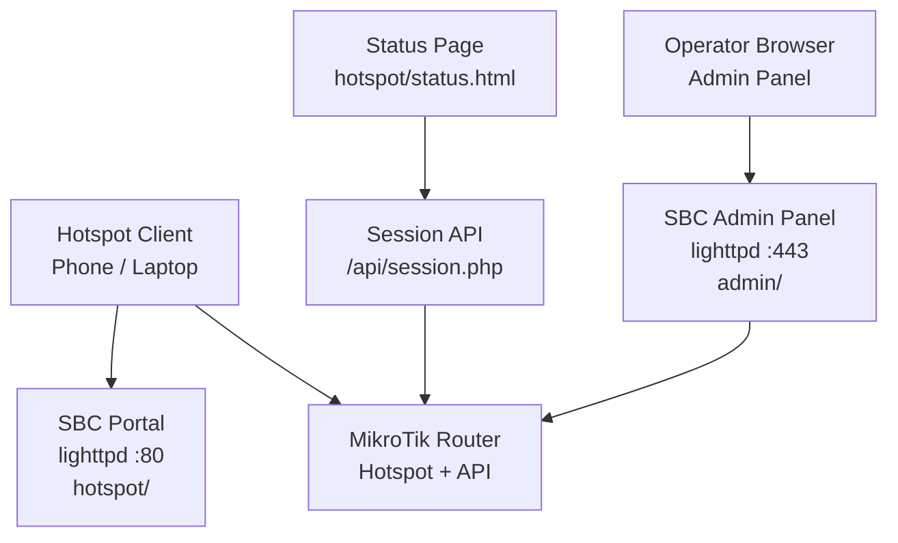

**Diagram sources**
- [DEPLOYMENT.md:34-70](file://DEPLOYMENT.md#L34-L70)

**Section sources**
- [DEPLOYMENT.md:34-70](file://DEPLOYMENT.md#L34-L70)

## Core Components
The system is built around these key components:

| Component | File(s) | Responsibility |
|---|---|---|
| Router-side login stub | `router-stubs/login.html` | Redirects unauthenticated clients to the SBC portal with MAC/IP/login/logout parameters. |
| Router-side post-login stub | `router-stubs/alogin.html` | Redirects after successful authentication to the SBC status page. |
| SBC login portal | `hotspot/login.html` | Voucher entry form; in external mode posts voucher back to the router using HTTP-PAP. |
| SBC status portal | `hotspot/status.html` | Shows session state; in external mode polls `/api/session.php` every 10 seconds. |
| Dual-mode bridge | `hotspot/js/varbridge.js` | Detects whether the same HTML is served by the router or the SBC and patches literal tokens into the DOM. |
| Session lookup API | `api/session.php` | Unauthenticated JSON endpoint returning whether a MAC has an active session. |
| Monitor feed API | `admin/api/monitor.php` | Authenticated JSON endpoint used by the admin dashboard to poll router health and traffic rates. |
| Router management UI | `admin/routers.php` | Add/edit/delete routers, test connections, auto-detect REST vs Legacy API. |
| Unified router client contract | `includes/RouterOS/RouterClientInterface.php` | Defines methods shared by REST and Legacy implementations. |
| REST client | `includes/RouterOS/RestClient.php` | Talks to RouterOS v7 REST API over HTTPS Basic auth and JSON. |
| Legacy client | `includes/RouterOS/LegacyApiClient.php` | Talks to RouterOS v6/v7 binary API over TCP 8728 or TLS 8729. |

**Section sources**
- [DEPLOYMENT.md:508-557](file://DEPLOYMENT.md#L508-L557)
- [includes/RouterOS/RouterClientInterface.php:1-27](file://includes/RouterOS/RouterClientInterface.php#L1-L27)

## Architecture Overview
The end-to-end interaction spans six phases:

1. **Association and DHCP:** The client joins the hotspot interface and receives an IP from the router’s DHCP pool.
2. **HTTP interception:** Any first HTTP request is intercepted by the hotspot.
3. **Stub redirect:** The router serves `router-stubs/login.html`, which meta-refreshes to the SBC portal URL carrying client parameters.
4. **Portal load:** The SBC serves `hotspot/login.html`; `varbridge.js` detects external mode and replaces literal `$(...)` tokens with query parameters.
5. **Voucher submission:** The portal submits the voucher as username/password over HTTP-PAP to the router’s login URL. On success, the router serves `router-stubs/alogin.html`, which redirects to the SBC status page.
6. **Live status polling:** The status page calls `/api/session.php?mac=...`; that endpoint queries enabled routers through the unified router client interface.

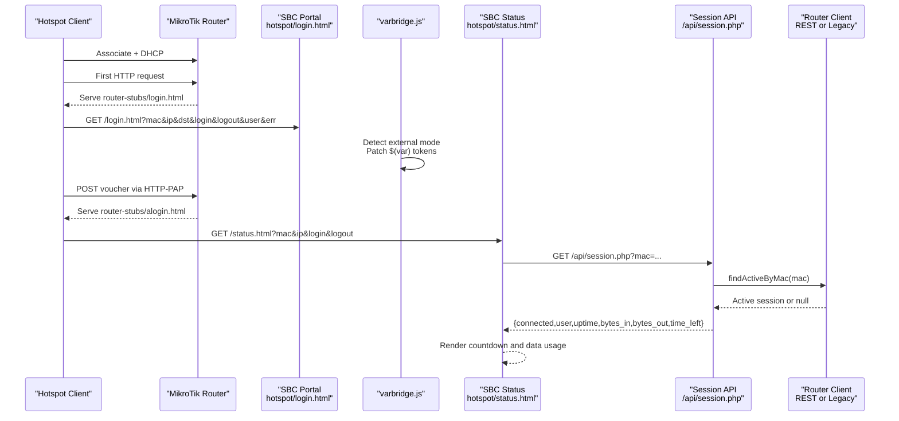

**Diagram sources**
- [DEPLOYMENT.md:174-183](file://DEPLOYMENT.md#L174-L183)
- [router-stubs/login.html:1-33](file://router-stubs/login.html#L1-L33)
- [router-stubs/alogin.html:1-50](file://router-stubs/alogin.html#L1-L50)
- [hotspot/js/varbridge.js:16-100](file://hotspot/js/varbridge.js#L16-L100)
- [hotspot/status.html:461-558](file://hotspot/status.html#L461-L558)
- [api/session.php:58-106](file://api/session.php#L58-L106)

**Section sources**
- [DEPLOYMENT.md:174-183](file://DEPLOYMENT.md#L174-L183)

## Detailed Component Analysis

### Captive Portal Flow
The captive portal flow is intentionally split between router-side stubs and SBC-side HTML.

#### Router-Side Stubs
- `router-stubs/login.html` contains a meta-refresh and JavaScript fallback that navigate to the SBC portal URL. All `$(mac-esc)`, `$(ip-esc)`, `$(link-orig-esc)`, `$(link-login-only-esc)`, `$(link-logout-esc)`, `$(username-esc)`, and `$(error-esc)` values are substituted by RouterOS before the browser sees them.
- `router-stubs/alogin.html` is the post-authentication page. It redirects to `$(link-redirect)`, which normally points to the SBC status page because the portal sets the `dst` parameter accordingly.

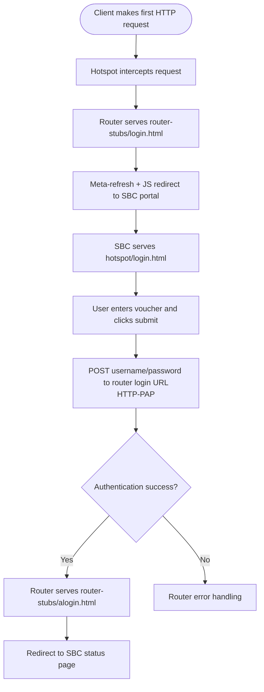

**Diagram sources**
- [router-stubs/login.html:16-27](file://router-stubs/login.html#L16-L27)
- [router-stubs/alogin.html:21-43](file://router-stubs/alogin.html#L21-L43)
- [DEPLOYMENT.md:174-183](file://DEPLOYMENT.md#L174-L183)

**Section sources**
- [router-stubs/login.html:1-33](file://router-stubs/login.html#L1-L33)
- [router-stubs/alogin.html:1-50](file://router-stubs/alogin.html#L1-L50)
- [DEPLOYMENT.md:174-183](file://DEPLOYMENT.md#L174-L183)

#### SBC Login Portal
`hotspot/login.html` is the customer-facing voucher page. In external mode it uses `window.PORTAL.external` to perform a real form navigation to the router’s login URL, setting both username and password to the voucher value. This avoids CORS issues because the browser performs normal navigation rather than XHR.

Key behaviors:
- External mode posts `username=<voucher>` and `password=<voucher>` to the router’s login URL.
- The `dst` field points to the SBC status page so the router redirects there after success.
- Router-native CHAP logic remains present for router-served mode but is bypassed when external mode is detected.

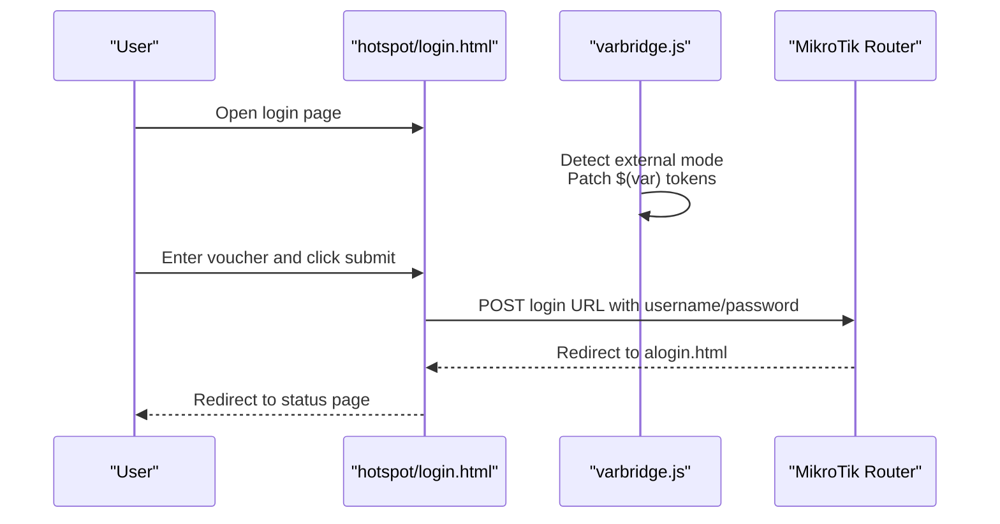

**Diagram sources**
- [hotspot/login.html:347-416](file://hotspot/login.html#L347-L416)
- [hotspot/js/varbridge.js:56-100](file://hotspot/js/varbridge.js#L56-L100)

**Section sources**
- [hotspot/login.html:347-416](file://hotspot/login.html#L347-L416)
- [hotspot/js/varbridge.js:16-100](file://hotspot/js/varbridge.js#L16-L100)

#### Dual-Mode Bridge
`hotspot/js/varbridge.js` allows the same HTML files to run either on the router or on the SBC. It:

- Parses query parameters.
- Detects external mode if the `login` parameter exists or if literal `$(mac)` / `$(link-login-only)` tokens remain in the HTML.
- Publishes `window.PORTAL` with helpers such as `statusUrl()` and `loginUrl()`.
- Strips literal `$(if ...)` / `$(endif)` markers.
- Replaces literal token text nodes and attributes.
- Points login forms whose action is `$(link-login-only)` to the actual router login URL from the query string.

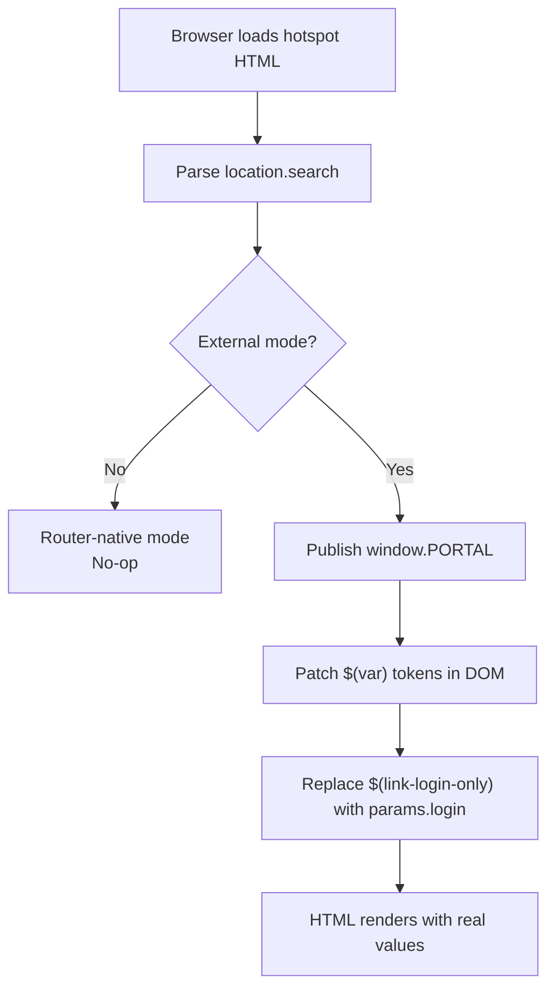

**Diagram sources**
- [hotspot/js/varbridge.js:16-100](file://hotspot/js/varbridge.js#L16-L100)
- [hotspot/js/varbridge.js:126-236](file://hotspot/js/varbridge.js#L126-L236)

**Section sources**
- [hotspot/js/varbridge.js:16-100](file://hotspot/js/varbridge.js#L16-L100)
- [hotspot/js/varbridge.js:126-236](file://hotspot/js/varbridge.js#L126-L236)

### Real-Time Monitoring Flow
After authentication, the status page drives the user experience differently depending on mode.

In router-native mode, the page uses RouterOS-provided variables like `session-time-left-secs` and `refresh-timeout-secs`. In external mode, it ignores those counters and instead polls `/api/session.php?mac=...` every 10 seconds.

#### Status Page Polling
`hotspot/status.html` external-mode logic:

- Reads `mac`, `left`, and `logout` from the URL.
- Wires the PAUSE button to the router logout URL.
- Renders an initial countdown from the snapshot `left` parameter.
- Calls `/api/session.php?mac=...`.
- If connected, updates remaining time, bytes, uptime, and username.
- If disconnected, redirects back to the login page.
- If the fetch fails, starts a local fallback countdown from the snapshot.

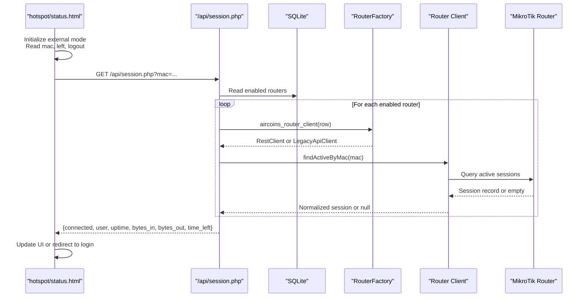

**Diagram sources**
- [hotspot/status.html:461-558](file://hotspot/status.html#L461-L558)
- [api/session.php:58-106](file://api/session.php#L58-L106)

**Section sources**
- [hotspot/status.html:461-558](file://hotspot/status.html#L461-L558)
- [api/session.php:1-106](file://api/session.php#L1-L106)

#### Session API Implementation
`api/session.php` is intentionally unauthenticated and read-only. Its responsibilities are:

- Normalize the MAC address.
- Return `{connected:false,error}` for invalid input.
- Iterate enabled routers.
- Use the unified router client to find an active session by MAC.
- Skip unreachable routers silently.
- Return `{connected:true,...}` when a session is found.
- Never leak stack traces.

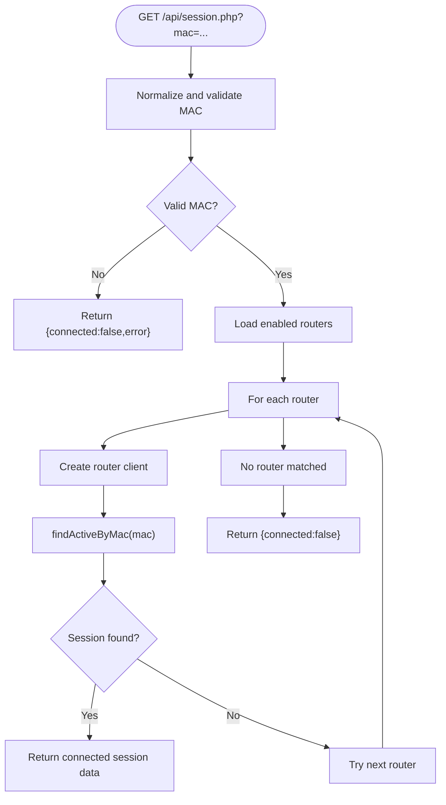

**Diagram sources**
- [api/session.php:40-106](file://api/session.php#L40-L106)

**Section sources**
- [api/session.php:1-106](file://api/session.php#L1-L106)

### Admin Panel Communication Flow
The admin panel manages routers, hotspot users, vouchers, active sessions, and live monitoring. It communicates with routers through the unified router client interface, selecting REST or Legacy implementation based on configuration.

#### Router Management
`admin/routers.php` handles:

- Listing configured routers.
- Adding and editing routers with encrypted passwords.
- Deleting routers and associated monitor samples.
- Testing connections.
- Auto-detecting REST vs Legacy API by probing port 443 then port 8728.

All state-changing POSTs are CSRF-protected and audited.

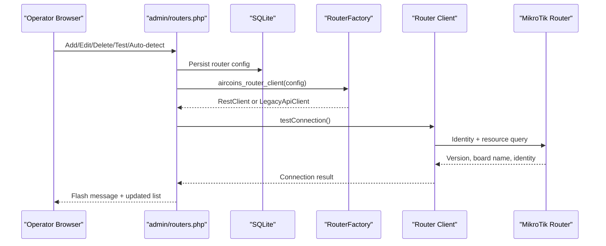

**Diagram sources**
- [admin/routers.php:47-97](file://admin/routers.php#L47-L97)
- [admin/routers.php:116-141](file://admin/routers.php#L116-L141)
- [admin/routers.php:143-223](file://admin/routers.php#L143-L223)

**Section sources**
- [admin/routers.php:1-455](file://admin/routers.php#L1-L455)

#### Live Monitor Feed
`admin/api/monitor.php` provides the dashboard’s live data:

- Requires an authenticated admin session.
- Returns 401 JSON for unauthorized or expired sessions.
- Loads enabled routers.
- For each router, reads identity, resource, active sessions, and interfaces.
- Computes per-interface traffic rate by diffing stored counter samples.
- Stores new samples and prunes older than 24 hours.
- Wraps each router in try/catch so one failure does not break the whole response.

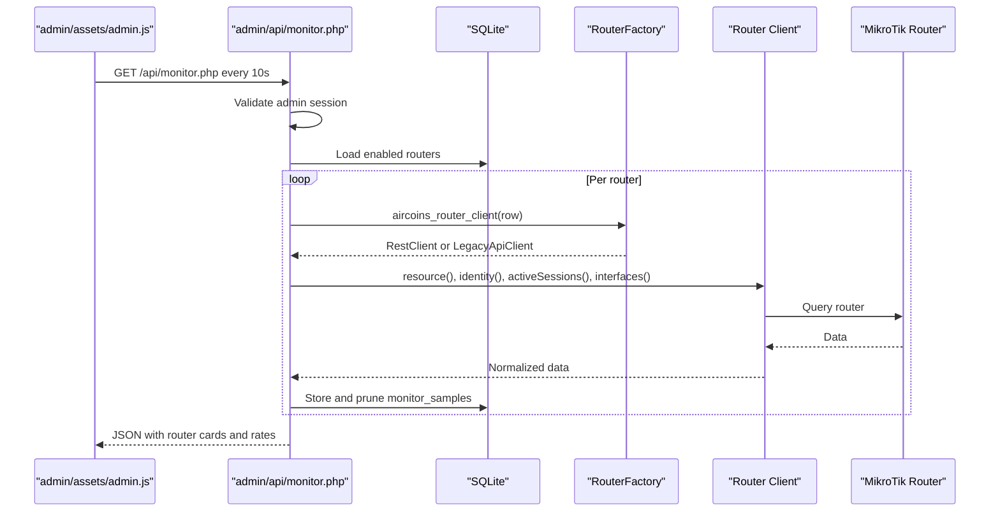

**Diagram sources**
- [admin/api/monitor.php:1-188](file://admin/api/monitor.php#L1-L188)

**Section sources**
- [admin/api/monitor.php:1-188](file://admin/api/monitor.php#L1-L188)

### Router Client Architecture
Both REST and Legacy clients implement the same interface so higher-level code does not care which protocol is used.

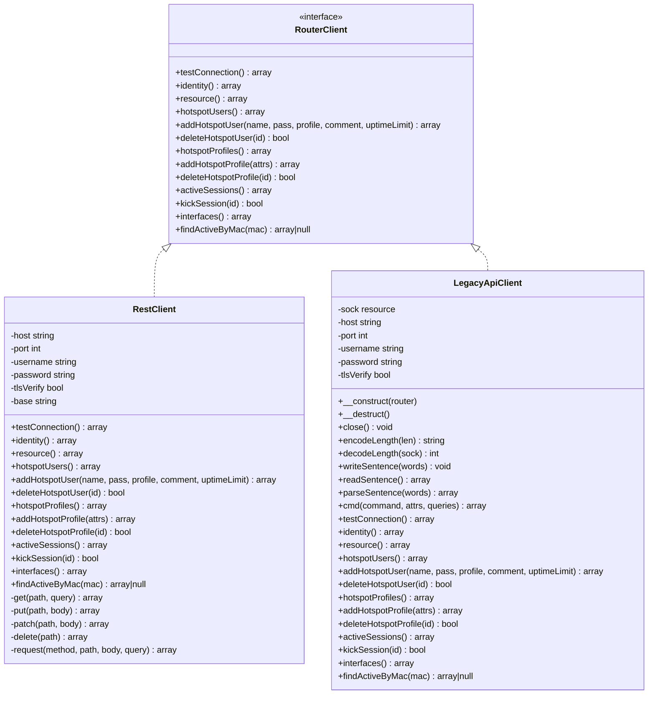

**Diagram sources**
- [includes/RouterOS/RouterClientInterface.php:31-127](file://includes/RouterOS/RouterClientInterface.php#L31-L127)
- [includes/RouterOS/RestClient.php:24-222](file://includes/RouterOS/RestClient.php#L24-L222)
- [includes/RouterOS/LegacyApiClient.php:22-667](file://includes/RouterOS/LegacyApiClient.php#L22-L667)

**Section sources**
- [includes/RouterOS/RouterClientInterface.php:1-128](file://includes/RouterOS/RouterClientInterface.php#L1-L128)
- [includes/RouterOS/RestClient.php:1-459](file://includes/RouterOS/RestClient.php#L1-L459)
- [includes/RouterOS/LegacyApiClient.php:1-667](file://includes/RouterOS/LegacyApiClient.php#L1-L667)

## Dependency Analysis
The component dependencies can be grouped by responsibility:

| Consumer | Depends On | Purpose |
|---|---|---|
| `hotspot/login.html` | `hotspot/js/varbridge.js` | Detect external mode and patch tokens. |
| `hotspot/status.html` | `hotspot/js/varbridge.js` | Enable external-mode polling and logout wiring. |
| `hotspot/status.html` | `/api/session.php` | Get live session state by MAC. |
| `api/session.php` | `includes/db.php` | Read enabled routers from SQLite. |
| `api/session.php` | `includes/RouterOS/RouterFactory.php` | Create REST or Legacy client. |
| `admin/api/monitor.php` | `includes/auth.php` | Enforce admin session. |
| `admin/api/monitor.php` | `includes/db.php` | Read/write monitor samples. |
| `admin/api/monitor.php` | `includes/RouterOS/RouterFactory.php` | Create router clients. |
| `admin/routers.php` | `includes/crypto.php` | Encrypt/decrypt router passwords. |
| `admin/routers.php` | `includes/csrf.php` | Protect state-changing POSTs. |
| `admin/routers.php` | `includes/RouterOS/RouterFactory.php` | Test connection and auto-detect API type. |

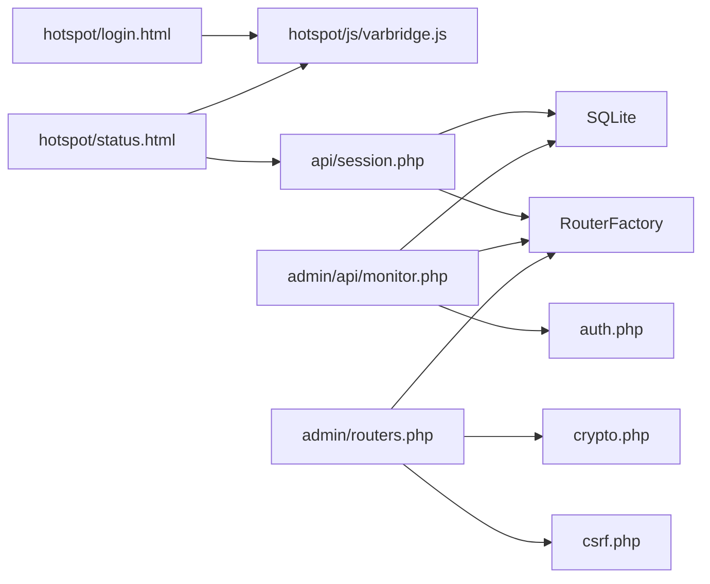

**Diagram sources**
- [hotspot/login.html:14-17](file://hotspot/login.html#L14-L17)
- [hotspot/status.html:13-16](file://hotspot/status.html#L13-L16)
- [api/session.php:23-25](file://api/session.php#L23-L25)
- [admin/api/monitor.php:21-24](file://admin/api/monitor.php#L21-L24)
- [admin/routers.php:17-21](file://admin/routers.php#L17-L21)

**Section sources**
- [hotspot/login.html:14-17](file://hotspot/login.html#L14-L17)
- [hotspot/status.html:13-16](file://hotspot/status.html#L13-L16)
- [api/session.php:23-25](file://api/session.php#L23-L25)
- [admin/api/monitor.php:21-24](file://admin/api/monitor.php#L21-L24)
- [admin/routers.php:17-21](file://admin/routers.php#L17-L21)

## Performance Considerations
Several design choices reduce overhead on low-resource SBCs:

- **On-demand PHP-FPM pool:** Workers spawn only when needed, keeping idle RAM low.
- **Static portal assets:** The SBC serves HTML/CSS/JS directly; only `.php` requests go through PHP-FPM.
- **Lightweight session API:** `/api/session.php` returns only whether a MAC is active; it does not maintain long-lived state.
- **Polling interval:** The status page polls every 10 seconds, balancing responsiveness with network load.
- **Monitor sample pruning:** Traffic samples older than 24 hours are deleted automatically.
- **Per-router error isolation:** Both the session API and monitor API wrap router calls in try/catch so one unreachable router does not fail the entire response.

[No sources needed since this section provides general guidance]

## Troubleshooting Guide
Common failure points and their patterns:

| Area | Symptom | Likely Cause | Handling Pattern |
|---|---|---|---|
| Captive portal redirect | Client never reaches SBC portal | Wrong SBC IP in router stubs, missing walled garden, or wrong DNS | Verify `router-stubs/login.html` SBC IP and RouterOS walled-garden rules. |
| Voucher submission | Form submits but no session appears | PAP credentials incorrect, wrong login URL, or router not reachable | Check router service, credentials, and `hotspot/login.html` external-mode behavior. |
| Status page always disconnected | `/api/session.php` returns `connected:false` | No enabled router, wrong MAC, or router API unreachable | Confirm router is enabled, MAC matches active session, and API type/port is correct. |
| Admin dashboard shows error card | One router card turns red | Router unreachable, wrong API type, or bad credentials | Use “Test connection” and check `last_status`/`last_error`. |
| REST errors | 401, 415, 404, 400 | Disabled `www-ssl`, missing JSON content type, wrong path, malformed request | Review RouterOS REST service and client headers. |
| Legacy errors | `!trap` or `!fatal` | Disabled `api`/`api-ssl`, wrong port, bad credentials, protocol mismatch | Enable legacy service and verify port 8728/8729. |

Error handling patterns across the codebase:

- **Session API:** Invalid MAC returns a structured error; database failures return `{connected:false}` without leaking details.
- **Monitor API:** Unauthorized access returns JSON 401; per-router failures set an `error` field instead of failing the full response.
- **Router clients:** Transport and protocol errors throw exceptions with descriptive messages; callers catch and surface user-friendly feedback.
- **Admin UI:** CSRF verification protects all state-changing operations; flash messages communicate success or failure.

**Section sources**
- [api/session.php:50-83](file://api/session.php#L50-L83)
- [admin/api/monitor.php:29-50](file://admin/api/monitor.php#L29-L50)
- [admin/api/monitor.php:130-182](file://admin/api/monitor.php#L130-L182)
- [admin/routers.php:47-97](file://admin/routers.php#L47-L97)
- [includes/RouterOS/RestClient.php:270-316](file://includes/RouterOS/RestClient.php#L270-L316)
- [includes/RouterOS/LegacyApiClient.php:101-167](file://includes/RouterOS/LegacyApiClient.php#L101-L167)

## Conclusion
MT-CONTROLLER-PISOWIFI separates concerns cleanly:

- The **router** owns hotspot policy, DHCP, interception, and PAP authentication.
- The **SBC** owns the customer-facing portal, session status API, and admin panel.
- The **unified router client interface** abstracts REST and Legacy protocols so the rest of the system stays consistent.
- **Thin router stubs** keep the router lightweight while the SBC serves the rich portal.
- **Polling-based status** gives operators and users near-real-time visibility without requiring persistent WebSocket connections.

When diagnosing problems, follow the chain from client association through DHCP, stub redirect, portal token bridging, PAP submission, router redirect, and finally the session API and router API layers. Most failures fall into one of three categories: network reachability, credential/service configuration, or incorrect SBC/router IP references in the stubs.

[No sources needed since this section summarizes without analyzing specific files]