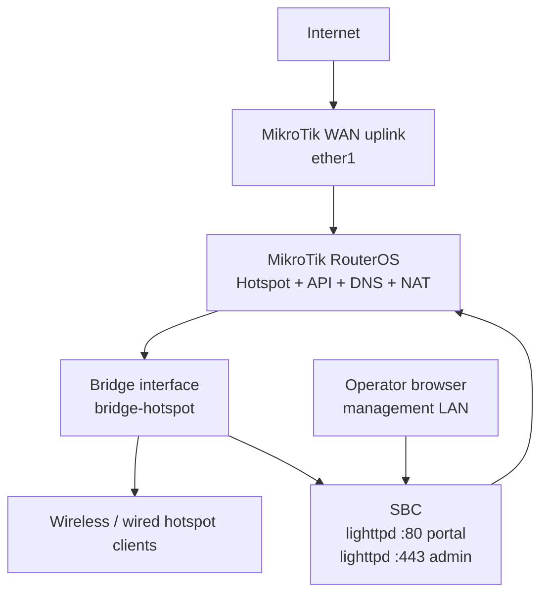
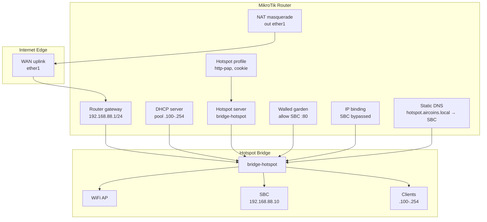
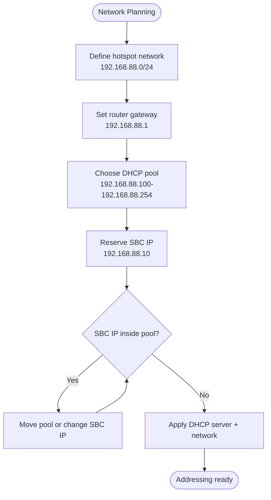
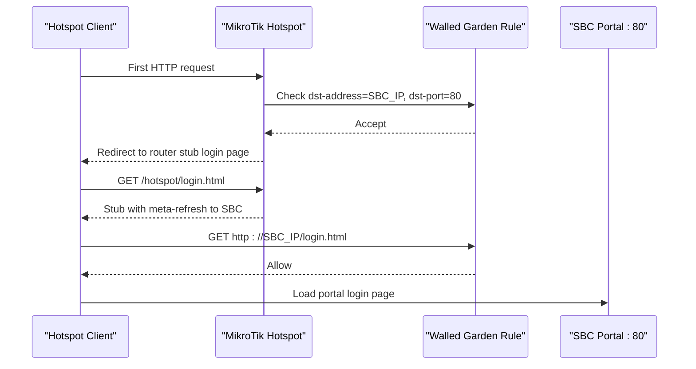
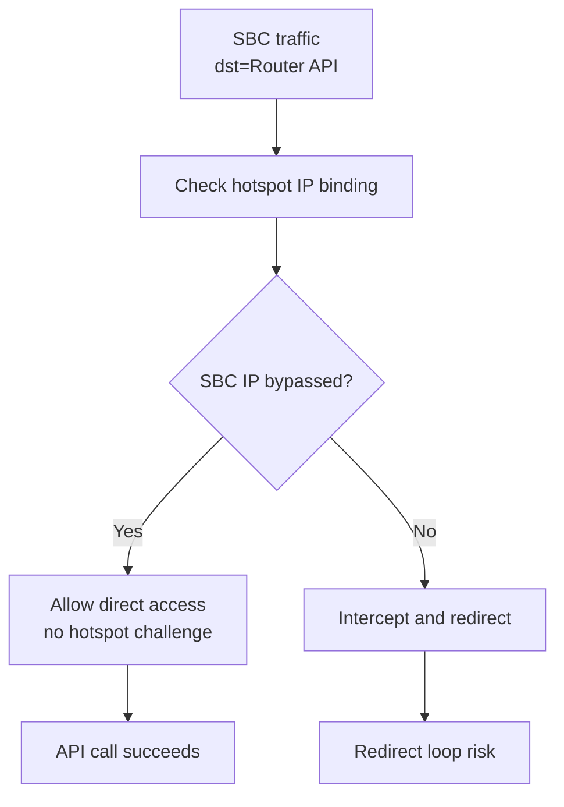
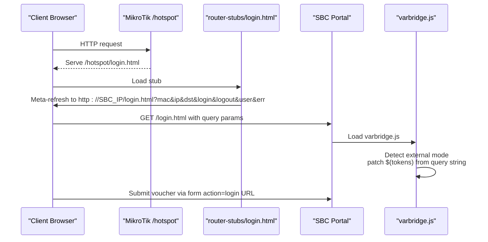
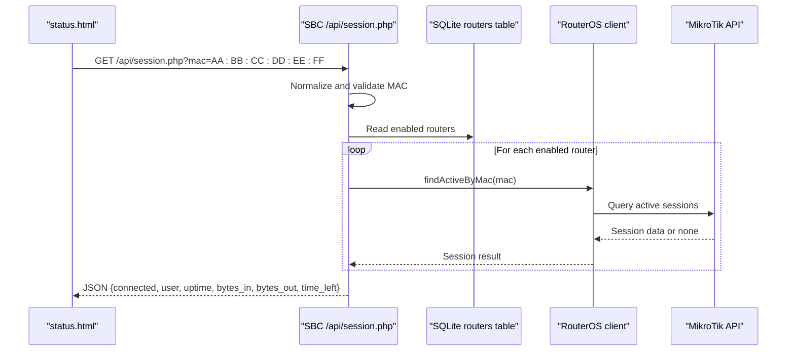
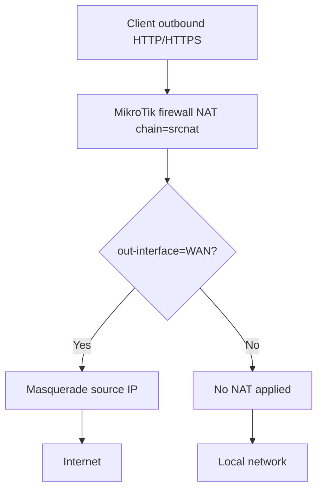
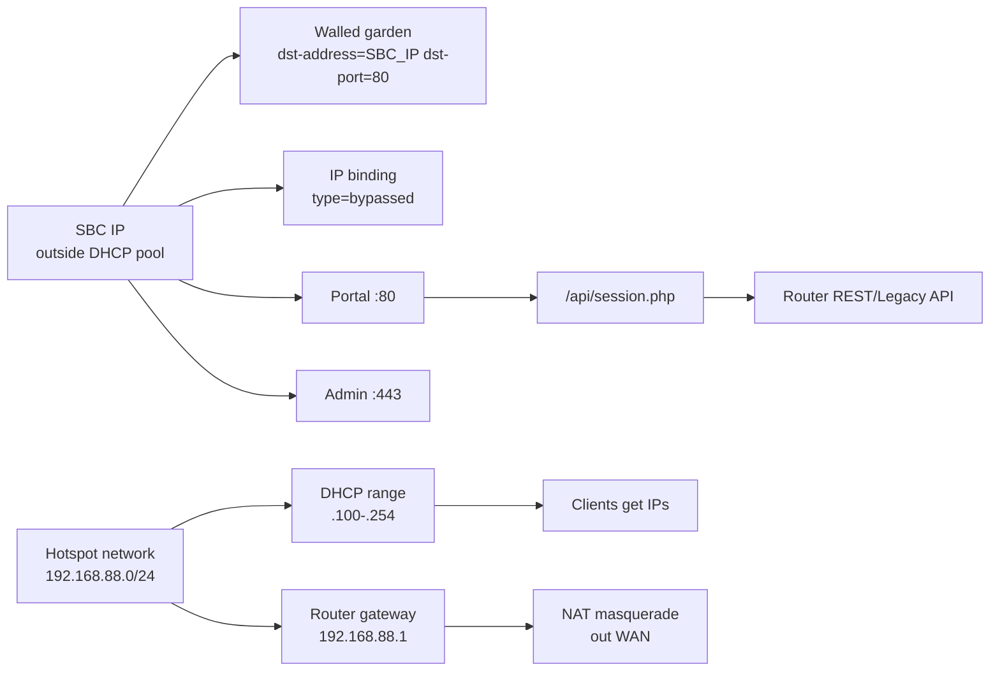

# Network Topology

<cite>
**Referenced Files in This Document**
- [DEPLOYMENT.md](file://DEPLOYMENT.md)
- [hotspot-external-portal.rsc](file://deploy/mikrotik/hotspot-external-portal.rsc)
- [login.html](file://router-stubs/login.html)
- [varbridge.js](file://hotspot/js/varbridge.js)
- [session.php](file://api/session.php)
</cite>

## Table of Contents
1. [Introduction](#introduction)
2. [Project Structure](#project-structure)
3. [Core Components](#core-components)
4. [Architecture Overview](#architecture-overview)
5. [Detailed Component Analysis](#detailed-component-analysis)
6. [Dependency Analysis](#dependency-analysis)
7. [Performance Considerations](#performance-considerations)
8. [Troubleshooting Guide](#troubleshooting-guide)
9. [Conclusion](#conclusion)

## Introduction
This document describes the recommended network topology for the MT-CONTROLLER-PISOWIFI deployment, where a single-board computer (SBC) hosts the captive portal and admin panel while a MikroTik router runs the hotspot service. The SBC is connected to the same bridge that carries hotspot traffic, so clients associate with the wireless access point, obtain an IP from the hotspot DHCP pool, and are redirected to the SBC portal before authentication.

The documentation focuses on:
- Recommended network layout with the SBC on the hotspot bridge.
- IP addressing scheme and DHCP pool configuration.
- Why the SBC IP must be outside the hotspot DHCP range.
- Walled garden rules allowing unauthenticated clients to reach the SBC portal.
- IP binding that exempts the SBC from hotspot interception.
- Firewall rules, NAT configuration, and routing considerations.
- VLAN considerations, management network isolation, and security implications.

## Project Structure
The repository separates three major concerns:
- Router-side redirect stubs and RouterOS configuration.
- SBC-served portal assets and PHP endpoints.
- Deployment instructions describing the intended network design.

**Diagram sources**
- [DEPLOYMENT.md:32-70](file://DEPLOYMENT.md#L32-L70)
- [DEPLOYMENT.md:74-90](file://DEPLOYMENT.md#L74-L90)
- [hotspot-external-portal.rsc:68-81](file://deploy/mikrotik/hotspot-external-portal.rsc#L68-L81)

**Section sources**
- [DEPLOYMENT.md:10-28](file://DEPLOYMENT.md#L10-L28)
- [DEPLOYMENT.md:74-90](file://DEPLOYMENT.md#L74-L90)

## Core Components
The network relies on these components:
- **MikroTik router**: Hotspot server, DHCP server, DNS, walled garden, IP bindings, firewall NAT, and API services.
- **Bridge interface**: Carries both hotspot client traffic and the SBC’s Ethernet connection.
- **SBC**: Runs lighttpd on port 80 for the captive portal and port 443 for the admin panel; exposes `/api/session.php` for live session status.
- **Hotspot clients**: Phones/laptops connecting to the SSID, obtaining DHCP addresses, and being redirected to the SBC portal.
- **Operator browser**: Accesses the admin panel over HTTPS from a trusted management network.

Key responsibilities:
- The router intercepts initial HTTP requests and redirects browsers to the SBC portal.
- The SBC serves login/status pages and queries routers via REST or Legacy API.
- The router authenticates vouchers through HTTP-PAP and grants internet access after successful login.

**Section sources**
- [DEPLOYMENT.md:10-28](file://DEPLOYMENT.md#L10-L28)
- [DEPLOYMENT.md:32-70](file://DEPLOYMENT.md#L32-L70)
- [DEPLOYMENT.md:187-213](file://DEPLOYMENT.md#L187-L213)

## Architecture Overview
The recommended topology places the SBC directly on the hotspot bridge rather than isolating it behind a separate management VLAN. This simplifies connectivity because the SBC can reach the router’s hotspot API without additional routing or firewall exceptions.

**Diagram sources**
- [DEPLOYMENT.md:74-90](file://DEPLOYMENT.md#L74-L90)
- [DEPLOYMENT.md:199-207](file://DEPLOYMENT.md#L199-L207)
- [hotspot-external-portal.rsc:68-81](file://deploy/mikrotik/hotspot-external-portal.rsc#L68-L81)
- [hotspot-external-portal.rsc:98-119](file://deploy/mikrotik/hotspot-external-portal.rsc#L98-L119)
- [hotspot-external-portal.rsc:122-144](file://deploy/mikrotik/hotspot-external-portal.rsc#L122-L144)
- [hotspot-external-portal.rsc:147-171](file://deploy/mikrotik/hotspot-external-portal.rsc#L147-L171)
- [hotspot-external-portal.rsc:197-211](file://deploy/mikrotik/hotspot-external-portal.rsc#L197-L211)

## Detailed Component Analysis

### IP Addressing Scheme and DHCP Pool
The default addressing uses:
- Router gateway: `192.168.88.1/24`.
- Hotspot network: `192.168.88.0/24`.
- DHCP lease range: `192.168.88.100–192.168.88.254`.
- SBC static IP: `192.168.88.10`.

The SBC IP must be outside the DHCP pool because:
- It prevents DHCP from assigning the SBC address to a client.
- It avoids IP conflicts between the SBC and hotspot clients.
- It ensures the walled garden and IP binding rules target a stable, predictable host.

The RouterOS script defines the variables for the hotspot network, pool range, gateway, and SBC IP, and explicitly notes that the SBC IP must remain outside the pool.

**Diagram sources**
- [DEPLOYMENT.md:199-207](file://DEPLOYMENT.md#L199-L207)
- [hotspot-external-portal.rsc:68-81](file://deploy/mikrotik/hotspot-external-portal.rsc#L68-L81)
- [hotspot-external-portal.rsc:98-119](file://deploy/mikrotik/hotspot-external-portal.rsc#L98-L119)

**Section sources**
- [DEPLOYMENT.md:199-207](file://DEPLOYMENT.md#L199-L207)
- [hotspot-external-portal.rsc:68-81](file://deploy/mikrotik/hotspot-external-portal.rsc#L68-L81)
- [hotspot-external-portal.rsc:98-119](file://deploy/mikrotik/hotspot-external-portal.rsc#L98-L119)

### Walled Garden Configuration
Unauthenticated hotspot clients cannot normally reach arbitrary destinations. To allow them to load the SBC portal, the router configures a walled-garden rule that accepts TCP traffic to the SBC’s IP on port 80.

Why this matters:
- Before a user enters a voucher, the browser must load `http://<SBC_IP>/login.html`.
- Without the walled-garden rule, the hotspot would keep redirecting the browser instead of loading the portal.
- The rule is scoped to the SBC IP and port 80, minimizing exposure.

**Diagram sources**
- [DEPLOYMENT.md:65-70](file://DEPLOYMENT.md#L65-L70)
- [hotspot-external-portal.rsc:147-161](file://deploy/mikrotik/hotspot-external-portal.rsc#L147-L161)

**Section sources**
- [DEPLOYMENT.md:380-384](file://DEPLOYMENT.md#L380-L384)
- [hotspot-external-portal.rsc:147-161](file://deploy/mikrotik/hotspot-external-portal.rsc#L147-L161)

### IP Binding That Exempts the SBC
The SBC itself must not be challenged by the hotspot. If the SBC’s traffic were intercepted, the router could redirect the SBC’s own requests back to the portal, causing redirect loops and preventing the SBC from reaching the router API.

The RouterOS script adds an IP binding with type `bypassed` for the SBC IP. This means:
- The SBC is never redirected by the hotspot.
- The SBC can always reach the router’s API.
- The SBC remains reachable even when no clients are authenticated.

**Diagram sources**
- [hotspot-external-portal.rsc:164-171](file://deploy/mikrotik/hotspot-external-portal.rsc#L164-L171)

**Section sources**
- [DEPLOYMENT.md:380-384](file://DEPLOYMENT.md#L380-L384)
- [hotspot-external-portal.rsc:164-171](file://deploy/mikrotik/hotspot-external-portal.rsc#L164-L171)

### Redirect Flow and Router Stubs
The router keeps only thin stub pages. The main portal HTML, CSS, JavaScript, and PHP logic run on the SBC. When a client first hits the hotspot:
1. The router serves its own `/hotspot/login.html` stub.
2. The stub contains a meta-refresh and JavaScript redirect to the SBC portal URL.
3. RouterOS substitutes tokens such as MAC, IP, original destination, login URL, logout URL, username, and error into the redirect URL.
4. The SBC’s `varbridge.js` detects external mode and replaces literal tokens in the DOM.

**Diagram sources**
- [DEPLOYMENT.md:174-183](file://DEPLOYMENT.md#L174-L183)
- [login.html:1-33](file://router-stubs/login.html#L1-L33)
- [varbridge.js:1-15](file://hotspot/js/varbridge.js#L1-L15)
- [varbridge.js:41-100](file://hotspot/js/varbridge.js#L41-L100)
- [varbridge.js:184-212](file://hotspot/js/varbridge.js#L184-L212)

**Section sources**
- [DEPLOYMENT.md:174-183](file://DEPLOYMENT.md#L174-L183)
- [login.html:1-33](file://router-stubs/login.html#L1-L33)
- [varbridge.js:1-15](file://hotspot/js/varbridge.js#L1-L15)
- [varbridge.js:41-100](file://hotspot/js/varbridge.js#L41-L100)
- [varbridge.js:184-212](file://hotspot/js/varbridge.js#L184-L212)

### Session Status Endpoint
After authentication, the status page polls the SBC endpoint `/api/session.php` with the client’s MAC address. The endpoint:
- Normalizes the MAC address.
- Validates input.
- Iterates enabled routers.
- Queries each router’s active sessions.
- Returns JSON indicating whether the MAC has an active session and optional session details.

**Diagram sources**
- [DEPLOYMENT.md:181-183](file://DEPLOYMENT.md#L181-L183)
- [session.php:1-19](file://api/session.php#L1-L19)
- [session.php:33-56](file://api/session.php#L33-L56)
- [session.php:58-83](file://api/session.php#L58-L83)
- [session.php:89-106](file://api/session.php#L89-L106)

**Section sources**
- [session.php:1-19](file://api/session.php#L1-L19)
- [session.php:33-56](file://api/session.php#L33-L56)
- [session.php:58-83](file://api/session.php#L58-L83)
- [session.php:89-106](file://api/session.php#L89-L106)

### Firewall Rules and NAT Configuration
The RouterOS script configures NAT so authenticated hotspot clients can reach the internet through the WAN uplink. The NAT rule masquerades outbound traffic leaving the configured WAN interface.

Routing considerations:
- Clients use the router’s bridge IP as their default gateway.
- The SBC uses the same L3 subnet and gateway.
- The SBC reaches the router API directly over the hotspot bridge.
- NAT applies to hotspot clients’ outbound internet traffic.

**Diagram sources**
- [hotspot-external-portal.rsc:206-211](file://deploy/mikrotik/hotspot-external-portal.rsc#L206-L211)

**Section sources**
- [hotspot-external-portal.rsc:206-211](file://deploy/mikrotik/hotspot-external-portal.rsc#L206-L211)

### VLAN Considerations and Management Network Isolation
The documented default topology connects the SBC to the same bridge as hotspot clients. This is simple but mixes management and guest traffic.

Recommended isolation options:
- **Management VLAN**: Place the operator browser and SBC admin panel on a separate VLAN that does not carry hotspot client traffic.
- **Restricted SBC access**: If the SBC stays on the hotspot bridge, restrict access to port 443 to trusted management sources and avoid exposing the admin panel to unauthenticated clients.
- **Walled garden scope**: Only open port 80 for the SBC portal. Do not open port 443 unless administrators must browse the panel from the hotspot side.
- **Router API exposure**: Keep router API ports (REST 443, Legacy 8728/8729) reachable only from the SBC or management network, not from hotspot clients.

Security implications:
- Keeping the SBC on the hotspot bridge reduces complexity but increases exposure if misconfigured.
- The portal submits vouchers in plaintext PAP over the isolated hotspot LAN; therefore, the hotspot should be on its own VLAN or SSID.
- The admin panel should use TLS and be restricted to trusted networks.

**Section sources**
- [DEPLOYMENT.md:74-90](file://DEPLOYMENT.md#L74-L90)
- [DEPLOYMENT.md:380-384](file://DEPLOYMENT.md#L380-L384)
- [DEPLOYMENT.md:473-483](file://DEPLOYMENT.md#L473-L483)
- [DEPLOYMENT.md:561-571](file://DEPLOYMENT.md#L561-L571)

## Dependency Analysis
The network depends on several coordinated configurations:

**Diagram sources**
- [DEPLOYMENT.md:199-207](file://DEPLOYMENT.md#L199-L207)
- [hotspot-external-portal.rsc:68-81](file://deploy/mikrotik/hotspot-external-portal.rsc#L68-L81)
- [hotspot-external-portal.rsc:98-119](file://deploy/mikrotik/hotspot-external-portal.rsc#L98-L119)
- [hotspot-external-portal.rsc:147-171](file://deploy/mikrotik/hotspot-external-portal.rsc#L147-L171)
- [hotspot-external-portal.rsc:197-211](file://deploy/mikrotik/hotspot-external-portal.rsc#L197-L211)
- [session.php:1-19](file://api/session.php#L1-L19)

**Section sources**
- [DEPLOYMENT.md:199-207](file://DEPLOYMENT.md#L199-L207)
- [hotspot-external-portal.rsc:68-81](file://deploy/mikrotik/hotspot-external-portal.rsc#L68-L81)
- [hotspot-external-portal.rsc:98-119](file://deploy/mikrotik/hotspot-external-portal.rsc#L98-L119)
- [hotspot-external-portal.rsc:147-171](file://deploy/mikrotik/hotspot-external-portal.rsc#L147-L171)
- [hotspot-external-portal.rsc:197-211](file://deploy/mikrotik/hotspot-external-portal.rsc#L197-L211)
- [session.php:1-19](file://api/session.php#L1-L19)

## Performance Considerations
- The hotspot bridge topology is straightforward and minimizes routing overhead.
- NAT masquerading is lightweight and suitable for typical hotspot deployments.
- The SBC’s PHP-FPM pool uses on-demand workers, reducing idle resource usage.
- Avoid unnecessary walled-garden entries; keep allowed destinations minimal.
- Monitor DHCP lease usage to ensure the pool does not exhaust before the SBC IP reservation is enforced.

[No sources needed since this section provides general guidance]

## Troubleshooting Guide
Common network-related issues include:
- **SBC IP assigned to a client**: Indicates overlap between the SBC IP and the DHCP pool. Move the SBC IP outside the pool or adjust the pool range.
- **Portal not loading for unauthenticated clients**: Verify the walled-garden rule allows the SBC IP on port 80.
- **Redirect loops**: Ensure the SBC IP has an IP binding with type `bypassed`.
- **Admin panel unreachable from hotspot side**: Only open port 443 in the walled garden if required; otherwise, access the admin panel from the management network.
- **Clients cannot reach the internet**: Confirm NAT masquerade is configured on the correct WAN interface.
- **VLAN mismatch**: If using VLANs, ensure the SBC, router bridge, and hotspot clients share the expected Layer 2/Layer 3 path.

**Section sources**
- [DEPLOYMENT.md:473-483](file://DEPLOYMENT.md#L473-L483)
- [DEPLOYMENT.md:561-571](file://DEPLOYMENT.md#L561-L571)
- [hotspot-external-portal.rsc:147-171](file://deploy/mikrotik/hotspot-external-portal.rsc#L147-L171)
- [hotspot-external-portal.rsc:206-211](file://deploy/mikrotik/hotspot-external-portal.rsc#L206-L211)

## Conclusion
The MT-CONTROLLER-PISOWIFI deployment works best when the SBC shares the hotspot bridge with clients, uses a static IP outside the DHCP pool, and is exempted from hotspot interception. The walled garden allows unauthenticated clients to reach the portal, while NAT enables authenticated clients to access the internet. For stronger security, consider isolating the admin panel and router API behind a management network and restricting walled-garden access to only what is necessary.

[No sources needed since this section summarizes without analyzing specific files]