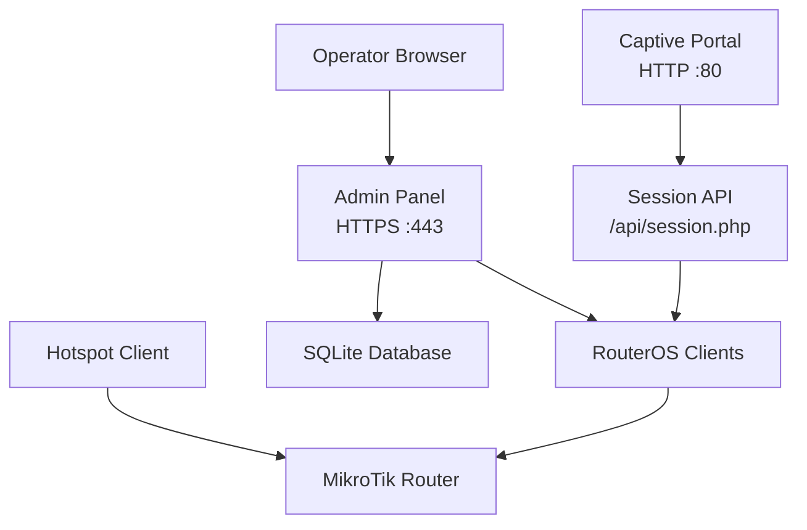
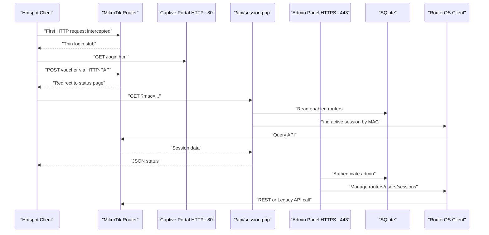
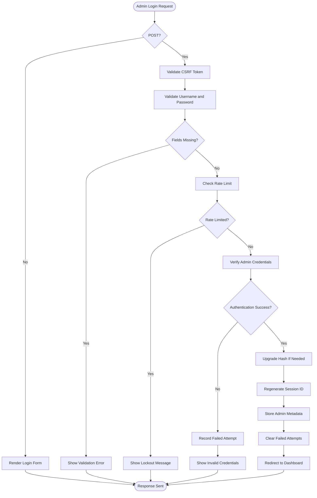
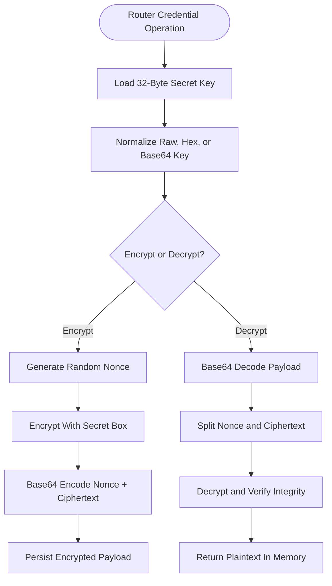
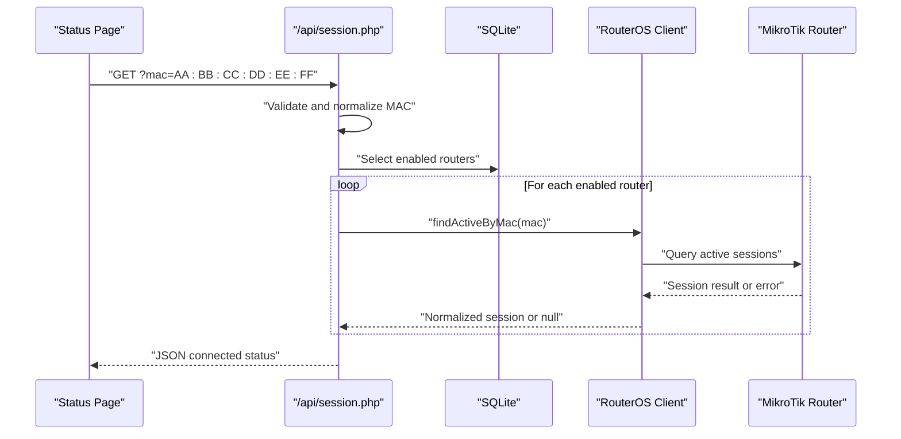
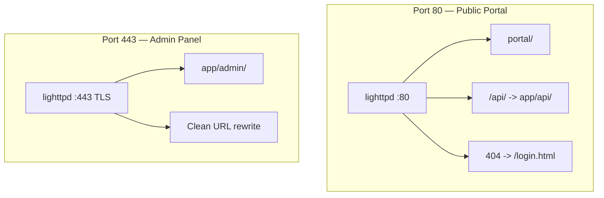
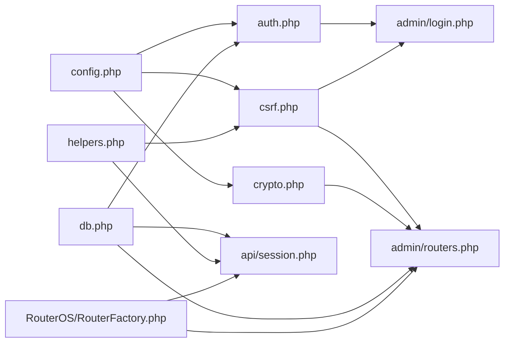

# Security Model

<cite>
**Referenced Files in This Document**
- [DEPLOYMENT.md](file://DEPLOYMENT.md)
- [admin/login.php](file://admin/login.php)
- [admin/routers.php](file://admin/routers.php)
- [api/session.php](file://api/session.php)
- [includes/auth.php](file://includes/auth.php)
- [includes/config.php](file://includes/config.php)
- [includes/crypto.php](file://includes/crypto.php)
- [includes/csrf.php](file://includes/csrf.php)
- [includes/db.php](file://includes/db.php)
- [includes/helpers.php](file://includes/helpers.php)
- [deploy/lighttpd/aircoins.conf](file://deploy/lighttpd/aircoins.conf)
</cite>

## Table of Contents
1. [Introduction](#introduction)
2. [Project Structure](#project-structure)
3. [Core Components](#core-components)
4. [Architecture Overview](#architecture-overview)
5. [Detailed Component Analysis](#detailed-component-analysis)
6. [Dependency Analysis](#dependency-analysis)
7. [Performance Considerations](#performance-considerations)
8. [Troubleshooting Guide](#troubleshooting-guide)
9. [Conclusion](#conclusion)

## Introduction
This document describes the security model for the MT-CONTROLLER-PISOWIFI system (also referred to as AIRCOINS NETFI). It explains how the application protects administrative access, router credentials, and user-facing interactions across three distinct security boundaries:

- Public-facing captive portal over HTTP on port 80.
- Admin panel over HTTPS with a self-signed TLS certificate on port 443.
- Internal connections from the controller to MikroTik routers via REST or Legacy API.

The design balances strong defaults for an isolated hotspot deployment with simplicity suitable for single-board computers. Key mechanisms include Argon2id password hashing for admin accounts, libsodium authenticated encryption for router credentials at rest, CSRF protection for state-changing operations, per-IP rate limiting for login attempts, hardened session cookies, idle timeouts, audit logging, and strict input validation.

## Project Structure
The repository is organized by functional area rather than by framework layers:

- `hotspot/` contains the captive portal HTML, assets, and RouterOS template files.
- `router-stubs/` contains thin redirect pages uploaded to the MikroTik router.
- `admin/` contains the PHP-based administrative UI and endpoints.
- `api/` contains the portal-facing session lookup endpoint.
- `includes/` contains shared PHP core logic: configuration, database schema, authentication, CSRF, encryption, helpers, and RouterOS client abstractions.
- `deploy/` contains lighttpd configuration, php-fpm pool configuration, RouterOS setup scripts, and installation/update scripts.

**Diagram sources**
- [DEPLOYMENT.md:32-70](file://DEPLOYMENT.md#L32-L70)
- [deploy/lighttpd/aircoins.conf:112-163](file://deploy/lighttpd/aircoins.conf#L112-L163)
- [api/session.php:1-19](file://api/session.php#L1-L19)

**Section sources**
- [DEPLOYMENT.md:10-28](file://DEPLOYMENT.md#L10-L28)
- [DEPLOYMENT.md:508-558](file://DEPLOYMENT.md#L508-L558)

## Core Components
The security model is implemented through several focused components:

| Component | Responsibility | Security Role |
|---|---|---|
| Authentication module | Admin login, session hardening, rate limiting, audit logging | Protects administrative access |
| CSRF module | Per-session token generation, rendering, and verification | Prevents cross-site request forgery |
| Encryption module | Libsodium secretbox encryption and decryption for router passwords | Protects sensitive data at rest |
| Configuration module | Central constants for paths, session name, idle timeout, rate limits | Controls security policy values |
| Database module | SQLite connection, WAL mode, prepared statements, schema creation | Provides secure persistence |
| Helpers module | HTML escaping, JSON response helper, router row retrieval | Reduces XSS and output risks |
| Session API | Unauthenticated but read-only MAC-to-session lookup | Exposes minimal non-sensitive status |
| Lighttpd configuration | Port separation, TLS settings, static file exclusion, FastCGI routing | Enforces network and runtime boundaries |

**Section sources**
- [includes/auth.php:1-10](file://includes/auth.php#L1-L10)
- [includes/csrf.php:1-8](file://includes/csrf.php#L1-L8)
- [includes/crypto.php:1-11](file://includes/crypto.php#L1-L11)
- [includes/config.php:1-11](file://includes/config.php#L1-L11)
- [includes/db.php:1-8](file://includes/db.php#L1-L8)
- [includes/helpers.php:1-7](file://includes/helpers.php#L1-L7)
- [api/session.php:1-19](file://api/session.php#L1-L19)
- [deploy/lighttpd/aircoins.conf:30-44](file://deploy/lighttpd/aircoins.conf#L30-L44)

## Architecture Overview
The system enforces security through layered boundaries:

1. **Public Captive Portal (HTTP)**
   - Served on port 80.
   - Intended for unauthenticated hotspot clients.
   - Uses RouterOS external login flow with HTTP-PAP.
   - The status page polls `/api/session.php`, which is intentionally unauthenticated but strictly read-only and limited to non-sensitive session presence information.

2. **Admin Panel (HTTPS with Self-Signed TLS)**
   - Served on port 443.
   - Requires admin authentication.
   - Uses hardened sessions (`HttpOnly`, `SameSite=Strict`, `Secure` over TLS).
   - All state-changing POST requests are CSRF-protected.
   - Router credentials are encrypted at rest; plaintext is only used in memory during API calls.

3. **Internal Router API Connections**
   - The admin panel communicates with MikroTik routers using either REST (RouterOS v7, HTTPS) or Legacy API (v6/v7, TCP 8728 or TLS 8729).
   - Credentials are decrypted only when constructing a client for a single request.
   - Peer certificate verification can be disabled for self-signed router certificates on isolated networks.

**Diagram sources**
- [DEPLOYMENT.md:32-70](file://DEPLOYMENT.md#L32-L70)
- [DEPLOYMENT.md:174-183](file://DEPLOYMENT.md#L174-L183)
- [api/session.php:1-19](file://api/session.php#L1-L19)
- [admin/login.php:1-10](file://admin/login.php#L1-L10)

## Detailed Component Analysis

### Administrative Authentication and Session Management
Administrative authentication is centralized in the authentication module. The login page validates CSRF tokens, checks required fields, invokes the login function, records successful logins, distinguishes lockout messages from invalid credentials, and redirects authenticated users to the dashboard.

Key behaviors:

- Password hashing prefers Argon2id and falls back to bcrypt if Argon2id is unavailable.
- Verification uses constant-time comparison through `password_verify`.
- Weak or legacy hashes are automatically upgraded after a successful login.
- Sessions use a custom cookie name, `HttpOnly`, `SameSite=Strict`, and `Secure` when TLS is detected.
- Login attempts are rate-limited per client IP using a dedicated table.
- Successful authentication regenerates the session ID and clears failed attempt counters.
- Idle sessions expire after a configurable timeout.
- Every privileged action can be written to an audit log.

**Diagram sources**
- [admin/login.php:37-62](file://admin/login.php#L37-L62)
- [includes/auth.php:151-190](file://includes/auth.php#L151-L190)
- [includes/auth.php:202-231](file://includes/auth.php#L202-L231)

**Section sources**
- [admin/login.php:1-114](file://admin/login.php#L1-L114)
- [includes/auth.php:17-57](file://includes/auth.php#L17-L57)
- [includes/auth.php:59-83](file://includes/auth.php#L59-L83)
- [includes/auth.php:96-138](file://includes/auth.php#L96-L138)
- [includes/auth.php:140-190](file://includes/auth.php#L140-L190)
- [includes/auth.php:192-259](file://includes/auth.php#L192-L259)
- [includes/config.php:25-43](file://includes/config.php#L25-L43)

### CSRF Protection
CSRF protection is implemented as a per-session random token. Forms render a hidden field containing the token, and state-changing POST requests verify it using a timing-safe comparison. Non-POST requests bypass verification so the check can be called unconditionally at the top of endpoints.

Security properties:

- Tokens are generated with cryptographically secure random bytes.
- Tokens are stored in the session.
- Verification returns HTTP 403 and terminates the request on mismatch.
- Session initialization is handled defensively inside both token generation and verification.

```mermaid
flowchart TD
FormStart["Render Admin Form"] --> GenerateToken["Generate or Retrieve Session CSRF Token"]
GenerateToken --> RenderHidden["Render Hidden CSRF Field"]
Submit["Submit State-Changing POST"] --> VerifyMethod{"Is POST?"}
VerifyMethod --> |No| SkipCheck["Skip CSRF Check"]
VerifyMethod --> |Yes| LoadTokens["Load Submitted and Session Tokens"]
LoadTokens --> Compare["Timing-Safe Comparison"]
Compare --> Valid{"Valid?"}
Valid --> |No| Deny["Return 403 Forbidden"]
Valid --> |Yes| Proceed["Proceed With Endpoint Logic"]
```

**Diagram sources**
- [includes/csrf.php:16-30](file://includes/csrf.php#L16-L30)
- [includes/csrf.php:32-40](file://includes/csrf.php#L32-L40)
- [includes/csrf.php:42-67](file://includes/csrf.php#L42-L67)

**Section sources**
- [includes/csrf.php:1-68](file://includes/csrf.php#L1-L68)
- [admin/login.php:37-38](file://admin/login.php#L37-L38)
- [admin/routers.php:47-48](file://admin/routers.php#L47-L48)

### Router Credential Encryption at Rest
Router credentials are protected using libsodium’s XSalsa20-Poly1305 secret box. A 32-byte key is loaded from a file outside the web root. The module supports raw binary, hex-encoded, or base64-encoded keys. Encryption produces a base64 payload containing nonce and ciphertext; decryption validates length, decodes base64, splits nonce and ciphertext, and verifies integrity before returning plaintext.

Important constraints:

- Plaintext router passwords are never persisted.
- Decryption occurs only in memory for the lifetime of a single API operation.
- Malformed, tampered, or incorrectly keyed payloads raise explicit exceptions.
- The key file must exist, be readable, and contain valid material.

**Diagram sources**
- [includes/crypto.php:17-48](file://includes/crypto.php#L17-L48)
- [includes/crypto.php:50-82](file://includes/crypto.php#L50-L82)
- [includes/crypto.php:84-102](file://includes/crypto.php#L84-L102)
- [includes/crypto.php:104-137](file://includes/crypto.php#L104-L137)

**Section sources**
- [includes/crypto.php:1-138](file://includes/crypto.php#L1-L138)
- [admin/routers.php:1-13](file://admin/routers.php#L1-L13)
- [admin/routers.php:172-219](file://admin/routers.php#L172-L219)
- [DEPLOYMENT.md:561-571](file://DEPLOYMENT.md#L561-L571)

### Database Schema and Persistence Security
The database layer provides a singleton PDO connection to SQLite with:

- Exception error mode.
- Associative fetches.
- Native prepared statements.
- WAL journal mode.
- Busy timeout.
- Normal synchronous setting.
- Foreign key enforcement.
- Idempotent schema creation.

Tables relevant to security include:

| Table | Purpose | Security Relevance |
|---|---|---|
| `admins` | Stores admin usernames and hashed passwords | Argon2id/bcrypt hashes |
| `routers` | Stores router metadata and encrypted passwords | `pass_enc` stores libsodium ciphertext |
| `login_attempts` | Tracks failed login IPs and timestamps | Enables per-IP rate limiting |
| `audit_log` | Records privileged actions | Supports accountability and forensics |
| `monitor_samples` | Stores router monitoring samples | Operational telemetry |

**Section sources**
- [includes/db.php:14-48](file://includes/db.php#L14-L48)
- [includes/db.php:50-117](file://includes/db.php#L50-L117)

### Portal-Facing Session API
The session API is intentionally unauthenticated because it serves the captive portal’s own status page. However, it is strictly read-only and limited to non-sensitive information:

- Accepts a MAC address parameter.
- Normalizes and validates the MAC format.
- Iterates enabled routers.
- Queries each router for an active session matching the MAC.
- Returns a minimal JSON object indicating connection state and basic session metrics.
- Never leaks stack traces or internal errors.
- Opens CORS for this endpoint only.

**Diagram sources**
- [api/session.php:1-19](file://api/session.php#L1-L19)
- [api/session.php:40-48](file://api/session.php#L40-L48)
- [api/session.php:50-83](file://api/session.php#L50-L83)
- [api/session.php:85-106](file://api/session.php#L85-L106)

**Section sources**
- [api/session.php:1-107](file://api/session.php#L1-L107)

### Network Boundaries and Web Server Security
Lighttpd separates the public portal and the admin panel:

- Port 80 serves the captive portal.
- Port 443 serves the admin panel with TLS.
- PHP files are excluded from static file serving.
- The `/api/` alias is scoped to HTTP so the status page can reach the session endpoint.
- The admin panel uses clean URL rewriting.
- TLS is configured with modern protocol defaults.
- Access logging is intentionally disabled to reduce SD-card wear.

**Diagram sources**
- [deploy/lighttpd/aircoins.conf:30-44](file://deploy/lighttpd/aircoins.conf#L30-L44)
- [deploy/lighttpd/aircoins.conf:89-90](file://deploy/lighttpd/aircoins.conf#L89-L90)
- [deploy/lighttpd/aircoins.conf:112-131](file://deploy/lighttpd/aircoins.conf#L112-L131)
- [deploy/lighttpd/aircoins.conf:133-163](file://deploy/lighttpd/aircoins.conf#L133-L163)

**Section sources**
- [deploy/lighttpd/aircoins.conf:1-28](file://deploy/lighttpd/aircoins.conf#L1-L28)
- [deploy/lighttpd/aircoins.conf:112-163](file://deploy/lighttpd/aircoins.conf#L112-L163)
- [DEPLOYMENT.md:288-294](file://DEPLOYMENT.md#L288-L294)

## Dependency Analysis
The security components have clear dependencies:

- Admin login depends on helpers, authentication, and CSRF modules.
- Authentication depends on configuration and database modules.
- CSRF depends on configuration, helpers, and authentication for session handling.
- Encryption depends on configuration and requires the sodium extension.
- The session API depends on helpers, database, and RouterOS client factory.
- Router management depends on database, encryption, CSRF, layout, and RouterOS client factory.

**Diagram sources**
- [admin/login.php:14-16](file://admin/login.php#L14-L16)
- [admin/routers.php:17-21](file://admin/routers.php#L17-L21)
- [api/session.php:23-25](file://api/session.php#L23-L25)
- [includes/auth.php:14-15](file://includes/auth.php#L14-L15)
- [includes/csrf.php:12-14](file://includes/csrf.php#L12-L14)
- [includes/crypto.php:15](file://includes/crypto.php#L15)

**Section sources**
- [admin/login.php:14-16](file://admin/login.php#L14-L16)
- [admin/routers.php:17-21](file://admin/routers.php#L17-L21)
- [api/session.php:23-25](file://api/session.php#L23-L25)
- [includes/auth.php:14-15](file://includes/auth.php#L14-L15)
- [includes/csrf.php:12-14](file://includes/csrf.php#L12-L14)
- [includes/crypto.php:15](file://includes/crypto.php#L15)

## Performance Considerations
From a security-performance perspective:

- SQLite WAL mode improves concurrency while reducing write amplification compared to older journal modes.
- Prepared statements prevent SQL injection and improve query plan reuse.
- Rate limiting uses indexed queries on IP and timestamp columns.
- Session regeneration prevents session fixation attacks without requiring complex session storage.
- CSRF verification is lightweight and avoids expensive cryptographic operations beyond `hash_equals`.
- Router credential decryption is performed only when needed and not cached in plaintext.
- Lighttpd disables access logging to reduce disk I/O on resource-constrained SBCs.

[No sources needed since this section provides general guidance]

## Troubleshooting Guide
Common security-related issues and their implications:

| Issue | Symptom | Recommended Action |
|---|---|---|
| Wrong clock | Spurious logouts, TLS warnings, incorrect rate-limit behavior | Enable NTP and verify time synchronization |
| Missing sodium key | Encryption functions fail | Ensure `/etc/aircoins/secret.key` exists, is readable by `www-data`, and contains valid material |
| CSRF failure | State-changing admin POST rejected with 403 | Ensure forms include the CSRF token and that sessions are initialized |
| Admin lockout | Login shows temporary lockout message | Wait for the configured rate-limit window or investigate repeated failed attempts |
| Session expired | Redirected to login with timeout notice | Re-authenticate; consider reviewing idle timeout configuration |
| Router credentials cannot decrypt | Router operations fail after key rotation or backup loss | Restore the original key or re-enter router credentials |
| Session API reports disconnected | Status page shows no connection | Verify MAC parameter, router enablement, and router connectivity |
| Plain HTTP admin variant | Admin traffic and router credentials sent in cleartext | Prefer HTTPS on port 443; restrict plain HTTP admin to trusted isolated networks only |

**Section sources**
- [includes/auth.php:96-138](file://includes/auth.php#L96-L138)
- [includes/auth.php:202-231](file://includes/auth.php#L202-L231)
- [includes/crypto.php:25-48](file://includes/crypto.php#L25-L48)
- [includes/crypto.php:111-137](file://includes/crypto.php#L111-L137)
- [api/session.php:50-83](file://api/session.php#L50-L83)
- [DEPLOYMENT.md:500-502](file://DEPLOYMENT.md#L500-L502)
- [DEPLOYMENT.md:561-571](file://DEPLOYMENT.md#L561-L571)

## Conclusion
The MT-CONTROLLER-PISOWIFI security model applies defense-in-depth appropriate for an isolated MikroTik hotspot deployment:

- Admin accounts are protected with Argon2id hashing, hardened sessions, idle timeouts, and per-IP rate limiting.
- Router credentials are encrypted at rest with libsodium and only exposed in memory during API operations.
- CSRF protection covers all state-changing administrative operations.
- The public captive portal remains simple and compatible with RouterOS external login, accepting the trade-off of plaintext PAP over the isolated hotspot LAN.
- The admin panel is separated from the portal by ports and TLS, with least-privilege web server configuration.
- Audit logging and input validation support accountability and robustness.

For production deployments, prioritize:

- Keeping the hotspot LAN isolated.
- Using HTTPS for the admin panel.
- Backing up the libsodium key securely.
- Restricting router API access to the controller host.
- Monitoring audit logs and failed login attempts.
- Replacing self-signed certificates where feasible.
- Reviewing rate-limit thresholds and idle timeouts against operational needs.

[No sources needed since this section summarizes without analyzing specific files]