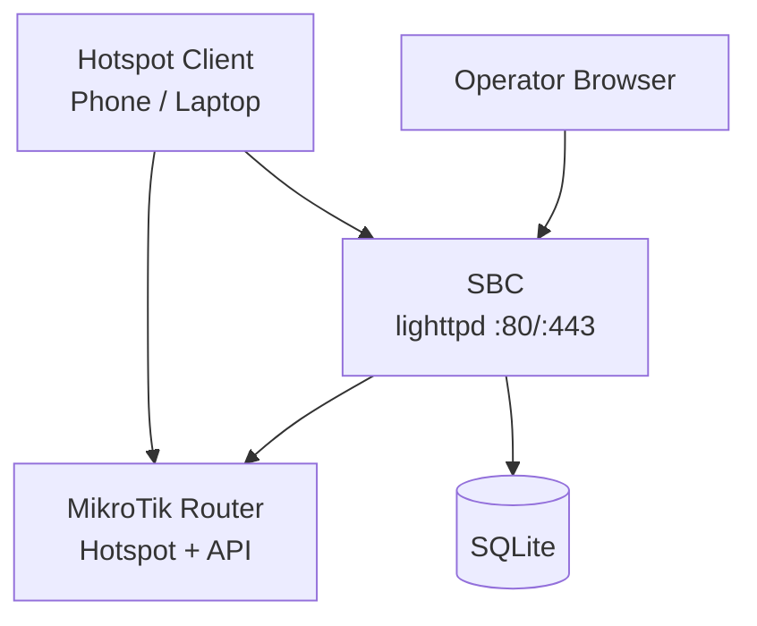
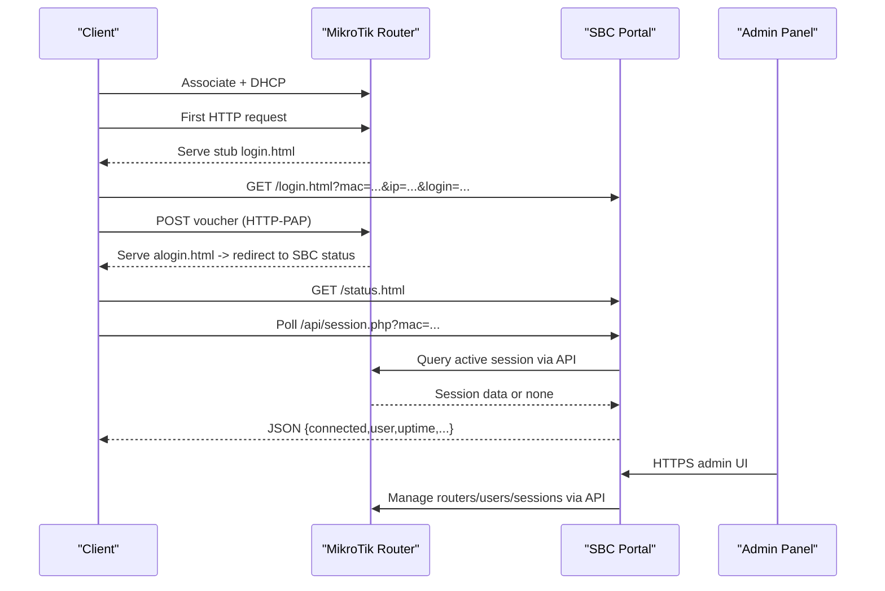
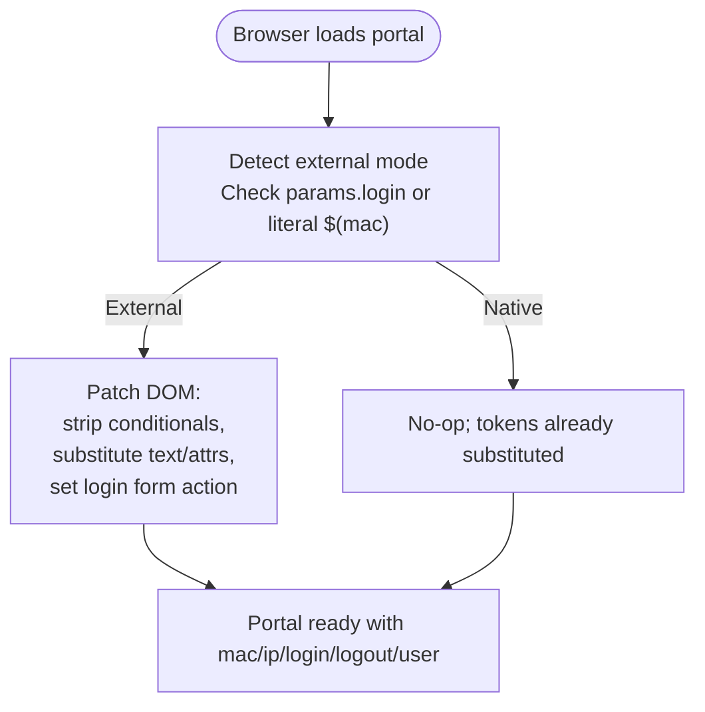
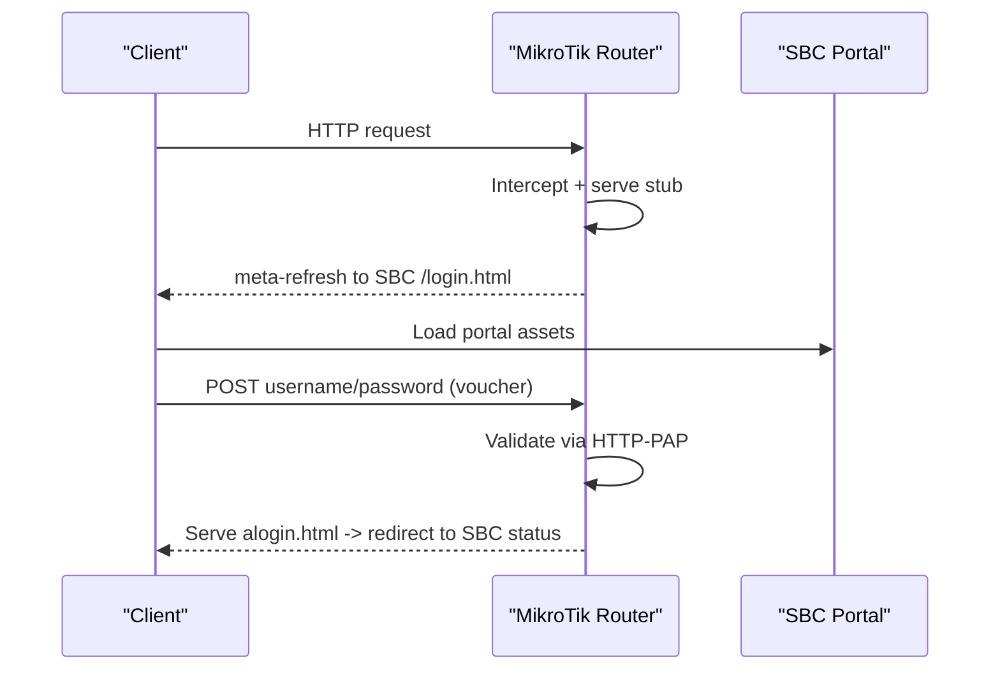
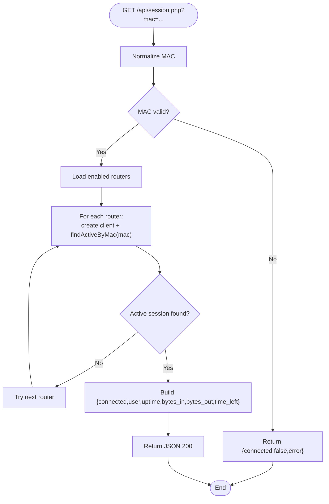
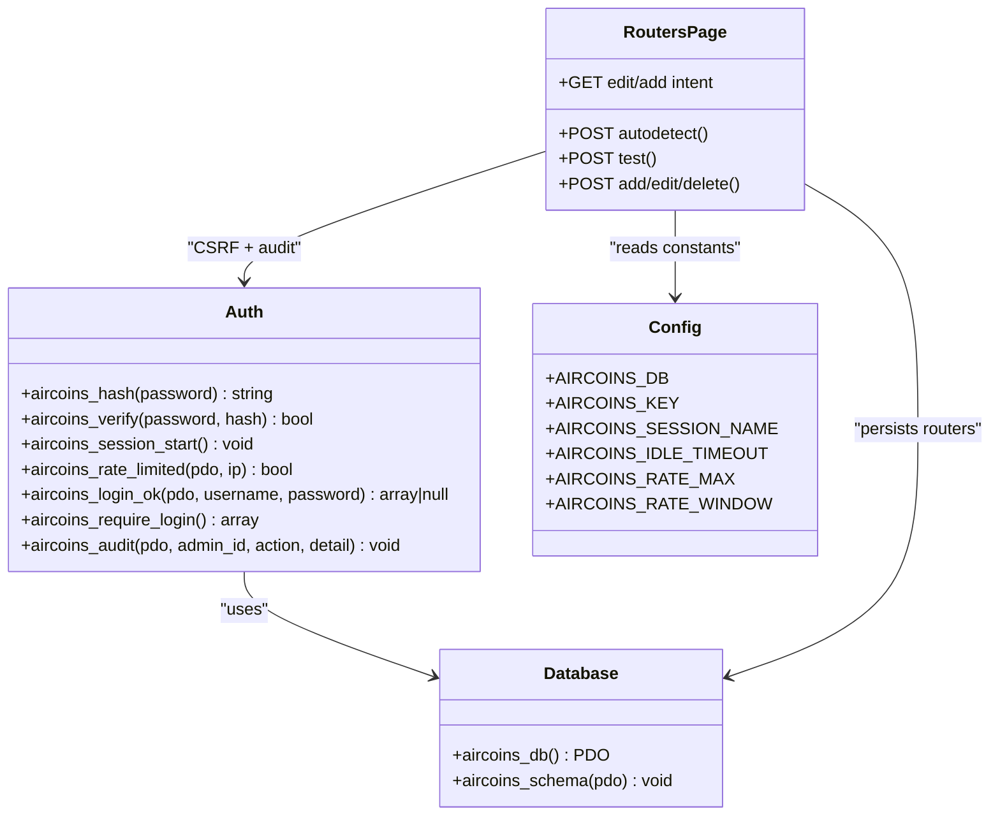
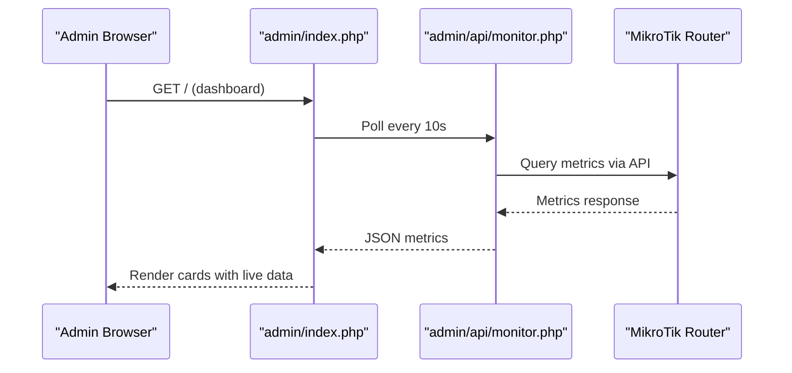
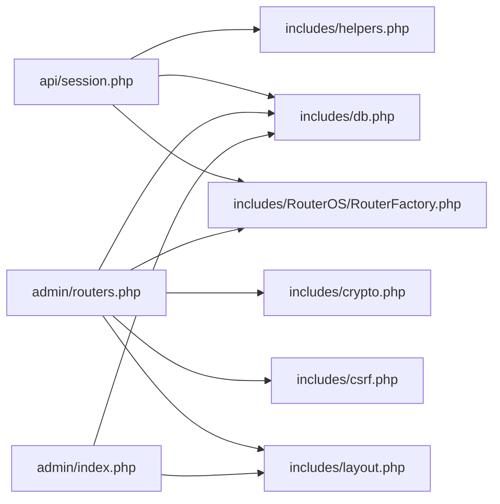

# System Architecture

<cite>
**Referenced Files in This Document**   
- [DEPLOYMENT.md](file://DEPLOYMENT.md)
- [hotspot-external-portal.rsc](file://deploy/mikrotik/hotspot-external-portal.rsc)
- [rlogin.html](file://hotspot/rlogin.html)
- [session.php](file://api/session.php)
- [varbridge.js](file://hotspot/js/varbridge.js)
- [config.php](file://includes/config.php)
- [db.php](file://includes/db.php)
- [auth.php](file://includes/auth.php)
- [index.php](file://admin/index.php)
- [routers.php](file://admin/routers.php)
</cite>

## Table of Contents
1. [Introduction](#introduction)
2. [Project Structure](#project-structure)
3. [Core Components](#core-components)
4. [Architecture Overview](#architecture-overview)
5. [Detailed Component Analysis](#detailed-component-analysis)
6. [Dependency Analysis](#dependency-analysis)
7. [Performance Considerations](#performance-considerations)
8. [Troubleshooting Guide](#troubleshooting-guide)
9. [Conclusion](#conclusion)

## Introduction
MT-CONTROLLER-PISOWIFI is a lightweight MikroTik hotspot controller designed for resource-constrained single-board computers. It uses a dual-host architecture: the SBC hosts the captive portal and admin panel, while the MikroTik router provides hotspot interception, DHCP, HTTP-PAP authentication, and session state. The system avoids frameworks and Composer to keep the runtime footprint small and portable across Debian/Ubuntu/Armbian environments.

The design separates concerns clearly:
- **MikroTik router**: network edge, hotspot server, API surface, client sessions.
- **SBC**: web server (lighttpd), PHP-FPM, SQLite database, admin UI, portal assets, and router API clients.
- **Clients**: phones/laptops that associate with the hotspot SSID and authenticate via voucher submission.
- **Admin operator**: browser accessing the HTTPS admin panel on the SBC.

This document explains the high-level design, component interactions, data flows, security boundaries, technology decisions, and deployment patterns.

## Project Structure
At a high level, the repository organizes code by role:
- `hotspot/`: static captive portal assets served from the SBC.
- `router-stubs/`: thin HTML files uploaded to the MikroTik `/hotspot` directory.
- `admin/`: PHP admin panel pages and endpoints.
- `api/`: portal-facing JSON endpoint for live session status.
- `includes/`: shared PHP core (configuration, database, auth, RouterOS clients).
- `deploy/`: lighttpd config, php-fpm pool, RouterOS setup script, and installer scripts.

**Diagram sources**
- [DEPLOYMENT.md:32-70](file://DEPLOYMENT.md#L32-L70)
- [hotspot-external-portal.rsc:1-59](file://deploy/mikrotik/hotspot-external-portal.rsc#L1-L59)

**Section sources**
- [DEPLOYMENT.md:508-557](file://DEPLOYMENT.md#L508-L557)

## Core Components
- **Captive Portal (SBC)**: Static HTML/CSS/JS served by lighttpd on port 80. Uses `hotspot/js/varbridge.js` to adapt RouterOS template tokens when served externally.
- **Session Status API (SBC)**: `/api/session.php` returns unauthenticated JSON indicating whether a MAC has an active session on any enabled router.
- **Admin Panel (SBC)**: HTTPS-only PHP UI for managing routers, users, vouchers, sessions, and monitoring.
- **Router API Clients (SBC)**: REST (v7) and Legacy (v6/v7) clients abstracted behind a factory and interface.
- **MikroTik Hotspot (Router)**: Intercepts HTTP, serves stubs, authenticates via HTTP-PAP, exposes API services.
- **Database (SBC)**: SQLite schema for admins, routers, login attempts, audit log, and monitor samples.

Key responsibilities:
- Redirect interception and stub handling occur on the router.
- Voucher submission uses HTTP-PAP back to the router.
- Real-time monitoring and session validation are performed by querying the router API from the SBC.
- Admin operations are CSRF-protected, audited, and use encrypted router credentials at rest.

**Section sources**
- [DEPLOYMENT.md:10-28](file://DEPLOYMENT.md#L10-L28)
- [session.php:1-19](file://api/session.php#L1-L19)
- [db.php:1-8](file://includes/db.php#L1-L8)
- [auth.php:1-10](file://includes/auth.php#L1-L10)

## Architecture Overview
The system follows a dual-host flow:
1. Client associates and receives DHCP from the router.
2. First HTTP request is intercepted; router serves a thin stub.
3. Stub redirects to the SBC portal with client context parameters.
4. User submits voucher; form POSTs to the router using HTTP-PAP.
5. On success, router redirects to the SBC status page.
6. Status page polls `/api/session.php` to show live session metrics.
7. Admin manages routers and sessions over HTTPS and the router API.

**Diagram sources**
- [DEPLOYMENT.md:32-70](file://DEPLOYMENT.md#L32-L70)
- [hotspot-external-portal.rsc:122-144](file://deploy/mikrotik/hotspot-external-portal.rsc#L122-L144)
- [session.php:58-83](file://api/session.php#L58-L83)

## Detailed Component Analysis

### Captive Portal Flow and Dual-Host Adaptation
The portal runs in two modes:
- **Router-native mode**: Router substitutes `$(...)` tokens before serving HTML.
- **External mode**: SBC serves HTML with literal tokens; `varbridge.js` detects external mode and patches the DOM, mapping query parameters to token values.

**Diagram sources**
- [varbridge.js:16-57](file://hotspot/js/varbridge.js#L16-L57)
- [varbridge.js:109-212](file://hotspot/js/varbridge.js#L109-L212)

**Section sources**
- [varbridge.js:1-15](file://hotspot/js/varbridge.js#L1-L15)
- [varbridge.js:56-103](file://hotspot/js/varbridge.js#L56-L103)
- [varbridge.js:120-212](file://hotspot/js/varbridge.js#L120-L212)

### HTTP-PAP Authentication and Redirect Interception
- The hotspot profile enforces `login-by=http-pap,cookie`.
- Walled garden allows unauthenticated clients to reach the SBC portal on port 80.
- IP binding exempts the SBC from interception to prevent loops.
- Router stubs redirect to the SBC portal and later to the status page.

**Diagram sources**
- [hotspot-external-portal.rsc:122-171](file://deploy/mikrotik/hotspot-external-portal.rsc#L122-L171)
- [DEPLOYMENT.md:174-184](file://DEPLOYMENT.md#L174-L184)

**Section sources**
- [hotspot-external-portal.rsc:122-171](file://deploy/mikrotik/hotspot-external-portal.rsc#L122-L171)
- [DEPLOYMENT.md:308-390](file://DEPLOYMENT.md#L308-L390)

### Session Management and Real-Time Monitoring
- The status page polls `/api/session.php?mac=...`.
- The endpoint normalizes the MAC, iterates enabled routers, and queries each via the appropriate API client.
- Returns a unified JSON shape with connection status, user, uptime, bytes, and time left.

**Diagram sources**
- [session.php:40-56](file://api/session.php#L40-L56)
- [session.php:58-83](file://api/session.php#L58-L83)
- [session.php:89-106](file://api/session.php#L89-L106)

**Section sources**
- [session.php:1-19](file://api/session.php#L1-L19)
- [session.php:40-106](file://api/session.php#L40-L106)

### Admin Interface and Router Management
- Admin panel requires login with rate limiting, idle timeout, and CSRF protection.
- Router management supports add/edit/delete/test/auto-detect.
- Router passwords are encrypted at rest; audit log records actions.

**Diagram sources**
- [auth.php:17-57](file://includes/auth.php#L17-L57)
- [auth.php:65-83](file://includes/auth.php#L65-L83)
- [auth.php:103-138](file://includes/auth.php#L103-L138)
- [auth.php:151-190](file://includes/auth.php#L151-L190)
- [auth.php:202-231](file://includes/auth.php#L202-L231)
- [auth.php:269-281](file://includes/auth.php#L269-L281)
- [config.php:15-43](file://includes/config.php#L15-L43)
- [db.php:23-48](file://includes/db.php#L23-L48)
- [db.php:56-116](file://includes/db.php#L56-L116)
- [routers.php:47-97](file://admin/routers.php#L47-L97)
- [routers.php:143-223](file://admin/routers.php#L143-L223)

**Section sources**
- [auth.php:1-10](file://includes/auth.php#L1-L10)
- [auth.php:151-231](file://includes/auth.php#L151-L231)
- [config.php:1-44](file://includes/config.php#L1-L44)
- [db.php:1-117](file://includes/db.php#L1-L117)
- [routers.php:1-13](file://admin/routers.php#L1-L13)
- [routers.php:47-223](file://admin/routers.php#L47-L223)

### Dashboard and Live Metrics
- Dashboard lists enabled routers and displays identity, version, CPU, memory, uptime, active sessions, and per-interface traffic rates.
- Frontend polls `api/monitor.php` every 10 seconds; failures flip cards to error state without breaking the page.

**Diagram sources**
- [index.php:1-10](file://admin/index.php#L1-L10)
- [index.php:38-58](file://admin/index.php#L38-L58)
- [index.php:79-150](file://admin/index.php#L79-L150)

**Section sources**
- [index.php:1-154](file://admin/index.php#L1-L154)

## Dependency Analysis
High-level dependencies:
- `api/session.php` depends on helpers, database, and RouterOS factory.
- `admin/routers.php` depends on database, crypto, CSRF, layout, and RouterOS factory.
- `admin/index.php` depends on database and layout.
- Shared configuration and auth utilities are used across admin and portal components.

**Diagram sources**
- [session.php:23-25](file://api/session.php#L23-L25)
- [routers.php:17-21](file://admin/routers.php#L17-L21)
- [index.php:14-15](file://admin/index.php#L14-L15)

**Section sources**
- [session.php:23-25](file://api/session.php#L23-L25)
- [routers.php:17-21](file://admin/routers.php#L17-L21)
- [index.php:14-15](file://admin/index.php#L14-L15)

## Performance Considerations
- **Lightweight stack**: lighttpd serves static portal assets directly; PHP-FPM runs a dedicated on-demand pool with minimal children to reduce idle RAM usage.
- **SQLite with WAL**: Journaling mode set to WAL, busy timeout configured, synchronous mode set to NORMAL for balanced durability and performance on flash storage.
- **No framework overhead**: Plain PHP modules avoid Composer and framework initialization costs.
- **Minimal router payload**: Router keeps only thin stubs; heavy assets remain on the SBC.
- **Monitoring cadence**: Admin dashboard polls every 10 seconds; status page polls session API similarly to balance responsiveness and load.

[No sources needed since this section provides general guidance]

## Troubleshooting Guide
Common operational issues and resolutions:
- **Port conflicts**: Ensure no other service occupies port 80/443; installer disables Apache/Nginx if present.
- **Firewall rules**: Open 80/443 on the SBC; restrict router API ports to management network.
- **Walled garden and IP binding**: Both are required to allow portal access and prevent redirect loops.
- **REST vs Legacy API**: Choose the correct service and port per router OS version; auto-detect probes both.
- **Session not detected**: Verify MAC parameter, router enabled state, and `/api/` alias on port 80.
- **SD card wear**: Disable access logging; consider log2ram and endurance media.
- **Time sync**: Ensure NTP is active to avoid TLS and session issues.

**Section sources**
- [DEPLOYMENT.md:473-505](file://DEPLOYMENT.md#L473-L505)

## Conclusion
MT-CONTROLLER-PISOWIFI delivers a pragmatic, low-footprint hotspot controller tailored for constrained environments. By separating the captive portal and admin logic onto an SBC while leveraging MikroTik’s native hotspot capabilities, it achieves clear security boundaries, efficient resource usage, and straightforward deployment. The dual-host design, HTTP-PAP authentication, and real-time API-driven monitoring provide a robust foundation for voucher-based hotspot deployments.

[No sources needed since this section summarizes without analyzing specific files]