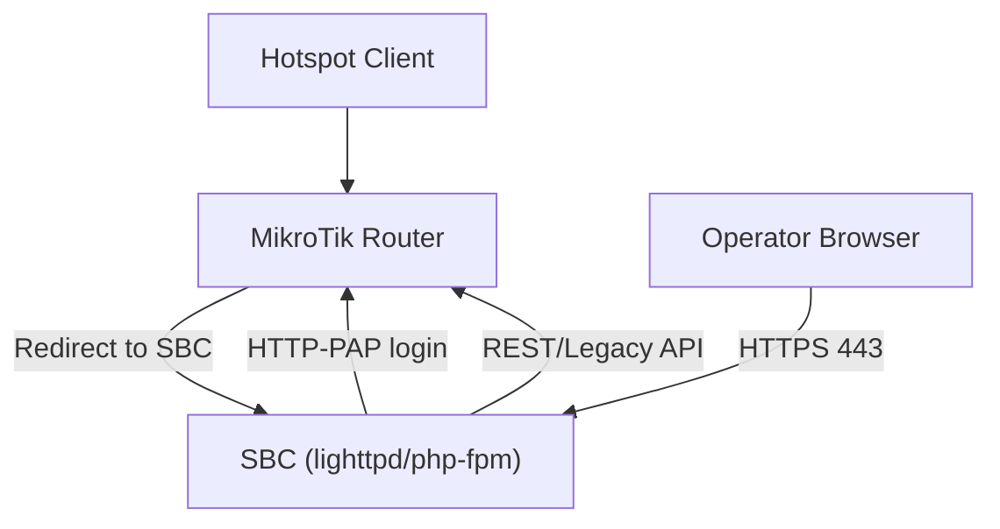
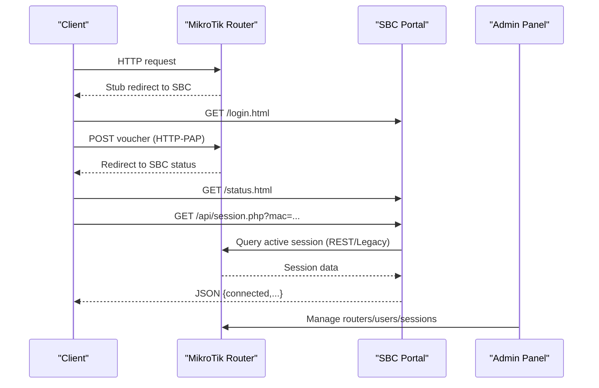
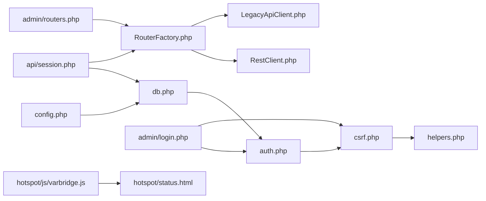

# Common Issues & Solutions

<cite>
**Referenced Files in This Document**
- [DEPLOYMENT.md](file://DEPLOYMENT.md)
- [install-sbc.sh](file://deploy/scripts/install-sbc.sh)
- [config.php](file://includes/config.php)
- [db.php](file://includes/db.php)
- [auth.php](file://includes/auth.php)
- [csrf.php](file://includes/csrf.php)
- [helpers.php](file://includes/helpers.php)
- [session.php](file://api/session.php)
- [RouterFactory.php](file://includes/RouterOS/RouterFactory.php)
- [RestClient.php](file://includes/RouterOS/RestClient.php)
- [LegacyApiClient.php](file://includes/RouterOS/LegacyApiClient.php)
- [routers.php](file://admin/routers.php)
- [login.php](file://admin/login.php)
- [varbridge.js](file://hotspot/js/varbridge.js)
- [status.html](file://hotspot/status.html)
</cite>

## Table of Contents
1. [Introduction](#introduction)
2. [Project Structure](#project-structure)
3. [Core Components](#core-components)
4. [Architecture Overview](#architecture-overview)
5. [Detailed Component Analysis](#detailed-component-analysis)
6. [Dependency Analysis](#dependency-analysis)
7. [Performance Considerations](#performance-considerations)
8. [Troubleshooting Guide](#troubleshooting-guide)
9. [Conclusion](#conclusion)

## Introduction
This document provides a practical troubleshooting guide for the MT-CONTROLLER-PISOWIFI system. It focuses on installation and setup problems, connectivity issues between the SBC and MikroTik routers, authentication and authorization failures, and performance-related symptoms such as slow page loads, database timeouts, and memory leaks. Each section includes diagnostic steps, error interpretations, and proven solutions grounded in the repository’s implementation.

## Project Structure
The system is split across two hosts:
- SBC: lighttpd + php-fpm serving the captive portal (port 80), admin panel (port 443), and session API (/api/session.php).
- MikroTik router: hotspot stubs, HTTP-PAP authentication, and REST or Legacy API used by the admin panel and status page.

**Diagram sources**
- [DEPLOYMENT.md:32-70](file://DEPLOYMENT.md#L32-L70)

**Section sources**
- [DEPLOYMENT.md:32-70](file://DEPLOYMENT.md#L32-L70)

## Core Components
- SBC installer provisions lighttpd, php-fpm, SQLite, TLS, and directory layout; it also initializes the database and creates the first admin user.
- Authentication uses Argon2id/bcrypt with rate limiting and audit logging.
- CSRF protection ensures state-changing admin POSTs are safe.
- Session API returns live connection data for the client MAC.
- Router clients abstract REST (v7) and Legacy (v6/v7) APIs.

Key responsibilities:
- Installation and environment setup: [install-sbc.sh](file://deploy/scripts/install-sbc.sh)
- Configuration constants: [config.php](file://includes/config.php)
- Database schema and connection: [db.php](file://includes/db.php)
- Auth, sessions, rate limits, audit: [auth.php](file://includes/auth.php)
- CSRF token generation and verification: [csrf.php](file://includes/csrf.php)
- Helpers (JSON output, formatting): [helpers.php](file://includes/helpers.php)
- Session lookup endpoint: [session.php](file://api/session.php)
- Router client factory: [RouterFactory.php](file://includes/RouterOS/RouterFactory.php)
- REST client: [RestClient.php](file://includes/RouterOS/RestClient.php)
- Legacy client: [LegacyApiClient.php](file://includes/RouterOS/LegacyApiClient.php)
- Admin router management UI: [routers.php](file://admin/routers.php)
- Admin login flow: [login.php](file://admin/login.php)
- Portal dual-mode bridge: [varbridge.js](file://hotspot/js/varbridge.js)
- Status page polling and fallback logic: [status.html](file://hotspot/status.html)

**Section sources**
- [install-sbc.sh:230-241](file://deploy/scripts/install-sbc.sh#L230-L241)
- [config.php:15-43](file://includes/config.php#L15-L43)
- [db.php:23-47](file://includes/db.php#L23-L47)
- [auth.php:23-57](file://includes/auth.php#L23-L57)
- [csrf.php:21-67](file://includes/csrf.php#L21-L67)
- [helpers.php:28-38](file://includes/helpers.php#L28-L38)
- [session.php:1-19](file://api/session.php#L1-L19)
- [RouterFactory.php:17-55](file://includes/RouterOS/RouterFactory.php#L17-L55)
- [RestClient.php:24-48](file://includes/RouterOS/RestClient.php#L24-L48)
- [LegacyApiClient.php:22-50](file://includes/RouterOS/LegacyApiClient.php#L22-L50)
- [routers.php:1-13](file://admin/routers.php#L1-L13)
- [login.php:1-10](file://admin/login.php#L1-L10)
- [varbridge.js:1-15](file://hotspot/js/varbridge.js#L1-L15)
- [status.html:461-558](file://hotspot/status.html#L461-L558)

## Architecture Overview
End-to-end flow:
1. Client associates and gets DHCP from the hotspot pool.
2. Router intercepts HTTP and serves a thin stub that redirects to the SBC portal.
3. The SBC portal renders login; the form posts voucher back to the router via HTTP-PAP.
4. On success, the router redirects to the SBC status page.
5. The status page polls /api/session.php for live session data.
6. The admin panel manages routers/users/sessions over REST or Legacy API.

**Diagram sources**
- [DEPLOYMENT.md:174-183](file://DEPLOYMENT.md#L174-L183)
- [session.php:58-83](file://api/session.php#L58-L83)
- [status.html:461-558](file://hotspot/status.html#L461-L558)

**Section sources**
- [DEPLOYMENT.md:174-183](file://DEPLOYMENT.md#L174-L183)

## Detailed Component Analysis

### SBC Installation and Web Server Setup
Common issues:
- Port 80 conflict with apache/nginx/pi-hole/dnsmasq.
- lighttpd fails to start due to missing TLS cert or mismatched php-fpm socket path.
- PHP-FPM not running or wrong pool configuration.

Diagnostics:
- Check listening ports and services.
- Validate lighttpd config and logs.
- Verify php-fpm socket existence and service status.

Solutions:
- Stop/disable conflicting web servers.
- Ensure self-signed certificate exists at the expected path.
- Confirm php-fpm pool matches the configured socket path.
- Re-run the installer to re-provision if needed.

**Section sources**
- [DEPLOYMENT.md:475-504](file://DEPLOYMENT.md#L475-L504)
- [install-sbc.sh:224-253](file://deploy/scripts/install-sbc.sh#L224-L253)
- [install-sbc.sh:256-272](file://deploy/scripts/install-sbc.sh#L256-L272)
- [install-sbc.sh:378-392](file://deploy/scripts/install-sbc.sh#L378-L392)

### Database Initialization Failures
Symptoms:
- First login or admin pages fail due to missing tables.
- SQLite errors when DB file or directories are inaccessible.

Root causes:
- Schema not initialized.
- Incorrect permissions on /var/lib/aircoins or AIRCOINS_DB path.
- Missing sqlite3 extension.

Diagnostics:
- Inspect installer step that initializes schema and admin user.
- Verify AIRCOINS_DB constant and directory creation.
- Check SQLite PRAGMAs for WAL and busy timeout.

Solutions:
- Run installer again to initialize schema and create admin user.
- Ensure www-data can write to the DB directory.
- Confirm PHP sqlite3 extension is enabled.

**Section sources**
- [install-sbc.sh:292-355](file://deploy/scripts/install-sbc.sh#L292-L355)
- [db.php:23-47](file://includes/db.php#L23-L47)
- [db.php:56-116](file://includes/db.php#L56-L116)
- [config.php:15-18](file://includes/config.php#L15-L18)

### MikroTik API Communication Failures
Symptoms:
- “Test connection” fails in admin panel.
- Auto-detect cannot find working API type/port.
- REST 401/415/404/400 or Legacy !trap/!fatal messages.

Root causes:
- Wrong API type selected (REST vs Legacy).
- Service disabled (www-ssl for REST, api/api-ssl for Legacy).
- Firewall blocking port 443/8728/8729.
- Invalid credentials or insufficient privileges.
- TLS verification misconfiguration.

Diagnostics:
- Use auto-detect to probe REST:443 then Legacy:8728.
- Review REST error mapping and Legacy trap handling.
- Check RouterOS services and firewall rules.

Solutions:
- Enable the correct service per RouterOS version.
- Adjust TLS verify setting for self-signed certs.
- Correct host/IP and credentials.
- Open required ports only from the SBC.

**Section sources**
- [DEPLOYMENT.md:485-492](file://DEPLOYMENT.md#L485-L492)
- [routers.php:52-97](file://admin/routers.php#L52-L97)
- [RestClient.php:270-315](file://includes/RouterOS/RestClient.php#L270-L315)
- [LegacyApiClient.php:70-94](file://includes/RouterOS/LegacyApiClient.php#L70-L94)
- [LegacyApiClient.php:101-167](file://includes/RouterOS/LegacyApiClient.php#L101-L167)

### Network Routing and Captive Portal Redirect Loops
Symptoms:
- Clients never reach the SBC portal.
- Redirect loops between router stub and SBC.
- Walled garden rules ineffective.

Root causes:
- Missing walled-garden rule allowing unauthenticated access to SBC port 80.
- Missing IP binding bypassing hotspot interception for the SBC.
- Incorrect sbcIP in router-stubs or network config.

Diagnostics:
- Verify walled-garden accept rule for dst-address=SBC_IP and dst-port=80.
- Confirm IP binding type=bypassed for SBC_IP.
- Ensure router-stubs contain the correct SBC IP.

Solutions:
- Add walled-garden accept rule for SBC IP and port 80.
- Add IP binding bypass for SBC IP.
- Update router-stubs with the actual SBC IP.

**Section sources**
- [DEPLOYMENT.md:341-343](file://DEPLOYMENT.md#L341-L343)
- [DEPLOYMENT.md:364-378](file://DEPLOYMENT.md#L364-L378)
- [DEPLOYMENT.md:380-384](file://DEPLOYMENT.md#L380-L384)

### Voucher Validation Errors
Symptoms:
- Login fails with invalid voucher or PAP errors.
- Error messages passed through but not displayed.

Root causes:
- Portal not using external mode correctly (varbridge.js not patching tokens).
- Router-stubs not substituting $(...) variables properly.
- Using non-esc variants in query strings causing malformed URLs.

Diagnostics:
- Check browser URL for mac/ip/login/logout/user parameters.
- Inspect varbridge.js external detection and DOM patching.
- Ensure router-stubs use -esc variants in URLs.

Solutions:
- Confirm varbridge.js runs before other scripts and detects external mode.
- Replace router-stubs with repo versions and update SBC IP.
- Use $(mac-esc), $(ip-esc), etc., in router-stubs URLs.

**Section sources**
- [DEPLOYMENT.md:483](file://DEPLOYMENT.md#L483)
- [varbridge.js:41-57](file://hotspot/js/varbridge.js#L41-L57)
- [varbridge.js:109-118](file://hotspot/js/varbridge.js#L109-L118)
- [varbridge.js:184-212](file://hotspot/js/varbridge.js#L184-L212)

### Session Management Issues
Symptoms:
- Admin session expires unexpectedly.
- Idle timeout redirects to login.
- Rate-limited lockout after multiple failed attempts.

Root causes:
- Idle timeout exceeded (default 900 seconds).
- Too many failed logins within the rate window (default 300 seconds).
- Cookie not set securely over non-TLS.

Diagnostics:
- Check session cookie flags and idle timeout behavior.
- Inspect login_attempts table for rate-limit entries.
- Verify HTTPS usage for admin panel.

Solutions:
- Use HTTPS for admin panel to ensure Secure cookie flag.
- Wait for rate-limit window to expire or clear attempts after successful login.
- Adjust AIRCOINS_IDLE_TIMEOUT and AIRCOINS_RATE_WINDOW if necessary.

**Section sources**
- [auth.php:65-83](file://includes/auth.php#L65-L83)
- [auth.php:103-138](file://includes/auth.php#L103-L138)
- [auth.php:151-190](file://includes/auth.php#L151-L190)
- [auth.php:202-231](file://includes/auth.php#L202-L231)
- [config.php:30-43](file://includes/config.php#L30-L43)

### CSRF Token Failures
Symptoms:
- Admin POST requests return 403 with “CSRF validation failed”.
- Forms submit without token or with stale token.

Root causes:
- Missing csrf_field() in forms.
- Session not active when verifying token.
- Stale or missing CSRF token in session.

Diagnostics:
- Inspect form submissions for csrf_token field.
- Verify csrf_verify() behavior and session activation.

Solutions:
- Include csrf_field() in all state-changing forms.
- Ensure aircoins_session_start() is called before csrf_verify().
- Regenerate session on successful login to avoid reuse.

**Section sources**
- [csrf.php:21-67](file://includes/csrf.php#L21-L67)
- [login.php:37-61](file://admin/login.php#L37-L61)

### Slow Page Loads and Database Timeouts
Symptoms:
- Admin dashboard updates slowly.
- Status page takes long to show session data.
- SQLite busy errors under load.

Root causes:
- High I/O contention on SQLite.
- Excessive polling frequency.
- Large monitor_samples table growth.

Diagnostics:
- Check SQLite PRAGMAs (WAL, synchronous, busy_timeout).
- Monitor status page polling interval.
- Inspect monitor_samples pruning policy.

Solutions:
- Keep WAL enabled and synchronous=NORMAL.
- Reduce polling frequency if needed.
- Prune monitor_samples to retain recent history.

**Section sources**
- [db.php:36-47](file://includes/db.php#L36-L47)
- [DEPLOYMENT.md:500](file://DEPLOYMENT.md#L500)
- [status.html:540-558](file://hotspot/status.html#L540-L558)

### Memory Leaks and Resource Usage
Symptoms:
- PHP-FPM workers consume increasing memory.
- Legacy API connections not closed.

Root causes:
- Long-lived sockets not closed in Legacy client.
- Excessive data retained in memory.

Diagnostics:
- Inspect LegacyApiClient destructor and close method.
- Monitor worker processes and memory usage.

Solutions:
- Ensure LegacyApiClient closes sockets on destruction.
- Avoid retaining large datasets in sessions or globals.

**Section sources**
- [LegacyApiClient.php:52-64](file://includes/RouterOS/LegacyApiClient.php#L52-L64)

## Dependency Analysis

**Diagram sources**
- [config.php:15-43](file://includes/config.php#L15-L43)
- [db.php:12-47](file://includes/db.php#L12-L47)
- [auth.php:14-16](file://includes/auth.php#L14-L16)
- [csrf.php:12-14](file://includes/csrf.php#L12-L14)
- [helpers.php:1-9](file://includes/helpers.php#L1-L9)
- [session.php:23-25](file://api/session.php#L23-L25)
- [RouterFactory.php:12-15](file://includes/RouterOS/RouterFactory.php#L12-L15)
- [RestClient.php:22-23](file://includes/RouterOS/RestClient.php#L22-L23)
- [LegacyApiClient.php:20-21](file://includes/RouterOS/LegacyApiClient.php#L20-L21)
- [routers.php:17-21](file://admin/routers.php#L17-L21)
- [login.php:14-16](file://admin/login.php#L14-L16)
- [varbridge.js:1-15](file://hotspot/js/varbridge.js#L1-L15)
- [status.html:13-15](file://hotspot/status.html#L13-L15)

**Section sources**
- [config.php:15-43](file://includes/config.php#L15-L43)
- [db.php:12-47](file://includes/db.php#L12-L47)
- [auth.php:14-16](file://includes/auth.php#L14-L16)
- [csrf.php:12-14](file://includes/csrf.php#L12-L14)
- [helpers.php:1-9](file://includes/helpers.php#L1-L9)
- [session.php:23-25](file://api/session.php#L23-L25)
- [RouterFactory.php:12-15](file://includes/RouterOS/RouterFactory.php#L12-L15)
- [RestClient.php:22-23](file://includes/RouterOS/RestClient.php#L22-L23)
- [LegacyApiClient.php:20-21](file://includes/RouterOS/LegacyApiClient.php#L20-L21)
- [routers.php:17-21](file://admin/routers.php#L17-L21)
- [login.php:14-16](file://admin/login.php#L14-L16)
- [varbridge.js:1-15](file://hotspot/js/varbridge.js#L1-L15)
- [status.html:13-15](file://hotspot/status.html#L13-L15)

## Performance Considerations
- Lighttpd serves static portal assets directly; PHP-FPM handles dynamic endpoints.
- PHP-FPM pool uses ondemand workers to minimize idle RAM.
- SQLite uses WAL and NORMAL synchronous mode to reduce disk sync overhead.
- Monitor samples are pruned automatically to limit storage growth.
- Status page polls /api/session.php every 10 seconds; adjust if needed.

[No sources needed since this section provides general guidance]

## Troubleshooting Guide

### Installation and Setup Problems
- Port conflicts: stop/disable apache/nginx/pi-hole; verify lighttpd listens on 80/443.
- lighttpd won’t start: validate config, check TLS cert path, ensure php-fpm socket path matches pool.
- PHP-FPM not running: restart service, check socket existence and logs.

Steps:
- ss -tlnp | grep ':80' and ':443'.
- lighttpd -t -f /etc/lighttpd/lighttpd.conf.
- ls -l /run/php/php*-fpm-aircoins.sock.
- systemctl status lighttpd php*-fpm.

**Section sources**
- [DEPLOYMENT.md:475-504](file://DEPLOYMENT.md#L475-L504)
- [install-sbc.sh:378-392](file://deploy/scripts/install-sbc.sh#L378-L392)

### Connectivity Problems
- Router API unreachable: enable correct service (www-ssl for REST, api/api-ssl for Legacy), open ports from SBC, verify credentials and TLS settings.
- Redirect loops: add walled-garden accept rule for SBC IP:80 and IP binding bypass for SBC IP.
- Captive portal not loading: ensure router-stubs have correct SBC IP and use -esc variants in URLs.

Steps:
- Test connection in admin panel; use auto-detect.
- Check RouterOS services and firewall.
- Verify walled-garden and IP binding rules.
- Confirm router-stubs content.

**Section sources**
- [DEPLOYMENT.md:341-343](file://DEPLOYMENT.md#L341-L343)
- [DEPLOYMENT.md:364-378](file://DEPLOYMENT.md#L364-L378)
- [DEPLOYMENT.md:485-492](file://DEPLOYMENT.md#L485-L492)
- [routers.php:52-97](file://admin/routers.php#L52-L97)

### Authentication and Authorization Problems
- Admin login locked out: wait for rate-limit window or clear attempts after success.
- CSRF validation failed: include csrf_field() in forms; ensure session active.
- Session expired: use HTTPS for Secure cookie; adjust idle timeout if needed.

Steps:
- Inspect login_attempts table and rate-limit constants.
- Verify CSRF token presence in POST requests.
- Confirm TLS usage and session cookie flags.

**Section sources**
- [auth.php:103-138](file://includes/auth.php#L103-L138)
- [auth.php:151-190](file://includes/auth.php#L151-L190)
- [auth.php:202-231](file://includes/auth.php#L202-L231)
- [csrf.php:21-67](file://includes/csrf.php#L21-L67)
- [config.php:30-43](file://includes/config.php#L30-L43)

### Performance Problems
- Slow page loads: check SQLite PRAGMAs, reduce polling frequency, prune monitor_samples.
- Database timeouts: ensure WAL enabled, busy_timeout set appropriately.
- Memory leaks: ensure LegacyApiClient closes sockets; avoid retaining large data.

Steps:
- Verify db.php PRAGMAs.
- Inspect status.html polling interval.
- Monitor PHP-FPM worker memory and logs.

**Section sources**
- [db.php:36-47](file://includes/db.php#L36-L47)
- [status.html:540-558](file://hotspot/status.html#L540-L558)
- [LegacyApiClient.php:52-64](file://includes/RouterOS/LegacyApiClient.php#L52-L64)

## Conclusion
Most issues stem from incorrect network configuration (walled garden/IP binding), misconfigured RouterOS services, or misaligned SBC deployment paths. Use the provided diagnostics to isolate each layer—web server, PHP-FPM, SQLite, auth/CSRF, session API, and router clients—and apply the targeted fixes. For persistent problems, validate the end-to-end redirect flow and confirm that both router-stubs and SBC portal assets are consistent with the deployed SBC IP and API endpoints.