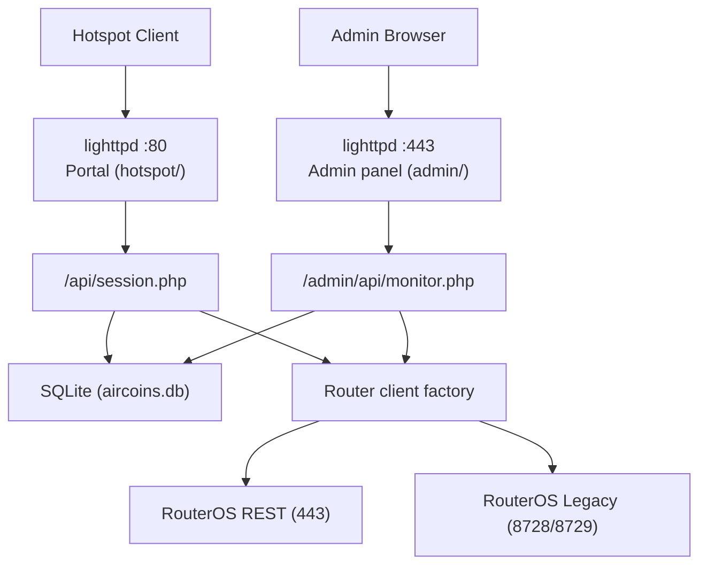
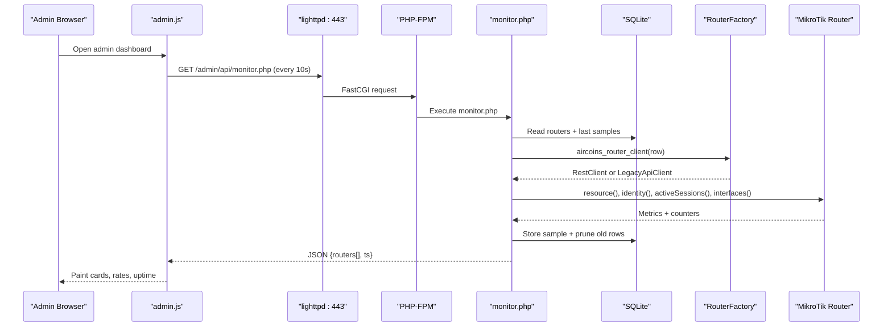
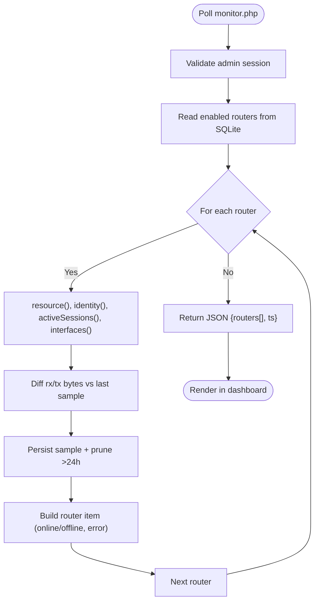
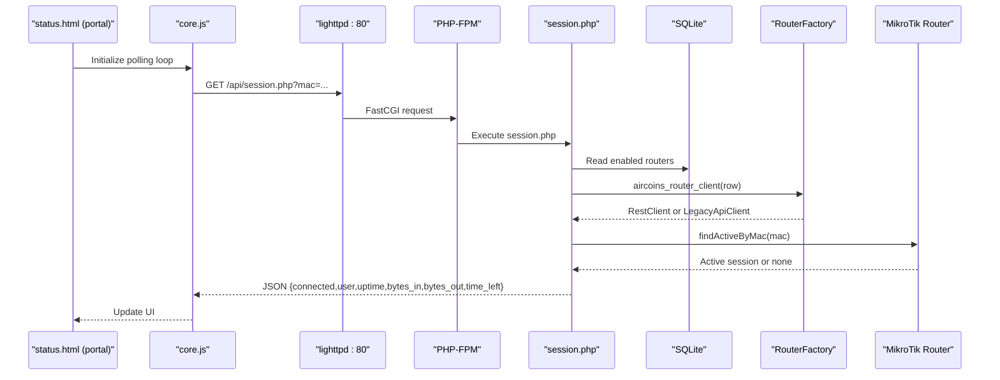
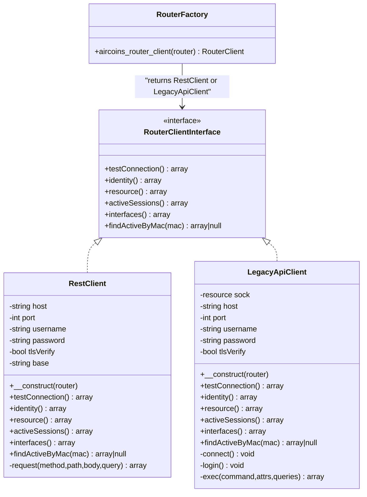
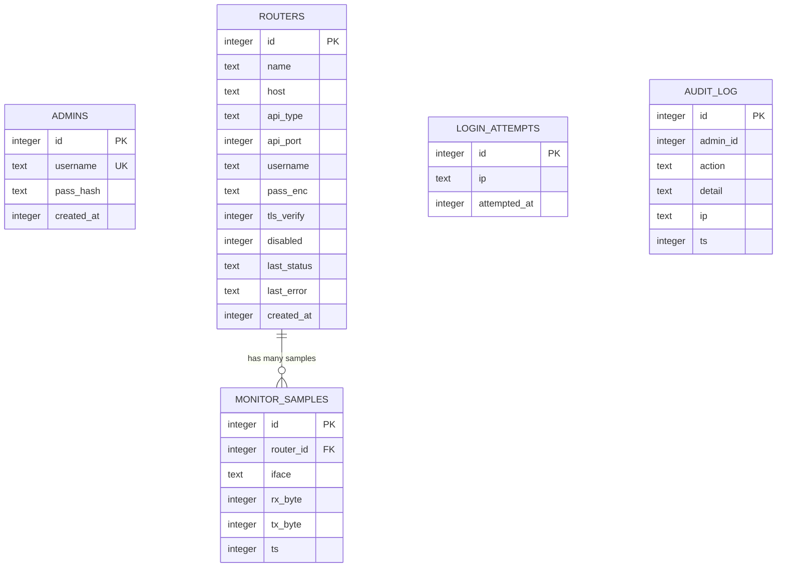
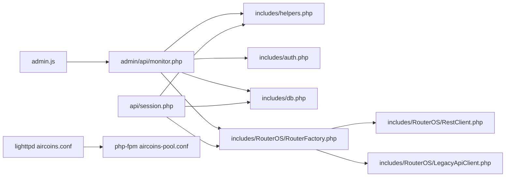

# Diagnostic Tools & Techniques

<cite>
**Referenced Files in This Document**
- [monitor.php](file://admin/api/monitor.php)
- [admin.js](file://admin/assets/admin.js)
- [session.php](file://api/session.php)
- [core.js](file://hotspot/assets/js/core.js)
- [db.php](file://includes/db.php)
- [config.php](file://includes/config.php)
- [RouterFactory.php](file://includes/RouterOS/RouterFactory.php)
- [RestClient.php](file://includes/RouterOS/RestClient.php)
- [LegacyApiClient.php](file://includes/RouterOS/LegacyApiClient.php)
- [aircoins.conf](file://deploy/lighttpd/aircoins.conf)
- [aircoins-pool.conf](file://deploy/php-fpm/aircoins-pool.conf)
- [DEPLOYMENT.md](file://DEPLOYMENT.md)
</cite>

## Table of Contents
1. [Introduction](#introduction)
2. [Project Structure](#project-structure)
3. [Core Components](#core-components)
4. [Architecture Overview](#architecture-overview)
5. [Detailed Component Analysis](#detailed-component-analysis)
6. [Dependency Analysis](#dependency-analysis)
7. [Performance Considerations](#performance-considerations)
8. [Troubleshooting Guide](#troubleshooting-guide)
9. [Conclusion](#conclusion)

## Introduction
This document explains how to diagnose and troubleshoot the MT-CONTROLLER-PISOWIFI system. It covers:
- The built-in admin monitoring dashboard and its metrics collection pipeline.
- Debugging the captive portal interface and JavaScript with browser developer tools.
- Log locations, log levels, and analysis techniques for PHP, lighttpd, and SQLite.
- Command-line utilities and scripts for health checks, network connectivity testing, and database integrity verification.
- Debugging strategies for RouterOS API communication, session tracking, and real-time monitoring.
- Performance profiling techniques and bottleneck identification methods.

The guidance is grounded in the repository’s actual implementation and deployment configuration.

## Project Structure
At a high level, diagnostics span three layers:
- Web layer: lighttpd serves the captive portal on port 80 and the admin panel on port 443; PHP-FPM handles PHP endpoints.
- Application layer: PHP endpoints collect router telemetry, manage sessions, and expose JSON APIs.
- Device layer: MikroTik routers are accessed via REST (v7) or Legacy binary API (v6/v7).

**Diagram sources**
- [aircoins.conf:128-163](file://deploy/lighttpd/aircoins.conf#L128-L163)
- [session.php:27-31](file://api/session.php#L27-L31)
- [monitor.php:26-28](file://admin/api/monitor.php#L26-L28)
- [db.php:36-47](file://includes/db.php#L36-L47)
- [RestClient.php:46-48](file://includes/RouterOS/RestClient.php#L46-L48)
- [LegacyApiClient.php:70-94](file://includes/RouterOS/LegacyApiClient.php#L70-L94)

**Section sources**
- [aircoins.conf:30-109](file://deploy/lighttpd/aircoins.conf#L30-L109)
- [DEPLOYMENT.md:32-70](file://DEPLOYMENT.md#L32-L70)

## Core Components
Key diagnostic components:
- Admin monitoring dashboard: polls `/admin/api/monitor.php` every 10 seconds, displays per-router identity, resource usage, active sessions, and per-interface traffic rates.
- Portal session API: unauthenticated, read-only endpoint returning live session data for a given MAC address.
- Database persistence: SQLite with WAL mode, busy timeout, and schema initialization.
- Router clients: unified interface over REST or Legacy API.

Operational highlights:
- Admin monitor computes byte-per-second rates by diffing stored samples and prunes old samples after each poll.
- Session API normalizes MAC addresses and scans enabled routers until it finds an active session.
- PHP-FPM pool runs on-demand with low memory footprint; errors go to a dedicated log file.
- lighttpd disables access logging to reduce SD-card wear and maps `/api/` only under HTTP.

**Section sources**
- [monitor.php:1-188](file://admin/api/monitor.php#L1-L188)
- [admin.js:294-397](file://admin/assets/admin.js#L294-L397)
- [session.php:1-107](file://api/session.php#L1-L107)
- [db.php:14-47](file://includes/db.php#L14-L47)
- [aircoins-pool.conf:38-73](file://deploy/php-fpm/aircoins-pool.conf#L38-L73)
- [aircoins.conf:43-44](file://deploy/lighttpd/aircoins.conf#L43-L44)

## Architecture Overview
The monitoring and session flows involve coordinated interactions between the browser, web server, PHP endpoints, SQLite, and MikroTik routers.

**Diagram sources**
- [admin.js:358-397](file://admin/assets/admin.js#L358-L397)
- [monitor.php:101-187](file://admin/api/monitor.php#L101-L187)
- [db.php:56-116](file://includes/db.php#L56-L116)
- [RouterFactory.php:29-55](file://includes/RouterOS/RouterFactory.php#L29-L55)
- [RestClient.php:54-86](file://includes/RouterOS/RestClient.php#L54-L86)
- [LegacyApiClient.php:430-463](file://includes/RouterOS/LegacyApiClient.php#L430-L463)

## Detailed Component Analysis

### Built-in Monitoring Dashboard and Metrics Collection
The admin dashboard renders one card per enabled router. Each card shows:
- Identity, version, board name.
- CPU load percentage and memory used vs total.
- Uptime and active session count.
- Per-interface running state and computed rx/tx rates.

Metrics collection pipeline:
1. `admin.js` polls `/admin/api/monitor.php` every 10 seconds.
2. `monitor.php` authenticates the admin session and reads all enabled routers from SQLite.
3. For each router, it queries resource stats, identity, active sessions, and interfaces.
4. Interface traffic rates are derived by comparing current byte counters with the last stored sample; results are persisted and older than 24 hours are pruned.
5. Errors per router are captured without failing the entire response.

**Diagram sources**
- [admin.js:358-397](file://admin/assets/admin.js#L358-L397)
- [monitor.php:54-99](file://admin/api/monitor.php#L54-L99)
- [monitor.php:101-187](file://admin/api/monitor.php#L101-L187)
- [db.php:103-116](file://includes/db.php#L103-L116)

**Section sources**
- [admin.js:15-16](file://admin/assets/admin.js#L15-L16)
- [admin.js:358-397](file://admin/assets/admin.js#L358-L397)
- [monitor.php:29-50](file://admin/api/monitor.php#L29-L50)
- [monitor.php:116-187](file://admin/api/monitor.php#L116-L187)

### Captive Portal Session Tracking and Real-Time Status
The portal status page uses `/api/session.php` to determine whether the caller’s MAC has an active session on any enabled router.

Key behaviors:
- Endpoint accepts a normalized MAC parameter and returns a simple JSON structure indicating connection state and session fields.
- It iterates enabled routers and stops at the first active match.
- All external calls are wrapped in try/catch to avoid leaking stack traces.
- CORS is enabled for this endpoint only.

**Diagram sources**
- [core.js:30-211](file://hotspot/assets/js/core.js#L30-L211)
- [session.php:50-106](file://api/session.php#L50-L106)
- [RouterFactory.php:29-55](file://includes/RouterOS/RouterFactory.php#L29-L55)
- [RestClient.php:214-222](file://includes/RouterOS/RestClient.php#L214-L222)
- [LegacyApiClient.php:592-599](file://includes/RouterOS/LegacyApiClient.php#L592-L599)

**Section sources**
- [session.php:1-107](file://api/session.php#L1-L107)
- [core.js:30-211](file://hotspot/assets/js/core.js#L30-L211)

### RouterOS API Communication Diagnostics
Two client implementations provide a unified interface:
- REST client: HTTPS Basic auth, JSON bodies, cURL-based, 10s request timeout.
- Legacy client: Binary sentence protocol over TCP/TLS, dual-mode login, explicit handling of `!re`, `!done`, `!trap`, `!fatal`.

Diagnostics tips:
- Use “Test connection” in the admin panel to validate credentials and fetch identity/version.
- Check service enablement on the router (`www-ssl` for REST, `api`/`api-ssl` for Legacy).
- Inspect error messages: REST builds descriptive exceptions from HTTP status and JSON body; Legacy surfaces trap/fatal messages.

**Diagram sources**
- [RestClient.php:24-48](file://includes/RouterOS/RestClient.php#L24-L48)
- [RestClient.php:54-86](file://includes/RouterOS/RestClient.php#L54-L86)
- [RestClient.php:270-316](file://includes/RouterOS/RestClient.php#L270-L316)
- [LegacyApiClient.php:22-50](file://includes/RouterOS/LegacyApiClient.php#L22-L50)
- [LegacyApiClient.php:70-167](file://includes/RouterOS/LegacyApiClient.php#L70-L167)
- [LegacyApiClient.php:430-463](file://includes/RouterOS/LegacyApiClient.php#L430-L463)
- [RouterFactory.php:29-55](file://includes/RouterOS/RouterFactory.php#L29-L55)

**Section sources**
- [RestClient.php:1-459](file://includes/RouterOS/RestClient.php#L1-L459)
- [LegacyApiClient.php:1-667](file://includes/RouterOS/LegacyApiClient.php#L1-L667)
- [RouterFactory.php:1-56](file://includes/RouterOS/RouterFactory.php#L1-L56)

### Database Schema and Monitoring Samples
SQLite stores administrators, routers, login attempts, audit logs, and monitor samples. The schema is idempotent and indexes support efficient lookups.

Important points:
- WAL journal mode and synchronous=NORMAL reduce write amplification.
- Busy timeout prevents contention under concurrent requests.
- Monitor samples table is indexed by `(router_id, iface, ts)` and pruned to 24 hours.

**Diagram sources**
- [db.php:56-116](file://includes/db.php#L56-L116)

**Section sources**
- [db.php:14-47](file://includes/db.php#L14-L47)
- [db.php:56-116](file://includes/db.php#L56-L116)

## Dependency Analysis
Component relationships relevant to diagnostics:
- `admin.js` depends on `/admin/api/monitor.php` for live metrics.
- `monitor.php` depends on `includes/db.php`, `includes/auth.php`, and `includes/RouterOS/RouterFactory.php`.
- `session.php` depends on `includes/helpers.php`, `includes/db.php`, and `includes/RouterOS/RouterFactory.php`.
- `RouterFactory.php` selects between `RestClient.php` and `LegacyApiClient.php`.
- lighttpd routes `.php` to PHP-FPM and aliases `/api/` under HTTP only.

**Diagram sources**
- [admin.js:358-397](file://admin/assets/admin.js#L358-L397)
- [monitor.php:21-24](file://admin/api/monitor.php#L21-L24)
- [session.php:23-25](file://api/session.php#L23-L25)
- [RouterFactory.php:12-15](file://includes/RouterOS/RouterFactory.php#L12-L15)
- [aircoins.conf:102-110](file://deploy/lighttpd/aircoins.conf#L102-L110)
- [aircoins-pool.conf:21-36](file://deploy/php-fpm/aircoins-pool.conf#L21-L36)

**Section sources**
- [monitor.php:21-24](file://admin/api/monitor.php#L21-L24)
- [session.php:23-25](file://api/session.php#L23-L25)
- [RouterFactory.php:12-15](file://includes/RouterOS/RouterFactory.php#L12-L15)
- [aircoins.conf:102-110](file://deploy/lighttpd/aircoins.conf#L102-L110)
- [aircoins-pool.conf:21-36](file://deploy/php-fpm/aircoins-pool.conf#L21-L36)

## Performance Considerations
- lighttpd access logging is intentionally disabled to reduce flash wear on SBCs.
- SQLite runs in WAL mode with `synchronous=NORMAL` and a busy timeout to balance durability and performance.
- PHP-FPM pool uses `ondemand` process management with small limits suitable for shared SBC workloads.
- Monitor samples are automatically pruned to 24 hours to bound table growth.

Recommendations:
- Enable slowlog in PHP-FPM temporarily to identify stuck router API calls.
- Use lightweight caching if dashboard polling frequency needs to increase.
- Ensure time synchronization to avoid spurious session timeouts and TLS warnings.

**Section sources**
- [aircoins.conf:43-44](file://deploy/lighttpd/aircoins.conf#L43-L44)
- [db.php:42-47](file://includes/db.php#L42-L47)
- [aircoins-pool.conf:38-51](file://deploy/php-fpm/aircoins-pool.conf#L38-L51)
- [monitor.php:164-166](file://admin/api/monitor.php#L164-L166)
- [DEPLOYMENT.md:500-502](file://DEPLOYMENT.md#L500-L502)

## Troubleshooting Guide

### Browser Developer Tools for the Captive Portal
Useful areas:
- Network tab: inspect `/api/session.php` responses and status codes; verify CORS headers.
- Console tab: check for JavaScript errors in `core.js` and related assets.
- Elements tab: confirm that template tags and variables injected by `varbridge.js` are present.
- Application tab: review local storage values used by the portal flow.

Common issues:
- Blank or incorrect MAC parameter leads to `{connected:false}`.
- Missing `/api/` alias under HTTP causes 404 for session lookup.
- Router stubs not updated with correct SBC IP cause redirect loops.

**Section sources**
- [session.php:50-56](file://api/session.php#L50-L56)
- [core.js:30-211](file://hotspot/assets/js/core.js#L30-L211)
- [DEPLOYMENT.md:494-498](file://DEPLOYMENT.md#L494-L498)

### Logs and Log Levels

#### PHP (PHP-FPM)
- Error log path: `/var/log/php-fpm-aircoins.log`.
- Errors are logged but not displayed to browsers (`display_errors = Off`).
- Slowlog can be enabled to trace requests slower than a threshold.

Analysis techniques:
- Tail the error log while reproducing issues.
- Enable slowlog temporarily to capture backtraces for long-running router API calls.

**Section sources**
- [aircoins-pool.conf:60-68](file://deploy/php-fpm/aircoins-pool.conf#L60-L68)

#### lighttpd
- Access logging is disabled to reduce SD-card wear.
- Configuration validation command: `lighttpd -t -f /etc/lighttpd/lighttpd.conf`.
- Service logs can be inspected via `journalctl -u lighttpd`.

Analysis techniques:
- Validate config before restarting.
- Check service status and recent logs when pages fail to load.

**Section sources**
- [aircoins.conf:43-44](file://deploy/lighttpd/aircoins.conf#L43-L44)
- [DEPLOYMENT.md:504-504](file://DEPLOYMENT.md#L504-L504)

#### SQLite
- Database file: `/var/lib/aircoins/aircoins.db`.
- Journal mode: WAL; synchronous: NORMAL; foreign keys: ON.
- Indexes exist for login attempts and monitor samples.

Integrity verification:
- Use `sqlite3` CLI to run integrity checks against the database file.
- Confirm WAL mode and pragmas via PRAGMA queries.

**Section sources**
- [db.php:36-47](file://includes/db.php#L36-L47)
- [db.php:114-116](file://includes/db.php#L114-L116)
- [DEPLOYMENT.md:553-554](file://DEPLOYMENT.md#L553-L554)

### Command-Line Utilities and Scripts

System health checks:
- Verify ports: `ss -tlnp | grep -E ':(80|443)\b'`.
- Check services: `systemctl status lighttpd php*-fpm --no-pager`.
- Validate lighttpd config: `sudo lighttpd -t -f /etc/lighttpd/lighttpd.conf`.

Network connectivity testing:
- Test portal: `curl -I http://localhost/`.
- Test session API: `curl -s "http://localhost/api/session.php?mac=00:00:00:00:00:00"`.
- Test admin panel: `curl -kI https://localhost/`.

Database integrity verification:
- Run SQLite integrity check: `sqlite3 /var/lib/aircoins/aircoins.db "PRAGMA integrity_check;"`.
- Inspect WAL mode: `sqlite3 /var/lib/aircoins/aircoins.db "PRAGMA journal_mode;"`.

Scripts:
- Installer: `deploy/scripts/install-sbc.sh`.
- Portal sync: `deploy/scripts/update-portal.sh`.

**Section sources**
- [DEPLOYMENT.md:295-304](file://DEPLOYMENT.md#L295-L304)
- [DEPLOYMENT.md:504-504](file://DEPLOYMENT.md#L504-L504)
- [DEPLOYMENT.md:553-554](file://DEPLOYMENT.md#L553-L554)

### RouterOS API Communication Debugging
REST:
- Common errors include unauthorized, unsupported media type, bad request, and not found.
- Ensure `www-ssl` is enabled and Basic auth works.

Legacy:
- Watch for `!trap` and `!fatal` sentences; these indicate authentication or protocol errors.
- Verify service enablement for `api` or `api-ssl`.

Auto-detect:
- Use the admin panel’s auto-detect button to probe REST (443) then Legacy (8728).

**Section sources**
- [DEPLOYMENT.md:485-492](file://DEPLOYMENT.md#L485-L492)
- [RestClient.php:311-340](file://includes/RouterOS/RestClient.php#L311-L340)
- [LegacyApiClient.php:124-167](file://includes/RouterOS/LegacyApiClient.php#L124-L167)

### Session Tracking and Real-Time Monitoring
- If `/api/session.php` returns `connected:false`:
  - Verify the MAC parameter is correct.
  - Confirm at least one router is enabled and reachable.
  - Ensure the `/api/` alias applies under HTTP.
- Admin dashboard:
  - Cards show offline states with error messages when a router is unreachable.
  - Rates are zero when there is no previous sample or elapsed time.

**Section sources**
- [DEPLOYMENT.md:494-498](file://DEPLOYMENT.md#L494-L498)
- [monitor.php:179-182](file://admin/api/monitor.php#L179-L182)
- [monitor.php:93-99](file://admin/api/monitor.php#L93-L99)

### Performance Profiling and Bottleneck Identification
- Enable PHP-FPM slowlog to detect slow router API calls.
- Monitor dashboard polling interval is fixed at 10 seconds; increasing frequency may increase load.
- SQLite WAL and index usage help mitigate contention; ensure tables remain within expected size due to pruning.

**Section sources**
- [aircoins-pool.conf:65-68](file://deploy/php-fpm/aircoins-pool.conf#L65-L68)
- [admin.js:15-16](file://admin/assets/admin.js#L15-L16)
- [monitor.php:164-166](file://admin/api/monitor.php#L164-L166)

## Conclusion
The MT-CONTROLLER-PISOWIFI system provides robust diagnostic capabilities through its admin dashboard, session API, and layered logging. By combining browser developer tools, log analysis, command-line utilities, and targeted RouterOS API checks, operators can quickly identify and resolve issues across the portal, application, database, and device layers. The design emphasizes safety, minimal overhead, and clear separation of concerns, making troubleshooting straightforward even on constrained single-board computers.