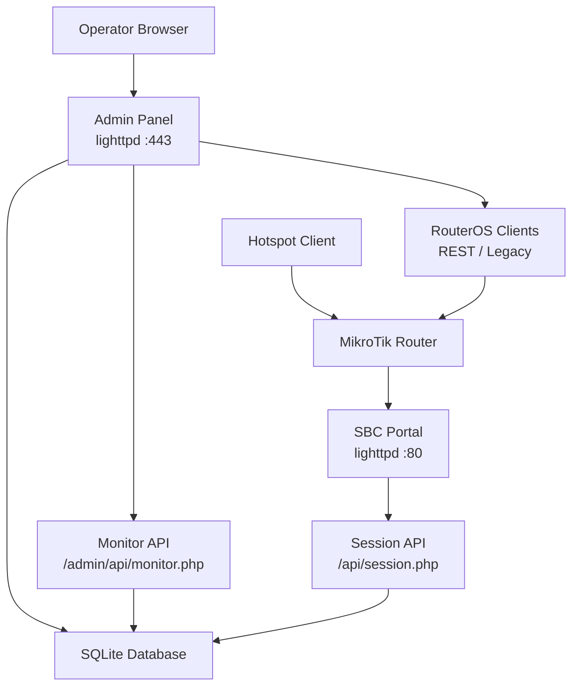
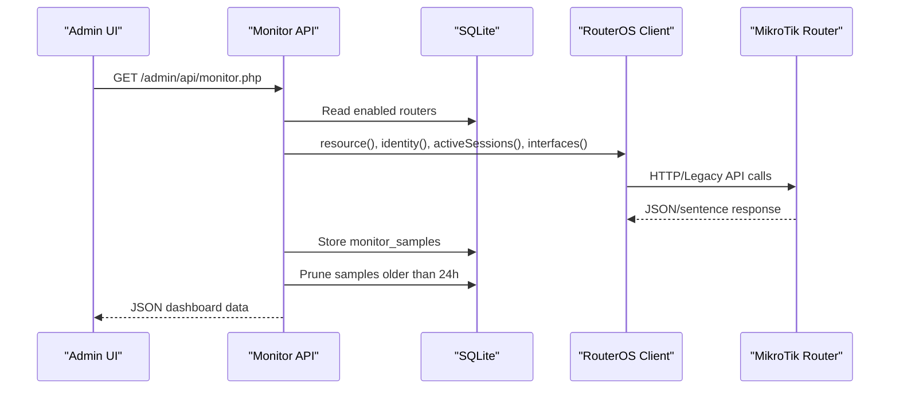
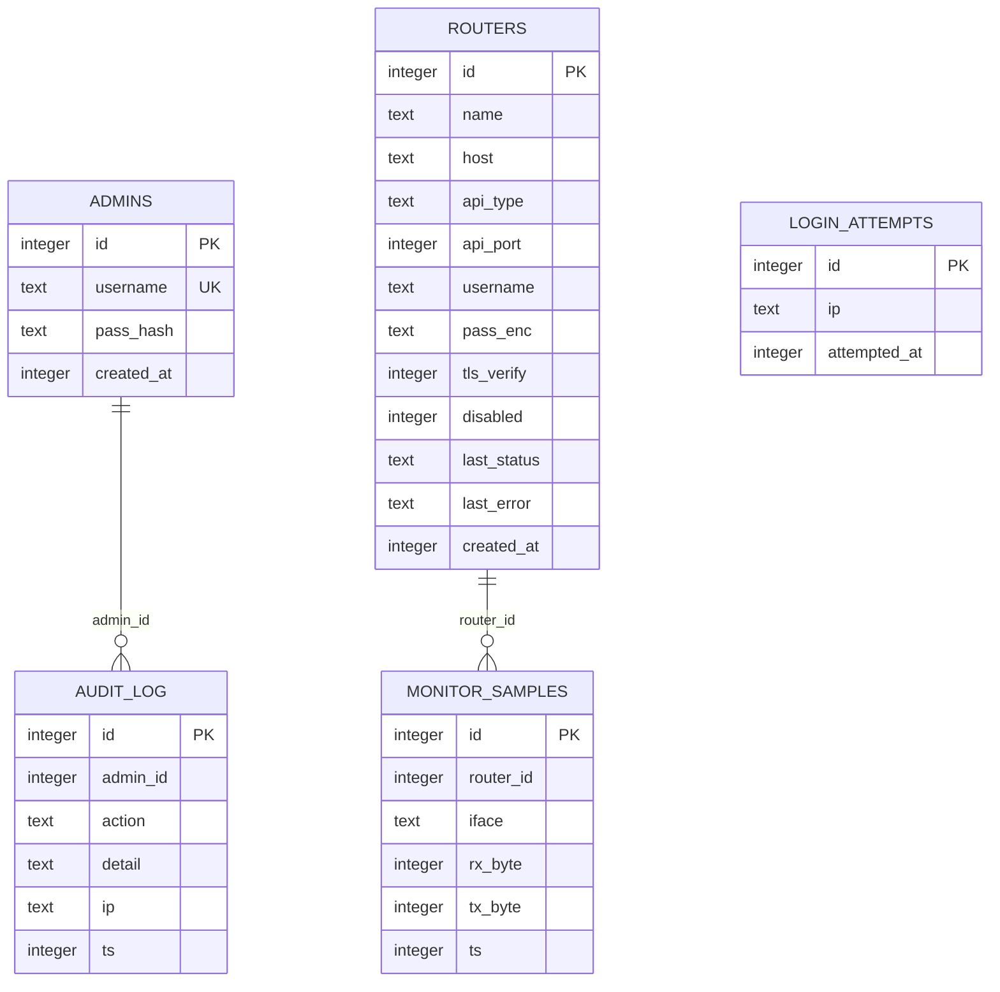
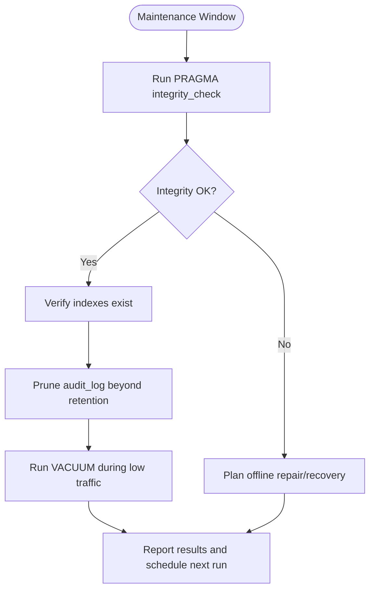
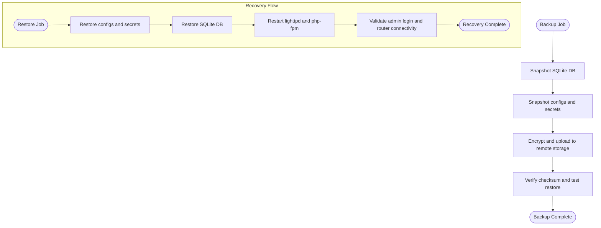
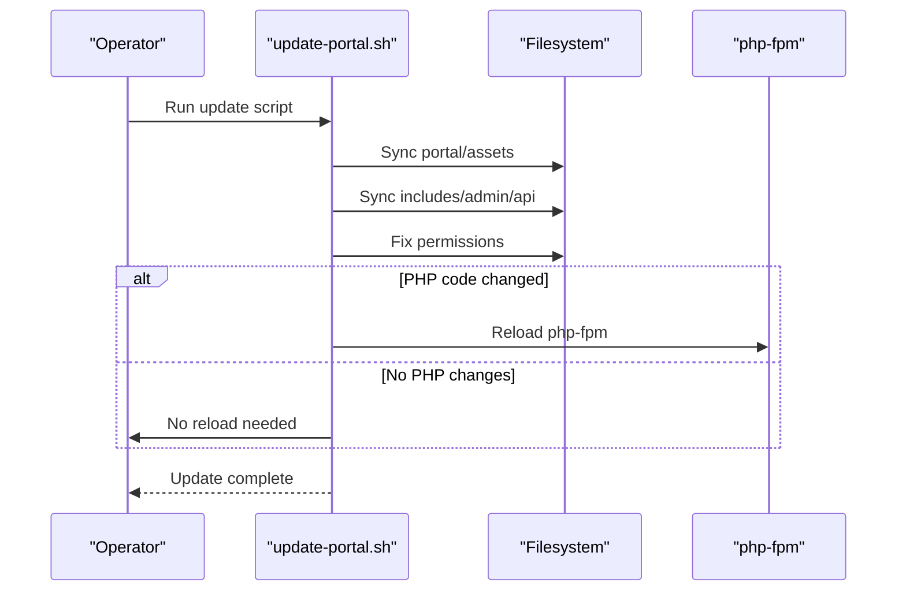
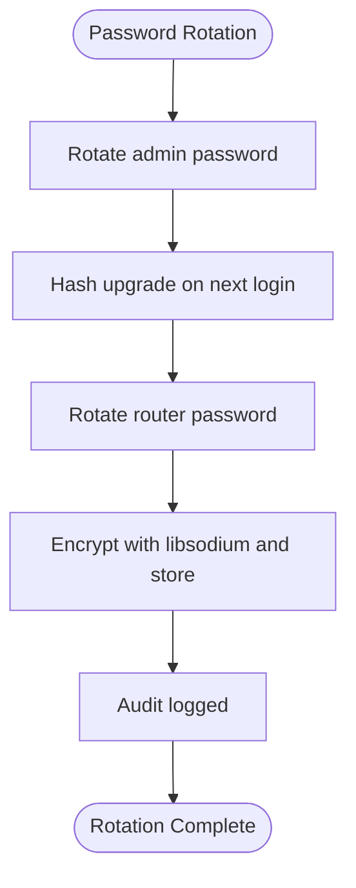
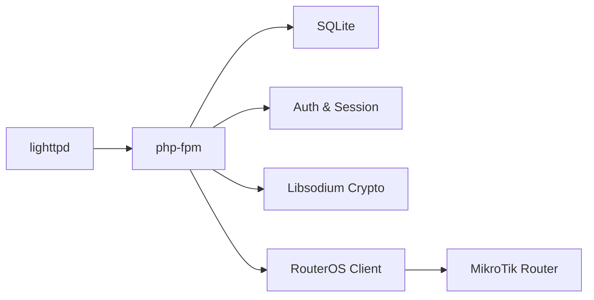

# Maintenance Procedures

<cite>
**Referenced Files in This Document**
- [DEPLOYMENT.md](file://DEPLOYMENT.md)
- [includes/db.php](file://includes/db.php)
- [includes/config.php](file://includes/config.php)
- [includes/auth.php](file://includes/auth.php)
- [includes/crypto.php](file://includes/crypto.php)
- [admin/login.php](file://admin/login.php)
- [admin/logout.php](file://admin/logout.php)
- [admin/api/monitor.php](file://admin/api/monitor.php)
- [deploy/scripts/update-portal.sh](file://deploy/scripts/update-portal.sh)
</cite>

## Table of Contents
1. [Introduction](#introduction)
2. [Project Structure](#project-structure)
3. [Core Components](#core-components)
4. [Architecture Overview](#architecture-overview)
5. [Detailed Component Analysis](#detailed-component-analysis)
6. [Dependency Analysis](#dependency-analysis)
7. [Performance Considerations](#performance-considerations)
8. [Troubleshooting Guide](#troubleshooting-guide)
9. [Conclusion](#conclusion)
10. [Appendices](#appendices)

## Introduction
This document defines maintenance procedures for keeping the MT-CONTROLLER-PISOWIFI system running reliably in production. It covers:
- Routine database maintenance for the SQLite-backed application data.
- Backup and recovery for both application data and configuration files.
- Update procedures using the provided update script, including version compatibility considerations and rollback guidance.
- Security maintenance tasks such as password rotation, certificate updates, and audit log review.
- Capacity planning, resource monitoring, and scaling considerations.
- Recommended maintenance schedules and automated task recommendations.

The system runs a lightweight PHP portal and admin panel on a single-board computer behind a MikroTik hotspot. Storage is SQLite; router credentials are encrypted at rest with libsodium; admin passwords are hashed with Argon2id (with bcrypt fallback). The deployment guide also documents the runtime layout, services, and security posture that inform these maintenance procedures.

## Project Structure
At a high level, the repository contains:
- `hotspot/` — captive portal assets served by lighttpd on port 80.
- `admin/` — admin panel UI and endpoints served by lighttpd/php-fpm on port 443.
- `api/session.php` — portal-facing session status endpoint.
- `includes/` — shared PHP core (configuration, authentication, crypto, database, RouterOS clients).
- `deploy/` — installation and update scripts, lighttpd/php-fpm configs, and MikroTik RouterOS setup.
- `router-stubs/` — thin redirect pages uploaded to the MikroTik `/hotspot` directory.

**Diagram sources**
- [DEPLOYMENT.md:32-70](file://DEPLOYMENT.md#L32-L70)
- [DEPLOYMENT.md:508-557](file://DEPLOYMENT.md#L508-L557)

**Section sources**
- [DEPLOYMENT.md:32-70](file://DEPLOYMENT.md#L32-L70)
- [DEPLOYMENT.md:508-557](file://DEPLOYMENT.md#L508-L557)

## Core Components
This section summarizes the components most relevant to maintenance.

- **Configuration**: Central constants define paths for the SQLite database file and the libsodium key, plus session and rate-limit parameters.
- **Database layer**: A singleton PDO connection opens the SQLite database with WAL mode, busy timeout, synchronous NORMAL, and foreign keys enabled. Schema creation is idempotent.
- **Authentication**: Admin login uses Argon2id (bcrypt fallback), rate limiting per IP, idle session timeouts, CSRF protection, and audit logging.
- **Crypto**: Router passwords are encrypted at rest with libsodium secretbox using a 32-byte key stored outside the web root.
- **Monitoring**: The monitor endpoint polls routers via REST or Legacy API, computes per-interface traffic rates from stored samples, and prunes old samples.
- **Update script**: Re-syncs portal, admin, includes, and api directories, fixes permissions, and reloads php-fpm only when PHP code changes.

**Section sources**
- [includes/config.php:15-43](file://includes/config.php#L15-L43)
- [includes/db.php:23-47](file://includes/db.php#L23-L47)
- [includes/db.php:56-116](file://includes/db.php#L56-L116)
- [includes/auth.php:23-57](file://includes/auth.php#L23-L57)
- [includes/auth.php:65-83](file://includes/auth.php#L65-L83)
- [includes/auth.php:103-138](file://includes/auth.php#L103-L138)
- [includes/auth.php:151-190](file://includes/auth.php#L151-L190)
- [includes/auth.php:202-231](file://includes/auth.php#L202-L231)
- [includes/auth.php:269-281](file://includes/auth.php#L269-L281)
- [includes/crypto.php:25-48](file://includes/crypto.php#L25-L48)
- [includes/crypto.php:91-137](file://includes/crypto.php#L91-L137)
- [admin/api/monitor.php:101-187](file://admin/api/monitor.php#L101-L187)
- [deploy/scripts/update-portal.sh:60-116](file://deploy/scripts/update-portal.sh#L60-L116)

## Architecture Overview
The maintenance-relevant architecture consists of:
- Lighttpd serving static portal content on port 80 and the admin panel on port 443.
- PHP-FPM handling admin endpoints and APIs.
- SQLite storing admin accounts, router definitions, login attempts, audit logs, and monitor samples.
- RouterOS clients communicating over REST (v7) or Legacy API (v6/v7).

**Diagram sources**
- [admin/api/monitor.php:101-187](file://admin/api/monitor.php#L101-L187)
- [includes/db.php:56-116](file://includes/db.php#L56-L116)

## Detailed Component Analysis

### Database Maintenance Procedures
The application uses SQLite with WAL mode and a small set of tables. Maintenance focuses on integrity checks, index management, and periodic cleanup of time-bound tables.

#### Data Model

**Diagram sources**
- [includes/db.php:56-116](file://includes/db.php#L56-L116)

#### Routine Tasks
- **Integrity check**: Run `PRAGMA integrity_check` against the SQLite database file to detect corruption.
- **Index verification**: Ensure indexes exist and match schema expectations (`idx_login_attempts_ip_ts`, `idx_monitor_samples_router_iface_ts`).
- **Table optimization**: For SQLite, use `VACUUM` during low-traffic windows to reclaim space after heavy writes.
- **Data cleanup**:
  - `login_attempts`: Already pruned hourly by the login flow; verify retention aligns with policy.
  - `audit_log`: Implement scheduled pruning based on retention policy (e.g., keep N days/months depending on compliance).
  - `monitor_samples`: Already pruned to 24 hours per router in the monitor endpoint; confirm this meets storage constraints.

**Diagram sources**
- [includes/db.php:42-45](file://includes/db.php#L42-L45)
- [includes/db.php:114-116](file://includes/db.php#L114-L116)
- [admin/api/monitor.php:164-167](file://admin/api/monitor.php#L164-L167)
- [includes/auth.php:117-126](file://includes/auth.php#L117-L126)

**Section sources**
- [includes/db.php:42-45](file://includes/db.php#L42-L45)
- [includes/db.php:56-116](file://includes/db.php#L56-L116)
- [admin/api/monitor.php:164-167](file://admin/api/monitor.php#L164-L167)
- [includes/auth.php:117-126](file://includes/auth.php#L117-L126)

### Backup and Recovery Procedures
Backups must cover both application data and configuration files.

#### What to Back Up
- **Application data**:
  - SQLite database file path defined by `AIRCOINS_DB`.
  - PHP session directory under `/var/lib/aircoins/sessions`.
- **Configuration and secrets**:
  - Lighttpd configuration installed from `deploy/lighttpd/aircoins.conf`.
  - PHP-FPM pool configuration installed from `deploy/php-fpm/aircoins-pool.conf`.
  - Self-signed TLS certificate at `/etc/lighttpd/certs/aircoins.pem`.
  - Libsodium secret key at `/etc/aircoins/secret.key`.
- **Source and deployment state**:
  - Repository snapshot or tagged release used for deployment.
  - Any customizations made to portal assets or admin UI.

#### Backup Strategy
- Use consistent snapshots or stop services briefly if needed to ensure SQLite consistency.
- Prefer off-host backups (remote storage, object storage, or tape) with encryption at rest.
- Include metadata: backup timestamp, source version tag, hostname, and checksum.

#### Recovery Strategy
- Restore configuration files and secrets first, then restore the database.
- Verify service connectivity after recovery (lighttpd, php-fpm, SQLite).
- Validate admin access and router connectivity through the admin panel.
- If the libsodium key is lost, stored router passwords become unrecoverable; rotate router credentials and regenerate the key.

**Diagram sources**
- [includes/config.php:15-23](file://includes/config.php#L15-L23)
- [DEPLOYMENT.md:236-240](file://DEPLOYMENT.md#L236-L240)
- [DEPLOYMENT.md:548-554](file://DEPLOYMENT.md#L548-L554)

**Section sources**
- [includes/config.php:15-23](file://includes/config.php#L15-L23)
- [DEPLOYMENT.md:236-240](file://DEPLOYMENT.md#L236-L240)
- [DEPLOYMENT.md:548-554](file://DEPLOYMENT.md#L548-L554)

### Update Procedure Using the Provided Script
The update script re-syncs portal HTML/CSS/JS and PHP code without re-running the full installer. It detects PHP changes and reloads php-fpm accordingly.

#### Pre-Update Checks
- Confirm the source repository path contains required directories: `hotspot`, `admin`, `includes`, `api`.
- Ensure the deployed directory exists at `/var/www/aircoins`.
- Verify current service health (lighttpd, php-fpm, SQLite).

#### Running the Update
- Execute the script as root: `sudo bash deploy/scripts/update-portal.sh [SOURCE_REPO_DIR]`.
- The script:
  - Syncs portal assets (no service restart needed).
  - Syncs PHP code directories and flags changes.
  - Fixes ownership and permissions.
  - Reloads php-fpm if PHP changed; otherwise leaves services untouched.

#### Version Compatibility
- The script does not perform explicit version checks; rely on repository tags/releases and manual validation.
- After updating, validate:
  - Portal loads on port 80.
  - Admin panel loads on port 443.
  - Router connections work via REST or Legacy API.

#### Rollback Procedure
- Keep a previous repository tag or snapshot before applying updates.
- To roll back:
  - Stop services if necessary.
  - Restore the previous portal/admin/includes/api tree.
  - Restore the previous database snapshot if schema or data changes were applied.
  - Restart services and validate functionality.

**Diagram sources**
- [deploy/scripts/update-portal.sh:60-116](file://deploy/scripts/update-portal.sh#L60-L116)

**Section sources**
- [deploy/scripts/update-portal.sh:60-116](file://deploy/scripts/update-portal.sh#L60-L116)

### Security Maintenance Tasks

#### Password Rotation
- **Admin passwords**: Stored as Argon2id hashes with bcrypt fallback. Rotate via the admin interface or by creating/updating the admin account. On successful login, weak hashes are automatically upgraded.
- **Router passwords**: Encrypted at rest with libsodium. Rotate router credentials in the admin panel; the new value is encrypted before storage.

**Diagram sources**
- [includes/auth.php:23-57](file://includes/auth.php#L23-L57)
- [includes/auth.php:151-190](file://includes/auth.php#L151-L190)
- [includes/crypto.php:91-137](file://includes/crypto.php#L91-L137)
- [admin/logout.php:31-36](file://admin/logout.php#L31-L36)

#### Certificate Updates
- The admin site uses a self-signed certificate at `/etc/lighttpd/certs/aircoins.pem`.
- Replace with a CA-signed certificate if the panel is reachable by hostname externally.
- Ensure file permissions remain secure (owner-only read/write).

#### Audit Log Review
- Audit entries are written for actions like login/logout and other privileged operations.
- Review `audit_log` periodically for anomalies, unauthorized access attempts, and operational changes.
- Combine with login attempt tracking (`login_attempts`) to detect brute-force patterns.

**Section sources**
- [includes/auth.php:23-57](file://includes/auth.php#L23-L57)
- [includes/auth.php:151-190](file://includes/auth.php#L151-L190)
- [includes/crypto.php:91-137](file://includes/crypto.php#L91-L137)
- [admin/logout.php:31-36](file://admin/logout.php#L31-L36)
- [includes/auth.php:269-281](file://includes/auth.php#L269-L281)

### Capacity Planning and Scaling Considerations
- **Storage**: SQLite is suitable for single-node deployments; monitor disk usage and plan VACUUM during low-traffic periods.
- **Memory**: PHP-FPM uses an on-demand pool with limited children; monitor memory usage and adjust pool settings if needed.
- **CPU**: Monitor router CPU load and SBC utilization via the admin dashboard.
- **Scaling**: The design targets a single SBC behind one or more routers. Adding routers increases API call volume and monitor sample writes; consider:
  - Increasing php-fpm max_children cautiously.
  - Offloading long-term analytics to an external system.
  - Archiving audit logs and monitor samples to reduce SQLite growth.

[No sources needed since this section provides general guidance]

## Dependency Analysis
Key dependencies include:
- PHP extensions: fpm, cli, sqlite3, curl, mbstring, sodium.
- Web server: lighttpd serving static portal and proxying PHP to php-fpm.
- RouterOS clients: REST (v7) and Legacy (v6/v7) communication.

**Diagram sources**
- [DEPLOYMENT.md:288-294](file://DEPLOYMENT.md#L288-L294)
- [includes/db.php:23-47](file://includes/db.php#L23-L47)
- [includes/auth.php:65-83](file://includes/auth.php#L65-L83)
- [includes/crypto.php:25-48](file://includes/crypto.php#L25-L48)

**Section sources**
- [DEPLOYMENT.md:288-294](file://DEPLOYMENT.md#L288-L294)
- [includes/db.php:23-47](file://includes/db.php#L23-L47)
- [includes/auth.php:65-83](file://includes/auth.php#L65-L83)
- [includes/crypto.php:25-48](file://includes/crypto.php#L25-L48)

## Performance Considerations
- SQLite WAL mode improves concurrency; avoid concurrent writers during maintenance.
- PHP-FPM on-demand pool reduces idle memory usage; tune `max_children` based on observed load.
- Monitor endpoint prunes samples older than 24 hours; ensure this aligns with dashboard needs.
- Avoid enabling access logs on lighttpd to reduce SD-card wear; use centralized logging if needed.

[No sources needed since this section provides general guidance]

## Troubleshooting Guide
Common maintenance-related issues:
- **Service startup failures**: Validate lighttpd config and php-fpm socket paths.
- **Database errors**: Check SQLite integrity and permissions on the database file and directories.
- **Router connectivity**: Verify REST or Legacy API service is enabled and reachable from the SBC.
- **Certificate warnings**: Replace self-signed cert or configure trusted CA for browser trust.
- **Time drift**: Ensure NTP is active to prevent session expiry and TLS issues.

**Section sources**
- [DEPLOYMENT.md:500-505](file://DEPLOYMENT.md#L500-L505)

## Conclusion
Maintaining the MT-CONTROLLER-PISOWIFI system involves routine SQLite maintenance, disciplined backups of data and secrets, controlled updates using the provided script, regular security hygiene (password rotation, certificate updates, audit reviews), and ongoing capacity planning. Following the procedures outlined here will help ensure stable operation, security, and performance in production environments.

[No sources needed since this section summarizes without analyzing specific files]

## Appendices

### Maintenance Schedule Recommendations
- **Daily**:
  - Verify service health (lighttpd, php-fpm, SQLite).
  - Review recent audit logs for anomalies.
- **Weekly**:
  - Run SQLite integrity check.
  - Verify index existence and performance.
  - Review login attempts for suspicious activity.
- **Monthly**:
  - Perform full backup with verification.
  - Rotate admin and router passwords as per policy.
  - Review and rotate certificates if approaching expiration.
  - Analyze monitor samples and disk usage trends.
- **Quarterly**:
  - Plan and execute VACUUM during low-traffic windows.
  - Review php-fpm pool sizing and resource utilization.
  - Test disaster recovery procedure end-to-end.

[No sources needed since this section provides general guidance]