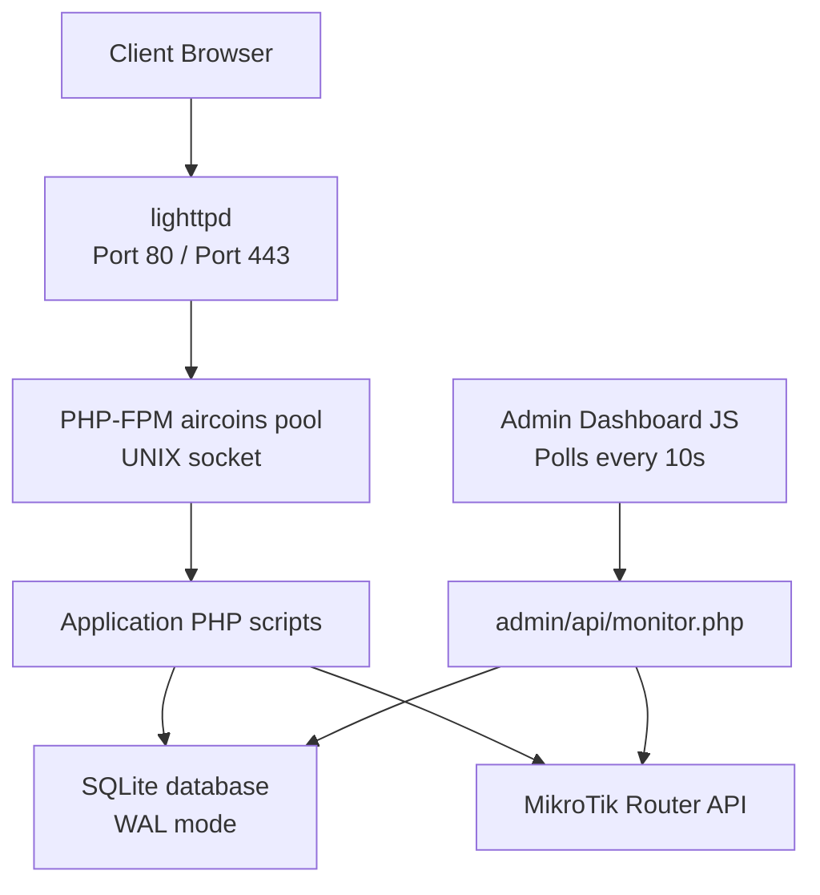
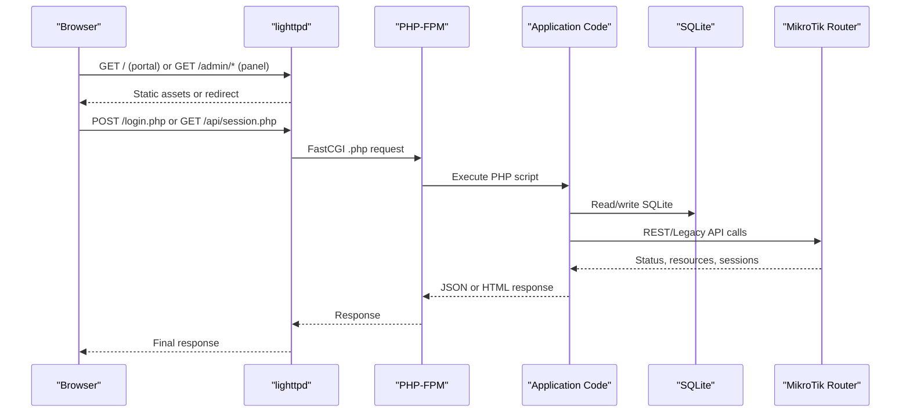
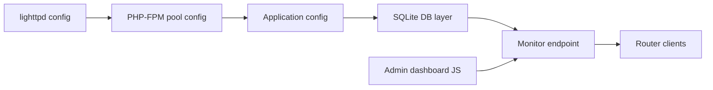

# Performance Optimization

<cite>
**Referenced Files in This Document**
- [aircoins.conf](file://deploy/lighttpd/aircoins.conf)
- [aircoins-pool.conf](file://deploy/php-fpm/aircoins-pool.conf)
- [db.php](file://includes/db.php)
- [config.php](file://includes/config.php)
- [monitor.php](file://admin/api/monitor.php)
- [helpers.php](file://includes/helpers.php)
- [routers.php](file://admin/routers.php)
- [admin.js](file://admin/assets/admin.js)
</cite>

## Table of Contents
1. [Introduction](#introduction)
2. [Project Structure](#project-structure)
3. [Core Components](#core-components)
4. [Architecture Overview](#architecture-overview)
5. [Detailed Component Analysis](#detailed-component-analysis)
6. [Dependency Analysis](#dependency-analysis)
7. [Performance Considerations](#performance-considerations)
8. [Troubleshooting Guide](#troubleshooting-guide)
9. [Conclusion](#conclusion)
10. [Appendices](#appendices)

## Introduction
This document provides performance optimization guidance for the MT-CONTROLLER-PISOWIFI system, focusing on lighttpd web server tuning, PHP-FPM pool configuration, SQLite database performance, application-level parameters, monitoring and profiling techniques, and benchmarking practices. The system is designed for single-board computers and embedded environments where memory, CPU, and storage wear are constrained.

## Project Structure
The performance-relevant parts of the project include:
- Web server configuration under `deploy/lighttpd`.
- PHP runtime configuration under `deploy/php-fpm`.
- Database schema and connection logic under `includes/db.php`.
- Application configuration constants under `includes/config.php`.
- Monitoring endpoint and dashboard polling under `admin/api/monitor.php` and `admin/assets/admin.js`.
- Router management and related database writes under `admin/routers.php`.

**Diagram sources**
- [aircoins.conf:33-41](file://deploy/lighttpd/aircoins.conf#L33-L41)
- [aircoins.conf:102-110](file://deploy/lighttpd/aircoins.conf#L102-L110)
- [aircoins.conf:146-163](file://deploy/lighttpd/aircoins.conf#L146-L163)
- [aircoins-pool.conf:21-45](file://deploy/php-fpm/aircoins-pool.conf#L21-L45)
- [db.php:36-47](file://includes/db.php#L36-L47)
- [monitor.php:21-24](file://admin/api/monitor.php#L21-L24)
- [admin.js:362-382](file://admin/assets/admin.js#L362-L382)

**Section sources**
- [aircoins.conf:33-41](file://deploy/lighttpd/aircoins.conf#L33-L41)
- [aircoins.conf:102-110](file://deploy/lighttpd/aircoins.conf#L102-L110)
- [aircoins.conf:146-163](file://deploy/lighttpd/aircoins.conf#L146-L163)
- [aircoins-pool.conf:21-45](file://deploy/php-fpm/aircoins-pool.conf#L21-L45)
- [db.php:36-47](file://includes/db.php#L36-L47)
- [monitor.php:21-24](file://admin/api/monitor.php#L21-L24)
- [admin.js:362-382](file://admin/assets/admin.js#L362-L382)

## Core Components
- lighttpd serves static portal assets and forwards PHP requests to a dedicated PHP-FPM pool via FastCGI over a UNIX socket. It uses low-resource defaults suitable for SBCs, including limited worker processes and connections.
- PHP-FPM runs an on-demand pool with small child limits and strict memory and execution-time caps. It logs errors and can optionally log slow requests.
- SQLite is used as the persistence layer with WAL journaling, busy timeout, synchronous mode tuned for flash-friendly durability, and foreign keys enabled. Schema creation is idempotent and includes indexes for login attempts and monitor samples.
- Application configuration defines database path, session behavior, idle timeout, and rate-limiting parameters.
- The admin monitor endpoint polls routers, computes interface traffic rates, stores samples, and prunes old data.

**Section sources**
- [aircoins.conf:56-60](file://deploy/lighttpd/aircoins.conf#L56-L60)
- [aircoins.conf:102-110](file://deploy/lighttpd/aircoins.conf#L102-L110)
- [aircoins-pool.conf:38-51](file://deploy/php-fpm/aircoins-pool.conf#L38-L51)
- [db.php:36-47](file://includes/db.php#L36-L47)
- [db.php:114-116](file://includes/db.php#L114-L116)
- [config.php:15-43](file://includes/config.php#L15-L43)
- [monitor.php:106-187](file://admin/api/monitor.php#L106-L187)

## Architecture Overview
The request flow from browser to backend involves:
- lighttpd handling HTTP(S), serving static files, rewriting clean URLs for the admin panel, and forwarding PHP requests to PHP-FPM.
- PHP-FPM executing application code that reads or writes SQLite and communicates with MikroTik routers.
- The admin dashboard periodically polls the monitor endpoint to display router health, resource usage, active sessions, and per-interface traffic rates.

**Diagram sources**
- [aircoins.conf:128-131](file://deploy/lighttpd/aircoins.conf#L128-L131)
- [aircoins.conf:146-163](file://deploy/lighttpd/aircoins.conf#L146-L163)
- [aircoins.conf:102-110](file://deploy/lighttpd/aircoins.conf#L102-L110)
- [monitor.php:21-24](file://admin/api/monitor.php#L21-L24)
- [monitor.php:106-187](file://admin/api/monitor.php#L106-L187)

## Detailed Component Analysis

### lighttpd Tuning Parameters
Key performance-related settings:
- Worker and connection limits:
  - `server.max-worker = 1` reduces process overhead on SBCs.
  - `server.max-connections = 128` caps concurrent connections.
- Event and network backends:
  - `server.event-handler = "linux-sysepoll"` optimizes event processing.
  - `server.network-backend = "linux-sendfile"` improves static file transfer efficiency.
- FastCGI to PHP-FPM:
  - Dedicated socket configured via `fastcgi.server`, with `max-procs = 1` at the lighttpd side; actual concurrency is controlled by PHP-FPM pool settings.
- Security and caching considerations:
  - Access logging is intentionally disabled to reduce SD-card wear.
  - Static file exclusion prevents sensitive extensions from being served directly.
  - Clean URL rewrite for admin panel avoids unnecessary `.php` extensions.

Optimization recommendations:
- Keep `max-worker` at 1 unless CPU cores increase significantly.
- Increase `max-connections` only if load tests show saturation.
- Avoid enabling access logs on flash storage; use alternative metrics collection if needed.
- Ensure TLS is enabled for admin port 443 to avoid plaintext exposure.

**Section sources**
- [aircoins.conf:56-60](file://deploy/lighttpd/aircoins.conf#L56-L60)
- [aircoins.conf:92-110](file://deploy/lighttpd/aircoins.conf#L92-L110)
- [aircoins.conf:128-131](file://deploy/lighttpd/aircoins.conf#L128-L131)
- [aircoins.conf:146-163](file://deploy/lighttpd/aircoins.conf#L146-L163)

### PHP-FPM Pool Optimization
Pool characteristics:
- Process manager set to `ondemand`, spawning workers only when needed and reaping idle ones after a short timeout.
- `pm.max_children = 5` limits concurrent PHP processes.
- `pm.process_idle_timeout = 10s` quickly releases idle workers.
- `pm.max_requests = 500` recycles workers to mitigate memory leaks.
- Memory and execution limits:
  - `memory_limit = 32M` constrains per-process memory.
  - `post_max_size = 2M` and `upload_max_filesize = 2M` limit uploads.
  - `max_execution_time = 30` prevents long-running scripts.
- Hardening and hygiene:
  - Error logging enabled; display_errors off.
  - Session save path isolated under `/var/lib/aircoins/sessions`.
  - `open_basedir` restricts filesystem access to app and data directories.
- Slowlog:
  - Optional slow request tracing can be enabled to diagnose stuck router API calls.

Optimization recommendations:
- For higher concurrency, consider increasing `pm.max_children` cautiously while monitoring memory usage.
- Tune `process_idle_timeout` based on expected request patterns; shorter timeouts save RAM but incur spawn overhead.
- Enable slowlog temporarily during troubleshooting to identify bottlenecks.
- Validate that upload sizes match application needs; adjust `post_max_size` and `upload_max_filesize` accordingly.

**Section sources**
- [aircoins-pool.conf:38-51](file://deploy/php-fpm/aircoins-pool.conf#L38-L51)
- [aircoins-pool.conf:53-72](file://deploy/php-fpm/aircoins-pool.conf#L53-L72)

### SQLite Database Performance
Database configuration:
- WAL journal mode enables concurrent readers and reduces locking contention.
- `busy_timeout=5000` allows retries on temporary database locks.
- `synchronous=NORMAL` balances durability and write performance on flash storage.
- Foreign keys enabled for referential integrity.
- Schema creation is idempotent and includes indexes:
  - `idx_login_attempts_ip_ts` for login attempt queries.
  - `idx_monitor_samples_router_iface_ts` for monitor sample queries.

Query patterns:
- Monitor endpoint performs read-heavy operations with periodic inserts and deletions to bound table growth.
- Router management pages perform CRUD operations with prepared statements and parameter binding.

Optimization recommendations:
- Keep WAL mode enabled for better concurrency.
- Monitor disk I/O and adjust `busy_timeout` if lock contention increases under load.
- Use existing indexes; avoid adding redundant indexes unless query profiles indicate missing coverage.
- Periodically vacuum or optimize the database if fragmentation grows due to frequent deletes.

**Section sources**
- [db.php:36-47](file://includes/db.php#L36-L47)
- [db.php:114-116](file://includes/db.php#L114-L116)
- [monitor.php:164-167](file://admin/api/monitor.php#L164-L167)
- [routers.php:104-107](file://admin/routers.php#L104-L107)

### Application-Level Optimizations
Configuration parameters:
- Database path defined centrally; can be overridden before inclusion.
- Session name and idle timeout configurable; idle timeout enforced in monitor endpoint.
- Rate limiting parameters define maximum failed login attempts within a time window.

Caching mechanisms:
- No explicit application-level cache is implemented; static assets are served by lighttpd.
- Admin dashboard polling interval is fixed at 10 seconds in JavaScript.

Resource allocation:
- PHP-FPM memory limit and execution time cap protect against runaway scripts.
- Open-basedir restricts filesystem access to minimize risk and improve security posture.

Optimization recommendations:
- Adjust `AIRCOINS_IDLE_TIMEOUT` to balance session longevity and security.
- Tune rate-limiting parameters (`AIRCOINS_RATE_MAX`, `AIRCOINS_RATE_WINDOW`) based on observed brute-force attempts.
- Consider client-side caching strategies for static assets if not already handled by CDN or reverse proxy.

**Section sources**
- [config.php:15-43](file://includes/config.php#L15-L43)
- [monitor.php:36-42](file://admin/api/monitor.php#L36-L42)
- [admin.js:362-382](file://admin/assets/admin.js#L362-L382)
- [aircoins-pool.conf:47-72](file://deploy/php-fpm/aircoins-pool.conf#L47-L72)

### Monitoring and Profiling Techniques
Monitoring endpoints:
- `admin/api/monitor.php` returns JSON with router status, resource utilization, active sessions, and interface traffic rates.
- The admin dashboard polls this endpoint every 10 seconds and updates UI cards accordingly.

Profiling approaches:
- Enable PHP-FPM slowlog to trace requests exceeding a threshold.
- Use system-level tools (e.g., top, htop, iostat) to observe CPU, memory, and disk I/O.
- Analyze router API latency and error rates through monitor endpoint responses.

Response time measurement:
- Inspect HTTP response times via browser developer tools or lightweight APM tools.
- Correlate monitor endpoint latency with router reachability and database lock contention.

Resource consumption analysis:
- Track PHP-FPM process count and memory usage to ensure pool sizing is appropriate.
- Monitor SQLite file size and disk I/O to detect excessive writes or fragmentation.

**Section sources**
- [monitor.php:1-17](file://admin/api/monitor.php#L1-17)
- [monitor.php:106-187](file://admin/api/monitor.php#L106-L187)
- [admin.js:362-382](file://admin/assets/admin.js#L362-L382)
- [aircoins-pool.conf:65-68](file://deploy/php-fpm/aircoins-pool.conf#L65-L68)

### Benchmarking Guidelines and Regression Detection
Benchmarking guidelines:
- Define baseline scenarios: captive portal login, admin panel navigation, router list rendering, and monitor feed polling.
- Measure key metrics: time to first byte, total response time, PHP-FPM process count, memory usage, SQLite I/O, and router API latency.
- Use consistent load generators and repeat tests to reduce variance.

Regression detection methods:
- Compare current metrics against historical baselines.
- Alert on significant deviations in response times, error rates, or resource consumption.
- Track monitor endpoint stability and router connectivity over time.

Operational tips:
- Disable access logs to reduce IO overhead during heavy testing.
- Temporarily enable slowlog to capture problematic requests.
- Validate that index usage remains effective as data grows.

[No sources needed since this section provides general guidance]

## Dependency Analysis
The following diagram shows how core components depend on each other:

**Diagram sources**
- [aircoins.conf:33-41](file://deploy/lighttpd/aircoins.conf#L33-L41)
- [aircoins-pool.conf:21-45](file://deploy/php-fpm/aircoins-pool.conf#L21-L45)
- [config.php:15-43](file://includes/config.php#L15-L43)
- [db.php:36-47](file://includes/db.php#L36-L47)
- [monitor.php:21-24](file://admin/api/monitor.php#L21-L24)
- [admin.js:362-382](file://admin/assets/admin.js#L362-L382)

**Section sources**
- [aircoins.conf:33-41](file://deploy/lighttpd/aircoins.conf#L33-L41)
- [aircoins-pool.conf:21-45](file://deploy/php-fpm/aircoins-pool.conf#L21-L45)
- [config.php:15-43](file://includes/config.php#L15-L43)
- [db.php:36-47](file://includes/db.php#L36-L47)
- [monitor.php:21-24](file://admin/api/monitor.php#L21-L24)
- [admin.js:362-382](file://admin/assets/admin.js#L362-L382)

## Performance Considerations
- lighttpd should remain lightweight with minimal workers and connections on SBCs.
- PHP-FPM on-demand pooling conserves memory; tune child limits based on observed concurrency.
- SQLite WAL mode and busy timeout improve concurrency and resilience under load.
- Application-level rate limiting and session timeouts help prevent abuse and resource exhaustion.
- Monitoring endpoint adds overhead proportional to the number of routers; consider scaling polling frequency or reducing router count if necessary.

[No sources needed since this section provides general guidance]

## Troubleshooting Guide
Common issues and resolutions:
- High memory usage:
  - Check PHP-FPM process count and memory limits; consider lowering `pm.max_children` or increasing idle timeout.
- Slow requests:
  - Enable slowlog and inspect router API calls; verify network connectivity and credentials.
- Database lock contention:
  - Increase `busy_timeout` or reduce concurrent writes; validate index usage.
- Excessive disk writes:
  - Confirm access logs are disabled; monitor SQLite file growth and prune monitor samples regularly.

**Section sources**
- [aircoins-pool.conf:65-68](file://deploy/php-fpm/aircoins-pool.conf#L65-L68)
- [db.php:42-45](file://includes/db.php#L42-L45)
- [monitor.php:164-167](file://admin/api/monitor.php#L164-L167)

## Conclusion
The MT-CONTROLLER-PISOWIFI system is optimized for low-resource environments through conservative lighttpd settings, on-demand PHP-FPM pooling, and SQLite with WAL mode. Application-level configurations provide security and rate limiting, while the monitoring endpoint offers visibility into router health and traffic. Proper tuning of these components, combined with monitoring and benchmarking, ensures stable and efficient operation.

[No sources needed since this section summarizes without analyzing specific files]

## Appendices

### Key Configuration Reference
- lighttpd:
  - Worker and connection limits.
  - Event and network backends.
  - FastCGI socket configuration.
- PHP-FPM:
  - Process manager and child limits.
  - Memory and execution limits.
  - Logging and slowlog options.
- SQLite:
  - Journal mode and synchronous settings.
  - Busy timeout and foreign keys.
  - Index definitions for login attempts and monitor samples.
- Application:
  - Database path, session name, idle timeout.
  - Rate-limiting parameters.

**Section sources**
- [aircoins.conf:56-60](file://deploy/lighttpd/aircoins.conf#L56-L60)
- [aircoins.conf:102-110](file://deploy/lighttpd/aircoins.conf#L102-L110)
- [aircoins-pool.conf:38-51](file://deploy/php-fpm/aircoins-pool.conf#L38-L51)
- [db.php:36-47](file://includes/db.php#L36-L47)
- [db.php:114-116](file://includes/db.php#L114-L116)
- [config.php:15-43](file://includes/config.php#L15-L43)